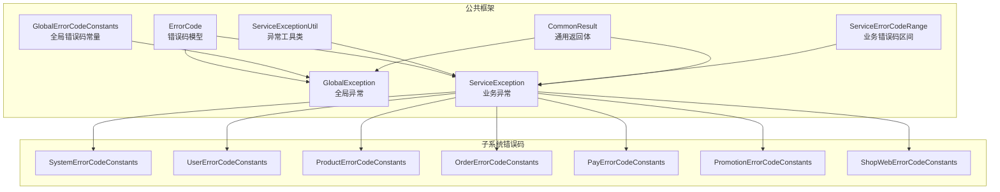
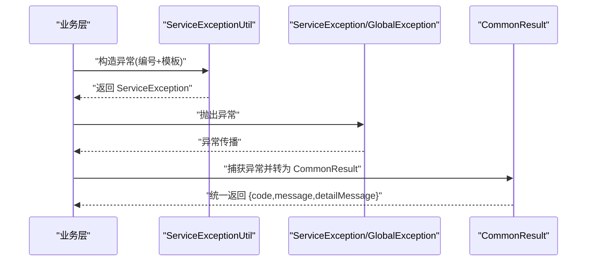
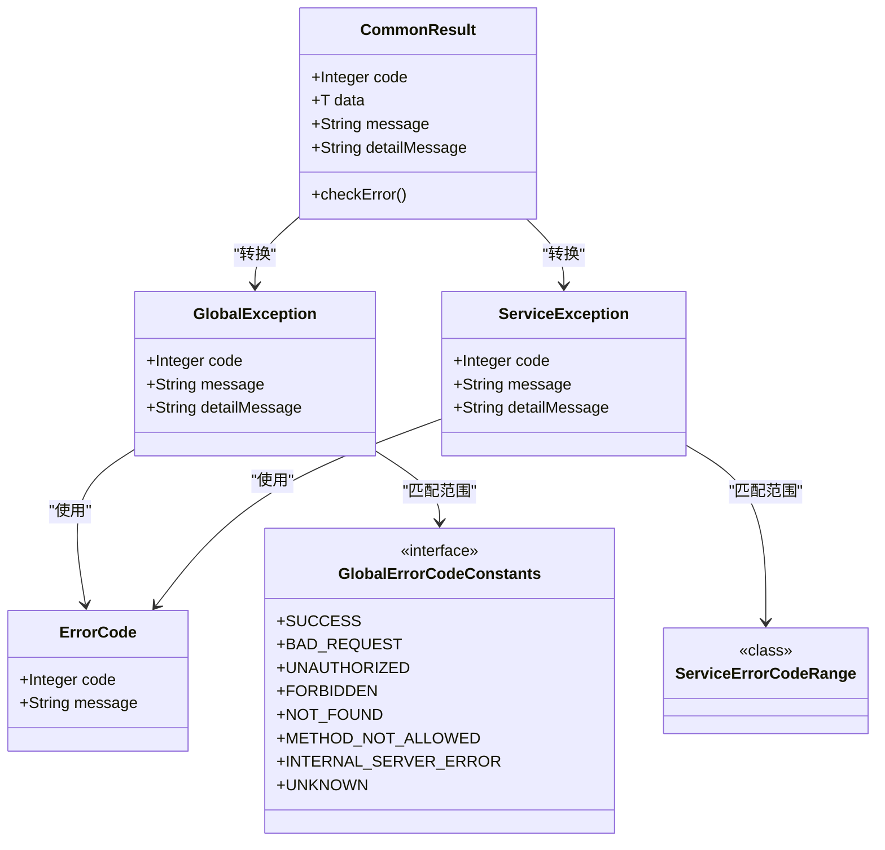
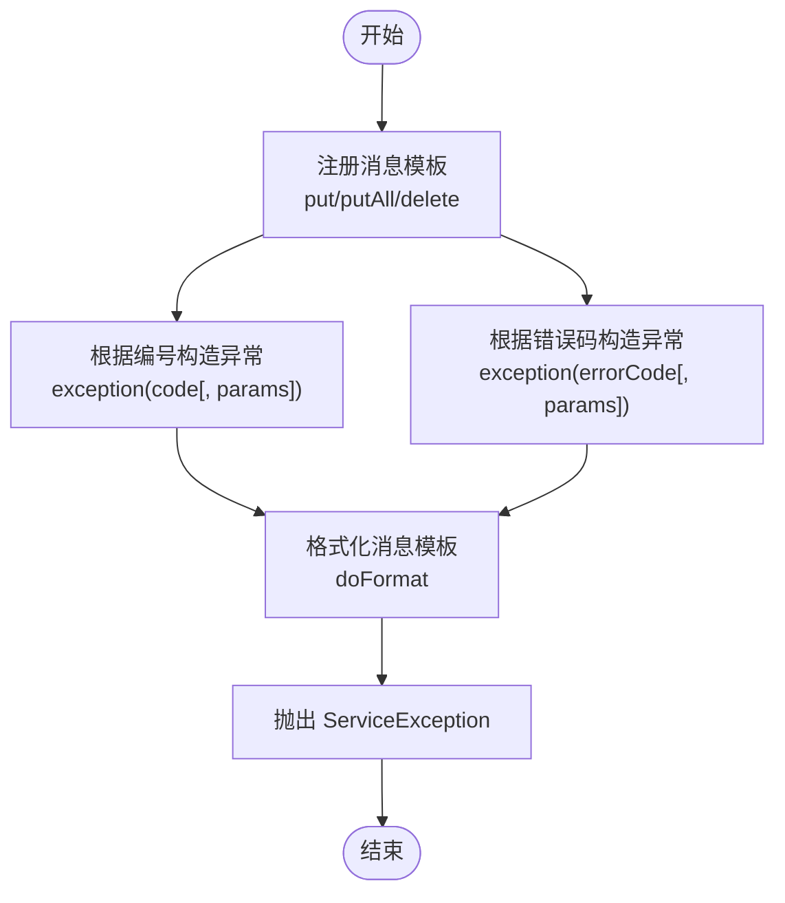
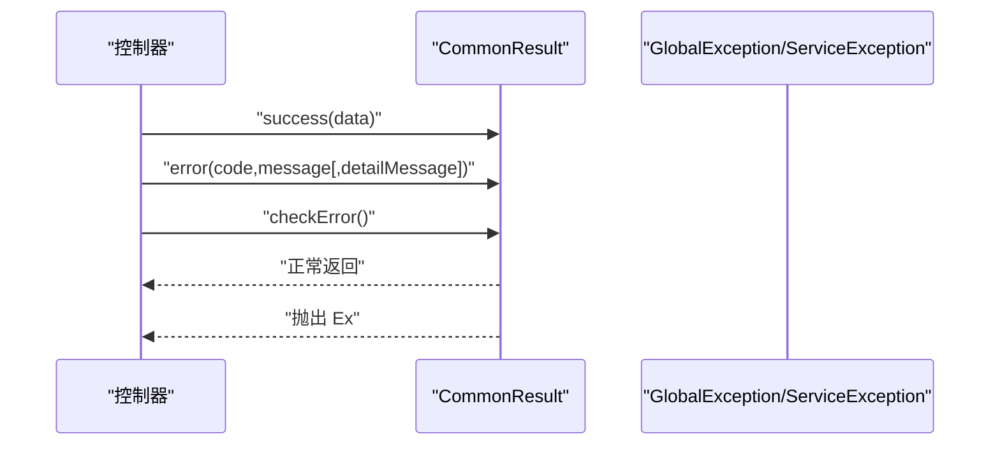
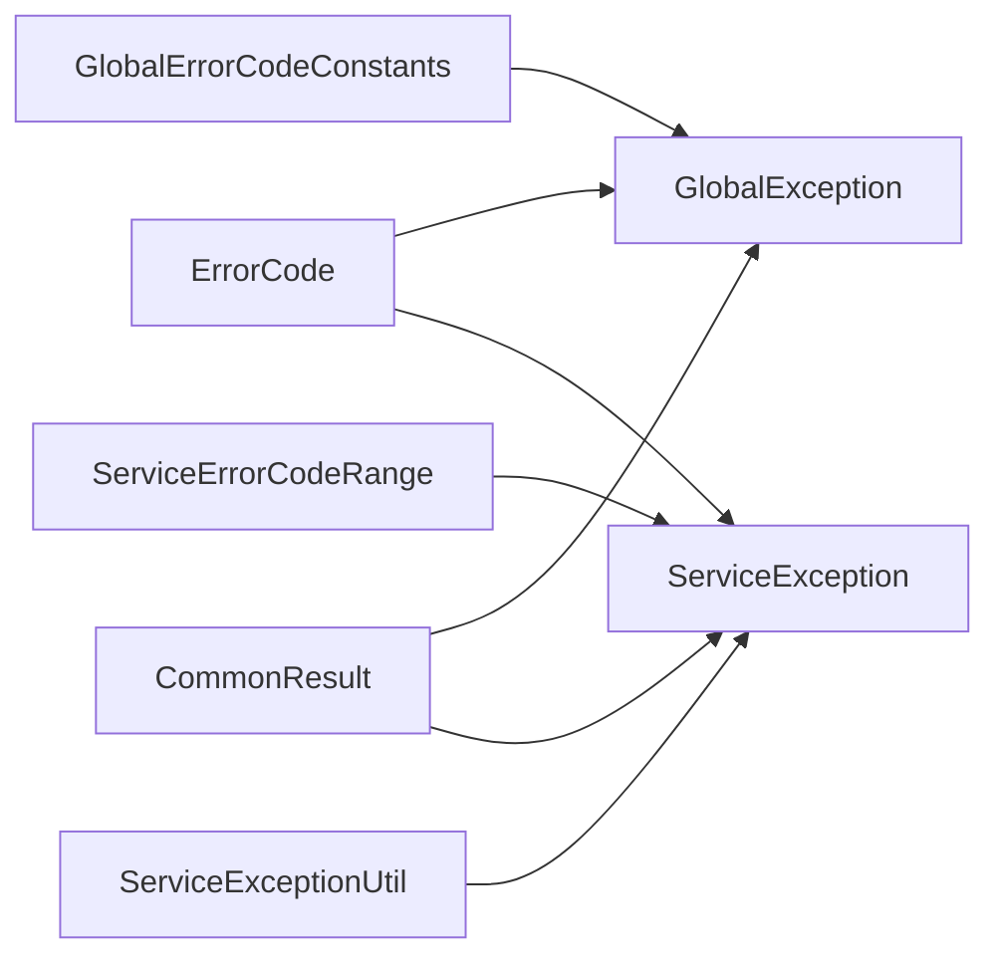

# 异常处理机制

<cite>
**本文引用的文件**
- [ErrorCode.java](file://common/common-framework/src/main/java/cn/iocoder/common/framework/exception/ErrorCode.java)
- [GlobalException.java](file://common/common-framework/src/main/java/cn/iocoder/common/framework/exception/GlobalException.java)
- [ServiceException.java](file://common/common-framework/src/main/java/cn/iocoder/common/framework/exception/ServiceException.java)
- [ServiceExceptionUtil.java](file://common/common-framework/src/main/java/cn/iocoder/common/framework/exception/util/ServiceExceptionUtil.java)
- [GlobalErrorCodeConstants.java](file://common/common-framework/src/main/java/cn/iocoder/common/framework/exception/enums/GlobalErrorCodeConstants.java)
- [ServiceErrorCodeRange.java](file://common/common-framework/src/main/java/cn/iocoder/common/framework/exception/enums/ServiceErrorCodeRange.java)
- [CommonResult.java](file://common/common-framework/src/main/java/cn/iocoder/common/framework/vo/CommonResult.java)
- [SystemErrorCodeConstants.java](file://system-service-project/system-service-api/src/main/java/cn/iocoder/mall/systemservice/enums/SystemErrorCodeConstants.java)
- [UserErrorCodeConstants.java](file://user-service-project/user-service-api/src/main/java/cn/iocoder/mall/userservice/enums/UserErrorCodeConstants.java)
- [ProductErrorCodeConstants.java](file://product-service-project/product-service-api/src/main/java/cn/iocoder/mall/productservice/enums/ProductErrorCodeConstants.java)
- [OrderErrorCodeConstants.java](file://trade-service-project/trade-service-api/src/main/java/cn/iocoder/mall/tradeservice/enums/OrderErrorCodeConstants.java)
- [PayErrorCodeConstants.java](file://pay-service-project/pay-service-api/src/main/java/cn/iocoder/mall/payservice/enums/PayErrorCodeConstants.java)
- [PromotionErrorCodeConstants.java](file://promotion-service-project/promotion-service-api/src/main/java/cn/iocoder/mall/promotion/api/enums/PromotionErrorCodeConstants.java)
- [ShopWebErrorCodeConstants.java](file://shop-web-app/src/main/java/cn/iocoder/mall/shopweb/enums/ShopWebErrorCodeConstants.java)
</cite>

## 目录
1. [简介](#简介)
2. [项目结构](#项目结构)
3. [核心组件](#核心组件)
4. [架构总览](#架构总览)
5. [详细组件分析](#详细组件分析)
6. [依赖关系分析](#依赖关系分析)
7. [性能考量](#性能考量)
8. [故障排查指南](#故障排查指南)
9. [结论](#结论)
10. [附录](#附录)

## 简介
本文件面向 Onemall 项目的异常处理机制，系统性解析错误码设计体系、全局与业务异常的差异与使用场景、异常工具类的使用方法，并提供错误码对照表与异常处理流程图，帮助开发者快速定位与解决问题。

## 项目结构
异常处理相关的核心代码集中在公共框架模块与各子系统的错误码常量定义中：
- 公共框架层提供统一的错误码模型、全局异常、业务异常、异常工具类以及通用返回体。
- 各子系统（如用户、商品、订单、支付、促销、系统、前端 Web）各自维护自身的错误码常量，遵循统一的错误码区间规范。

图表来源
- [ErrorCode.java:1-38](file://common/common-framework/src/main/java/cn/iocoder/common/framework/exception/ErrorCode.java#L1-L38)
- [GlobalException.java:1-72](file://common/common-framework/src/main/java/cn/iocoder/common/framework/exception/GlobalException.java#L1-L72)
- [ServiceException.java:1-72](file://common/common-framework/src/main/java/cn/iocoder/common/framework/exception/ServiceException.java#L1-L72)
- [ServiceExceptionUtil.java:1-123](file://common/common-framework/src/main/java/cn/iocoder/common/framework/exception/util/ServiceExceptionUtil.java#L1-L123)
- [GlobalErrorCodeConstants.java:1-37](file://common/common-framework/src/main/java/cn/iocoder/common/framework/exception/enums/GlobalErrorCodeConstants.java#L1-L37)
- [ServiceErrorCodeRange.java:1-48](file://common/common-framework/src/main/java/cn/iocoder/common/framework/exception/enums/ServiceErrorCodeRange.java#L1-L48)
- [CommonResult.java:1-155](file://common/common-framework/src/main/java/cn/iocoder/common/framework/vo/CommonResult.java#L1-L155)
- [SystemErrorCodeConstants.java](file://system-service-project/system-service-api/src/main/java/cn/iocoder/mall/systemservice/enums/SystemErrorCodeConstants.java)
- [UserErrorCodeConstants.java](file://user-service-project/user-service-api/src/main/java/cn/iocoder/mall/userservice/enums/UserErrorCodeConstants.java)
- [ProductErrorCodeConstants.java](file://product-service-project/product-service-api/src/main/java/cn/iocoder/mall/productservice/enums/ProductErrorCodeConstants.java)
- [OrderErrorCodeConstants.java](file://trade-service-project/trade-service-api/src/main/java/cn/iocoder/mall/tradeservice/enums/OrderErrorCodeConstants.java)
- [PayErrorCodeConstants.java](file://pay-service-project/pay-service-api/src/main/java/cn/iocoder/mall/payservice/enums/PayErrorCodeConstants.java)
- [PromotionErrorCodeConstants.java](file://promotion-service-project/promotion-service-api/src/main/java/cn/iocoder/mall/promotion/api/enums/PromotionErrorCodeConstants.java)
- [ShopWebErrorCodeConstants.java](file://shop-web-app/src/main/java/cn/iocoder/mall/shopweb/enums/ShopWebErrorCodeConstants.java)

章节来源
- [ErrorCode.java:1-38](file://common/common-framework/src/main/java/cn/iocoder/common/framework/exception/ErrorCode.java#L1-L38)
- [GlobalException.java:1-72](file://common/common-framework/src/main/java/cn/iocoder/common/framework/exception/GlobalException.java#L1-L72)
- [ServiceException.java:1-72](file://common/common-framework/src/main/java/cn/iocoder/common/framework/exception/ServiceException.java#L1-L72)
- [ServiceExceptionUtil.java:1-123](file://common/common-framework/src/main/java/cn/iocoder/common/framework/exception/util/ServiceExceptionUtil.java#L1-L123)
- [GlobalErrorCodeConstants.java:1-37](file://common/common-framework/src/main/java/cn/iocoder/common/framework/exception/enums/GlobalErrorCodeConstants.java#L1-L37)
- [ServiceErrorCodeRange.java:1-48](file://common/common-framework/src/main/java/cn/iocoder/common/framework/exception/enums/ServiceErrorCodeRange.java#L1-L48)
- [CommonResult.java:1-155](file://common/common-framework/src/main/java/cn/iocoder/common/framework/vo/CommonResult.java#L1-L155)

## 核心组件
- 错误码模型：封装错误编号与消息，支持国际化扩展设计。
- 全局异常：用于系统级错误（HTTP 状态语义），通过全局错误码常量定义。
- 业务异常：用于业务逻辑错误，采用 10 位错误码区间划分，避免冲突。
- 异常工具类：负责异常消息模板注册与占位符格式化，提供便捷的异常构造。
- 通用返回体：统一对外响应结构，支持从异常转换为返回体。

章节来源
- [ErrorCode.java:13-37](file://common/common-framework/src/main/java/cn/iocoder/common/framework/exception/ErrorCode.java#L13-L37)
- [GlobalException.java:9-71](file://common/common-framework/src/main/java/cn/iocoder/common/framework/exception/GlobalException.java#L9-L71)
- [ServiceException.java:9-71](file://common/common-framework/src/main/java/cn/iocoder/common/framework/exception/ServiceException.java#L9-L71)
- [ServiceExceptionUtil.java:25-122](file://common/common-framework/src/main/java/cn/iocoder/common/framework/exception/util/ServiceExceptionUtil.java#L25-L122)
- [CommonResult.java:17-154](file://common/common-framework/src/main/java/cn/iocoder/common/framework/vo/CommonResult.java#L17-L154)

## 架构总览
异常处理的整体流程如下：
- 业务层根据业务规则抛出 ServiceException 或使用 ServiceExceptionUtil 构造异常。
- 全局层（如 Web 层）捕获异常并转换为 CommonResult 统一返回。
- 全局异常（GlobalException）用于系统级错误，映射到 HTTP 语义错误码。

图表来源
- [ServiceExceptionUtil.java:48-82](file://common/common-framework/src/main/java/cn/iocoder/common/framework/exception/util/ServiceExceptionUtil.java#L48-L82)
- [CommonResult.java:127-154](file://common/common-framework/src/main/java/cn/iocoder/common/framework/vo/CommonResult.java#L127-L154)

## 详细组件分析

### 错误码设计体系与范围管理
- 错误码模型：包含 code 与 message 字段，便于后续国际化扩展。
- 全局错误码范围：0-999，覆盖客户端与服务端常见 HTTP 语义错误。
- 业务错误码区间：10 位编号，按“系统类型-模块-错误码”分段，避免冲突。

图表来源
- [ErrorCode.java:13-37](file://common/common-framework/src/main/java/cn/iocoder/common/framework/exception/ErrorCode.java#L13-L37)
- [GlobalException.java:9-71](file://common/common-framework/src/main/java/cn/iocoder/common/framework/exception/GlobalException.java#L9-L71)
- [ServiceException.java:9-71](file://common/common-framework/src/main/java/cn/iocoder/common/framework/exception/ServiceException.java#L9-L71)
- [GlobalErrorCodeConstants.java:13-36](file://common/common-framework/src/main/java/cn/iocoder/common/framework/exception/enums/GlobalErrorCodeConstants.java#L13-L36)
- [ServiceErrorCodeRange.java:31-47](file://common/common-framework/src/main/java/cn/iocoder/common/framework/exception/enums/ServiceErrorCodeRange.java#L31-L47)
- [CommonResult.java:17-154](file://common/common-framework/src/main/java/cn/iocoder/common/framework/vo/CommonResult.java#L17-L154)

章节来源
- [ErrorCode.java:13-37](file://common/common-framework/src/main/java/cn/iocoder/common/framework/exception/ErrorCode.java#L13-L37)
- [GlobalErrorCodeConstants.java:13-36](file://common/common-framework/src/main/java/cn/iocoder/common/framework/exception/enums/GlobalErrorCodeConstants.java#L13-L36)
- [ServiceErrorCodeRange.java:31-47](file://common/common-framework/src/main/java/cn/iocoder/common/framework/exception/enums/ServiceErrorCodeRange.java#L31-L47)

### 全局异常与业务异常
- 全局异常（GlobalException）
  - 适用范围：系统级错误，映射 HTTP 语义错误码。
  - 特点：包含 detailMessage 用于内部调试，便于问题追踪。
- 业务异常（ServiceException）
  - 适用范围：业务逻辑错误，采用 10 位编号，避免跨模块冲突。
  - 特点：同样支持 detailMessage，便于上下文记录。

最佳实践
- 使用全局异常描述系统不可恢复或非业务可控的问题。
- 使用业务异常描述业务规则违反、参数非法、资源不存在等场景。
- 在工具类中注册消息模板，避免硬编码错误提示。

章节来源
- [GlobalException.java:9-71](file://common/common-framework/src/main/java/cn/iocoder/common/framework/exception/GlobalException.java#L9-L71)
- [ServiceException.java:9-71](file://common/common-framework/src/main/java/cn/iocoder/common/framework/exception/ServiceException.java#L9-L71)

### ServiceExceptionUtil 工具类
- 功能概述
  - 注册/删除消息模板：支持内存注册与批量注册。
  - 构造异常：支持从错误码或编号构造 ServiceException。
  - 占位符格式化：使用 {} 作为占位符，避免 String.format 的参数不匹配风险。
- 使用场景
  - 在启动阶段加载各模块错误码模板。
  - 在业务逻辑中根据编号快速构造异常并抛出。
  - 在异常处理器中统一格式化错误提示。

图表来源
- [ServiceExceptionUtil.java:34-82](file://common/common-framework/src/main/java/cn/iocoder/common/framework/exception/util/ServiceExceptionUtil.java#L34-L82)
- [ServiceExceptionUtil.java:94-120](file://common/common-framework/src/main/java/cn/iocoder/common/framework/exception/util/ServiceExceptionUtil.java#L94-L120)

章节来源
- [ServiceExceptionUtil.java:25-122](file://common/common-framework/src/main/java/cn/iocoder/common/framework/exception/util/ServiceExceptionUtil.java#L25-L122)

### 通用返回体与异常检查
- CommonResult 提供统一的返回结构，包含 code、data、message、detailMessage。
- 提供从异常转换为返回体的方法，以及 checkError 抛出对应异常的能力，便于在控制器层统一处理。

图表来源
- [CommonResult.java:49-154](file://common/common-framework/src/main/java/cn/iocoder/common/framework/vo/CommonResult.java#L49-L154)

章节来源
- [CommonResult.java:17-154](file://common/common-framework/src/main/java/cn/iocoder/common/framework/vo/CommonResult.java#L17-L154)

## 依赖关系分析
- 错误码模型被全局异常与业务异常复用，确保错误信息的一致性。
- 全局错误码常量用于判断是否属于全局异常范围。
- 业务错误码区间用于指导各模块错误码编号分配，避免冲突。
- 异常工具类依赖消息模板映射，支持动态注册与格式化。
- 通用返回体与异常体系集成，提供统一的错误输出。

图表来源
- [GlobalErrorCodeConstants.java:13-36](file://common/common-framework/src/main/java/cn/iocoder/common/framework/exception/enums/GlobalErrorCodeConstants.java#L13-L36)
- [ServiceErrorCodeRange.java:31-47](file://common/common-framework/src/main/java/cn/iocoder/common/framework/exception/enums/ServiceErrorCodeRange.java#L31-L47)
- [ErrorCode.java:13-37](file://common/common-framework/src/main/java/cn/iocoder/common/framework/exception/ErrorCode.java#L13-L37)
- [ServiceExceptionUtil.java:25-122](file://common/common-framework/src/main/java/cn/iocoder/common/framework/exception/util/ServiceExceptionUtil.java#L25-L122)
- [CommonResult.java:17-154](file://common/common-framework/src/main/java/cn/iocoder/common/framework/vo/CommonResult.java#L17-L154)

章节来源
- [GlobalErrorCodeConstants.java:13-36](file://common/common-framework/src/main/java/cn/iocoder/common/framework/exception/enums/GlobalErrorCodeConstants.java#L13-L36)
- [ServiceErrorCodeRange.java:31-47](file://common/common-framework/src/main/java/cn/iocoder/common/framework/exception/enums/ServiceErrorCodeRange.java#L31-L47)
- [ServiceExceptionUtil.java:25-122](file://common/common-framework/src/main/java/cn/iocoder/common/framework/exception/util/ServiceExceptionUtil.java#L25-L122)
- [CommonResult.java:17-154](file://common/common-framework/src/main/java/cn/iocoder/common/framework/vo/CommonResult.java#L17-L154)

## 性能考量
- 异常工具类的消息模板采用并发安全的映射结构，适合多线程环境。
- 占位符格式化采用预估缓冲区长度与索引扫描，避免频繁扩容与字符串拼接开销。
- 建议在应用启动阶段完成消息模板的批量注册，减少运行期动态加载成本。

## 故障排查指南
- 检查错误码范围
  - 全局异常：确认 code 是否在 0-999 范围内。
  - 业务异常：确认 code 是否符合 10 位编号区间规范。
- 检查消息模板
  - 确认 ServiceExceptionUtil 中是否已注册对应编号的消息模板。
  - 若模板缺失，将回退到默认 message。
- 检查异常抛出与捕获
  - 确保在业务层正确抛出 ServiceException 或 GlobalException。
  - 在控制器层使用 CommonResult.checkError 或 error 方法进行统一转换。
- 日志与细节
  - 关注 detailMessage 字段，便于定位具体上下文。
  - 格式化参数不足或过多时，工具类会记录错误日志，便于修正模板。

章节来源
- [GlobalErrorCodeConstants.java:31-36](file://common/common-framework/src/main/java/cn/iocoder/common/framework/exception/enums/GlobalErrorCodeConstants.java#L31-L36)
- [ServiceErrorCodeRange.java:31-47](file://common/common-framework/src/main/java/cn/iocoder/common/framework/exception/enums/ServiceErrorCodeRange.java#L31-L47)
- [ServiceExceptionUtil.java:94-120](file://common/common-framework/src/main/java/cn/iocoder/common/framework/exception/util/ServiceExceptionUtil.java#L94-L120)
- [CommonResult.java:127-154](file://common/common-framework/src/main/java/cn/iocoder/common/framework/vo/CommonResult.java#L127-L154)

## 结论
Onemall 的异常处理机制通过统一的错误码模型、清晰的全局与业务异常区分、灵活的消息模板工具与统一的返回体，实现了高内聚、低耦合且易于扩展的错误处理体系。遵循本文档的错误码区间与最佳实践，可显著提升开发效率与问题定位速度。

## 附录

### 错误码对照表（节选）
以下为各子系统的错误码常量文件（按模块分类），用于参考与对齐：

- 系统服务错误码
  - [SystemErrorCodeConstants.java](file://system-service-project/system-service-api/src/main/java/cn/iocoder/mall/systemservice/enums/SystemErrorCodeConstants.java)
- 用户服务错误码
  - [UserErrorCodeConstants.java](file://user-service-project/user-service-api/src/main/java/cn/iocoder/mall/userservice/enums/UserErrorCodeConstants.java)
- 商品服务错误码
  - [ProductErrorCodeConstants.java](file://product-service-project/product-service-api/src/main/java/cn/iocoder/mall/productservice/enums/ProductErrorCodeConstants.java)
- 订单服务错误码
  - [OrderErrorCodeConstants.java](file://trade-service-project/trade-service-api/src/main/java/cn/iocoder/mall/tradeservice/enums/OrderErrorCodeConstants.java)
- 支付服务错误码
  - [PayErrorCodeConstants.java](file://pay-service-project/pay-service-api/src/main/java/cn/iocoder/mall/payservice/enums/PayErrorCodeConstants.java)
- 促销服务错误码
  - [PromotionErrorCodeConstants.java](file://promotion-service-project/promotion-service-api/src/main/java/cn/iocoder/mall/promotion/api/enums/PromotionErrorCodeConstants.java)
- 商城 Web 错误码
  - [ShopWebErrorCodeConstants.java](file://shop-web-app/src/main/java/cn/iocoder/mall/shopweb/enums/ShopWebErrorCodeConstants.java)

章节来源
- [SystemErrorCodeConstants.java](file://system-service-project/system-service-api/src/main/java/cn/iocoder/mall/systemservice/enums/SystemErrorCodeConstants.java)
- [UserErrorCodeConstants.java](file://user-service-project/user-service-api/src/main/java/cn/iocoder/mall/userservice/enums/UserErrorCodeConstants.java)
- [ProductErrorCodeConstants.java](file://product-service-project/product-service-api/src/main/java/cn/iocoder/mall/productservice/enums/ProductErrorCodeConstants.java)
- [OrderErrorCodeConstants.java](file://trade-service-project/trade-service-api/src/main/java/cn/iocoder/mall/tradeservice/enums/OrderErrorCodeConstants.java)
- [PayErrorCodeConstants.java](file://pay-service-project/pay-service-api/src/main/java/cn/iocoder/mall/payservice/enums/PayErrorCodeConstants.java)
- [PromotionErrorCodeConstants.java](file://promotion-service-project/promotion-service-api/src/main/java/cn/iocoder/mall/promotion/api/enums/PromotionErrorCodeConstants.java)
- [ShopWebErrorCodeConstants.java](file://shop-web-app/src/main/java/cn/iocoder/mall/shopweb/enums/ShopWebErrorCodeConstants.java)