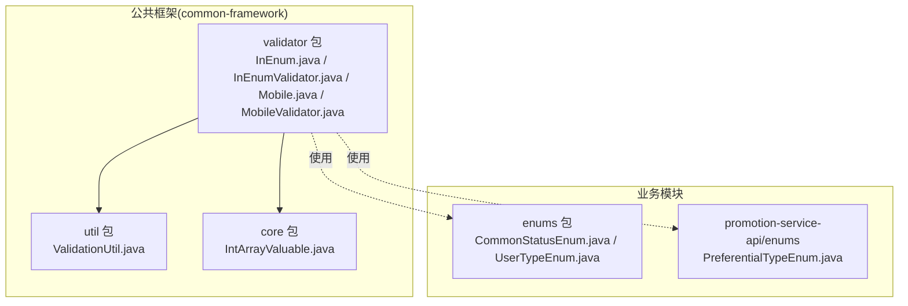
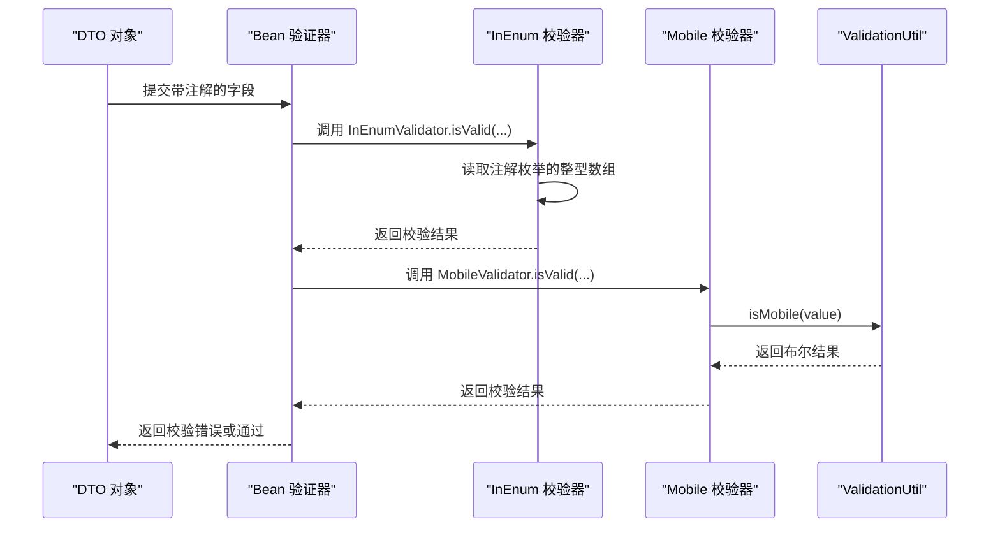
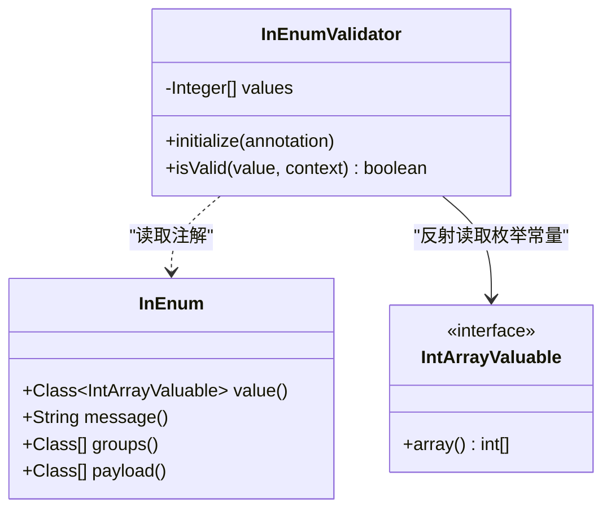
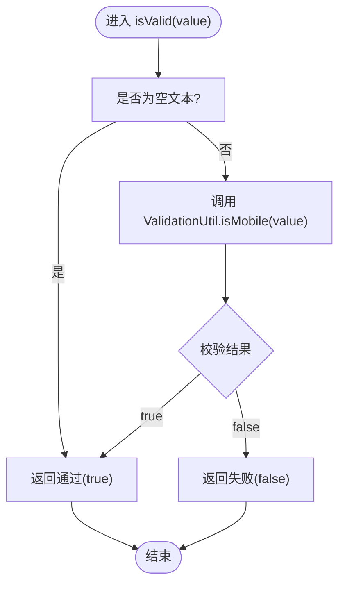
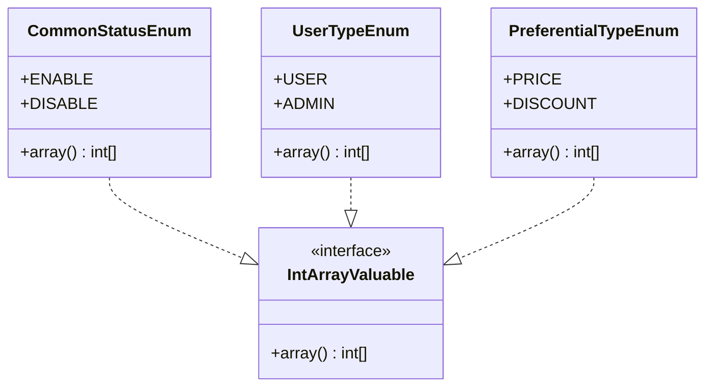
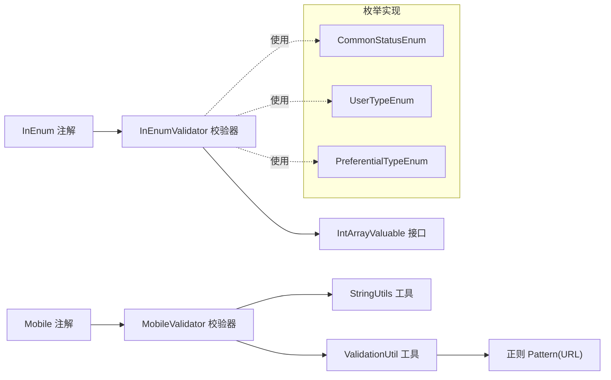

# 数据校验组件

<cite>
**本文引用的文件**
- [InEnum.java](file://common/common-framework/src/main/java/cn/iocoder/common/framework/validator/InEnum.java)
- [InEnumValidator.java](file://common/common-framework/src/main/java/cn/iocoder/common/framework/validator/InEnumValidator.java)
- [Mobile.java](file://common/common-framework/src/main/java/cn/iocoder/common/framework/validator/Mobile.java)
- [MobileValidator.java](file://common/common-framework/src/main/java/cn/iocoder/common/framework/validator/MobileValidator.java)
- [ValidationUtil.java](file://common/common-framework/src/main/java/cn/iocoder/common/framework/util/ValidationUtil.java)
- [IntArrayValuable.java](file://common/common-framework/src/main/java/cn/iocoder/common/framework/core/IntArrayValuable.java)
- [CommonStatusEnum.java](file://common/common-framework/src/main/java/cn/iocoder/common/framework/enums/CommonStatusEnum.java)
- [UserTypeEnum.java](file://common/common-framework/src/main/java/cn/iocoder/common/framework/enums/UserTypeEnum.java)
- [PreferentialTypeEnum.java](file://promotion-service-project/promotion-service-api/src/main/java/cn/iocoder/mall/promotion/api/enums/PreferentialTypeEnum.java)
</cite>

## 目录
1. [简介](#简介)
2. [项目结构](#项目结构)
3. [核心组件](#核心组件)
4. [架构总览](#架构总览)
5. [详细组件分析](#详细组件分析)
6. [依赖分析](#依赖分析)
7. [性能考虑](#性能考虑)
8. [故障排查指南](#故障排查指南)
9. [结论](#结论)
10. [附录：使用示例与最佳实践](#附录使用示例与最佳实践)

## 简介
本文件系统性梳理 Onemall 项目的“数据校验组件”，重点覆盖以下内容：
- InEnum 与 InEnumValidator：基于注解的整型枚举值域校验机制，说明如何通过注解声明式地限定字段取值范围，并由校验器在运行期进行验证。
- Mobile 与 MobileValidator：手机号格式校验注解的设计思路，当前实现对长度与基本格式的判断，以及未来可扩展的国际化手机号支持建议。
- 自定义校验器开发方法与扩展机制：如何基于 JSR 303 规范编写新的约束注解与校验器，以满足业务多样化的校验需求。

## 项目结构
数据校验组件位于公共框架模块 common-framework 的 validator 包内，配套工具类与接口位于 util 与 core 包；枚举值域常量实现位于各业务模块的 enums 或 api/enums 下，统一实现 IntArrayValuable 接口以便 InEnum 校验器读取。

图示来源
- [InEnum.java:1-36](file://common/common-framework/src/main/java/cn/iocoder/common/framework/validator/InEnum.java#L1-L36)
- [InEnumValidator.java:1-44](file://common/common-framework/src/main/java/cn/iocoder/common/framework/validator/InEnumValidator.java#L1-L44)
- [Mobile.java:1-29](file://common/common-framework/src/main/java/cn/iocoder/common/framework/validator/Mobile.java#L1-L29)
- [MobileValidator.java:1-26](file://common/common-framework/src/main/java/cn/iocoder/common/framework/validator/MobileValidator.java#L1-L26)
- [ValidationUtil.java:1-30](file://common/common-framework/src/main/java/cn/iocoder/common/framework/util/ValidationUtil.java#L1-L30)
- [IntArrayValuable.java:1-14](file://common/common-framework/src/main/java/cn/iocoder/common/framework/core/IntArrayValuable.java#L1-L14)
- [CommonStatusEnum.java:1-45](file://common/common-framework/src/main/java/cn/iocoder/common/framework/enums/CommonStatusEnum.java#L1-L45)
- [UserTypeEnum.java:1-45](file://common/common-framework/src/main/java/cn/iocoder/common/framework/enums/UserTypeEnum.java#L1-L45)
- [PreferentialTypeEnum.java:1-47](file://promotion-service-project/promotion-service-api/src/main/java/cn/iocoder/mall/promotion/api/enums/PreferentialTypeEnum.java#L1-L47)

章节来源
- [InEnum.java:1-36](file://common/common-framework/src/main/java/cn/iocoder/common/framework/validator/InEnum.java#L1-L36)
- [InEnumValidator.java:1-44](file://common/common-framework/src/main/java/cn/iocoder/common/framework/validator/InEnumValidator.java#L1-L44)
- [Mobile.java:1-29](file://common/common-framework/src/main/java/cn/iocoder/common/framework/validator/Mobile.java#L1-L29)
- [MobileValidator.java:1-26](file://common/common-framework/src/main/java/cn/iocoder/common/framework/validator/MobileValidator.java#L1-L26)
- [ValidationUtil.java:1-30](file://common/common-framework/src/main/java/cn/iocoder/common/framework/util/ValidationUtil.java#L1-L30)
- [IntArrayValuable.java:1-14](file://common/common-framework/src/main/java/cn/iocoder/common/framework/core/IntArrayValuable.java#L1-L14)
- [CommonStatusEnum.java:1-45](file://common/common-framework/src/main/java/cn/iocoder/common/framework/enums/CommonStatusEnum.java#L1-L45)
- [UserTypeEnum.java:1-45](file://common/common-framework/src/main/java/cn/iocoder/common/framework/enums/UserTypeEnum.java#L1-L45)
- [PreferentialTypeEnum.java:1-47](file://promotion-service-project/promotion-service-api/src/main/java/cn/iocoder/mall/promotion/api/enums/PreferentialTypeEnum.java#L1-L47)

## 核心组件
- InEnum 注解：用于声明某个整型字段必须属于某个枚举集合的取值范围。通过注解参数指定实现 IntArrayValuable 的枚举类，运行期由 InEnumValidator 读取该枚举的整型数组进行包含性校验。
- InEnumValidator 校验器：初始化阶段反射读取注解指定枚举的所有常量，提取其整型数组作为合法值集；校验时若值为 null 则默认通过，否则检查是否包含于合法集合；失败时替换默认提示模板中的占位符并返回失败。
- Mobile 注解：用于声明字符串类型的手机号字段需满足格式要求。当前实现委托 ValidationUtil 进行校验。
- MobileValidator 校验器：空值默认通过，非空时调用 ValidationUtil.isMobile 判断。
- ValidationUtil 工具：提供 isMobile、isURL 等静态校验方法。其中 isMobile 当前仅做长度与基础判断，后续可扩展为更严格的正则或国际区号支持。
- IntArrayValuable 接口：定义 array() 方法返回整型数组，供 InEnumValidator 读取合法值集合。

章节来源
- [InEnum.java:22-35](file://common/common-framework/src/main/java/cn/iocoder/common/framework/validator/InEnum.java#L22-L35)
- [InEnumValidator.java:12-41](file://common/common-framework/src/main/java/cn/iocoder/common/framework/validator/InEnumValidator.java#L12-L41)
- [Mobile.java:20-28](file://common/common-framework/src/main/java/cn/iocoder/common/framework/validator/Mobile.java#L20-L28)
- [MobileValidator.java:9-25](file://common/common-framework/src/main/java/cn/iocoder/common/framework/validator/MobileValidator.java#L9-L25)
- [ValidationUtil.java:12-18](file://common/common-framework/src/main/java/cn/iocoder/common/framework/util/ValidationUtil.java#L12-L18)
- [IntArrayValuable.java:6-13](file://common/common-framework/src/main/java/cn/iocoder/common/framework/core/IntArrayValuable.java#L6-L13)

## 架构总览
下图展示了注解驱动的校验流程：请求进入后，Bean 验证器根据字段上的注解触发对应的 ConstraintValidator，完成运行期校验。

图示来源
- [InEnumValidator.java:16-41](file://common/common-framework/src/main/java/cn/iocoder/common/framework/validator/InEnumValidator.java#L16-L41)
- [MobileValidator.java:15-23](file://common/common-framework/src/main/java/cn/iocoder/common/framework/validator/MobileValidator.java#L15-L23)
- [ValidationUtil.java:12-18](file://common/common-framework/src/main/java/cn/iocoder/common/framework/util/ValidationUtil.java#L12-L18)

## 详细组件分析

### InEnum 与 InEnumValidator：整型枚举值域校验
- 设计要点
  - 注解 InEnum 通过 value 指定一个实现 IntArrayValuable 的枚举类，运行期通过反射读取其枚举常量数组，提取整型数组作为合法值集合。
  - 校验器 InEnumValidator 在初始化时缓存合法值集合；校验时对 null 值默认放行，避免强制必填导致的误判；若不在集合内，则禁用默认消息并以模板替换的方式输出包含所有合法值的提示。
- 复杂度与性能
  - 初始化阶段：读取枚举常量并映射为整型列表，时间复杂度 O(n)，n 为枚举常量数量，通常很小，开销可忽略。
  - 校验阶段：对单个整数进行包含性检查，平均 O(log n) 或 O(n)（取决于内部实现），通常为 O(n) 列表查找，n 很小，性能优良。
- 错误处理
  - 空值放行策略：null 值直接返回通过，便于与 @NotBlank 等其他注解组合使用。
  - 自定义提示：当校验失败时，替换模板中的 {value} 占位符为合法值集合字符串，提升可读性。
- 扩展建议
  - 支持多枚举值域：可通过新增注解参数或组合注解实现“多枚举 OR”逻辑。
  - 缓存优化：对常用枚举的合法值集合进行进程级缓存，减少重复反射开销。

图示来源
- [InEnum.java:22-35](file://common/common-framework/src/main/java/cn/iocoder/common/framework/validator/InEnum.java#L22-L35)
- [InEnumValidator.java:12-41](file://common/common-framework/src/main/java/cn/iocoder/common/framework/validator/InEnumValidator.java#L12-L41)
- [IntArrayValuable.java:6-13](file://common/common-framework/src/main/java/cn/iocoder/common/framework/core/IntArrayValuable.java#L6-L13)

章节来源
- [InEnum.java:22-35](file://common/common-framework/src/main/java/cn/iocoder/common/framework/validator/InEnum.java#L22-L35)
- [InEnumValidator.java:12-41](file://common/common-framework/src/main/java/cn/iocoder/common/framework/validator/InEnumValidator.java#L12-L41)
- [IntArrayValuable.java:6-13](file://common/common-framework/src/main/java/cn/iocoder/common/framework/core/IntArrayValuable.java#L6-L13)

### Mobile 与 MobileValidator：手机号格式校验
- 设计要点
  - 注解 Mobile 声明手机号字段的格式约束，校验器 MobileValidator 对空值默认放行，非空时委托 ValidationUtil.isMobile 判断。
  - ValidationUtil.isMobile 当前实现仅检查长度与基础合法性，尚未引入复杂的正则或国际区号支持。
- 正则与国际化支持建议
  - 正则规则：可参考常见的 11 位中国大陆手机号规则，结合可选的国家/地区前缀（如 +86）进行扩展。
  - 国际化：建议引入国家/地区代码库与对应号码段规则，按前缀匹配不同国家的手机号格式。
  - 分离校验：将“长度/前缀/号码段”拆分为多个子规则，便于组合与复用。
- 错误处理
  - 空值放行与明确提示：空值不报错，非空但格式不符时返回默认提示，可在上层统一拦截并转换为业务错误码。

图示来源
- [MobileValidator.java:15-23](file://common/common-framework/src/main/java/cn/iocoder/common/framework/validator/MobileValidator.java#L15-L23)
- [ValidationUtil.java:12-18](file://common/common-framework/src/main/java/cn/iocoder/common/framework/util/ValidationUtil.java#L12-L18)

章节来源
- [Mobile.java:20-28](file://common/common-framework/src/main/java/cn/iocoder/common/framework/validator/Mobile.java#L20-L28)
- [MobileValidator.java:9-25](file://common/common-framework/src/main/java/cn/iocoder/common/framework/validator/MobileValidator.java#L9-L25)
- [ValidationUtil.java:12-18](file://common/common-framework/src/main/java/cn/iocoder/common/framework/util/ValidationUtil.java#L12-L18)

### IntArrayValuable 与枚举实现：值域来源
- IntArrayValuable 接口定义了 array() 方法，返回整型数组，作为 InEnumValidator 的合法值来源。
- 典型实现
  - CommonStatusEnum：通用状态枚举，包含启用/禁用两个整型值。
  - UserTypeEnum：用户类型枚举，包含用户/管理员两类整型值。
  - PreferentialTypeEnum：促销优惠类型枚举，包含减价/打折等整型值。
- 使用方式
  - 在 DTO 字段上使用 @InEnum(value = CommonStatusEnum.class) 等，即可限定该字段只能取这些枚举的整型值。

图示来源
- [IntArrayValuable.java:6-13](file://common/common-framework/src/main/java/cn/iocoder/common/framework/core/IntArrayValuable.java#L6-L13)
- [CommonStatusEnum.java:10-44](file://common/common-framework/src/main/java/cn/iocoder/common/framework/enums/CommonStatusEnum.java#L10-L44)
- [UserTypeEnum.java:10-44](file://common/common-framework/src/main/java/cn/iocoder/common/framework/enums/UserTypeEnum.java#L10-L44)
- [PreferentialTypeEnum.java:10-46](file://promotion-service-project/promotion-service-api/src/main/java/cn/iocoder/mall/promotion/api/enums/PreferentialTypeEnum.java#L10-L46)

章节来源
- [IntArrayValuable.java:6-13](file://common/common-framework/src/main/java/cn/iocoder/common/framework/core/IntArrayValuable.java#L6-L13)
- [CommonStatusEnum.java:10-44](file://common/common-framework/src/main/java/cn/iocoder/common/framework/enums/CommonStatusEnum.java#L10-L44)
- [UserTypeEnum.java:10-44](file://common/common-framework/src/main/java/cn/iocoder/common/framework/enums/UserTypeEnum.java#L10-L44)
- [PreferentialTypeEnum.java:10-46](file://promotion-service-project/promotion-service-api/src/main/java/cn/iocoder/mall/promotion/api/enums/PreferentialTypeEnum.java#L10-L46)

## 依赖分析
- InEnumValidator 依赖
  - JSR 303 接口 ConstraintValidator 与注解 InEnum。
  - IntArrayValuable 接口，用于从枚举读取整型数组。
- MobileValidator 依赖
  - JSR 303 接口 ConstraintValidator 与注解 Mobile。
  - StringUtils 与 ValidationUtil，前者用于空值判断，后者提供 isMobile。
- ValidationUtil 依赖
  - 正则表达式 Pattern（用于 URL 校验），手机号校验预留扩展点。

图示来源
- [InEnum.java:19-21](file://common/common-framework/src/main/java/cn/iocoder/common/framework/validator/InEnum.java#L19-L21)
- [InEnumValidator.java:3-10](file://common/common-framework/src/main/java/cn/iocoder/common/framework/validator/InEnumValidator.java#L3-L10)
- [IntArrayValuable.java:6-13](file://common/common-framework/src/main/java/cn/iocoder/common/framework/core/IntArrayValuable.java#L6-L13)
- [Mobile.java:17-19](file://common/common-framework/src/main/java/cn/iocoder/common/framework/validator/Mobile.java#L17-L19)
- [MobileValidator.java:3-7](file://common/common-framework/src/main/java/cn/iocoder/common/framework/validator/MobileValidator.java#L3-L7)
- [ValidationUtil.java:3-4](file://common/common-framework/src/main/java/cn/iocoder/common/framework/util/ValidationUtil.java#L3-L4)

章节来源
- [InEnum.java:19-21](file://common/common-framework/src/main/java/cn/iocoder/common/framework/validator/InEnum.java#L19-L21)
- [InEnumValidator.java:3-10](file://common/common-framework/src/main/java/cn/iocoder/common/framework/validator/InEnumValidator.java#L3-L10)
- [Mobile.java:17-19](file://common/common-framework/src/main/java/cn/iocoder/common/framework/validator/Mobile.java#L17-L19)
- [MobileValidator.java:3-7](file://common/common-framework/src/main/java/cn/iocoder/common/framework/validator/MobileValidator.java#L3-L7)
- [ValidationUtil.java:3-4](file://common/common-framework/src/main/java/cn/iocoder/common/framework/util/ValidationUtil.java#L3-L4)

## 性能考虑
- InEnumValidator
  - 初始化阶段的反射与数组映射成本极低，适合在应用启动时一次性完成。
  - 校验阶段的包含性检查为线性查找，由于枚举规模较小，性能优异；若未来枚举规模扩大，可考虑使用 HashSet 以降低查找复杂度。
- MobileValidator
  - 当前 isMobile 仅做简单判断，性能开销微乎其微；若扩展为复杂正则，应避免在高频路径重复编译正则，建议预编译并缓存 Pattern。
- 组合注解
  - 将 @NotBlank 与 @InEnum 组合使用时，空值先被放行，再由 @NotBlank 拦截，避免不必要的枚举扫描。

## 故障排查指南
- InEnum 校验失败但提示不友好
  - 检查注解是否正确指向实现了 IntArrayValuable 的枚举类。
  - 确认枚举的 array() 是否返回了期望的整型数组。
  - 若提示仍显示 {value} 未替换，确认上下文模板是否被禁用后再重建。
- Mobile 校验频繁失败
  - 确认传入值是否为 null 或空字符串，空值会被默认放行。
  - 检查 ValidationUtil.isMobile 的实现是否满足当前业务需求，必要时扩展为更严格的规则。
- 枚举值域变更后校验异常
  - 更新枚举的 array() 返回值后，确保 InEnumValidator 的缓存逻辑不会导致旧值残留（初始化只执行一次，无需额外处理）。

章节来源
- [InEnumValidator.java:16-41](file://common/common-framework/src/main/java/cn/iocoder/common/framework/validator/InEnumValidator.java#L16-L41)
- [MobileValidator.java:15-23](file://common/common-framework/src/main/java/cn/iocoder/common/framework/validator/MobileValidator.java#L15-L23)
- [ValidationUtil.java:12-18](file://common/common-framework/src/main/java/cn/iocoder/common/framework/util/ValidationUtil.java#L12-L18)

## 结论
Onemall 的数据校验组件以 JSR 303 为基础，通过 InEnum 与 Mobile 两大注解分别覆盖“整型枚举值域”和“手机号格式”的常见业务场景。InEnumValidator 采用反射读取枚举整型数组，具备良好的可维护性与扩展性；MobileValidator 将格式判断委托给工具类，便于后续国际化与复杂规则演进。整体设计简洁清晰，易于在 DTO 中组合使用，满足大多数业务校验需求。

## 附录：使用示例与最佳实践
- 在 DTO 中使用 InEnum
  - 示例路径：在任意 DTO 字段上添加注解，例如 [CommonStatusEnum.java:10-44](file://common/common-framework/src/main/java/cn/iocoder/common/framework/enums/CommonStatusEnum.java#L10-L44) 所示的枚举，然后在 DTO 字段上标注 @InEnum(value = CommonStatusEnum.class)。
  - 组合注解：与 @NotBlank 或 @NotNull 组合，确保字段既不能为空又在合法值域内。
- 在 DTO 中使用 Mobile
  - 示例路径：在字符串类型的手机号字段上添加 @Mobile 注解，校验器会自动调用 ValidationUtil.isMobile。
  - 国际化建议：当前 isMobile 未实现复杂规则，建议在 ValidationUtil 中扩展为支持国际区号与号码段的正则校验。
- 自定义校验器开发步骤
  - 定义注解：参考 InEnum 与 Mobile 的元注解配置，声明 validatedBy 指向你的校验器类。
  - 实现校验器：实现 ConstraintValidator<T, V>，在 isValid 中编写校验逻辑，必要时使用工具类辅助。
  - 配置提示：通过 ConstraintValidatorContext 控制默认消息与模板替换，提升用户体验。
  - 测试与集成：编写单元测试覆盖空值、边界值与非法值场景，并在控制器层统一捕获校验异常。

章节来源
- [InEnum.java:9-21](file://common/common-framework/src/main/java/cn/iocoder/common/framework/validator/InEnum.java#L9-L21)
- [Mobile.java:7-19](file://common/common-framework/src/main/java/cn/iocoder/common/framework/validator/Mobile.java#L7-L19)
- [InEnumValidator.java:16-41](file://common/common-framework/src/main/java/cn/iocoder/common/framework/validator/InEnumValidator.java#L16-L41)
- [MobileValidator.java:15-23](file://common/common-framework/src/main/java/cn/iocoder/common/framework/validator/MobileValidator.java#L15-L23)
- [ValidationUtil.java:12-18](file://common/common-framework/src/main/java/cn/iocoder/common/framework/util/ValidationUtil.java#L12-L18)