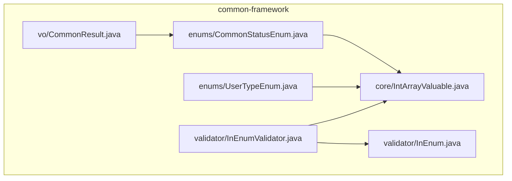
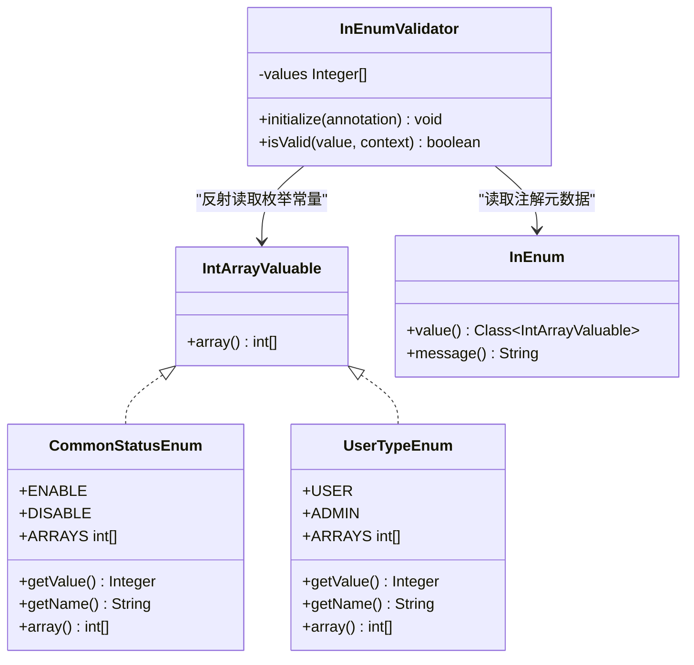
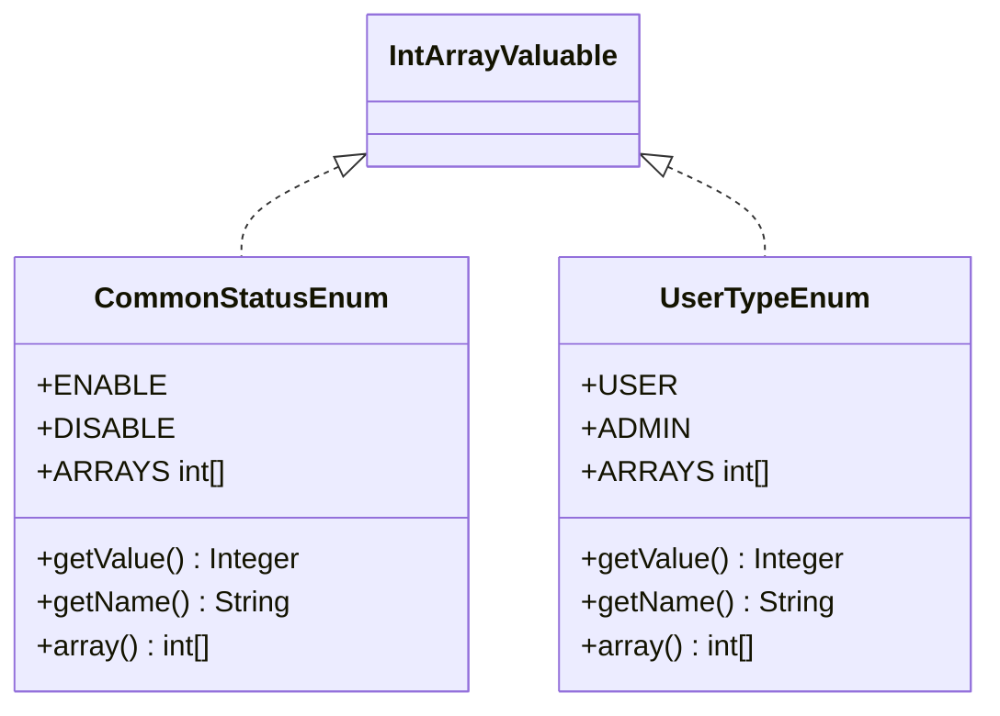
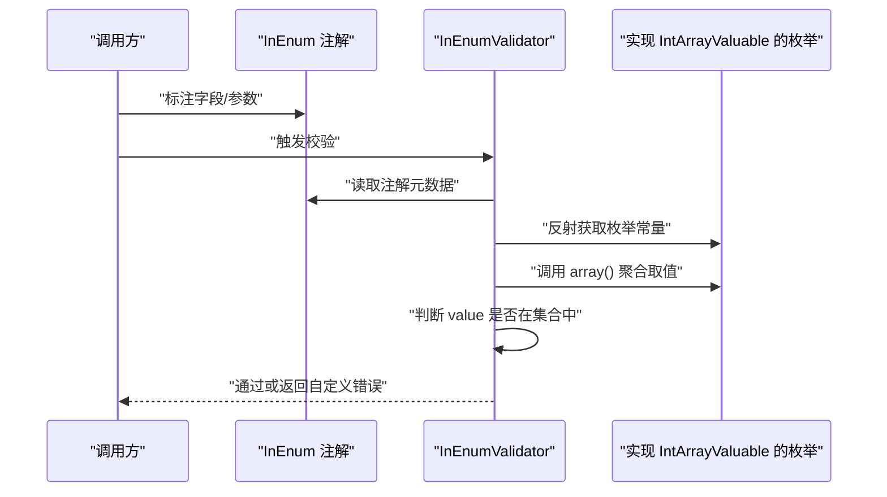
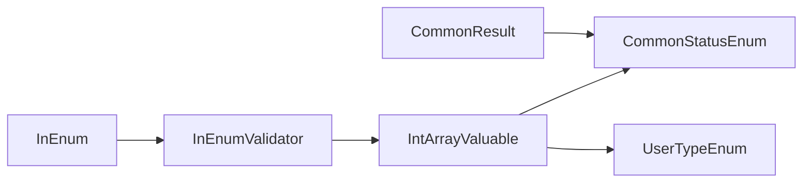

# 核心框架组件

<cite>
**本文引用的文件**
- [IntArrayValuable.java](file://common/common-framework/src/main/java/cn/iocoder/common/framework/core/IntArrayValuable.java)
- [CommonStatusEnum.java](file://common/common-framework/src/main/java/cn/iocoder/common/framework/enums/CommonStatusEnum.java)
- [UserTypeEnum.java](file://common/common-framework/src/main/java/cn/iocoder/common/framework/enums/UserTypeEnum.java)
- [InEnum.java](file://common/common-framework/src/main/java/cn/iocoder/common/framework/validator/InEnum.java)
- [InEnumValidator.java](file://common/common-framework/src/main/java/cn/iocoder/common/framework/validator/InEnumValidator.java)
- [CommonResult.java](file://common/common-framework/src/main/java/cn/iocoder/common/framework/vo/CommonResult.java)
</cite>

## 目录
1. [引言](#引言)
2. [项目结构](#项目结构)
3. [核心组件](#核心组件)
4. [架构总览](#架构总览)
5. [详细组件分析](#详细组件分析)
6. [依赖分析](#依赖分析)
7. [性能考虑](#性能考虑)
8. [故障排查指南](#故障排查指南)
9. [结论](#结论)
10. [附录](#附录)

## 引言
本文件聚焦 Onemall 通用框架中的核心组件，系统性解析以下关键点：
- IntArrayValuable 接口的设计理念与数据绑定机制：通过“枚举值到整型数组”的映射，实现统一的取值来源与校验支持。
- 通用枚举设计模式：CommonStatusEnum 与 UserTypeEnum 展示了状态管理与用户类型区分的典型业务场景。
- 校验器 InEnum 与 InEnumValidator 如何基于 IntArrayValuable 自动提取枚举取值集合，完成参数合法性校验。
- 在系统中的价值：统一取值来源、减少重复代码、提升可维护性与可扩展性。

## 项目结构
本专题涉及的文件位于 common/common-framework 模块，主要包含：
- core 层：定义 IntArrayValuable 接口，作为“可生成整型数组”的契约。
- enums 层：定义通用枚举 CommonStatusEnum、UserTypeEnum，并实现 IntArrayValuable。
- validator 层：定义 InEnum 注解与 InEnumValidator 校验器，基于 IntArrayValuable 进行参数校验。
- vo 层：提供统一响应对象 CommonResult，用于承载业务结果与错误信息。

图表来源
- [IntArrayValuable.java:1-14](file://common/common-framework/src/main/java/cn/iocoder/common/framework/core/IntArrayValuable.java#L1-L14)
- [CommonStatusEnum.java:1-45](file://common/common-framework/src/main/java/cn/iocoder/common/framework/enums/CommonStatusEnum.java#L1-L45)
- [UserTypeEnum.java:1-45](file://common/common-framework/src/main/java/cn/iocoder/common/framework/enums/UserTypeEnum.java#L1-L45)
- [InEnum.java:1-36](file://common/common-framework/src/main/java/cn/iocoder/common/framework/validator/InEnum.java#L1-L36)
- [InEnumValidator.java:1-44](file://common/common-framework/src/main/java/cn/iocoder/common/framework/validator/InEnumValidator.java#L1-L44)
- [CommonResult.java:1-155](file://common/common-framework/src/main/java/cn/iocoder/common/framework/vo/CommonResult.java#L1-L155)

章节来源
- [IntArrayValuable.java:1-14](file://common/common-framework/src/main/java/cn/iocoder/common/framework/core/IntArrayValuable.java#L1-L14)
- [CommonStatusEnum.java:1-45](file://common/common-framework/src/main/java/cn/iocoder/common/framework/enums/CommonStatusEnum.java#L1-L45)
- [UserTypeEnum.java:1-45](file://common/common-framework/src/main/java/cn/iocoder/common/framework/enums/UserTypeEnum.java#L1-L45)
- [InEnum.java:1-36](file://common/common-framework/src/main/java/cn/iocoder/common/framework/validator/InEnum.java#L1-L36)
- [InEnumValidator.java:1-44](file://common/common-framework/src/main/java/cn/iocoder/common/framework/validator/InEnumValidator.java#L1-L44)
- [CommonResult.java:1-155](file://common/common-framework/src/main/java/cn/iocoder/common/framework/vo/CommonResult.java#L1-L155)

## 核心组件
- IntArrayValuable 接口：定义 array() 方法，返回整型数组，作为所有“可枚举取值”的统一来源。
- 通用枚举（CommonStatusEnum、UserTypeEnum）：实现 IntArrayValuable，提供静态数组 ARRAYS，便于批量取值与校验。
- 参数校验器（InEnum + InEnumValidator）：通过注解指定实现 IntArrayValuable 的枚举类，自动提取取值集合进行校验。
- 统一响应（CommonResult）：封装业务返回结构，与全局错误码常量配合，统一错误处理。

章节来源
- [IntArrayValuable.java:1-14](file://common/common-framework/src/main/java/cn/iocoder/common/framework/core/IntArrayValuable.java#L1-L14)
- [CommonStatusEnum.java:1-45](file://common/common-framework/src/main/java/cn/iocoder/common/framework/enums/CommonStatusEnum.java#L1-L45)
- [UserTypeEnum.java:1-45](file://common/common-framework/src/main/java/cn/iocoder/common/framework/enums/UserTypeEnum.java#L1-L45)
- [InEnum.java:1-36](file://common/common-framework/src/main/java/cn/iocoder/common/framework/validator/InEnum.java#L1-L36)
- [InEnumValidator.java:1-44](file://common/common-framework/src/main/java/cn/iocoder/common/framework/validator/InEnumValidator.java#L1-L44)
- [CommonResult.java:1-155](file://common/common-framework/src/main/java/cn/iocoder/common/framework/vo/CommonResult.java#L1-L155)

## 架构总览
下图展示了 IntArrayValuable 与通用枚举、校验器之间的关系，以及在业务层的典型使用路径。

图表来源
- [IntArrayValuable.java:1-14](file://common/common-framework/src/main/java/cn/iocoder/common/framework/core/IntArrayValuable.java#L1-L14)
- [CommonStatusEnum.java:1-45](file://common/common-framework/src/main/java/cn/iocoder/common/framework/enums/CommonStatusEnum.java#L1-L45)
- [UserTypeEnum.java:1-45](file://common/common-framework/src/main/java/cn/iocoder/common/framework/enums/UserTypeEnum.java#L1-L45)
- [InEnum.java:1-36](file://common/common-framework/src/main/java/cn/iocoder/common/framework/validator/InEnum.java#L1-L36)
- [InEnumValidator.java:1-44](file://common/common-framework/src/main/java/cn/iocoder/common/framework/validator/InEnumValidator.java#L1-L44)

## 详细组件分析

### IntArrayValuable 接口
- 设计目标：为“可枚举取值”提供统一抽象，使上层逻辑无需关心具体枚举实现，仅依赖 array() 返回的整型数组。
- 使用方式：各枚举示例通过实现该接口并提供静态数组 ARRAYS，形成“枚举常量集合 → 整型数组”的映射。
- 优势：降低耦合度，便于在参数校验、数据库查询条件、前端渲染等多处复用同一取值集合。

章节来源
- [IntArrayValuable.java:1-14](file://common/common-framework/src/main/java/cn/iocoder/common/framework/core/IntArrayValuable.java#L1-L14)

### 通用枚举设计模式
- CommonStatusEnum：用于通用状态管理（如启用/禁用），提供 getValue()/getName() 访问器与静态数组 ARRAYS。
- UserTypeEnum：用于用户类型区分（如普通用户/管理员），同样提供访问器与静态数组 ARRAYS。
- 设计要点：
  - 构造函数固定 value 与 name，保证不可变性。
  - 静态数组 ARRAYS 基于 values() 流式映射生成，确保与枚举项同步。
  - 实现 IntArrayValuable，统一暴露 array() 供校验器与其它组件使用。

图表来源
- [CommonStatusEnum.java:1-45](file://common/common-framework/src/main/java/cn/iocoder/common/framework/enums/CommonStatusEnum.java#L1-L45)
- [UserTypeEnum.java:1-45](file://common/common-framework/src/main/java/cn/iocoder/common/framework/enums/UserTypeEnum.java#L1-L45)

章节来源
- [CommonStatusEnum.java:1-45](file://common/common-framework/src/main/java/cn/iocoder/common/framework/enums/CommonStatusEnum.java#L1-L45)
- [UserTypeEnum.java:1-45](file://common/common-framework/src/main/java/cn/iocoder/common/framework/enums/UserTypeEnum.java#L1-L45)

### 参数校验器 InEnum 与 InEnumValidator
- InEnum 注解：通过 value 指定实现 IntArrayValuable 的枚举类，message 定义默认提示，groups/payload 支持分组与负载。
- InEnumValidator 校验流程：
  - initialize：反射读取注解指定的枚举类的所有枚举常量，调用 array() 合并为整型集合。
  - isValid：空值默认放行；否则判断是否包含于预取集合；不通过时替换默认模板中的占位符并输出自定义提示。

图表来源
- [InEnum.java:1-36](file://common/common-framework/src/main/java/cn/iocoder/common/framework/validator/InEnum.java#L1-L36)
- [InEnumValidator.java:1-44](file://common/common-framework/src/main/java/cn/iocoder/common/framework/validator/InEnumValidator.java#L1-L44)

章节来源
- [InEnum.java:1-36](file://common/common-framework/src/main/java/cn/iocoder/common/framework/validator/InEnum.java#L1-L36)
- [InEnumValidator.java:1-44](file://common/common-framework/src/main/java/cn/iocoder/common/framework/validator/InEnumValidator.java#L1-L44)

### 在系统中的作用与价值
- 统一取值来源：通过 IntArrayValuable 与静态数组 ARRAYS，避免散落的魔法数与重复定义。
- 参数校验自动化：InEnum + InEnumValidator 组合实现“声明式校验”，减少样板代码。
- 业务扩展友好：新增枚举项只需在枚举内补充，即可自动纳入校验与取值集合。
- 与统一响应集成：CommonResult 提供统一的错误封装与异常抛出能力，便于与校验器协同工作。

章节来源
- [CommonResult.java:1-155](file://common/common-framework/src/main/java/cn/iocoder/common/framework/vo/CommonResult.java#L1-L155)

## 依赖分析
- IntArrayValuable 与枚举：枚举实现 IntArrayValuable，形成“契约-实现”的单向依赖。
- 校验器对注解与接口：InEnumValidator 依赖 InEnum 注解与 IntArrayValuable 抽象，运行时通过反射读取枚举常量。
- 与业务层的协作：CommonResult 与全局错误码常量配合，将校验失败转化为标准错误响应。

图表来源
- [IntArrayValuable.java:1-14](file://common/common-framework/src/main/java/cn/iocoder/common/framework/core/IntArrayValuable.java#L1-L14)
- [CommonStatusEnum.java:1-45](file://common/common-framework/src/main/java/cn/iocoder/common/framework/enums/CommonStatusEnum.java#L1-L45)
- [UserTypeEnum.java:1-45](file://common/common-framework/src/main/java/cn/iocoder/common/framework/enums/UserTypeEnum.java#L1-L45)
- [InEnum.java:1-36](file://common/common-framework/src/main/java/cn/iocoder/common/framework/validator/InEnum.java#L1-L36)
- [InEnumValidator.java:1-44](file://common/common-framework/src/main/java/cn/iocoder/common/framework/validator/InEnumValidator.java#L1-L44)
- [CommonResult.java:1-155](file://common/common-framework/src/main/java/cn/iocoder/common/framework/vo/CommonResult.java#L1-L155)

章节来源
- [CommonStatusEnum.java:1-45](file://common/common-framework/src/main/java/cn/iocoder/common/framework/enums/CommonStatusEnum.java#L1-L45)
- [UserTypeEnum.java:1-45](file://common/common-framework/src/main/java/cn/iocoder/common/framework/enums/UserTypeEnum.java#L1-L45)
- [InEnum.java:1-36](file://common/common-framework/src/main/java/cn/iocoder/common/framework/validator/InEnum.java#L1-L36)
- [InEnumValidator.java:1-44](file://common/common-framework/src/main/java/cn/iocoder/common/framework/validator/InEnumValidator.java#L1-L44)
- [CommonResult.java:1-155](file://common/common-framework/src/main/java/cn/iocoder/common/framework/vo/CommonResult.java#L1-L155)

## 性能考虑
- 预取与缓存：InEnumValidator.initialize 中一次性读取并缓存枚举取值集合，避免每次校验重复反射与流式计算。
- 集合查找：使用 List.contains 进行 O(n) 查找；若取值规模较大，可考虑使用 HashSet 以优化至平均 O(1)。
- 枚举静态数组：CommonStatusEnum 与 UserTypeEnum 的 ARRAYS 为编译期常量，避免运行时重复构造。

章节来源
- [InEnumValidator.java:1-44](file://common/common-framework/src/main/java/cn/iocoder/common/framework/validator/InEnumValidator.java#L1-L44)
- [CommonStatusEnum.java:1-45](file://common/common-framework/src/main/java/cn/iocoder/common/framework/enums/CommonStatusEnum.java#L1-L45)
- [UserTypeEnum.java:1-45](file://common/common-framework/src/main/java/cn/iocoder/common/framework/enums/UserTypeEnum.java#L1-L45)

## 故障排查指南
- 校验不生效
  - 检查注解是否正确标注在目标字段或参数上。
  - 确认注解 value 指向的枚举类实现了 IntArrayValuable。
  - 若枚举为空或未初始化，initialize 中会得到空集合，导致所有值均不通过。
- 错误提示不符合预期
  - InEnumValidator 会在校验失败时替换默认模板中的占位符为实际取值集合，确认注解 message 是否包含占位符。
- 统一响应与异常
  - 使用 CommonResult.error(...) 构造错误响应；当需要将错误转为异常抛出时，调用 checkError() 并捕获 GlobalException 或 ServiceException。

章节来源
- [InEnum.java:1-36](file://common/common-framework/src/main/java/cn/iocoder/common/framework/validator/InEnum.java#L1-L36)
- [InEnumValidator.java:1-44](file://common/common-framework/src/main/java/cn/iocoder/common/framework/validator/InEnumValidator.java#L1-L44)
- [CommonResult.java:1-155](file://common/common-framework/src/main/java/cn/iocoder/common/framework/vo/CommonResult.java#L1-L155)

## 结论
- IntArrayValuable 为“可枚举取值”提供了统一抽象，使 CommonStatusEnum 与 UserTypeEnum 能够以一致的方式暴露取值集合。
- InEnum 与 InEnumValidator 将声明式校验与 IntArrayValuable 契约结合，显著降低样板代码与维护成本。
- 与 CommonResult 协同，形成从“参数校验 → 统一响应 → 异常抛出”的完整闭环。
- 在 Onemall 中，这套组件提升了状态管理与用户类型区分的规范性与一致性，为后续扩展打下良好基础。

## 附录
- 实际使用建议
  - 在 DTO/Controller 参数上使用 InEnum(value = ...) 进行参数校验。
  - 在 Service 层直接使用枚举的 getValue()/getName() 获取值与名称。
  - 在前端渲染时，优先使用枚举的静态数组 ARRAYS 作为下拉选项来源。
- 扩展新枚举
  - 新增枚举时，实现 IntArrayValuable 并提供静态数组 ARRAYS。
  - 在需要校验的参数上使用 InEnum(value = 新枚举类.class)。