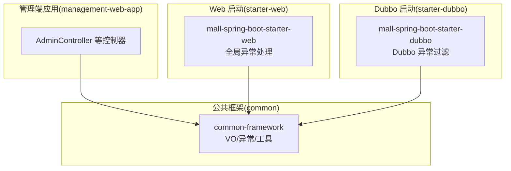
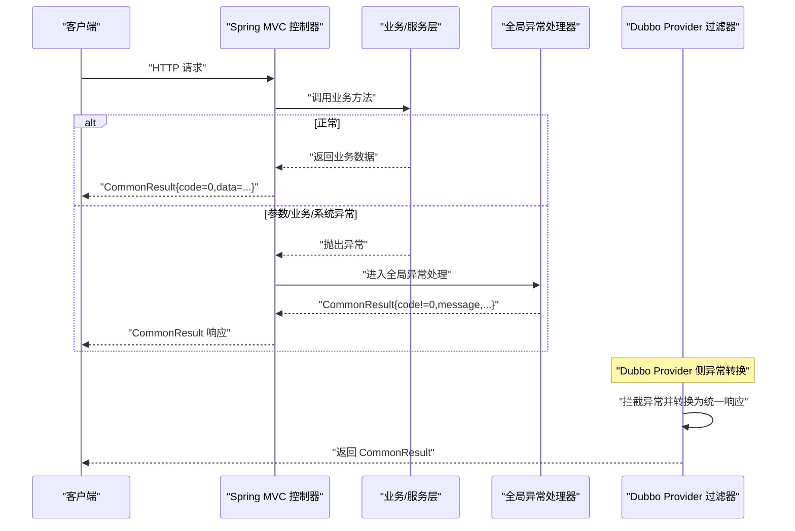
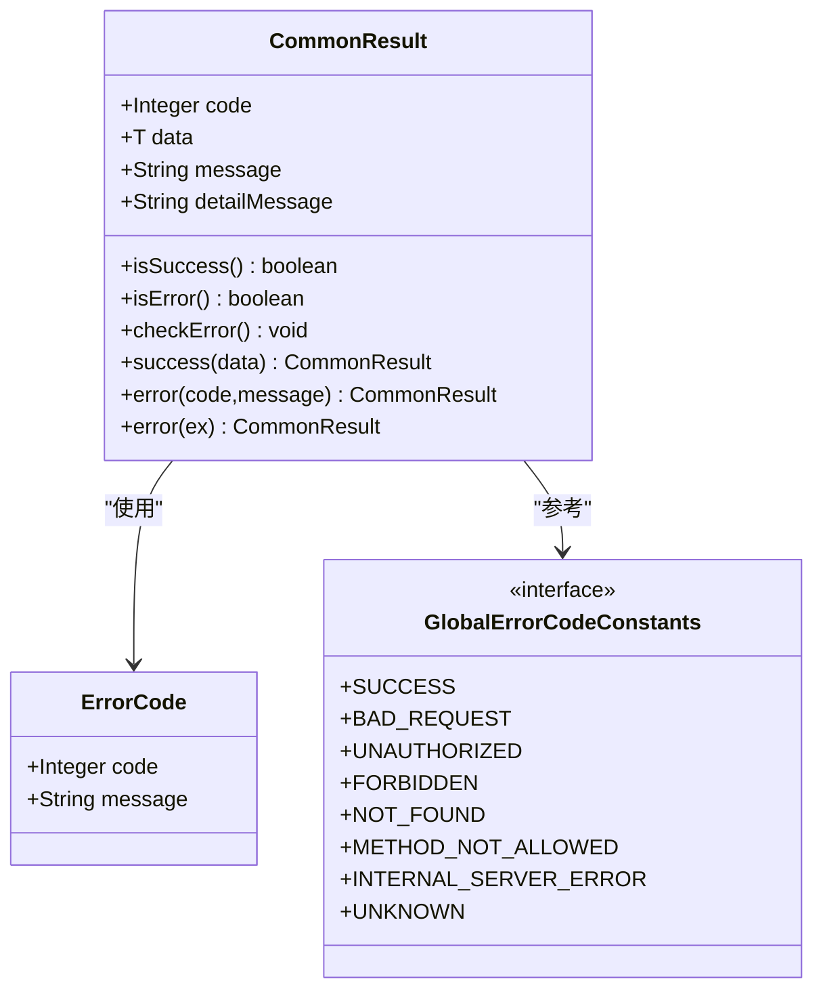
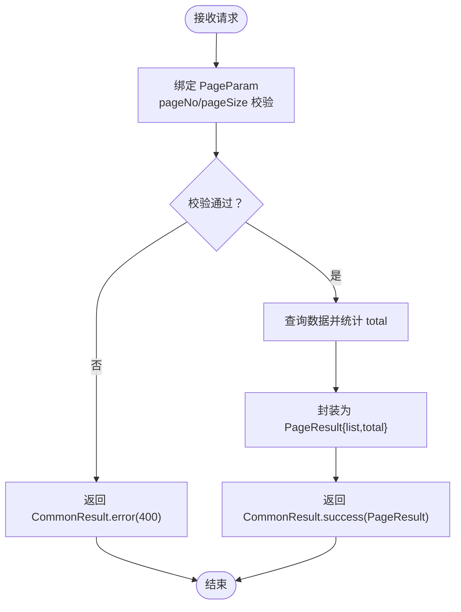
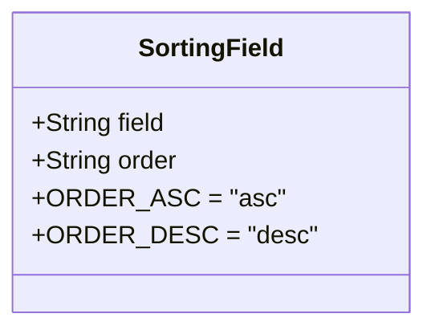
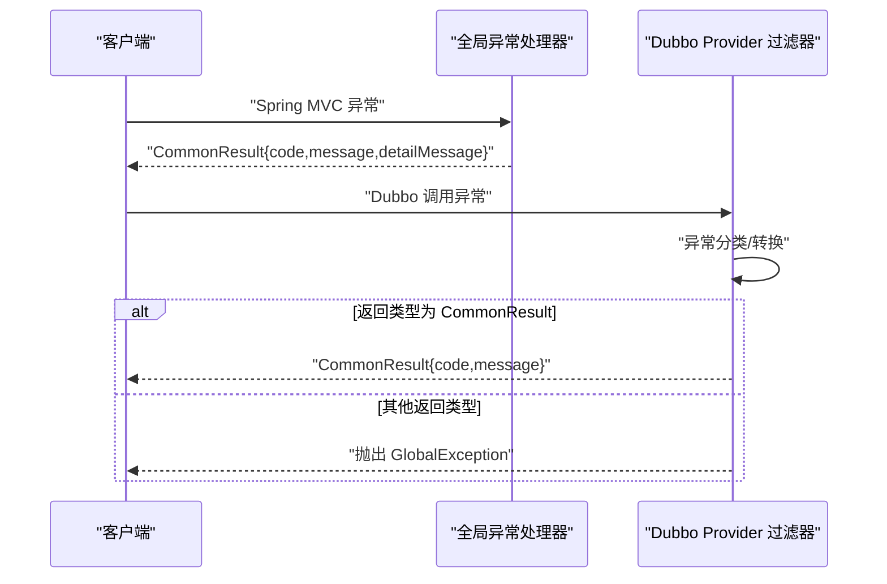
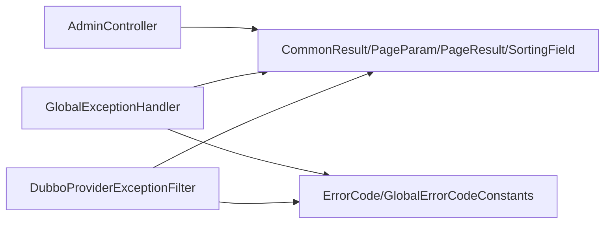

# 统一响应模型

<cite>
**本文引用的文件**
- [CommonResult.java](file://common/common-framework/src/main/java/cn/iocoder/common/framework/vo/CommonResult.java)
- [PageParam.java](file://common/common-framework/src/main/java/cn/iocoder/common/framework/vo/PageParam.java)
- [PageResult.java](file://common/common-framework/src/main/java/cn/iocoder/common/framework/vo/PageResult.java)
- [SortingField.java](file://common/common-framework/src/main/java/cn/iocoder/common/framework/vo/SortingField.java)
- [ErrorCode.java](file://common/common-framework/src/main/java/cn/iocoder/common/framework/exception/ErrorCode.java)
- [GlobalErrorCodeConstants.java](file://common/common-framework/src/main/java/cn/iocoder/common/framework/exception/enums/GlobalErrorCodeConstants.java)
- [GlobalExceptionHandler.java](file://common/mall-spring-boot-starter-web/src/main/java/cn/iocoder/mall/web/core/handler/GlobalExceptionHandler.java)
- [DubboProviderExceptionFilter.java](file://common/mall-spring-boot-starter-dubbo/src/main/java/cn/iocoder/mall/dubbo/core/filter/DubboProviderExceptionFilter.java)
- [AdminController.java](file://management-web-app/src/main/java/cn/iocoder/mall/managementweb/controller/admin/AdminController.java)
</cite>

## 目录
1. [简介](#简介)
2. [项目结构](#项目结构)
3. [核心组件](#核心组件)
4. [架构总览](#架构总览)
5. [详细组件分析](#详细组件分析)
6. [依赖关系分析](#依赖关系分析)
7. [性能考量](#性能考量)
8. [故障排查指南](#故障排查指南)
9. [结论](#结论)
10. [附录](#附录)

## 简介
本文件面向 Onemall 项目的统一响应模型，系统性阐述 CommonResult 统一响应格式、PageParam 分页参数、PageResult 分页结果封装、SortingField 排序字段模型的设计理念与实现机制。文档同时给出前后端分离场景下的标准数据传输约定、常见 API 响应示例与前端对接要点，帮助前后端开发保持一致的契约与交互体验。

## 项目结构
统一响应模型位于公共框架模块 common/common-framework 中，配套的异常体系与全局异常处理分别位于 common/common-framework 与 common/mall-spring-boot-starter-web、common/mall-spring-boot-starter-dubbo 中。管理端 Web 应用 management-web-app 展示了典型控制器对统一响应的使用方式。

图表来源
- [CommonResult.java:17-155](file://common/common-framework/src/main/java/cn/iocoder/common/framework/vo/CommonResult.java#L17-L155)
- [GlobalExceptionHandler.java:39-253](file://common/mall-spring-boot-starter-web/src/main/java/cn/iocoder/mall/web/core/handler/GlobalExceptionHandler.java#L39-L253)
- [DubboProviderExceptionFilter.java:21-115](file://common/mall-spring-boot-starter-dubbo/src/main/java/cn/iocoder/mall/dubbo/core/filter/DubboProviderExceptionFilter.java#L21-L115)
- [AdminController.java:28-68](file://management-web-app/src/main/java/cn/iocoder/mall/managementweb/controller/admin/AdminController.java#L28-L68)

章节来源
- [CommonResult.java:17-155](file://common/common-framework/src/main/java/cn/iocoder/common/framework/vo/CommonResult.java#L17-L155)
- [PageParam.java:11-47](file://common/common-framework/src/main/java/cn/iocoder/common/framework/vo/PageParam.java#L11-L47)
- [PageResult.java:9-37](file://common/common-framework/src/main/java/cn/iocoder/common/framework/vo/PageResult.java#L9-L37)
- [SortingField.java:10-57](file://common/common-framework/src/main/java/cn/iocoder/common/framework/vo/SortingField.java#L10-L57)
- [GlobalErrorCodeConstants.java:13-37](file://common/common-framework/src/main/java/cn/iocoder/common/framework/exception/enums/GlobalErrorCodeConstants.java#L13-L37)
- [GlobalExceptionHandler.java:39-253](file://common/mall-spring-boot-starter-web/src/main/java/cn/iocoder/mall/web/core/handler/GlobalExceptionHandler.java#L39-L253)
- [DubboProviderExceptionFilter.java:21-115](file://common/mall-spring-boot-starter-dubbo/src/main/java/cn/iocoder/mall/dubbo/core/filter/DubboProviderExceptionFilter.java#L21-L115)
- [AdminController.java:28-68](file://management-web-app/src/main/java/cn/iocoder/mall/managementweb/controller/admin/AdminController.java#L28-L68)

## 核心组件
- 统一响应格式 CommonResult
  - 字段：code（错误码）、data（数据体）、message（对外提示）、detailMessage（内部明细）
  - 成功/失败判定：isSuccess/isError；成功默认 code=0
  - 工具方法：success(data)、error(code,message)、error(ServiceException)、error(GlobalException)
  - 与异常体系集成：checkError() 可将非成功响应抛出对应异常类型
- 分页参数 PageParam
  - 字段：pageNo（从 1 开始）、pageSize（1~100）
  - 校验注解：非空、最小值、范围限制
- 分页结果 PageResult
  - 字段：list（数据列表）、total（总量）
- 排序字段 SortingField
  - 字段：field（字段名）、order（asc/desc）
  - 支持多字段排序的组合（由上层逻辑拼装）

章节来源
- [CommonResult.java:17-155](file://common/common-framework/src/main/java/cn/iocoder/common/framework/vo/CommonResult.java#L17-L155)
- [PageParam.java:11-47](file://common/common-framework/src/main/java/cn/iocoder/common/framework/vo/PageParam.java#L11-L47)
- [PageResult.java:9-37](file://common/common-framework/src/main/java/cn/iocoder/common/framework/vo/PageResult.java#L9-L37)
- [SortingField.java:10-57](file://common/common-framework/src/main/java/cn/iocoder/common/framework/vo/SortingField.java#L10-L57)

## 架构总览
统一响应模型贯穿 Web 控制器、全局异常处理与 Dubbo 服务端过滤器，形成“请求—响应—异常统一”的闭环。

图表来源
- [GlobalExceptionHandler.java:39-253](file://common/mall-spring-boot-starter-web/src/main/java/cn/iocoder/mall/web/core/handler/GlobalExceptionHandler.java#L39-L253)
- [DubboProviderExceptionFilter.java:21-115](file://common/mall-spring-boot-starter-dubbo/src/main/java/cn/iocoder/mall/dubbo/core/filter/DubboProviderExceptionFilter.java#L21-L115)
- [CommonResult.java:17-155](file://common/common-framework/src/main/java/cn/iocoder/common/framework/vo/CommonResult.java#L17-L155)

## 详细组件分析

### 统一响应格式 CommonResult
- 设计目标
  - 统一前后端交互协议，简化前端判断逻辑
  - 明确区分对外提示与内部明细，便于运维与排障
  - 与异常体系强耦合，支持运行时检查与抛错
- 关键行为
  - 成功：code=0，data 为业务数据
  - 失败：code 非 0，message 为对外可见提示，detailMessage 为内部明细
  - checkError：非成功即抛出对应异常类型，便于上层统一处理
- 使用建议
  - 控制器统一返回 CommonResult<T>
  - 仅在成功路径使用 success(data)
  - 失败路径优先使用 error(code,message,detailMessage) 或 error(ServiceException)

图表来源
- [CommonResult.java:17-155](file://common/common-framework/src/main/java/cn/iocoder/common/framework/vo/CommonResult.java#L17-L155)
- [ErrorCode.java:13-38](file://common/common-framework/src/main/java/cn/iocoder/common/framework/exception/ErrorCode.java#L13-L38)
- [GlobalErrorCodeConstants.java:13-37](file://common/common-framework/src/main/java/cn/iocoder/common/framework/exception/enums/GlobalErrorCodeConstants.java#L13-L37)

章节来源
- [CommonResult.java:17-155](file://common/common-framework/src/main/java/cn/iocoder/common/framework/vo/CommonResult.java#L17-L155)
- [ErrorCode.java:13-38](file://common/common-framework/src/main/java/cn/iocoder/common/framework/exception/ErrorCode.java#L13-L38)
- [GlobalErrorCodeConstants.java:13-37](file://common/common-framework/src/main/java/cn/iocoder/common/framework/exception/enums/GlobalErrorCodeConstants.java#L13-L37)

### 分页参数 PageParam 与分页结果 PageResult
- PageParam
  - pageNo：从 1 开始的页码
  - pageSize：1~100 的条数限制
  - 校验：非空、最小值、范围
- PageResult
  - list：当前页数据
  - total：总记录数
- 实践建议
  - 控制器接收 PageParam，服务层按 pageNo/pageSize 计算偏移量
  - 返回 PageResult，前端据此渲染分页控件

图表来源
- [PageParam.java:11-47](file://common/common-framework/src/main/java/cn/iocoder/common/framework/vo/PageParam.java#L11-L47)
- [PageResult.java:9-37](file://common/common-framework/src/main/java/cn/iocoder/common/framework/vo/PageResult.java#L9-L37)
- [AdminController.java:37-42](file://management-web-app/src/main/java/cn/iocoder/mall/managementweb/controller/admin/AdminController.java#L37-L42)

章节来源
- [PageParam.java:11-47](file://common/common-framework/src/main/java/cn/iocoder/common/framework/vo/PageParam.java#L11-L47)
- [PageResult.java:9-37](file://common/common-framework/src/main/java/cn/iocoder/common/framework/vo/PageResult.java#L9-L37)
- [AdminController.java:37-42](file://management-web-app/src/main/java/cn/iocoder/mall/managementweb/controller/admin/AdminController.java#L37-L42)

### 排序字段 SortingField
- 字段
  - field：排序字段名
  - order：asc/desc
- 多字段排序
  - 通过多个 SortingField 组合实现，如按 field1 desc, field2 asc
- 动态配置
  - 支持从前端传入排序数组，后端解析为 SortingField 列表，拼装 SQL/ES 查询条件

图表来源
- [SortingField.java:10-57](file://common/common-framework/src/main/java/cn/iocoder/common/framework/vo/SortingField.java#L10-L57)

章节来源
- [SortingField.java:10-57](file://common/common-framework/src/main/java/cn/iocoder/common/framework/vo/SortingField.java#L10-L57)

### 异常与统一响应的衔接
- 全局异常处理
  - 将各类参数校验、路由、业务、系统异常统一转换为 CommonResult
  - 对 ServiceException 直接透传 code/message
  - 对 GlobalException 区分 500 与普通全局异常，记录异常日志
- Dubbo Provider 侧
  - 拦截服务端异常，将参数校验异常转为全局异常，其他异常转为 GlobalException
  - 若方法返回类型为 CommonResult，则将异常包装为 CommonResult 返回

图表来源
- [GlobalExceptionHandler.java:39-253](file://common/mall-spring-boot-starter-web/src/main/java/cn/iocoder/mall/web/core/handler/GlobalExceptionHandler.java#L39-L253)
- [DubboProviderExceptionFilter.java:21-115](file://common/mall-spring-boot-starter-dubbo/src/main/java/cn/iocoder/mall/dubbo/core/filter/DubboProviderExceptionFilter.java#L21-L115)

章节来源
- [GlobalExceptionHandler.java:39-253](file://common/mall-spring-boot-starter-web/src/main/java/cn/iocoder/mall/web/core/handler/GlobalExceptionHandler.java#L39-L253)
- [DubboProviderExceptionFilter.java:21-115](file://common/mall-spring-boot-starter-dubbo/src/main/java/cn/iocoder/mall/dubbo/core/filter/DubboProviderExceptionFilter.java#L21-L115)

## 依赖关系分析
- 控制器依赖 VO：返回 CommonResult、接收 PageParam、使用 PageResult/SortingField
- 全局异常处理器依赖：ErrorCode、GlobalErrorCodeConstants、异常工具
- Dubbo Provider 过滤器依赖：异常类型识别、返回类型判断、异常转换

图表来源
- [AdminController.java:28-68](file://management-web-app/src/main/java/cn/iocoder/mall/managementweb/controller/admin/AdminController.java#L28-L68)
- [CommonResult.java:17-155](file://common/common-framework/src/main/java/cn/iocoder/common/framework/vo/CommonResult.java#L17-L155)
- [GlobalErrorCodeConstants.java:13-37](file://common/common-framework/src/main/java/cn/iocoder/common/framework/exception/enums/GlobalErrorCodeConstants.java#L13-L37)
- [GlobalExceptionHandler.java:39-253](file://common/mall-spring-boot-starter-web/src/main/java/cn/iocoder/mall/web/core/handler/GlobalExceptionHandler.java#L39-L253)
- [DubboProviderExceptionFilter.java:21-115](file://common/mall-spring-boot-starter-dubbo/src/main/java/cn/iocoder/mall/dubbo/core/filter/DubboProviderExceptionFilter.java#L21-L115)

章节来源
- [AdminController.java:28-68](file://management-web-app/src/main/java/cn/iocoder/mall/managementweb/controller/admin/AdminController.java#L28-L68)
- [CommonResult.java:17-155](file://common/common-framework/src/main/java/cn/iocoder/common/framework/vo/CommonResult.java#L17-L155)
- [GlobalErrorCodeConstants.java:13-37](file://common/common-framework/src/main/java/cn/iocoder/common/framework/exception/enums/GlobalErrorCodeConstants.java#L13-L37)
- [GlobalExceptionHandler.java:39-253](file://common/mall-spring-boot-starter-web/src/main/java/cn/iocoder/mall/web/core/handler/GlobalExceptionHandler.java#L39-L253)
- [DubboProviderExceptionFilter.java:21-115](file://common/mall-spring-boot-starter-dubbo/src/main/java/cn/iocoder/mall/dubbo/core/filter/DubboProviderExceptionFilter.java#L21-L115)

## 性能考量
- 统一响应序列化：CommonResult 的 isSuccess/isError 标记为不序列化，减少响应体积
- 分页参数上限：pageSize 最大 100，避免一次性返回过多数据
- 排序字段：建议仅允许白名单字段，防止 SQL 注入或无效排序
- 异常日志异步化：系统异常日志写入采用异步，降低主流程开销

## 故障排查指南
- 常见错误码
  - 400：请求参数缺失/类型错误/参数不正确
  - 401：未登录
  - 403：无权限
  - 404：请求地址不存在
  - 405：请求方法不正确
  - 500：系统异常
- 排查步骤
  - 查看响应中的 code/message/detailMessage
  - 若为 500，结合 detailMessage 与异常日志定位
  - 参数类错误优先检查 PageParam/SortingField 的传参与校验注解
- 前端建议
  - 统一拦截 code!=0 的响应，弹窗提示 message
  - 仅在开发环境展示 detailMessage

章节来源
- [GlobalErrorCodeConstants.java:13-37](file://common/common-framework/src/main/java/cn/iocoder/common/framework/exception/enums/GlobalErrorCodeConstants.java#L13-L37)
- [GlobalExceptionHandler.java:66-198](file://common/mall-spring-boot-starter-web/src/main/java/cn/iocoder/mall/web/core/handler/GlobalExceptionHandler.java#L66-L198)
- [DubboProviderExceptionFilter.java:88-112](file://common/mall-spring-boot-starter-dubbo/src/main/java/cn/iocoder/mall/dubbo/core/filter/DubboProviderExceptionFilter.java#L88-L112)

## 结论
统一响应模型通过 CommonResult、PageParam、PageResult、SortingField 与异常体系的协同，实现了前后端一致的契约与高效的错误处理链路。配合全局异常处理与 Dubbo Provider 过滤器，系统在复杂分布式场景下仍能保持响应格式统一、错误语义清晰、开发体验一致。

## 附录

### API 响应示例（示意）
- 成功响应
  - code=0，message=""，data 为具体业务数据
- 失败响应
  - code=400/401/403/404/405/500，message 为对外提示，detailMessage 为内部明细

章节来源
- [CommonResult.java:66-72](file://common/common-framework/src/main/java/cn/iocoder/common/framework/vo/CommonResult.java#L66-L72)
- [GlobalErrorCodeConstants.java:15-29](file://common/common-framework/src/main/java/cn/iocoder/common/framework/exception/enums/GlobalErrorCodeConstants.java#L15-L29)

### 前端对接指南
- 统一处理
  - 所有接口统一以 CommonResult 为准，仅当 code==0 时视为成功
  - 成功时取 data 字段，失败时弹窗显示 message
- 分页
  - 传入 {pageNo,pageSize}，解析 PageResult 的 list 与 total 渲染表格与分页控件
- 排序
  - 传入排序数组，每个元素包含 field 与 order
- 错误处理
  - 401 自动跳转登录
  - 403 提示无权限
  - 404/405 提示接口不存在或方法不正确
  - 500 上报并提示稍后再试

章节来源
- [PageParam.java:11-47](file://common/common-framework/src/main/java/cn/iocoder/common/framework/vo/PageParam.java#L11-L47)
- [PageResult.java:9-37](file://common/common-framework/src/main/java/cn/iocoder/common/framework/vo/PageResult.java#L9-L37)
- [SortingField.java:10-57](file://common/common-framework/src/main/java/cn/iocoder/common/framework/vo/SortingField.java#L10-L57)
- [GlobalErrorCodeConstants.java:15-29](file://common/common-framework/src/main/java/cn/iocoder/common/framework/exception/enums/GlobalErrorCodeConstants.java#L15-L29)
- [AdminController.java:37-42](file://management-web-app/src/main/java/cn/iocoder/mall/managementweb/controller/admin/AdminController.java#L37-L42)