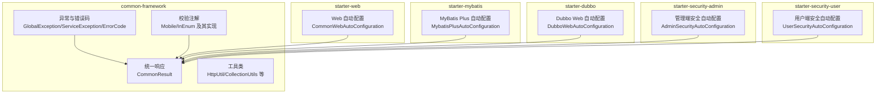
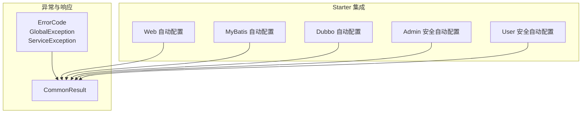
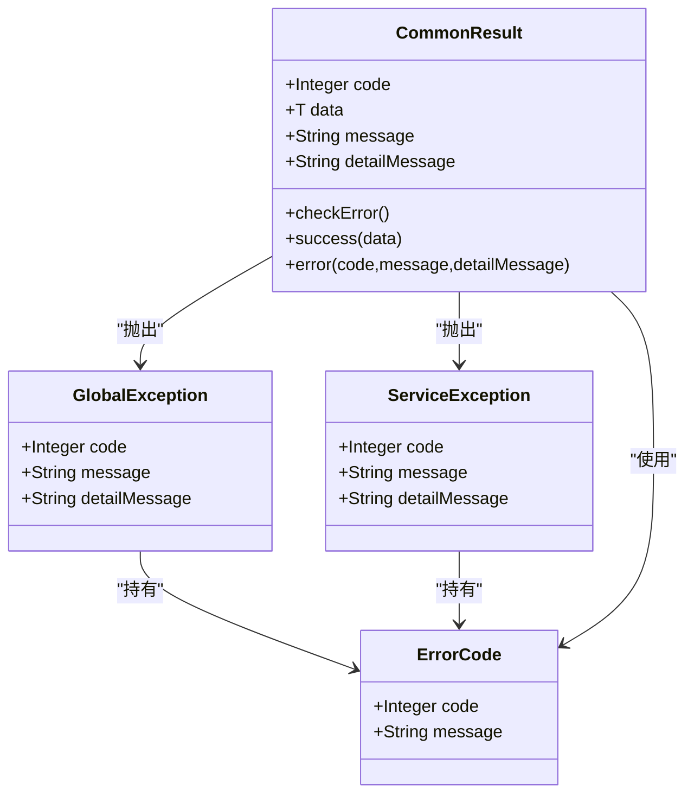
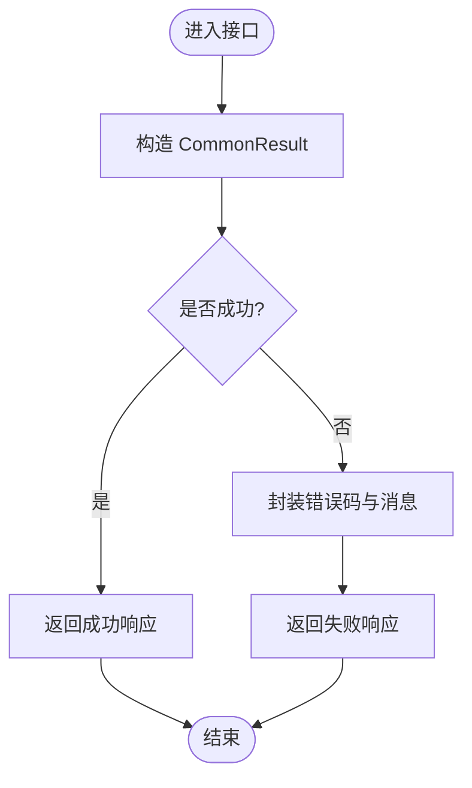
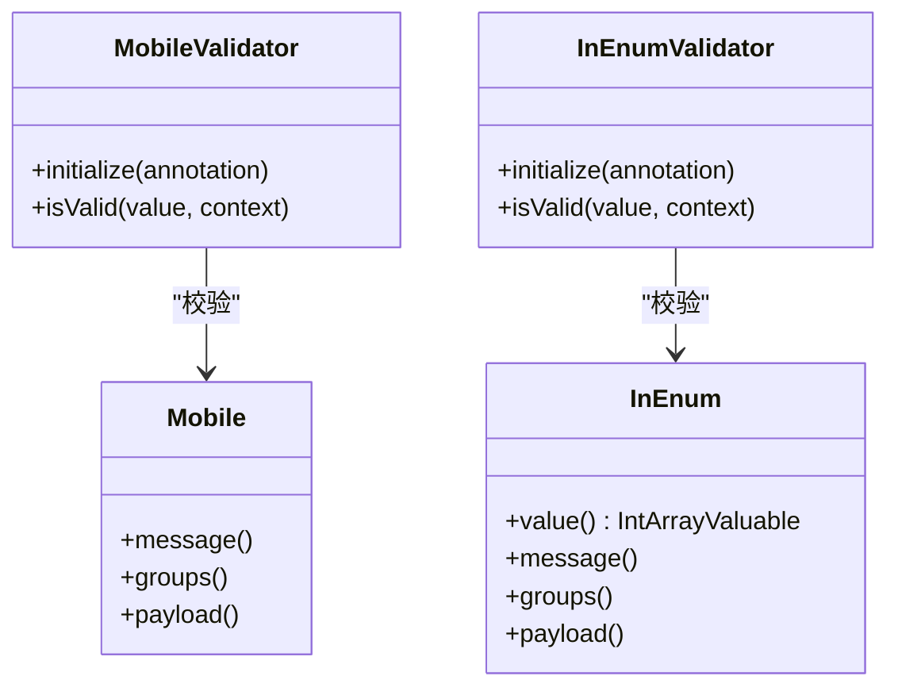
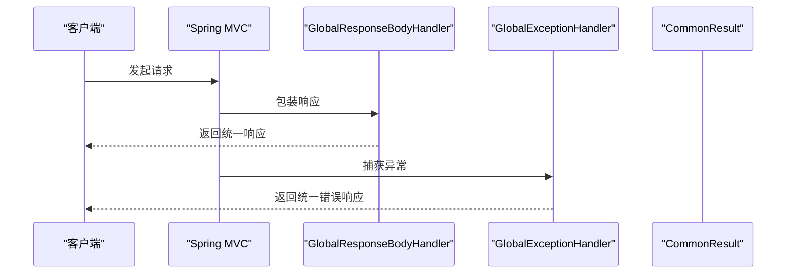
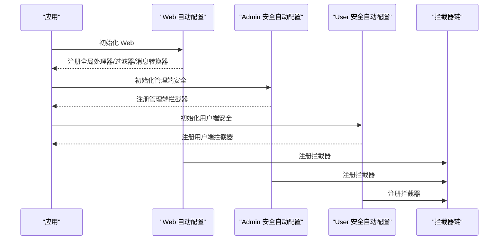
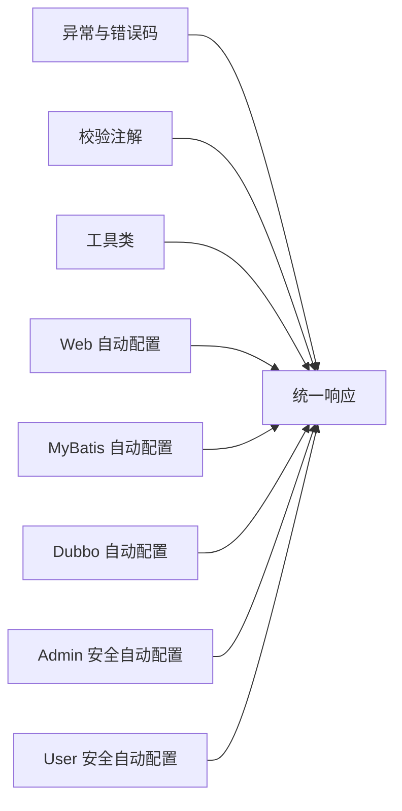

# 通用框架模块

<cite>
**本文档引用的文件**
- [ErrorCode.java](file://common/common-framework/src/main/java/cn/iocoder/common/framework/exception/ErrorCode.java)
- [GlobalException.java](file://common/common-framework/src/main/java/cn/iocoder/common/framework/exception/GlobalException.java)
- [ServiceException.java](file://common/common-framework/src/main/java/cn/iocoder/common/framework/exception/ServiceException.java)
- [CommonResult.java](file://common/common-framework/src/main/java/cn/iocoder/common/framework/vo/CommonResult.java)
- [HttpUtil.java](file://common/common-framework/src/main/java/cn/iocoder/common/framework/util/HttpUtil.java)
- [CollectionUtils.java](file://common/common-framework/src/main/java/cn/iocoder/common/framework/util/CollectionUtils.java)
- [Mobile.java](file://common/common-framework/src/main/java/cn/iocoder/common/framework/validator/Mobile.java)
- [MobileValidator.java](file://common/common-framework/src/main/java/cn/iocoder/common/framework/validator/MobileValidator.java)
- [InEnum.java](file://common/common-framework/src/main/java/cn/iocoder/common/framework/validator/InEnum.java)
- [InEnumValidator.java](file://common/common-framework/src/main/java/cn/iocoder/common/framework/validator/InEnumValidator.java)
- [CommonWebAutoConfiguration.java](file://common/mall-spring-boot-starter-web/src/main/java/cn/iocoder/mall/web/config/CommonWebAutoConfiguration.java)
- [MybatisPlusAutoConfiguration.java](file://common/mall-spring-boot-starter-mybatis/src/main/java/cn/iocoder/mall/mybatis/config/MybatisPlusAutoConfiguration.java)
- [DubboWebAutoConfiguration.java](file://common/mall-spring-boot-starter-dubbo/src/main/java/cn/iocoder/mall/dubbo/config/DubboWebAutoConfiguration.java)
- [AdminSecurityAutoConfiguration.java](file://common/mall-spring-boot-starter-security-admin/src/main/java/cn/iocoder/mall/security/admin/config/AdminSecurityAutoConfiguration.java)
- [UserSecurityAutoConfiguration.java](file://common/mall-spring-boot-starter-security-user/src/main/java/cn/iocoder/mall/security/user/config/UserSecurityAutoConfiguration.java)
</cite>

## 目录
1. [简介](#简介)
2. [项目结构](#项目结构)
3. [核心组件](#核心组件)
4. [架构总览](#架构总览)
5. [详细组件分析](#详细组件分析)
6. [依赖分析](#依赖分析)
7. [性能考虑](#性能考虑)
8. [故障排查指南](#故障排查指南)
9. [结论](#结论)
10. [附录](#附录)

## 简介
本文件面向 Onemall 项目的通用框架模块（common-framework 及其配套 starter），系统性梳理统一异常与错误码体系、统一响应格式、各 Spring Boot Starter 的实现原理与使用方法，并对工具类库、自定义注解与最佳实践进行说明。目标是帮助开发者快速理解并正确使用这些通用组件，同时提供扩展新功能模块的参考路径。

## 项目结构
通用框架模块主要由以下部分组成：
- common-framework：核心异常、错误码、统一响应、工具类、校验注解等
- mall-spring-boot-starter-*：围绕 Web、MyBatis、Redis、Dubbo、Security 等的自动装配与集成

图表来源
- [CommonResult.java:12-155](file://common/common-framework/src/main/java/cn/iocoder/common/framework/vo/CommonResult.java#L12-L155)
- [CommonWebAutoConfiguration.java:28-97](file://common/mall-spring-boot-starter-web/src/main/java/cn/iocoder/mall/web/config/CommonWebAutoConfiguration.java#L28-L97)
- [MybatisPlusAutoConfiguration.java:12-24](file://common/mall-spring-boot-starter-mybatis/src/main/java/cn/iocoder/mall/mybatis/config/MybatisPlusAutoConfiguration.java#L12-L24)
- [DubboWebAutoConfiguration.java:12-32](file://common/mall-spring-boot-starter-dubbo/src/main/java/cn/iocoder/mall/dubbo/config/DubboWebAutoConfiguration.java#L12-L32)
- [AdminSecurityAutoConfiguration.java:17-61](file://common/mall-spring-boot-starter-security-admin/src/main/java/cn/iocoder/mall/security/admin/config/AdminSecurityAutoConfiguration.java#L17-L61)
- [UserSecurityAutoConfiguration.java:16-48](file://common/mall-spring-boot-starter-security-user/src/main/java/cn/iocoder/mall/security/user/config/UserSecurityAutoConfiguration.java#L16-L48)

章节来源
- [CommonResult.java:12-155](file://common/common-framework/src/main/java/cn/iocoder/common/framework/vo/CommonResult.java#L12-L155)
- [CommonWebAutoConfiguration.java:28-97](file://common/mall-spring-boot-starter-web/src/main/java/cn/iocoder/mall/web/config/CommonWebAutoConfiguration.java#L28-L97)

## 核心组件
本节聚焦于异常与错误码体系、统一响应格式、工具类与校验注解。

- 统一异常与错误码
  - 错误码对象：包含 code 与 message，为未来国际化预留空间
  - 全局异常：用于系统级错误，携带 detailMessage 便于调试
  - 业务异常：用于业务规则违反，同样支持 detailMessage
  - 两者均与统一响应 CommonResult 协作，实现前后端一致的错误表达

- 统一响应格式
  - 统一返回体包含 code、data、message、detailMessage
  - 提供 success/error 工厂方法，以及与异常体系的互转能力
  - 提供 isSuccess/isError 判定，便于上层逻辑分支处理

- 工具类库
  - HTTP 工具：获取 Authorization、IP、User-Agent、构建查询串、规范化请求路径等
  - 集合工具：空值判断、类型转换、Map/多值映射构建、首元素获取等

- 校验注解
  - 手机号注解与校验器：非空时校验手机号格式
  - 枚举取值范围注解与校验器：基于 IntArrayValuable 的整型枚举取值范围校验

章节来源
- [ErrorCode.java:13-38](file://common/common-framework/src/main/java/cn/iocoder/common/framework/exception/ErrorCode.java#L13-L38)
- [GlobalException.java:9-72](file://common/common-framework/src/main/java/cn/iocoder/common/framework/exception/GlobalException.java#L9-L72)
- [ServiceException.java:9-72](file://common/common-framework/src/main/java/cn/iocoder/common/framework/exception/ServiceException.java#L9-L72)
- [CommonResult.java:12-155](file://common/common-framework/src/main/java/cn/iocoder/common/framework/vo/CommonResult.java#L12-L155)
- [HttpUtil.java:13-320](file://common/common-framework/src/main/java/cn/iocoder/common/framework/util/HttpUtil.java#L13-L320)
- [CollectionUtils.java:7-61](file://common/common-framework/src/main/java/cn/iocoder/common/framework/util/CollectionUtils.java#L7-L61)
- [Mobile.java:1-29](file://common/common-framework/src/main/java/cn/iocoder/common/framework/validator/Mobile.java#L1-L29)
- [MobileValidator.java:9-26](file://common/common-framework/src/main/java/cn/iocoder/common/framework/validator/MobileValidator.java#L9-L26)
- [InEnum.java:1-36](file://common/common-framework/src/main/java/cn/iocoder/common/framework/validator/InEnum.java#L1-L36)
- [InEnumValidator.java:12-44](file://common/common-framework/src/main/java/cn/iocoder/common/framework/validator/InEnumValidator.java#L12-L44)

## 架构总览
通用框架通过“异常与错误码 + 统一响应 + 工具类 + 注解校验”的组合，向上游服务提供一致的错误表达与便捷的开发体验。Starter 通过条件化自动装配，将 Web、MyBatis、Dubbo、Security 等子系统无缝接入，形成可插拔的基础设施层。

图表来源
- [CommonResult.java:12-155](file://common/common-framework/src/main/java/cn/iocoder/common/framework/vo/CommonResult.java#L12-L155)
- [CommonWebAutoConfiguration.java:28-97](file://common/mall-spring-boot-starter-web/src/main/java/cn/iocoder/mall/web/config/CommonWebAutoConfiguration.java#L28-L97)
- [MybatisPlusAutoConfiguration.java:12-24](file://common/mall-spring-boot-starter-mybatis/src/main/java/cn/iocoder/mall/mybatis/config/MybatisPlusAutoConfiguration.java#L12-L24)
- [DubboWebAutoConfiguration.java:12-32](file://common/mall-spring-boot-starter-dubbo/src/main/java/cn/iocoder/mall/dubbo/config/DubboWebAutoConfiguration.java#L12-L32)
- [AdminSecurityAutoConfiguration.java:17-61](file://common/mall-spring-boot-starter-security-admin/src/main/java/cn/iocoder/mall/security/admin/config/AdminSecurityAutoConfiguration.java#L17-L61)
- [UserSecurityAutoConfiguration.java:16-48](file://common/mall-spring-boot-starter-security-user/src/main/java/cn/iocoder/mall/security/user/config/UserSecurityAutoConfiguration.java#L16-L48)

## 详细组件分析

### 统一异常与错误码体系
- 设计要点
  - 错误码对象封装 code/message，便于统一管理与扩展
  - 全局异常与业务异常分别对应全局错误码区间与业务错误码区间
  - 统一响应支持从异常对象直接构造错误响应，并提供 checkError 抛出对应异常的能力

图表来源
- [ErrorCode.java:13-38](file://common/common-framework/src/main/java/cn/iocoder/common/framework/exception/ErrorCode.java#L13-L38)
- [GlobalException.java:9-72](file://common/common-framework/src/main/java/cn/iocoder/common/framework/exception/GlobalException.java#L9-L72)
- [ServiceException.java:9-72](file://common/common-framework/src/main/java/cn/iocoder/common/framework/exception/ServiceException.java#L9-L72)
- [CommonResult.java:12-155](file://common/common-framework/src/main/java/cn/iocoder/common/framework/vo/CommonResult.java#L12-L155)

章节来源
- [ErrorCode.java:13-38](file://common/common-framework/src/main/java/cn/iocoder/common/framework/exception/ErrorCode.java#L13-L38)
- [GlobalException.java:9-72](file://common/common-framework/src/main/java/cn/iocoder/common/framework/exception/GlobalException.java#L9-L72)
- [ServiceException.java:9-72](file://common/common-framework/src/main/java/cn/iocoder/common/framework/exception/ServiceException.java#L9-L72)
- [CommonResult.java:12-155](file://common/common-framework/src/main/java/cn/iocoder/common/framework/vo/CommonResult.java#L12-L155)

### 统一响应格式规范
- 规范内容
  - 成功：code 使用全局成功码，message 置空或按需设置
  - 失败：code 使用错误码对象中的 code，message 为用户可见提示，detailMessage 为内部调试信息
  - 工具方法：success/error/error(errorCode/exception) 三种工厂方法
  - 判定方法：isSuccess/isError 用于简化分支判断

图表来源
- [CommonResult.java:66-105](file://common/common-framework/src/main/java/cn/iocoder/common/framework/vo/CommonResult.java#L66-L105)

章节来源
- [CommonResult.java:66-105](file://common/common-framework/src/main/java/cn/iocoder/common/framework/vo/CommonResult.java#L66-L105)

### HTTP 工具与集合工具
- HTTP 工具
  - 获取 Authorization Bearer Token
  - 获取客户端 IP（兼容多级代理）
  - 获取 User-Agent
  - 构建查询串
  - 规范化请求路径与上下文路径
- 集合工具
  - 空值判断
  - 列表/集合/映射转换
  - 多值映射（List/Set）构建
  - 首元素获取

章节来源
- [HttpUtil.java:47-317](file://common/common-framework/src/main/java/cn/iocoder/common/framework/util/HttpUtil.java#L47-L317)
- [CollectionUtils.java:9-60](file://common/common-framework/src/main/java/cn/iocoder/common/framework/util/CollectionUtils.java#L9-L60)

### 校验注解与实现
- 手机号注解与校验器
  - 注解定义 message/groups/payload
  - 校验器在值非空时执行手机号格式校验
- 枚举取值范围注解与校验器
  - 注解绑定 IntArrayValuable 实现类
  - 校验器初始化时收集枚举数组，运行期判断取值是否在范围内
  - 不通过时替换默认提示模板中的占位符

图表来源
- [Mobile.java:1-29](file://common/common-framework/src/main/java/cn/iocoder/common/framework/validator/Mobile.java#L1-L29)
- [MobileValidator.java:9-26](file://common/common-framework/src/main/java/cn/iocoder/common/framework/validator/MobileValidator.java#L9-L26)
- [InEnum.java:1-36](file://common/common-framework/src/main/java/cn/iocoder/common/framework/validator/InEnum.java#L1-L36)
- [InEnumValidator.java:12-44](file://common/common-framework/src/main/java/cn/iocoder/common/framework/validator/InEnumValidator.java#L12-L44)

章节来源
- [Mobile.java:1-29](file://common/common-framework/src/main/java/cn/iocoder/common/framework/validator/Mobile.java#L1-L29)
- [MobileValidator.java:9-26](file://common/common-framework/src/main/java/cn/iocoder/common/framework/validator/MobileValidator.java#L9-L26)
- [InEnum.java:1-36](file://common/common-framework/src/main/java/cn/iocoder/common/framework/validator/InEnum.java#L1-L36)
- [InEnumValidator.java:12-44](file://common/common-framework/src/main/java/cn/iocoder/common/framework/validator/InEnumValidator.java#L12-L44)

### Spring Boot Starter：Web
- 自动装配内容
  - 全局响应包装器：统一包装返回体
  - 全局异常处理器：捕获异常并转换为统一响应
  - 访问日志拦截器：可选启用，结合系统 RPC 记录访问日志
  - CORS 过滤器：注册跨域过滤器
  - JSON 序列化：优先使用 Fastjson，禁用循环引用检测与键转字符串特性
- 使用建议
  - 在应用中引入 starter-web 后，无需额外配置即可获得统一响应与异常处理
  - 如需开启访问日志记录，确保系统侧存在相应 RPC 依赖

图表来源
- [CommonWebAutoConfiguration.java:36-94](file://common/mall-spring-boot-starter-web/src/main/java/cn/iocoder/mall/web/config/CommonWebAutoConfiguration.java#L36-L94)
- [CommonResult.java:66-152](file://common/common-framework/src/main/java/cn/iocoder/common/framework/vo/CommonResult.java#L66-L152)

章节来源
- [CommonWebAutoConfiguration.java:28-97](file://common/mall-spring-boot-starter-web/src/main/java/cn/iocoder/mall/web/config/CommonWebAutoConfiguration.java#L28-L97)
- [CommonResult.java:66-152](file://common/common-framework/src/main/java/cn/iocoder/common/framework/vo/CommonResult.java#L66-L152)

### Spring Boot Starter：MyBatis Plus
- 自动装配内容
  - 注入自定义 SQL 注入器，扩展通用 CRUD 能力
- 使用建议
  - 在实体与 Mapper 层保持标准 MyBatis Plus 写法
  - 如需扩展 SQL 行为，可通过自定义注入器实现

章节来源
- [MybatisPlusAutoConfiguration.java:12-24](file://common/mall-spring-boot-starter-mybatis/src/main/java/cn/iocoder/mall/mybatis/config/MybatisPlusAutoConfiguration.java#L12-L24)

### Spring Boot Starter：Dubbo
- 自动装配内容
  - Web 层拦截器：基于请求头 dubbo-tag 实现标签路由
- 使用建议
  - 在网关或上游服务设置 dubbo-tag 请求头，拦截器会将其转换为路由标签
  - 保证拦截器顺序靠前，避免被其他拦截器覆盖

章节来源
- [DubboWebAutoConfiguration.java:12-32](file://common/mall-spring-boot-starter-dubbo/src/main/java/cn/iocoder/mall/dubbo/config/DubboWebAutoConfiguration.java#L12-L32)

### Spring Boot Starter：Security（管理端/用户端）
- 管理端安全自动配置
  - 注册管理端安全拦截器与演示模式拦截器（可选）
  - 支持忽略路径配置，自动在 Web 自动配置之后生效
- 用户端安全自动配置
  - 注册用户端安全拦截器
  - 支持忽略路径配置，自动在 Web 自动配置之后生效
- 使用建议
  - 在 application.yml 中配置忽略路径与演示模式开关
  - 若仅需用户端或管理端，按需引入对应 starter

图表来源
- [CommonWebAutoConfiguration.java:28-97](file://common/mall-spring-boot-starter-web/src/main/java/cn/iocoder/mall/web/config/CommonWebAutoConfiguration.java#L28-L97)
- [AdminSecurityAutoConfiguration.java:17-61](file://common/mall-spring-boot-starter-security-admin/src/main/java/cn/iocoder/mall/security/admin/config/AdminSecurityAutoConfiguration.java#L17-L61)
- [UserSecurityAutoConfiguration.java:16-48](file://common/mall-spring-boot-starter-security-user/src/main/java/cn/iocoder/mall/security/user/config/UserSecurityAutoConfiguration.java#L16-L48)

章节来源
- [AdminSecurityAutoConfiguration.java:17-61](file://common/mall-spring-boot-starter-security-admin/src/main/java/cn/iocoder/mall/security/admin/config/AdminSecurityAutoConfiguration.java#L17-L61)
- [UserSecurityAutoConfiguration.java:16-48](file://common/mall-spring-boot-starter-security-user/src/main/java/cn/iocoder/mall/security/user/config/UserSecurityAutoConfiguration.java#L16-L48)

## 依赖分析
- 组件内聚与耦合
  - 异常与响应：高内聚，彼此紧密协作
  - 工具类：低耦合，独立性强，便于复用
  - 注解校验：与工具类配合，形成输入约束层
  - Starter：通过条件化装配与 Web 自动配置协作，避免强耦合
- 外部依赖
  - Web Starter 依赖 Spring MVC、Fastjson
  - MyBatis Starter 依赖 MyBatis Plus
  - Security Starter 依赖 Spring MVC 拦截器链
  - Dubbo Starter 依赖 Web MVC 拦截器链

图表来源
- [CommonResult.java:12-155](file://common/common-framework/src/main/java/cn/iocoder/common/framework/vo/CommonResult.java#L12-L155)
- [CommonWebAutoConfiguration.java:28-97](file://common/mall-spring-boot-starter-web/src/main/java/cn/iocoder/mall/web/config/CommonWebAutoConfiguration.java#L28-L97)
- [MybatisPlusAutoConfiguration.java:12-24](file://common/mall-spring-boot-starter-mybatis/src/main/java/cn/iocoder/mall/mybatis/config/MybatisPlusAutoConfiguration.java#L12-L24)
- [DubboWebAutoConfiguration.java:12-32](file://common/mall-spring-boot-starter-dubbo/src/main/java/cn/iocoder/mall/dubbo/config/DubboWebAutoConfiguration.java#L12-L32)
- [AdminSecurityAutoConfiguration.java:17-61](file://common/mall-spring-boot-starter-security-admin/src/main/java/cn/iocoder/mall/security/admin/config/AdminSecurityAutoConfiguration.java#L17-L61)
- [UserSecurityAutoConfiguration.java:16-48](file://common/mall-spring-boot-starter-security-user/src/main/java/cn/iocoder/mall/security/user/config/UserSecurityAutoConfiguration.java#L16-L48)

## 性能考虑
- JSON 序列化
  - 采用 Fastjson 并关闭循环引用检测与键转字符串特性，减少序列化开销与浏览器解析问题
- 拦截器顺序
  - 管理端/用户端安全拦截器在 Web 自动配置之后注册，避免重复处理与顺序冲突
- 工具类优化
  - 集合转换使用 Stream API，注意大数据量时的内存与时间复杂度
  - HTTP 工具中字符串处理尽量避免重复编码/解码

## 故障排查指南
- 统一响应未生效
  - 检查是否引入了 Web Starter，确认自动配置已加载
  - 确认控制器返回值未被额外包装
- 异常未被捕获
  - 检查是否正确抛出 GlobalException/ServiceException
  - 确认异常处理器已注册且未被覆盖
- 访问日志未记录
  - 确认系统侧存在相应 RPC 依赖，否则拦截器不会注册
- 安全拦截器不生效
  - 检查忽略路径配置是否覆盖了目标路径
  - 确认自动配置顺序在 Web 之后

章节来源
- [CommonWebAutoConfiguration.java:51-65](file://common/mall-spring-boot-starter-web/src/main/java/cn/iocoder/mall/web/config/CommonWebAutoConfiguration.java#L51-L65)
- [AdminSecurityAutoConfiguration.java:44-58](file://common/mall-spring-boot-starter-security-admin/src/main/java/cn/iocoder/mall/security/admin/config/AdminSecurityAutoConfiguration.java#L44-L58)
- [UserSecurityAutoConfiguration.java:37-45](file://common/mall-spring-boot-starter-security-user/src/main/java/cn/iocoder/mall/security/user/config/UserSecurityAutoConfiguration.java#L37-L45)

## 结论
通用框架模块通过统一异常与错误码、统一响应格式、实用工具类与校验注解，以及完善的 Starter 自动装配，为 Onemall 提供了稳定、一致且易扩展的基础能力。遵循本文档的最佳实践与使用方法，可显著提升开发效率与系统一致性。

## 附录
- 最佳实践
  - 统一使用 CommonResult 返回，避免直接抛出原始异常
  - 业务异常使用 ServiceException，系统异常使用 GlobalException
  - 输入参数优先使用校验注解，减少重复校验逻辑
  - 在应用中按需引入 Starter，避免不必要的依赖
- 扩展新功能模块建议
  - 保持与统一响应与异常体系的一致性
  - 通过条件化自动装配接入 Web/MyBatis/Dubbo/Security 子系统
  - 提供清晰的配置属性与默认值，便于快速集成