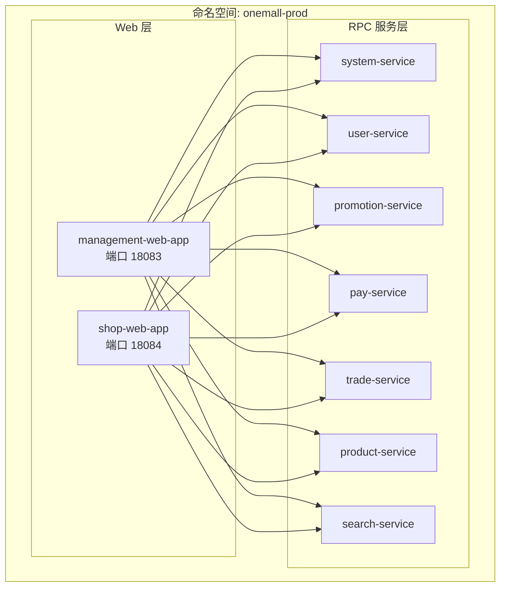
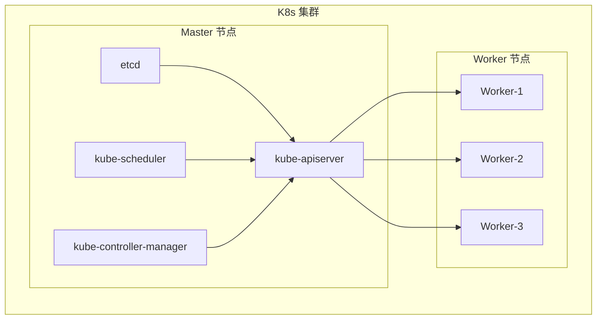
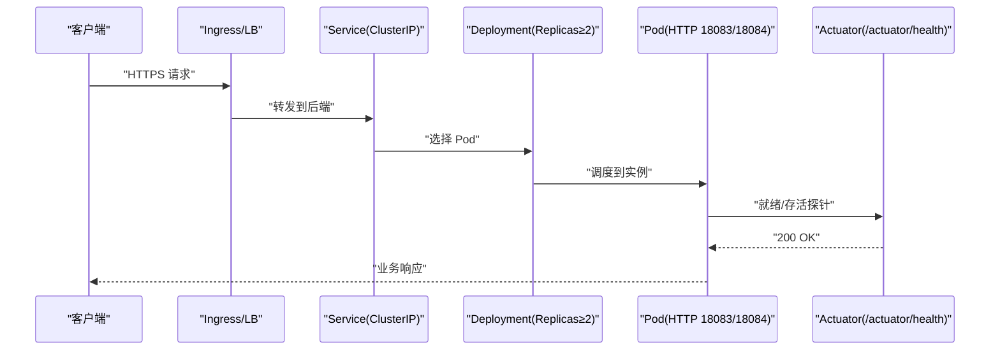
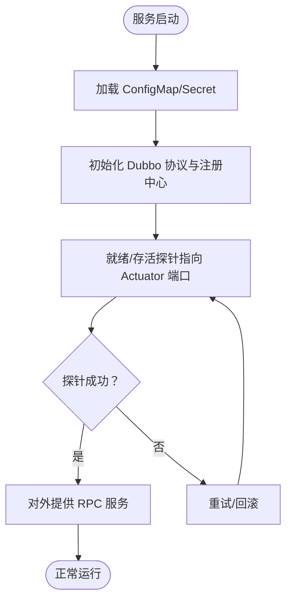
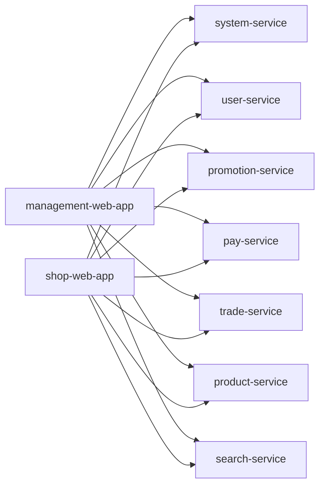

# Kubernetes集群部署

<cite>
**本文引用的文件**
- [README.md](file://README.md)
- [pom.xml](file://pom.xml)
- [management-web-app/src/main/resources/application.yml](file://management-web-app/src/main/resources/application.yml)
- [shop-web-app/src/main/resources/application.yml](file://shop-web-app/src/main/resources/application.yml)
- [pay-service-app/src/main/resources/application.yaml](file://pay-service-project/pay-service-app/src/main/resources/application.yaml)
- [product-service-app/src/main/resources/application.yaml](file://product-service-project/product-service-app/src/main/resources/application.yaml)
- [system-service-app/src/main/resources/application.yaml](file://system-service-project/system-service-app/src/main/resources/application.yaml)
</cite>

## 目录
1. [简介](#简介)
2. [项目结构](#项目结构)
3. [核心组件](#核心组件)
4. [架构总览](#架构总览)
5. [详细组件分析](#详细组件分析)
6. [依赖关系分析](#依赖关系分析)
7. [性能考量](#性能考量)
8. [故障排查指南](#故障排查指南)
9. [结论](#结论)
10. [附录](#附录)

## 简介
本指南面向 Onemall 微服务电商项目，提供在 Kubernetes(K8s) 上的完整部署与运维实践，涵盖集群架构设计、高可用、网络策略、Deployment 资源配置、Service 暴露、ConfigMap/Secret 管理、Ingress 控制器、持久化存储、命名空间与资源配额、以及监控与日志方案。文档结合仓库中现有配置文件与模块信息，给出可落地的部署步骤与最佳实践。

## 项目结构
Onemall 采用多模块 Maven 结构，后端由多个“xxx-web-app”对外提供 HTTP API，“xxx-service-project”提供内部 RPC 服务。前端模块位于独立仓库，此处关注后端服务在 K8s 中的部署。

- 核心模块概览（来源于项目结构与端口信息）
  - 对外 Web API：management-web-app（端口 18083）、shop-web-app（端口 18084）
  - RPC 服务：system-service、user-service、promotion-service、pay-service、trade-service、product-service、search-service
- 技术栈要点
  - Spring Boot 2.x、Dubbo 2.7.x、RocketMQ 4.3.x、MySQL、Redis（规划中）、Elasticsearch（规划中）
  - 监控：SkyWalking、Prometheus、Grafana、ELK（规划中）

章节来源
- [README.md: 109-126:109-126](file://README.md#L109-L126)
- [pom.xml: 16-28:16-28](file://pom.xml#L16-L28)

## 核心组件
- 外部入口
  - management-web-app：管理后台 HTTP 服务，端口 18083
  - shop-web-app：H5 商城 HTTP 服务，端口 18084
- 内部 RPC 服务
  - system-service、user-service、promotion-service、pay-service、trade-service、product-service、search-service
- 监控与可观测性
  - Prometheus、Grafana、SkyWalking（见 README.md 第 185-198 条）
- 消息与中间件
  - RocketMQ NameServer 地址在各服务配置中体现（见各 application.yaml）

章节来源
- [README.md: 185-198:185-198](file://README.md#L185-L198)
- [management-web-app/src/main/resources/application.yml: 1-83:1-83](file://management-web-app/src/main/resources/application.yml#L1-L83)
- [shop-web-app/src/main/resources/application.yml: 1-76:1-76](file://shop-web-app/src/main/resources/application.yml#L1-L76)
- [pay-service-app/src/main/resources/application.yaml: 1-65:1-65](file://pay-service-project/pay-service-app/src/main/resources/application.yaml#L1-L65)
- [product-service-app/src/main/resources/application.yaml: 1-61:1-61](file://product-service-project/product-service-app/src/main/resources/application.yaml#L1-L61)
- [system-service-app/src/main/resources/application.yaml: 1-79:1-79](file://system-service-project/system-service-app/src/main/resources/application.yaml#L1-L79)

## 架构总览
K8s 集群推荐角色划分
- Master 节点：控制面组件（kube-apiserver、etcd、scheduler、controller-manager、cloud-controller-manager）
- Worker 节点：运行 Pod（Web 与 RPC 服务），建议至少 3 节点以满足高可用
- 高可用建议
  - etcd 使用三节点或五节点集群
  - 控制面组件启用多副本与反亲和策略
  - Worker 节点打标签区分环境（如 prod、staging）并配合 PodDisruptionBudget

网络策略
- 默认拒绝入站流量，仅开放必要端口
  - Web 层：18083（management-web）、18084（shop-web）
  - RPC 层：Dubbo 协议端口（-1 表示随机，需在 K8s 中通过服务发现或固定端口策略）
  - 监控：Prometheus、Grafana、SkyWalking UI 端口按需开放
- 服务网格（可选）：Istio 或 OpenServiceMesh，实现 mTLS、细粒度路由与限流

## 详细组件分析

### Web 层：management-web-app 与 shop-web-app
- 角色定位
  - 对外 HTTP API 网关，负责请求接入与路由转发至内部 RPC 服务
- 部署要点
  - Deployment：副本数建议 ≥ 2，滚动更新策略设置最大不可用/最大超量为 25%
  - 资源限制：CPU/内存根据压测结果设定，预留 20-40% 缓冲
  - 健康检查：HTTP GET /actuator/health（Actuator 端口独立，避免暴露）
  - 注入配置：通过 ConfigMap 注入 application.yml；敏感信息使用 Secret
- Service 暴露
  - ClusterIP：内部服务间调用
  - NodePort：本地联调或边缘环境
  - LoadBalancer：生产环境推荐，自动分配公网 IP

章节来源
- [management-web-app/src/main/resources/application.yml: 1-83:1-83](file://management-web-app/src/main/resources/application.yml#L1-L83)
- [shop-web-app/src/main/resources/application.yml: 1-76:1-76](file://shop-web-app/src/main/resources/application.yml#L1-L76)

### RPC 服务层：system-service、user-service、promotion-service、pay-service、trade-service、product-service、search-service
- 角色定位
  - 内部服务，提供领域能力，通过 Dubbo 协议通信
- 部署要点
  - Deployment：副本数 ≥ 2，滚动更新策略同上
  - 资源限制：依据 RPC 调用量与数据库/消息队列压力评估
  - 健康检查：使用 Actuator 独立端口探测，避免与 RPC 端口冲突
  - 注入配置：ConfigMap 注入 application.yaml；RocketMQ NameServer 地址通过环境变量注入
- 网络与发现
  - 服务名遵循 <服务名>.<命名空间>.svc.cluster.local
  - 若 Dubbo 端口为随机（-1），需在 K8s 中通过 Headless Service 或固定端口策略保证稳定

章节来源
- [pay-service-app/src/main/resources/application.yaml: 1-65:1-65](file://pay-service-project/pay-service-app/src/main/resources/application.yaml#L1-L65)
- [product-service-app/src/main/resources/application.yaml: 1-61:1-61](file://product-service-project/product-service-app/src/main/resources/application.yaml#L1-L61)
- [system-service-app/src/main/resources/application.yaml: 1-79:1-79](file://system-service-project/system-service-app/src/main/resources/application.yaml#L1-L79)

### ConfigMap 与 Secret 管理
- ConfigMap
  - 存放 application.yml/yaml 中的非敏感配置（如端口、数据库连接、RocketMQ NameServer）
  - 建议按环境拆分：dev、staging、prod
- Secret
  - 存放数据库密码、RocketMQ 访问凭证、第三方密钥
  - 使用 kubectl create secret 或 Helm/Jsonnet 管理
- 注入方式
  - 环境变量：envFrom.configMapKeyRef/secretKeyRef
  - 文件挂载：volumeMounts + configMap/secret

章节来源
- [management-web-app/src/main/resources/application.yml: 1-83:1-83](file://management-web-app/src/main/resources/application.yml#L1-L83)
- [shop-web-app/src/main/resources/application.yml: 1-76:1-76](file://shop-web-app/src/main/resources/application.yml#L1-L76)
- [pay-service-app/src/main/resources/application.yaml: 1-65:1-65](file://pay-service-project/pay-service-app/src/main/resources/application.yaml#L1-L65)
- [product-service-app/src/main/resources/application.yaml: 1-61:1-61](file://product-service-project/product-service-app/src/main/resources/application.yaml#L1-L61)
- [system-service-app/src/main/resources/application.yaml: 1-79:1-79](file://system-service-project/system-service-app/src/main/resources/application.yaml#L1-L79)

### Service 暴露方案
- ClusterIP：默认，仅集群内部访问
- NodePort：便于本地调试，端口范围 30000-32767
- LoadBalancer：云厂商自动分配公网 IP，适合生产
- Ingress：统一入口，支持 TLS 终止与路径/主机名路由

章节来源
- [management-web-app/src/main/resources/application.yml: 1-83:1-83](file://management-web-app/src/main/resources/application.yml#L1-L83)
- [shop-web-app/src/main/resources/application.yml: 1-76:1-76](file://shop-web-app/src/main/resources/application.yml#L1-L76)

### Ingress 控制器配置
- 域名路由
  - management-web：api-dashboard.example.com → management-web Service
  - shop-web：api-h5.example.com → shop-web Service
- TLS 证书
  - 使用 cert-manager 自动签发与续期
  - Ingress annotation 指定 tls-secret
- 负载均衡
  - 后端为 ClusterIP Service，确保多副本高可用

章节来源
- [README.md: 40-96:40-96](file://README.md#L40-L96)

### 持久化存储
- 场景
  - MySQL：建议使用云厂商 RDS 或自管高可用 MySQL（不在本指南展开）
  - 日志与指标：外部集中存储（S3/对象存储）或云厂商日志服务
- PV/PVC
  - 如需在集群内落盘（如临时缓存），可使用 StorageClass + PVC
  - 注意：生产环境优先使用外部托管存储
- 备份策略
  - 数据库：定时快照 + 增量备份
  - 配置：GitOps 管理 ConfigMap/Secret

### 命名空间、资源配额与网络策略
- 命名空间
  - 建议按环境划分：onemall-dev、onemall-staging、onemall-prod
- 资源配额
  - LimitRange + ResourceQuota 控制 CPU/内存上限与默认请求
- 网络策略
  - 默认拒绝入站，仅允许必要的 Ingress/Service 流量
  - RPC 服务之间可建立白名单策略

### 监控与日志
- Metrics Server：内置，采集 Pod 指标
- Prometheus/Grafana：采集业务与系统指标，展示仪表盘
- SkyWalking：分布式追踪，观测链路
- 日志：ELK/EFK（可选），采集容器 stdout/stderr

章节来源
- [README.md: 185-198:185-198](file://README.md#L185-L198)

## 依赖关系分析
- Web 层依赖 RPC 服务
  - management-web 依赖 system、user、promotion、pay、trade、product、search
  - shop-web 依赖 system、user、promotion、pay、trade、product、search
- RPC 服务依赖中间件
  - RocketMQ Producer/Consumer
  - MySQL（MyBatis-Plus）
- 外部依赖
  - RocketMQ NameServer 地址在各服务配置中体现

章节来源
- [management-web-app/src/main/resources/application.yml: 19-71:19-71](file://management-web-app/src/main/resources/application.yml#L19-L71)
- [shop-web-app/src/main/resources/application.yml: 19-63:19-63](file://shop-web-app/src/main/resources/application.yml#L19-L63)

## 性能考量
- 资源规划
  - 初期副本数 ≥ 2，CPU/内存预留 20-40%
  - 根据压测结果调整副本数与资源上限
- 更新策略
  - RollingUpdate：maxUnavailable=25%，maxSurge=25%
  - PDB：最小可用副本数 ≥ 1
- 网络与存储
  - RPC 服务尽量与数据库、消息队列同可用区
  - 使用 SSD 类型存储，优化 IO
- 调优建议
  - JVM 参数（如堆大小）与 GC 策略按压测结果调整
  - 合理设置探针超时与间隔，避免频繁重启

## 故障排查指南
- 探针失败
  - 检查 Actuator 端口是否正确暴露与连通
  - 查看 Pod 日志与事件
- 服务不可达
  - 检查 Service 端口映射与选择器匹配
  - 检查 Ingress 路由规则与 TLS 配置
- RPC 调用异常
  - 检查 RocketMQ NameServer 地址与网络连通
  - 核对 Dubbo 协议与版本号
- 配置问题
  - 确认 ConfigMap/Secret 是否正确挂载与生效
  - 使用 kubectl describe pod 查看挂载详情

章节来源
- [management-web-app/src/main/resources/application.yml: 80-83:80-83](file://management-web-app/src/main/resources/application.yml#L80-L83)
- [shop-web-app/src/main/resources/application.yml: 72-76:72-76](file://shop-web-app/src/main/resources/application.yml#L72-L76)
- [pay-service-app/src/main/resources/application.yaml: 53-57:53-57](file://pay-service-project/pay-service-app/src/main/resources/application.yaml#L53-L57)
- [product-service-app/src/main/resources/application.yaml: 49-53:49-53](file://product-service-project/product-service-app/src/main/resources/application.yaml#L49-L53)
- [system-service-app/src/main/resources/application.yaml: 62-66:62-66](file://system-service-project/system-service-app/src/main/resources/application.yaml#L62-L66)

## 结论
本指南基于 Onemall 项目现有配置与模块结构，给出了在 K8s 上的部署蓝图：以命名空间隔离环境，以 Deployment 与 Service 管理服务生命周期与网络暴露，以 ConfigMap/Secret 管理配置与密钥，以 Ingress 提供统一入口与 TLS，以 Prometheus/Grafana/SkyWalking 构建可观测性。建议在生产环境中配套完善的网络策略、资源配额与备份策略，并持续通过压测与灰度发布优化性能与稳定性。

## 附录
- 端口参考
  - Web：18083（management-web）、18084（shop-web）
  - RPC：Dubbo 协议端口（-1 表示随机，需在 K8s 中稳定化）
  - 监控：Prometheus、Grafana、SkyWalking UI（见 README.md 第 185-198 条）
- 参考命令
  - 创建 ConfigMap/Secret：kubectl create configmap/secret
  - 应用清单：kubectl apply -f
  - 查看 Pod/事件：kubectl get pods/describe pod
  - 查看日志：kubectl logs -f