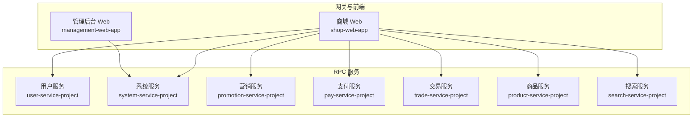
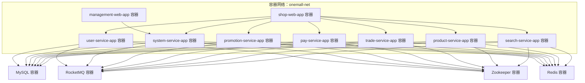
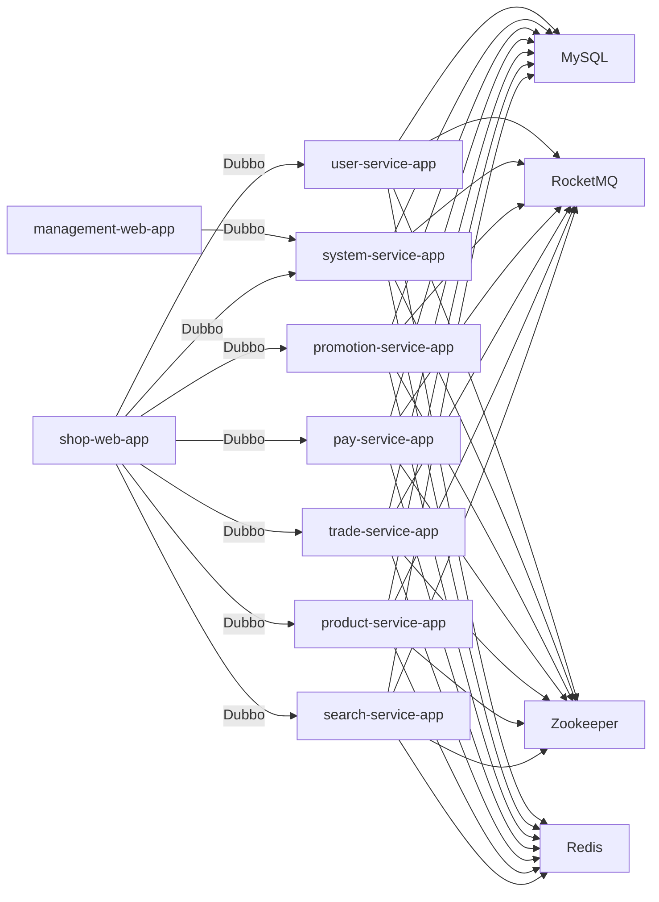

# 容器化部署

<cite>
**本文引用的文件**
- [README.md](file://README.md)
- [pom.xml](file://pom.xml)
- [management-web-app/src/main/resources/application.yml](file://management-web-app/src/main/resources/application.yml)
- [shop-web-app/src/main/resources/application.yml](file://shop-web-app/src/main/resources/application.yml)
- [pay-service-app/src/main/resources/application.yaml](file://pay-service-project/pay-service-app/src/main/resources/application.yaml)
- [product-service-app/src/main/resources/application.yaml](file://product-service-project/product-service-app/src/main/resources/application.yaml)
- [promotion-service-app/src/main/resources/application.yaml](file://promotion-service-project/promotion-service-app/src/main/resources/application.yaml)
- [search-service-app/src/main/resources/application.yaml](file://search-service-project/search-service-app/src/main/resources/application.yaml)
- [system-service-app/src/main/resources/application.yaml](file://system-service-project/system-service-app/src/main/resources/application.yaml)
- [trade-service-app/src/main/resources/application.yaml](file://trade-service-project/trade-service-app/src/main/resources/application.yaml)
- [user-service-app/src/main/resources/application.yaml](file://user-service-project/user-service-app/src/main/resources/application.yaml)
</cite>

## 目录
1. [简介](#简介)
2. [项目结构](#项目结构)
3. [核心组件](#核心组件)
4. [架构总览](#架构总览)
5. [详细组件分析](#详细组件分析)
6. [依赖分析](#依赖分析)
7. [性能考量](#性能考量)
8. [故障排查指南](#故障排查指南)
9. [结论](#结论)
10. [附录](#附录)

## 简介
本文件面向 Onemall 微服务电商项目，提供一套完整的 Docker 容器化部署方案，覆盖以下方面：
- Dockerfile 编写规范与多阶段构建
- 依赖管理与安全最佳实践
- Docker Compose 容器编排（含网络、卷、环境变量）
- 镜像构建与推送流程（含标签策略与私有仓库）
- 运行时配置（资源限制、健康检查、重启策略、日志）
- 容器网络拓扑（服务发现、负载均衡、跨容器通信）
- 安全加固（非 root 用户、只读文件系统、敏感信息保护）
- 监控与日志（指标采集、日志聚合、故障排查）

## 项目结构
Onemall 采用多模块 Maven 聚合工程，包含多个后端 Web 应用与对应的 RPC 服务模块。下图给出与容器化部署直接相关的模块关系。

图表来源
- [pom.xml:16-27](file://pom.xml#L16-L27)
- [README.md:109-125](file://README.md#L109-L125)

章节来源
- [pom.xml:16-27](file://pom.xml#L16-L27)
- [README.md:109-125](file://README.md#L109-L125)

## 核心组件
- Web 应用
  - 管理后台 Web：对外提供管理 API，端口与上下文路径见配置。
  - 商城 Web：对外提供用户购物流程 API，端口与上下文路径见配置。
- RPC 服务
  - 用户、系统、营销、支付、交易、商品、搜索等服务，均通过 Dubbo 暴露 RPC 接口。
- 配置要点
  - Web 应用通过 Dubbo Cloud Alibaba 配置订阅目标服务，消费者侧设置超时与版本。
  - Actuator 独立端口暴露监控端点，便于容器健康检查与运维。

章节来源
- [management-web-app/src/main/resources/application.yml:1-83](file://management-web-app/src/main/resources/application.yml#L1-L83)
- [shop-web-app/src/main/resources/application.yml:1-76](file://shop-web-app/src/main/resources/application.yml#L1-L76)
- [README.md:141-162](file://README.md#L141-L162)

## 架构总览
下图展示容器化后的典型拓扑：Web 应用容器通过 Dubbo 与各 RPC 服务容器通信；数据库、消息队列、注册中心等外部依赖通过独立容器或外部服务提供。

图表来源
- [README.md:141-162](file://README.md#L141-L162)
- [management-web-app/src/main/resources/application.yml:19-71](file://management-web-app/src/main/resources/application.yml#L19-L71)
- [shop-web-app/src/main/resources/application.yml:19-59](file://shop-web-app/src/main/resources/application.yml#L19-L59)

## 详细组件分析

### Web 应用容器化要点
- 管理后台 Web
  - 对外端口：18083
  - 上下文路径：/management-api/
  - Actuator 独立端口：38087
- 商城 Web
  - 对外端口：18084
  - 上下文路径：/shop-api/
  - Actuator 独立端口：38088
- 健康检查
  - 建议使用 Actuator 端点进行健康检查，避免直接检查业务端口。
- 环境变量
  - 通过环境变量注入数据库、注册中心、消息队列等连接信息，避免硬编码。

章节来源
- [management-web-app/src/main/resources/application.yml:1-83](file://management-web-app/src/main/resources/application.yml#L1-L83)
- [shop-web-app/src/main/resources/application.yml:1-76](file://shop-web-app/src/main/resources/application.yml#L1-L76)

### RPC 服务容器化要点
- 用户服务、系统服务、营销服务、支付服务、交易服务、商品服务、搜索服务
- 建议每个服务独立容器，通过 Zookeeper 进行服务注册与发现
- 建议通过环境变量注入数据库、消息队列、Redis 等依赖连接信息

章节来源
- [user-service-app/src/main/resources/application.yaml](file://user-service-project/user-service-app/src/main/resources/application.yaml)
- [system-service-app/src/main/resources/application.yaml](file://system-service-project/system-service-app/src/main/resources/application.yaml)
- [promotion-service-app/src/main/resources/application.yaml](file://promotion-service-project/promotion-service-app/src/main/resources/application.yaml)
- [pay-service-app/src/main/resources/application.yaml](file://pay-service-project/pay-service-app/src/main/resources/application.yaml)
- [trade-service-app/src/main/resources/application.yaml](file://trade-service-project/trade-service-app/src/main/resources/application.yaml)
- [product-service-app/src/main/resources/application.yaml](file://product-service-project/product-service-app/src/main/resources/application.yaml)
- [search-service-app/src/main/resources/application.yaml](file://search-service-project/search-service-app/src/main/resources/application.yaml)

### Dockerfile 编写规范与多阶段构建
- 基础镜像选择
  - 生产镜像建议基于官方 OpenJDK 或 Amazon Corretto 基础镜像，确保可复现性与安全性。
- 多阶段构建
  - 第一阶段：使用完整 JDK 构建产物（编译、打包）。
  - 第二阶段：仅复制最小运行时依赖（JRE），减少镜像体积与攻击面。
- 依赖管理
  - 在第一阶段使用 Maven/Gradle 下载依赖并缓存，第二阶段仅复制最终产物。
- 安全最佳实践
  - 非 root 用户运行（添加用户并 chown 对应目录）。
  - 文件系统只读（除日志目录外），禁用 shell。
  - 仅暴露必要端口，隐藏内部管理端口。
  - 使用只读根文件系统，挂载必要的卷（如日志目录）。

### Docker Compose 容器编排
- 网络
  - 自定义桥接网络 onemall-net，实现服务间 DNS 解析与隔离。
- 服务
  - management-web-app、shop-web-app、user-service-app、system-service-app、promotion-service-app、pay-service-app、trade-service-app、product-service-app、search-service-app。
- 环境变量
  - 通过 env 文件或 secrets 注入数据库、注册中心、消息队列、Redis 连接信息。
- 卷
  - 日志目录挂载至宿主机，便于采集与保留。
- 健康检查
  - 使用 HTTP GET /actuator/health 或 curl 命令检查 Actuator 端点。
- 重启策略
  - 默认 unless-stopped，结合健康检查自动恢复。
- 依赖顺序
  - 通过 depends_on 和 healthcheck 组合，确保数据库、注册中心、消息队列就绪后再启动业务容器。

### 镜像构建与推送流程
- 构建参数
  - 指定上下文与 Dockerfile 路径，启用 buildkit 以提升性能。
- 标签管理
  - 建议采用语义化版本（vX.Y.Z）与时间戳组合，区分环境（dev/stage/prod）。
- 私有仓库
  - 使用 HTTPS 与认证，开启镜像扫描，限制拉取权限。
- 推送
  - CI 中统一推送，失败回滚策略与签名验证。

### 容器运行时配置
- 资源限制
  - 为每个容器设置 CPU/内存上限，避免资源争抢。
- 健康检查
  - 使用 HTTP GET /actuator/health，失败次数阈值与重试间隔合理配置。
- 重启策略
  - unless-stopped 或 on-failure，结合探针避免无限重启。
- 日志
  - stdout/stderr 输出到容器日志驱动，结合日志收集器集中存储。

### 容器网络拓扑
- 服务发现
  - 业务容器通过 Zookeeper 获取服务列表，Dubbo 消费者按需调用。
- 负载均衡
  - 在客户端或注册中心层面实现软负载均衡，避免单点。
- 跨容器通信
  - 通过自定义网络 onemall-net 互通，仅开放必要端口，避免暴露内部管理端口。

### 容器安全配置
- 非 root 用户
  - 创建专用用户并 chown 运行目录，以非 root 身份启动进程。
- 只读文件系统
  - 除日志目录外，其余目录只读，降低持久化攻击面。
- 敏感信息保护
  - 使用 Docker Secrets 或 Kubernetes Secret 注入密钥，避免明文写入镜像。
  - 环境变量中避免硬编码密码与令牌。

### 监控与日志
- 指标采集
  - 启用 Spring Boot Actuator，结合 Prometheus 抓取 /actuator/prometheus。
- 日志聚合
  - 容器 stdout 由日志驱动输出，结合 Fluent Bit/Filebeat/Fluentd 收集至 ES/S3。
- 故障排查
  - 结合容器日志、服务注册中心状态、消息队列监控与链路追踪系统（如 SkyWalking）定位问题。

## 依赖分析
- Web 应用依赖
  - Dubbo Cloud Alibaba：服务发现与 RPC 调用
  - Actuator：健康检查与指标暴露
- RPC 服务依赖
  - MySQL：持久化存储
  - RocketMQ：异步消息
  - Zookeeper：服务注册与发现
  - Redis：缓存与分布式锁（视模块而定）

图表来源
- [README.md:141-162](file://README.md#L141-L162)
- [management-web-app/src/main/resources/application.yml:19-71](file://management-web-app/src/main/resources/application.yml#L19-L71)
- [shop-web-app/src/main/resources/application.yml:19-59](file://shop-web-app/src/main/resources/application.yml#L19-L59)

章节来源
- [README.md:141-162](file://README.md#L141-L162)
- [management-web-app/src/main/resources/application.yml:19-71](file://management-web-app/src/main/resources/application.yml#L19-L71)
- [shop-web-app/src/main/resources/application.yml:19-59](file://shop-web-app/src/main/resources/application.yml#L19-L59)

## 性能考量
- 镜像体积
  - 多阶段构建与精简基础镜像，减少启动与传输时间。
- JVM 优化
  - 合理设置堆大小与 GC 参数，结合容器资源限制避免 OOM。
- 并发与线程
  - 根据 CPU 核心数与容器配额调整线程池大小，避免过度竞争。
- 存储与 IO
  - 将日志与临时文件挂载至高性能磁盘，避免容器层频繁写入。

## 故障排查指南
- 健康检查失败
  - 检查 Actuator 端口是否暴露且可达，确认业务端口监听状态。
- 服务无法发现
  - 检查 Zookeeper 是否正常，确认服务注册与订阅配置。
- RPC 调用超时
  - 检查网络连通性、消费者超时配置与服务端处理能力。
- 日志缺失
  - 检查容器日志驱动与采集器配置，确认卷挂载与权限。
- 数据库连接异常
  - 检查数据库容器状态、网络连通与凭据注入。

## 结论
通过多阶段构建、最小化运行时、严格的网络与安全策略，Onemall 可以在容器环境中实现稳定、可观测、可扩展的交付。建议在生产环境配合成熟的编排平台与监控体系，持续优化资源与性能。

## 附录
- 端口与上下文路径参考
  - 管理后台 Web：端口 18083，上下文 /management-api/，Actuator 独立端口 38087
  - 商城 Web：端口 18084，上下文 /shop-api/，Actuator 独立端口 38088
- 关键依赖
  - Dubbo Cloud Alibaba、Zookeeper、MySQL、RocketMQ、Redis