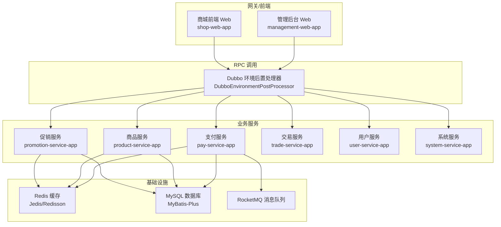
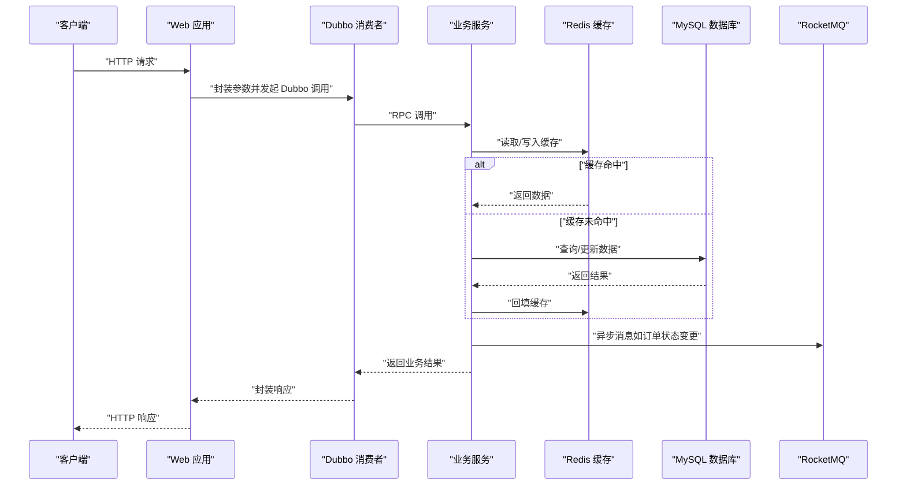
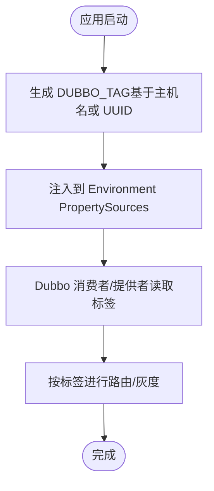
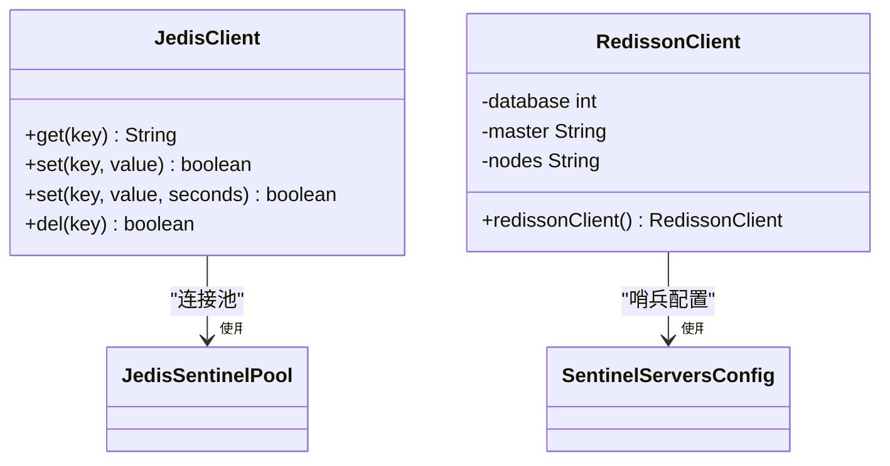
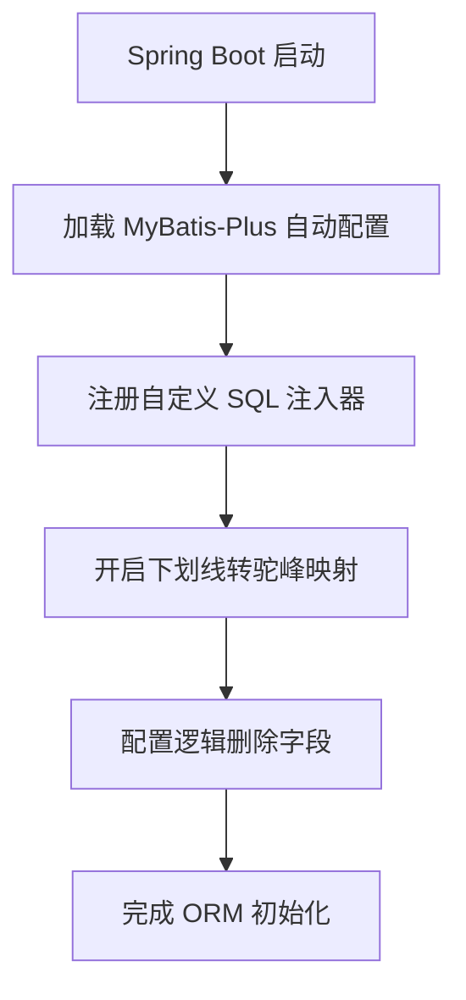
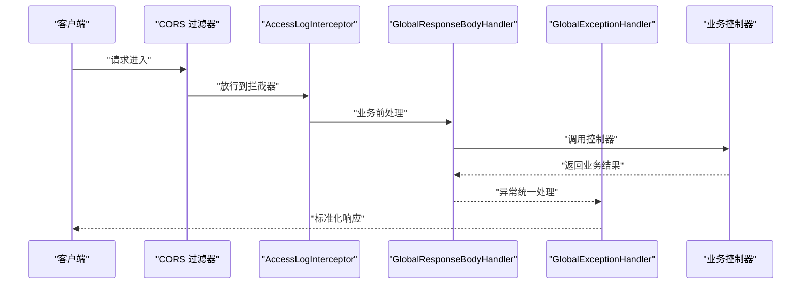
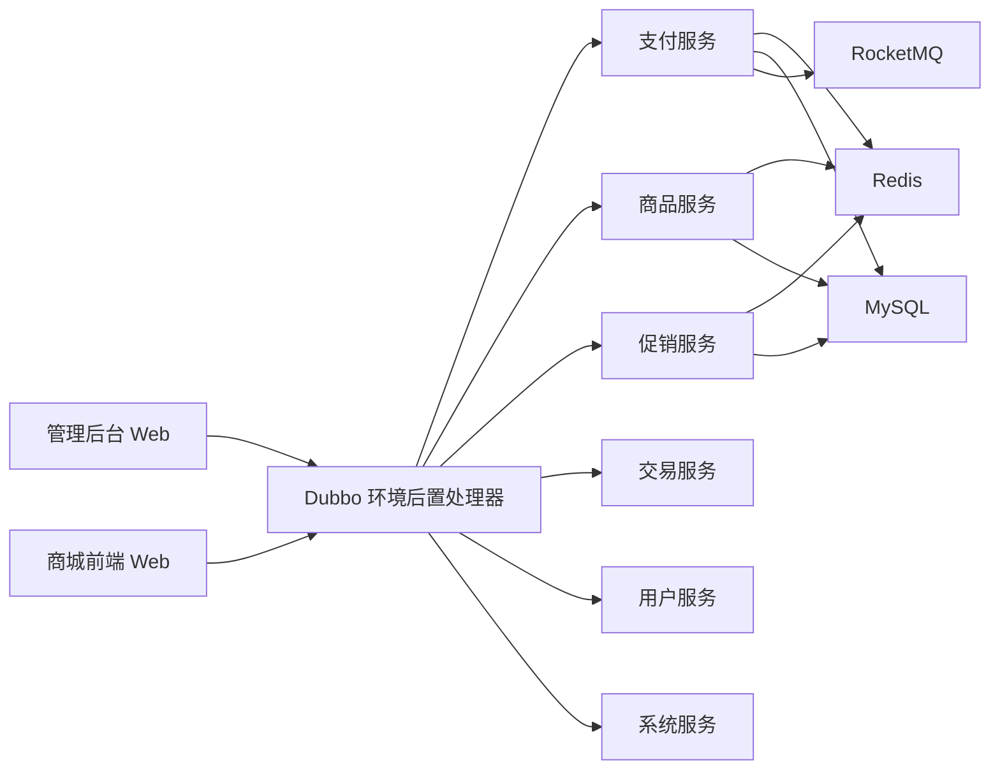

# 性能优化

<cite>
**本文档引用的文件**
- [pom.xml](file://pom.xml)
- [redis.properties](file://common/mall-spring-boot-starter-cache/src/main/resources/redis.properties)
- [application.yml（管理后台）](file://management-web-app/src/main/resources/application.yml)
- [application.yml（商城前端）](file://shop-web-app/src/main/resources/application.yml)
- [application.yaml（支付服务）](file://pay-service-project/pay-service-app/src/main/resources/application.yaml)
- [application.yaml（商品服务）](file://product-service-project/product-service-app/src/main/resources/application.yaml)
- [application.yaml（促销服务）](file://promotion-service-project/promotion-service-app/src/main/resources/application.yaml)
- [DubboEnvironmentPostProcessor.java](file://common/mall-spring-boot-starter-dubbo/src/main/java/cn/iocoder/mall/dubbo/config/DubboEnvironmentPostProcessor.java)
- [MybatisPlusAutoConfiguration.java](file://common/mall-spring-boot-starter-mybatis/src/main/java/cn/iocoder/mall/mybatis/config/MybatisPlusAutoConfiguration.java)
- [JedisClient.java](file://common/mall-spring-boot-starter-cache/src/main/java/cn/iocoder/mall/cache/config/JedisClient.java)
- [RedissonClient.java](file://common/mall-spring-boot-starter-cache/src/main/java/cn/iocoder/mall/cache/config/RedissonClient.java)
- [CommonWebAutoConfiguration.java](file://common/mall-spring-boot-starter-web/src/main/java/cn/iocoder/mall/web/config/CommonWebAutoConfiguration.java)
</cite>

## 目录
1. [简介](#简介)
2. [项目结构](#项目结构)
3. [核心组件](#核心组件)
4. [架构总览](#架构总览)
5. [详细组件分析](#详细组件分析)
6. [依赖关系分析](#依赖关系分析)
7. [性能考量与优化建议](#性能考量与优化建议)
8. [故障排查指南](#故障排查指南)
9. [结论](#结论)
10. [附录](#附录)

## 简介
本指南面向 Onemall 微服务架构项目，围绕 JVM 性能调优、数据库性能优化、应用层性能优化、网络性能优化、微服务性能考虑、容量规划、性能测试与监控告警等方面，结合仓库现有配置与实现，给出可落地的优化策略与实操建议。内容以“从代码到配置”的视角展开，帮助读者快速定位性能瓶颈并实施改进。

## 项目结构
Onemall 采用多模块 Maven 结构，包含通用能力模块与多个业务服务模块（如用户、系统、支付、商品、促销、交易等），并通过 Spring Boot 启动各服务。管理后台与商城前端通过 Dubbo RPC 调用后端服务；缓存层采用 Redis（Jedis/Redisson）；ORM 使用 MyBatis-Plus；Web 层统一接入 FastJSON 序列化与全局拦截器。

图表来源
- [application.yml（管理后台）:19-71](file://management-web-app/src/main/resources/application.yml#L19-L71)
- [application.yml（商城前端）:19-63](file://shop-web-app/src/main/resources/application.yml#L19-L63)
- [application.yaml（支付服务）:21-56](file://pay-service-project/pay-service-app/src/main/resources/application.yaml#L21-L56)
- [application.yaml（商品服务）:21-53](file://product-service-project/product-service-app/src/main/resources/application.yaml#L21-L53)
- [application.yaml（促销服务）:21-57](file://promotion-service-project/promotion-service-app/src/main/resources/application.yaml#L21-L57)
- [DubboEnvironmentPostProcessor.java:16-45](file://common/mall-spring-boot-starter-dubbo/src/main/java/cn/iocoder/mall/dubbo/config/DubboEnvironmentPostProcessor.java#L16-L45)
- [JedisClient.java:13-79](file://common/mall-spring-boot-starter-cache/src/main/java/cn/iocoder/mall/cache/config/JedisClient.java#L13-L79)
- [RedissonClient.java:19-50](file://common/mall-spring-boot-starter-cache/src/main/java/cn/iocoder/mall/cache/config/RedissonClient.java#L19-L50)

章节来源
- [pom.xml:16-28](file://pom.xml#L16-L28)
- [application.yml（管理后台）:19-83](file://management-web-app/src/main/resources/application.yml#L19-L83)
- [application.yml（商城前端）:19-76](file://shop-web-app/src/main/resources/application.yml#L19-L76)
- [application.yaml（支付服务）:21-65](file://pay-service-project/pay-service-app/src/main/resources/application.yaml#L21-L65)
- [application.yaml（商品服务）:21-61](file://product-service-project/product-service-app/src/main/resources/application.yaml#L21-L61)
- [application.yaml（促销服务）:21-65](file://promotion-service-project/promotion-service-app/src/main/resources/application.yaml#L21-L65)

## 核心组件
- Dubbo RPC 与路由标签：通过环境后置处理器动态生成 DUBBO_TAG，便于本地开发与灰度路由。
- 缓存客户端：同时提供 Jedis 与 Redisson 两种实现，支持哨兵模式与过期策略。
- ORM 配置：MyBatis-Plus 自动装配扩展注入器，统一驼峰映射与逻辑删除。
- Web 统一处理：全局响应体包装、异常处理、跨域过滤、FastJSON 消息转换器。
- Actuator 监控：独立端口暴露监控端点，便于性能观测与告警集成。

章节来源
- [DubboEnvironmentPostProcessor.java:16-66](file://common/mall-spring-boot-starter-dubbo/src/main/java/cn/iocoder/mall/dubbo/config/DubboEnvironmentPostProcessor.java#L16-L66)
- [JedisClient.java:13-79](file://common/mall-spring-boot-starter-cache/src/main/java/cn/iocoder/mall/cache/config/JedisClient.java#L13-L79)
- [RedissonClient.java:19-50](file://common/mall-spring-boot-starter-cache/src/main/java/cn/iocoder/mall/cache/config/RedissonClient.java#L19-L50)
- [MybatisPlusAutoConfiguration.java:12-23](file://common/mall-spring-boot-starter-mybatis/src/main/java/cn/iocoder/mall/mybatis/config/MybatisPlusAutoConfiguration.java#L12-L23)
- [CommonWebAutoConfiguration.java:28-96](file://common/mall-spring-boot-starter-web/src/main/java/cn/iocoder/mall/web/config/CommonWebAutoConfiguration.java#L28-L96)

## 架构总览
下图展示请求在系统中的流转：前端 Web 通过 Dubbo 调用后端服务，服务内部使用缓存与数据库，并通过消息队列异步解耦。

图表来源
- [application.yml（管理后台）:19-71](file://management-web-app/src/main/resources/application.yml#L19-L71)
- [application.yml（商城前端）:19-63](file://shop-web-app/src/main/resources/application.yml#L19-L63)
- [application.yaml（支付服务）:21-56](file://pay-service-project/pay-service-app/src/main/resources/application.yaml#L21-L56)
- [application.yaml（商品服务）:21-53](file://product-service-project/product-service-app/src/main/resources/application.yaml#L21-L53)
- [application.yaml（促销服务）:21-57](file://promotion-service-project/promotion-service-app/src/main/resources/application.yaml#L21-L57)
- [JedisClient.java:19-77](file://common/mall-spring-boot-starter-cache/src/main/java/cn/iocoder/mall/cache/config/JedisClient.java#L19-L77)

## 详细组件分析

### 组件一：Dubbo RPC 与路由标签
- 目的：为本地开发与灰度路由提供稳定标识，减少因主机名差异导致的路由问题。
- 实现：环境后置处理器在启动时生成 DUBBO_TAG 并注入环境，供 Dubbo 提供者/消费者使用。
- 性能影响：合理的路由标签有助于将流量定向至健康实例，降低跨机房/跨地域调用延迟。

图表来源
- [DubboEnvironmentPostProcessor.java:34-44](file://common/mall-spring-boot-starter-dubbo/src/main/java/cn/iocoder/mall/dubbo/config/DubboEnvironmentPostProcessor.java#L34-L44)

章节来源
- [DubboEnvironmentPostProcessor.java:16-66](file://common/mall-spring-boot-starter-dubbo/src/main/java/cn/iocoder/mall/dubbo/config/DubboEnvironmentPostProcessor.java#L16-L66)
- [application.yml（管理后台）:20-71](file://management-web-app/src/main/resources/application.yml#L20-L71)
- [application.yml（商城前端）:19-63](file://shop-web-app/src/main/resources/application.yml#L19-L63)

### 组件二：缓存客户端（Jedis 与 Redisson）
- JedisClient：基于 JedisSentinelPool 的同步操作封装，提供 get/set/del 及带过期时间的 set。
- RedissonClient：基于哨兵模式的 Redisson 客户端，支持只读从节点读取与数据库选择。
- 性能要点：连接池参数、超时控制、过期策略、哨兵节点健康检查直接影响命中率与延迟。

图表来源
- [JedisClient.java:13-79](file://common/mall-spring-boot-starter-cache/src/main/java/cn/iocoder/mall/cache/config/JedisClient.java#L13-L79)
- [RedissonClient.java:19-50](file://common/mall-spring-boot-starter-cache/src/main/java/cn/iocoder/mall/cache/config/RedissonClient.java#L19-L50)

章节来源
- [JedisClient.java:13-79](file://common/mall-spring-boot-starter-cache/src/main/java/cn/iocoder/mall/cache/config/JedisClient.java#L13-L79)
- [RedissonClient.java:19-50](file://common/mall-spring-boot-starter-cache/src/main/java/cn/iocoder/mall/cache/config/RedissonClient.java#L19-L50)
- [redis.properties:1-18](file://common/mall-spring-boot-starter-cache/src/main/resources/redis.properties#L1-L18)

### 组件三：ORM 配置（MyBatis-Plus）
- 自动装配扩展注入器，启用驼峰映射与逻辑删除字段，统一 Mapper/XML 路径与类型别名包。
- 性能影响：合理使用逻辑删除、分页查询、批量插入/更新可显著降低数据库压力。

图表来源
- [MybatisPlusAutoConfiguration.java:12-23](file://common/mall-spring-boot-starter-mybatis/src/main/java/cn/iocoder/mall/mybatis/config/MybatisPlusAutoConfiguration.java#L12-L23)

章节来源
- [MybatisPlusAutoConfiguration.java:12-23](file://common/mall-spring-boot-starter-mybatis/src/main/java/cn/iocoder/mall/mybatis/config/MybatisPlusAutoConfiguration.java#L12-L23)
- [application.yaml（支付服务）:9-19](file://pay-service-project/pay-service-app/src/main/resources/application.yaml#L9-L19)
- [application.yaml（商品服务）:9-19](file://product-service-project/product-service-app/src/main/resources/application.yaml#L9-L19)
- [application.yaml（促销服务）:9-19](file://promotion-service-project/promotion-service-app/src/main/resources/application.yaml#L9-L19)

### 组件四：Web 层统一处理（全局响应、异常、跨域、序列化）
- 全局响应体包装与异常处理，统一输出格式。
- AccessLogInterceptor 可选接入，用于访问日志采集。
- CORS 过滤器与 FastJSON 消息转换器，提升序列化性能与兼容性。

图表来源
- [CommonWebAutoConfiguration.java:34-96](file://common/mall-spring-boot-starter-web/src/main/java/cn/iocoder/mall/web/config/CommonWebAutoConfiguration.java#L34-L96)

章节来源
- [CommonWebAutoConfiguration.java:28-96](file://common/mall-spring-boot-starter-web/src/main/java/cn/iocoder/mall/web/config/CommonWebAutoConfiguration.java#L28-L96)

## 依赖关系分析
- 模块间依赖：管理后台与商城前端通过 Dubbo 消费多个业务服务；业务服务之间通过 RPC 或消息队列交互。
- 外部依赖：Redis（Jedis/Redisson）、MySQL（MyBatis-Plus）、RocketMQ、Actuator 监控。
- 配置分布：各服务独立的 application 配置文件，集中管理 Dubbo、MyBatis、Actuator 等关键参数。

图表来源
- [application.yml（管理后台）:19-71](file://management-web-app/src/main/resources/application.yml#L19-L71)
- [application.yml（商城前端）:19-63](file://shop-web-app/src/main/resources/application.yml#L19-L63)
- [application.yaml（支付服务）:21-56](file://pay-service-project/pay-service-app/src/main/resources/application.yaml#L21-L56)
- [application.yaml（商品服务）:21-53](file://product-service-project/product-service-app/src/main/resources/application.yaml#L21-L53)
- [application.yaml（促销服务）:21-57](file://promotion-service-project/promotion-service-app/src/main/resources/application.yaml#L21-L57)

章节来源
- [pom.xml:16-28](file://pom.xml#L16-L28)
- [application.yml（管理后台）:19-83](file://management-web-app/src/main/resources/application.yml#L19-L83)
- [application.yml（商城前端）:19-76](file://shop-web-app/src/main/resources/application.yml#L19-L76)
- [application.yaml（支付服务）:21-65](file://pay-service-project/pay-service-app/src/main/resources/application.yaml#L21-L65)
- [application.yaml（商品服务）:21-61](file://product-service-project/product-service-app/src/main/resources/application.yaml#L21-L61)
- [application.yaml（促销服务）:21-65](file://promotion-service-project/promotion-service-app/src/main/resources/application.yaml#L21-L65)

## 性能考量与优化建议

### JVM 性能调优
- 堆内存配置
  - 建议根据服务吞吐量与对象生命周期设定新生代/老年代比例，优先保证 GC 周期短、晋升失败少。
  - 对于高并发 RPC 服务（如支付、商品、促销），可适当增大堆上限并优化新生代大小。
- 垃圾回收器选择
  - 生产环境推荐 G1 或 ZGC（JDK 11+），降低停顿时间；对低延迟要求高的服务优先考虑 ZGC。
  - 本地开发可使用 Parallel Scavenge + Parallel Old，提高吞吐。
- GC 参数调优
  - 控制 Full GC 触发阈值与并发阶段占比，避免长时间 STW。
  - 开启自适应尺寸与增量更新失败重试，平衡吞吐与延迟。
- JVM 监控指标
  - 关注堆使用率、GC 次数/耗时、晋升失败次数、存活对象大小、YGC/MixGC 时间占比。
  - 结合 Actuator 指标导出，建立告警阈值。

### 数据库性能优化
- 慢查询分析
  - 开启慢查询日志，定位超过阈值的 SQL；结合 EXPLAIN 分析执行计划。
- 索引优化
  - 为高频过滤/排序字段建立复合索引；避免冗余与重复索引。
  - 使用覆盖索引减少回表；对范围查询注意最左前缀原则。
- 连接池配置
  - 连接池大小与等待队列长度需与 QPS 和平均响应时间匹配；避免过度连接导致上下文切换。
  - 合理设置空闲回收与连接有效性检测，减少无效连接。
- SQL 优化
  - 避免 SELECT *；使用 LIMIT 限制结果集；批量更新/删除使用批处理。
  - 使用逻辑删除替代物理删除，减少大表扫描。

### 应用层性能优化
- 缓存策略
  - 读多写少场景使用多级缓存（本地缓存 + Redis）；写后失效或延时双删。
  - 对热点数据设置合理过期时间，避免雪崩；使用互斥锁防止缓存击穿。
- 异步处理
  - 将非关键路径操作异步化（如日志、通知、报表），降低主流程延迟。
- 批量操作
  - 批量插入/更新/删除，减少网络往返与事务开销。
- 连接复用
  - HTTP 客户端与 RPC 客户端均应启用连接池与长连接，减少握手成本。

### 网络性能优化
- TCP 参数调优
  - 调整内核发送/接收缓冲区、TIME_WAIT 复用、快速重传等参数，提升并发与抗抖动能力。
- HTTP 连接池
  - 合理设置最大连接数、空闲超时、Keep-Alive；针对不同目标域名分池。
- DNS 优化
  - 使用本地 DNS 缓存与多 IP 轮询；缩短解析超时。
- CDN 配置
  - 对静态资源启用 CDN，结合缓存头与压缩策略，降低源站压力。

### 微服务架构的性能考虑
- 服务拆分
  - 以业务边界划分服务，避免过度拆分导致调用链过长；对高频调用的服务合并或引入缓存。
- 负载均衡
  - 采用就近访问与权重调度，结合健康检查剔除异常实例。
- 熔断降级
  - 对下游不稳定接口启用熔断，快速失败并返回兜底数据；对降级策略分级管理。
- 限流策略
  - 在网关与服务入口分别设置限流，区分白名单、普通用户与营销活动流量。

### 容量规划
- QPS 评估
  - 基于峰值场景估算各服务 QPS，考虑突发流量与峰值波动。
- 资源需求预测
  - CPU：核数与单核利用率；内存：堆大小与元空间；磁盘：IO 与 WAL；网络：带宽与并发连接。
- 扩容策略
  - 垂直扩容优先验证性能收益；水平扩容需关注状态一致性与数据分片。

### 性能测试方法
- 压力测试
  - 使用压测工具模拟峰值流量，观察 P99 延迟、错误率与资源占用。
- 负载测试
  - 在稳定状态下逐步增加负载，识别拐点与瓶颈。
- 稳定性测试
  - 长时间运行，观察 GC 行为、内存泄漏与资源泄露风险。

### 性能监控与告警
- 指标体系
  - 应用层：QPS、P99、错误率、线程池饱和度、缓存命中率。
  - 数据层：连接池使用率、慢查询数、锁等待、磁盘 IO。
  - 基础设施：CPU、内存、网络、磁盘、GC。
- 告警策略
  - 分级告警（预警/严重），结合趋势与基线；避免告警风暴。

## 故障排查指南
- 缓存异常
  - 检查哨兵节点连通性与密码配置；确认连接池参数与超时设置是否合理。
  - 关注过期策略与热点键分布，避免集中过期。
- RPC 调用异常
  - 查看路由标签是否正确，确认提供者/消费者版本一致；检查超时与重试策略。
- 数据库抖动
  - 审视慢查询与索引缺失；核对连接池配置与事务隔离级别。
- GC 抖动
  - 分析 GC 日志，调整堆大小与回收器；优化对象生命周期与逃逸分析。

章节来源
- [redis.properties:1-18](file://common/mall-spring-boot-starter-cache/src/main/resources/redis.properties#L1-L18)
- [JedisClient.java:19-77](file://common/mall-spring-boot-starter-cache/src/main/java/cn/iocoder/mall/cache/config/JedisClient.java#L19-L77)
- [RedissonClient.java:35-49](file://common/mall-spring-boot-starter-cache/src/main/java/cn/iocoder/mall/cache/config/RedissonClient.java#L35-L49)
- [application.yml（管理后台）:20-71](file://management-web-app/src/main/resources/application.yml#L20-L71)
- [application.yml（商城前端）:19-63](file://shop-web-app/src/main/resources/application.yml#L19-L63)
- [application.yaml（支付服务）:21-56](file://pay-service-project/pay-service-app/src/main/resources/application.yaml#L21-L56)
- [application.yaml（商品服务）:21-53](file://product-service-project/product-service-app/src/main/resources/application.yaml#L21-L53)
- [application.yaml（促销服务）:21-57](file://promotion-service-project/promotion-service-app/src/main/resources/application.yaml#L21-L57)

## 结论
Onemall 已具备良好的微服务基础：统一的 Web 处理、ORM 配置、缓存与 RPC 能力。结合本文的 JVM、数据库、应用层、网络与监控告警建议，可在保持架构清晰的前提下，系统性地提升整体性能与稳定性。建议先从缓存命中率、慢查询与 GC 抖动入手，再逐步完善限流、熔断与容量规划。

## 附录
- Actuator 端点：独立端口暴露，便于采集指标与健康检查。
- 配置建议清单
  - JVM：G1/ZGC、堆大小、GC 参数、监控指标
  - 数据库：慢查询、索引、连接池、SQL 优化
  - 应用：缓存策略、异步、批量、连接复用
  - 网络：TCP、HTTP 连接池、DNS、CDN
  - 微服务：拆分、LB、熔断、限流
  - 容量：QPS 评估、资源预测、扩容策略
  - 测试：压测、负载、稳定性
  - 监控：指标体系、告警策略