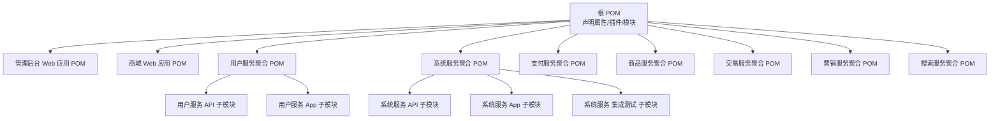
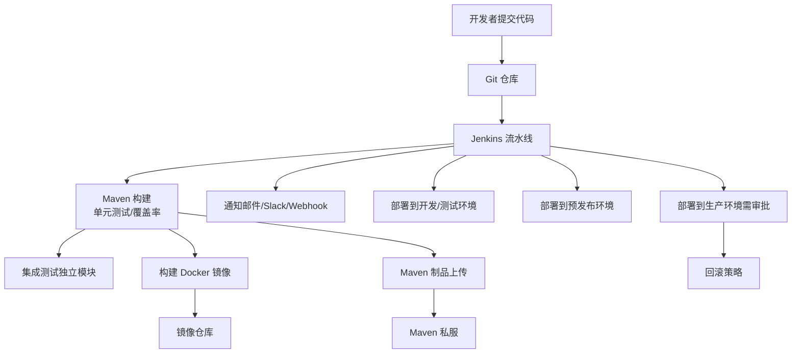
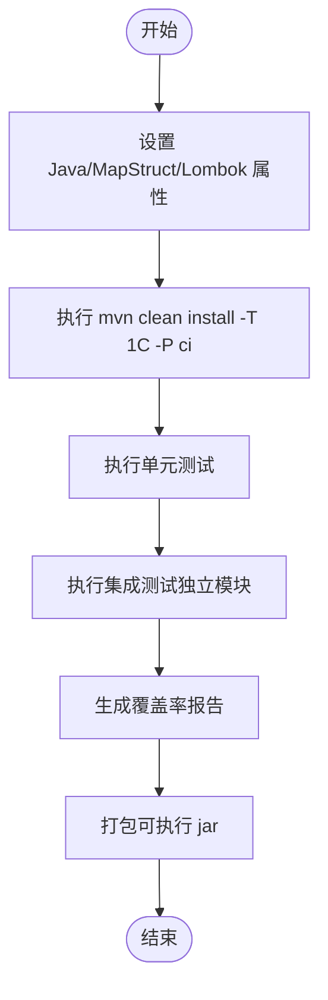
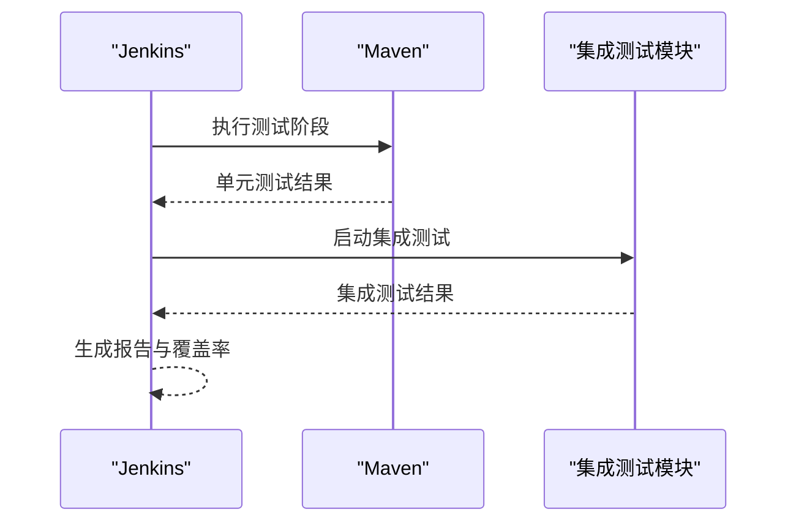
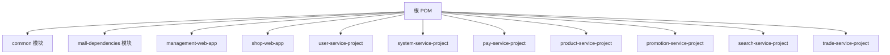

# 持续集成与部署

<cite>
**本文引用的文件**
- [根 POM](file://pom.xml)
- [管理后台 Web 应用 POM](file://management-web-app/pom.xml)
- [商城 Web 应用 POM](file://shop-web-app/pom.xml)
- [用户服务聚合 POM](file://user-service-project/pom.xml)
- [系统服务聚合 POM](file://system-service-project/pom.xml)
- [系统服务集成测试 POM](file://system-service-project/system-service-integration-test/pom.xml)
- [用户服务应用 Dev 配置](file://user-service-project/user-service-app/src/main/resources/application-dev.yaml)
- [Onemall 项目说明](file://README.md)
</cite>

## 目录
1. [引言](#引言)
2. [项目结构](#项目结构)
3. [核心组件](#核心组件)
4. [架构总览](#架构总览)
5. [详细组件分析](#详细组件分析)
6. [依赖关系分析](#依赖关系分析)
7. [性能考量](#性能考量)
8. [故障排查指南](#故障排查指南)
9. [结论](#结论)
10. [附录](#附录)

## 引言
本文件面向 Onemall 微服务电商项目，提供一套完整的 CI/CD 流水线配置方案，覆盖 Jenkins 安装与配置、Git 分支策略与合并流程、自动化构建与测试、制品管理、多环境部署、回滚与蓝绿/金丝雀发布、安全扫描与质量门禁、以及监控与通知。文档以仓库现有 Maven 结构与模块化设计为基础，结合项目 README 中的技术栈与中间件现状，给出可落地的工程实践。

## 项目结构
Onemall 采用多模块 Maven 聚合工程组织，顶层 POM 声明了公共属性、插件管理与子模块集合；各业务域以“xxx-web-app”或“xxx-service-project”的形式组织，前者为对外 HTTP 服务，后者为内部 RPC 服务的 API 与实现分层。

图表来源
- [根 POM:16-28](file://pom.xml#L16-L28)
- [管理后台 Web 应用 POM:12-26](file://management-web-app/pom.xml#L12-L26)
- [商城 Web 应用 POM:12-26](file://shop-web-app/pom.xml#L12-L26)
- [用户服务聚合 POM:15-18](file://user-service-project/pom.xml#L15-L18)
- [系统服务聚合 POM:14-17](file://system-service-project/pom.xml#L14-L17)

章节来源
- [根 POM:1-78](file://pom.xml#L1-L78)
- [管理后台 Web 应用 POM:1-124](file://management-web-app/pom.xml#L1-L124)
- [商城 Web 应用 POM:1-135](file://shop-web-app/pom.xml#L1-L135)
- [用户服务聚合 POM:1-53](file://user-service-project/pom.xml#L1-L53)
- [系统服务聚合 POM:1-47](file://system-service-project/pom.xml#L1-L47)

## 核心组件
- Jenkins 与插件
  - 推荐安装插件：Pipeline、Maven Integration、Docker Pipeline、Git、Artifact Manager S3、Slack/Generic Webhook、Warnings Next Generation、SonarQube、OWASP Markup Formatter。
- 节点与凭证
  - 主节点负责编排与触发；执行节点使用 Docker 或容器化 Agent 执行构建，减少环境差异。
  - 凭证集中管理：仓库访问令牌、Nexus/Nexus 私服、Docker Hub、数据库/中间件连接串、通知 Webhook。
- Git 分支策略
  - 主分支保护：master/main 仅允许通过受控 PR 合并；要求至少一名审查者批准与流水线成功。
  - 特性分支：feature/* 开发，hotfix/* 修复紧急问题，release/* 准备发布。
  - 标签策略：按语义化版本打标签 vMAJOR.MINOR.PATCH，触发生产部署。
- 自动化构建
  - Maven 参数：使用 -T 1C 并行度、跳过测试开关、指定 profiles（如 ci）。
  - 测试执行：单元测试默认执行；集成测试在独立模块中运行。
  - 代码覆盖率：JaCoCo 插件生成覆盖率报告，结合 SonarQube 质量门禁。
- 自动化测试
  - 单元测试：Maven Surefire/Failsafe 默认执行。
  - 集成测试：系统服务集成测试模块独立打包与执行。
  - 端到端测试：建议在流水线外单独执行，或在专用环境进行。
- 制品管理
  - Maven：私有仓库 Nexus/Artifactory，发布到 snapshot/release 仓库。
  - Docker：镜像推送到企业镜像仓库，按版本标签管理。
  - 文件存储：日志、备份、报告归档至对象存储或共享卷。
- 多环境部署
  - 开发/测试：通过 PR 触发流水线，产出镜像并部署到临时命名空间。
  - 预发布：release/* 合并后自动构建并部署到预发布集群。
  - 生产：v* 标签触发，经人工审批后部署，支持回滚。
- 回滚与发布策略
  - 回滚：镜像回滚、数据库迁移回滚、配置回滚。
  - 蓝绿/金丝雀：基于服务网格或负载均衡切换，逐步放量。
- 安全与质量
  - 代码扫描：SonarQube 扫描与质量门禁。
  - 漏洞检测：Maven Dependency Check、OWASP Dependency-Check。
  - 合规检查：许可证扫描、静态分析。
- 监控与通知
  - 构建状态：Jenkins 邮件/Slack/Webhook 通知。
  - 运行时监控：Prometheus/Grafana、SkyWalking、ELK。

章节来源
- [Onemall 项目说明:202-205](file://README.md#L202-L205)
- [根 POM:32-37](file://pom.xml#L32-L37)
- [系统服务集成测试 POM:14-27](file://system-service-project/system-service-integration-test/pom.xml#L14-L27)

## 架构总览
下图展示了从代码提交到多环境部署的整体流程，以及与制品库、监控与通知系统的交互。

图表来源
- [根 POM:39-75](file://pom.xml#L39-L75)
- [系统服务集成测试 POM:14-27](file://system-service-project/system-service-integration-test/pom.xml#L14-L27)
- [Onemall 项目说明:202-205](file://README.md#L202-L205)

## 详细组件分析

### Jenkins 安装与配置
- 安装步骤
  - 安装 Jenkins LTS，启用推荐插件。
  - 配置 Maven、Git、Docker、Kubernetes（可选）插件。
- 节点配置
  - 主节点：编排与 UI。
  - 执行节点：Docker Agent 或 Kubernetes Pod Template，避免环境漂移。
- 凭证管理
  - 仓库凭据（SSH/Git Token）、Nexus 私服凭据、Docker Hub 凭据、数据库/中间件凭据、通知 Webhook 凭据。

章节来源
- [Onemall 项目说明:202-205](file://README.md#L202-L205)

### Git 分支策略与合并流程
- 主分支保护
  - master/main 必须开启“保护分支”，要求至少一个批准与所有 CI 通过。
- 特性分支
  - feature/* 从 develop 派生，完成后发起 PR。
- 热修复分支
  - hotfix/* 从 master 派生，修复后同时合并回 master 与 develop。
- 发布分支
  - release/* 从 develop 派生，完成测试与文档后合并回 master 与 develop。
- 标签
  - vMAJOR.MINOR.PATCH，触发生产部署。

章节来源
- [Onemall 项目说明:202-205](file://README.md#L202-L205)

### 自动化构建配置（Maven）
- 公共属性与插件
  - Java 版本、MapStruct/Lombok 注解处理器、Spring Boot Maven 插件。
- 构建参数
  - -T 1C 并行度、跳过测试开关、profiles=ci。
- 打包产物
  - Web 应用使用 spring-boot-maven-plugin 生成可执行 jar；服务应用按模块打包。

图表来源
- [根 POM:32-75](file://pom.xml#L32-L75)
- [管理后台 Web 应用 POM:111-121](file://management-web-app/pom.xml#L111-L121)
- [商城 Web 应用 POM:123-133](file://shop-web-app/pom.xml#L123-L133)

章节来源
- [根 POM:32-75](file://pom.xml#L32-L75)
- [管理后台 Web 应用 POM:111-121](file://management-web-app/pom.xml#L111-L121)
- [商城 Web 应用 POM:123-133](file://shop-web-app/pom.xml#L123-L133)

### 自动化测试流程
- 单元测试
  - 在各模块中由 Maven Surefire 插件执行。
- 集成测试
  - 系统服务集成测试模块独立打包与执行，依赖系统服务 App 的运行态。
- 端到端测试
  - 建议在专用环境或流水线外部执行，或通过独立 Job 触发。

图表来源
- [系统服务集成测试 POM:14-27](file://system-service-project/system-service-integration-test/pom.xml#L14-L27)

章节来源
- [系统服务集成测试 POM:14-27](file://system-service-project/system-service-integration-test/pom.xml#L14-L27)

### 制品管理
- Maven 制品
  - 发布到企业私服（快照/发布），统一版本管理。
- Docker 镜像
  - 基于构建产物生成镜像，按版本标签推送，配合镜像仓库策略。
- 文件存储
  - 日志、报告、备份归档至对象存储或共享卷。

章节来源
- [根 POM:39-75](file://pom.xml#L39-L75)

### 多环境部署策略
- 开发/测试
  - PR 触发流水线，产出镜像并部署到临时命名空间或临时环境。
- 预发布
  - release/* 合并后自动构建并部署到预发布集群，进行最终验证。
- 生产
  - v* 标签触发，经人工审批后部署，支持回滚。

章节来源
- [Onemall 项目说明:202-205](file://README.md#L202-L205)

### 回滚机制与蓝绿/金丝雀发布
- 回滚
  - 镜像回滚：拉取上一个稳定版本镜像。
  - 数据库：回滚迁移脚本或执行逆向迁移。
  - 配置：回滚到上一个已知配置。
- 蓝绿/金丝雀
  - 蓝绿：两套环境交替，切换流量。
  - 金丝雀：逐步放量，观察指标与告警。

章节来源
- [Onemall 项目说明:202-205](file://README.md#L202-L205)

### 安全扫描与质量门禁
- 代码扫描
  - SonarQube 扫描与质量门禁，关注覆盖率、重复率、技术债。
- 漏洞检测
  - Maven Dependency Check、OWASP Dependency-Check。
- 合规检查
  - 许可证扫描、静态分析。

章节来源
- [根 POM:39-75](file://pom.xml#L39-L75)

### 流水线监控与通知
- 监控
  - Prometheus/Grafana、SkyWalking、ELK。
- 通知
  - 邮件、Slack、Webhook，构建失败/成功/回滚均通知。

章节来源
- [Onemall 项目说明:185-199](file://README.md#L185-L199)

## 依赖关系分析
下图展示顶层 POM 与关键模块之间的依赖关系，体现模块化与聚合结构。

图表来源
- [根 POM:16-28](file://pom.xml#L16-L28)

章节来源
- [根 POM:1-78](file://pom.xml#L1-L78)

## 性能考量
- 构建性能
  - 使用 -T 1C 控制并行度，避免资源争用；缓存 Maven 本地仓库与依赖。
- 测试性能
  - 单元测试快速执行；集成测试隔离运行，避免相互干扰。
- 部署性能
  - 使用镜像缓存与增量更新；蓝绿/金丝雀逐步放量降低风险。

## 故障排查指南
- 构建失败
  - 检查 JDK 版本与 MapStruct/Lombok 注解处理器配置；确认 Maven 插件版本兼容。
- 测试失败
  - 查看单元测试与集成测试报告；定位失败用例与依赖服务状态。
- 部署异常
  - 检查镜像标签、命名空间、服务发现与注册中心配置；核对数据库迁移与配置文件。
- 凭证问题
  - 核对仓库、私服、镜像仓库与中间件凭据；定期轮换密钥。

章节来源
- [根 POM:39-75](file://pom.xml#L39-L75)
- [用户服务应用 Dev 配置:1-22](file://user-service-project/user-service-app/src/main/resources/application-dev.yaml#L1-L22)

## 结论
本文基于 Onemall 项目现有 Maven 结构与技术栈，给出了可操作的 CI/CD 流水线配置方案。通过规范的分支策略、自动化构建与测试、制品管理、多环境部署与回滚策略，以及安全扫描与质量门禁，能够显著提升交付效率与质量稳定性。建议结合团队实际环境与工具链，逐步完善与落地。

## 附录
- 关键配置参考路径
  - [根 POM:1-78](file://pom.xml#L1-L78)
  - [管理后台 Web 应用 POM:1-124](file://management-web-app/pom.xml#L1-L124)
  - [商城 Web 应用 POM:1-135](file://shop-web-app/pom.xml#L1-L135)
  - [用户服务聚合 POM:1-53](file://user-service-project/pom.xml#L1-L53)
  - [系统服务聚合 POM:1-47](file://system-service-project/pom.xml#L1-L47)
  - [系统服务集成测试 POM:1-30](file://system-service-project/system-service-integration-test/pom.xml#L1-L30)
  - [用户服务应用 Dev 配置:1-22](file://user-service-project/user-service-app/src/main/resources/application-dev.yaml#L1-L22)
  - [Onemall 项目说明:1-213](file://README.md#L1-L213)