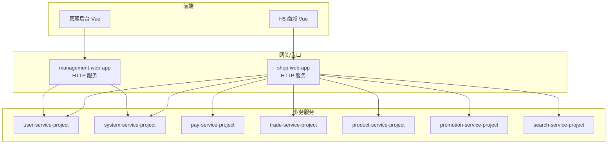
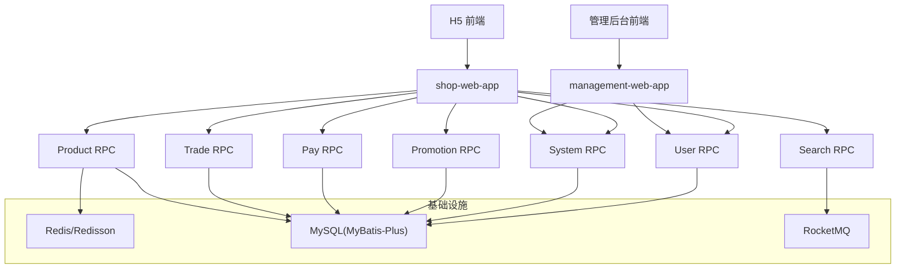
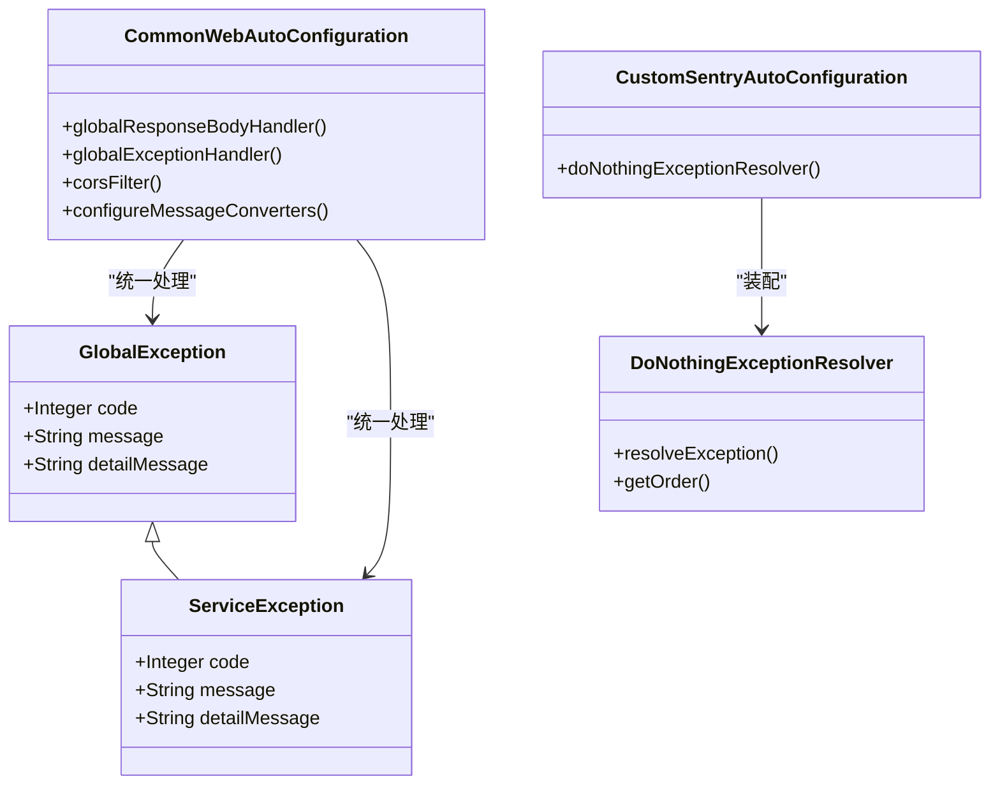
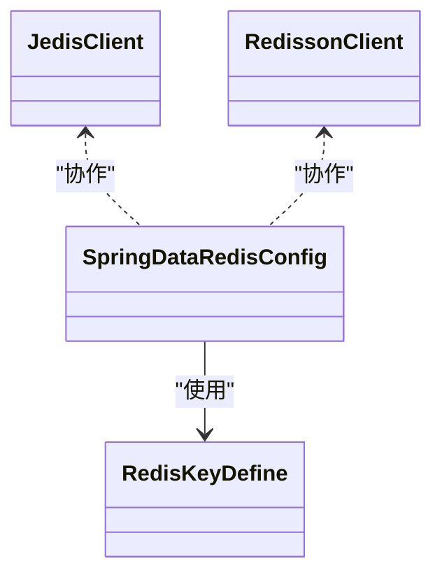
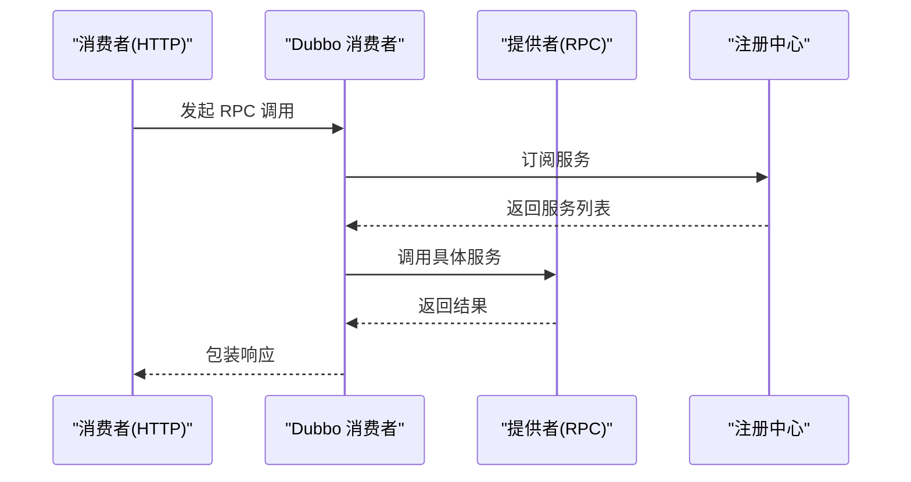
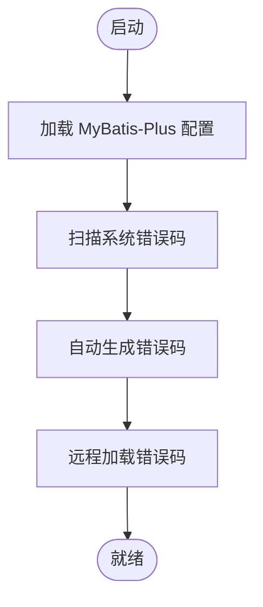
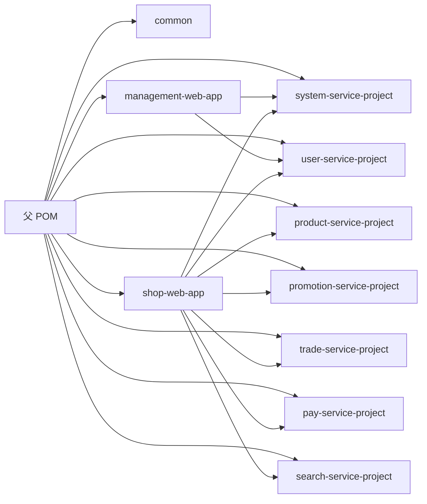

# 故障排查与应急处理

<cite>
**本文引用的文件**
- [README.md](file://README.md)
- [pom.xml](file://pom.xml)
- [management-web-app/src/main/resources/application.yml](file://management-web-app/src/main/resources/application.yml)
- [shop-web-app/src/main/resources/application.yml](file://shop-web-app/src/main/resources/application.yml)
- [common/common-framework/src/main/java/cn/iocoder/common/framework/exception/GlobalException.java](file://common/common-framework/src/main/java/cn/iocoder/common/framework/exception/GlobalException.java)
- [common/common-framework/src/main/java/cn/iocoder/common/framework/exception/ServiceException.java](file://common/common-framework/src/main/java/cn/iocoder/common/framework/exception/ServiceException.java)
- [common/mall-spring-boot-starter-web/src/main/java/cn/iocoder/mall/web/config/CommonWebAutoConfiguration.java](file://common/mall-spring-boot-starter-web/src/main/java/cn/iocoder/mall/web/config/CommonWebAutoConfiguration.java)
- [common/mall-spring-boot-starter-sentry/src/main/java/cn/iocoder/mall/sentry/config/CustomSentryAutoConfiguration.java](file://common/mall-spring-boot-starter-sentry/src/main/java/cn/iocoder/mall/sentry/config/CustomSentryAutoConfiguration.java)
- [common/mall-spring-boot-starter-sentry/src/main/java/cn/iocoder/mall/sentry/resolver/DoNothingExceptionResolver.java](file://common/mall-spring-boot-starter-sentry/src/main/java/cn/iocoder/mall/sentry/resolver/DoNothingExceptionResolver.java)
- [common/mall-spring-boot-starter-cache/src/main/java/cn/iocoder/mall/cache/config/JedisClient.java](file://common/mall-spring-boot-starter-cache/src/main/java/cn/iocoder/mall/cache/config/JedisClient.java)
- [common/mall-spring-boot-starter-cache/src/main/java/cn/iocoder/mall/cache/config/RedissonClient.java](file://common/mall-spring-boot-starter-cache/src/main/java/cn/iocoder/mall/cache/config/RedissonClient.java)
- [common/mall-spring-boot-starter-cache/src/main/java/cn/iocoder/mall/cache/config/SpringDataRedisConfig.java](file://common/mall-spring-boot-starter-cache/src/main/java/cn/iocoder/mall/cache/config/SpringDataRedisConfig.java)
- [common/mall-spring-boot-starter-dubbo/src/main/java/cn/iocoder/mall/dubbo/config/DubboEnvironmentPostProcessor.java](file://common/mall-spring-boot-starter-dubbo/src/main/java/cn/iocoder/mall/dubbo/config/DubboEnvironmentPostProcessor.java)
- [common/mall-spring-boot-starter-dubbo/src/main/java/cn/iocoder/mall/dubbo/config/DubboWebAutoConfiguration.java](file://common/mall-spring-boot-starter-dubbo/src/main/java/cn/iocoder/mall/dubbo/config/DubboWebAutoConfiguration.java)
- [common/mall-spring-boot-starter-mybatis/src/main/java/cn/iocoder/mall/mybatis/config/MybatisPlusAutoConfiguration.java](file://common/mall-spring-boot-starter-mybatis/src/main/java/cn/iocoder/mall/mybatis/config/MybatisPlusAutoConfiguration.java)
- [common/mall-spring-boot-starter-redis/src/main/java/cn/iocoder/mall/redis/core/RedisKeyDefine.java](file://common/mall-spring-boot-starter-redis/src/main/java/cn/iocoder/mall/redis/core/RedisKeyDefine.java)
- [common/mall-spring-boot-starter-rocketmq/pom.xml](file://common/mall-spring-boot-starter-rocketmq/pom.xml)
- [common/mall-spring-boot-starter-system-error-code/src/main/java/cn/iocoder/mall/system/errorcode/config/ErrorCodeAutoConfiguration.java](file://common/mall-spring-boot-starter-system-error-code/src/main/java/cn/iocoder/mall/system/errorcode/config/ErrorCodeAutoConfiguration.java)
- [common/mall-spring-boot-starter-system-error-code/src/main/java/cn/iocoder/mall/system/errorcode/config/ErrorCodeProperties.java](file://common/mall-spring-boot-starter-system-error-code/src/main/java/cn/iocoder/mall/system/errorcode/config/ErrorCodeProperties.java)
- [common/mall-spring-boot-starter-system-error-code/src/main/java/cn/iocoder/mall/system/errorcode/core/ErrorCodeAutoGenerator.java](file://common/mall-spring-boot-starter-system-error-code/src/main/java/cn/iocoder/mall/system/errorcode/core/ErrorCodeAutoGenerator.java)
- [common/mall-spring-boot-starter-system-error-code/src/main/java/cn/iocoder/mall/system/errorcode/core/ErrorCodeRemoteLoader.java](file://common/mall-spring-boot-starter-system-error-code/src/main/java/cn/iocoder/mall/system/errorcode/core/ErrorCodeRemoteLoader.java)
- [management-web-app/src/main/java/cn/iocoder/mall/managementweb/ManagementWebApplication.java](file://management-web-app/src/main/java/cn/iocoder/mall/managementweb/ManagementWebApplication.java)
- [shop-web-app/src/main/java/cn/iocoder/mall/shopweb/ShopWebApplication.java](file://shop-web-app/src/main/java/cn/iocoder/mall/shopweb/ShopWebApplication.java)
- [user-service-project/user-service-app/src/main/java/cn/iocoder/mall/userservice/UserServiceApplication.java](file://user-service-project/user-service-app/src/main/java/cn/iocoder/mall/userservice/UserServiceApplication.java)
- [system-service-project/system-service-app/src/main/java/cn/iocoder/mall/systemservice/SystemServiceApplication.java](file://system-service-project/system-service-app/src/main/java/cn/iocoder/mall/systemservice/SystemServiceApplication.java)
- [pay-service-project/pay-service-app/src/main/java/cn/iocoder/mall/payservice/PayServiceApplication.java](file://pay-service-project/pay-service-app/src/main/java/cn/iocoder/mall/payservice/PayServiceApplication.java)
- [trade-service-project/trade-service-app/src/main/java/cn/iocoder/mall/tradeservice/TradeServiceApplication.java](file://trade-service-project/trade-service-app/src/main/java/cn/iocoder/mall/tradeservice/TradeServiceApplication.java)
- [product-service-project/product-service-app/src/main/java/cn/iocoder/mall/productservice/ProductServiceApplication.java](file://product-service-project/product-service-app/src/main/java/cn/iocoder/mall/productservice/ProductServiceApplication.java)
- [promotion-service-project/promotion-service-app/src/main/java/cn/iocoder/mall/promotionservice/PromotionServiceApplication.java](file://promotion-service-project/promotion-service-app/src/main/java/cn/iocoder/mall/promotionservice/PromotionServiceApplication.java)
- [search-service-project/search-service-app/src/main/java/cn/iocoder/mall/searchservice/SearchServiceApplication.java](file://search-service-project/search-service-app/src/main/java/cn/iocoder/mall/searchservice/SearchServiceApplication.java)
- [pay-service-project/pay-service-app/src/main/resources/application.yaml](file://pay-service-project/pay-service-app/src/main/resources/application.yaml)
- [product-service-project/product-service-app/src/main/resources/application.yaml](file://product-service-project/product-service-app/src/main/resources/application.yaml)
- [promotion-service-project/promotion-service-app/src/main/resources/application.yaml](file://promotion-service-project/promotion-service-app/src/main/resources/application.yaml)
- [system-service-project/system-service-app/src/main/resources/application.yaml](file://system-service-project/system-service-app/src/main/resources/application.yaml)
- [trade-service-project/trade-service-app/src/main/resources/application.yaml](file://trade-service-project/trade-service-app/src/main/resources/application.yaml)
- [user-service-project/user-service-app/src/main/resources/application.yaml](file://user-service-project/user-service-app/src/main/resources/application.yaml)
- [search-service-project/search-service-app/src/main/resources/application.yaml](file://search-service-project/search-service-app/src/main/resources/application.yaml)
</cite>

## 目录
1. [简介](#简介)
2. [项目结构](#项目结构)
3. [核心组件](#核心组件)
4. [架构总览](#架构总览)
5. [详细组件分析](#详细组件分析)
6. [依赖关系分析](#依赖关系分析)
7. [性能考量](#性能考量)
8. [故障排查指南](#故障排查指南)
9. [结论](#结论)
10. [附录](#附录)

## 简介
本操作手册面向 Onemall 微服务电商项目，提供系统化的故障排查与应急处理方法论。内容涵盖故障分类体系、问题定位与影响评估、根因分析、临时修复与永久解决、常见场景应急预案、监控与告警、恢复流程、灾难恢复计划、演练与培训、以及故障报告与复盘机制。目标是帮助团队在发生服务不可用、性能下降、数据异常、安全事件等各类故障时，能够快速响应、有序处置并持续改进系统稳定性与可靠性。

## 项目结构
Onemall 采用多模块聚合工程，后端以 Spring Boot 为基础，服务间通过 Dubbo RPC 通信，前端分别提供管理后台与 H5 商城。项目包含通用框架与各业务服务模块，便于统一治理与扩展。

图表来源
- [README.md:109-126](file://README.md#L109-L126)
- [pom.xml:16-28](file://pom.xml#L16-L28)

章节来源
- [README.md:107-126](file://README.md#L107-L126)
- [pom.xml:16-28](file://pom.xml#L16-L28)

## 核心组件
- 异常与返回封装：全局异常与业务异常类型，配合统一响应包装，便于前端与监控系统识别错误。
- Web 全局处理：统一的全局异常处理器与响应体处理器，拦截器与跨域过滤器，保证请求链路一致性。
- Sentry 集成：可选的异常上报组件自动装配与异常解析器覆盖，避免重复上报。
- 缓存与 Redis：Jedis、Redisson、Spring Data Redis 配置，支撑缓存与分布式锁等能力。
- Dubbo 集成：Dubbo 环境后置处理器与 Web 自动配置，确保消费者与服务端正确初始化。
- MyBatis Plus：ORM 自动配置，提供基础数据访问能力。
- 错误码体系：系统级错误码自动生成与远程加载，统一错误语义。
- Actuator 监控：独立管理端口暴露监控端点，便于健康检查与指标采集。

章节来源
- [common/common-framework/src/main/java/cn/iocoder/common/framework/exception/GlobalException.java:1-72](file://common/common-framework/src/main/java/cn/iocoder/common/framework/exception/GlobalException.java#L1-L72)
- [common/common-framework/src/main/java/cn/iocoder/common/framework/exception/ServiceException.java:1-72](file://common/common-framework/src/main/java/cn/iocoder/common/framework/exception/ServiceException.java#L1-L72)
- [common/mall-spring-boot-starter-web/src/main/java/cn/iocoder/mall/web/config/CommonWebAutoConfiguration.java:1-97](file://common/mall-spring-boot-starter-web/src/main/java/cn/iocoder/mall/web/config/CommonWebAutoConfiguration.java#L1-L97)
- [common/mall-spring-boot-starter-sentry/src/main/java/cn/iocoder/mall/sentry/config/CustomSentryAutoConfiguration.java:1-40](file://common/mall-spring-boot-starter-sentry/src/main/java/cn/iocoder/mall/sentry/config/CustomSentryAutoConfiguration.java#L1-L40)
- [common/mall-spring-boot-starter-sentry/src/main/java/cn/iocoder/mall/sentry/resolver/DoNothingExceptionResolver.java:1-32](file://common/mall-spring-boot-starter-sentry/src/main/java/cn/iocoder/mall/sentry/resolver/DoNothingExceptionResolver.java#L1-L32)
- [common/mall-spring-boot-starter-cache/src/main/java/cn/iocoder/mall/cache/config/JedisClient.java](file://common/mall-spring-boot-starter-cache/src/main/java/cn/iocoder/mall/cache/config/JedisClient.java)
- [common/mall-spring-boot-starter-cache/src/main/java/cn/iocoder/mall/cache/config/RedissonClient.java](file://common/mall-spring-boot-starter-cache/src/main/java/cn/iocoder/mall/cache/config/RedissonClient.java)
- [common/mall-spring-boot-starter-cache/src/main/java/cn/iocoder/mall/cache/config/SpringDataRedisConfig.java](file://common/mall-spring-boot-starter-cache/src/main/java/cn/iocoder/mall/cache/config/SpringDataRedisConfig.java)
- [common/mall-spring-boot-starter-dubbo/src/main/java/cn/iocoder/mall/dubbo/config/DubboEnvironmentPostProcessor.java](file://common/mall-spring-boot-starter-dubbo/src/main/java/cn/iocoder/mall/dubbo/config/DubboEnvironmentPostProcessor.java)
- [common/mall-spring-boot-starter-dubbo/src/main/java/cn/iocoder/mall/dubbo/config/DubboWebAutoConfiguration.java](file://common/mall-spring-boot-starter-dubbo/src/main/java/cn/iocoder/mall/dubbo/config/DubboWebAutoConfiguration.java)
- [common/mall-spring-boot-starter-mybatis/src/main/java/cn/iocoder/mall/mybatis/config/MybatisPlusAutoConfiguration.java](file://common/mall-spring-boot-starter-mybatis/src/main/java/cn/iocoder/mall/mybatis/config/MybatisPlusAutoConfiguration.java)
- [common/mall-spring-boot-starter-system-error-code/src/main/java/cn/iocoder/mall/system/errorcode/config/ErrorCodeAutoConfiguration.java](file://common/mall-spring-boot-starter-system-error-code/src/main/java/cn/iocoder/mall/system/errorcode/config/ErrorCodeAutoConfiguration.java)
- [common/mall-spring-boot-starter-system-error-code/src/main/java/cn/iocoder/mall/system/errorcode/config/ErrorCodeProperties.java](file://common/mall-spring-boot-starter-system-error-code/src/main/java/cn/iocoder/mall/system/errorcode/config/ErrorCodeProperties.java)
- [common/mall-spring-boot-starter-system-error-code/src/main/java/cn/iocoder/mall/system/errorcode/core/ErrorCodeAutoGenerator.java](file://common/mall-spring-boot-starter-system-error-code/src/main/java/cn/iocoder/mall/system/errorcode/core/ErrorCodeAutoGenerator.java)
- [common/mall-spring-boot-starter-system-error-code/src/main/java/cn/iocoder/mall/system/errorcode/core/ErrorCodeRemoteLoader.java](file://common/mall-spring-boot-starter-system-error-code/src/main/java/cn/iocoder/mall/system/errorcode/core/ErrorCodeRemoteLoader.java)
- [management-web-app/src/main/resources/application.yml:1-83](file://management-web-app/src/main/resources/application.yml#L1-L83)
- [shop-web-app/src/main/resources/application.yml:1-76](file://shop-web-app/src/main/resources/application.yml#L1-L76)

## 架构总览
下图展示了 Onemall 的典型调用链：前端通过管理后台与 H5 商城访问 HTTP 服务，HTTP 服务作为 Dubbo 消费者调用系统、用户、商品、营销、交易、支付、搜索等 RPC 服务；服务内部可能依赖缓存、数据库与消息队列等基础设施。

图表来源
- [README.md:109-126](file://README.md#L109-L126)
- [management-web-app/src/main/resources/application.yml:19-71](file://management-web-app/src/main/resources/application.yml#L19-L71)
- [shop-web-app/src/main/resources/application.yml:19-63](file://shop-web-app/src/main/resources/application.yml#L19-L63)

## 详细组件分析

### 异常与统一响应处理
- 全局异常与业务异常：定义了全局异常与业务异常类型，携带错误码与详细信息，便于前端与监控系统识别。
- Web 全局处理：自动装配全局异常处理器与响应体处理器，注册跨域过滤器与访问日志拦截器，确保请求链路一致性。
- Sentry 集成：当启用 Sentry 时，可通过自定义异常解析器避免重复上报，同时保留其他异常解析器继续处理。

图表来源
- [common/common-framework/src/main/java/cn/iocoder/common/framework/exception/GlobalException.java:1-72](file://common/common-framework/src/main/java/cn/iocoder/common/framework/exception/GlobalException.java#L1-L72)
- [common/common-framework/src/main/java/cn/iocoder/common/framework/exception/ServiceException.java:1-72](file://common/common-framework/src/main/java/cn/iocoder/common/framework/exception/ServiceException.java#L1-L72)
- [common/mall-spring-boot-starter-web/src/main/java/cn/iocoder/mall/web/config/CommonWebAutoConfiguration.java:1-97](file://common/mall-spring-boot-starter-web/src/main/java/cn/iocoder/mall/web/config/CommonWebAutoConfiguration.java#L1-L97)
- [common/mall-spring-boot-starter-sentry/src/main/java/cn/iocoder/mall/sentry/config/CustomSentryAutoConfiguration.java:1-40](file://common/mall-spring-boot-starter-sentry/src/main/java/cn/iocoder/mall/sentry/config/CustomSentryAutoConfiguration.java#L1-L40)
- [common/mall-spring-boot-starter-sentry/src/main/java/cn/iocoder/mall/sentry/resolver/DoNothingExceptionResolver.java:1-32](file://common/mall-spring-boot-starter-sentry/src/main/java/cn/iocoder/mall/sentry/resolver/DoNothingExceptionResolver.java#L1-L32)

章节来源
- [common/common-framework/src/main/java/cn/iocoder/common/framework/exception/GlobalException.java:1-72](file://common/common-framework/src/main/java/cn/iocoder/common/framework/exception/GlobalException.java#L1-L72)
- [common/common-framework/src/main/java/cn/iocoder/common/framework/exception/ServiceException.java:1-72](file://common/common-framework/src/main/java/cn/iocoder/common/framework/exception/ServiceException.java#L1-L72)
- [common/mall-spring-boot-starter-web/src/main/java/cn/iocoder/mall/web/config/CommonWebAutoConfiguration.java:1-97](file://common/mall-spring-boot-starter-web/src/main/java/cn/iocoder/mall/web/config/CommonWebAutoConfiguration.java#L1-L97)
- [common/mall-spring-boot-starter-sentry/src/main/java/cn/iocoder/mall/sentry/config/CustomSentryAutoConfiguration.java:1-40](file://common/mall-spring-boot-starter-sentry/src/main/java/cn/iocoder/mall/sentry/config/CustomSentryAutoConfiguration.java#L1-L40)
- [common/mall-spring-boot-starter-sentry/src/main/java/cn/iocoder/mall/sentry/resolver/DoNothingExceptionResolver.java:1-32](file://common/mall-spring-boot-starter-sentry/src/main/java/cn/iocoder/mall/sentry/resolver/DoNothingExceptionResolver.java#L1-L32)

### 缓存与 Redis 配置
- JedisClient：提供 Redis 基础客户端能力。
- RedissonClient：提供分布式锁、限流等高级能力。
- SpringDataRedisConfig：Spring Data Redis 配置，统一键命名规范。

图表来源
- [common/mall-spring-boot-starter-cache/src/main/java/cn/iocoder/mall/cache/config/JedisClient.java](file://common/mall-spring-boot-starter-cache/src/main/java/cn/iocoder/mall/cache/config/JedisClient.java)
- [common/mall-spring-boot-starter-cache/src/main/java/cn/iocoder/mall/cache/config/RedissonClient.java](file://common/mall-spring-boot-starter-cache/src/main/java/cn/iocoder/mall/cache/config/RedissonClient.java)
- [common/mall-spring-boot-starter-cache/src/main/java/cn/iocoder/mall/cache/config/SpringDataRedisConfig.java](file://common/mall-spring-boot-starter-cache/src/main/java/cn/iocoder/mall/cache/config/SpringDataRedisConfig.java)
- [common/mall-spring-boot-starter-redis/src/main/java/cn/iocoder/mall/redis/core/RedisKeyDefine.java](file://common/mall-spring-boot-starter-redis/src/main/java/cn/iocoder/mall/redis/core/RedisKeyDefine.java)

章节来源
- [common/mall-spring-boot-starter-cache/src/main/java/cn/iocoder/mall/cache/config/JedisClient.java](file://common/mall-spring-boot-starter-cache/src/main/java/cn/iocoder/mall/cache/config/JedisClient.java)
- [common/mall-spring-boot-starter-cache/src/main/java/cn/iocoder/mall/cache/config/RedissonClient.java](file://common/mall-spring-boot-starter-cache/src/main/java/cn/iocoder/mall/cache/config/RedissonClient.java)
- [common/mall-spring-boot-starter-cache/src/main/java/cn/iocoder/mall/cache/config/SpringDataRedisConfig.java](file://common/mall-spring-boot-starter-cache/src/main/java/cn/iocoder/mall/cache/config/SpringDataRedisConfig.java)
- [common/mall-spring-boot-starter-redis/src/main/java/cn/iocoder/mall/redis/core/RedisKeyDefine.java](file://common/mall-spring-boot-starter-redis/src/main/java/cn/iocoder/mall/redis/core/RedisKeyDefine.java)

### Dubbo 消费者与服务端配置
- DubboEnvironmentPostProcessor：环境后置处理器，确保 Dubbo 配置生效。
- DubboWebAutoConfiguration：Web 自动配置，注册 Dubbo 相关组件。

图表来源
- [common/mall-spring-boot-starter-dubbo/src/main/java/cn/iocoder/mall/dubbo/config/DubboEnvironmentPostProcessor.java](file://common/mall-spring-boot-starter-dubbo/src/main/java/cn/iocoder/mall/dubbo/config/DubboEnvironmentPostProcessor.java)
- [common/mall-spring-boot-starter-dubbo/src/main/java/cn/iocoder/mall/dubbo/config/DubboWebAutoConfiguration.java](file://common/mall-spring-boot-starter-dubbo/src/main/java/cn/iocoder/mall/dubbo/config/DubboWebAutoConfiguration.java)
- [management-web-app/src/main/resources/application.yml:19-71](file://management-web-app/src/main/resources/application.yml#L19-L71)
- [shop-web-app/src/main/resources/application.yml:19-63](file://shop-web-app/src/main/resources/application.yml#L19-L63)

章节来源
- [common/mall-spring-boot-starter-dubbo/src/main/java/cn/iocoder/mall/dubbo/config/DubboEnvironmentPostProcessor.java](file://common/mall-spring-boot-starter-dubbo/src/main/java/cn/iocoder/mall/dubbo/config/DubboEnvironmentPostProcessor.java)
- [common/mall-spring-boot-starter-dubbo/src/main/java/cn/iocoder/mall/dubbo/config/DubboWebAutoConfiguration.java](file://common/mall-spring-boot-starter-dubbo/src/main/java/cn/iocoder/mall/dubbo/config/DubboWebAutoConfiguration.java)
- [management-web-app/src/main/resources/application.yml:19-71](file://management-web-app/src/main/resources/application.yml#L19-L71)
- [shop-web-app/src/main/resources/application.yml:19-63](file://shop-web-app/src/main/resources/application.yml#L19-L63)

### 数据访问与错误码体系
- MybatisPlusAutoConfiguration：ORM 自动配置，提供基础数据访问能力。
- 系统错误码：自动扫描生成与远程加载，统一错误语义，便于前端与监控识别。

图表来源
- [common/mall-spring-boot-starter-mybatis/src/main/java/cn/iocoder/mall/mybatis/config/MybatisPlusAutoConfiguration.java](file://common/mall-spring-boot-starter-mybatis/src/main/java/cn/iocoder/mall/mybatis/config/MybatisPlusAutoConfiguration.java)
- [common/mall-spring-boot-starter-system-error-code/src/main/java/cn/iocoder/mall/system/errorcode/config/ErrorCodeAutoConfiguration.java](file://common/mall-spring-boot-starter-system-error-code/src/main/java/cn/iocoder/mall/system/errorcode/config/ErrorCodeAutoConfiguration.java)
- [common/mall-spring-boot-starter-system-error-code/src/main/java/cn/iocoder/mall/system/errorcode/core/ErrorCodeAutoGenerator.java](file://common/mall-spring-boot-starter-system-error-code/src/main/java/cn/iocoder/mall/system/errorcode/core/ErrorCodeAutoGenerator.java)
- [common/mall-spring-boot-starter-system-error-code/src/main/java/cn/iocoder/mall/system/errorcode/core/ErrorCodeRemoteLoader.java](file://common/mall-spring-boot-starter-system-error-code/src/main/java/cn/iocoder/mall/system/errorcode/core/ErrorCodeRemoteLoader.java)

章节来源
- [common/mall-spring-boot-starter-mybatis/src/main/java/cn/iocoder/mall/mybatis/config/MybatisPlusAutoConfiguration.java](file://common/mall-spring-boot-starter-mybatis/src/main/java/cn/iocoder/mall/mybatis/config/MybatisPlusAutoConfiguration.java)
- [common/mall-spring-boot-starter-system-error-code/src/main/java/cn/iocoder/mall/system/errorcode/config/ErrorCodeAutoConfiguration.java](file://common/mall-spring-boot-starter-system-error-code/src/main/java/cn/iocoder/mall/system/errorcode/config/ErrorCodeAutoConfiguration.java)
- [common/mall-spring-boot-starter-system-error-code/src/main/java/cn/iocoder/mall/system/errorcode/config/ErrorCodeProperties.java](file://common/mall-spring-boot-starter-system-error-code/src/main/java/cn/iocoder/mall/system/errorcode/config/ErrorCodeProperties.java)
- [common/mall-spring-boot-starter-system-error-code/src/main/java/cn/iocoder/mall/system/errorcode/core/ErrorCodeAutoGenerator.java](file://common/mall-spring-boot-starter-system-error-code/src/main/java/cn/iocoder/mall/system/errorcode/core/ErrorCodeAutoGenerator.java)
- [common/mall-spring-boot-starter-system-error-code/src/main/java/cn/iocoder/mall/system/errorcode/core/ErrorCodeRemoteLoader.java](file://common/mall-spring-boot-starter-system-error-code/src/main/java/cn/iocoder/mall/system/errorcode/core/ErrorCodeRemoteLoader.java)

## 依赖关系分析
- 模块聚合：父 POM 聚合 common 与各业务模块，便于统一构建与版本管理。
- HTTP 服务依赖：管理后台与 H5 商城 HTTP 服务通过 Dubbo 消费多个 RPC 服务，形成“网关/入口 → 服务”两级依赖。
- 基础设施依赖：各业务服务依赖数据库、缓存与消息队列，形成“服务 → 基础设施”的依赖。

图表来源
- [pom.xml:16-28](file://pom.xml#L16-L28)
- [README.md:109-126](file://README.md#L109-L126)

章节来源
- [pom.xml:16-28](file://pom.xml#L16-L28)
- [README.md:109-126](file://README.md#L109-L126)

## 性能考量
- 监控与可观测性：Actuator 独立端口暴露监控端点，结合 Prometheus/Grafana/SkyWalking 实现指标采集与链路追踪。
- 缓存策略：利用 Redis/Redisson 降低数据库压力，合理设置过期时间与热点数据预热。
- RPC 调用：控制超时与重试策略，避免级联故障；必要时引入熔断与隔离。
- 数据库：使用连接池与 SQL 优化，避免慢查询与锁竞争。
- 消息队列：异步解耦，设置合理的队列与消费速率，防止消息积压。

## 故障排查指南

### 故障分类体系
- 服务不可用：HTTP 服务无法访问、RPC 服务无响应、注册中心异常。
- 性能下降：接口 RT 上升、吞吐量下降、CPU/内存/IO 压力大。
- 数据异常：数据不一致、重复数据、数据丢失、索引失效。
- 安全事件：鉴权绕过、敏感信息泄露、DDoS、中间人攻击。

### 方法论
- 问题定位：优先查看监控面板与日志，确认故障范围与影响面。
- 影响评估：统计受影响用户规模、业务流水、SLA 指标变化。
- 根因分析：按“基础设施 → 服务 → 接口 → 业务”逐层深入，使用链路追踪定位。
- 临时修复：降级非核心功能、限流/熔断、回滚配置或版本、切换备用节点。
- 永久解决：修复缺陷、优化架构、完善监控与告警、补充测试。

### 常见场景应急预案

#### 数据库连接失败
- 快速检查
  - 数据库实例状态与网络连通性。
  - 连接池配置与最大连接数、空闲连接数。
  - 应用侧连接池监控与慢查询日志。
- 临时修复
  - 临时增加连接池容量或释放无效连接。
  - 切换至只读副本或备用数据库。
- 永久解决
  - 优化 SQL 与索引，减少长事务。
  - 引入连接池健康检查与自动恢复。
  - 建立主备切换演练与自动化脚本。

章节来源
- [common/mall-spring-boot-starter-mybatis/src/main/java/cn/iocoder/mall/mybatis/config/MybatisPlusAutoConfiguration.java](file://common/mall-spring-boot-starter-mybatis/src/main/java/cn/iocoder/mall/mybatis/config/MybatisPlusAutoConfiguration.java)

#### 缓存雪崩
- 快速检查
  - 缓存整体命中率与过期策略。
  - 热点 Key 是否集中过期。
- 临时修复
  - 为热点 Key 设置随机过期时间。
  - 降级读取数据库或静态数据。
- 永久解决
  - 引入多级缓存与本地缓存。
  - 使用互斥锁避免击穿。
  - 增加缓存预热与异步刷新。

章节来源
- [common/mall-spring-boot-starter-cache/src/main/java/cn/iocoder/mall/cache/config/JedisClient.java](file://common/mall-spring-boot-starter-cache/src/main/java/cn/iocoder/mall/cache/config/JedisClient.java)
- [common/mall-spring-boot-starter-cache/src/main/java/cn/iocoder/mall/cache/config/RedissonClient.java](file://common/mall-spring-boot-starter-cache/src/main/java/cn/iocoder/mall/cache/config/RedissonClient.java)
- [common/mall-spring-boot-starter-cache/src/main/java/cn/iocoder/mall/cache/config/SpringDataRedisConfig.java](file://common/mall-spring-boot-starter-cache/src/main/java/cn/iocoder/mall/cache/config/SpringDataRedisConfig.java)

#### 服务雪崩
- 快速检查
  - RPC 调用链路与超时、重试配置。
  - 熔断器状态与隔离策略。
- 临时修复
  - 启用熔断与快速失败。
  - 限流与排队，保护下游服务。
- 永久解决
  - 引入服务治理（Sentinel）与限流/熔断。
  - 优化调用链路与异步化改造。

章节来源
- [common/mall-spring-boot-starter-dubbo/src/main/java/cn/iocoder/mall/dubbo/config/DubboEnvironmentPostProcessor.java](file://common/mall-spring-boot-starter-dubbo/src/main/java/cn/iocoder/mall/dubbo/config/DubboEnvironmentPostProcessor.java)
- [common/mall-spring-boot-starter-dubbo/src/main/java/cn/iocoder/mall/dubbo/config/DubboWebAutoConfiguration.java](file://common/mall-spring-boot-starter-dubbo/src/main/java/cn/iocoder/mall/dubbo/config/DubboWebAutoConfiguration.java)

#### 网络分区
- 快速检查
  - 注册中心可用性与分区情况。
  - 服务间网络连通性与延迟。
- 临时修复
  - 切换至可用区域或备用注册中心。
  - 降级非关键 RPC 调用。
- 永久解决
  - 多活部署与跨区容灾。
  - 增强注册中心高可用与自动切换。

章节来源
- [README.md:185-199](file://README.md#L185-L199)

#### 异常风暴与重复上报
- 快速检查
  - Sentry 是否启用，异常解析器是否冲突。
  - 全局异常处理器是否正常工作。
- 临时修复
  - 关闭或调整 Sentry 解析器，避免重复上报。
  - 临时屏蔽异常上报通道。
- 永久解决
  - 明确异常上报与全局处理边界。
  - 规范异常类型与处理流程。

章节来源
- [common/mall-spring-boot-starter-sentry/src/main/java/cn/iocoder/mall/sentry/config/CustomSentryAutoConfiguration.java:1-40](file://common/mall-spring-boot-starter-sentry/src/main/java/cn/iocoder/mall/sentry/config/CustomSentryAutoConfiguration.java#L1-L40)
- [common/mall-spring-boot-starter-sentry/src/main/java/cn/iocoder/mall/sentry/resolver/DoNothingExceptionResolver.java:1-32](file://common/mall-spring-boot-starter-sentry/src/main/java/cn/iocoder/mall/sentry/resolver/DoNothingExceptionResolver.java#L1-L32)
- [common/mall-spring-boot-starter-web/src/main/java/cn/iocoder/mall/web/config/CommonWebAutoConfiguration.java:1-97](file://common/mall-spring-boot-starter-web/src/main/java/cn/iocoder/mall/web/config/CommonWebAutoConfiguration.java#L1-L97)

### 关键指标监控与预警机制
- 指标采集
  - 使用 Actuator 暴露 JVM、进程、业务指标。
  - Prometheus 抓取指标，Grafana 可视化。
  - SkyWalking 进行链路追踪与性能分析。
- 阈值与规则
  - CPU/内存/IO 使用率、连接池占用、RPC 调用失败率、RT、队列长度、缓存命中率。
- 告警渠道
  - 邮件、IM、电话等多渠道告警，区分严重级别。

章节来源
- [management-web-app/src/main/resources/application.yml:79-83](file://management-web-app/src/main/resources/application.yml#L79-L83)
- [shop-web-app/src/main/resources/application.yml:72-76](file://shop-web-app/src/main/resources/application.yml#L72-L76)
- [README.md:185-199](file://README.md#L185-L199)

### 故障恢复流程
- 数据恢复
  - 基于备份策略执行恢复，验证数据一致性。
- 服务重启
  - 有序重启，先旁路再上线，观察指标。
- 配置回滚
  - 回滚至上一个稳定版本，验证功能。
- 流量切换
  - 使用蓝绿/灰度发布，逐步放量。

章节来源
- [README.md:185-199](file://README.md#L185-L199)

### 灾难恢复计划
- 备份策略
  - 数据库与配置定期备份，异地存储。
- 异地容灾
  - 多活部署与跨区容灾，注册中心高可用。
- 业务连续性
  - 降级策略与人工干预流程，确保核心业务可用。

章节来源
- [README.md:185-199](file://README.md#L185-L199)

### 故障演练与培训
- 定期组织故障演练，覆盖数据库、缓存、RPC、网络等场景。
- 培训团队掌握监控、告警、应急处置与复盘流程。

章节来源
- [README.md:185-199](file://README.md#L185-L199)

### 故障报告与复盘机制
- 快速报告：明确故障现象、影响范围、处置过程与结果。
- 根因分析：使用鱼骨图、5 Why 等方法定位根本原因。
- 改进措施：完善监控、告警、流程与代码，避免同类问题再次发生。
- 复盘会议：沉淀经验，形成知识库。

## 结论
通过建立完善的故障分类体系、标准化排查方法论与应急预案，结合可观测性与自动化运维手段，Onemall 项目能够在面对服务不可用、性能下降、数据异常与安全事件时，实现快速响应与高效恢复，持续提升系统的稳定性与可靠性。

## 附录

### 应急处置清单
- 立即确认：监控面板、日志、告警。
- 影响评估：用户规模、业务影响、SLA。
- 临时修复：熔断、限流、降级、回滚。
- 永久解决：修复缺陷、优化架构、完善监控。
- 复盘总结：根因、改进、演练。

### 关键配置参考
- HTTP 服务端口与 Dubbo 消费者配置
  - [management-web-app/src/main/resources/application.yml:1-83](file://management-web-app/src/main/resources/application.yml#L1-L83)
  - [shop-web-app/src/main/resources/application.yml:1-76](file://shop-web-app/src/main/resources/application.yml#L1-L76)
- Actuator 独立端口与监控暴露
  - [management-web-app/src/main/resources/application.yml:79-83](file://management-web-app/src/main/resources/application.yml#L79-L83)
  - [shop-web-app/src/main/resources/application.yml:72-76](file://shop-web-app/src/main/resources/application.yml#L72-L76)
- 服务启动入口
  - [management-web-app/src/main/java/cn/iocoder/mall/managementweb/ManagementWebApplication.java](file://management-web-app/src/main/java/cn/iocoder/mall/managementweb/ManagementWebApplication.java)
  - [shop-web-app/src/main/java/cn/iocoder/mall/shopweb/ShopWebApplication.java](file://shop-web-app/src/main/java/cn/iocoder/mall/shopweb/ShopWebApplication.java)
  - [user-service-project/user-service-app/src/main/java/cn/iocoder/mall/userservice/UserServiceApplication.java](file://user-service-project/user-service-app/src/main/java/cn/iocoder/mall/userservice/UserServiceApplication.java)
  - [system-service-project/system-service-app/src/main/java/cn/iocoder/mall/systemservice/SystemServiceApplication.java](file://system-service-project/system-service-app/src/main/java/cn/iocoder/mall/systemservice/SystemServiceApplication.java)
  - [pay-service-project/pay-service-app/src/main/java/cn/iocoder/mall/payservice/PayServiceApplication.java](file://pay-service-project/pay-service-app/src/main/java/cn/iocoder/mall/payservice/PayServiceApplication.java)
  - [trade-service-project/trade-service-app/src/main/java/cn/iocoder/mall/tradeservice/TradeServiceApplication.java](file://trade-service-project/trade-service-app/src/main/java/cn/iocoder/mall/tradeservice/TradeServiceApplication.java)
  - [product-service-project/product-service-app/src/main/java/cn/iocoder/mall/productservice/ProductServiceApplication.java](file://product-service-project/product-service-app/src/main/java/cn/iocoder/mall/productservice/ProductServiceApplication.java)
  - [promotion-service-project/promotion-service-app/src/main/java/cn/iocoder/mall/promotionservice/PromotionServiceApplication.java](file://promotion-service-project/promotion-service-app/src/main/java/cn/iocoder/mall/promotionservice/PromotionServiceApplication.java)
  - [search-service-project/search-service-app/src/main/java/cn/iocoder/mall/searchservice/SearchServiceApplication.java](file://search-service-project/search-service-app/src/main/java/cn/iocoder/mall/searchservice/SearchServiceApplication.java)