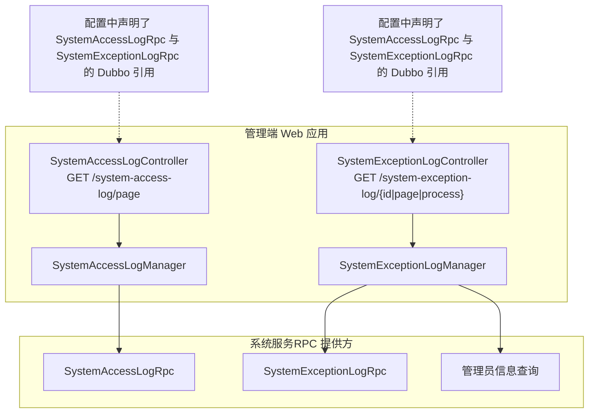
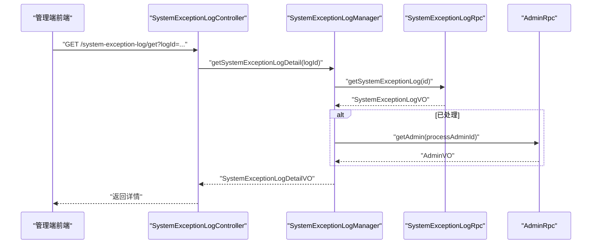
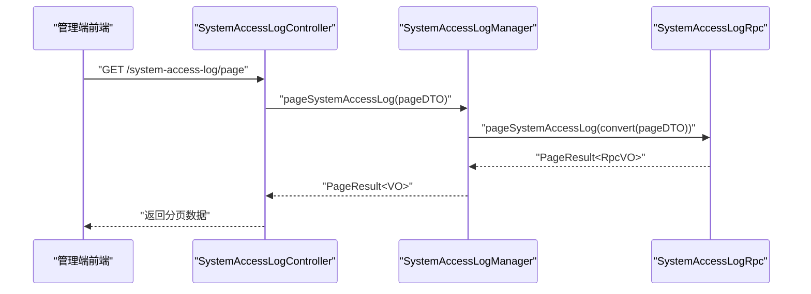
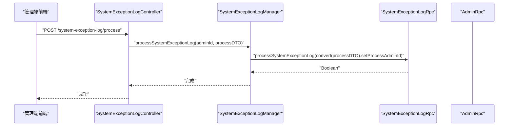
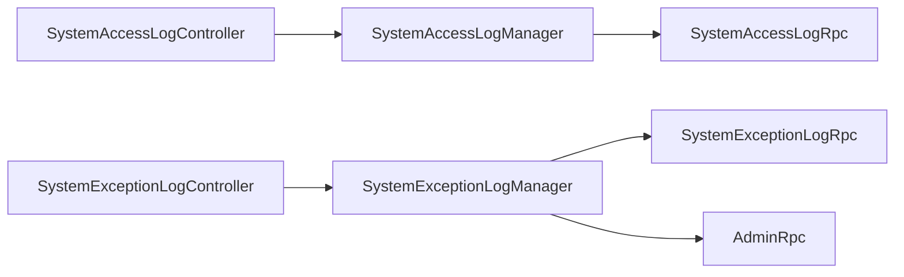

# 日志管理

<cite>
**本文引用的文件**
- [application.yml（管理端 Web 应用）](file://management-web-app/src/main/resources/application.yml)
- [application.yml（H5 Web 应用）](file://shop-web-app/src/main/resources/application.yml)
- [SystemAccessLogController.java](file://management-web-app/src/main/java/cn/iocoder/mall/managementweb/controller/systemlog/SystemAccessLogController.java)
- [SystemExceptionLogController.java](file://management-web-app/src/main/java/cn/iocoder/mall/managementweb/controller/systemlog/SystemExceptionLogController.java)
- [SystemAccessLogManager.java](file://management-web-app/src/main/java/cn/iocoder/mall/managementweb/manager/systemlog/SystemAccessLogManager.java)
- [SystemExceptionLogManager.java](file://management-web-app/src/main/java/cn/iocoder/mall/managementweb/manager/systemlog/SystemExceptionLogManager.java)
</cite>

## 目录
1. [简介](#简介)
2. [项目结构](#项目结构)
3. [核心组件](#核心组件)
4. [架构总览](#架构总览)
5. [组件详解](#组件详解)
6. [依赖关系分析](#依赖关系分析)
7. [性能与容量规划](#性能与容量规划)
8. [故障排查指南](#故障排查指南)
9. [结论](#结论)
10. [附录](#附录)

## 简介
本文件面向 Onemall 项目的日志管理，聚焦于系统访问日志与系统异常日志的采集、存储、查询与可视化。当前仓库已具备基于 Dubbo 的 RPC 接口与管理端 Web 控制器，用于分页查询与处理日志。围绕 ELK Stack（Elasticsearch、Logstash、Kibana）的部署与配置、应用日志结构化输出、日志轮转、查询与分析、分布式链路追踪关联、安全与合规、备份归档及性能优化等主题，本文提供可落地的实践建议与实施路径。

## 项目结构
Onemall 采用多模块微服务架构，日志能力在“系统服务”侧通过 Dubbo RPC 提供能力，管理端 Web 应用通过控制器与管理器调用 RPC，实现对访问日志与异常日志的分页查询、详情获取与处理流程。

图表来源
- [SystemAccessLogController.java:1-39](file://management-web-app/src/main/java/cn/iocoder/mall/managementweb/controller/systemlog/SystemAccessLogController.java#L1-L39)
- [SystemExceptionLogController.java:1-57](file://management-web-app/src/main/java/cn/iocoder/mall/managementweb/controller/systemlog/SystemExceptionLogController.java#L1-L57)
- [SystemAccessLogManager.java:1-35](file://management-web-app/src/main/java/cn/iocoder/mall/managementweb/manager/systemlog/SystemAccessLogManager.java#L1-L35)
- [SystemExceptionLogManager.java:1-77](file://management-web-app/src/main/java/cn/iocoder/mall/managementweb/manager/systemlog/SystemExceptionLogManager.java#L1-L77)

章节来源
- [application.yml（管理端 Web 应用）:46-48](file://management-web-app/src/main/resources/application.yml#L46-L48)
- [application.yml（H5 Web 应用）:31-33](file://shop-web-app/src/main/resources/application.yml#L31-L33)

## 核心组件
- 管理端控制器：提供访问日志与异常日志的分页查询、详情获取与处理接口。
- 管理端管理器：封装 RPC 调用，负责参数转换与错误检查。
- RPC 接口：由系统服务提供，支撑日志分页、详情与处理操作，并可联动管理员信息查询。

章节来源
- [SystemAccessLogController.java:19-39](file://management-web-app/src/main/java/cn/iocoder/mall/managementweb/controller/systemlog/SystemAccessLogController.java#L19-L39)
- [SystemExceptionLogController.java:21-57](file://management-web-app/src/main/java/cn/iocoder/mall/managementweb/controller/systemlog/SystemExceptionLogController.java#L21-L57)
- [SystemAccessLogManager.java:12-35](file://management-web-app/src/main/java/cn/iocoder/mall/managementweb/manager/systemlog/SystemAccessLogManager.java#L12-L35)
- [SystemExceptionLogManager.java:16-77](file://management-web-app/src/main/java/cn/iocoder/mall/managementweb/manager/systemlog/SystemExceptionLogManager.java#L16-L77)

## 架构总览
下图展示了从管理端到系统服务 RPC 的调用链路，以及与管理员信息的联动：

图表来源
- [SystemExceptionLogController.java:33-39](file://management-web-app/src/main/java/cn/iocoder/mall/managementweb/controller/systemlog/SystemExceptionLogController.java#L33-L39)
- [SystemExceptionLogManager.java:33-49](file://management-web-app/src/main/java/cn/iocoder/mall/managementweb/manager/systemlog/SystemExceptionLogManager.java#L33-L49)
- [SystemExceptionLogManager.java:41-47](file://management-web-app/src/main/java/cn/iocoder/mall/managementweb/manager/systemlog/SystemExceptionLogManager.java#L41-L47)

## 组件详解

### 访问日志模块
- 控制器职责：提供分页查询接口，权限校验，返回分页结果。
- 管理器职责：封装 RPC 调用，进行参数转换与错误检查。
- 配置要点：在应用配置中声明 SystemAccessLogRpc 的 Dubbo 引用版本。

图表来源
- [SystemAccessLogController.java:31-36](file://management-web-app/src/main/java/cn/iocoder/mall/managementweb/controller/systemlog/SystemAccessLogController.java#L31-L36)
- [SystemAccessLogManager.java:27-32](file://management-web-app/src/main/java/cn/iocoder/mall/managementweb/manager/systemlog/SystemAccessLogManager.java#L27-L32)

章节来源
- [SystemAccessLogController.java:19-39](file://management-web-app/src/main/java/cn/iocoder/mall/managementweb/controller/systemlog/SystemAccessLogController.java#L19-L39)
- [SystemAccessLogManager.java:12-35](file://management-web-app/src/main/java/cn/iocoder/mall/managementweb/manager/systemlog/SystemAccessLogManager.java#L12-L35)
- [application.yml（管理端 Web 应用）:46-48](file://management-web-app/src/main/resources/application.yml#L46-L48)
- [application.yml（H5 Web 应用）:31-33](file://shop-web-app/src/main/resources/application.yml#L31-L33)

### 异常日志模块
- 控制器职责：支持获取详情、分页查询、处理异常日志。
- 管理器职责：调用异常日志 RPC 获取详情并拼接处理人信息；调用管理员 RPC 查询处理人；执行处理流程。
- 配置要点：在应用配置中声明 SystemExceptionLogRpc 与 AdminRpc 的 Dubbo 引用版本。

图表来源
- [SystemExceptionLogController.java:48-54](file://management-web-app/src/main/java/cn/iocoder/mall/managementweb/controller/systemlog/SystemExceptionLogController.java#L48-L54)
- [SystemExceptionLogManager.java:70-74](file://management-web-app/src/main/java/cn/iocoder/mall/managementweb/manager/systemlog/SystemExceptionLogManager.java#L70-L74)

章节来源
- [SystemExceptionLogController.java:21-57](file://management-web-app/src/main/java/cn/iocoder/mall/managementweb/controller/systemlog/SystemExceptionLogController.java#L21-L57)
- [SystemExceptionLogManager.java:16-77](file://management-web-app/src/main/java/cn/iocoder/mall/managementweb/manager/systemlog/SystemExceptionLogManager.java#L16-L77)
- [application.yml（管理端 Web 应用）:46-48](file://management-web-app/src/main/resources/application.yml#L46-L48)
- [application.yml（H5 Web 应用）:31-33](file://shop-web-app/src/main/resources/application.yml#L31-L33)

## 依赖关系分析
- 管理端 Web 应用通过 Dubbo 注解引用系统服务提供的 RPC 接口，形成清晰的消费端依赖。
- 异常日志详情展示依赖管理员 RPC 获取处理人信息，体现跨模块协作。

图表来源
- [SystemAccessLogController.java:28-29](file://management-web-app/src/main/java/cn/iocoder/mall/managementweb/controller/systemlog/SystemAccessLogController.java#L28-L29)
- [SystemExceptionLogController.java:31-32](file://management-web-app/src/main/java/cn/iocoder/mall/managementweb/controller/systemlog/SystemExceptionLogController.java#L31-L32)
- [SystemAccessLogManager.java:18-19](file://management-web-app/src/main/java/cn/iocoder/mall/managementweb/manager/systemlog/SystemAccessLogManager.java#L18-L19)
- [SystemExceptionLogManager.java:22-25](file://management-web-app/src/main/java/cn/iocoder/mall/managementweb/manager/systemlog/SystemExceptionLogManager.java#L22-L25)

章节来源
- [SystemAccessLogManager.java:12-35](file://management-web-app/src/main/java/cn/iocoder/mall/managementweb/manager/systemlog/SystemAccessLogManager.java#L12-L35)
- [SystemExceptionLogManager.java:16-77](file://management-web-app/src/main/java/cn/iocoder/mall/managementweb/manager/systemlog/SystemExceptionLogManager.java#L16-L77)

## 性能与容量规划
- 日志写入吞吐
  - 建议在各服务侧开启异步日志或批量刷盘，降低 IO 压力。
  - 对高频访问日志采用采样策略（如 1%），降低写入量。
- 索引与查询
  - Elasticsearch 使用按天索引策略，保留 30–90 天，冷热分层存储。
  - 异常日志按严重级别聚合统计，定期生成报表。
- 缓存与限流
  - 对分页查询接口增加缓存与限流，避免瞬时高并发冲击后端。
- 容量与副本
  - 根据日志量与查询峰值，预留 20–30% 的资源冗余，主分片数与副本数按节点数与数据增长速率动态调整。

## 故障排查指南
- RPC 调用失败
  - 检查 Dubbo 版本与服务端是否一致；确认注册中心连通性。
  - 查看管理端日志中 RPC 返回的错误码与消息，定位具体异常。
- 分页查询为空
  - 核对查询条件（时间范围、关键字、状态）是否正确；确认索引是否存在。
- 处理人信息缺失
  - 确认异常日志记录的处理人 ID 是否存在；检查管理员 RPC 可用性。
- 权限不足
  - 确认管理端用户角色是否具备 system:* 权限；核对权限注解与菜单配置。

## 结论
Onemall 的日志体系以 Dubbo RPC 为核心，管理端提供访问与异常日志的统一查询入口。结合 ELK Stack，可在保证性能的前提下实现高效检索、可视化与治理。后续建议完善应用侧日志结构化输出、轮转与归档策略，并强化链路追踪与安全合规能力。

## 附录

### ELK Stack 部署与配置建议
- Elasticsearch
  - 节点角色分离（主节点、数据节点、协调节点、冷/温节点）
  - 启用磁盘水位阈值与快照仓库，保障高可用与灾备
- Logstash
  - 通过管道监听应用日志文件或 Kafka 主题，进行 JSON 解析与字段标准化
  - 输出到 Elasticsearch，使用按天模板自动创建索引
- Kibana
  - 预置仪表板：访问趋势、异常分布、响应时间、错误率
  - 设置告警规则：异常突增、延迟超阈、磁盘水位

### 应用日志结构化输出
- 输出格式：JSON，字段建议包含
  - 时间戳、服务名、实例 ID、Trace ID、Span ID、线程名、日志级别、模块/类名、方法名、消息体、异常堆栈、标签键值对（如用户 ID、请求 ID）
- 字段标准化：统一时间格式、日志级别枚举、Trace ID 规范长度与编码
- 日志级别：生产环境默认 INFO，关键路径 DEBUG，异常 ERROR/WARN

### 日志轮转策略
- 大小限制：单文件上限 256MB，超过则滚动
- 时间轮转：按日滚动，保留最近 90 天
- 压缩存储：滚动文件自动 gzip 压缩
- 清理规则：保留策略与磁盘配额联动，删除过期文件

### 日志查询与分析
- DSL 查询：支持 term、terms、range、match、bool、aggregations
- 聚合分析：按日/小时趋势、Top N、百分位延迟、异常类型分布
- 性能分析：慢查询 TopN、热点接口、错误率与 P95/P99 延迟

### 分布式链路追踪关联
- Trace ID 与 Span ID：在日志 JSON 中显式写出，确保跨服务一致
- 查询技巧：按 Trace ID 过滤，串联所有 Span，定位耗时环节
- 与 ELK 结合：在 Kibana 中按 Trace ID 高亮显示，构建调用链视图

### 安全与合规
- 敏感信息脱敏：手机号、身份证号、银行卡号、密码字段脱敏处理
- 访问控制：Kibana 用户分级、只读账号、IP 白名单
- 审计日志：登录、权限变更、敏感操作均记录并保留至少 180 天

### 备份与归档
- 快照策略：每周全量快照，每日增量快照，保留 12 个月
- 归档策略：90 天前日志迁移到对象存储，保留查询接口
- 大数据量优化：冷热分层、段合并策略、只读索引只读挂载