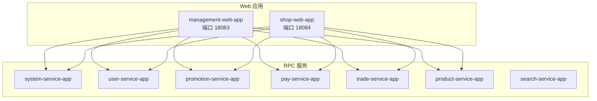
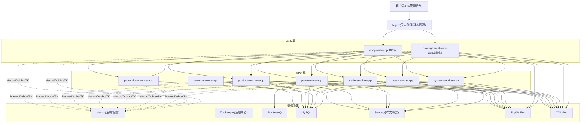
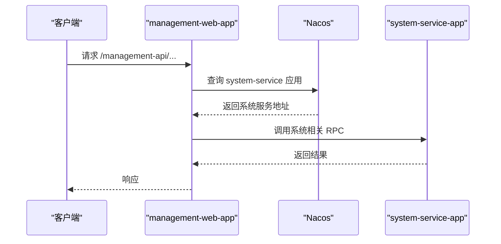
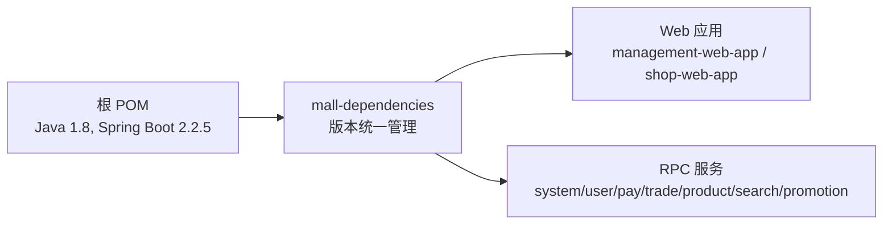

# 环境准备

<cite>
**本文引用的文件**
- [pom.xml](file://pom.xml)
- [mall-dependencies/pom.xml](file://mall-dependencies/pom.xml)
- [README.md](file://README.md)
- [management-web-app/src/main/resources/application.yml](file://management-web-app/src/main/resources/application.yml)
- [management-web-app/src/main/resources/application-dev.yml](file://management-web-app/src/main/resources/application-dev.yml)
- [shop-web-app/src/main/resources/application.yml](file://shop-web-app/src/main/resources/application.yml)
- [pay-service-app/src/main/resources/application.yaml](file://pay-service-app/src/main/resources/application.yaml)
- [pay-service-app/src/main/resources/application-dev.yaml](file://pay-service-app/src/main/resources/application-dev.yaml)
- [product-service-app/src/main/resources/application-dev.yaml](file://product-service-app/src/main/resources/application-dev.yaml)
- [system-service-app/src/main/resources/application.yaml](file://system-service-app/src/main/resources/application.yaml)
- [user-service-app/src/main/resources/application.properties](file://user-service-app/src/main/resources/application.properties)
</cite>

## 目录
1. [简介](#简介)
2. [项目结构](#项目结构)
3. [核心组件](#核心组件)
4. [架构总览](#架构总览)
5. [详细组件分析](#详细组件分析)
6. [依赖分析](#依赖分析)
7. [性能考量](#性能考量)
8. [故障排查指南](#故障排查指南)
9. [结论](#结论)
10. [附录](#附录)

## 简介
本文件面向 Onemall 项目的环境准备与部署，覆盖生产环境硬件配置、操作系统兼容性、必需软件依赖、网络配置、开发/测试环境差异、环境变量与系统参数调优、安全加固以及环境检查清单与验证步骤。内容严格依据仓库中 POM、配置文件与说明文档整理，确保可执行与可追溯。

## 项目结构
Onemall 采用多模块 Maven 结构，后端由多个 Web 应用与 RPC 服务组成，统一通过 Spring Boot 与 Spring Cloud Alibaba 进行依赖与版本管理。前端模块位于独立仓库，后端模块包含：
- Web 应用：management-web-app、shop-web-app
- RPC 服务：system-service-project、user-service-project、promotion-service-project、pay-service-project、trade-service-project、product-service-project、search-service-project

**图表来源**
- [README.md:109-126](file://README.md#L109-L126)
- [management-web-app/src/main/resources/application.yml:1-83](file://management-web-app/src/main/resources/application.yml#L1-L83)
- [shop-web-app/src/main/resources/application.yml:1-76](file://shop-web-app/src/main/resources/application.yml#L1-L76)

**章节来源**
- [README.md:107-139](file://README.md#L107-L139)

## 核心组件
- 运行时与版本
  - JDK：1.8（多处属性与编译插件显式声明）
  - Spring Boot：2.2.5.RELEASE（统一依赖管理）
  - Spring Cloud：Hoxton.SR1
  - Spring Cloud Alibaba：2.2.1.RELEASE
- 中间件与组件
  - MySQL：驱动版本 5.1.46，数据库版本 5.6（技术栈说明）
  - RocketMQ：starter 版本 2.1.1（消息队列）
  - XXL-Job：2.2.0（分布式任务调度）
  - Seata：1.1.0（分布式事务）
  - SkyWalking：8.0.1（分布式追踪）
  - Sentinel：计划引入（监控与网关规划）
  - Nacos：通过 Spring Cloud Alibaba 使用（服务发现与配置）
  - Zookeeper：作为注册中心（技术栈说明）

**章节来源**
- [pom.xml:32-37](file://pom.xml#L32-L37)
- [mall-dependencies/pom.xml:28-31](file://mall-dependencies/pom.xml#L28-L31)
- [mall-dependencies/pom.xml:45-49](file://mall-dependencies/pom.xml#L45-L49)
- [README.md:147-162](file://README.md#L147-L162)

## 架构总览
下图展示 Onemall 的运行环境与外部依赖关系，包括 Web 应用、RPC 服务、注册/配置中心、消息队列与数据库等。

**图表来源**
- [README.md:109-126](file://README.md#L109-L126)
- [management-web-app/src/main/resources/application.yml:19-71](file://management-web-app/src/main/resources/application.yml#L19-L71)
- [shop-web-app/src/main/resources/application.yml:19-64](file://shop-web-app/src/main/resources/application.yml#L19-L64)
- [pay-service-app/src/main/resources/application.yaml:47-57](file://pay-service-app/src/main/resources/application.yaml#L47-L57)
- [mall-dependencies/pom.xml:270-282](file://mall-dependencies/pom.xml#L270-L282)

## 详细组件分析

### Web 应用与端口
- management-web-app：HTTP 端口 18083，Actuator 独立端口 38087；启用 Swagger 文档；Profile 默认 local。
- shop-web-app：HTTP 端口 18084，Actuator 独立端口 38088；启用 Swagger 文档；Profile 默认 local。

这些配置表明：
- Web 应用通过独立的 Actuator 端口暴露监控指标，避免与业务端口冲突。
- Swagger 文档基包与标题在各应用中明确配置，便于联调与测试。

**章节来源**
- [management-web-app/src/main/resources/application.yml:1-83](file://management-web-app/src/main/resources/application.yml#L1-L83)
- [shop-web-app/src/main/resources/application.yml:1-76](file://shop-web-app/src/main/resources/application.yml#L1-L76)

### RPC 服务与 Dubbo/Nacos
- RPC 服务通过 Dubbo 暴露/消费服务，注册中心使用 Nacos 或 Zookeeper（技术栈说明）。
- 应用通过 Nacos 发现服务，命名空间按环境区分（如 dev）。
- RocketMQ 作为消息中间件，服务端地址集中配置。

**图表来源**
- [management-web-app/src/main/resources/application.yml:19-71](file://management-web-app/src/main/resources/application.yml#L19-L71)
- [management-web-app/src/main/resources/application-dev.yml:4-18](file://management-web-app/src/main/resources/application-dev.yml#L4-L18)
- [README.md:158](file://README.md#L158)

**章节来源**
- [management-web-app/src/main/resources/application-dev.yml:4-18](file://management-web-app/src/main/resources/application-dev.yml#L4-L18)
- [pay-service-app/src/main/resources/application.yaml:47-57](file://pay-service-app/src/main/resources/application.yaml#L47-L57)

### 数据库与连接池
- 数据库驱动版本：mysql-connector-java 5.1.46
- 数据库版本：5.6（技术栈说明）
- 连接池：Druid 1.1.16（通过 starter 引入）
- ORM：MyBatis 3.5.4、MyBatis-Plus 3.3.2

**章节来源**
- [mall-dependencies/pom.xml:37-42](file://mall-dependencies/pom.xml#L37-L42)
- [README.md:148](file://README.md#L148)

### 消息队列与任务调度
- RocketMQ：starter 版本 2.1.1，服务端地址集中配置于应用配置文件。
- XXL-Job：2.2.0，executor 日志目录等参数在配置中体现。

**章节来源**
- [mall-dependencies/pom.xml:47](file://mall-dependencies/pom.xml#L47)
- [pay-service-app/src/main/resources/application-dev.yaml:23-32](file://pay-service-app/src/main/resources/application-dev.yaml#L23-L32)

### 分布式事务与监控
- Seata：1.1.0，用于跨服务事务一致性。
- SkyWalking：8.0.1，用于链路追踪与指标采集。
- Sentinel：计划引入，用于流量治理与熔断降级。

**章节来源**
- [mall-dependencies/pom.xml:51](file://mall-dependencies/pom.xml#L51)
- [mall-dependencies/pom.xml:57-59](file://mall-dependencies/pom.xml#L57-L59)
- [README.md:166](file://README.md#L166)

## 依赖分析
- 版本统一：mall-dependencies 通过 dependencyManagement 统一管理 Spring Boot、Cloud、Alibaba、Dubbo、RocketMQ、XXL-Job、Seata、SkyWalking 等版本。
- 编译与打包：Java 1.8，maven-compiler-plugin 与 spring-boot-maven-plugin 在根 POM 中统一配置。
- 运行时：Web 应用使用 Spring Boot 内嵌容器，RPC 服务通过 Dubbo 协议暴露，Actuator 独立端口。

**图表来源**
- [pom.xml:32-37](file://pom.xml#L32-L37)
- [mall-dependencies/pom.xml:28-31](file://mall-dependencies/pom.xml#L28-L31)

**章节来源**
- [pom.xml:39-75](file://pom.xml#L39-L75)
- [mall-dependencies/pom.xml:70-94](file://mall-dependencies/pom.xml#L70-L94)

## 性能考量
- JVM 与线程：建议在生产环境为各服务分配合理的堆大小与 GC 参数，结合 Actuator 指标与 SkyWalking 观察 GC 与延迟。
- 数据库：使用连接池 Druid 并结合慢查询日志与索引优化；按业务拆库拆表，避免单表过大。
- MQ：合理设置生产者/消费者并发与批量大小，避免消息积压。
- RPC：根据服务 QPS 与 RT 调整超时与重试策略，避免级联故障。
- 缓存：结合业务场景引入缓存（如 Redis），降低数据库压力。

## 故障排查指南
- 端口占用
  - Web 应用端口：18083、18084；Actuator 独立端口：38087、38088。
  - RPC 服务：Dubbo 协议端口由 -1（随机端口）或自定义端口决定，需确认注册中心可见性。
- 注册中心与配置中心
  - 确认 Nacos 地址与命名空间正确；Dubbo 通过 nacos://...?namespace=xxx 指定命名空间。
- 数据库连通性
  - 检查 JDBC URL、用户名、密码；确保 MySQL 5.6+ 可用。
- 消息队列
  - RocketMQ NameServer 地址与网络可达；生产者/消费者组名正确。
- 监控与日志
  - Actuator 暴露端点可用于健康检查；SkyWalking Agent 配置正确。
- 业务配置
  - 用户服务的短信验证码有效期、频率等参数在 application.properties 中配置。

**章节来源**
- [management-web-app/src/main/resources/application.yml:1-83](file://management-web-app/src/main/resources/application.yml#L1-L83)
- [shop-web-app/src/main/resources/application.yml:1-76](file://shop-web-app/src/main/resources/application.yml#L1-L76)
- [pay-service-app/src/main/resources/application.yaml:47-57](file://pay-service-app/src/main/resources/application.yaml#L47-L57)
- [pay-service-app/src/main/resources/application-dev.yaml:1-32](file://pay-service-app/src/main/resources/application-dev.yaml#L1-L32)
- [product-service-app/src/main/resources/application-dev.yaml:1-22](file://product-service-app/src/main/resources/application-dev.yaml#L1-L22)
- [system-service-app/src/main/resources/application.yaml:1-79](file://system-service-app/src/main/resources/application.yaml#L1-L79)
- [user-service-app/src/main/resources/application.properties:1-6](file://user-service-app/src/main/resources/application.properties#L1-L6)

## 结论
Onemall 的生产环境需要满足 JDK 1.8、Spring Boot 2.2.x、MySQL 5.6+、RocketMQ 与 Nacos 等基础设施要求。通过 mall-dependencies 统一版本管理，结合 Web 应用与 RPC 服务的独立端口与监控配置，可实现清晰的部署与运维边界。建议在上线前完成网络连通性、注册中心可用性、数据库连通性与 MQ 可达性的端到端验证。

## 附录

### 生产环境硬件配置建议
- CPU：建议至少 4 核，高并发场景建议 8 核以上
- 内存：建议至少 8 GB，高并发场景建议 16 GB 以上
- 磁盘：建议 SSD 至少 100 GB 可用空间，MySQL 与日志目录预留充足空间
- 网络：千兆网络，确保各服务间低延迟通信

### 操作系统兼容性
- Linux：CentOS 7+/Ubuntu 16.04+ 推荐
- Windows Server：不作为生产首选，如需支持请自行验证

### 必需软件依赖
- JDK：1.8
- MySQL：5.6+
- RocketMQ：starter 2.1.1（配合 NameServer）
- Nacos：通过 Spring Cloud Alibaba 使用
- XXL-Job：2.2.0
- Seata：1.1.0
- SkyWalking：8.0.1
- Sentinel：计划引入

**章节来源**
- [pom.xml:32-37](file://pom.xml#L32-L37)
- [mall-dependencies/pom.xml:28-31](file://mall-dependencies/pom.xml#L28-L31)
- [mall-dependencies/pom.xml:47](file://mall-dependencies/pom.xml#L47)
- [mall-dependencies/pom.xml:51](file://mall-dependencies/pom.xml#L51)
- [mall-dependencies/pom.xml:57-59](file://mall-dependencies/pom.xml#L57-L59)
- [README.md:147-162](file://README.md#L147-L162)

### 服务器网络配置指南
- 防火墙与端口
  - Web 应用：18083、18084（业务）、38087、38088（Actuator）
  - RPC 服务：Dubbo 协议端口（随机或自定义，需放行）
  - Nacos：8848（服务发现与配置）
  - RocketMQ：9876（NameServer）
  - MySQL：3306
  - Seata：8091（默认）
  - XXL-Job：9099（Admin）
- 域名解析
  - 将域名指向 Nginx/负载均衡器，再转发至 Web 应用端口
  - 注册中心与 MQ 服务建议内网域名直连

**章节来源**
- [management-web-app/src/main/resources/application.yml:1-83](file://management-web-app/src/main/resources/application.yml#L1-L83)
- [shop-web-app/src/main/resources/application.yml:1-76](file://shop-web-app/src/main/resources/application.yml#L1-L76)
- [pay-service-app/src/main/resources/application-dev.yaml:1-32](file://pay-service-app/src/main/resources/application-dev.yaml#L1-L32)
- [product-service-app/src/main/resources/application-dev.yaml:1-22](file://product-service-app/src/main/resources/application-dev.yaml#L1-L22)

### 开发/测试/生产环境差异
- Profile 切换
  - Web 应用默认激活 local，可通过 spring.profiles.active 切换 dev/test/prod
- 配置文件管理
  - application.yml：通用配置（端口、Swagger、Actuator）
  - application-dev.yml：开发环境专用（Nacos、数据库、XXL-Job）
  - application-local.yml：本地开发（可复用 application.yml 与 application-dev.yml）
- 数据库与注册中心
  - 开发环境使用 dev 命名空间；生产环境建议使用 prod 命名空间并隔离网络

**章节来源**
- [management-web-app/src/main/resources/application.yml:11-13](file://management-web-app/src/main/resources/application.yml#L11-L13)
- [management-web-app/src/main/resources/application-dev.yml:4-18](file://management-web-app/src/main/resources/application-dev.yml#L4-L18)
- [shop-web-app/src/main/resources/application.yml:11-13](file://shop-web-app/src/main/resources/application.yml#L11-L13)
- [pay-service-app/src/main/resources/application.yaml:5-7](file://pay-service-app/src/main/resources/application.yaml#L5-L7)
- [pay-service-app/src/main/resources/application-dev.yaml:1-32](file://pay-service-app/src/main/resources/application-dev.yaml#L1-L32)
- [product-service-app/src/main/resources/application-dev.yaml:1-22](file://product-service-app/src/main/resources/application-dev.yaml#L1-L22)
- [system-service-app/src/main/resources/application.yaml:5-7](file://system-service-app/src/main/resources/application.yaml#L5-L7)

### 环境变量与系统参数调优
- 环境变量
  - JAVA_OPTS：设置 JVM 参数（堆大小、GC、日志目录等）
  - SPRING_PROFILES_ACTIVE：切换 profile（local/dev/test/prod）
- 系统参数
  - 文件句柄限制：ulimit -n（建议 65536+）
  - 网络缓冲区：net.core.somaxconn、net.ipv4.ip_local_port_range
  - 内核参数：vm.overcommit_memory、vm.swappiness（按需调整）

### 安全加固措施
- 网络
  - 仅开放必要端口；Nacos、RocketMQ、MySQL、XXL-Job 建议内网访问
  - 使用 HTTPS 与 TLS 加密传输（前端与后端）
- 认证与授权
  - 启用 Nacos、RocketMQ 管理控制台认证
  - 对 Actuator 端点进行访问控制与鉴权
- 密钥与配置
  - 数据库密码、RocketMQ 访问令牌、XXL-Job Token 等敏感信息使用密文存储与动态注入
- 日志与审计
  - 启用 SkyWalking 与日志审计，定期巡检异常与告警

### 环境检查清单与验证步骤
- 基础设施
  - 服务器时间同步（NTP）
  - 防火墙放行端口清单核对
  - DNS 解析与内网连通性测试
- 中间件
  - Nacos 可用性与命名空间存在性
  - RocketMQ NameServer 可达性
  - MySQL 可连接与权限验证
  - Seata、XXL-Job 可用性
- 应用
  - Web 应用端口监听与健康检查
  - Actuator 端点可访问
  - RPC 服务注册与发现正常
  - Swagger 文档可访问
- 性能与监控
  - SkyWalking Agent 注册成功
  - 关键指标（QPS、RT、错误率）正常