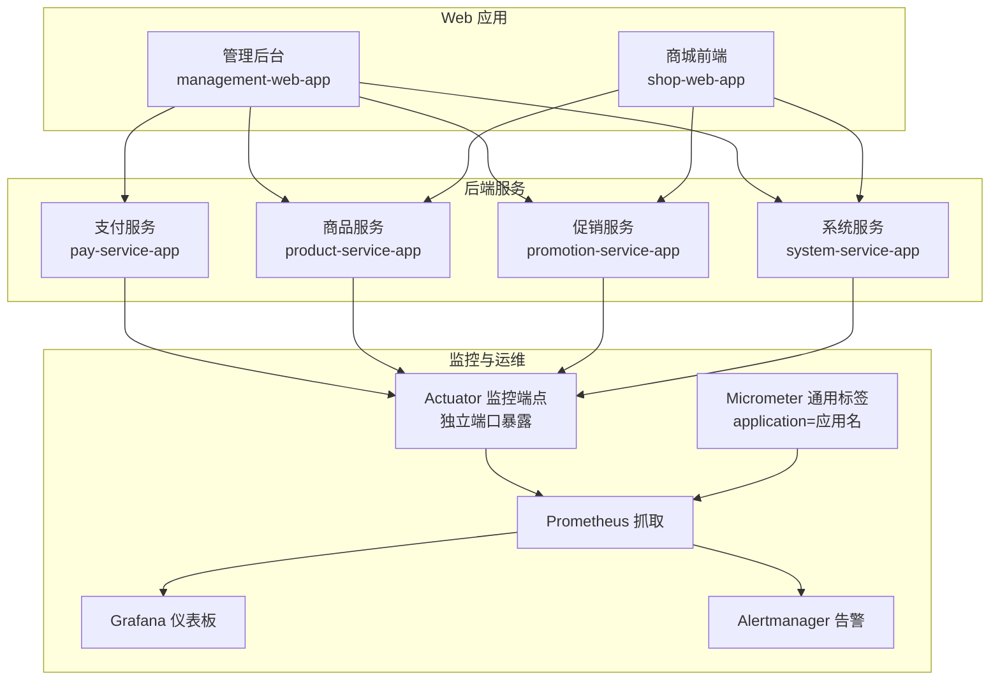
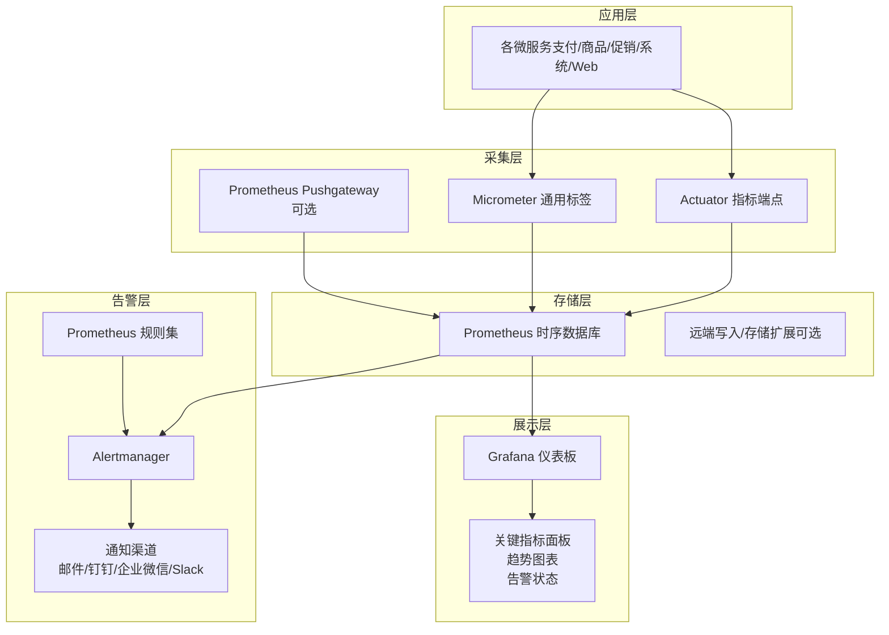
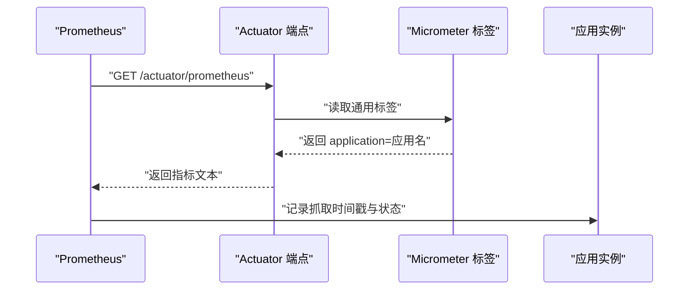
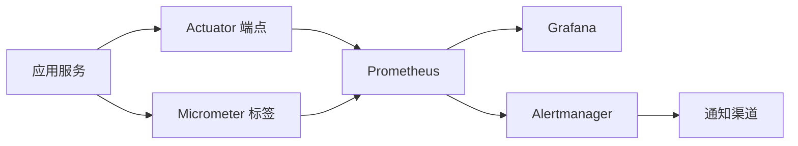

# 监控告警

<cite>
**本文引用的文件**
- [MetricsAutoConfiguration.java](file://common/mall-spring-boot/src/main/java/cn/iocoder/mall/spring/boot/metrics/MetricsAutoConfiguration.java)
- [application.yml（管理后台）](file://management-web-app/src/main/resources/application.yml)
- [application.yml（商城前端）](file://shop-web-app/src/main/resources/application.yml)
- [application.yaml（支付服务）](file://pay-service-project/pay-service-app/src/main/resources/application.yaml)
- [application.yaml（商品服务）](file://product-service-project/product-service-app/src/main/resources/application.yaml)
- [application.yaml（促销服务）](file://promotion-service-project/promotion-service-app/src/main/resources/application.yaml)
- [application.yaml（系统服务）](file://system-service-project/system-service-app/src/main/resources/application.yaml)
</cite>

## 目录
1. [简介](#简介)
2. [项目结构](#项目结构)
3. [核心组件](#核心组件)
4. [架构总览](#架构总览)
5. [详细组件分析](#详细组件分析)
6. [依赖关系分析](#依赖关系分析)
7. [性能考虑](#性能考虑)
8. [故障排查指南](#故障排查指南)
9. [结论](#结论)
10. [附录](#附录)

## 简介
本文件面向 Onemall 微服务架构，提供一套完整的监控告警体系设计与实施建议，覆盖 Prometheus 指标采集、Grafana 仪表板、Alertmanager 告警规则、应用与基础设施监控、通知渠道、数据存储与归档、查询优化与性能调优、以及监控数据的备份与恢复方案。文档以仓库中已存在的 Actuator 暴露端点与 Micrometer 标签配置为基础，结合各模块的配置文件，给出可落地的实践步骤与最佳实践。

## 项目结构
Onemall 采用多模块微服务架构，包含多个后端服务（如支付、商品、促销、系统等）与两个 Web 应用（管理后台与商城前端）。每个服务均通过 Spring Boot Actuator 暴露监控端点，便于 Prometheus 抓取；同时通过 Micrometer 注入通用标签，统一标识应用来源，便于在监控系统中进行聚合与过滤。

**图示来源**
- [application.yml（管理后台）:80-83](file://management-web-app/src/main/resources/application.yml#L80-L83)
- [application.yml（商城前端）:72-76](file://shop-web-app/src/main/resources/application.yml#L72-L76)
- [application.yaml（支付服务）:53-57](file://pay-service-project/pay-service-app/src/main/resources/application.yaml#L53-L57)
- [application.yaml（商品服务）:49-53](file://product-service-project/product-service-app/src/main/resources/application.yaml#L49-L53)
- [application.yaml（促销服务）:53-57](file://promotion-service-project/promotion-service-app/src/main/resources/application.yaml#L53-L57)
- [application.yaml（系统服务）:62-66](file://system-service-project/system-service-app/src/main/resources/application.yaml#L62-L66)
- [MetricsAutoConfiguration.java:16-22](file://common/mall-spring-boot/src/main/java/cn/iocoder/mall/spring/boot/metrics/MetricsAutoConfiguration.java#L16-L22)

**章节来源**
- [application.yml（管理后台）:1-83](file://management-web-app/src/main/resources/application.yml#L1-L83)
- [application.yml（商城前端）:1-76](file://shop-web-app/src/main/resources/application.yml#L1-L76)
- [application.yaml（支付服务）:1-65](file://pay-service-project/pay-service-app/src/main/resources/application.yaml#L1-L65)
- [application.yaml（商品服务）:1-61](file://product-service-project/product-service-app/src/main/resources/application.yaml#L1-L61)
- [application.yaml（促销服务）:1-65](file://promotion-service-project/promotion-service-app/src/main/resources/application.yaml#L1-L65)
- [application.yaml（系统服务）:1-79](file://system-service-project/system-service-app/src/main/resources/application.yaml#L1-L79)
- [MetricsAutoConfiguration.java:1-25](file://common/mall-spring-boot/src/main/java/cn/iocoder/mall/spring/boot/metrics/MetricsAutoConfiguration.java#L1-L25)

## 核心组件
- Actuator 监控端点：各服务通过独立端口暴露监控端点，便于 Prometheus 抓取 JVM 与应用指标。
- Micrometer 通用标签：自动注入 application 标签，统一标识应用来源，便于聚合与过滤。
- Prometheus 抓取：基于服务发现或静态配置，定时从各服务的 Actuator 端点抓取指标。
- Grafana 仪表板：基于 Prometheus 数据源构建关键指标面板、趋势图表与告警状态展示。
- Alertmanager 告警：基于规则生成告警，按级别与静默周期进行抑制与通知。
- 通知渠道：支持邮件、钉钉、企业微信、Slack 等多种通知方式。
- 基础设施监控：采集 CPU、内存、磁盘、网络等主机与容器指标，统一纳入监控平台。
- 存储与归档：长期存储与分层归档策略，结合查询优化与性能调优。
- 备份与恢复：监控数据的备份与恢复方案，保障数据完整性与可恢复性。

**章节来源**
- [MetricsAutoConfiguration.java:11-22](file://common/mall-spring-boot/src/main/java/cn/iocoder/mall/spring/boot/metrics/MetricsAutoConfiguration.java#L11-L22)
- [application.yml（管理后台）:80-83](file://management-web-app/src/main/resources/application.yml#L80-L83)
- [application.yml（商城前端）:72-76](file://shop-web-app/src/main/resources/application.yml#L72-L76)
- [application.yaml（支付服务）:53-57](file://pay-service-project/pay-service-app/src/main/resources/application.yaml#L53-L57)
- [application.yaml（商品服务）:49-53](file://product-service-project/product-service-app/src/main/resources/application.yaml#L49-L53)
- [application.yaml（促销服务）:53-57](file://promotion-service-project/promotion-service-app/src/main/resources/application.yaml#L53-L57)
- [application.yaml（系统服务）:62-66](file://system-service-project/system-service-app/src/main/resources/application.yaml#L62-L66)

## 架构总览
下图展示了 Onemall 监控告警系统的整体架构，涵盖指标采集、传输、存储、可视化与告警通知的关键环节。

**图示来源**
- [MetricsAutoConfiguration.java:16-22](file://common/mall-spring-boot/src/main/java/cn/iocoder/mall/spring/boot/metrics/MetricsAutoConfiguration.java#L16-L22)
- [application.yml（管理后台）:80-83](file://management-web-app/src/main/resources/application.yml#L80-L83)
- [application.yml（商城前端）:72-76](file://shop-web-app/src/main/resources/application.yml#L72-L76)
- [application.yaml（支付服务）:53-57](file://pay-service-project/pay-service-app/src/main/resources/application.yaml#L53-L57)
- [application.yaml（商品服务）:49-53](file://product-service-project/product-service-app/src/main/resources/application.yaml#L49-L53)
- [application.yaml（促销服务）:53-57](file://promotion-service-project/promotion-service-app/src/main/resources/application.yaml#L53-L57)
- [application.yaml（系统服务）:62-66](file://system-service-project/system-service-app/src/main/resources/application.yaml#L62-L66)

## 详细组件分析

### Prometheus 指标采集配置
- Actuator 端点暴露：各服务已在独立端口暴露监控端点，便于 Prometheus 抓取 JVM 与应用指标。
- 通用标签注入：通过 Micrometer 自动注入 application 标签，统一标识应用来源，便于在 Grafana 中进行聚合与过滤。
- 抓取目标与规则：
  - 使用服务发现或静态配置，将各服务的 Actuator 端口加入抓取目标。
  - 抓取指标包括但不限于：JVM 内存、GC、线程、类加载；HTTP 请求耗时、请求数、错误数；业务相关计数器与分布直方图等。
  - 自定义指标：在业务代码中注册计数器、计时器、分布直方图等，命名遵循清晰语义并带 application 标签。

**图示来源**
- [MetricsAutoConfiguration.java:16-22](file://common/mall-spring-boot/src/main/java/cn/iocoder/mall/spring/boot/metrics/MetricsAutoConfiguration.java#L16-L22)
- [application.yml（管理后台）:80-83](file://management-web-app/src/main/resources/application.yml#L80-L83)
- [application.yml（商城前端）:72-76](file://shop-web-app/src/main/resources/application.yml#L72-L76)
- [application.yaml（支付服务）:53-57](file://pay-service-project/pay-service-app/src/main/resources/application.yaml#L53-L57)
- [application.yaml（商品服务）:49-53](file://product-service-project/product-service-app/src/main/resources/application.yaml#L49-L53)
- [application.yaml（促销服务）:53-57](file://promotion-service-project/promotion-service-app/src/main/resources/application.yaml#L53-L57)
- [application.yaml（系统服务）:62-66](file://system-service-project/system-service-app/src/main/resources/application.yaml#L62-L66)

**章节来源**
- [MetricsAutoConfiguration.java:11-22](file://common/mall-spring-boot/src/main/java/cn/iocoder/mall/spring/boot/metrics/MetricsAutoConfiguration.java#L11-L22)
- [application.yml（管理后台）:80-83](file://management-web-app/src/main/resources/application.yml#L80-L83)
- [application.yml（商城前端）:72-76](file://shop-web-app/src/main/resources/application.yml#L72-L76)
- [application.yaml（支付服务）:53-57](file://pay-service-project/pay-service-app/src/main/resources/application.yaml#L53-L57)
- [application.yaml（商品服务）:49-53](file://product-service-project/product-service-app/src/main/resources/application.yaml#L49-L53)
- [application.yaml（促销服务）:53-57](file://promotion-service-project/promotion-service-app/src/main/resources/application.yaml#L53-L57)
- [application.yaml（系统服务）:62-66](file://system-service-project/system-service-app/src/main/resources/application.yaml#L62-L66)

### Grafana 仪表板设计
- 关键指标面板：
  - 接口响应时间：P50/P95/P99 分位；错误率；吞吐量（请求/秒）。
  - JVM 指标：堆/非堆内存使用率、GC 次数与耗时、线程数、类加载数。
  - 基础设施：CPU 使用率、内存使用率、磁盘 IO、网络带宽。
- 趋势图表：按天/周/月的趋势对比，识别异常波动与容量增长。
- 告警状态展示：实时展示告警级别、触发时间、抑制状态与恢复情况。
- 通用标签使用：通过 application 标签实现跨服务聚合与对比。

**章节来源**
- [MetricsAutoConfiguration.java:16-22](file://common/mall-spring-boot/src/main/java/cn/iocoder/mall/spring/boot/metrics/MetricsAutoConfiguration.java#L16-L22)

### Alertmanager 告警规则配置
- 阈值设置：根据业务 SLA 设定阈值，如接口 P99 超过 1 秒、错误率超过 1%、内存使用率超过 80%。
- 告警级别：区分严重（Critical）、警告（Warning）、提示（Info）三级。
- 静默周期：为维护窗口或演练设定静默期，避免误报干扰。
- 告警抑制：同一事件触发的子告警可抑制，降低噪音。
- 通知渠道：邮件、钉钉、企业微信、Slack 等，按级别路由至不同通道。

**章节来源**
- [application.yml（管理后台）:80-83](file://management-web-app/src/main/resources/application.yml#L80-L83)
- [application.yml（商城前端）:72-76](file://shop-web-app/src/main/resources/application.yml#L72-L76)
- [application.yaml（支付服务）:53-57](file://pay-service-project/pay-service-app/src/main/resources/application.yaml#L53-L57)
- [application.yaml（商品服务）:49-53](file://product-service-project/product-service-app/src/main/resources/application.yaml#L49-L53)
- [application.yaml（促销服务）:53-57](file://promotion-service-project/promotion-service-app/src/main/resources/application.yaml#L53-L57)
- [application.yaml（系统服务）:62-66](file://system-service-project/system-service-app/src/main/resources/application.yaml#L62-L66)

### 应用层面监控指标
- 接口响应时间：P50/P95/P99；错误率；吞吐量（QPS）。
- 并发数：活跃线程数、连接池使用率、队列长度。
- 业务指标：订单量、支付成功率、库存变更速率等。
- 采集方式：通过 Micrometer 在业务代码中注册计数器与分布直方图，自动打上 application 标签。

**章节来源**
- [MetricsAutoConfiguration.java:16-22](file://common/mall-spring-boot/src/main/java/cn/iocoder/mall/spring/boot/metrics/MetricsAutoConfiguration.java#L16-L22)

### 基础设施监控
- 主机指标：CPU 使用率、负载、内存使用率、磁盘空间与 IO、网络带宽与丢包。
- 容器指标：Kubernetes 或 Docker 环境下的 Pod/容器资源使用情况。
- 采集方式：Prometheus Node Exporter、cAdvisor、kube-state-metrics 等组件。

**章节来源**
- [application.yml（管理后台）:80-83](file://management-web-app/src/main/resources/application.yml#L80-L83)
- [application.yml（商城前端）:72-76](file://shop-web-app/src/main/resources/application.yml#L72-L76)
- [application.yaml（支付服务）:53-57](file://pay-service-project/pay-service-app/src/main/resources/application.yaml#L53-L57)
- [application.yaml（商品服务）:49-53](file://product-service-project/product-service-app/src/main/resources/application.yaml#L49-L53)
- [application.yaml（促销服务）:53-57](file://promotion-service-project/promotion-service-app/src/main/resources/application.yaml#L53-L57)
- [application.yaml（系统服务）:62-66](file://system-service-project/system-service-app/src/main/resources/application.yaml#L62-L66)

### 告警通知渠道配置
- 邮件：用于重要级别告警与确认通知。
- 钉钉/企业微信：用于即时消息推送，支持群机器人与部门通知。
- Slack：用于团队协作与快速响应。
- 路由策略：按级别与业务域路由至不同渠道，减少噪音并提升响应效率。

**章节来源**
- [application.yml（管理后台）:80-83](file://management-web-app/src/main/resources/application.yml#L80-L83)
- [application.yml（商城前端）:72-76](file://shop-web-app/src/main/resources/application.yml#L72-L76)
- [application.yaml（支付服务）:53-57](file://pay-service-project/pay-service-app/src/main/resources/application.yaml#L53-L57)
- [application.yaml（商品服务）:49-53](file://product-service-project/product-service-app/src/main/resources/application.yaml#L49-L53)
- [application.yaml（促销服务）:53-57](file://promotion-service-project/promotion-service-app/src/main/resources/application.yaml#L53-L57)
- [application.yaml（系统服务）:62-66](file://system-service-project/system-service-app/src/main/resources/application.yaml#L62-L66)

### 监控数据的长期存储与归档策略
- 近线/离线分离：近期高频指标保留高精度数据，历史数据进行降采样与压缩。
- 分层归档：按时间维度分层存储，缩短热数据访问延迟。
- 查询优化：对热点指标建立索引与物化视图，减少复杂查询成本。
- 性能调优：合理设置抓取间隔、批处理大小与压缩算法，平衡存储与查询性能。

**章节来源**
- [application.yml（管理后台）:80-83](file://management-web-app/src/main/resources/application.yml#L80-L83)
- [application.yml（商城前端）:72-76](file://shop-web-app/src/main/resources/application.yml#L72-L76)
- [application.yaml（支付服务）:53-57](file://pay-service-project/pay-service-app/src/main/resources/application.yaml#L53-L57)
- [application.yaml（商品服务）:49-53](file://product-service-project/product-service-app/src/main/resources/application.yaml#L49-L53)
- [application.yaml（促销服务）:53-57](file://promotion-service-project/promotion-service-app/src/main/resources/application.yaml#L53-L57)
- [application.yaml（系统服务）:62-66](file://system-service-project/system-service-app/src/main/resources/application.yaml#L62-L66)

### 监控系统的备份与恢复方案
- 数据备份：定期导出 Prometheus 时间序列数据与规则配置，加密存储于安全位置。
- 配置备份：保存 Grafana 仪表板 JSON、Alertmanager 规则与通知配置。
- 恢复演练：定期进行恢复演练，验证备份数据可用性与恢复流程有效性。
- 完整性校验：通过哈希校验与时间戳比对，确保备份数据完整无损。

**章节来源**
- [application.yml（管理后台）:80-83](file://management-web-app/src/main/resources/application.yml#L80-L83)
- [application.yml（商城前端）:72-76](file://shop-web-app/src/main/resources/application.yml#L72-L76)
- [application.yaml（支付服务）:53-57](file://pay-service-project/pay-service-app/src/main/resources/application.yaml#L53-L57)
- [application.yaml（商品服务）:49-53](file://product-service-project/product-service-app/src/main/resources/application.yaml#L49-L53)
- [application.yaml（促销服务）:53-57](file://promotion-service-project/promotion-service-app/src/main/resources/application.yaml#L53-L57)
- [application.yaml（系统服务）:62-66](file://system-service-project/system-service-app/src/main/resources/application.yaml#L62-L66)

## 依赖关系分析
- 组件耦合：各服务通过 Actuator 与 Micrometer 与监控系统解耦，Prometheus 仅依赖标准 HTTP 接口。
- 依赖链：应用 → Actuator → Prometheus → Grafana/Alertmanager。
- 外部依赖：Prometheus、Grafana、Alertmanager、通知渠道（邮件/钉钉/企业微信/Slack）。

**图示来源**
- [MetricsAutoConfiguration.java:16-22](file://common/mall-spring-boot/src/main/java/cn/iocoder/mall/spring/boot/metrics/MetricsAutoConfiguration.java#L16-L22)
- [application.yml（管理后台）:80-83](file://management-web-app/src/main/resources/application.yml#L80-L83)
- [application.yml（商城前端）:72-76](file://shop-web-app/src/main/resources/application.yml#L72-L76)
- [application.yaml（支付服务）:53-57](file://pay-service-project/pay-service-app/src/main/resources/application.yaml#L53-L57)
- [application.yaml（商品服务）:49-53](file://product-service-project/product-service-app/src/main/resources/application.yaml#L49-L53)
- [application.yaml（促销服务）:53-57](file://promotion-service-project/promotion-service-app/src/main/resources/application.yaml#L53-L57)
- [application.yaml（系统服务）:62-66](file://system-service-project/system-service-app/src/main/resources/application.yaml#L62-L66)

**章节来源**
- [MetricsAutoConfiguration.java:11-22](file://common/mall-spring-boot/src/main/java/cn/iocoder/mall/spring/boot/metrics/MetricsAutoConfiguration.java#L11-L22)
- [application.yml（管理后台）:80-83](file://management-web-app/src/main/resources/application.yml#L80-L83)
- [application.yml（商城前端）:72-76](file://shop-web-app/src/main/resources/application.yml#L72-L76)
- [application.yaml（支付服务）:53-57](file://pay-service-project/pay-service-app/src/main/resources/application.yaml#L53-L57)
- [application.yaml（商品服务）:49-53](file://product-service-project/product-service-app/src/main/resources/application.yaml#L49-L53)
- [application.yaml（促销服务）:53-57](file://promotion-service-project/promotion-service-app/src/main/resources/application.yaml#L53-L57)
- [application.yaml（系统服务）:62-66](file://system-service-project/system-service-app/src/main/resources/application.yaml#L62-L66)

## 性能考虑
- 抓取频率：根据指标变化速率与查询压力，合理设置抓取间隔，避免过度拉取。
- 指标瘦身：剔除低价值指标，保留关键指标，减少存储与查询开销。
- 压缩与分片：启用压缩与分片策略，提升写入与查询性能。
- 缓存与预聚合：对热点查询结果进行缓存与预聚合，降低重复计算。
- 网络与存储：优化网络带宽与存储 IOPS，确保监控系统稳定运行。

**章节来源**
- [application.yml（管理后台）:80-83](file://management-web-app/src/main/resources/application.yml#L80-L83)
- [application.yml（商城前端）:72-76](file://shop-web-app/src/main/resources/application.yml#L72-L76)
- [application.yaml（支付服务）:53-57](file://pay-service-project/pay-service-app/src/main/resources/application.yaml#L53-L57)
- [application.yaml（商品服务）:49-53](file://product-service-project/product-service-app/src/main/resources/application.yaml#L49-L53)
- [application.yaml（促销服务）:53-57](file://promotion-service-project/promotion-service-app/src/main/resources/application.yaml#L53-L57)
- [application.yaml（系统服务）:62-66](file://system-service-project/system-service-app/src/main/resources/application.yaml#L62-L66)

## 故障排查指南
- Actuator 不可用：检查独立端口是否正确配置，确认暴露的监控端点是否可达。
- 指标缺失：确认 Micrometer 标签是否生效，检查自定义指标注册是否正确。
- 抓取失败：核对 Prometheus 抓取配置与目标地址，检查网络连通性与认证配置。
- 告警不触发：检查规则表达式与告警级别，确认 Alertmanager 路由与通知配置。
- 通知异常：验证通知渠道的凭据与权限，检查静默与抑制配置。

**章节来源**
- [MetricsAutoConfiguration.java:16-22](file://common/mall-spring-boot/src/main/java/cn/iocoder/mall/spring/boot/metrics/MetricsAutoConfiguration.java#L16-L22)
- [application.yml（管理后台）:80-83](file://management-web-app/src/main/resources/application.yml#L80-L83)
- [application.yml（商城前端）:72-76](file://shop-web-app/src/main/resources/application.yml#L72-L76)
- [application.yaml（支付服务）:53-57](file://pay-service-project/pay-service-app/src/main/resources/application.yaml#L53-L57)
- [application.yaml（商品服务）:49-53](file://product-service-project/product-service-app/src/main/resources/application.yaml#L49-L53)
- [application.yaml（促销服务）:53-57](file://promotion-service-project/promotion-service-app/src/main/resources/application.yaml#L53-L57)
- [application.yaml（系统服务）:62-66](file://system-service-project/system-service-app/src/main/resources/application.yaml#L62-L66)

## 结论
Onemall 已具备完善的监控基础：Actuator 独立端口暴露与 Micrometer 通用标签，使得 Prometheus 能够稳定抓取 JVM 与应用指标。在此基础上，结合 Grafana 仪表板与 Alertmanager 告警，可快速构建覆盖应用与基础设施的监控告警体系。通过合理的存储与归档策略、查询优化与性能调优，以及完善的备份与恢复方案，能够有效保障监控系统的稳定性与可靠性。

## 附录
- 快速检查清单：
  - 各服务 Actuator 端口是否独立且可访问。
  - Micrometer 通用标签是否生效。
  - Prometheus 抓取配置是否正确。
  - Grafana 数据源与仪表板是否可用。
  - Alertmanager 规则与通知渠道是否配置完成。
  - 基础设施监控组件是否部署并接入。
  - 存储与归档策略、备份与恢复方案是否制定并演练。