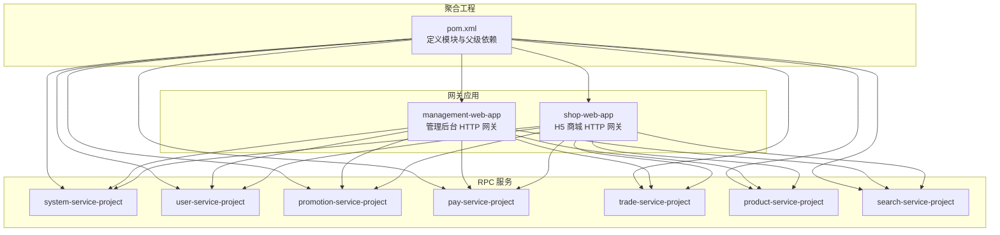
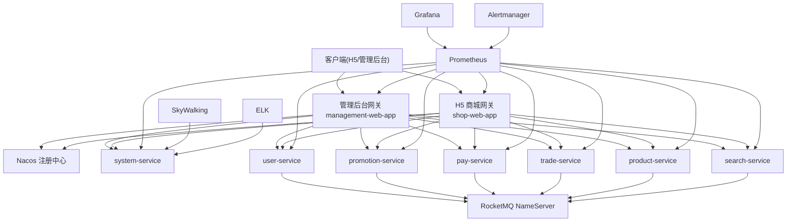
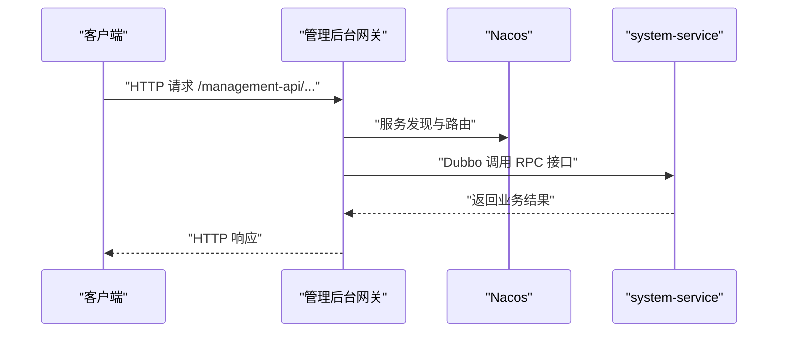
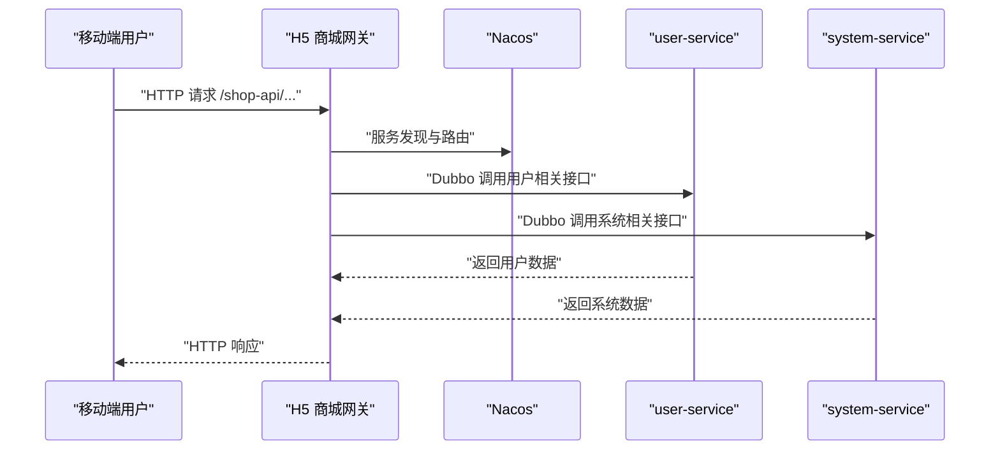
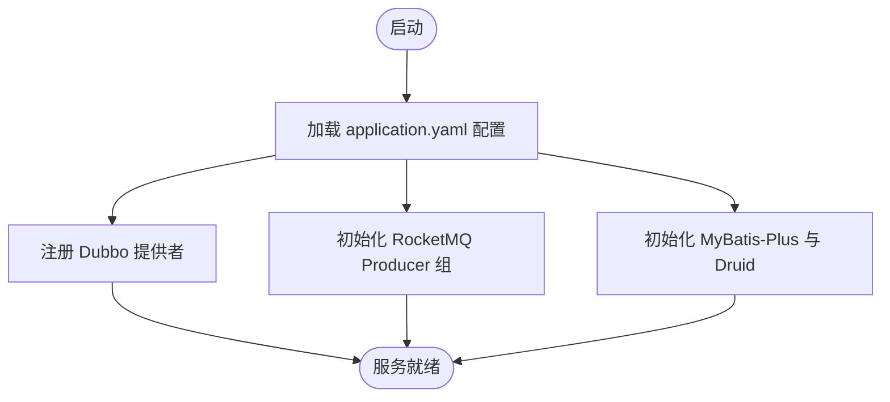
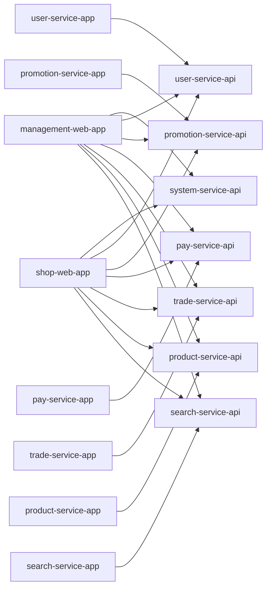

# 部署运维

<cite>
**本文引用的文件**
- [README.md](file://README.md)
- [pom.xml](file://pom.xml)
- [management-web-app/src/main/resources/application.yml](file://management-web-app/src/main/resources/application.yml)
- [shop-web-app/src/main/resources/application.yml](file://shop-web-app/src/main/resources/application.yml)
- [pay-service-app/src/main/resources/application.yaml](file://pay-service-app/src/main/resources/application.yaml)
- [product-service-app/src/main/resources/application.yaml](file://product-service-app/src/main/resources/application.yaml)
- [system-service-app/src/main/resources/application.yaml](file://system-service-app/src/main/resources/application.yaml)
- [user-service-app/pom.xml](file://user-service-app/pom.xml)
- [promotion-service-app/pom.xml](file://promotion-service-app/pom.xml)
- [trade-service-app/pom.xml](file://trade-service-app/pom.xml)
- [search-service-app/pom.xml](file://search-service-app/pom.xml)
</cite>

## 目录
1. [简介](#简介)
2. [项目结构](#项目结构)
3. [核心组件](#核心组件)
4. [架构总览](#架构总览)
5. [详细组件分析](#详细组件分析)
6. [依赖分析](#依赖分析)
7. [性能考量](#性能考量)
8. [故障排查指南](#故障排查指南)
9. [结论](#结论)
10. [附录](#附录)

## 简介
本文件面向 Onemall 生产环境的部署与运维，覆盖服务器环境准备、中间件安装配置、数据库部署、应用部署流程；阐述容器化与 Kubernetes 集群部署要点；介绍监控告警与日志管理方案；说明 CI/CD 流水线配置思路；并提供性能优化与容量规划指导及故障排查操作手册。  
Onemall 采用微服务架构，后端以 Spring Boot 为基础，服务间通过 Dubbo（结合 Nacos 注册中心）通信，消息中间件采用 RocketMQ，监控体系包含 Prometheus、Grafana、Alertmanager 以及 SkyWalking、ELK 等。前端分别提供 H5 商城与管理后台两个应用。

章节来源
- [README.md:107-126](file://README.md#L107-L126)
- [README.md:141-206](file://README.md#L141-L206)

## 项目结构
- 顶层聚合工程定义了多模块结构，包含通用模块、各业务服务模块（system、user、promotion、pay、trade、product、search）以及两个对外 HTTP 网关应用（management-web-app、shop-web-app）。
- 各服务模块遵循“xxx-service-project”结构：xxx-service-api（RPC 接口）、xxx-service-app（RPC 实现与配置）、xxx-service-integration-test（集成测试）。
- 对外网关应用提供 HTTP API，内部通过 Dubbo 调用各 RPC 服务。

图表来源
- [pom.xml:16-28](file://pom.xml#L16-L28)
- [management-web-app/src/main/resources/application.yml:19-71](file://management-web-app/src/main/resources/application.yml#L19-L71)
- [shop-web-app/src/main/resources/application.yml:19-63](file://shop-web-app/src/main/resources/application.yml#L19-L63)

章节来源
- [pom.xml:16-28](file://pom.xml#L16-L28)
- [README.md:129-139](file://README.md#L129-L139)

## 核心组件
- 网关应用（management-web-app、shop-web-app）
  - 提供 HTTP API，内置 Swagger 文档，Actuator 暴露监控端点。
  - Dubbo 消费者侧配置订阅服务列表、超时与参数校验。
- RPC 服务（system、user、promotion、pay、trade、product、search）
  - Dubbo 提供者协议与扫描包配置，Actuator 独立端口暴露。
  - 大多服务启用 MyBatis-Plus、Druid 连接池、RocketMQ 生产者组。
- 中间件
  - 注册中心：Nacos（通过 starter 集成）。
  - 消息队列：RocketMQ（name-server 地址集中配置）。
  - 监控：Prometheus、Grafana、Alertmanager、SkyWalking、ELK（见 README）。

章节来源
- [management-web-app/src/main/resources/application.yml:1-83](file://management-web-app/src/main/resources/application.yml#L1-L83)
- [shop-web-app/src/main/resources/application.yml:1-76](file://shop-web-app/src/main/resources/application.yml#L1-L76)
- [pay-service-app/src/main/resources/application.yaml:1-65](file://pay-service-app/src/main/resources/application.yaml#L1-L65)
- [product-service-app/src/main/resources/application.yaml:1-61](file://product-service-app/src/main/resources/application.yaml#L1-L61)
- [system-service-app/src/main/resources/application.yaml:1-79](file://system-service-app/src/main/resources/application.yaml#L1-L79)
- [README.md:185-206](file://README.md#L185-L206)

## 架构总览
下图展示了生产环境的关键组件与交互：HTTP 网关接收请求，经 Dubbo 调用各 RPC 服务；RPC 服务通过 RocketMQ 发送/消费消息；Prometheus/Grafana/Alertmanager 进行指标采集与告警；SkyWalking/ELK 用于链路追踪与日志分析；Nacos 作为注册中心。

图表来源
- [management-web-app/src/main/resources/application.yml:19-71](file://management-web-app/src/main/resources/application.yml#L19-L71)
- [shop-web-app/src/main/resources/application.yml:19-63](file://shop-web-app/src/main/resources/application.yml#L19-L63)
- [pay-service-app/src/main/resources/application.yaml:47-57](file://pay-service-app/src/main/resources/application.yaml#L47-L57)
- [product-service-app/src/main/resources/application.yaml:43-53](file://product-service-app/src/main/resources/application.yaml#L43-L53)
- [system-service-app/src/main/resources/application.yaml:22-66](file://system-service-app/src/main/resources/application.yaml#L22-L66)
- [README.md:185-206](file://README.md#L185-L206)

## 详细组件分析

### 管理后台网关（management-web-app）
- 服务器端口与上下文路径、Swagger 基包、Actuator 独立端口与监控端点暴露。
- Dubbo 消费者侧订阅 system-service，并配置大量 RPC 接口版本号，便于灰度与兼容。

图表来源
- [management-web-app/src/main/resources/application.yml:19-71](file://management-web-app/src/main/resources/application.yml#L19-L71)

章节来源
- [management-web-app/src/main/resources/application.yml:1-83](file://management-web-app/src/main/resources/application.yml#L1-L83)

### H5 商城网关（shop-web-app）
- 服务器端口与上下文路径、Swagger 基包、Actuator 独立端口与监控端点暴露。
- Dubbo 消费者侧订阅 user-service、system-service，并配置多个 RPC 接口版本号。

图表来源
- [shop-web-app/src/main/resources/application.yml:19-63](file://shop-web-app/src/main/resources/application.yml#L19-L63)

章节来源
- [shop-web-app/src/main/resources/application.yml:1-76](file://shop-web-app/src/main/resources/application.yml#L1-L76)

### 支付服务（pay-service-app）
- Dubbo 提供者协议与扫描包配置，Actuator 独立端口暴露。
- MyBatis-Plus 配置、Druid 连接池、RocketMQ 生产者组。
- 错误码分组与常量类配置。

图表来源
- [pay-service-app/src/main/resources/application.yaml:1-65](file://pay-service-app/src/main/resources/application.yaml#L1-L65)

章节来源
- [pay-service-app/src/main/resources/application.yaml:1-65](file://pay-service-app/src/main/resources/application.yaml#L1-L65)

### 商品服务（product-service-app）
- Dubbo 提供者协议与扫描包配置，Actuator 独立端口暴露。
- MyBatis-Plus 配置、Druid 连接池、RocketMQ 生产者组。
- 错误码分组与常量类配置。

章节来源
- [product-service-app/src/main/resources/application.yaml:1-61](file://product-service-app/src/main/resources/application.yaml#L1-L61)

### 系统服务（system-service-app）
- Dubbo 提供者协议与扫描包配置，Actuator 独立端口暴露。
- MyBatis-Plus 配置、Druid 连接池。
- 多个 RPC 接口版本号配置，错误码分组与常量类配置。
- 业务配置项（如 Token 过期时间）。

章节来源
- [system-service-app/src/main/resources/application.yaml:1-79](file://system-service-app/src/main/resources/application.yaml#L1-L79)

### 用户/营销/交易/搜索服务（依赖与特性）
- 依赖 spring-cloud-starter-alibaba-nacos-discovery，启用注册中心。
- 营销/交易服务额外引入 RocketMQ Starter 与 MyBatis-Plus。
- 搜索服务引入 Elasticsearch Starter。
- Actuator 监控端点统一暴露。

章节来源
- [user-service-app/pom.xml:38-42](file://user-service-app/pom.xml#L38-L42)
- [promotion-service-app/pom.xml:47-51](file://promotion-service-app/pom.xml#L47-L51)
- [trade-service-app/pom.xml:67-77](file://trade-service-app/pom.xml#L67-L77)
- [search-service-app/pom.xml:54-58](file://search-service-app/pom.xml#L54-L58)
- [trade-service-app/pom.xml:95-99](file://trade-service-app/pom.xml#L95-L99)
- [search-service-app/pom.xml:73-77](file://search-service-app/pom.xml#L73-L77)

## 依赖分析
- 模块依赖
  - management-web-app、shop-web-app 作为消费者，依赖 system-service-api、user-service-api、promotion-service-api、pay-service-api、trade-service-api、product-service-api、search-service-api 等。
  - 各服务 app 模块依赖对应的 api 模块与公共 starter。
- 中间件依赖
  - Nacos Discovery（注册中心）。
  - RocketMQ（消息中间件）。
  - Elasticsearch（搜索服务）。
  - Prometheus、Grafana、Alertmanager、SkyWalking、ELK（监控与日志）。

图表来源
- [pom.xml:16-28](file://pom.xml#L16-L28)
- [promotion-service-app/pom.xml:22-39](file://promotion-service-app/pom.xml#L22-L39)
- [trade-service-app/pom.xml:15-59](file://trade-service-app/pom.xml#L15-L59)
- [search-service-app/pom.xml:15-40](file://search-service-app/pom.xml#L15-L40)
- [user-service-app/pom.xml:13-30](file://user-service-app/pom.xml#L13-L30)

章节来源
- [pom.xml:16-28](file://pom.xml#L16-L28)
- [promotion-service-app/pom.xml:14-40](file://promotion-service-app/pom.xml#L14-L40)
- [trade-service-app/pom.xml:13-59](file://trade-service-app/pom.xml#L13-L59)
- [search-service-app/pom.xml:14-40](file://search-service-app/pom.xml#L14-L40)
- [user-service-app/pom.xml:13-30](file://user-service-app/pom.xml#L13-L30)

## 性能考量
- JVM 调优
  - 建议根据服务吞吐与 GC 行为设置堆大小、新生代比例与 GC 策略；结合 Prometheus/Grafana 观察 Full GC 频率与停顿时间。
- 数据库优化
  - 使用 Druid 连接池监控 SQL 性能与慢查询；结合 MyBatis-Plus 分页与索引设计优化查询。
- 网络优化
  - Dubbo 超时与重试策略需结合下游 SLA 调整；RocketMQ 生产者/消费者并发与批量大小按消息量调优。
- 缓存与异步
  - 在高并发场景引入缓存与消息异步解耦，降低数据库压力与请求延迟。
- 容量规划
  - 基于峰值 QPS 与响应时间目标，评估 CPU/内存/IO 资源与实例副本数；结合 Prometheus 历史指标进行容量预测。

## 故障排查指南
- 服务不可用
  - 检查 Nacos 注册状态与健康检查；确认 Dubbo 提供者端口与扫描包配置正确。
- RPC 调用失败
  - 关注消费者超时与参数校验配置；核对版本号一致性与接口变更。
- 消息积压
  - 检查 RocketMQ NameServer 可用性与消费者并发；评估消息处理耗时与批处理大小。
- 数据库异常
  - 通过 Druid 监控面板定位慢 SQL 与连接泄漏；核对连接池参数与事务边界。
- 监控告警
  - Grafana 仪表盘核对关键指标（QPS、错误率、P95/P99 延迟、GC 时间）；Alertmanager 规则匹配告警阈值。
- 日志分析
  - 结合 ELK 进行日志检索与聚合分析，定位异常堆栈与慢调用链路。

## 结论
Onemall 的生产部署以 Dubbo+Nacos 为核心，配合 RocketMQ 实现服务间解耦与异步处理；Prometheus/Grafana/Alertmanager 提供可观测性，SkyWalking/ELK 支撑链路追踪与日志分析。建议在容器化与 Kubernetes 集群层面进一步标准化配置管理、服务发现与弹性伸缩，完善 CI/CD 流水线与回滚策略，持续优化性能与容量规划。

## 附录

### 生产环境部署清单（概要）
- 服务器环境
  - 操作系统：Linux（推荐 CentOS/Ubuntu）。
  - JDK：1.8（与项目属性一致）。
  - 容器：Docker（可选）。
- 中间件
  - Nacos：注册中心与配置中心。
  - RocketMQ：NameServer 与 Broker。
  - MySQL：业务数据库（版本与连接池配置见服务配置）。
  - Elasticsearch：搜索服务（如启用）。
  - Prometheus/Grafana/Alertmanager：指标采集与告警。
  - SkyWalking/ELK：链路追踪与日志分析。
- 应用部署
  - 打包：使用 Maven 插件生成可执行 JAR。
  - 启动：独立端口运行（Actuator 独立端口），按 profile 切换配置。
  - 网关：management-web-app、shop-web-app 对外提供 HTTP API。
  - RPC 服务：system、user、promotion、pay、trade、product、search 以 Dubbo 提供者形式运行。
- 容器化与 Kubernetes（建议）
  - Dockerfile：基于 JRE 运行可执行 JAR，暴露 Actuator 端口。
  - 镜像构建：多阶段构建或直接打包。
  - K8s：Deployment/Service/Ingress；ConfigMap/Secret 管理配置；HPA 自动扩缩容。
- CI/CD（建议）
  - Jenkins：拉取代码、Maven 构建、单元测试、打包、推送镜像、触发部署。
  - 回滚：支持蓝绿/金丝雀发布与一键回滚。
- 监控与日志（建议）
  - Prometheus 抓取 Actuator 指标；Grafana 可视化；Alertmanager 规则告警。
  - ELK 收集应用日志，实现日志轮转与查询。

章节来源
- [README.md:185-206](file://README.md#L185-L206)
- [management-web-app/src/main/resources/application.yml:79-83](file://management-web-app/src/main/resources/application.yml#L79-L83)
- [shop-web-app/src/main/resources/application.yml:72-76](file://shop-web-app/src/main/resources/application.yml#L72-L76)
- [pay-service-app/src/main/resources/application.yaml:53-57](file://pay-service-app/src/main/resources/application.yaml#L53-L57)
- [product-service-app/src/main/resources/application.yaml:49-53](file://product-service-app/src/main/resources/application.yaml#L49-L53)
- [system-service-app/src/main/resources/application.yaml:62-66](file://system-service-app/src/main/resources/application.yaml#L62-L66)