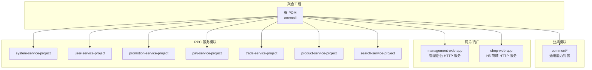
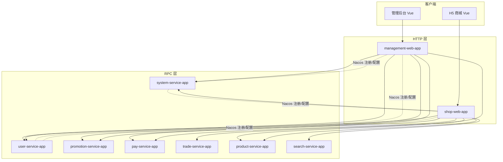
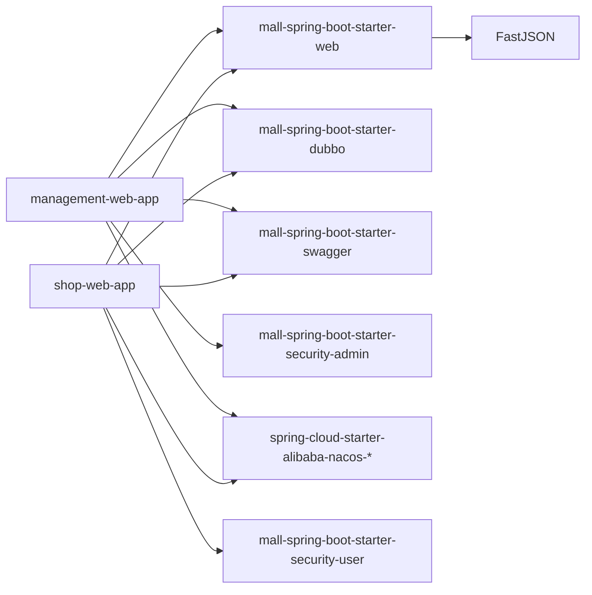

# 发展规划

<cite>
**本文引用的文件**
- [README.md](file://README.md)
- [pom.xml](file://pom.xml)
- [management-web-app/pom.xml](file://management-web-app/pom.xml)
- [shop-web-app/pom.xml](file://shop-web-app/pom.xml)
- [common/mall-spring-boot-starter-web/pom.xml](file://common/mall-spring-boot-starter-web/pom.xml)
- [management-web-app/src/main/resources/application.yml](file://management-web-app/src/main/resources/application.yml)
- [shop-web-app/src/main/resources/application.yml](file://shop-web-app/src/main/resources/application.yml)
- [user-service-project/user-service-app/src/main/resources/application.yaml](file://user-service-project/user-service-app/src/main/resources/application.yaml)
- [system-service-project/system-service-app/src/main/resources/application.yaml](file://system-service-project/system-service-app/src/main/resources/application.yaml)
- [docs/guides/功能列表/功能列表-管理后台.md](file://docs/guides/功能列表/功能列表-管理后台.md)
- [docs/guides/功能列表/功能列表-H5 商城.md](file://docs/guides/功能列表/功能列表-H5 商城.md)
- [docs/setup/quick-start.md](file://docs/setup/quick-start.md)
</cite>

## 目录
1. [引言](#引言)
2. [项目结构](#项目结构)
3. [核心组件](#核心组件)
4. [架构总览](#架构总览)
5. [详细组件分析](#详细组件分析)
6. [依赖分析](#依赖分析)
7. [性能考虑](#性能考虑)
8. [故障排查指南](#故障排查指南)
9. [结论](#结论)
10. [附录](#附录)

## 引言
本文件面向 Onemall 项目的发展规划，围绕当前版本的优化升级与未来版本的演进方向展开，重点覆盖：
- 技术栈演进：Spring Cloud Alibaba 为中心的微服务技术选型、配置中心 Apollo、服务治理 Sentinel、网关 Soul 的引入计划
- 前端技术更新：管理后台从 React 重构到 Vue 的进展与后续工作
- 持续改进：性能优化、功能扩展、代码质量提升
- 贡献者指南：如何参与开发与协作

以上内容均基于仓库现有信息整理，确保可落地、可追踪。

## 项目结构
Onemall 采用多模块聚合工程组织，后端以“xxx-web-app + xxx-service-project”的双层结构划分，分别提供对外 HTTP API 与内部 RPC 服务；公共能力沉淀在 common 子模块，通过 starter 方式复用。

图表来源
- [pom.xml:16-28](file://pom.xml#L16-L28)
- [management-web-app/pom.xml:16-26](file://management-web-app/pom.xml#L16-L26)
- [shop-web-app/pom.xml:15-26](file://shop-web-app/pom.xml#L15-L26)

章节来源
- [pom.xml:16-28](file://pom.xml#L16-L28)
- [README.md:129-139](file://README.md#L129-L139)

## 核心组件
- 管理后台 HTTP 服务：提供管理员侧全部管理功能的 REST 接口，集成 Web、Swagger、Admin 安全、Dubbo 消费端与 Nacos 注册发现
- H5 商城 HTTP 服务：面向用户购物流程的 REST 接口，集成 Web、Swagger、User 安全、Dubbo 消费端与 Nacos 注册发现
- RPC 服务：按领域拆分的独立服务模块，统一通过 Dubbo 提供 RPC 能力，结合 Actuator 暴露监控端点
- 公共能力：mall-spring-boot-starter-web 等 starter 封装了 Web、RPC、工具等通用依赖，降低重复配置

章节来源
- [management-web-app/pom.xml:28-109](file://management-web-app/pom.xml#L28-L109)
- [shop-web-app/pom.xml:28-121](file://shop-web-app/pom.xml#L28-L121)
- [common/mall-spring-boot-starter-web/pom.xml:14-48](file://common/mall-spring-boot-starter-web/pom.xml#L14-L48)

## 架构总览
当前架构以 Spring Boot + Spring Cloud Alibaba + Dubbo 为核心，服务间通过 Nacos 注册与配置，HTTP 层由 Web 应用承载，RPC 层由各服务应用承载。监控方面，Actuator 暴露端点，便于 Prometheus/Grafana/SkyWalking 等接入。

图表来源
- [README.md:109-126](file://README.md#L109-L126)
- [management-web-app/pom.xml:82-89](file://management-web-app/pom.xml#L82-L92)
- [shop-web-app/pom.xml:94-104](file://shop-web-app/pom.xml#L94-L104)

## 详细组件分析

### 技术栈演进与引入计划
- Spring Cloud Alibaba 为中心：当前已引入 Nacos 作为注册与配置中心依赖，未来将以其为核心整合服务治理、配置与网关能力
- Apollo 配置中心：计划引入以集中化管理各环境配置，替代本地 application.yml，提升配置一致性与动态刷新能力
- Sentinel 服务保障：计划引入以实现流量控制、熔断降级、系统负载保护，增强服务稳定性
- Soul 网关：计划引入以替代现有 HTTP 层直接暴露，统一接入、鉴权、路由与灰度发布

章节来源
- [README.md:5-7](file://README.md#L5-L7)
- [README.md:163-167](file://README.md#L163-L167)
- [management-web-app/pom.xml:82-89](file://management-web-app/pom.xml#L82-L92)
- [shop-web-app/pom.xml:94-98](file://shop-web-app/pom.xml#L94-L98)

### 前端技术更新计划：管理后台从 React 到 Vue
- 进展现状：README 明确“将管理后台从 React 重构到 Vue 框架”，并列出前端模块名称与端口
- 前端模块：管理后台 Vue 与 H5 Vue 均已在 README 中明确列出，便于前后端分离协同开发
- 建议：在引入 Vue 生态工具链（如 Vite/Vue CLI）、组件库（Vant）与状态管理（Pinia）的同时，保持与后端接口契约稳定

章节来源
- [README.md:32](file://README.md#L32)
- [README.md:109-112](file://README.md#L109-L112)

### 当前版本优化升级计划
- 微服务分层优化：合并部分服务，简化整体复杂度，提升运维与开发效率
- 技术栈统一：以 Spring Cloud Alibaba 为中心，逐步替换或补充中间件能力
- 配置与治理：引入 Apollo 与 Sentinel，完善配置中心与服务治理能力
- 网关演进：引入 Soul 网关，统一接入与路由策略

章节来源
- [README.md:5-7](file://README.md#L5-L7)
- [README.md:163-167](file://README.md#L163-L167)

### 未来版本开发计划
- 配置中心：Apollo 替代本地配置，支持动态刷新与灰度配置
- 服务治理：Sentinel 实现限流、熔断与系统自适应保护
- 网关：Soul 提供统一入口、鉴权、路由与可观测性
- 前端：管理后台 Vue 重构完成，持续完善 UI/UX 与交互细节
- 监控：完善 Prometheus/Grafana/SkyWalking 的指标采集与告警联动

章节来源
- [README.md:163-167](file://README.md#L163-L167)
- [README.md:185-199](file://README.md#L185-L199)

### 性能优化与功能扩展
- 性能优化：结合 Actuator 指标、Prometheus 抓取与 Grafana 展示，定位热点与瓶颈；引入缓存与异步消息处理（RocketMQ）优化响应时间
- 功能扩展：依据功能列表逐步补齐营销、分销、数据分析等功能模块，完善用户生命周期管理

章节来源
- [README.md:185-199](file://README.md#L185-L199)
- [docs/guides/功能列表/功能列表-管理后台.md:1-61](file://docs/guides/功能列表/功能列表-管理后台.md#L1-L61)
- [docs/guides/功能列表/功能列表-H5 商城.md:1-35](file://docs/guides/功能列表/功能列表-H5 商城.md#L1-L35)

### 代码质量提升
- 规范与工具：统一 Lombok、MapStruct 等工具链，减少样板代码；完善 Swagger 文档与错误码体系
- 测试与集成：完善集成测试与单元测试，保证变更质量

章节来源
- [pom.xml:31-37](file://pom.xml#L31-L37)
- [management-web-app/pom.xml:94-107](file://management-web-app/pom.xml#L94-L107)
- [shop-web-app/pom.xml:106-119](file://shop-web-app/pom.xml#L106-L119)

### 贡献者参与指南
- 快速开始：参考快速搭建指南，完成数据库、Zookeeper、RocketMQ、Elasticsearch 等中间件安装与配置
- 启动顺序：按 System → User → Product → Pay → Promotion → Trade → Search 的顺序启动服务
- 前端启动：分别启动 H5 与管理后台前端项目，访问本地端口进行联调
- 功能认领：根据功能列表选择任务，优先完成“待认领”与“开发中”任务

章节来源
- [docs/setup/quick-start.md:1-191](file://docs/setup/quick-start.md#L1-L191)
- [docs/guides/功能列表/功能列表-管理后台.md:1-61](file://docs/guides/功能列表/功能列表-管理后台.md#L1-L61)
- [docs/guides/功能列表/功能列表-H5 商城.md:1-35](file://docs/guides/功能列表/功能列表-H5 商城.md#L1-L35)

## 依赖分析
- HTTP 层依赖：Web、Swagger、Admin/User 安全、Dubbo 消费端、Nacos 注册与配置、Actuator 监控
- RPC 层依赖：MyBatis-Plus、Dubbo 提供端、Actuator 监控
- 公共依赖：starter 封装 Web、RPC、FastJSON 等，降低重复配置

图表来源
- [management-web-app/pom.xml:28-109](file://management-web-app/pom.xml#L28-L109)
- [shop-web-app/pom.xml:28-121](file://shop-web-app/pom.xml#L28-L121)
- [common/mall-spring-boot-starter-web/pom.xml:14-48](file://common/mall-spring-boot-starter-web/pom.xml#L14-L48)

章节来源
- [management-web-app/pom.xml:28-109](file://management-web-app/pom.xml#L28-L109)
- [shop-web-app/pom.xml:28-121](file://shop-web-app/pom.xml#L28-L121)
- [common/mall-spring-boot-starter-web/pom.xml:14-48](file://common/mall-spring-boot-starter-web/pom.xml#L14-L48)

## 性能考虑
- 指标采集：Actuator 暴露端点，Prometheus 抓取，Grafana 可视化
- 服务治理：引入 Sentinel 实现限流与熔断，保障高峰期稳定性
- 缓存与消息：结合 Redis 与 RocketMQ，优化热点读写与异步解耦
- 监控体系：SkyWalking 追踪、ELK 日志、Prometheus 指标三位一体

章节来源
- [README.md:185-199](file://README.md#L185-L199)

## 故障排查指南
- 启动顺序：严格遵循 System → User → Product → Pay → Promotion → Trade → Search 的顺序
- 配置检查：确认数据库、Zookeeper、RocketMQ、Elasticsearch 的连接配置正确
- 端口冲突：HTTP 层与 Actuator 端口需避免冲突，必要时调整 application.yml 中的端口
- 日志与监控：通过 Actuator 端点与 Grafana/SkyWalking 观察服务健康与性能指标

章节来源
- [docs/setup/quick-start.md:150-167](file://docs/setup/quick-start.md#L150-L167)
- [management-web-app/src/main/resources/application.yml:80-83](file://management-web-app/src/main/resources/application.yml#L80-L83)
- [shop-web-app/src/main/resources/application.yml:72-76](file://shop-web-app/src/main/resources/application.yml#L72-L76)
- [user-service-project/user-service-app/src/main/resources/application.yaml:48-53](file://user-service-project/user-service-app/src/main/resources/application.yaml#L48-L53)
- [system-service-project/system-service-app/src/main/resources/application.yaml:62-67](file://system-service-project/system-service-app/src/main/resources/application.yaml#L62-L67)

## 结论
Onemall 的发展规划以“Spring Cloud Alibaba 为中心”，围绕配置中心 Apollo、服务治理 Sentinel、网关 Soul 的引入，持续优化微服务架构与性能表现；前端层面推进管理后台 Vue 重构，完善功能列表与用户体验。通过规范化的贡献流程与完善的监控体系，项目将持续迭代、稳健发展。

## 附录
- 功能列表（管理后台）：用于认领与跟踪开发进度
- 功能列表（H5 商城）：用于用户侧功能完善与验收
- 快速开始：提供环境搭建与启动指引

章节来源
- [docs/guides/功能列表/功能列表-管理后台.md:1-61](file://docs/guides/功能列表/功能列表-管理后台.md#L1-L61)
- [docs/guides/功能列表/功能列表-H5 商城.md:1-35](file://docs/guides/功能列表/功能列表-H5 商城.md#L1-L35)
- [docs/setup/quick-start.md:1-191](file://docs/setup/quick-start.md#L1-L191)