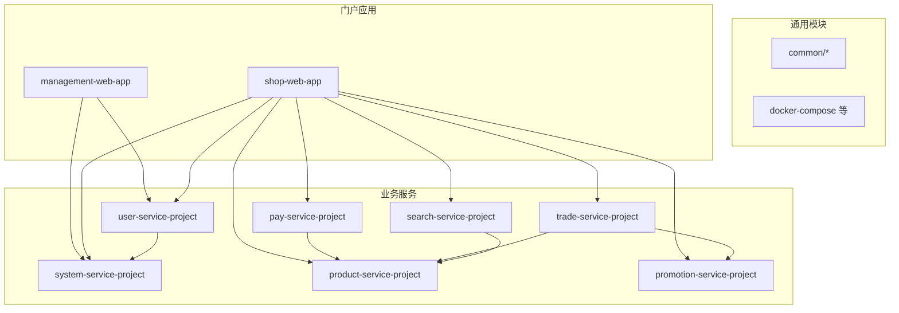
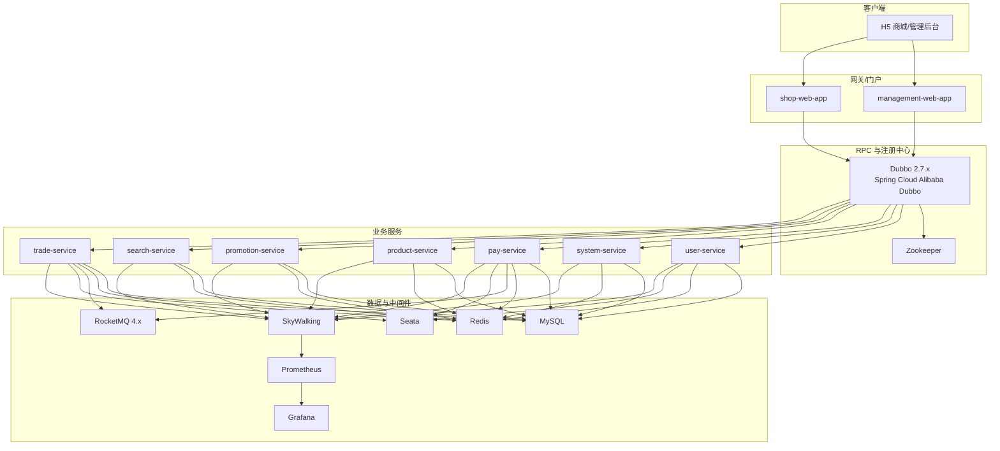
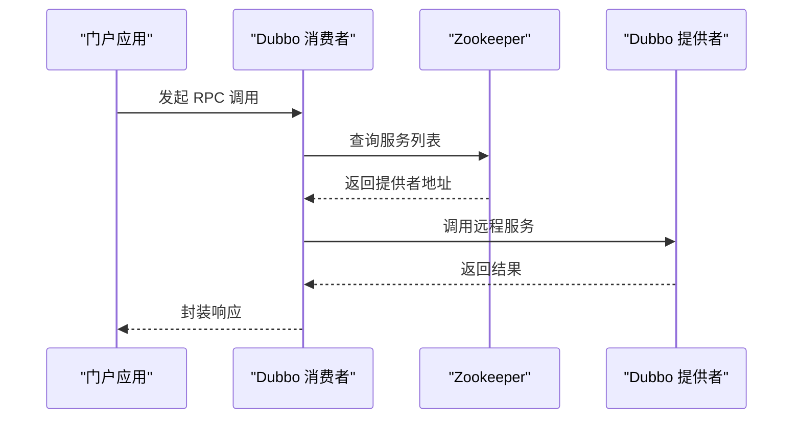
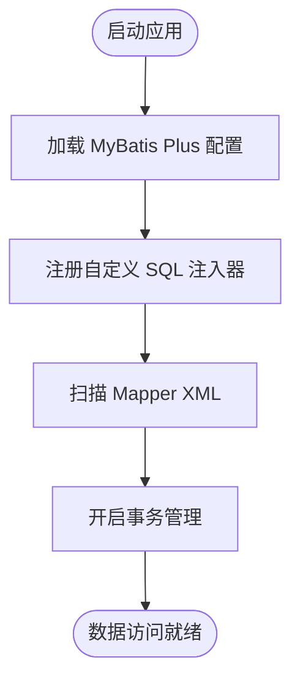
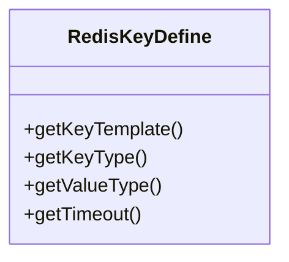
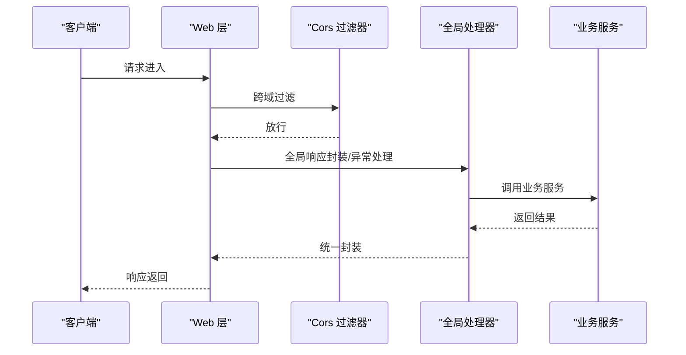
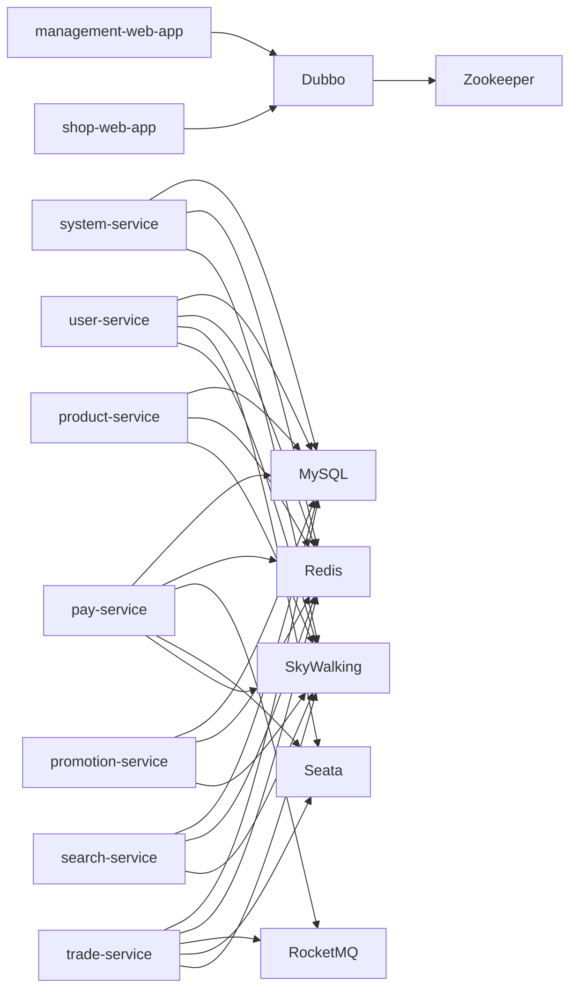

# 技术栈

<cite>
**本文引用的文件**
- [pom.xml](file://pom.xml)
- [README.md](file://docs/README.md)
- [application.yml（管理后台）](file://management-web-app/src/main/resources/application.yml)
- [application.yml（H5 商城）](file://shop-web-app/src/main/resources/application.yml)
- [application.yaml（用户服务）](file://user-service-project/user-service-app/src/main/resources/application.yaml)
- [application.yaml（系统服务）](file://system-service-project/system-service-app/src/main/resources/application.yaml)
- [application.yaml（支付服务）](file://pay-service-project/pay-service-app/src/main/resources/application.yaml)
- [ManagementWebApplication.java](file://management-web-app/src/main/java/cn/iocoder/mall/managementweb/ManagementWebApplication.java)
- [UserServiceApplication.java](file://user-service-project/user-service-app/src/main/java/cn/iocoder/mall/userservice/UserServiceApplication.java)
- [SystemServiceApplication.java](file://system-service-project/system-service-app/src/main/java/cn/iocoder/mall/systemservice/SystemServiceApplication.java)
- [PayServiceApplication.java](file://pay-service-project/pay-service-app/src/main/java/cn/iocoder/mall/payservice/PayServiceApplication.java)
- [DubboEnvironmentPostProcessor.java](file://common/mall-spring-boot-starter-dubbo/src/main/java/cn/iocoder/mall/dubbo/config/DubboEnvironmentPostProcessor.java)
- [MybatisPlusAutoConfiguration.java](file://common/mall-spring-boot-starter-mybatis/src/main/java/cn/iocoder/mall/mybatis/config/MybatisPlusAutoConfiguration.java)
- [RedisKeyDefine.java](file://common/mall-spring-boot-starter-redis/src/main/java/cn/iocoder/mall/redis/core/RedisKeyDefine.java)
- [CommonWebAutoConfiguration.java](file://common/mall-spring-boot-starter-web/src/main/java/cn/iocoder/mall/web/config/CommonWebAutoConfiguration.java)
</cite>

## 目录
1. [引言](#引言)
2. [项目结构](#项目结构)
3. [核心组件](#核心组件)
4. [架构总览](#架构总览)
5. [详细组件分析](#详细组件分析)
6. [依赖关系分析](#依赖关系分析)
7. [性能考量](#性能考量)
8. [故障排查指南](#故障排查指南)
9. [结论](#结论)
10. [附录](#附录)

## 引言
本技术栈文档面向 Onemall 微服务项目，系统性介绍后端、前端与监控技术栈，阐明各组件在微服务架构中的职责与优势，并给出学习路径与最佳实践建议。Onemall 采用 Spring Boot 2.2.4 作为统一框架，结合 Dubbo 2.7.x 生态（含 Spring Cloud Alibaba Dubbo 适配）、MyBatis Plus、Redis、RocketMQ 4.x、Seata（事务协调）、Zookeeper（注册与配置中心）以及 SkyWalking、Prometheus、Grafana 等监控体系，构建高可用、可扩展的电商中台能力。

## 项目结构
Onemall 以 Maven 多模块组织，包含通用模块（common）与多个业务服务模块（user、system、pay、product、promotion、search、trade），以及两个网关/门户应用（management-web、shop-web）。整体采用“多模块 + 微服务 + RPC + 消息队列 + 分布式事务”的架构。

图示来源
- [pom.xml:16-28](file://pom.xml#L16-L28)

章节来源
- [pom.xml:16-28](file://pom.xml#L16-L28)

## 核心组件
- 后端技术栈
  - Spring Boot 2.2.4：统一应用入口、自动装配与 Actuator 监控端点暴露。
  - Spring Cloud Alibaba Dubbo：基于注解的 RPC 调用，支持消费者/提供者配置与路由标签。
  - MyBatis Plus：增强 ORM 能力，简化 CRUD 与分页查询，支持逻辑删除与驼峰映射。
  - Redis：缓存与分布式锁，提供 Key 模板化与过期策略管理。
  - RocketMQ 4.x：异步消息处理，支持生产者组与 NameServer 地址配置。
  - Seata：分布式事务协调，保障跨服务一致性（需在运行环境中部署 TC 并配置）。
  - Zookeeper：服务注册与配置中心（需在运行环境中部署并配置）。
- 前端技术栈
  - Vue.js 2.5.17：渐进式前端框架，组件化开发与响应式数据绑定。
  - Vant UI 组件库：移动端常用 UI 组件，提升开发效率与交互体验。
- 监控技术栈
  - SkyWalking：APM 与链路追踪，采集 JVM 指标与调用链信息。
  - Prometheus：指标采集与存储，支持灵活查询与告警。
  - Grafana：可视化面板，展示 Prometheus 等数据源指标。

章节来源
- [application.yml（管理后台）:19-71](file://management-web-app/src/main/resources/application.yml#L19-L71)
- [application.yml（H5 商城）:19-64](file://shop-web-app/src/main/resources/application.yml#L19-L64)
- [application.yaml（用户服务）:21-47](file://user-service-project/user-service-app/src/main/resources/application.yaml#L21-L47)
- [application.yaml（系统服务）:22-61](file://system-service-project/system-service-app/src/main/resources/application.yaml#L22-L61)
- [application.yaml（支付服务）:47-52](file://pay-service-project/pay-service-app/src/main/resources/application.yaml#L47-L52)

## 架构总览
Onemall 采用“网关/门户 + 多个业务服务 + 中间件”的分层架构。门户应用通过 Dubbo RPC 调用各业务服务；业务服务内部使用 MyBatis Plus 访问 MySQL，使用 Redis 缓存热点数据；跨服务写操作通过 RocketMQ 异步解耦；分布式事务由 Seata 协调；Zookeeper 提供注册与配置中心能力；SkyWalking/Prometheus/Grafana 实现全链路可观测性。

图示来源
- [application.yml（管理后台）:19-71](file://management-web-app/src/main/resources/application.yml#L19-L71)
- [application.yml（H5 商城）:19-64](file://shop-web-app/src/main/resources/application.yml#L19-L64)
- [application.yaml（用户服务）:21-47](file://user-service-project/user-service-app/src/main/resources/application.yaml#L21-L47)
- [application.yaml（系统服务）:22-61](file://system-service-project/system-service-app/src/main/resources/application.yaml#L22-L61)
- [application.yaml（支付服务）:47-52](file://pay-service-project/pay-service-app/src/main/resources/application.yaml#L47-L52)

## 详细组件分析

### Spring Boot 应用与 Actuator 监控
- 各服务均通过 Spring Boot 启动类引导，独立暴露 Actuator 监控端点，便于运维与健康检查。
- 管理后台与 H5 商城同样启用 Actuator，分别在独立端口暴露监控端点。

章节来源
- [ManagementWebApplication.java:6-13](file://management-web-app/src/main/java/cn/iocoder/mall/managementweb/ManagementWebApplication.java#L6-L13)
- [UserServiceApplication.java:6-13](file://user-service-project/user-service-app/src/main/java/cn/iocoder/mall/userservice/UserServiceApplication.java#L6-L13)
- [SystemServiceApplication.java:6-13](file://system-service-project/system-service-app/src/main/java/cn/iocoder/mall/systemservice/SystemServiceApplication.java#L6-L13)
- [PayServiceApplication.java:6-13](file://pay-service-project/pay-service-app/src/main/java/cn/iocoder/mall/payservice/PayServiceApplication.java#L6-L13)
- [application.yml（管理后台）:80-83](file://management-web-app/src/main/resources/application.yml#L80-L83)
- [application.yml（H5 商城）:72-76](file://shop-web-app/src/main/resources/application.yml#L72-L76)
- [application.yaml（用户服务）:48-53](file://user-service-project/user-service-app/src/main/resources/application.yaml#L48-L53)
- [application.yaml（系统服务）:62-67](file://system-service-project/system-service-app/src/main/resources/application.yaml#L62-L67)
- [application.yaml（支付服务）:53-58](file://pay-service-project/pay-service-app/src/main/resources/application.yaml#L53-L58)

### Dubbo 2.7.x 与 Spring Cloud Alibaba Dubbo
- 消费者侧通过 application.yml 配置订阅服务、超时与参数校验；提供者侧通过 application.yaml 配置协议、扫描包与服务版本。
- 通用 Starter 提供 Dubbo 环境后置处理器，自动生成路由标签，便于本地开发环境下的服务路由与灰度发布。

图示来源
- [application.yml（管理后台）:19-71](file://management-web-app/src/main/resources/application.yml#L19-L71)
- [application.yml（H5 商城）:19-64](file://shop-web-app/src/main/resources/application.yml#L19-L64)
- [application.yaml（用户服务）:21-47](file://user-service-project/user-service-app/src/main/resources/application.yaml#L21-L47)
- [application.yaml（系统服务）:22-61](file://system-service-project/system-service-app/src/main/resources/application.yaml#L22-L61)
- [DubboEnvironmentPostProcessor.java:34-45](file://common/mall-spring-boot-starter-dubbo/src/main/java/cn/iocoder/mall/dubbo/config/DubboEnvironmentPostProcessor.java#L34-L45)

章节来源
- [DubboEnvironmentPostProcessor.java:16-67](file://common/mall-spring-boot-starter-dubbo/src/main/java/cn/iocoder/mall/dubbo/config/DubboEnvironmentPostProcessor.java#L16-L67)

### MyBatis Plus
- 在各服务 application.yaml 中开启驼峰映射、逻辑删除与 Mapper XML 加载，统一数据访问层规范。
- 通用 Starter 注入自定义 SQL 注入器，扩展复杂 SQL 能力。

图示来源
- [application.yaml（用户服务）:9-20](file://user-service-project/user-service-app/src/main/resources/application.yaml#L9-L20)
- [application.yaml（系统服务）:10-21](file://system-service-project/system-service-app/src/main/resources/application.yaml#L10-L21)
- [application.yaml（支付服务）:9-20](file://pay-service-project/pay-service-app/src/main/resources/application.yaml#L9-L20)
- [MybatisPlusAutoConfiguration.java:12-23](file://common/mall-spring-boot-starter-mybatis/src/main/java/cn/iocoder/mall/mybatis/config/MybatisPlusAutoConfiguration.java#L12-L23)

章节来源
- [MybatisPlusAutoConfiguration.java:12-23](file://common/mall-spring-boot-starter-mybatis/src/main/java/cn/iocoder/mall/mybatis/config/MybatisPlusAutoConfiguration.java#L12-L23)

### Redis 缓存与分布式锁
- 通过 RedisKeyDefine 定义 Key 模板、类型与过期时间，统一缓存命名与生命周期管理。
- 支持多种数据结构（字符串、列表、哈希、集合、有序集、流、发布订阅），满足不同场景。

图示来源
- [RedisKeyDefine.java:8-72](file://common/mall-spring-boot-starter-redis/src/main/java/cn/iocoder/mall/redis/core/RedisKeyDefine.java#L8-L72)

章节来源
- [RedisKeyDefine.java:8-72](file://common/mall-spring-boot-starter-redis/src/main/java/cn/iocoder/mall/redis/core/RedisKeyDefine.java#L8-L72)

### RocketMQ 4.x 消息队列
- 在支付服务 application.yaml 中配置 NameServer 地址与生产者组，用于异步解耦与削峰填谷。
- 建议在业务流程中使用可靠消息投递，结合消费幂等与重试策略。

章节来源
- [application.yaml（支付服务）:47-52](file://pay-service-project/pay-service-app/src/main/resources/application.yaml#L47-L52)

### Seata 分布式事务
- 项目中涉及跨服务写操作（如交易与支付），建议引入 Seata TC 与 AT 模式，确保最终一致性。
- 需要在运行环境中部署 Seata Server 并在服务中配置事务组与数据源代理。

[本节为概念性说明，不直接分析具体文件，故无章节来源]

### Web 层与全局处理
- 通用 Web Starter 提供全局响应封装、异常处理、跨域过滤与 FastJSON 消息转换器。
- 可按需启用访问日志拦截器，记录请求与响应信息。

图示来源
- [CommonWebAutoConfiguration.java:36-94](file://common/mall-spring-boot-starter-web/src/main/java/cn/iocoder/mall/web/config/CommonWebAutoConfiguration.java#L36-L94)

章节来源
- [CommonWebAutoConfiguration.java:28-96](file://common/mall-spring-boot-starter-web/src/main/java/cn/iocoder/mall/web/config/CommonWebAutoConfiguration.java#L28-L96)

### 监控体系（SkyWalking、Prometheus、Grafana）
- SkyWalking：采集 JVM 指标与链路追踪，建议在服务启动时配置 agent 与探针。
- Prometheus：抓取 Actuator 指标，结合服务端口暴露策略进行采集。
- Grafana：配置数据源与仪表盘，展示关键业务与系统指标。

章节来源
- [application.yml（管理后台）:80-83](file://management-web-app/src/main/resources/application.yml#L80-L83)
- [application.yml（H5 商城）:72-76](file://shop-web-app/src/main/resources/application.yml#L72-L76)
- [application.yaml（用户服务）:48-53](file://user-service-project/user-service-app/src/main/resources/application.yaml#L48-L53)
- [application.yaml（系统服务）:62-67](file://system-service-project/system-service-app/src/main/resources/application.yaml#L62-L67)
- [application.yaml（支付服务）:53-58](file://pay-service-project/pay-service-app/src/main/resources/application.yaml#L53-L58)

## 依赖关系分析
- 模块依赖：门户应用依赖业务服务；业务服务之间通过 Dubbo RPC 调用；数据访问统一走 MyBatis Plus；缓存统一走 Redis；跨服务写操作通过 RocketMQ 异步处理；分布式事务由 Seata 协调。
- 配置与注册：Dubbo 通过 Zookeeper 进行服务注册与发现；Actuator 暴露监控端点；SkyWalking 采集链路信息。

图示来源
- [pom.xml:16-28](file://pom.xml#L16-L28)
- [application.yml（管理后台）:19-71](file://management-web-app/src/main/resources/application.yml#L19-L71)
- [application.yml（H5 商城）:19-64](file://shop-web-app/src/main/resources/application.yml#L19-L64)
- [application.yaml（用户服务）:21-47](file://user-service-project/user-service-app/src/main/resources/application.yaml#L21-L47)
- [application.yaml（系统服务）:22-61](file://system-service-project/system-service-app/src/main/resources/application.yaml#L22-L61)
- [application.yaml（支付服务）:47-52](file://pay-service-project/pay-service-app/src/main/resources/application.yaml#L47-L52)

## 性能考量
- RPC 调用：合理设置超时与重试策略，避免级联故障；对热点接口进行缓存降压。
- 数据访问：利用 MyBatis Plus 分页与逻辑删除，减少全表扫描；索引设计与慢查询优化。
- 缓存策略：区分冷热数据，设置合理的过期时间与淘汰策略；使用分布式锁避免缓存击穿。
- 消息队列：控制消息堆积，设置死信队列与重试上限；保证消息幂等。
- 监控指标：关注 P95/P99 延迟、错误率、GC 与线程池状态，建立告警阈值。

[本节为通用性能建议，不直接分析具体文件，故无章节来源]

## 故障排查指南
- Dubbo 服务不可用：检查 Zookeeper 是否正常、服务是否正确注册、消费者订阅是否匹配。
- RPC 调用超时：调整超时时间、排查下游性能瓶颈、确认网络连通性。
- 缓存异常：核对 Key 模板与过期时间，检查 Redis 连接与内存使用。
- 消息积压：检查消费者处理速率、死信队列、消息幂等实现。
- 分布式事务：确认 Seata TC 正常、事务组配置正确、回滚日志清理策略。
- 监控缺失：确认 Actuator 端点暴露、Prometheus 抓取配置、Grafana 数据源连接。

章节来源
- [application.yml（管理后台）:80-83](file://management-web-app/src/main/resources/application.yml#L80-L83)
- [application.yml（H5 商城）:72-76](file://shop-web-app/src/main/resources/application.yml#L72-L76)
- [application.yaml（用户服务）:48-53](file://user-service-project/user-service-app/src/main/resources/application.yaml#L48-L53)
- [application.yaml（系统服务）:62-67](file://system-service-project/system-service-app/src/main/resources/application.yaml#L62-L67)
- [application.yaml（支付服务）:53-58](file://pay-service-project/pay-service-app/src/main/resources/application.yaml#L53-L58)

## 结论
Onemall 的技术栈围绕 Spring Boot 与 Dubbo 生态构建，结合 MyBatis Plus、Redis、RocketMQ、Seata 与 Zookeeper，形成完整的微服务体系。配合 SkyWalking、Prometheus、Grafana 的监控方案，能够支撑高并发与复杂业务场景。建议在实际落地中完善注册中心与配置中心部署、消息幂等与事务治理策略，并持续优化缓存与数据库性能。

[本节为总结性内容，不直接分析具体文件，故无章节来源]

## 附录
- 快速开始与安装指南请参考仓库文档目录。

章节来源
- [README.md:1-12](file://docs/README.md#L1-L12)