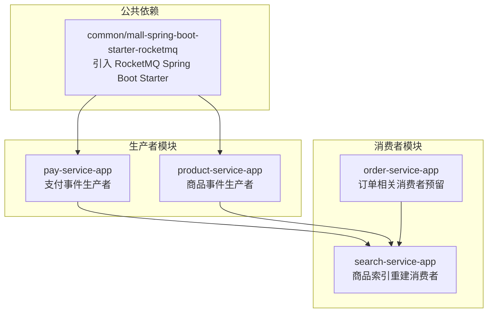
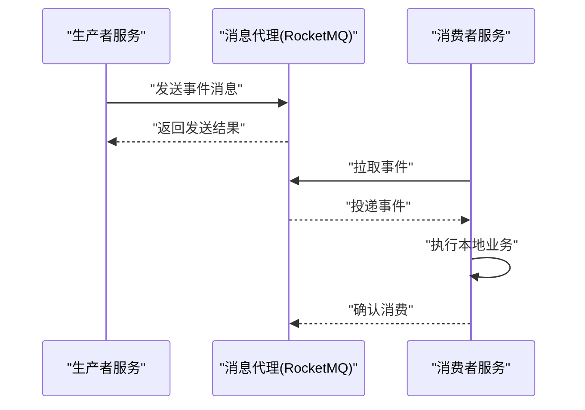
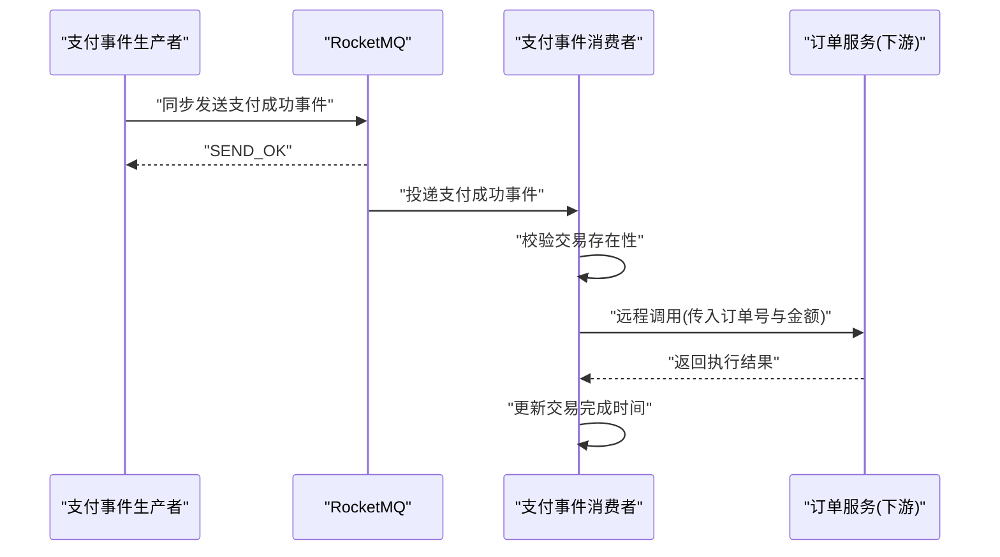
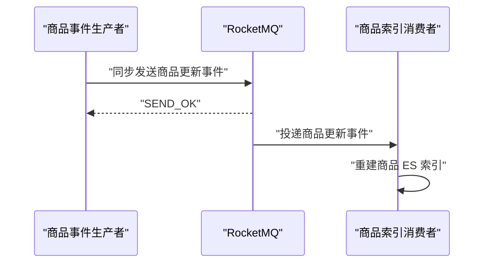
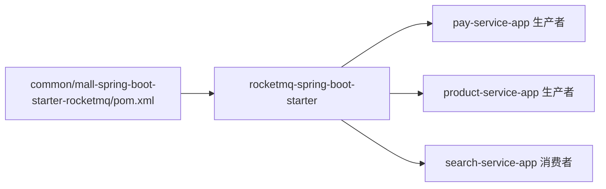

# 事件驱动架构

<cite>
**本文引用的文件**
- [common/mall-spring-boot-starter-rocketmq/pom.xml](file://common/mall-spring-boot-starter-rocketmq/pom.xml)
- [moved/order/order-biz-api/src/main/java/cn/iocoder/mall/order/biz/enums/order/MQConstants.java](file://moved/order/order-biz-api/src/main/java/cn/iocoder/mall/order/biz/enums/order/MQConstants.java)
- [moved/order/order-service-api02/src/main/java/cn/iocoder/mall/order/api/constant/MQConstants.java](file://moved/order/order-service-api02/src/main/java/cn/iocoder/mall/order/api/constant/MQConstants.java)
- [moved/product/product-service-api/src/main/java/cn/iocoder/mall/product/api/message/ProductSpuCollectionMessage.java](file://moved/product/product-service-api/src/main/java/cn/iocoder/mall/product/api/message/ProductSpuCollectionMessage.java)
- [pay-service-project/pay-service-app/src/main/java/cn/iocoder/mall/payservice/mq/producer/message/PayTransactionSuccessMessage.java](file://pay-service-project/pay-service-app/src/main/java/cn/iocoder/mall/payservice/mq/producer/message/PayTransactionSuccessMessage.java)
- [pay-service-project/pay-service-app/src/main/java/cn/iocoder/mall/payservice/mq/consumer/PayTransactionSuccessMQConsumer.java](file://pay-service-project/pay-service-app/src/main/java/cn/iocoder/mall/payservice/mq/consumer/PayTransactionSuccessMQConsumer.java)
- [pay-service-project/pay-service-app/src/main/java/cn/iocoder/mall/payservice/mq/producer/PayMQProducer.java](file://pay-service-project/pay-service-app/src/main/java/cn/iocoder/mall/payservice/mq/producer/PayMQProducer.java)
- [product-service-project/product-service-app/src/main/java/cn/iocoder/mall/productservice/mq/producer/ProductMQProducer.java](file://product-service-project/product-service-app/src/main/java/cn/iocoder/mall/productservice/mq/producer/ProductMQProducer.java)
- [search-service-project/search-service-app/src/main/java/cn/iocoder/mall/searchservice/mq/consumer/ProductUpdateConsumer.java](file://search-service-project/search-service-app/src/main/java/cn/iocoder/mall/searchservice/mq/consumer/ProductUpdateConsumer.java)
</cite>

## 目录
1. [简介](#简介)
2. [项目结构](#项目结构)
3. [核心组件](#核心组件)
4. [架构总览](#架构总览)
5. [详细组件分析](#详细组件分析)
6. [依赖分析](#依赖分析)
7. [性能考量](#性能考量)
8. [故障排查指南](#故障排查指南)
9. [结论](#结论)
10. [附录](#附录)

## 简介
本文件围绕 Onemall 项目的事件驱动架构展开，系统化阐述事件驱动的设计理念、消息队列选型（RocketMQ）、事件发布/订阅/消费机制、幂等性与重复消费规避策略、事件溯源模式的实现思路、异步解耦设计、事件流监控与追踪、一致性保障与错误处理策略，并结合具体业务场景（如订单创建后的库存更新、支付成功后的商品推荐）给出落地实践。

## 项目结构
Onemall 采用多模块微服务架构，事件驱动主要分布在以下模块：
- 消息中间件依赖：通过公共 Starter 引入 RocketMQ Spring Boot Starter。
- 生产者模块：支付服务、商品服务等负责生成领域事件并投递到 MQ。
- 消费者模块：搜索服务、订单服务等作为消费者接收事件并执行相应动作。
- 事件模型：定义在 API 层的消息类，承载事件数据与元信息。

图表来源
- [common/mall-spring-boot-starter-rocketmq/pom.xml:14-19](file://common/mall-spring-boot-starter-rocketmq/pom.xml#L14-L19)
- [pay-service-project/pay-service-app/src/main/java/cn/iocoder/mall/payservice/mq/producer/PayMQProducer.java:14-44](file://pay-service-project/pay-service-app/src/main/java/cn/iocoder/mall/payservice/mq/producer/PayMQProducer.java#L14-L44)
- [product-service-project/product-service-app/src/main/java/cn/iocoder/mall/productservice/mq/producer/ProductMQProducer.java:13-31](file://product-service-project/product-service-app/src/main/java/cn/iocoder/mall/productservice/mq/producer/ProductMQProducer.java#L13-L31)
- [search-service-project/search-service-app/src/main/java/cn/iocoder/mall/searchservice/mq/consumer/ProductUpdateConsumer.java:14-31](file://search-service-project/search-service-app/src/main/java/cn/iocoder/mall/searchservice/mq/consumer/ProductUpdateConsumer.java#L14-L31)

章节来源
- [common/mall-spring-boot-starter-rocketmq/pom.xml:14-19](file://common/mall-spring-boot-starter-rocketmq/pom.xml#L14-L19)

## 核心组件
- 消息常量与事件模型
  - 订单相关事件常量：定义了订单创建成功等事件主题标识。
  - 商品收藏事件模型：包含 SPU 编号、用户 ID、收藏类型等字段。
  - 支付交易成功事件模型：包含交易编号、应用订单编号等字段。
- 生产者
  - 支付事件生产者：封装同步发送逻辑，记录发送状态与异常日志。
  - 商品事件生产者：封装同步发送逻辑，触发商品索引重建。
- 消费者
  - 支付交易成功消费者：校验交易存在性后，远程调用下游服务完成业务动作，并更新本地事务完成时间。
  - 商品更新消费者：根据事件重建商品 ES 索引，确保搜索一致性。

章节来源
- [moved/order/order-biz-api/src/main/java/cn/iocoder/mall/order/biz/enums/order/MQConstants.java:9-16](file://moved/order/order-biz-api/src/main/java/cn/iocoder/mall/order/biz/enums/order/MQConstants.java#L9-L16)
- [moved/order/order-service-api02/src/main/java/cn/iocoder/mall/order/api/constant/MQConstants.java:9-16](file://moved/order/order-service-api02/src/main/java/cn/iocoder/mall/order/api/constant/MQConstants.java#L9-L16)
- [moved/product/product-service-api/src/main/java/cn/iocoder/mall/product/api/message/ProductSpuCollectionMessage.java:14-57](file://moved/product/product-service-api/src/main/java/cn/iocoder/mall/product/api/message/ProductSpuCollectionMessage.java#L14-L57)
- [pay-service-project/pay-service-app/src/main/java/cn/iocoder/mall/payservice/mq/producer/message/PayTransactionSuccessMessage.java:13-27](file://pay-service-project/pay-service-app/src/main/java/cn/iocoder/mall/payservice/mq/producer/message/PayTransactionSuccessMessage.java#L13-L27)
- [pay-service-project/pay-service-app/src/main/java/cn/iocoder/mall/payservice/mq/producer/PayMQProducer.java:14-44](file://pay-service-project/pay-service-app/src/main/java/cn/iocoder/mall/payservice/mq/producer/PayMQProducer.java#L14-L44)
- [product-service-project/product-service-app/src/main/java/cn/iocoder/mall/productservice/mq/producer/ProductMQProducer.java:13-31](file://product-service-project/product-service-app/src/main/java/cn/iocoder/mall/productservice/mq/producer/ProductMQProducer.java#L13-L31)
- [search-service-project/search-service-app/src/main/java/cn/iocoder/mall/searchservice/mq/consumer/ProductUpdateConsumer.java:14-31](file://search-service-project/search-service-app/src/main/java/cn/iocoder/mall/searchservice/mq/consumer/ProductUpdateConsumer.java#L14-L31)

## 架构总览
事件驱动架构以 RocketMQ 为核心，围绕“生产者-代理-消费者”的解耦链路构建。生产者在本地事务提交后发送事件；消费者按主题订阅并执行本地动作，实现跨服务的最终一致性。

图表来源
- [pay-service-project/pay-service-app/src/main/java/cn/iocoder/mall/payservice/mq/producer/PayMQProducer.java:14-44](file://pay-service-project/pay-service-app/src/main/java/cn/iocoder/mall/payservice/mq/producer/PayMQProducer.java#L14-L44)
- [search-service-project/search-service-app/src/main/java/cn/iocoder/mall/searchservice/mq/consumer/ProductUpdateConsumer.java:14-31](file://search-service-project/search-service-app/src/main/java/cn/iocoder/mall/searchservice/mq/consumer/ProductUpdateConsumer.java#L14-L31)

## 详细组件分析

### 支付事件生产与消费
- 生产侧
  - 使用 RocketMQTemplate 同步发送支付事件，对发送状态进行判断并记录异常日志。
- 消费侧
  - 通过注解声明监听主题与消费者组，先校验交易存在性，再远程调用下游服务完成业务动作，并更新本地事务完成时间。

图表来源
- [pay-service-project/pay-service-app/src/main/java/cn/iocoder/mall/payservice/mq/producer/PayMQProducer.java:20-40](file://pay-service-project/pay-service-app/src/main/java/cn/iocoder/mall/payservice/mq/producer/PayMQProducer.java#L20-L40)
- [pay-service-project/pay-service-app/src/main/java/cn/iocoder/mall/payservice/mq/consumer/PayTransactionSuccessMQConsumer.java:28-51](file://pay-service-project/pay-service-app/src/main/java/cn/iocoder/mall/payservice/mq/consumer/PayTransactionSuccessMQConsumer.java#L28-L51)

章节来源
- [pay-service-project/pay-service-app/src/main/java/cn/iocoder/mall/payservice/mq/producer/PayMQProducer.java:14-44](file://pay-service-project/pay-service-app/src/main/java/cn/iocoder/mall/payservice/mq/producer/PayMQProducer.java#L14-L44)
- [pay-service-project/pay-service-app/src/main/java/cn/iocoder/mall/payservice/mq/consumer/PayTransactionSuccessMQConsumer.java:17-54](file://pay-service-project/pay-service-app/src/main/java/cn/iocoder/mall/payservice/mq/consumer/PayTransactionSuccessMQConsumer.java#L17-L54)

### 商品事件生产与消费
- 生产侧
  - 商品服务在商品变更后，通过 RocketMQTemplate 同步发送商品更新事件。
- 消费侧
  - 搜索服务消费者监听事件，重建商品 ES 索引，保证搜索结果与数据一致。

图表来源
- [product-service-project/product-service-app/src/main/java/cn/iocoder/mall/productservice/mq/producer/ProductMQProducer.java:18-28](file://product-service-project/product-service-app/src/main/java/cn/iocoder/mall/productservice/mq/producer/ProductMQProducer.java#L18-L28)
- [search-service-project/search-service-app/src/main/java/cn/iocoder/mall/searchservice/mq/consumer/ProductUpdateConsumer.java:24-28](file://search-service-project/search-service-app/src/main/java/cn/iocoder/mall/searchservice/mq/consumer/ProductUpdateConsumer.java#L24-L28)

章节来源
- [product-service-project/product-service-app/src/main/java/cn/iocoder/mall/productservice/mq/producer/ProductMQProducer.java:13-31](file://product-service-project/product-service-app/src/main/java/cn/iocoder/mall/productservice/mq/producer/ProductMQProducer.java#L13-L31)
- [search-service-project/search-service-app/src/main/java/cn/iocoder/mall/searchservice/mq/consumer/ProductUpdateConsumer.java:14-31](file://search-service-project/search-service-app/src/main/java/cn/iocoder/mall/searchservice/mq/consumer/ProductUpdateConsumer.java#L14-L31)

### 订单事件常量与扩展建议
- 订单相关事件常量集中定义，便于统一管理与跨模块共享。
- 建议在订单创建成功后，由订单服务发布事件，库存服务与营销服务作为消费者订阅并执行各自动作，形成“订单-库存-营销”三者解耦。

章节来源
- [moved/order/order-biz-api/src/main/java/cn/iocoder/mall/order/biz/enums/order/MQConstants.java:9-16](file://moved/order/order-biz-api/src/main/java/cn/iocoder/mall/order/biz/enums/order/MQConstants.java#L9-L16)
- [moved/order/order-service-api02/src/main/java/cn/iocoder/mall/order/api/constant/MQConstants.java:9-16](file://moved/order/order-service-api02/src/main/java/cn/iocoder/mall/order/api/constant/MQConstants.java#L9-L16)

### 事件模型与数据结构
- 商品收藏事件模型包含 SPU 编号、用户 ID、SPU 名称、图片、卖点、价格、收藏类型等字段，用于支撑商品推荐、统计等场景。
- 支付交易成功事件模型包含交易编号与应用订单编号，便于下游服务按订单维度执行业务。

章节来源
- [moved/product/product-service-api/src/main/java/cn/iocoder/mall/product/api/message/ProductSpuCollectionMessage.java:14-57](file://moved/product/product-service-api/src/main/java/cn/iocoder/mall/product/api/message/ProductSpuCollectionMessage.java#L14-L57)
- [pay-service-project/pay-service-app/src/main/java/cn/iocoder/mall/payservice/mq/producer/message/PayTransactionSuccessMessage.java:13-27](file://pay-service-project/pay-service-app/src/main/java/cn/iocoder/mall/payservice/mq/producer/message/PayTransactionSuccessMessage.java#L13-L27)

## 依赖分析
- RocketMQ 依赖通过公共 Starter 引入，所有需要事件能力的服务只需依赖该 Starter，降低重复配置成本。
- 生产者与消费者均基于 RocketMQ Spring Boot Starter 提供的注解与模板类，简化开发与运维。

图表来源
- [common/mall-spring-boot-starter-rocketmq/pom.xml:14-19](file://common/mall-spring-boot-starter-rocketmq/pom.xml#L14-L19)

章节来源
- [common/mall-spring-boot-starter-rocketmq/pom.xml:14-19](file://common/mall-spring-boot-starter-rocketmq/pom.xml#L14-L19)

## 性能考量
- 同步发送阻塞本地线程，建议在高并发场景下评估批量发送与异步发送策略，同时保留必要的发送结果校验与重试。
- 消费端应合理设置消费者组与并发度，避免过度竞争导致延迟上升。
- 对于大字段事件（如商品详情），可考虑事件拆分或外部引用，减少消息体积。
- 消费端执行本地业务时，优先使用幂等设计，避免重复消费造成资源浪费。

## 故障排查指南
- 发送失败
  - 检查发送结果状态与异常日志，定位网络、Broker 或参数问题。
  - 关注发送超时与 Broker 写入异常，必要时增加重试与死信队列。
- 消费异常
  - 消费端需对空值、非法参数进行前置校验，失败时记录上下文并快速失败。
  - 对远程调用失败进行熔断与降级，避免级联故障。
- 幂等与重复消费
  - 基于事件 ID 或业务主键进行幂等校验，消费前查询是否已处理。
  - 对于可重试的业务动作，采用“去重表/布隆过滤器/Redis 集合”等手段降低重复概率。
- 监控与追踪
  - 结合消息轨迹与消费者日志，定位延迟与堆积点。
  - 在关键路径埋点，记录事件从生产到消费的耗时分布。

## 结论
Onemall 的事件驱动架构以 RocketMQ 为基础，通过生产者-消费者模式实现了跨服务的异步解耦。当前已在支付与商品两大场景中落地事件驱动，后续可在订单、库存、营销等模块继续扩展事件边界，完善幂等、重试、监控与追踪体系，逐步形成覆盖全链路的事件驱动平台。

## 附录

### 事件一致性与错误处理策略
- 最终一致性
  - 事件发布采用同步发送，确保消息落盘后再进入消费阶段，降低丢失风险。
  - 消费端执行本地业务，失败时记录并重试，必要时进入死信处理。
- 幂等性
  - 基于事件 ID 或业务主键进行幂等校验，避免重复消费。
  - 对于远程调用，建议在下游服务侧也做幂等控制。
- 重复消费规避
  - 使用唯一键去重，或在消费前检查处理状态。
  - 对于不可重试的业务，建议采用补偿机制与人工干预通道。

### 事件流监控与追踪
- 开启 RocketMQ 消息轨迹，定位消息从生产到消费的完整链路。
- 在生产者与消费者的关键节点埋点，采集发送耗时、消费耗时、重试次数等指标。
- 建立告警阈值：消息堆积、消费延迟、发送失败率、重试上限等。

### 具体业务场景实现
- 订单创建后的库存更新
  - 订单服务在本地事务提交后发布“订单创建成功”事件。
  - 库存服务作为消费者订阅该事件，执行扣减库存的本地事务。
- 支付成功后的商品推荐
  - 支付服务发布“支付交易成功”事件。
  - 推荐服务作为消费者订阅该事件，基于订单信息触发个性化推荐计算。