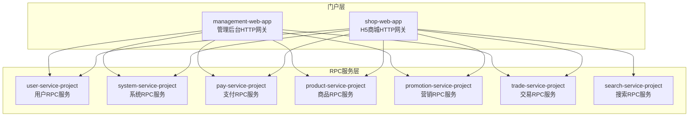
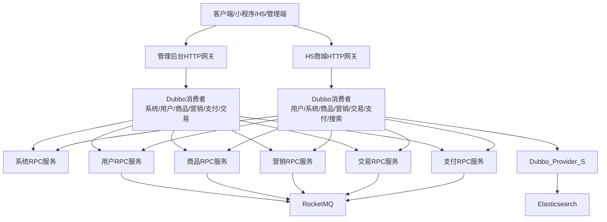
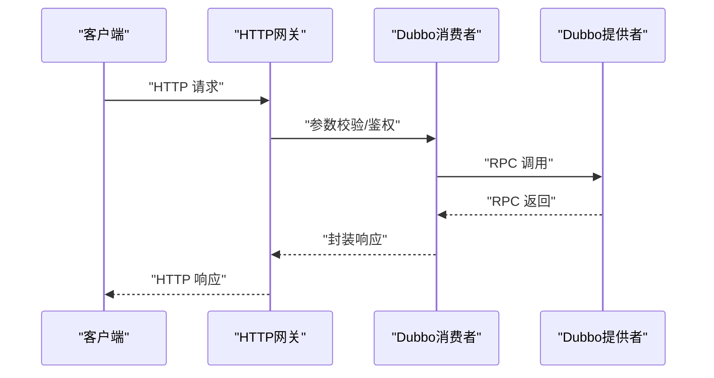
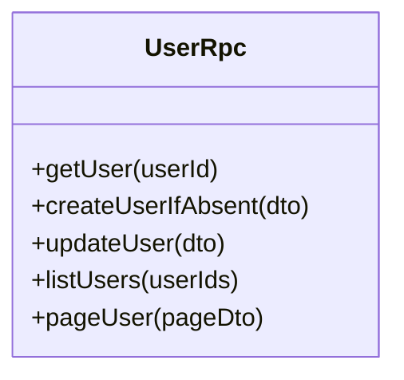
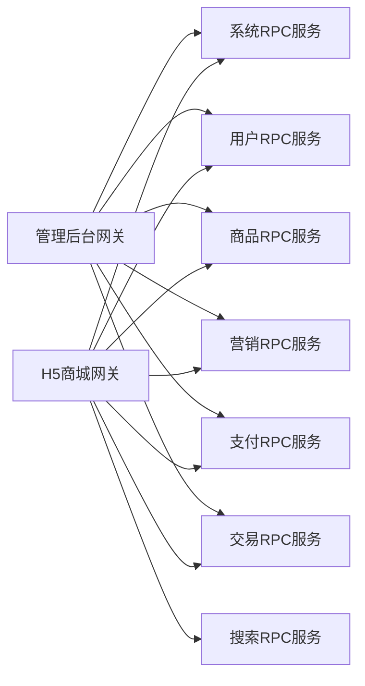

# 微服务架构设计

<cite>
**本文引用的文件**
- [README.md](file://README.md)
- [pom.xml](file://pom.xml)
- [application.yml（管理后台）](file://management-web-app/src/main/resources/application.yml)
- [application.yml（H5商城）](file://shop-web-app/src/main/resources/application.yml)
- [application.yaml（用户服务）](file://user-service-project/user-service-app/src/main/resources/application.yaml)
- [application.yaml（系统服务）](file://system-service-project/system-service-app/src/main/resources/application.yaml)
- [application.yaml（支付服务）](file://pay-service-project/pay-service-app/src/main/resources/application.yaml)
- [application.yaml（商品服务）](file://product-service-project/product-service-app/src/main/resources/application.yaml)
- [application.yaml（营销服务）](file://promotion-service-project/promotion-service-app/src/main/resources/application.yaml)
- [application.yaml（交易服务）](file://trade-service-project/trade-service-app/src/main/resources/application.yaml)
- [application.yaml（搜索服务）](file://search-service-project/search-service-app/src/main/resources/application.yaml)
- [UserRpc 接口](file://user-service-project/user-service-api/src/main/java/cn/iocoder/mall/userservice/rpc/user/UserRpc.java)
</cite>

## 目录
1. [引言](#引言)
2. [项目结构](#项目结构)
3. [核心组件](#核心组件)
4. [架构总览](#架构总览)
5. [详细组件分析](#详细组件分析)
6. [依赖分析](#依赖分析)
7. [性能考量](#性能考量)
8. [故障排查指南](#故障排查指南)
9. [结论](#结论)
10. [附录](#附录)

## 引言
本文件面向Onemall项目的微服务架构设计，围绕Spring Cloud Alibaba生态，给出服务拆分策略、服务边界、依赖关系与调用链路、服务注册与发现机制、横向扩展与弹性伸缩策略，以及服务治理最佳实践。目标是帮助架构师与工程团队在保持业务一致性的同时，实现高内聚、低耦合、可演进的微服务体系。

## 项目结构
Onemall采用多模块聚合的Maven工程组织方式，顶层pom声明了各子模块，形成“网关/门户 + RPC服务”的典型分层：
- 门户层：management-web-app（管理后台HTTP网关）、shop-web-app（H5商城HTTP网关）
- RPC服务层：user-service-project（用户）、system-service-project（系统）、pay-service-project（支付）、product-service-project（商品）、promotion-service-project（营销）、trade-service-project（交易）、search-service-project（搜索）

图表来源
- [pom.xml:16-27](file://pom.xml#L16-L27)
- [README.md:129-139](file://README.md#L129-L139)

章节来源
- [pom.xml:16-27](file://pom.xml#L16-L27)
- [README.md:107-126](file://README.md#L107-L126)

## 核心组件
- 门户网关（management-web-app、shop-web-app）
  - 提供HTTP REST API，负责路由、鉴权、参数校验、异常统一处理、Swagger文档暴露、Actuator监控端点。
  - Dubbo消费者侧配置了订阅的服务列表与超时、校验等参数。
- RPC服务（user、system、pay、product、promotion、trade、search）
  - 通过Dubbo提供RPC能力；部分服务引入RocketMQ进行异步解耦；部分服务引入Elasticsearch进行检索。
  - 各服务独立的application配置，包含数据库ORM、Dubbo协议扫描、Actuator端口等。

章节来源
- [application.yml（管理后台）:19-71](file://management-web-app/src/main/resources/application.yml#L19-L71)
- [application.yml（H5商城）:19-63](file://shop-web-app/src/main/resources/application.yml#L19-L63)
- [application.yaml（用户服务）:21-47](file://user-service-project/user-service-app/src/main/resources/application.yaml#L21-L47)
- [application.yaml（系统服务）:22-61](file://system-service-project/system-service-app/src/main/resources/application.yaml#L22-L61)
- [application.yaml（支付服务）:21-46](file://pay-service-project/pay-service-app/src/main/resources/application.yaml#L21-L46)
- [application.yaml（商品服务）:21-47](file://product-service-project/product-service-app/src/main/resources/application.yaml#L21-L47)
- [application.yaml（营销服务）:21-51](file://promotion-service-project/promotion-service-app/src/main/resources/application.yaml#L21-L51)
- [application.yaml（交易服务）:21-57](file://trade-service-project/trade-service-app/src/main/resources/application.yaml#L21-L57)
- [application.yaml（搜索服务）:19-49](file://search-service-project/search-service-app/src/main/resources/application.yaml#L19-L49)

## 架构总览
Onemall采用“HTTP网关 + Dubbo RPC + 中间件”的架构模式：
- HTTP网关：承接外部请求，进行鉴权与参数校验，随后通过Dubbo调用内部RPC服务。
- RPC服务：按业务域拆分，彼此通过RPC接口通信；部分服务通过消息队列异步解耦。
- 中间件：RocketMQ用于异步消息；Elasticsearch用于商品检索；数据库采用MySQL与MyBatis-Plus；服务注册与发现采用Zookeeper（当前配置）。

图表来源
- [application.yml（管理后台）:22-71](file://management-web-app/src/main/resources/application.yml#L22-L71)
- [application.yml（H5商城）:22-63](file://shop-web-app/src/main/resources/application.yml#L22-L63)
- [application.yaml（支付服务）:47-52](file://pay-service-project/pay-service-app/src/main/resources/application.yaml#L47-L52)
- [application.yaml（商品服务）:43-47](file://product-service-project/product-service-app/src/main/resources/application.yaml#L43-L47)
- [application.yaml（营销服务）:47-51](file://promotion-service-project/promotion-service-app/src/main/resources/application.yaml#L47-L51)
- [application.yaml（交易服务）:53-57](file://trade-service-project/trade-service-app/src/main/resources/application.yaml#L53-L57)
- [application.yaml（搜索服务）:47-50](file://search-service-project/search-service-app/src/main/resources/application.yaml#L47-L50)

## 详细组件分析

### 门户网关（HTTP层）
- 管理后台网关（management-web-app）
  - 端口与上下文路径：HTTP 18083，context-path为/management-api/
  - Dubbo消费者订阅系统、用户、商品、营销、支付、交易等RPC服务，设置统一超时与参数校验。
  - 暴露Actuator监控端点，独立端口避免泄露。
- H5商城网关（shop-web-app）
  - 端口与上下文路径：HTTP 18084，context-path为/shop-api/
  - Dubbo消费者订阅用户、系统、商品、营销、交易、支付、搜索等RPC服务，统一超时与参数校验。
  - 暴露Actuator监控端点，独立端口避免泄露。

图表来源
- [application.yml（管理后台）:19-71](file://management-web-app/src/main/resources/application.yml#L19-L71)
- [application.yml（H5商城）:19-63](file://shop-web-app/src/main/resources/application.yml#L19-L63)

章节来源
- [application.yml（管理后台）:1-83](file://management-web-app/src/main/resources/application.yml#L1-L83)
- [application.yml（H5商城）:1-76](file://shop-web-app/src/main/resources/application.yml#L1-L76)

### 用户服务（user-service）
- 角色定位：用户域核心服务，提供用户信息、地址、短信验证码等RPC接口。
- Dubbo提供者协议与扫描包：dubbo协议、扫描rpc包。
- 消费者侧依赖：系统服务（OAuth2等）、其他服务通过RPC调用其能力。
- 监控：独立Actuator端口，避免暴露Web端口。

图表来源
- [UserRpc 接口:12-54](file://user-service-project/user-service-api/src/main/java/cn/iocoder/mall/userservice/rpc/user/UserRpc.java#L12-L54)

章节来源
- [application.yaml（用户服务）:21-53](file://user-service-project/user-service-app/src/main/resources/application.yaml#L21-L53)
- [UserRpc 接口:1-55](file://user-service-project/user-service-api/src/main/java/cn/iocoder/mall/userservice/rpc/user/UserRpc.java#L1-L55)

### 系统服务（system-service）
- 角色定位：系统域核心服务，提供权限、字典、日志、错误码等通用能力。
- Dubbo提供者协议与扫描包：dubbo协议、扫描rpc包。
- 消费者侧依赖：错误码加载、日志记录等。
- 配置：错误码组与常量类绑定，便于全局错误码管理。

章节来源
- [application.yaml（系统服务）:22-79](file://system-service-project/system-service-app/src/main/resources/application.yaml#L22-L79)

### 商品服务（product-service）
- 角色定位：商品域核心服务，提供SPU、SKU、属性、品牌、分类等能力。
- 引入RocketMQ生产者：用于异步事件（如库存变更、价格更新）。
- 配置：错误码组与常量类绑定。

章节来源
- [application.yaml（商品服务）:21-61](file://product-service-project/product-service-app/src/main/resources/application.yaml#L21-L61)

### 营销服务（promotion-service）
- 角色定位：营销域核心服务，提供活动、优惠券、推荐等能力。
- 引入RocketMQ生产者：用于异步事件（如优惠券发放、活动状态变更）。
- 配置：错误码组与常量类绑定。

章节来源
- [application.yaml（营销服务）:21-65](file://promotion-service-project/promotion-service-app/src/main/resources/application.yaml#L21-L65)

### 支付服务（pay-service）
- 角色定位：支付域核心服务，提供交易、退款等能力。
- 引入RocketMQ生产者：用于异步通知与对账。
- 配置：错误码组与常量类绑定。

章节来源
- [application.yaml（支付服务）:21-65](file://pay-service-project/pay-service-app/src/main/resources/application.yaml#L21-L65)

### 交易服务（trade-service）
- 角色定位：交易域核心服务，负责下单、物流、售后等流程编排。
- 引入RocketMQ生产者：用于异步订单事件。
- 配置：错误码组与常量类绑定；业务配置包含支付相关参数。

章节来源
- [application.yaml（交易服务）:21-76](file://trade-service-project/trade-service-app/src/main/resources/application.yaml#L21-L76)

### 搜索服务（search-service）
- 角色定位：搜索域核心服务，提供商品检索能力。
- 引入Elasticsearch：集群节点与REST连接配置。
- 引入RocketMQ：用于索引同步等异步事件。

章节来源
- [application.yaml（搜索服务）:19-63](file://search-service-project/search-service-app/src/main/resources/application.yaml#L19-L63)

## 依赖分析
- 服务间依赖
  - 管理后台网关依赖系统、用户、商品、营销、支付、交易RPC服务。
  - H5商城网关依赖用户、系统、商品、营销、交易、支付、搜索RPC服务。
  - 各RPC服务之间通过Dubbo接口通信；部分服务通过RocketMQ异步解耦。
- 依赖关系可视化

图表来源
- [application.yml（管理后台）:22-71](file://management-web-app/src/main/resources/application.yml#L22-L71)
- [application.yml（H5商城）:22-63](file://shop-web-app/src/main/resources/application.yml#L22-L63)

章节来源
- [application.yml（管理后台）:22-71](file://management-web-app/src/main/resources/application.yml#L22-L71)
- [application.yml（H5商城）:22-63](file://shop-web-app/src/main/resources/application.yml#L22-L63)

## 性能考量
- RPC调用链路优化
  - 统一超时与参数校验，避免下游抖动放大。
  - 消费者侧明确订阅服务列表，减少无谓的注册发现压力。
- 异步解耦
  - 通过RocketMQ异步化非关键路径，降低RT与耦合度。
- 缓存与限流
  - 建议在HTTP网关或RPC服务层引入限流与缓存策略，结合Sentinel与Redisson（未来规划）。
- 监控与可观测性
  - Actuator端点暴露、Prometheus指标采集、SkyWalking链路追踪、Grafana看板，形成闭环。

## 故障排查指南
- 常见问题定位
  - 网关层：检查Dubbo消费者订阅与版本配置、超时与参数校验是否生效。
  - RPC层：检查dubbo协议端口、扫描包、provider/consumer版本号是否一致。
  - 中间件：确认RocketMQ NameServer与Elasticsearch节点连通性。
- 错误码与日志
  - 系统服务提供统一错误码加载；各服务配置错误码组与常量类，便于快速定位。
  - 启用系统访问日志与异常日志RPC接口，辅助问题复盘。

章节来源
- [application.yaml（系统服务）:68-79](file://system-service-project/system-service-app/src/main/resources/application.yaml#L68-L79)
- [application.yml（管理后台）:79-83](file://management-web-app/src/main/resources/application.yml#L79-L83)
- [application.yml（H5商城）:72-76](file://shop-web-app/src/main/resources/application.yml#L72-L76)

## 结论
Onemall基于Spring Cloud Alibaba实现了清晰的微服务分层与职责划分：HTTP网关负责对外交互，RPC服务按业务域拆分，中间件承担异步与检索能力。通过Dubbo提供稳定RPC通信，结合RocketMQ与Elasticsearch实现异步解耦与检索增强。建议后续引入Apollo配置中心、Sentinel服务治理与Soul网关，进一步完善服务治理与弹性伸缩能力。

## 附录
- 服务注册与发现
  - 当前配置采用Zookeeper作为注册中心；建议在生产环境评估Nacos作为替代方案，以获得更好的Spring Cloud Alibaba生态支持。
- 横向扩展与弹性伸缩
  - 各RPC服务独立部署，可通过容器化与Kubernetes实现水平扩容；结合限流、熔断与自动扩缩容策略提升弹性与稳定性。
- 服务治理最佳实践
  - 明确服务边界与契约（RPC接口），统一错误码与日志规范；启用灰度发布与蓝绿部署；持续完善监控与告警体系。