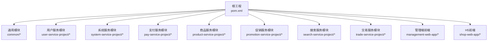
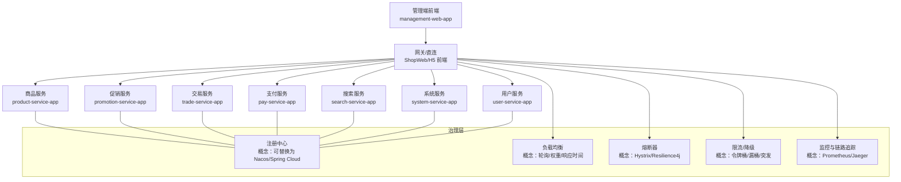
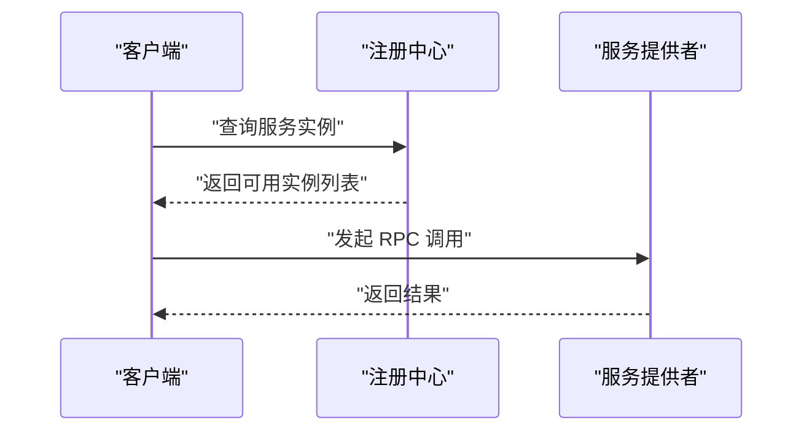
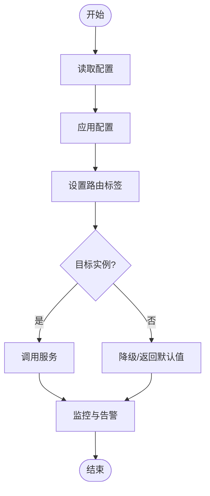
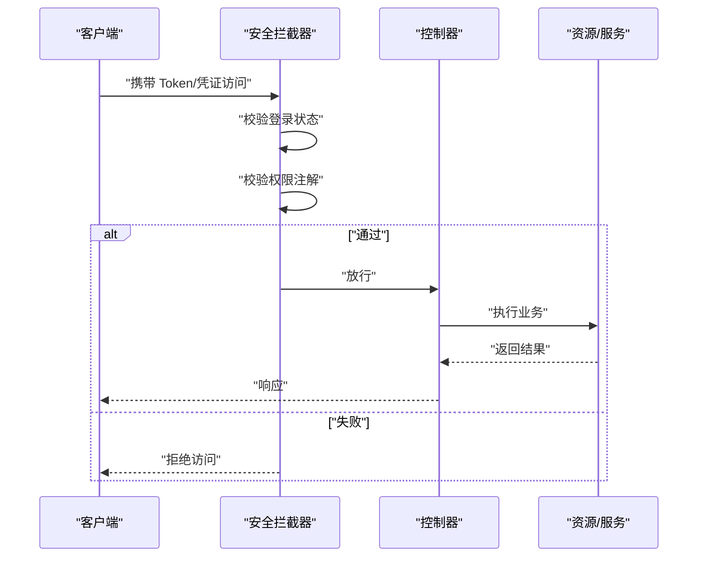
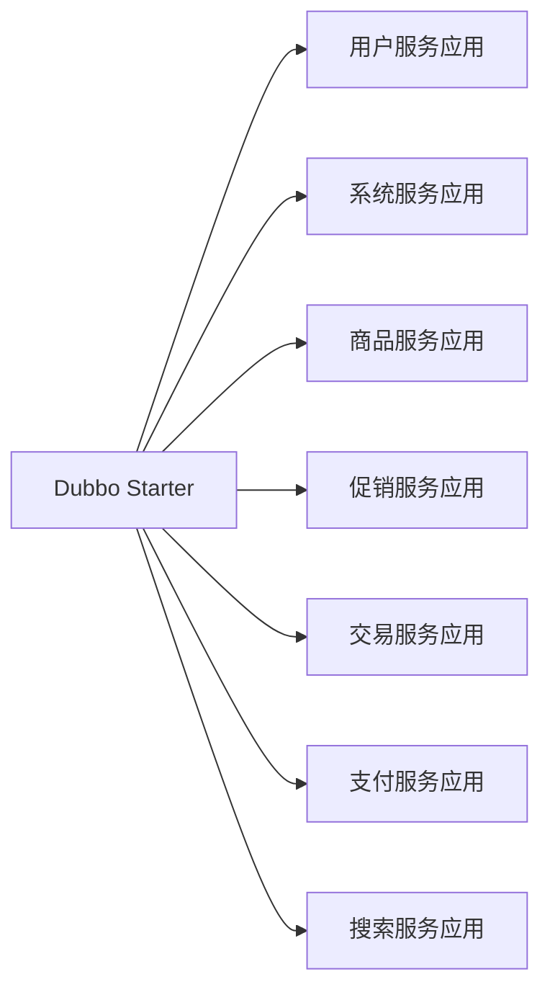

# 微服务治理

<cite>
**本文引用的文件**
- [pom.xml](file://pom.xml)
- [mall-spring-boot-starter-dubbo/pom.xml](file://common/mall-spring-boot-starter-dubbo/pom.xml)
- [DubboEnvironmentPostProcessor.java](file://common/mall-spring-boot-starter-dubbo/src/main/java/cn/iocoder/mall/dubbo/config/DubboEnvironmentPostProcessor.java)
- [DubboWebAutoConfiguration.java](file://common/mall-spring-boot-starter-dubbo/src/main/java/cn/iocoder/mall/dubbo/config/DubboWebAutoConfiguration.java)
- [application.yaml（支付服务）](file://pay-service-project/pay-service-app/src/main/resources/application.yaml)
- [application-dev.yaml（支付服务）](file://pay-service-project/pay-service-app/src/main/resources/application-dev.yaml)
- [application.yaml（商品服务）](file://product-service-project/product-service-app/src/main/resources/application.yaml)
- [application-dev.yaml（商品服务）](file://product-service-project/product-service-app/src/main/resources/application-dev.yaml)
- [application.yaml（促销服务）](file://promotion-service-project/promotion-service-app/src/main/resources/application.yaml)
- [application-dev.yaml（促销服务）](file://promotion-service-project/promotion-service-app/src/main/resources/application-dev.yaml)
- [application.yaml（交易服务）](file://trade-service-project/trade-service-app/src/main/resources/application.yaml)
- [application-dev.yaml（交易服务）](file://trade-service-project/trade-service-app/src/main/resources/application-dev.yaml)
- [application.yaml（用户服务）](file://user-service-project/user-service-app/src/main/resources/application.yaml)
- [application-dev.yaml（用户服务）](file://user-service-project/user-service-app/src/main/resources/application-dev.yaml)
- [application.yaml（系统服务）](file://system-service-project/system-service-app/src/main/resources/application.yaml)
- [application-dev.yaml（系统服务）](file://system-service-project/system-service-app/src/main/resources/application-dev.yaml)
- [application.yaml（搜索服务）](file://search-service-project/search-service-app/src/main/resources/application.yaml)
- [application-dev.yaml（搜索服务）](file://search-service-project/search-service-app/src/main/resources/application-dev.yaml)
- [application.yml（管理端前端）](file://management-web-app/src/main/resources/application.yml)
- [application.yml（H5前端）](file://shop-web-app/src/main/resources/application.yml)
- [AdminSecurityAutoConfiguration.java](file://common/mall-spring-boot-starter-security-admin/src/main/java/cn/iocoder/mall/security/admin/config/AdminSecurityAutoConfiguration.java)
- [UserSecurityAutoConfiguration.java](file://common/mall-spring-boot-starter-security-user/src/main/java/cn/iocoder/mall/security/user/config/UserSecurityAutoConfiguration.java)
- [RequiresAuthenticate.java](file://common/mall-security-annotations/src/main/java/cn/iocoder/security/annotations/RequiresAuthenticate.java)
- [RequiresPermissions.java](file://common/mall-security-annotations/src/main/java/cn/iocoder/security/annotations/RequiresPermissions.java)
- [RequiresNone.java](file://common/mall-security-annotations/src/main/java/cn/iocoder/security/annotations/RequiresNone.java)
</cite>

## 目录
1. [引言](#引言)
2. [项目结构](#项目结构)
3. [核心组件](#核心组件)
4. [架构总览](#架构总览)
5. [详细组件分析](#详细组件分析)
6. [依赖分析](#依赖分析)
7. [性能考虑](#性能考虑)
8. [故障排查指南](#故障排查指南)
9. [结论](#结论)
10. [附录](#附录)

## 引言
本文件面向 Onemall 微服务项目的治理实践，围绕服务注册与发现、负载均衡、熔断与限流、监控与链路追踪、配置管理与灰度发布、以及安全认证与授权等方面进行系统化梳理。当前代码库以 Apache Dubbo 作为 RPC 框架，并通过 Spring Boot 自动装配与 Starter 组织治理能力。由于仓库中未发现 Nacos 或 Spring Cloud Alibaba 的显式集成配置，本文在“服务注册与发现”部分采用概念性说明与现有 Dubbo 能力结合的方式呈现；在“熔断与限流”“监控与链路追踪”“灰度发布”等章节提供通用最佳实践与落地建议，便于后续按需扩展。

## 项目结构
Onemall 采用多模块聚合工程组织，包含通用基础模块与多个业务服务模块。核心模块如下：
- 通用模块：common 下的框架、工具、Starter 等
- 业务服务模块：user-service-project、system-service-project、pay-service-project、product-service-project、promotion-service-project、search-service-project、trade-service-project
- 前端应用：management-web-app（管理端）、shop-web-app（H5）

图表来源
- [pom.xml:16-28](file://pom.xml#L16-L28)

章节来源
- [pom.xml:16-28](file://pom.xml#L16-L28)

## 核心组件
- Dubbo 自动装配与环境后置处理器：负责生成 Dubbo 路由标签、注入拦截器，支撑服务路由与灰度能力
- 安全自动配置：分别为管理员与普通用户场景提供安全自动装配与注解支持
- 各业务服务的配置文件：集中体现服务端口、注册中心、日志与数据库等运行参数

章节来源
- [mall-spring-boot-starter-dubbo/pom.xml:35-38](file://common/mall-spring-boot-starter-dubbo/pom.xml#L35-L38)
- [DubboEnvironmentPostProcessor.java:34-45](file://common/mall-spring-boot-starter-dubbo/src/main/java/cn/iocoder/mall/dubbo/config/DubboEnvironmentPostProcessor.java#L34-L45)
- [DubboWebAutoConfiguration.java:20-29](file://common/mall-spring-boot-starter-dubbo/src/main/java/cn/iocoder/mall/dubbo/config/DubboWebAutoConfiguration.java#L20-L29)

## 架构总览
下图展示前端与后端服务之间的调用关系与治理要点（概念示意）：

## 详细组件分析

### 服务注册与发现（基于 Dubbo 的现状与扩展建议）
- 现状
  - 项目使用 Dubbo 作为 RPC 框架，并通过 Starter 引入其自动装配能力
  - 未发现 Nacos 或 Spring Cloud Alibaba 的显式依赖与配置
- 建议
  - 若采用 Nacos：引入 Spring Cloud Alibaba Dubbo Starter，配置 nacos-server 地址、命名空间、分组等
  - 若采用 Spring Cloud：引入 Spring Cloud Alibaba Nacos Discovery 与 OpenFeign，统一注册与调用
  - 保持 Dubbo 的路由标签能力与请求头透传，便于灰度与多版本并行

章节来源
- [mall-spring-boot-starter-dubbo/pom.xml:35-38](file://common/mall-spring-boot-starter-dubbo/pom.xml#L35-L38)

### 负载均衡策略（轮询、权重、响应时间）
- 轮询：默认策略，适合各实例性能相近的场景
- 权重：根据实例资源或容量设置不同权重，提升高配节点利用率
- 响应时间：优先选择响应时间短的实例，降低整体等待
- 实施建议
  - 在注册中心侧配置权重与健康检查
  - 结合服务端指标（CPU、内存、QPS）动态调整权重
  - 对热点接口单独配置更优的负载策略

### 熔断器模式（Hystrix/Resilience4j）
- 目标：保护下游服务，避免级联故障
- 关键参数
  - 快速失败阈值（请求数/错误率）
  - 熔断时长（打开到半开的窗口）
  - 半开允许试探的请求数
- 实施建议
  - 为关键路径开启熔断
  - 与降级策略联动，返回兜底数据或空结果
  - 配置实时告警，关注熔断触发频率

### 限流与降级设计
- 限流
  - 令牌桶：平滑突发，适合长尾流量
  - 漏桶：恒定速率，适合削峰填谷
  - 接口级与全局级双维度控制
- 降级
  - 缓存兜底：读取缓存或静态页
  - 服务降级：关闭非核心功能
  - 返回空结果或默认值，保证用户体验

### 服务监控与链路追踪
- 指标体系
  - QPS、成功率、P95/P99 延迟、线程池与连接池使用率
- 链路追踪
  - 采样率与跨进程 TraceId 透传
  - 关键调用链路可视化，定位慢调用与异常
- 建议
  - Prometheus + Grafana 收集与展示
  - Jaeger/Zipkin 进行链路采集与检索

### 配置管理与灰度发布
- 配置管理
  - 将注册中心地址、超时时间、重试次数等参数集中管理
  - 支持热更新与灰度生效
- 灰度发布
  - 基于 Dubbo 标签路由：通过请求头携带标签，实现多版本并行
  - 逐步放量：先对小部分流量放量，再扩大范围
  - 回滚策略：快速切换路由标签或临时停机

章节来源
- [DubboEnvironmentPostProcessor.java:34-45](file://common/mall-spring-boot-starter-dubbo/src/main/java/cn/iocoder/mall/dubbo/config/DubboEnvironmentPostProcessor.java#L34-L45)
- [DubboWebAutoConfiguration.java:20-29](file://common/mall-spring-boot-starter-dubbo/src/main/java/cn/iocoder/mall/dubbo/config/DubboWebAutoConfiguration.java#L20-L29)

### 安全认证与授权
- 认证
  - 用户端与管理端分别提供安全自动配置，用于启用登录态校验
- 授权
  - 通过注解标注接口所需权限，拦截器在进入控制器前进行鉴权
- 实施建议
  - 明确用户类型与权限模型
  - 对敏感接口强制 RequirePermissions
  - 统一异常处理与错误码

章节来源
- [AdminSecurityAutoConfiguration.java](file://common/mall-spring-boot-starter-security-admin/src/main/java/cn/iocoder/mall/security/admin/config/AdminSecurityAutoConfiguration.java)
- [UserSecurityAutoConfiguration.java](file://common/mall-spring-boot-starter-security-user/src/main/java/cn/iocoder/mall/security/user/config/UserSecurityAutoConfiguration.java)
- [RequiresAuthenticate.java](file://common/mall-security-annotations/src/main/java/cn/iocoder/security/annotations/RequiresAuthenticate.java)
- [RequiresPermissions.java](file://common/mall-security-annotations/src/main/java/cn/iocoder/security/annotations/RequiresPermissions.java)
- [RequiresNone.java](file://common/mall-security-annotations/src/main/java/cn/iocoder/security/annotations/RequiresNone.java)

## 依赖分析
- Dubbo 依赖
  - 通过 starter 引入 Dubbo 能力，配合自动装配与环境后置处理器
- 业务服务配置
  - 各服务模块均提供 application.yaml 与 application-dev.yaml，用于本地与开发环境的差异化配置

图表来源
- [mall-spring-boot-starter-dubbo/pom.xml:35-38](file://common/mall-spring-boot-starter-dubbo/pom.xml#L35-L38)

章节来源
- [mall-spring-boot-starter-dubbo/pom.xml:35-38](file://common/mall-spring-boot-starter-dubbo/pom.xml#L35-L38)
- [application.yaml（用户服务）](file://user-service-project/user-service-app/src/main/resources/application.yaml)
- [application.yaml（系统服务）](file://system-service-project/system-service-app/src/main/resources/application.yaml)
- [application.yaml（商品服务）](file://product-service-project/product-service-app/src/main/resources/application.yaml)
- [application.yaml（促销服务）](file://promotion-service-project/promotion-service-app/src/main/resources/application.yaml)
- [application.yaml（交易服务）](file://trade-service-project/trade-service-app/src/main/resources/application.yaml)
- [application.yaml（支付服务）](file://pay-service-project/pay-service-app/src/main/resources/application.yaml)
- [application.yaml（搜索服务）](file://search-service-project/search-service-app/src/main/resources/application.yaml)

## 性能考虑
- 负载均衡
  - 优先选择低延迟实例，结合权重与健康检查
- 熔断与限流
  - 针对下游不稳定接口开启熔断，配合限流保护上游
- 监控
  - 关注 P95/P99 延迟与错误率，及时扩容或降级
- 配置
  - 将注册中心、超时、重试等参数集中管理，支持热更新

## 故障排查指南
- Dubbo 路由标签问题
  - 检查环境后置处理器是否正确注入标签
  - 核对拦截器是否生效，确保请求头透传
- 注册中心不可用
  - 切换至本地直连或降级策略
  - 检查网络与 DNS 解析
- 熔断频繁触发
  - 分析下游延迟与错误率，评估阈值与熔断时长
  - 观察是否存在突发流量或依赖异常

章节来源
- [DubboEnvironmentPostProcessor.java:34-45](file://common/mall-spring-boot-starter-dubbo/src/main/java/cn/iocoder/mall/dubbo/config/DubboEnvironmentPostProcessor.java#L34-L45)
- [DubboWebAutoConfiguration.java:20-29](file://common/mall-spring-boot-starter-dubbo/src/main/java/cn/iocoder/mall/dubbo/config/DubboWebAutoConfiguration.java#L20-L29)

## 结论
Onemall 当前以 Dubbo 为核心构建微服务体系，具备良好的路由标签与拦截器能力，适合作为灰度与多版本并行的基础。若需进一步完善治理能力，可在注册中心、熔断限流、监控链路与配置中心等方面按需扩展，形成完整的微服务治理体系。

## 附录
- 前端配置
  - 管理端前端与 H5 前端均提供 application.yml，用于定义服务端点与运行参数

章节来源
- [application.yml（管理端前端）](file://management-web-app/src/main/resources/application.yml)
- [application.yml（H5前端）](file://shop-web-app/src/main/resources/application.yml)