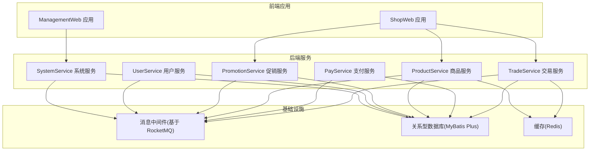
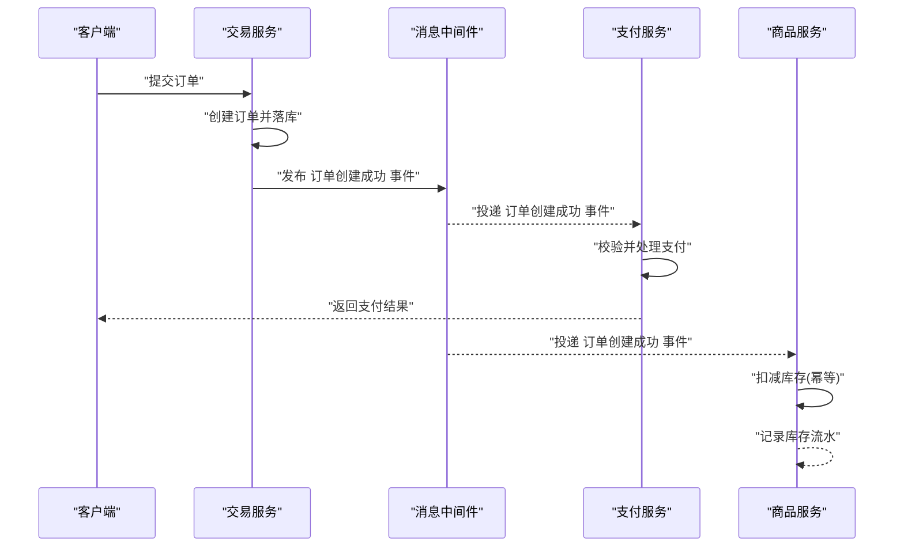
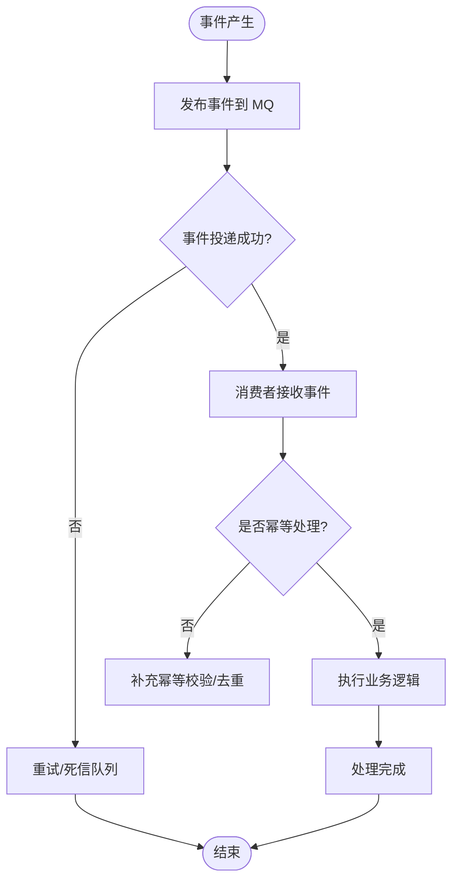
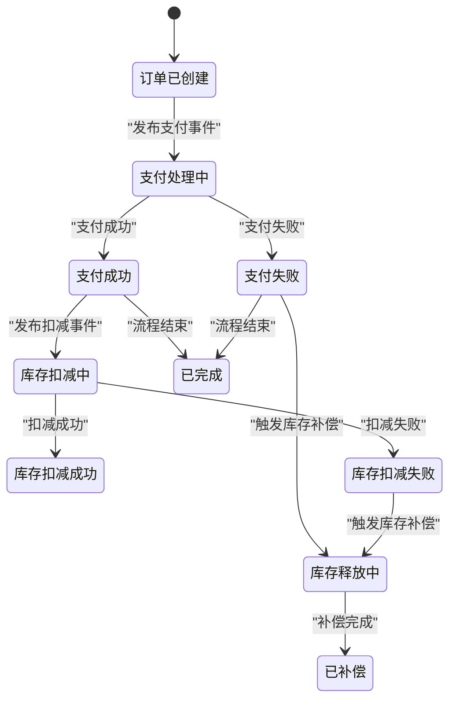
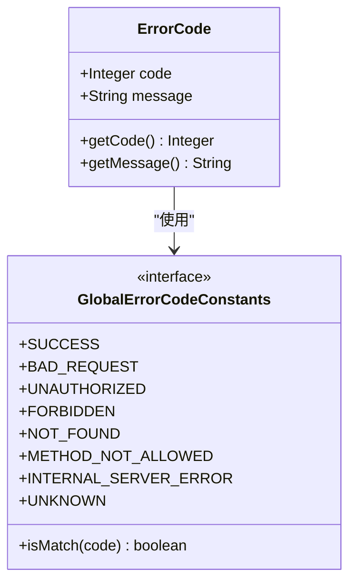
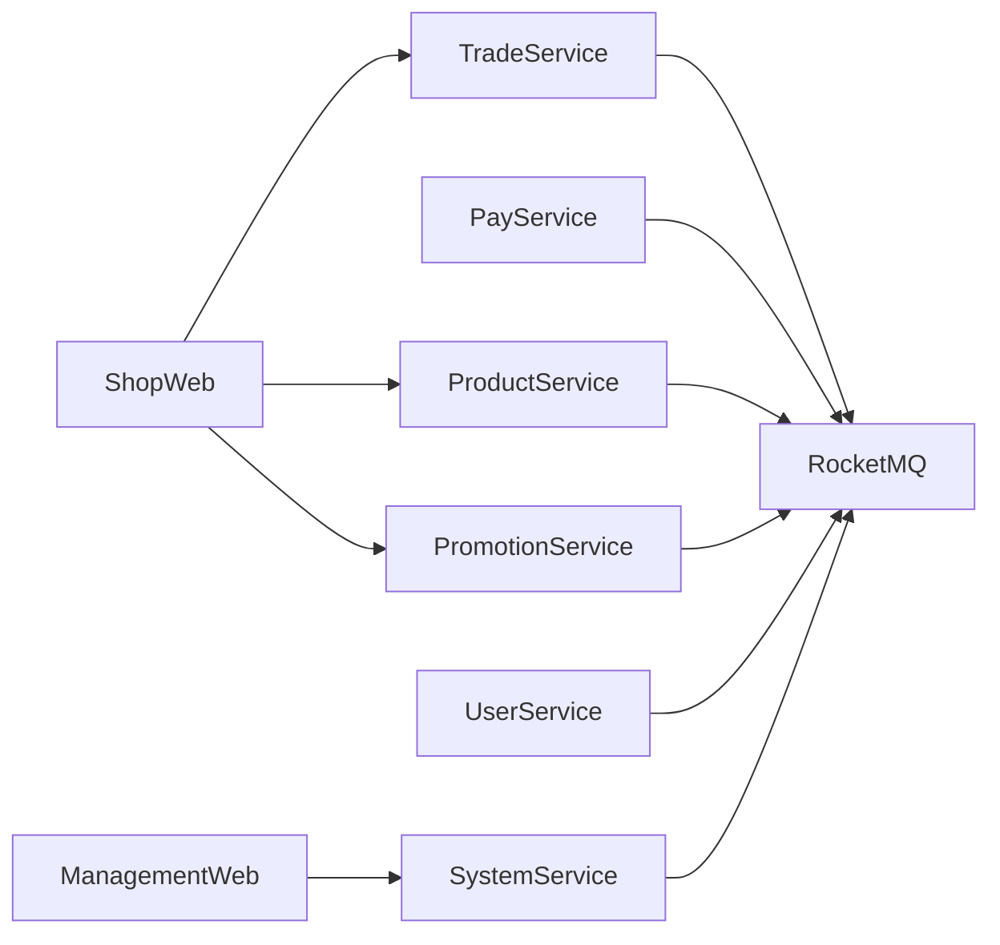

# 数据一致性设计

<cite>
**本文引用的文件**
- [MQConstants.java](file://moved/order/order-biz-api/src/main/java/cn/iocoder/mall/order/biz/enums/order/MQConstants.java)
- [MQConstants.java](file://moved/order/order-service-api02/src/main/java/cn/iocoder/mall/order/api/constant/MQConstants.java)
- [ErrorCode.java](file://common/common-framework/src/main/java/cn/iocoder/common/framework/exception/ErrorCode.java)
- [GlobalErrorCodeConstants.java](file://common/common-framework/src/main/java/cn/iocoder/common/framework/exception/enums/GlobalErrorCodeConstants.java)
- [mall-spring-boot-starter-rocketmq/pom.xml](file://common/mall-spring-boot-starter-rocketmq/pom.xml)
- [TradeServiceApplication.java](file://trade-service-project/trade-service-app/src/main/java/cn/iocoder/mall/tradeservice/TradeServiceApplication.java)
- [PayServiceApplication.java](file://pay-service-project/pay-service-app/src/main/java/cn/iocoder/mall/payservice/PayServiceApplication.java)
- [ProductServiceApplication.java](file://product-service-project/product-service-app/src/main/java/cn/iocoder/mall/productservice/ProductServiceApplication.java)
- [ShopWebApplication.java](file://shop-web-app/src/main/java/cn/iocoder/mall/shopweb/ShopWebApplication.java)
- [ManagementWebApplication.java](file://management-web-app/src/main/java/cn/iocoder/mall/managementweb/ManagementWebApplication.java)
</cite>

## 目录
1. [引言](#引言)
2. [项目结构](#项目结构)
3. [核心组件](#核心组件)
4. [架构总览](#架构总览)
5. [详细组件分析](#详细组件分析)
6. [依赖关系分析](#依赖关系分析)
7. [性能考量](#性能考量)
8. [故障排查指南](#故障排查指南)
9. [结论](#结论)
10. [附录](#附录)

## 引言
本设计文档聚焦于Onemall项目的分布式数据一致性问题，结合现有代码库中已实现的消息驱动与错误码体系，系统阐述在高并发、跨服务协作场景下如何通过最终一致性、事件驱动与补偿机制保障数据一致性，并给出可落地的实施建议与排障路径。本文面向技术与非技术读者，既提供高层架构视图，也包含关键实现细节与可视化图示。

## 项目结构
Onemall采用多模块微服务架构，围绕“交易、支付、商品、促销、用户、系统”六大领域拆分服务，配合统一的错误码与消息中间件基础设施，形成以事件为核心的最终一致性闭环。

图表来源
- [TradeServiceApplication.java](file://trade-service-project/trade-service-app/src/main/java/cn/iocoder/mall/tradeservice/TradeServiceApplication.java)
- [PayServiceApplication.java](file://pay-service-project/pay-service-app/src/main/java/cn/iocoder/mall/payservice/PayServiceApplication.java)
- [ProductServiceApplication.java](file://product-service-project/product-service-app/src/main/java/cn/iocoder/mall/productservice/ProductServiceApplication.java)
- [ShopWebApplication.java](file://shop-web-app/src/main/java/cn/iocoder/mall/shopweb/ShopWebApplication.java)
- [ManagementWebApplication.java](file://management-web-app/src/main/java/cn/iocoder/mall/managementweb/ManagementWebApplication.java)

章节来源
- [TradeServiceApplication.java](file://trade-service-project/trade-service-app/src/main/java/cn/iocoder/mall/tradeservice/TradeServiceApplication.java)
- [PayServiceApplication.java](file://pay-service-project/pay-service-app/src/main/java/cn/iocoder/mall/payservice/PayServiceApplication.java)
- [ProductServiceApplication.java](file://product-service-project/product-service-app/src/main/java/cn/iocoder/mall/productservice/ProductServiceApplication.java)
- [ShopWebApplication.java](file://shop-web-app/src/main/java/cn/iocoder/mall/shopweb/ShopWebApplication.java)
- [ManagementWebApplication.java](file://management-web-app/src/main/java/cn/iocoder/mall/managementweb/ManagementWebApplication.java)

## 核心组件
- 统一错误码与异常模型：全局错误码常量与业务错误码范围定义，确保跨服务一致的错误表达与处理。
- 消息中间件集成：通过Spring Boot Starter引入RocketMQ，为事件驱动与最终一致性提供基础能力。
- 订单域消息常量：定义订单创建成功等事件主题，作为跨服务解耦与数据同步的触发点。
- 应用启动入口：各服务独立启动类，承载配置加载与服务注册职责。

章节来源
- [ErrorCode.java](file://common/common-framework/src/main/java/cn/iocoder/common/framework/exception/ErrorCode.java)
- [GlobalErrorCodeConstants.java](file://common/common-framework/src/main/java/cn/iocoder/common/framework/exception/enums/GlobalErrorCodeConstants.java)
- [mall-spring-boot-starter-rocketmq/pom.xml](file://common/mall-spring-boot-starter-rocketmq/pom.xml)
- [MQConstants.java](file://moved/order/order-biz-api/src/main/java/cn/iocoder/mall/order/biz/enums/order/MQConstants.java)
- [MQConstants.java](file://moved/order/order-service-api02/src/main/java/cn/iocoder/mall/order/api/constant/MQConstants.java)

## 架构总览
Onemall的数据一致性以“事件驱动 + 最终一致 + 补偿机制”为核心策略：
- 事件驱动：服务内部或跨服务通过发布/订阅消息实现松耦合协作。
- 最终一致：通过消息队列保证事件可靠传递，消费者异步处理并更新本地状态，达成最终一致。
- 补偿机制：对幂等性不足或失败场景，提供补偿动作（如重试、反向操作）恢复一致性。
- 并发控制：数据库层面采用乐观锁与唯一索引，缓存层面采用写穿透与失效策略，降低冲突概率。
- 回滚与恢复：结合补偿与重放能力，实现失败后的快速恢复。

图表来源
- [MQConstants.java](file://moved/order/order-biz-api/src/main/java/cn/iocoder/mall/order/biz/enums/order/MQConstants.java)
- [mall-spring-boot-starter-rocketmq/pom.xml](file://common/mall-spring-boot-starter-rocketmq/pom.xml)

## 详细组件分析

### 事件驱动与消息队列
- 消息常量定义：订单域事件主题集中定义，便于跨模块共享与维护。
- MQ集成：通过Starter引入RocketMQ，简化生产者/消费者配置与生命周期管理。
- 事件发布：服务在关键业务点发布事件，下游服务订阅并执行各自职责（如库存扣减、支付处理）。
- 事件消费：消费者需保证幂等、事务性与可观测性，失败时纳入重试与告警流程。

图表来源
- [MQConstants.java](file://moved/order/order-service-api02/src/main/java/cn/iocoder/mall/order/api/constant/MQConstants.java)
- [mall-spring-boot-starter-rocketmq/pom.xml](file://common/mall-spring-boot-starter-rocketmq/pom.xml)

章节来源
- [MQConstants.java](file://moved/order/order-biz-api/src/main/java/cn/iocoder/mall/order/biz/enums/order/MQConstants.java)
- [MQConstants.java](file://moved/order/order-service-api02/src/main/java/cn/iocoder/mall/order/api/constant/MQConstants.java)
- [mall-spring-boot-starter-rocketmq/pom.xml](file://common/mall-spring-boot-starter-rocketmq/pom.xml)

### Saga分布式事务与补偿
在订单创建-支付-库存扣减等长流程中，推荐采用Saga模式：
- 步骤划分：每个子事务对应一个服务内的本地事务；跨服务调用通过事件或RPC实现。
- 可取消性：每个正向步骤均配套逆向补偿动作（如库存释放、退款）。
- 幂等与状态机：通过状态字段与幂等键避免重复执行；失败时进入补偿流程。
- 超时与重试：对阻塞环节设置超时与指数退避重试，必要时转人工介入。

说明
- 该图为概念性流程示意，用于指导Saga设计与补偿策略制定。

### 数据库并发控制与锁机制
- 乐观锁：对易冲突字段（如库存、版本号）采用CAS更新，失败则重试或报错。
- 唯一约束：对关键业务键（如订单号、支付单号）建立唯一索引，避免重复。
- 分布式锁：对强一致临界区采用Redis/Zookeeper锁，缩短持锁时间，避免热点。
- 事务边界：尽量缩小事务范围，减少锁竞争；批量操作采用分片与限流。

### 缓存与数据库一致性
- 写策略：先写数据库，再写缓存；或采用“删除缓存”策略，读时重建。
- 失效策略：热点数据设置合理TTL；写入后主动失效，避免脏读。
- 并发控制：缓存更新采用CAS或分布式锁，防止“缓存击穿/雪崩”。

### 错误码与异常处理
- 错误码模型：统一的错误码对象与全局错误常量，便于跨服务一致表达。
- 业务错误区间：预留业务错误码区间，支持按服务域扩展。
- 异常传播：在网关/控制器层统一捕获并转换为标准错误响应，避免泄露内部异常。

图表来源
- [ErrorCode.java](file://common/common-framework/src/main/java/cn/iocoder/common/framework/exception/ErrorCode.java)
- [GlobalErrorCodeConstants.java](file://common/common-framework/src/main/java/cn/iocoder/common/framework/exception/enums/GlobalErrorCodeConstants.java)

章节来源
- [ErrorCode.java](file://common/common-framework/src/main/java/cn/iocoder/common/framework/exception/ErrorCode.java)
- [GlobalErrorCodeConstants.java](file://common/common-framework/src/main/java/cn/iocoder/common/framework/exception/enums/GlobalErrorCodeConstants.java)

### 数据回滚与恢复
- 事件重放：对失败事件进行重放与补偿，结合幂等键避免重复处理。
- 人工干预：对无法自动补偿的场景提供人工介入通道与审计日志。
- 监控与告警：对延迟、堆积、失败率设置阈值告警，快速定位问题。

## 依赖关系分析
- 服务间依赖：前端应用调用交易/商品/促销服务；管理端调用系统服务。
- MQ依赖：所有服务通过消息中间件进行事件通信，降低直接RPC耦合度。
- 基础设施依赖：数据库与缓存作为共享资源，服务通过ORM与缓存客户端访问。

图表来源
- [ShopWebApplication.java](file://shop-web-app/src/main/java/cn/iocoder/mall/shopweb/ShopWebApplication.java)
- [ManagementWebApplication.java](file://management-web-app/src/main/java/cn/iocoder/mall/managementweb/ManagementWebApplication.java)
- [mall-spring-boot-starter-rocketmq/pom.xml](file://common/mall-spring-boot-starter-rocketmq/pom.xml)

章节来源
- [ShopWebApplication.java](file://shop-web-app/src/main/java/cn/iocoder/mall/shopweb/ShopWebApplication.java)
- [ManagementWebApplication.java](file://management-web-app/src/main/java/cn/iocoder/mall/managementweb/ManagementWebApplication.java)
- [mall-spring-boot-starter-rocketmq/pom.xml](file://common/mall-spring-boot-starter-rocketmq/pom.xml)

## 性能考量
- 事件批处理：聚合小事件，降低MQ压力与消费者处理开销。
- 幂等优化：利用业务主键与版本号，减少重复计算。
- 缓存命中：热点数据预热与多级缓存，降低数据库压力。
- 限流与熔断：在网关与服务侧设置限流与熔断，保护系统稳定性。

## 故障排查指南
- 事件堆积：检查消费者处理速率与失败重试策略，确认死信队列配置。
- 幂等问题：核对幂等键设计与去重逻辑，排查重复消费原因。
- 错误码不一致：统一错误码区间与消息体格式，避免跨服务解析差异。
- 数据不一致：核查补偿链路与事件顺序，定位缺失或延迟的事件。

章节来源
- [ErrorCode.java](file://common/common-framework/src/main/java/cn/iocoder/common/framework/exception/ErrorCode.java)
- [GlobalErrorCodeConstants.java](file://common/common-framework/src/main/java/cn/iocoder/common/framework/exception/enums/GlobalErrorCodeConstants.java)

## 结论
Onemall通过事件驱动与消息中间件实现了跨服务的最终一致性，结合统一错误码与幂等设计，为复杂业务流程提供了稳健的数据一致性保障。建议在现有基础上进一步完善Saga补偿与监控告警体系，持续提升系统的可靠性与可运维性。

## 附录
- 术语
  - 最终一致：系统在无新更新的情况下，经过一段时间后达到一致状态。
  - 幂等：同一操作多次执行产生的副作用与一次执行相同。
  - 补偿：对已执行的正向操作进行逆向处理，恢复一致性。
- 参考文件
  - [MQConstants.java](file://moved/order/order-biz-api/src/main/java/cn/iocoder/mall/order/biz/enums/order/MQConstants.java)
  - [MQConstants.java](file://moved/order/order-service-api02/src/main/java/cn/iocoder/mall/order/api/constant/MQConstants.java)
  - [ErrorCode.java](file://common/common-framework/src/main/java/cn/iocoder/common/framework/exception/ErrorCode.java)
  - [GlobalErrorCodeConstants.java](file://common/common-framework/src/main/java/cn/iocoder/common/framework/exception/enums/GlobalErrorCodeConstants.java)
  - [mall-spring-boot-starter-rocketmq/pom.xml](file://common/mall-spring-boot-starter-rocketmq/pom.xml)