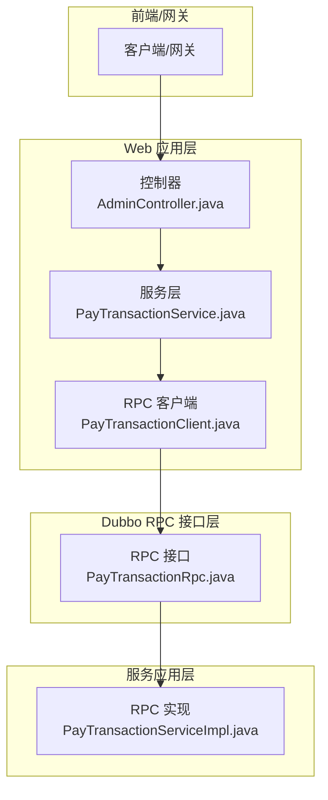
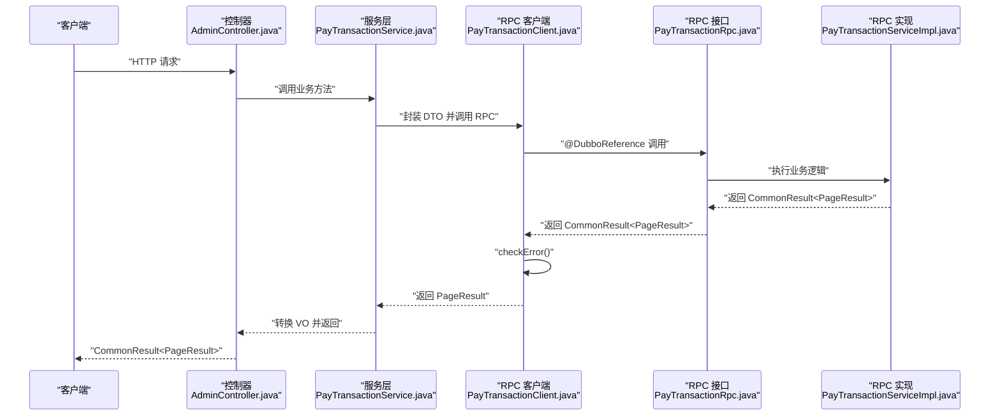
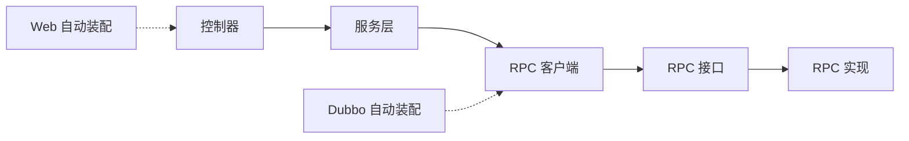
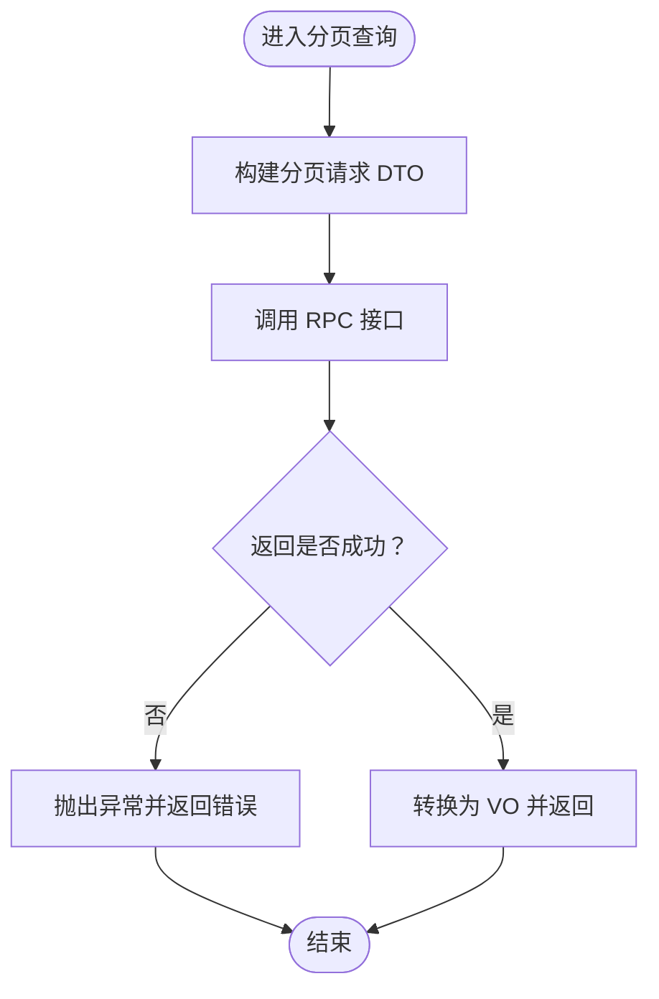

# 服务通信机制

<cite>
**本文档引用的文件**
- [CommonResult.java](file://common/common-framework/src/main/java/cn/iocoder/common/framework/vo/CommonResult.java)
- [CommonWebAutoConfiguration.java](file://common/mall-spring-boot-starter-web/src/main/java/cn/iocoder/mall/web/config/CommonWebAutoConfiguration.java)
- [DubboWebAutoConfiguration.java](file://common/mall-spring-boot-starter-dubbo/src/main/java/cn/iocoder/mall/dubbo/config/DubboWebAutoConfiguration.java)
- [GlobalResponseBodyHandler.java](file://common/mall-spring-boot-starter-web/src/main/java/cn/iocoder/mall/web/core/handler/GlobalResponseBodyHandler.java)
- [GlobalExceptionHandler.java](file://common/mall-spring-boot-starter-web/src/main/java/cn/iocoder/mall/web/core/handler/GlobalExceptionHandler.java)
- [AdminController.java](file://management-web-app/src/main/java/cn/iocoder/mall/managementweb/controller/admin/AdminController.java)
- [PayTransactionService.java](file://management-web-app/src/main/java/cn/iocoder/mall/managementweb/service/pay/transaction/PayTransactionService.java)
- [PayTransactionClient.java](file://management-web-app/src/main/java/cn/iocoder/mall/managementweb/client/pay/transaction/PayTransactionClient.java)
- [PayTransactionRpc.java](file://pay-service-project/pay-service-api/src/main/java/cn/iocoder/mall/payservice/rpc/transaction/PayTransactionRpc.java)
- [PayTransactionServiceImpl.java](file://pay-service-project/pay-service-app/src/main/java/cn/iocoder/mall/payservice/service/transaction/impl/PayTransactionServiceImpl.java)
</cite>

## 目录
1. [引言](#引言)
2. [项目结构](#项目结构)
3. [核心组件](#核心组件)
4. [架构总览](#架构总览)
5. [详细组件分析](#详细组件分析)
6. [依赖分析](#依赖分析)
7. [性能考虑](#性能考虑)
8. [故障排查指南](#故障排查指南)
9. [结论](#结论)
10. [附录](#附录)

## 引言
本文件聚焦 Onemall 项目的“服务通信机制”，系统性阐述两类服务调用方式：HTTP REST API 与 Dubbo RPC。文档从设计原理、路由与参数、状态码与错误处理、序列化与协议、负载均衡与容错、性能优化、数据传输格式与版本兼容、同步/异步选择策略，以及监控、追踪与性能分析等方面进行深入说明，并结合仓库中的实际代码文件给出可追溯的来源。

## 项目结构
Onemall 采用多模块微服务架构，前端或网关通过 HTTP REST API 调用 Web 应用层，Web 层再通过 Dubbo RPC 调用后端服务应用层。公共框架提供统一的返回体、异常处理、消息转换等基础设施。

图表来源
- [AdminController.java:30-67](file://management-web-app/src/main/java/cn/iocoder/mall/managementweb/controller/admin/AdminController.java#L30-L67)
- [PayTransactionService.java:17-29](file://management-web-app/src/main/java/cn/iocoder/mall/managementweb/service/pay/transaction/PayTransactionService.java#L17-L29)
- [PayTransactionClient.java:11-23](file://management-web-app/src/main/java/cn/iocoder/mall/managementweb/client/pay/transaction/PayTransactionClient.java#L11-L23)
- [PayTransactionRpc.java:10-52](file://pay-service-project/pay-service-api/src/main/java/cn/iocoder/mall/payservice/rpc/transaction/PayTransactionRpc.java#L10-L52)
- [PayTransactionServiceImpl.java:39-201](file://pay-service-project/pay-service-app/src/main/java/cn/iocoder/mall/payservice/service/transaction/impl/PayTransactionServiceImpl.java#L39-L201)

章节来源
- [CommonWebAutoConfiguration.java:28-96](file://common/mall-spring-boot-starter-web/src/main/java/cn/iocoder/mall/web/config/CommonWebAutoConfiguration.java#L28-L96)
- [DubboWebAutoConfiguration.java:12-31](file://common/mall-spring-boot-starter-dubbo/src/main/java/cn/iocoder/mall/dubbo/config/DubboWebAutoConfiguration.java#L12-L31)

## 核心组件
- 统一返回体与错误模型
  - 统一返回体 CommonResult 提供 code、message、detailMessage、data 字段，并内置 isSuccess/isError 判定与异常检查方法，用于 REST API 与 RPC 返回的一致化。
  - 参考路径：[CommonResult.java:17-155](file://common/common-framework/src/main/java/cn/iocoder/common/framework/vo/CommonResult.java#L17-L155)

- Web 层自动装配与全局处理
  - 全局响应包装与日志记录：GlobalResponseBodyHandler 仅对返回 CommonResult 的接口进行拦截，便于访问日志记录。
  - 全局异常处理：GlobalExceptionHandler 将各类异常映射为 CommonResult，统一错误码与提示，并异步上报系统异常日志。
  - 消息转换：默认使用 Fastjson 转换器，优先 JSON，禁用循环引用检测，解决整型键序列化问题。
  - 参考路径：
    - [GlobalResponseBodyHandler.java:23-45](file://common/mall-spring-boot-starter-web/src/main/java/cn/iocoder/mall/web/core/handler/GlobalResponseBodyHandler.java#L23-L45)
    - [GlobalExceptionHandler.java:42-252](file://common/mall-spring-boot-starter-web/src/main/java/cn/iocoder/mall/web/core/handler/GlobalExceptionHandler.java#L42-L252)
    - [CommonWebAutoConfiguration.java:30-96](file://common/mall-spring-boot-starter-web/src/main/java/cn/iocoder/mall/web/config/CommonWebAutoConfiguration.java#L30-L96)

- Dubbo Web 自动装配
  - DubboWebAutoConfiguration 注册 DubboRouterTagWebInterceptor，支持基于请求头 dubbo-tag 的标签路由，便于灰度与多版本治理。
  - 参考路径：[DubboWebAutoConfiguration.java:12-31](file://common/mall-spring-boot-starter-dubbo/src/main/java/cn/iocoder/mall/dubbo/config/DubboWebAutoConfiguration.java#L12-L31)

- 控制器与服务层
  - 控制器示例：AdminController 使用@GetMapping/@PostMapping 等注解定义 REST 路由，返回 CommonResult 包裹的分页结果。
  - 参考路径：[AdminController.java:30-67](file://management-web-app/src/main/java/cn/iocoder/mall/managementweb/controller/admin/AdminController.java#L30-L67)

- RPC 客户端与服务实现
  - Web 层通过 @DubboReference 引用远程 RPC 接口，客户端封装查询分页等操作，统一调用 checkError() 校验返回。
  - 服务应用层实现 PayTransactionRpc 接口，执行业务逻辑并返回 CommonResult。
  - 参考路径：
    - [PayTransactionClient.java:11-23](file://management-web-app/src/main/java/cn/iocoder/mall/managementweb/client/pay/transaction/PayTransactionClient.java#L11-L23)
    - [PayTransactionRpc.java:10-52](file://pay-service-project/pay-service-api/src/main/java/cn/iocoder/mall/payservice/rpc/transaction/PayTransactionRpc.java#L10-L52)
    - [PayTransactionServiceImpl.java:39-201](file://pay-service-project/pay-service-app/src/main/java/cn/iocoder/mall/payservice/service/transaction/impl/PayTransactionServiceImpl.java#L39-L201)

章节来源
- [CommonResult.java:17-155](file://common/common-framework/src/main/java/cn/iocoder/common/framework/vo/CommonResult.java#L17-L155)
- [GlobalResponseBodyHandler.java:23-45](file://common/mall-spring-boot-starter-web/src/main/java/cn/iocoder/mall/web/core/handler/GlobalResponseBodyHandler.java#L23-L45)
- [GlobalExceptionHandler.java:42-252](file://common/mall-spring-boot-starter-web/src/main/java/cn/iocoder/mall/web/core/handler/GlobalExceptionHandler.java#L42-L252)
- [CommonWebAutoConfiguration.java:30-96](file://common/mall-spring-boot-starter-web/src/main/java/cn/iocoder/mall/web/config/CommonWebAutoConfiguration.java#L30-L96)
- [DubboWebAutoConfiguration.java:12-31](file://common/mall-spring-boot-starter-dubbo/src/main/java/cn/iocoder/mall/dubbo/config/DubboWebAutoConfiguration.java#L12-L31)
- [AdminController.java:30-67](file://management-web-app/src/main/java/cn/iocoder/mall/managementweb/controller/admin/AdminController.java#L30-L67)
- [PayTransactionClient.java:11-23](file://management-web-app/src/main/java/cn/iocoder/mall/managementweb/client/pay/transaction/PayTransactionClient.java#L11-L23)
- [PayTransactionRpc.java:10-52](file://pay-service-project/pay-service-api/src/main/java/cn/iocoder/mall/payservice/rpc/transaction/PayTransactionRpc.java#L10-L52)
- [PayTransactionServiceImpl.java:39-201](file://pay-service-project/pay-service-app/src/main/java/cn/iocoder/mall/payservice/service/transaction/impl/PayTransactionServiceImpl.java#L39-L201)

## 架构总览
下图展示从 Web 控制器到 Dubbo RPC 的完整调用链路，包括参数传递、返回值封装与异常处理。

图表来源
- [AdminController.java:30-67](file://management-web-app/src/main/java/cn/iocoder/mall/managementweb/controller/admin/AdminController.java#L30-L67)
- [PayTransactionService.java:17-29](file://management-web-app/src/main/java/cn/iocoder/mall/managementweb/service/pay/transaction/PayTransactionService.java#L17-L29)
- [PayTransactionClient.java:11-23](file://management-web-app/src/main/java/cn/iocoder/mall/managementweb/client/pay/transaction/PayTransactionClient.java#L11-L23)
- [PayTransactionRpc.java:10-52](file://pay-service-project/pay-service-api/src/main/java/cn/iocoder/mall/payservice/rpc/transaction/PayTransactionRpc.java#L10-L52)
- [PayTransactionServiceImpl.java:39-201](file://pay-service-project/pay-service-app/src/main/java/cn/iocoder/mall/payservice/service/transaction/impl/PayTransactionServiceImpl.java#L39-L201)

## 详细组件分析

### HTTP REST API 设计与实现
- 路由设计
  - 控制器使用@RequestMapping、@GetMapping、@PostMapping 等注解定义 REST 路由，如 "/admin/page"、"/admin/create" 等。
  - 参考路径：[AdminController.java:30-67](file://management-web-app/src/main/java/cn/iocoder/mall/managementweb/controller/admin/AdminController.java#L30-L67)

- 参数传递
  - 使用 @Validated 开启参数校验，配合 @Valid、字段级校验注解（如 @NotNull、@Pattern 等）确保输入合法性。
  - 参考路径：[AdminController.java:16-24](file://management-web-app/src/main/java/cn/iocoder/mall/managementweb/controller/admin/AdminController.java#L16-L24)

- 状态码与错误处理
  - 返回值统一为 CommonResult<T>，其中 code 表示业务状态码，message 为对外提示，detailMessage 为内部调试信息。
  - 全局异常处理器将各类异常映射为 CommonResult，覆盖参数缺失、类型不匹配、校验失败、资源不存在、方法不允许、业务异常、全局异常与兜底异常。
  - 参考路径：
    - [CommonResult.java:17-155](file://common/common-framework/src/main/java/cn/iocoder/common/framework/vo/CommonResult.java#L17-L155)
    - [GlobalExceptionHandler.java:66-198](file://common/mall-spring-boot-starter-web/src/main/java/cn/iocoder/mall/web/core/handler/GlobalExceptionHandler.java#L66-L198)

- 消息转换与跨域
  - 默认使用 Fastjson 转换器，设置字符集与序列化特性，优先 JSON 媒体类型。
  - 注册 CORS 过滤器，允许跨域访问。
  - 参考路径：[CommonWebAutoConfiguration.java:78-96](file://common/mall-spring-boot-starter-web/src/main/java/cn/iocoder/mall/web/config/CommonWebAutoConfiguration.java#L78-L96)

- 访问日志与响应包装
  - GlobalResponseBodyHandler 仅对返回 CommonResult 的接口进行拦截，便于记录访问日志。
  - 参考路径：[GlobalResponseBodyHandler.java:23-45](file://common/mall-spring-boot-starter-web/src/main/java/cn/iocoder/mall/web/core/handler/GlobalResponseBodyHandler.java#L23-L45)

章节来源
- [AdminController.java:30-67](file://management-web-app/src/main/java/cn/iocoder/mall/managementweb/controller/admin/AdminController.java#L30-L67)
- [CommonResult.java:17-155](file://common/common-framework/src/main/java/cn/iocoder/common/framework/vo/CommonResult.java#L17-L155)
- [GlobalExceptionHandler.java:66-198](file://common/mall-spring-boot-starter-web/src/main/java/cn/iocoder/mall/web/core/handler/GlobalExceptionHandler.java#L66-L198)
- [CommonWebAutoConfiguration.java:78-96](file://common/mall-spring-boot-starter-web/src/main/java/cn/iocoder/mall/web/config/CommonWebAutoConfiguration.java#L78-L96)
- [GlobalResponseBodyHandler.java:23-45](file://common/mall-spring-boot-starter-web/src/main/java/cn/iocoder/mall/web/core/handler/GlobalResponseBodyHandler.java#L23-L45)

### Dubbo RPC 设计与实现
- 接口与客户端
  - Web 层通过 @DubboReference 引用远程 RPC 接口 PayTransactionRpc，客户端方法封装分页查询，统一调用 checkError() 校验返回。
  - 参考路径：
    - [PayTransactionClient.java:11-23](file://management-web-app/src/main/java/cn/iocoder/mall/managementweb/client/pay/transaction/PayTransactionClient.java#L11-L23)
    - [PayTransactionRpc.java:10-52](file://pay-service-project/pay-service-api/src/main/java/cn/iocoder/mall/payservice/rpc/transaction/PayTransactionRpc.java#L10-L52)

- 服务实现与业务逻辑
  - 服务应用层实现 PayTransactionRpc 接口，执行创建、提交、查询、更新支付成功、分页查询等业务，并返回 CommonResult。
  - 参考路径：[PayTransactionServiceImpl.java:39-201](file://pay-service-project/pay-service-app/src/main/java/cn/iocoder/mall/payservice/service/transaction/impl/PayTransactionServiceImpl.java#L39-L201)

- 版本与路由
  - 客户端通过 ${dubbo.consumer.PayTransactionRpc.version} 指定消费者版本，便于灰度与平滑升级。
  - DubboWebAutoConfiguration 注册 DubboRouterTagWebInterceptor，支持基于请求头 dubbo-tag 的标签路由。
  - 参考路径：
    - [PayTransactionClient.java:14](file://management-web-app/src/main/java/cn/iocoder/mall/managementweb/client/pay/transaction/PayTransactionClient.java#L14)
    - [DubboWebAutoConfiguration.java:20-29](file://common/mall-spring-boot-starter-dubbo/src/main/java/cn/iocoder/mall/dubbo/config/DubboWebAutoConfiguration.java#L20-L29)

- 序列化与协议
  - 默认使用 Apache Dubbo 的序列化机制（基于 SPI），具体序列化器由 Dubbo 配置决定。Onemall 通过公共框架统一返回体与异常处理，确保跨语言/跨协议的稳定性。
  - 参考路径：[PayTransactionRpc.java:10-52](file://pay-service-project/pay-service-api/src/main/java/cn/iocoder/mall/payservice/rpc/transaction/PayTransactionRpc.java#L10-L52)

- 负载均衡与容错
  - 负载均衡与容错策略由 Dubbo 配置控制（如随机、轮询、一致性哈希等）。Onemall 通过统一异常处理与返回体，确保在服务不可用或超时时能快速失败并返回明确错误。
  - 参考路径：[GlobalExceptionHandler.java:151-174](file://common/mall-spring-boot-starter-web/src/main/java/cn/iocoder/mall/web/core/handler/GlobalExceptionHandler.java#L151-L174)

- 性能优化建议
  - 合理设置超时与重试次数，避免长尾请求拖垮下游。
  - 对热点接口开启本地缓存与限流，减少重复调用。
  - 使用异步回调（如通知任务）替代阻塞等待，提升吞吐。
  - 参考路径：[PayTransactionServiceImpl.java:113-168](file://pay-service-project/pay-service-app/src/main/java/cn/iocoder/mall/payservice/service/transaction/impl/PayTransactionServiceImpl.java#L113-L168)

章节来源
- [PayTransactionClient.java:11-23](file://management-web-app/src/main/java/cn/iocoder/mall/managementweb/client/pay/transaction/PayTransactionClient.java#L11-L23)
- [PayTransactionRpc.java:10-52](file://pay-service-project/pay-service-api/src/main/java/cn/iocoder/mall/payservice/rpc/transaction/PayTransactionRpc.java#L10-L52)
- [PayTransactionServiceImpl.java:39-201](file://pay-service-project/pay-service-app/src/main/java/cn/iocoder/mall/payservice/service/transaction/impl/PayTransactionServiceImpl.java#L39-L201)
- [DubboWebAutoConfiguration.java:20-29](file://common/mall-spring-boot-starter-dubbo/src/main/java/cn/iocoder/mall/dubbo/config/DubboWebAutoConfiguration.java#L20-L29)
- [GlobalExceptionHandler.java:151-174](file://common/mall-spring-boot-starter-web/src/main/java/cn/iocoder/mall/web/core/handler/GlobalExceptionHandler.java#L151-L174)

### 数据传输格式与版本兼容
- 数据传输格式
  - HTTP 层默认使用 JSON（application/json），通过 Fastjson 转换器统一序列化，避免循环引用与整型键问题。
  - RPC 层使用 Dubbo 默认序列化，接口层以 DTO/BO/PageResult 等 POJO 作为传输载体，保持与 CommonResult 的一致化。
  - 参考路径：
    - [CommonWebAutoConfiguration.java:80-94](file://common/mall-spring-boot-starter-web/src/main/java/cn/iocoder/mall/web/config/CommonWebAutoConfiguration.java#L80-L94)
    - [PayTransactionRpc.java:10-52](file://pay-service-project/pay-service-api/src/main/java/cn/iocoder/mall/payservice/rpc/transaction/PayTransactionRpc.java#L10-L52)

- 版本兼容与灰度
  - 通过 ${dubbo.consumer.*.version} 指定消费者版本，实现平滑升级与灰度发布。
  - 通过 dubbo-tag 请求头与 DubboRouterTagWebInterceptor 实现标签路由，支持多版本并行与流量切分。
  - 参考路径：
    - [PayTransactionClient.java:14](file://management-web-app/src/main/java/cn/iocoder/mall/managementweb/client/pay/transaction/PayTransactionClient.java#L14)
    - [DubboWebAutoConfiguration.java:20-29](file://common/mall-spring-boot-starter-dubbo/src/main/java/cn/iocoder/mall/dubbo/config/DubboWebAutoConfiguration.java#L20-L29)

章节来源
- [CommonWebAutoConfiguration.java:80-94](file://common/mall-spring-boot-starter-web/src/main/java/cn/iocoder/mall/web/config/CommonWebAutoConfiguration.java#L80-L94)
- [PayTransactionClient.java:14](file://management-web-app/src/main/java/cn/iocoder/mall/managementweb/client/pay/transaction/PayTransactionClient.java#L14)
- [DubboWebAutoConfiguration.java:20-29](file://common/mall-spring-boot-starter-dubbo/src/main/java/cn/iocoder/mall/dubbo/config/DubboWebAutoConfiguration.java#L20-L29)
- [PayTransactionRpc.java:10-52](file://pay-service-project/pay-service-api/src/main/java/cn/iocoder/mall/payservice/rpc/transaction/PayTransactionRpc.java#L10-L52)

### 同步与异步调用策略
- 同步调用
  - 适用于强一致要求、实时反馈的场景（如创建支付交易单、提交支付），Web 层直接等待 RPC 返回并校验错误。
  - 参考路径：[PayTransactionClient.java:17-21](file://management-web-app/src/main/java/cn/iocoder/mall/managementweb/client/pay/transaction/PayTransactionClient.java#L17-L21)

- 异步调用
  - 适用于耗时操作或最终一致性场景（如支付回调通知、退款流程），服务实现中通过异步任务或消息队列处理，避免阻塞主流程。
  - 参考路径：[PayTransactionServiceImpl.java:165-168](file://pay-service-project/pay-service-app/src/main/java/cn/iocoder/mall/payservice/service/transaction/impl/PayTransactionServiceImpl.java#L165-L168)

章节来源
- [PayTransactionClient.java:17-21](file://management-web-app/src/main/java/cn/iocoder/mall/managementweb/client/pay/transaction/PayTransactionClient.java#L17-L21)
- [PayTransactionServiceImpl.java:165-168](file://pay-service-project/pay-service-app/src/main/java/cn/iocoder/mall/payservice/service/transaction/impl/PayTransactionServiceImpl.java#L165-L168)

### 监控、追踪与性能分析
- 访问日志与异常日志
  - GlobalResponseBodyHandler 记录控制器返回结果，便于访问日志采集。
  - GlobalExceptionHandler 异步上报系统异常日志至系统服务（SystemExceptionLogRpc），包含 traceId、uri、method、ip、异常栈等。
  - 参考路径：
    - [GlobalResponseBodyHandler.java:36-43](file://common/mall-spring-boot-starter-web/src/main/java/cn/iocoder/mall/web/core/handler/GlobalResponseBodyHandler.java#L36-L43)
    - [GlobalExceptionHandler.java:200-250](file://common/mall-spring-boot-starter-web/src/main/java/cn/iocoder/mall/web/core/handler/GlobalExceptionHandler.java#L200-L250)

- 性能分析建议
  - 在控制器与 RPC 实现的关键路径埋点，统计 P99 延迟、错误率与吞吐量。
  - 对热点接口进行缓存与限流，结合灰度路由验证新版本性能。
  - 参考路径：[PayTransactionServiceImpl.java:171-174](file://pay-service-project/pay-service-app/src/main/java/cn/iocoder/mall/payservice/service/transaction/impl/PayTransactionServiceImpl.java#L171-L174)

章节来源
- [GlobalResponseBodyHandler.java:36-43](file://common/mall-spring-boot-starter-web/src/main/java/cn/iocoder/mall/web/core/handler/GlobalResponseBodyHandler.java#L36-L43)
- [GlobalExceptionHandler.java:200-250](file://common/mall-spring-boot-starter-web/src/main/java/cn/iocoder/mall/web/core/handler/GlobalExceptionHandler.java#L200-L250)
- [PayTransactionServiceImpl.java:171-174](file://pay-service-project/pay-service-app/src/main/java/cn/iocoder/mall/payservice/service/transaction/impl/PayTransactionServiceImpl.java#L171-L174)

## 依赖分析
- 组件耦合关系
  - 控制器依赖服务层；服务层依赖 RPC 客户端；客户端依赖 RPC 接口；接口由服务应用层实现。
  - Web 层通过全局异常与响应处理器统一输出；Dubbo 层通过自动装配与拦截器实现路由与版本控制。
- 外部依赖
  - HTTP 层依赖 Spring MVC、Fastjson；Dubbo 层依赖 Apache Dubbo 与 SPI 扩展。
- 循环依赖
  - 当前结构清晰，未发现循环依赖迹象。

图表来源
- [AdminController.java:30-67](file://management-web-app/src/main/java/cn/iocoder/mall/managementweb/controller/admin/AdminController.java#L30-L67)
- [PayTransactionService.java:17-29](file://management-web-app/src/main/java/cn/iocoder/mall/managementweb/service/pay/transaction/PayTransactionService.java#L17-L29)
- [PayTransactionClient.java:11-23](file://management-web-app/src/main/java/cn/iocoder/mall/managementweb/client/pay/transaction/PayTransactionClient.java#L11-L23)
- [PayTransactionRpc.java:10-52](file://pay-service-project/pay-service-api/src/main/java/cn/iocoder/mall/payservice/rpc/transaction/PayTransactionRpc.java#L10-L52)
- [PayTransactionServiceImpl.java:39-201](file://pay-service-project/pay-service-app/src/main/java/cn/iocoder/mall/payservice/service/transaction/impl/PayTransactionServiceImpl.java#L39-L201)
- [CommonWebAutoConfiguration.java:30-96](file://common/mall-spring-boot-starter-web/src/main/java/cn/iocoder/mall/web/config/CommonWebAutoConfiguration.java#L30-L96)
- [DubboWebAutoConfiguration.java:12-31](file://common/mall-spring-boot-starter-dubbo/src/main/java/cn/iocoder/mall/dubbo/config/DubboWebAutoConfiguration.java#L12-L31)

章节来源
- [CommonWebAutoConfiguration.java:30-96](file://common/mall-spring-boot-starter-web/src/main/java/cn/iocoder/mall/web/config/CommonWebAutoConfiguration.java#L30-L96)
- [DubboWebAutoConfiguration.java:12-31](file://common/mall-spring-boot-starter-dubbo/src/main/java/cn/iocoder/mall/dubbo/config/DubboWebAutoConfiguration.java#L12-L31)

## 性能考虑
- 序列化与网络开销
  - HTTP 层使用 Fastjson，减少 JSON 序列化成本；RPC 层使用 Dubbo 默认序列化，注意对象大小与嵌套深度。
- 超时与重试
  - 为关键 RPC 接口设置合理超时与重试策略，避免雪崩效应。
- 缓存与降级
  - 对高频只读接口（如分页查询）启用本地缓存；对下游不稳定接口进行熔断与降级。
- 异步化
  - 将耗时操作（如回调通知）异步化，提升接口响应速度。
- 参考路径：
  - [CommonWebAutoConfiguration.java:80-94](file://common/mall-spring-boot-starter-web/src/main/java/cn/iocoder/mall/web/config/CommonWebAutoConfiguration.java#L80-L94)
  - [PayTransactionServiceImpl.java:165-168](file://pay-service-project/pay-service-app/src/main/java/cn/iocoder/mall/payservice/service/transaction/impl/PayTransactionServiceImpl.java#L165-L168)

## 故障排查指南
- 常见错误与定位
  - 参数缺失/类型不匹配：查看 GlobalExceptionHandler 对应异常处理器返回的错误码与 detailMessage。
  - 资源不存在/方法不允许：确认路由与 HTTP 方法是否正确。
  - 业务异常：根据 ServiceException 的 code/message 快速定位。
  - 全局异常：检查异常日志上报与 traceId，定位具体异常栈。
- 排查步骤
  - 确认控制器返回是否为 CommonResult；查看 GlobalResponseBodyHandler 是否生效。
  - 检查 RPC 客户端是否正确注入与版本匹配；核对 dubbo-tag 路由是否正确。
  - 参考路径：
    - [GlobalExceptionHandler.java:66-198](file://common/mall-spring-boot-starter-web/src/main/java/cn/iocoder/mall/web/core/handler/GlobalExceptionHandler.java#L66-L198)
    - [PayTransactionClient.java:14-21](file://management-web-app/src/main/java/cn/iocoder/mall/managementweb/client/pay/transaction/PayTransactionClient.java#L14-L21)
    - [DubboWebAutoConfiguration.java:20-29](file://common/mall-spring-boot-starter-dubbo/src/main/java/cn/iocoder/mall/dubbo/config/DubboWebAutoConfiguration.java#L20-L29)

章节来源
- [GlobalExceptionHandler.java:66-198](file://common/mall-spring-boot-starter-web/src/main/java/cn/iocoder/mall/web/core/handler/GlobalExceptionHandler.java#L66-L198)
- [PayTransactionClient.java:14-21](file://management-web-app/src/main/java/cn/iocoder/mall/managementweb/client/pay/transaction/PayTransactionClient.java#L14-L21)
- [DubboWebAutoConfiguration.java:20-29](file://common/mall-spring-boot-starter-dubbo/src/main/java/cn/iocoder/mall/dubbo/config/DubboWebAutoConfiguration.java#L20-L29)

## 结论
Onemall 的服务通信机制以“统一返回体 + 全局异常处理”为基础，结合 Dubbo 的版本与路由能力，实现了 HTTP REST API 与 Dubbo RPC 的协同工作。通过规范化的数据传输格式、版本兼容策略与异步化手段，系统在可用性、可观测性与性能方面均具备良好基础。后续可在缓存、限流、熔断与指标埋点方面进一步完善。

## 附录
- 关键流程图（算法实现）
  - 分页查询流程（Web -> RPC -> 实现）

图表来源
- [PayTransactionService.java:23-27](file://management-web-app/src/main/java/cn/iocoder/mall/managementweb/service/pay/transaction/PayTransactionService.java#L23-L27)
- [PayTransactionClient.java:17-21](file://management-web-app/src/main/java/cn/iocoder/mall/managementweb/client/pay/transaction/PayTransactionClient.java#L17-L21)
- [PayTransactionServiceImpl.java:171-174](file://pay-service-project/pay-service-app/src/main/java/cn/iocoder/mall/payservice/service/transaction/impl/PayTransactionServiceImpl.java#L171-L174)