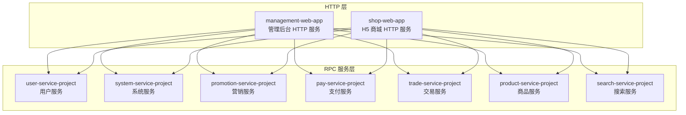
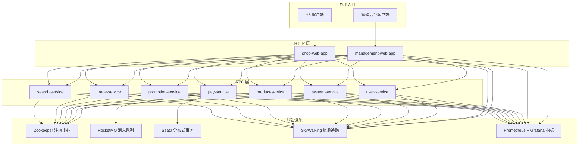
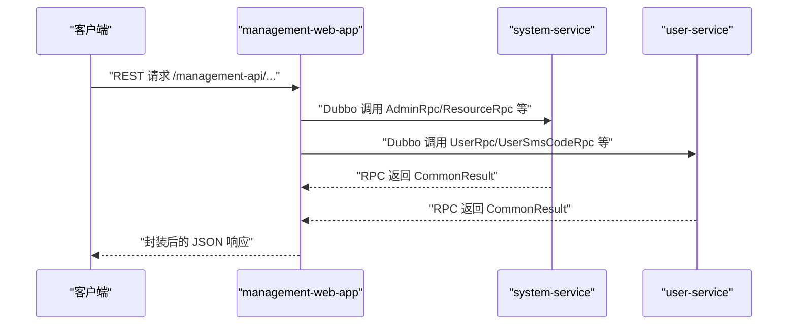
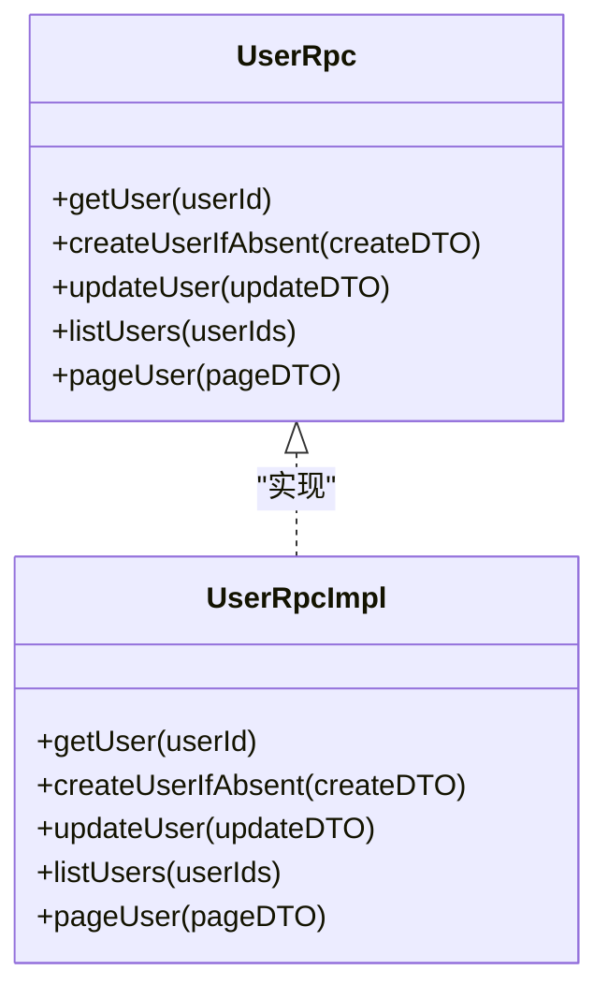
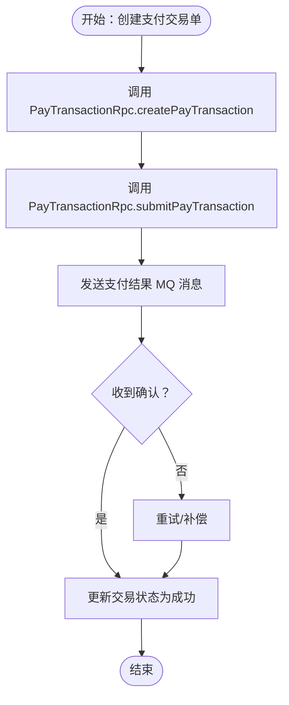
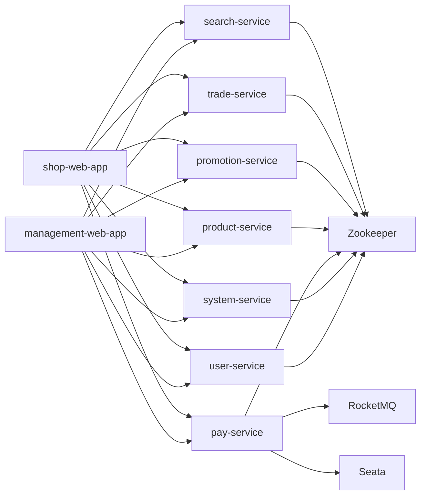

# 架构设计

<cite>
**本文引用的文件**
- [README.md](file://README.md)
- [pom.xml](file://pom.xml)
- [management-web-app/src/main/resources/application.yml](file://management-web-app/src/main/resources/application.yml)
- [shop-web-app/src/main/resources/application.yml](file://shop-web-app/src/main/resources/application.yml)
- [user-service-project/user-service-app/src/main/resources/application.yaml](file://user-service-project/user-service-app/src/main/resources/application.yaml)
- [system-service-project/system-service-app/src/main/resources/application.yaml](file://system-service-project/system-service-app/src/main/resources/application.yaml)
- [pay-service-project/pay-service-app/src/main/resources/application.yaml](file://pay-service-project/pay-service-app/src/main/resources/application.yaml)
- [user-service-project/user-service-api/src/main/java/cn/iocoder/mall/userservice/rpc/user/UserRpc.java](file://user-service-project/user-service-api/src/main/java/cn/iocoder/mall/userservice/rpc/user/UserRpc.java)
- [system-service-project/system-service-api/src/main/java/cn/iocoder/mall/systemservice/rpc/admin/AdminRpc.java](file://system-service-project/system-service-api/src/main/java/cn/iocoder/mall/systemservice/rpc/admin/AdminRpc.java)
- [pay-service-project/pay-service-api/src/main/java/cn/iocoder/mall/payservice/rpc/transaction/PayTransactionRpc.java](file://pay-service-project/pay-service-api/src/main/java/cn/iocoder/mall/payservice/rpc/transaction/PayTransactionRpc.java)
- [product-service-project/product-service-api/src/main/java/cn/iocoder/mall/productservice/rpc/spu/ProductSpuRpc.java](file://product-service-project/product-service-api/src/main/java/cn/iocoder/mall/productservice/rpc/spu/ProductSpuRpc.java)
- [common/mall-spring-boot-starter-dubbo/src/main/java/cn/iocoder/mall/dubbo/config/DubboEnvironmentPostProcessor.java](file://common/mall-spring-boot-starter-dubbo/src/main/java/cn/iocoder/mall/dubbo/config/DubboEnvironmentPostProcessor.java)
- [common/mall-spring-boot-starter-dubbo/src/main/java/cn/iocoder/mall/dubbo/config/DubboWebAutoConfiguration.java](file://common/mall-spring-boot-starter-dubbo/src/main/java/cn/iocoder/mall/dubbo/config/DubboWebAutoConfiguration.java)
- [common/mall-spring-boot-starter-web/src/main/java/cn/iocoder/mall/web/config/CommonWebAutoConfiguration.java](file://common/mall-spring-boot-starter-web/src/main/java/cn/iocoder/mall/web/config/CommonWebAutoConfiguration.java)
- [common/mall-spring-boot-starter-swagger/src/main/java/cn/iocoder/mall/swagger/config/SwaggerAutoConfiguration.java](file://common/mall-spring-boot-starter-swagger/src/main/java/cn/iocoder/mall/swagger/config/SwaggerAutoConfiguration.java)
- [common/mall-spring-boot-starter-system-error-code/src/main/java/cn/iocoder/mall/system/errorcode/config/ErrorCodeAutoConfiguration.java](file://common/mall-spring-boot-starter-system-error-code/src/main/java/cn/iocoder/mall/system/errorcode/config/ErrorCodeAutoConfiguration.java)
- [common/mall-spring-boot-starter-system-error-code/src/main/java/cn/iocoder/mall/system/errorcode/config/ErrorCodeProperties.java](file://common/mall-spring-boot-starter-system-error-code/src/main/java/cn/iocoder/mall/system/errorcode/config/ErrorCodeProperties.java)
- [common/mall-spring-boot-starter-system-error-code/src/main/java/cn/iocoder/mall/system/errorcode/core/ErrorCodeRemoteLoader.java](file://common/mall-spring-boot-starter-system-error-code/src/main/java/cn/iocoder/mall/system/errorcode/core/ErrorCodeRemoteLoader.java)
- [common/common-framework/src/main/java/cn/iocoder/common/framework/vo/CommonResult.java](file://common/common-framework/src/main/java/cn/iocoder/common/framework/vo/CommonResult.java)
- [common/common-framework/src/main/java/cn/iocoder/common/framework/exception/GlobalException.java](file://common/common-framework/src/main/java/cn/iocoder/common/framework/exception/GlobalException.java)
- [common/common-framework/src/main/java/cn/iocoder/common/framework/exception/ServiceException.java](file://common/common-framework/src/main/java/cn/iocoder/common/framework/exception/ServiceException.java)
- [common/common-framework/src/main/java/cn/iocoder/common/framework/exception/ErrorCode.java](file://common/common-framework/src/main/java/cn/iocoder/common/framework/exception/ErrorCode.java)
- [common/mall-spring-boot-starter-rocketmq/pom.xml](file://common/mall-spring-boot-starter-rocketmq/pom.xml)
- [pay-service-project/pay-service-app/src/main/resources/application.yaml](file://pay-service-project/pay-service-app/src/main/resources/application.yaml)
- [system-service-project/system-service-app/src/main/resources/application.yaml](file://system-service-project/system-service-app/src/main/resources/application.yaml)
- [user-service-project/user-service-app/src/main/resources/application.yaml](file://user-service-project/user-service-app/src/main/resources/application.yaml)
- [shop-web-app/src/main/resources/application.yml](file://shop-web-app/src/main/resources/application.yml)
- [management-web-app/src/main/resources/application.yml](file://management-web-app/src/main/resources/application.yml)
</cite>

## 目录
1. [引言](#引言)
2. [项目结构](#项目结构)
3. [核心组件](#核心组件)
4. [架构总览](#架构总览)
5. [详细组件分析](#详细组件分析)
6. [依赖关系分析](#依赖关系分析)
7. [性能与可扩展性](#性能与可扩展性)
8. [故障排查指南](#故障排查指南)
9. [结论](#结论)
10. [附录](#附录)

## 引言
本项目基于 Spring Boot 2.2.4 与 Spring Cloud Alibaba 技术栈，围绕 B2C 电商场景构建微服务架构。整体采用“HTTP REST API + Dubbo RPC”的混合通信模式，结合 RocketMQ 消息驱动与 Seata 分布式事务，实现高内聚、低耦合的服务拆分与治理。项目通过统一的错误码体系、Swagger 文档、Actuator 监控以及 Dubbo 自动装配，提升研发效率与运维可观测性。

章节来源
- [README.md: 97-167:97-167](file://README.md#L97-L167)

## 项目结构
项目采用多模块聚合工程组织，顶层 POM 管理模块与插件，子模块按“网关/门户 HTTP 服务”和“RPC 服务”两类划分，每类服务均包含 API 接口定义与应用实现两层，便于跨语言或跨团队协作与演进。

- 顶层聚合模块：统一版本与插件配置
- 网关/门户 HTTP 服务：
  - management-web-app（管理后台 HTTP 服务）
  - shop-web-app（H5 商城 HTTP 服务）
- RPC 服务模块：
  - user-service-project（用户服务）
  - system-service-project（系统服务）
  - promotion-service-project（营销服务）
  - pay-service-project（支付服务）
  - trade-service-project（交易服务）
  - product-service-project（商品服务）
  - search-service-project（搜索服务）

图表来源
- [pom.xml: 16-27:16-27](file://pom.xml#L16-L27)
- [README.md: 129-139:129-139](file://README.md#L129-L139)

章节来源
- [pom.xml: 16-27:16-27](file://pom.xml#L16-L27)
- [README.md: 107-126:107-126](file://README.md#L107-L126)

## 核心组件
- 统一返回体与异常体系：CommonResult、GlobalException、ServiceException、ErrorCode，确保前后端一致的错误语义与可诊断性。
- Dubbo 自动装配：DubboEnvironmentPostProcessor、DubboWebAutoConfiguration，负责 Dubbo 与 Spring Cloud Alibaba 的集成与 Web 自动配置。
- Web 与 Swagger：CommonWebAutoConfiguration、SwaggerAutoConfiguration，提供全局拦截器、异常处理与 API 文档生成。
- 错误码自动加载：ErrorCodeAutoConfiguration、ErrorCodeProperties、ErrorCodeRemoteLoader，支持远程错误码加载与本地化。
- RocketMQ Starter：消息驱动能力的基础依赖。

章节来源
- [common/common-framework/src/main/java/cn/iocoder/common/framework/vo/CommonResult.java](file://common/common-framework/src/main/java/cn/iocoder/common/framework/vo/CommonResult.java)
- [common/common-framework/src/main/java/cn/iocoder/common/framework/exception/GlobalException.java](file://common/common-framework/src/main/java/cn/iocoder/common/framework/exception/GlobalException.java)
- [common/common-framework/src/main/java/cn/iocoder/common/framework/exception/ServiceException.java](file://common/common-framework/src/main/java/cn/iocoder/common/framework/exception/ServiceException.java)
- [common/common-framework/src/main/java/cn/iocoder/common/framework/exception/ErrorCode.java](file://common/common-framework/src/main/java/cn/iocoder/common/framework/exception/ErrorCode.java)
- [common/mall-spring-boot-starter-dubbo/src/main/java/cn/iocoder/mall/dubbo/config/DubboEnvironmentPostProcessor.java](file://common/mall-spring-boot-starter-dubbo/src/main/java/cn/iocoder/mall/dubbo/config/DubboEnvironmentPostProcessor.java)
- [common/mall-spring-boot-starter-dubbo/src/main/java/cn/iocoder/mall/dubbo/config/DubboWebAutoConfiguration.java](file://common/mall-spring-boot-starter-dubbo/src/main/java/cn/iocoder/mall/dubbo/config/DubboWebAutoConfiguration.java)
- [common/mall-spring-boot-starter-web/src/main/java/cn/iocoder/mall/web/config/CommonWebAutoConfiguration.java](file://common/mall-spring-boot-starter-web/src/main/java/cn/iocoder/mall/web/config/CommonWebAutoConfiguration.java)
- [common/mall-spring-boot-starter-swagger/src/main/java/cn/iocoder/mall/swagger/config/SwaggerAutoConfiguration.java](file://common/mall-spring-boot-starter-swagger/src/main/java/cn/iocoder/mall/swagger/config/SwaggerAutoConfiguration.java)
- [common/mall-spring-boot-starter-system-error-code/src/main/java/cn/iocoder/mall/system/errorcode/config/ErrorCodeAutoConfiguration.java](file://common/mall-spring-boot-starter-system-error-code/src/main/java/cn/iocoder/mall/system/errorcode/config/ErrorCodeAutoConfiguration.java)
- [common/mall-spring-boot-starter-system-error-code/src/main/java/cn/iocoder/mall/system/errorcode/config/ErrorCodeProperties.java](file://common/mall-spring-boot-starter-system-error-code/src/main/java/cn/iocoder/mall/system/errorcode/config/ErrorCodeProperties.java)
- [common/mall-spring-boot-starter-system-error-code/src/main/java/cn/iocoder/mall/system/errorcode/core/ErrorCodeRemoteLoader.java](file://common/mall-spring-boot-starter-system-error-code/src/main/java/cn/iocoder/mall/system/errorcode/core/ErrorCodeRemoteLoader.java)
- [common/mall-spring-boot-starter-rocketmq/pom.xml](file://common/mall-spring-boot-starter-rocketmq/pom.xml)

## 架构总览
Onemall 采用“HTTP REST API + Dubbo RPC”的混合通信模型：
- HTTP 层：management-web-app 与 shop-web-app 对外提供 REST API，内部通过 Dubbo 调用各 RPC 服务。
- RPC 层：各服务以 Dubbo 提供者形式暴露接口，消费者按需订阅并调用。
- 消息与事务：支付服务通过 RocketMQ 实现异步解耦；分布式事务采用 Seata（版本 0.5.1）。
- 注册与治理：Zookeeper 作为注册中心，结合 Dubbo Admin、Sentinel（未来规划）、SkyWalking、Prometheus/Grafana 等实现可观测性与治理。

图表来源
- [README.md: 141-167:141-167](file://README.md#L141-L167)
- [management-web-app/src/main/resources/application.yml: 19-71:19-71](file://management-web-app/src/main/resources/application.yml#L19-L71)
- [shop-web-app/src/main/resources/application.yml: 19-61:19-61](file://shop-web-app/src/main/resources/application.yml#L19-L61)
- [pay-service-project/pay-service-app/src/main/resources/application.yaml: 47-52:47-52](file://pay-service-project/pay-service-app/src/main/resources/application.yaml#L47-L52)

章节来源
- [README.md: 141-167:141-167](file://README.md#L141-L167)
- [management-web-app/src/main/resources/application.yml: 19-71:19-71](file://management-web-app/src/main/resources/application.yml#L19-L71)
- [shop-web-app/src/main/resources/application.yml: 19-61:19-61](file://shop-web-app/src/main/resources/application.yml#L19-L61)
- [pay-service-project/pay-service-app/src/main/resources/application.yaml: 47-52:47-52](file://pay-service-project/pay-service-app/src/main/resources/application.yaml#L47-L52)

## 详细组件分析

### HTTP REST API 层（management-web-app 与 shop-web-app）
- 端口与上下文路径：分别在 application.yml 中配置端口与 servlet 上下文路径，避免冲突。
- Dubbo 消费者配置：明确声明订阅的服务列表与接口版本，确保消费者按需拉取所需 RPC 服务。
- Swagger 文档：通过 swagger.base-package 指定控制器包，自动生成接口文档。
- Actuator 监控：独立端口暴露健康检查与指标端点，便于运维观测。

图表来源
- [management-web-app/src/main/resources/application.yml: 19-71:19-71](file://management-web-app/src/main/resources/application.yml#L19-L71)
- [system-service-project/system-service-api/src/main/java/cn/iocoder/mall/systemservice/rpc/admin/AdminRpc.java: 14-26:14-26](file://system-service-project/system-service-api/src/main/java/cn/iocoder/mall/systemservice/rpc/admin/AdminRpc.java#L14-L26)
- [user-service-project/user-service-api/src/main/java/cn/iocoder/mall/userservice/rpc/user/UserRpc.java: 12-54:12-54](file://user-service-project/user-service-api/src/main/java/cn/iocoder/mall/userservice/rpc/user/UserRpc.java#L12-L54)

章节来源
- [management-web-app/src/main/resources/application.yml: 1-83:1-83](file://management-web-app/src/main/resources/application.yml#L1-L83)
- [shop-web-app/src/main/resources/application.yml: 1-76:1-76](file://shop-web-app/src/main/resources/application.yml#L1-L76)

### RPC 服务层（以 user-service 为例）
- Dubbo 提供者：通过 dubbo.cloud.subscribed-services 控制订阅范围，protocol.port 设为 -1 由注册中心分配端口；scan.base-packages 指定 RPC 接口扫描包。
- MyBatis Plus：统一配置驼峰映射、逻辑删除字段与 Mapper XML 路径。
- Actuator 独立端口：避免与 RPC 端口冲突。

图表来源
- [user-service-project/user-service-api/src/main/java/cn/iocoder/mall/userservice/rpc/user/UserRpc.java: 12-54:12-54](file://user-service-project/user-service-api/src/main/java/cn/iocoder/mall/userservice/rpc/user/UserRpc.java#L12-L54)
- [user-service-project/user-service-app/src/main/resources/application.yaml: 21-47:21-47](file://user-service-project/user-service-app/src/main/resources/application.yaml#L21-L47)

章节来源
- [user-service-project/user-service-app/src/main/resources/application.yaml: 1-53:1-53](file://user-service-project/user-service-app/src/main/resources/application.yaml#L1-L53)
- [user-service-project/user-service-api/src/main/java/cn/iocoder/mall/userservice/rpc/user/UserRpc.java: 12-54:12-54](file://user-service-project/user-service-api/src/main/java/cn/iocoder/mall/userservice/rpc/user/UserRpc.java#L12-L54)

### 支付服务（pay-service）的消息驱动与事务
- RocketMQ：通过 rocketmq.name-server 与 producer.group 配置生产者，用于异步通知与对账。
- 分布式事务：结合 Seata（版本 0.5.1）实现跨服务的一致性提交/回滚。
- 错误码：mall.error-code.group 与 constants-class 指向 PayErrorCodeConstants，统一错误语义。

图表来源
- [pay-service-project/pay-service-api/src/main/java/cn/iocoder/mall/payservice/rpc/transaction/PayTransactionRpc.java: 10-52:10-52](file://pay-service-project/pay-service-api/src/main/java/cn/iocoder/mall/payservice/rpc/transaction/PayTransactionRpc.java#L10-L52)
- [pay-service-project/pay-service-app/src/main/resources/application.yaml: 47-64:47-64](file://pay-service-project/pay-service-app/src/main/resources/application.yaml#L47-L64)

章节来源
- [pay-service-project/pay-service-app/src/main/resources/application.yaml: 1-65:1-65](file://pay-service-project/pay-service-app/src/main/resources/application.yaml#L1-L65)
- [pay-service-project/pay-service-api/src/main/java/cn/iocoder/mall/payservice/rpc/transaction/PayTransactionRpc.java: 10-52:10-52](file://pay-service-project/pay-service-api/src/main/java/cn/iocoder/mall/payservice/rpc/transaction/PayTransactionRpc.java#L10-L52)

### 商品服务（product-service）的 RPC 接口
- ProductSpuRpc 提供商品 SPU 的增删改查与分页能力，支撑商城的商品检索与详情展示。

章节来源
- [product-service-project/product-service-api/src/main/java/cn/iocoder/mall/productservice/rpc/spu/ProductSpuRpc.java: 13-65:13-65](file://product-service-project/product-service-api/src/main/java/cn/iocoder/mall/productservice/rpc/spu/ProductSpuRpc.java#L13-L65)

### 系统服务（system-service）的管理员与权限 RPC
- AdminRpc 提供管理员认证、创建、更新、分页与查询能力，支撑管理后台的用户与权限管理。

章节来源
- [system-service-project/system-service-api/src/main/java/cn/iocoder/mall/systemservice/rpc/admin/AdminRpc.java: 14-26:14-26](file://system-service-project/system-service-api/src/main/java/cn/iocoder/mall/systemservice/rpc/admin/AdminRpc.java#L14-L26)

## 依赖关系分析
- HTTP 层依赖 RPC 层：management-web-app 与 shop-web-app 通过 Dubbo 消费 system-service、user-service、pay-service、product-service、promotion-service、trade-service、search-service 的接口。
- RPC 层依赖注册中心：各服务通过 Zookeeper 发布/订阅 Dubbo 服务。
- 支付服务依赖 RocketMQ 与 Seata：用于异步通知与分布式事务。
- 统一依赖与自动装配：通过 common 子模块提供的 starter，实现 Dubbo、Web、Swagger、错误码等能力的统一接入。

图表来源
- [management-web-app/src/main/resources/application.yml: 22-23:22-23](file://management-web-app/src/main/resources/application.yml#L22-L23)
- [shop-web-app/src/main/resources/application.yml: 22-23:22-23](file://shop-web-app/src/main/resources/application.yml#L22-L23)
- [pay-service-project/pay-service-app/src/main/resources/application.yaml: 47-52:47-52](file://pay-service-project/pay-service-app/src/main/resources/application.yaml#L47-L52)
- [README.md: 155-157:155-157](file://README.md#L155-L157)

章节来源
- [management-web-app/src/main/resources/application.yml: 22-23:22-23](file://management-web-app/src/main/resources/application.yml#L22-L23)
- [shop-web-app/src/main/resources/application.yml: 22-23:22-23](file://shop-web-app/src/main/resources/application.yml#L22-L23)
- [pay-service-project/pay-service-app/src/main/resources/application.yaml: 47-52:47-52](file://pay-service-project/pay-service-app/src/main/resources/application.yaml#L47-L52)

## 性能与可扩展性
- 服务拆分原则
  - 以业务域为核心划分：用户、系统、商品、营销、支付、交易、搜索等服务边界清晰，职责单一。
  - 外部接口与内部实现分离：API 模块仅定义契约，实现模块专注业务逻辑，便于横向扩展与替换。
- 通信机制
  - HTTP REST API：面向前端与第三方的统一入口，具备良好的兼容性与可观测性。
  - Dubbo RPC：服务间高性能调用，降低序列化与网络开销，适合内部服务交互。
- 可扩展性设计
  - 模块化与多模块聚合：便于按需编译与独立发布。
  - 配置隔离：各服务独立 application.yaml/yml，支持 profile 切换与动态配置。
  - RocketMQ 异步解耦：削峰填谷，提升系统吞吐与稳定性。
- 性能优化策略
  - 缓存与热点数据：结合 Redis/Redisson（未来引入）缓存热点数据，减少数据库压力。
  - 并发与限流：结合 Sentinel（未来引入）与线程池/连接池参数调优。
  - 监控与追踪：SkyWalking + Prometheus/Grafana，定位性能瓶颈与异常。
- 安全防护
  - 统一异常与错误码：通过 ErrorCode 与 RemoteLoader，确保错误信息一致且可审计。
  - Web 安全：基于 Spring Security 的用户与管理员安全自动配置，结合权限拦截与 JWT（OAuth2）能力。

章节来源
- [README.md: 141-167:141-167](file://README.md#L141-L167)
- [common/mall-spring-boot-starter-system-error-code/src/main/java/cn/iocoder/mall/system/errorcode/config/ErrorCodeAutoConfiguration.java](file://common/mall-spring-boot-starter-system-error-code/src/main/java/cn/iocoder/mall/system/errorcode/config/ErrorCodeAutoConfiguration.java)
- [common/mall-spring-boot-starter-system-error-code/src/main/java/cn/iocoder/mall/system/errorcode/core/ErrorCodeRemoteLoader.java](file://common/mall-spring-boot-starter-system-error-code/src/main/java/cn/iocoder/mall/system/errorcode/core/ErrorCodeRemoteLoader.java)

## 故障排查指南
- HTTP 层问题
  - 端口与上下文路径冲突：检查 application.yml 的 server.port 与 servlet.context-path。
  - Dubbo 消费者未找到服务：确认 subscribed-services 与接口版本是否匹配。
  - Swagger 文档不可见：确认 swagger.base-package 与控制器包一致。
- RPC 层问题
  - 服务未注册：检查 Zookeeper 连接与 dubbo.protocol.port=-1 的端口分配。
  - 参数校验失败：开启 dubbo.provider.validation 与 consumer.validation。
  - Actuator 不可用：确认 management.server.port 与 server.port 的分离配置。
- 支付与事务问题
  - RocketMQ 生产失败：核对 rocketmq.name-server 与 producer.group。
  - 分布式事务异常：结合 Seata 日志与事务日志定位分支事务状态。
- 统一异常与错误码
  - 业务异常：通过 ServiceException 与 ErrorCode 返回统一格式。
  - 全局异常：GlobalException 提供兜底处理，配合 Sentry（可选）记录异常。

章节来源
- [management-web-app/src/main/resources/application.yml: 19-71:19-71](file://management-web-app/src/main/resources/application.yml#L19-L71)
- [shop-web-app/src/main/resources/application.yml: 19-61:19-61](file://shop-web-app/src/main/resources/application.yml#L19-L61)
- [user-service-project/user-service-app/src/main/resources/application.yaml: 21-47:21-47](file://user-service-project/user-service-app/src/main/resources/application.yaml#L21-L47)
- [system-service-project/system-service-app/src/main/resources/application.yaml: 22-66:22-66](file://system-service-project/system-service-app/src/main/resources/application.yaml#L22-L66)
- [pay-service-project/pay-service-app/src/main/resources/application.yaml: 47-64:47-64](file://pay-service-project/pay-service-app/src/main/resources/application.yaml#L47-L64)
- [common/common-framework/src/main/java/cn/iocoder/common/framework/exception/GlobalException.java](file://common/common-framework/src/main/java/cn/iocoder/common/framework/exception/GlobalException.java)
- [common/common-framework/src/main/java/cn/iocoder/common/framework/exception/ServiceException.java](file://common/common-framework/src/main/java/cn/iocoder/common/framework/exception/ServiceException.java)
- [common/common-framework/src/main/java/cn/iocoder/common/framework/exception/ErrorCode.java](file://common/common-framework/src/main/java/cn/iocoder/common/framework/exception/ErrorCode.java)

## 结论
Onemall 在 Spring Cloud Alibaba 基础上，构建了以“HTTP REST API + Dubbo RPC”为核心的混合微服务体系，结合 RocketMQ 与 Seata 实现消息驱动与分布式事务，辅以完善的监控与安全体系。通过清晰的服务边界与统一的基础设施能力，项目具备良好的可维护性、可扩展性与可演进性，适合中大型电商场景的持续迭代。

## 附录
- 关键配置要点
  - HTTP 层：端口、上下文路径、Dubbo 消费者版本、Swagger 包路径、Actuator 端点。
  - RPC 层：注册中心、协议端口、接口扫描包、Provider/Consumer 校验。
  - 支付服务：RocketMQ NameServer、Producer Group、错误码组与常量类。
- 未来规划
  - 引入 Apollo 配置中心、Sentinel 服务治理、Soul 网关等，进一步完善治理链路。

章节来源
- [README.md: 163-167:163-167](file://README.md#L163-L167)
- [management-web-app/src/main/resources/application.yml: 19-71:19-71](file://management-web-app/src/main/resources/application.yml#L19-L71)
- [shop-web-app/src/main/resources/application.yml: 19-61:19-61](file://shop-web-app/src/main/resources/application.yml#L19-L61)
- [user-service-project/user-service-app/src/main/resources/application.yaml: 21-47:21-47](file://user-service-project/user-service-app/src/main/resources/application.yaml#L21-L47)
- [system-service-project/system-service-app/src/main/resources/application.yaml: 68-79:68-79](file://system-service-project/system-service-app/src/main/resources/application.yaml#L68-L79)
- [pay-service-project/pay-service-app/src/main/resources/application.yaml: 47-64:47-64](file://pay-service-project/pay-service-app/src/main/resources/application.yaml#L47-L64)