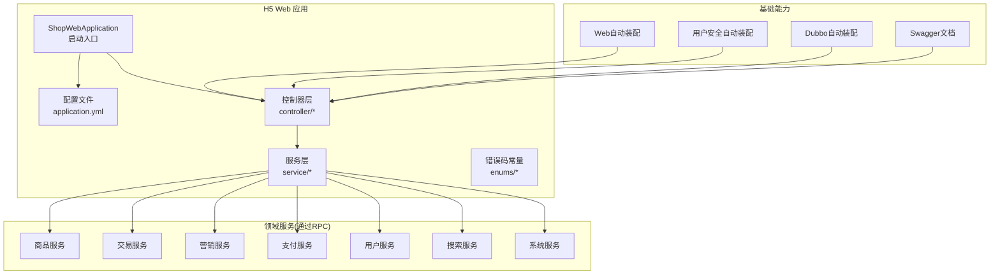
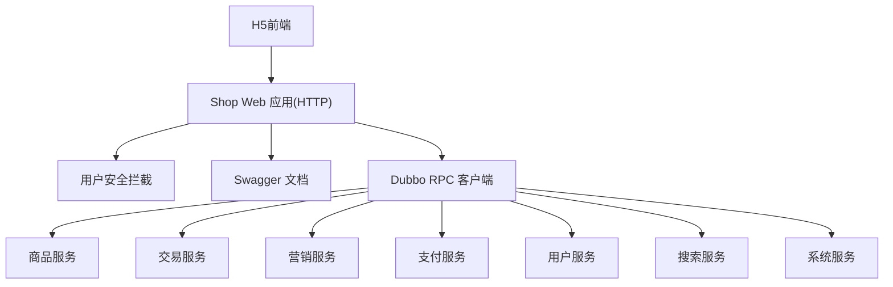
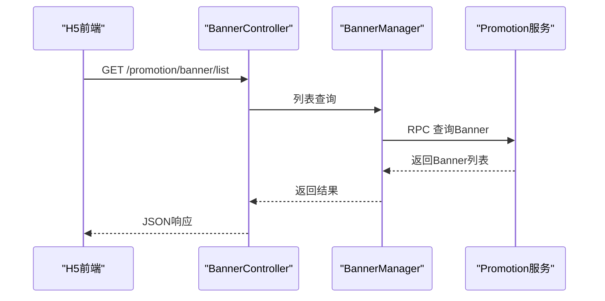
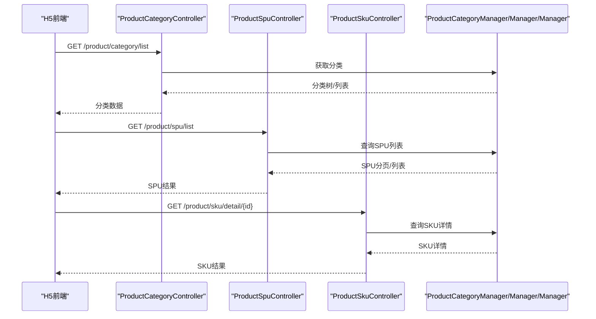
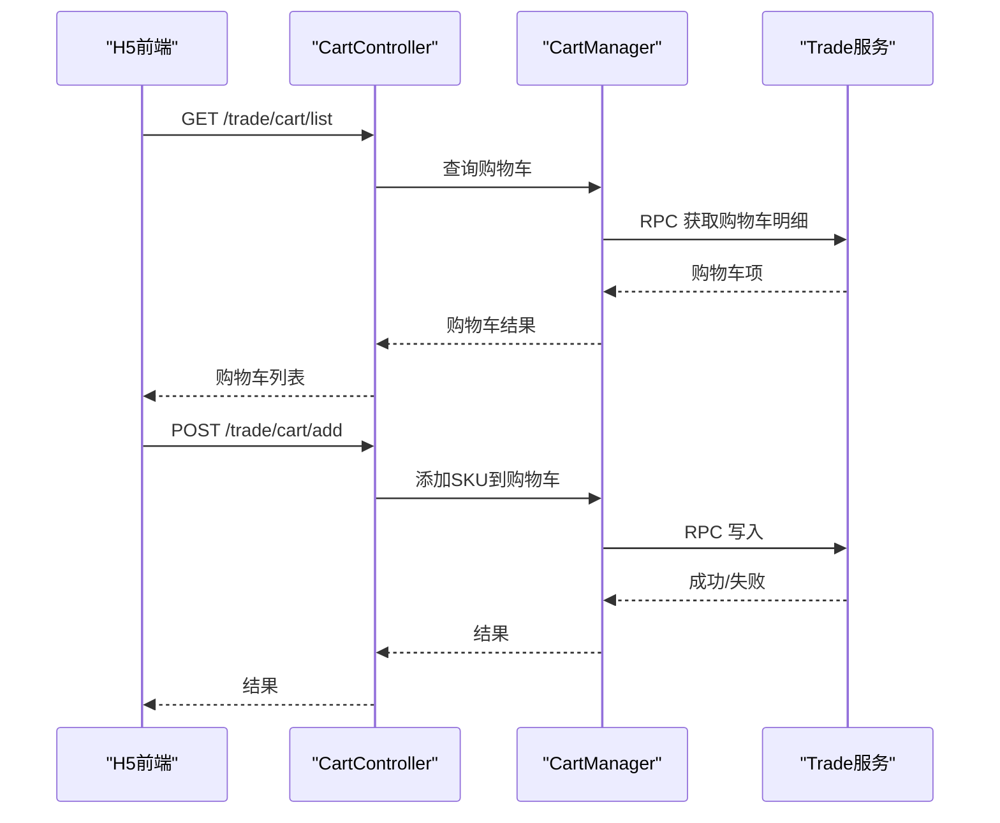
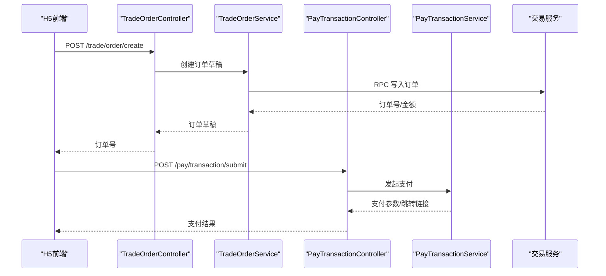
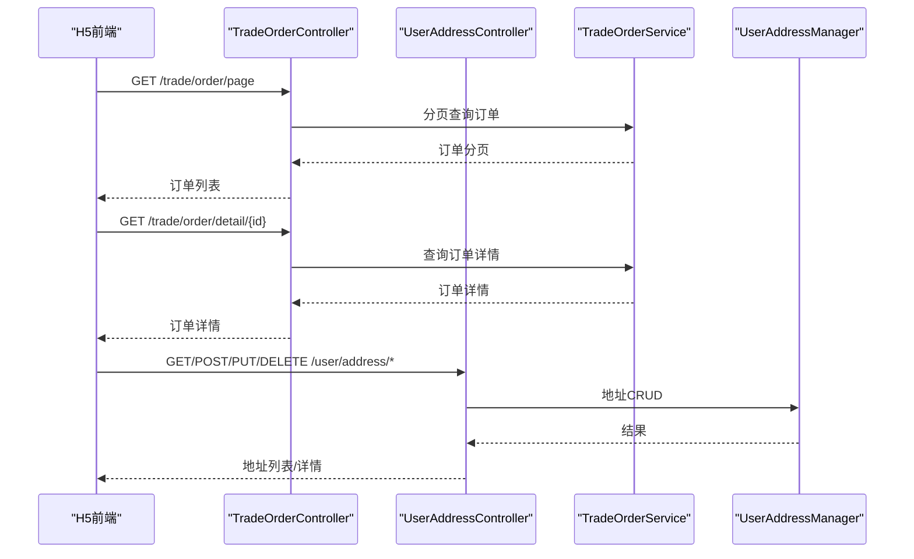
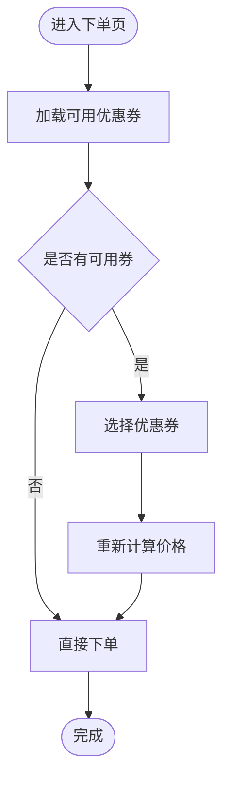
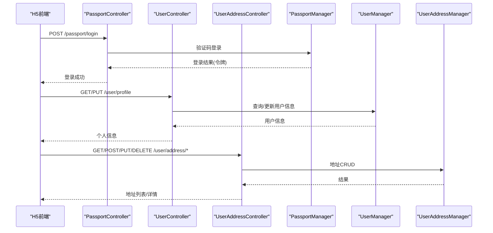
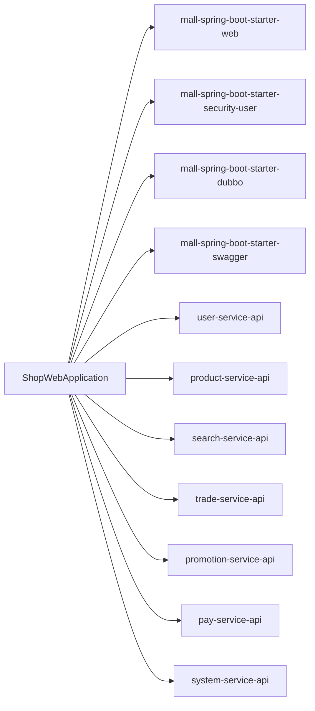

# H5商城功能

<cite>
**本文引用的文件**
- [功能列表-H5 商城.md](file://docs/guides/功能列表/功能列表-H5 商城.md)
- [README.md](file://README.md)
- [ShopWebApplication.java](file://shop-web-app/src/main/java/cn/iocoder/mall/shopweb/ShopWebApplication.java)
- [pom.xml](file://shop-web-app/pom.xml)
- [ProductCategoryController.java](file://shop-web-app/src/main/java/cn/iocoder/mall/shopweb/controller/product/ProductCategoryController.java)
- [ProductSpuController.java](file://shop-web-app/src/main/java/cn/iocoder/mall/shopweb/controller/product/ProductSpuController.java)
- [ProductSkuController.java](file://shop-web-app/src/main/java/cn/iocoder/mall/shopweb/controller/product/ProductSkuController.java)
- [BannerController.java](file://shop-web-app/src/main/java/cn/iocoder/mall/shopweb/controller/promotion/BannerController.java)
- [ProductRecommendController.java](file://shop-web-app/src/main/java/cn/iocoder/mall/shopweb/controller/promotion/ProductRecommendController.java)
- [CouponCardController.java](file://shop-web-app/src/main/java/cn/iocoder/mall/shopweb/controller/promotion/CouponCardController.java)
- [CartController.java](file://shop-web-app/src/main/java/cn/iocoder/mall/shopweb/controller/trade/CartController.java)
- [TradeOrderController.java](file://shop-web-app/src/main/java/cn/iocoder/mall/shopweb/controller/trade/TradeOrderController.java)
- [PassportController.java](file://shop-web-app/src/main/java/cn/iocoder/mall/shopweb/controller/user/PassportController.java)
- [UserController.java](file://shop-web-app/src/main/java/cn/iocoder/mall/shopweb/controller/user/UserController.java)
- [UserAddressController.java](file://shop-web-app/src/main/java/cn/iocoder/mall/shopweb/controller/user/UserAddressController.java)
- [PayTransactionController.java](file://shop-web-app/src/main/java/cn/iocoder/mall/shopweb/controller/pay/PayTransactionController.java)
- [ProductCategoryManager.java](file://shop-web-app/src/main/java/cn/iocoder/mall/shopweb/service/product/ProductCategoryManager.java)
- [ProductSpuManager.java](file://shop-web-app/src/main/java/cn/iocoder/mall/shopweb/service/product/ProductSpuManager.java)
- [ProductSkuManager.java](file://shop-web-app/src/main/java/cn/iocoder/mall/shopweb/service/product/ProductSkuManager.java)
- [BannerManager.java](file://shop-web-app/src/main/java/cn/iocoder/mall/shopweb/service/promotion/BannerManager.java)
- [ProductRecommendManager.java](file://shop-web-app/src/main/java/cn/iocoder/mall/shopweb/service/promotion/ProductRecommendManager.java)
- [CouponCardManager.java](file://shop-web-app/src/main/java/cn/iocoder/mall/shopweb/service/promotion/CouponCardManager.java)
- [CartManager.java](file://shop-web-app/src/main/java/cn/iocoder/mall/shopweb/service/trade/CartManager.java)
- [TradeOrderService.java](file://shop-web-app/src/main/java/cn/iocoder/mall/shopweb/service/trade/TradeOrderService.java)
- [PassportManager.java](file://shop-web-app/src/main/java/cn/iocoder/mall/shopweb/service/user/PassportManager.java)
- [UserManager.java](file://shop-web-app/src/main/java/cn/iocoder/mall/shopweb/service/user/UserManager.java)
- [UserAddressManager.java](file://shop-web-app/src/main/java/cn/iocoder/mall/shopweb/service/user/UserAddressManager.java)
- [PayTransactionService.java](file://shop-web-app/src/main/java/cn/iocoder/mall/shopweb/service/pay/PayTransactionService.java)
- [ShopWebErrorCodeConstants.java](file://shop-web-app/src/main/java/cn/iocoder/mall/shopweb/enums/ShopWebErrorCodeConstants.java)
- [CommonResult.java](file://common/common-framework/src/main/java/cn/iocoder/common/framework/vo/CommonResult.java)
- [ErrorCode.java](file://common/common-framework/src/main/java/cn/iocoder/common/framework/exception/ErrorCode.java)
- [ServiceException.java](file://common/common-framework/src/main/java/cn/iocoder/common/framework/exception/ServiceException.java)
- [GlobalException.java](file://common/common-framework/src/main/java/cn/iocoder/common/framework/exception/GlobalException.java)
- [UserSecurityAutoConfiguration.java](file://common/mall-spring-boot-starter-security-user/src/main/java/cn/iocoder/mall/security/user/config/UserSecurityAutoConfiguration.java)
- [UserSecurityProperties.java](file://common/mall-spring-boot-starter-security-user/src/main/java/cn/iocoder/mall/security/user/config/UserSecurityProperties.java)
- [CommonWebAutoConfiguration.java](file://common/mall-spring-boot-starter-web/src/main/java/cn/iocoder/mall/web/config/CommonWebAutoConfiguration.java)
- [SwaggerAutoConfiguration.java](file://common/mall-spring-boot-starter-swagger/src/main/java/cn/iocoder/mall/swagger/config/SwaggerAutoConfiguration.java)
- [DubbioWebAutoConfiguration.java](file://common/mall-spring-boot-starter-dubbo/src/main/java/cn/iocoder/mall/dubbo/config/DubboWebAutoConfiguration.java)
- [application.yml](file://shop-web-app/src/main/resources/application.yml)
</cite>

## 目录
1. [简介](#简介)
2. [项目结构](#项目结构)
3. [核心组件](#核心组件)
4. [架构总览](#架构总览)
5. [详细组件分析](#详细组件分析)
6. [依赖关系分析](#依赖关系分析)
7. [性能考量](#性能考量)
8. [故障排查指南](#故障排查指南)
9. [结论](#结论)
10. [附录](#附录)

## 简介
本文件面向H5商城平台的功能特性文档，围绕“首页展示、商品浏览、购物车、下单支付、订单管理、营销功能、用户中心”七大主题，结合后端微服务架构与HTTP API形态，系统化阐述各功能模块的实现原理、用户交互流程、技术架构与使用场景，并提供可定位到源码路径的参考信息，帮助开发者快速理解与扩展。

## 项目结构
H5商城后端由一个独立的Web工程提供HTTP接口，内部通过RPC调用多个领域服务（商品、订单、营销、支付、用户、搜索、系统），并集成安全、Web、Swagger、Dubbo等基础设施。

图表来源
- [ShopWebApplication.java:1-14](file://shop-web-app/src/main/java/cn/iocoder/mall/shopweb/ShopWebApplication.java#L1-L14)
- [application.yml](file://shop-web-app/src/main/resources/application.yml)
- [CommonWebAutoConfiguration.java](file://common/mall-spring-boot-starter-web/src/main/java/cn/iocoder/mall/web/config/CommonWebAutoConfiguration.java)
- [UserSecurityAutoConfiguration.java](file://common/mall-spring-boot-starter-security-user/src/main/java/cn/iocoder/mall/security/user/config/UserSecurityAutoConfiguration.java)
- [DubbioWebAutoConfiguration.java](file://common/mall-spring-boot-starter-dubbo/src/main/java/cn/iocoder/mall/dubbo/config/DubboWebAutoConfiguration.java)
- [SwaggerAutoConfiguration.java](file://common/mall-spring-boot-starter-swagger/src/main/java/cn/iocoder/mall/swagger/config/SwaggerAutoConfiguration.java)

章节来源
- [README.md:107-139](file://README.md#L107-L139)
- [pom.xml:28-121](file://shop-web-app/pom.xml#L28-L121)

## 核心组件
- 控制器层：承接前端请求，编排服务层，返回统一结果包装。
- 服务层：封装业务逻辑，负责参数校验、调用RPC、聚合结果。
- 错误处理：统一异常与错误码，保证前后端一致的错误语义。
- 基础设施：Web、安全、Swagger、Dubbo自动装配，确保接入一致性。

章节来源
- [CommonResult.java](file://common/common-framework/src/main/java/cn/iocoder/common/framework/vo/CommonResult.java)
- [ErrorCode.java](file://common/common-framework/src/main/java/cn/iocoder/common/framework/exception/ErrorCode.java)
- [ServiceException.java](file://common/common-framework/src/main/java/cn/iocoder/common/framework/exception/ServiceException.java)
- [GlobalException.java](file://common/common-framework/src/main/java/cn/iocoder/common/framework/exception/GlobalException.java)

## 架构总览
H5商城采用“Web网关 + 多RPC服务”的微服务架构。Shop Web应用作为HTTP入口，聚合商品、订单、营销、支付、用户、搜索、系统等服务，通过Dubbo进行远程调用；同时内置安全与Web自动装配，提供统一的鉴权、异常与文档能力。

图表来源
- [README.md:107-139](file://README.md#L107-L139)
- [pom.xml:45-92](file://shop-web-app/pom.xml#L45-L92)
- [UserSecurityAutoConfiguration.java](file://common/mall-spring-boot-starter-security-user/src/main/java/cn/iocoder/mall/security/user/config/UserSecurityAutoConfiguration.java)
- [SwaggerAutoConfiguration.java](file://common/mall-spring-boot-starter-swagger/src/main/java/cn/iocoder/mall/swagger/config/SwaggerAutoConfiguration.java)
- [DubbioWebAutoConfiguration.java](file://common/mall-spring-boot-starter-dubbo/src/main/java/cn/iocoder/mall/dubbo/config/DubboWebAutoConfiguration.java)

## 详细组件分析

### 首页展示功能
- 广告位：提供Banner轮播图或广告位列表接口，支持排序与状态筛选。
- 商品推荐：提供“手动推荐”商品列表，支持分页与过滤。
- 交互流程：H5前端拉取广告与推荐数据，渲染首页卡片流。

图表来源
- [BannerController.java](file://shop-web-app/src/main/java/cn/iocoder/mall/shopweb/controller/promotion/BannerController.java)
- [BannerManager.java](file://shop-web-app/src/main/java/cn/iocoder/mall/shopweb/service/promotion/BannerManager.java)

章节来源
- [功能列表-H5 商城.md:6-8](file://docs/guides/功能列表/功能列表-H5 商城.md#L6-L8)
- [ProductRecommendController.java](file://shop-web-app/src/main/java/cn/iocoder/mall/shopweb/controller/promotion/ProductRecommendController.java)
- [ProductRecommendManager.java](file://shop-web-app/src/main/java/cn/iocoder/mall/shopweb/service/promotion/ProductRecommendManager.java)

### 商品浏览功能
- 分类列表：获取商品分类树/列表，支持层级与筛选。
- 商品搜索：提供关键词搜索，返回SPU列表或分页结果。
- 商品详情：根据SPU或SKU维度返回详情、规格、库存、价格等。
- 交互流程：分类导航 -> 列表筛选/搜索 -> 详情页 -> 加入购物车/立即购买。

图表来源
- [ProductCategoryController.java](file://shop-web-app/src/main/java/cn/iocoder/mall/shopweb/controller/product/ProductCategoryController.java)
- [ProductSpuController.java](file://shop-web-app/src/main/java/cn/iocoder/mall/shopweb/controller/product/ProductSpuController.java)
- [ProductSkuController.java](file://shop-web-app/src/main/java/cn/iocoder/mall/shopweb/controller/product/ProductSkuController.java)
- [ProductCategoryManager.java](file://shop-web-app/src/main/java/cn/iocoder/mall/shopweb/service/product/ProductCategoryManager.java)
- [ProductSpuManager.java](file://shop-web-app/src/main/java/cn/iocoder/mall/shopweb/service/product/ProductSpuManager.java)
- [ProductSkuManager.java](file://shop-web-app/src/main/java/cn/iocoder/mall/shopweb/service/product/ProductSkuManager.java)

章节来源
- [功能列表-H5 商城.md:9-15](file://docs/guides/功能列表/功能列表-H5 商城.md#L9-L15)

### 购物车功能
- 购物车列表：获取当前用户购物车项集合。
- 新增/修改/删除：添加SKU、修改数量、删除条目。
- 结算准备：计算价格、可用优惠券、运费预估等。
- 交互流程：选择SKU -> 加入购物车 -> 修改数量 -> 去结算。

图表来源
- [CartController.java](file://shop-web-app/src/main/java/cn/iocoder/mall/shopweb/controller/trade/CartController.java)
- [CartManager.java](file://shop-web-app/src/main/java/cn/iocoder/mall/shopweb/service/trade/CartManager.java)

章节来源
- [功能列表-H5 商城.md](file://docs/guides/功能列表/功能列表-H5 商城.md#L24)

### 下单支付流程
- 直接购买：传入SKU与数量，生成订单草稿，进入支付。
- 购物车购买：传入购物车项，生成订单草稿，进入支付。
- 支付提交：调用支付服务发起支付，返回支付参数或跳转链接。
- 支付回调：支付服务异步通知，交易服务落库并更新订单状态。

图表来源
- [TradeOrderController.java](file://shop-web-app/src/main/java/cn/iocoder/mall/shopweb/controller/trade/TradeOrderController.java)
- [TradeOrderService.java](file://shop-web-app/src/main/java/cn/iocoder/mall/shopweb/service/trade/TradeOrderService.java)
- [PayTransactionController.java](file://shop-web-app/src/main/java/cn/iocoder/mall/shopweb/controller/pay/PayTransactionController.java)
- [PayTransactionService.java](file://shop-web-app/src/main/java/cn/iocoder/mall/shopweb/service/pay/PayTransactionService.java)

章节来源
- [功能列表-H5 商城.md:17-22](file://docs/guides/功能列表/功能列表-H5 商城.md#L17-L22)

### 订单管理功能
- 订单列表：按状态、时间范围分页查询。
- 订单详情：包含商品、收货人、物流、价格明细。
- 收货地址：新增/编辑/删除/设默认地址。
- 交互流程：我的订单 -> 列表筛选 -> 查看详情 -> 快捷操作（确认收货/申请售后）。

图表来源
- [TradeOrderController.java](file://shop-web-app/src/main/java/cn/iocoder/mall/shopweb/controller/trade/TradeOrderController.java)
- [UserAddressController.java](file://shop-web-app/src/main/java/cn/iocoder/mall/shopweb/controller/user/UserAddressController.java)
- [TradeOrderService.java](file://shop-web-app/src/main/java/cn/iocoder/mall/shopweb/service/trade/TradeOrderService.java)
- [UserAddressManager.java](file://shop-web-app/src/main/java/cn/iocoder/mall/shopweb/service/user/UserAddressManager.java)

章节来源
- [功能列表-H5 商城.md:16-25](file://docs/guides/功能列表/功能列表-H5 商城.md#L16-L25)

### 营销功能
- 优惠券：查询可领取/已领取/可用/已使用/已过期状态，支持按商品范围筛选。
- 使用流程：下单前选择可用券，系统计算抵扣金额。

图表来源
- [CouponCardController.java](file://shop-web-app/src/main/java/cn/iocoder/mall/shopweb/controller/promotion/CouponCardController.java)
- [CouponCardManager.java](file://shop-web-app/src/main/java/cn/iocoder/mall/shopweb/service/promotion/CouponCardManager.java)

章节来源
- [功能列表-H5 商城.md:26-28](file://docs/guides/功能列表/功能列表-H5 商城.md#L26-L28)

### 用户中心功能
- 登录注册：手机号验证码登录/注册，支持短信服务RPC。
- 个人信息：查询/修改昵称、头像、性别等。
- 收货地址：地址管理（增删改查）。

图表来源
- [PassportController.java](file://shop-web-app/src/main/java/cn/iocoder/mall/shopweb/controller/user/PassportController.java)
- [UserController.java](file://shop-web-app/src/main/java/cn/iocoder/mall/shopweb/controller/user/UserController.java)
- [UserAddressController.java](file://shop-web-app/src/main/java/cn/iocoder/mall/shopweb/controller/user/UserAddressController.java)
- [PassportManager.java](file://shop-web-app/src/main/java/cn/iocoder/mall/shopweb/service/user/PassportManager.java)
- [UserManager.java](file://shop-web-app/src/main/java/cn/iocoder/mall/shopweb/service/user/UserManager.java)
- [UserAddressManager.java](file://shop-web-app/src/main/java/cn/iocoder/mall/shopweb/service/user/UserAddressManager.java)

章节来源
- [功能列表-H5 商城.md:29-33](file://docs/guides/功能列表/功能列表-H5 商城.md#L29-L33)

## 依赖关系分析
- Web与安全：Web自动装配提供通用拦截与异常处理；用户安全自动装配提供登录态与权限拦截。
- RPC依赖：Shop Web应用直接依赖用户、商品、搜索、订单、营销、支付、系统服务API。
- 文档与监控：Swagger自动装配提供接口文档；Actuator提供健康与指标。

图表来源
- [pom.xml:28-121](file://shop-web-app/pom.xml#L28-L121)
- [CommonWebAutoConfiguration.java](file://common/mall-spring-boot-starter-web/src/main/java/cn/iocoder/mall/web/config/CommonWebAutoConfiguration.java)
- [UserSecurityAutoConfiguration.java](file://common/mall-spring-boot-starter-security-user/src/main/java/cn/iocoder/mall/security/user/config/UserSecurityAutoConfiguration.java)
- [DubbioWebAutoConfiguration.java](file://common/mall-spring-boot-starter-dubbo/src/main/java/cn/iocoder/mall/dubbo/config/DubboWebAutoConfiguration.java)
- [SwaggerAutoConfiguration.java](file://common/mall-spring-boot-starter-swagger/src/main/java/cn/iocoder/mall/swagger/config/SwaggerAutoConfiguration.java)

章节来源
- [pom.xml:45-92](file://shop-web-app/pom.xml#L45-L92)

## 性能考量
- 接口幂等与限流：在控制器层对高频接口（如下单、支付、购物车）实施幂等与限流策略，避免重复提交与突发流量。
- 缓存策略：对商品详情、分类、Banner等读多写少的数据进行缓存，降低RPC与数据库压力。
- 分页与索引：商品搜索、订单列表等分页接口需配合数据库索引与合理分页大小，避免超大数据量扫描。
- 异步通知：支付回调与订单状态变更采用消息队列异步处理，提升吞吐与可靠性。
- 监控与追踪：结合Actuator、SkyWalking与日志系统，持续观测接口耗时与错误率。

## 故障排查指南
- 统一错误码：所有业务异常通过统一错误码返回，便于前端识别与提示。
- 异常类型：区分业务异常与全局异常，分别映射到不同HTTP状态与错误码。
- 日志与追踪：结合请求ID与链路追踪，快速定位问题根因。
- 常见问题：
  - 登录态失效：检查用户安全拦截配置与令牌有效期。
  - RPC调用失败：检查服务注册发现、版本兼容与网络连通性。
  - 支付回调未到账：核对支付服务回调地址与签名校验。

章节来源
- [ShopWebErrorCodeConstants.java](file://shop-web-app/src/main/java/cn/iocoder/mall/shopweb/enums/ShopWebErrorCodeConstants.java)
- [ServiceException.java](file://common/common-framework/src/main/java/cn/iocoder/common/framework/exception/ServiceException.java)
- [GlobalException.java](file://common/common-framework/src/main/java/cn/iocoder/common/framework/exception/GlobalException.java)

## 结论
H5商城以Shop Web应用为核心，围绕首页、商品、购物车、订单、营销、支付与用户中心七大模块构建完整购物流程。通过清晰的控制器-服务分层与RPC解耦，结合统一的安全、Web与文档能力，既满足快速迭代需求，也为后续扩展与优化提供了稳定基座。

## 附录
- 快速开始与演示：参见项目README中的演示地址与环境搭建说明。
- 接口文档：Shop Web应用集成Swagger，可通过内置文档页面查看各模块接口定义。

章节来源
- [README.md:46-52](file://README.md#L46-L52)
- [SwaggerAutoConfiguration.java](file://common/mall-spring-boot-starter-swagger/src/main/java/cn/iocoder/mall/swagger/config/SwaggerAutoConfiguration.java)