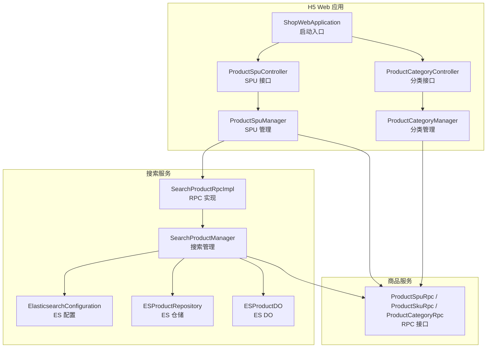
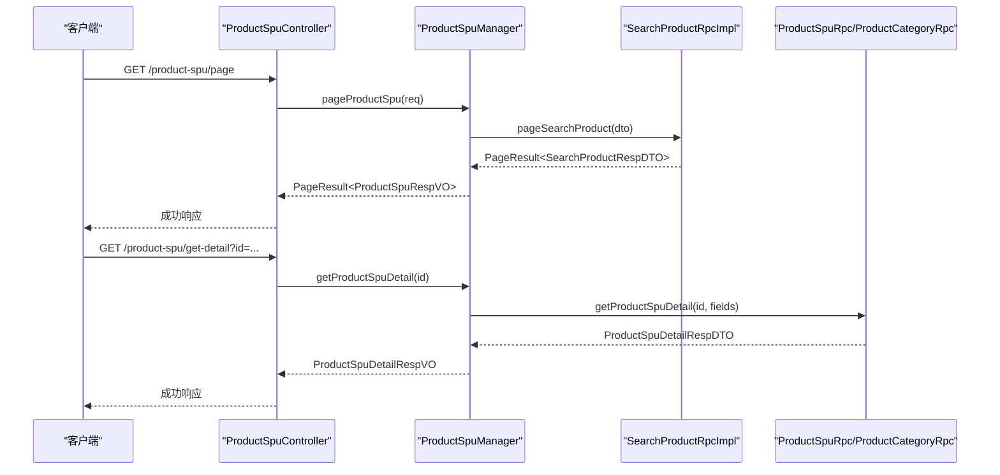
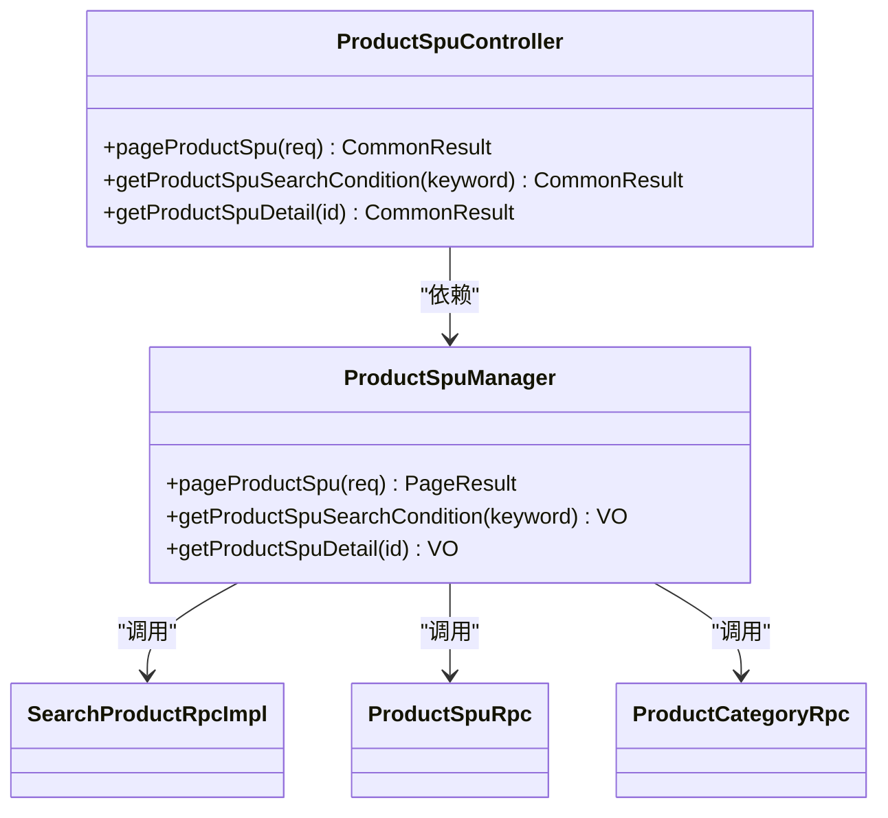
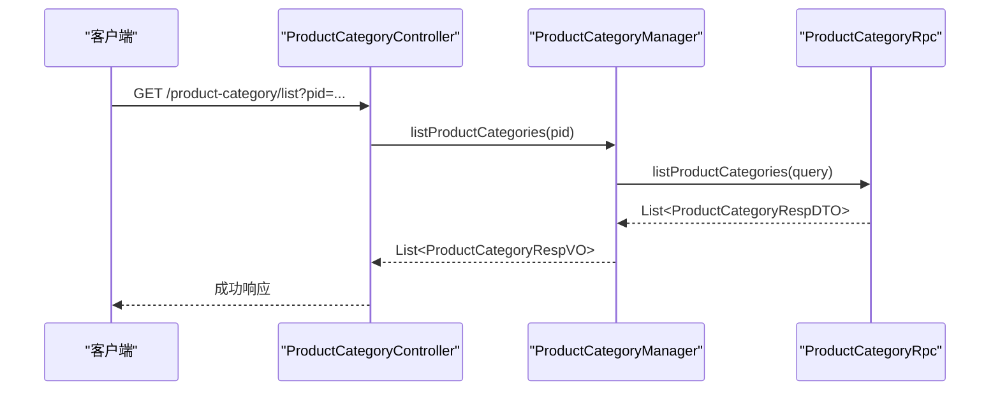
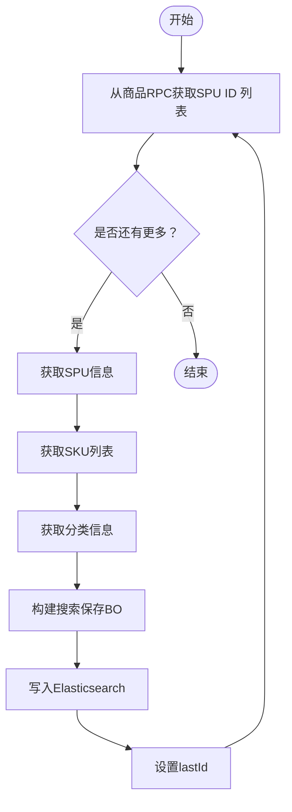
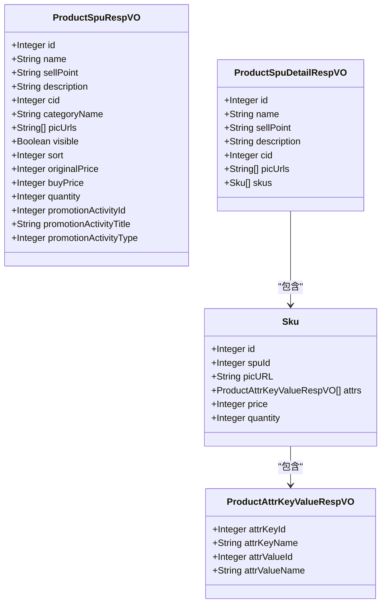
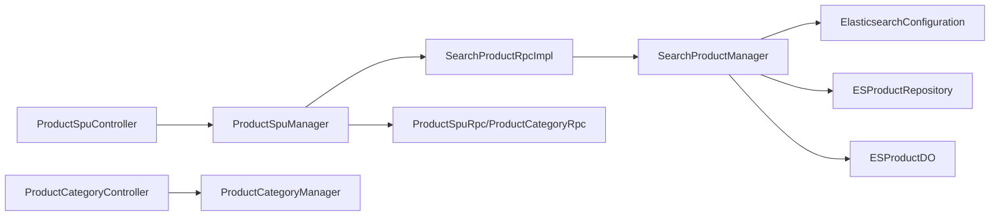

# 商品浏览功能

<cite>
**本文引用的文件**
- [ShopWebApplication.java](file://shop-web-app/src/main/java/cn/iocoder/mall/shopweb/ShopWebApplication.java)
- [ProductSpuController.java](file://shop-web-app/src/main/java/cn/iocoder/mall/shopweb/controller/product/ProductSpuController.java)
- [ProductCategoryController.java](file://shop-web-app/src/main/java/cn/iocoder/mall/shopweb/controller/product/ProductCategoryController.java)
- [ProductSpuManager.java](file://shop-web-app/src/main/java/cn/iocoder/mall/shopweb/service/product/ProductSpuManager.java)
- [ProductCategoryManager.java](file://shop-web-app/src/main/java/cn/iocoder/mall/shopweb/service/product/ProductCategoryManager.java)
- [ProductSpuRespVO.java](file://shop-web-app/src/main/java/cn/iocoder/mall/shopweb/controller/product/vo/product/ProductSpuRespVO.java)
- [ProductSpuDetailRespVO.java](file://shop-web-app/src/main/java/cn/iocoder/mall/shopweb/controller/product/vo/product/ProductSpuDetailRespVO.java)
- [ProductAttrKeyValueRespVO.java](file://shop-web-app/src/main/java/cn/iocoder/mall/shopweb/controller/product/vo/attr/ProductAttrKeyValueRespVO.java)
- [SearchProductManager.java](file://search-service-project/search-service-app/src/main/java/cn/iocoder/mall/searchservice/manager/product/SearchProductManager.java)
- [ElasticsearchConfiguration.java](file://search-service-project/search-service-app/src/main/java/cn/iocoder/mall/searchservice/config/ElasticsearchConfiguration.java)
- [ESProductRepository.java](file://search-service-project/search-service-app/src/main/java/cn/iocoder/mall/searchservice/dal/es/repository/ESProductRepository.java)
- [ESProductDO.java](file://search-service-project/search-service-app/src/main/java/cn/iocoder/mall/searchservice/dal/es/dataobject/ESProductDO.java)
- [SearchProductRpcImpl.java](file://search-service-project/search-service-app/src/main/java/cn/iocoder/mall/searchservice/rpc/product/SearchProductRpcImpl.java)
- [SearchProductRpc.java](file://search-service-project/search-service-api/src/main/java/cn/iocoder/mall/searchservice/rpc/product/SearchProductRpc.java)
- [SearchProductConditionReqDTO.java](file://search-service-project/search-service-api/src/main/java/cn/iocoder/mall/searchservice/rpc/product/dto/SearchProductConditionReqDTO.java)
- [SearchProductConditionRespDTO.java](file://search-service-project/search-service-api/src/main/java/cn/iocoder/mall/searchservice/rpc/product/dto/SearchProductConditionRespDTO.java)
- [SearchProductPageReqDTO.java](file://search-service-project/search-service-api/src/main/java/cn/iocoder/mall/searchservice/rpc/product/dto/SearchProductPageReqDTO.java)
- [SearchProductRespDTO.java](file://search-service-project/search-service-api/src/main/java/cn/iocoder/mall/searchservice/rpc/product/dto/SearchProductRespDTO.java)
- [SearchProductConditionFieldEnum.java](file://search-service-project/search-service-api/src/main/java/cn/iocoder/mall/searchservice/enums/product/SearchProductConditionFieldEnum.java)
- [application.yml](file://shop-web-app/src/main/resources/application.yml)
- [application.yml](file://search-service-app/src/main/resources/application.yml)
</cite>

## 目录
1. [简介](#简介)
2. [项目结构](#项目结构)
3. [核心组件](#核心组件)
4. [架构总览](#架构总览)
5. [详细组件分析](#详细组件分析)
6. [依赖关系分析](#依赖关系分析)
7. [性能考虑](#性能考虑)
8. [故障排查指南](#故障排查指南)
9. [结论](#结论)
10. [附录](#附录)

## 简介
本文件面向H5商城的商品浏览功能，系统性梳理从“商品分类列表展示”“商品搜索”“基于分类的商品列表”“商品详情页面”“SKU规格选择”到“数据结构设计、搜索算法实现、分类树形结构管理、信息聚合与缓存策略”的完整链路。文档同时提供API接口定义、参数说明、返回值格式与错误处理机制，并给出图片懒加载与用户体验优化建议。

## 项目结构
围绕商品浏览功能，涉及以下模块与文件：
- H5 Web应用（shop-web-app）：提供商品SPU分页、搜索条件、详情查询等HTTP接口；调用搜索服务与商品服务RPC。
- 搜索服务（search-service-app）：基于Elasticsearch实现商品检索、条件聚合、索引重建与消息驱动更新。
- 商品服务（product-service-app）：提供SPU、SKU、分类等基础数据的RPC能力。
- VO与转换层：前后端数据传输对象与转换器，确保接口数据结构稳定。

图表来源
- [ShopWebApplication.java:1-14](file://shop-web-app/src/main/java/cn/iocoder/mall/shopweb/ShopWebApplication.java#L1-L14)
- [ProductSpuController.java:1-53](file://shop-web-app/src/main/java/cn/iocoder/mall/shopweb/controller/product/ProductSpuController.java#L1-L53)
- [ProductCategoryController.java:1-37](file://shop-web-app/src/main/java/cn/iocoder/mall/shopweb/controller/product/ProductCategoryController.java#L1-L37)
- [ProductSpuManager.java:1-79](file://shop-web-app/src/main/java/cn/iocoder/mall/shopweb/service/product/ProductSpuManager.java#L1-L79)
- [ProductCategoryManager.java:1-34](file://shop-web-app/src/main/java/cn/iocoder/mall/shopweb/service/product/ProductCategoryManager.java#L1-L34)
- [SearchProductRpcImpl.java](file://search-service-project/search-service-app/src/main/java/cn/iocoder/mall/searchservice/rpc/product/SearchProductRpcImpl.java)
- [SearchProductManager.java:1-134](file://search-service-project/search-service-app/src/main/java/cn/iocoder/mall/searchservice/manager/product/SearchProductManager.java#L1-L134)
- [ElasticsearchConfiguration.java](file://search-service-project/search-service-app/src/main/java/cn/iocoder/mall/searchservice/config/ElasticsearchConfiguration.java)
- [ESProductRepository.java](file://search-service-project/search-service-app/src/main/java/cn/iocoder/mall/searchservice/dal/es/repository/ESProductRepository.java)
- [ESProductDO.java](file://search-service-project/search-service-app/src/main/java/cn/iocoder/mall/searchservice/dal/es/dataobject/ESProductDO.java)

章节来源
- [ShopWebApplication.java:1-14](file://shop-web-app/src/main/java/cn/iocoder/mall/shopweb/ShopWebApplication.java#L1-L14)
- [ProductSpuController.java:1-53](file://shop-web-app/src/main/java/cn/iocoder/mall/shopweb/controller/product/ProductSpuController.java#L1-L53)
- [ProductCategoryController.java:1-37](file://shop-web-app/src/main/java/cn/iocoder/mall/shopweb/controller/product/ProductCategoryController.java#L1-L37)
- [ProductSpuManager.java:1-79](file://shop-web-app/src/main/java/cn/iocoder/mall/shopweb/service/product/ProductSpuManager.java#L1-L79)
- [ProductCategoryManager.java:1-34](file://shop-web-app/src/main/java/cn/iocoder/mall/shopweb/service/product/ProductCategoryManager.java#L1-L34)
- [SearchProductManager.java:1-134](file://search-service-project/search-service-app/src/main/java/cn/iocoder/mall/searchservice/manager/product/SearchProductManager.java#L1-L134)

## 核心组件
- 商品SPU控制器：提供分页查询、搜索条件、详情查询接口。
- 商品分类控制器：提供按父分类编号查询子分类列表。
- 商品SPU管理器：封装对搜索RPC与商品RPC的调用，负责数据聚合与错误处理。
- 商品分类管理器：封装对商品RPC的分类查询调用。
- 搜索管理器：负责分页检索、条件聚合、索引重建与消息驱动更新。
- VO与转换层：定义响应结构并进行DTO/VO转换。

章节来源
- [ProductSpuController.java:22-52](file://shop-web-app/src/main/java/cn/iocoder/mall/shopweb/controller/product/ProductSpuController.java#L22-L52)
- [ProductCategoryController.java:20-36](file://shop-web-app/src/main/java/cn/iocoder/mall/shopweb/controller/product/ProductCategoryController.java#L20-L36)
- [ProductSpuManager.java:29-78](file://shop-web-app/src/main/java/cn/iocoder/mall/shopweb/service/product/ProductSpuManager.java#L29-L78)
- [ProductCategoryManager.java:16-33](file://shop-web-app/src/main/java/cn/iocoder/mall/shopweb/service/product/ProductCategoryManager.java#L16-L33)
- [SearchProductManager.java:30-133](file://search-service-project/search-service-app/src/main/java/cn/iocoder/mall/searchservice/manager/product/SearchProductManager.java#L30-L133)

## 架构总览
商品浏览的端到端流程如下：
- 分类列表：H5 Web应用调用分类管理器，通过商品RPC获取启用状态的子分类列表。
- 搜索条件：H5 Web应用调用SPU管理器，通过搜索RPC获取搜索条件（如分类维度），再回查分类信息。
- 商品列表：H5 Web应用调用SPU管理器，通过搜索RPC执行分页查询，返回聚合后的SPU列表。
- 商品详情：H5 Web应用调用SPU管理器，通过商品RPC获取SPU详情（包含SKU与属性），并进行VO转换。
- 搜索算法：搜索服务基于Elasticsearch实现分页检索与条件聚合；索引由商品RPC数据重建或消息驱动更新。

图表来源
- [ProductSpuController.java:31-50](file://shop-web-app/src/main/java/cn/iocoder/mall/shopweb/controller/product/ProductSpuController.java#L31-L50)
- [ProductSpuManager.java:45-76](file://shop-web-app/src/main/java/cn/iocoder/mall/shopweb/service/product/ProductSpuManager.java#L45-L76)
- [SearchProductRpcImpl.java](file://search-service-project/search-service-app/src/main/java/cn/iocoder/mall/searchservice/rpc/product/SearchProductRpcImpl.java)
- [SearchProductManager.java:49-58](file://search-service-project/search-service-app/src/main/java/cn/iocoder/mall/searchservice/manager/product/SearchProductManager.java#L49-L58)

## 详细组件分析

### 商品SPU控制器与管理器
- 控制器提供三个接口：
  - 分页查询：/product-spu/page
  - 搜索条件：/product-spu/search-condition?keyword=...
  - 详情查询：/product-spu/get-detail?id=...
- 管理器职责：
  - 分页：调用搜索RPC执行分页检索，转换为VO。
  - 搜索条件：调用搜索RPC获取条件（如分类ID集合），再调用商品RPC批量查询分类详情。
  - 详情：调用商品RPC获取SPU详情（含SKU与属性），转换为VO。

图表来源
- [ProductSpuController.java:22-52](file://shop-web-app/src/main/java/cn/iocoder/mall/shopweb/controller/product/ProductSpuController.java#L22-L52)
- [ProductSpuManager.java:29-78](file://shop-web-app/src/main/java/cn/iocoder/mall/shopweb/service/product/ProductSpuManager.java#L29-L78)

章节来源
- [ProductSpuController.java:31-50](file://shop-web-app/src/main/java/cn/iocoder/mall/shopweb/controller/product/ProductSpuController.java#L31-L50)
- [ProductSpuManager.java:45-76](file://shop-web-app/src/main/java/cn/iocoder/mall/shopweb/service/product/ProductSpuManager.java#L45-L76)

### 商品分类控制器与管理器
- 控制器提供接口：/product-category/list?pid=...
- 管理器职责：调用商品RPC按父分类编号与启用状态查询子分类列表，并进行VO转换。

图表来源
- [ProductCategoryController.java:29-34](file://shop-web-app/src/main/java/cn/iocoder/mall/shopweb/controller/product/ProductCategoryController.java#L29-L34)
- [ProductCategoryManager.java:26-31](file://shop-web-app/src/main/java/cn/iocoder/mall/shopweb/service/product/ProductCategoryManager.java#L26-L31)

章节来源
- [ProductCategoryController.java:29-34](file://shop-web-app/src/main/java/cn/iocoder/mall/shopweb/controller/product/ProductCategoryController.java#L29-L34)
- [ProductCategoryManager.java:26-31](file://shop-web-app/src/main/java/cn/iocoder/mall/shopweb/service/product/ProductCategoryManager.java#L26-L31)

### 搜索服务与Elasticsearch集成
- 管理器职责：
  - 分页检索：调用搜索服务执行分页查询，返回聚合后的结果。
  - 条件聚合：根据关键词与字段集合，返回可筛选的条件（如分类ID集合）。
  - 索引重建：从商品RPC增量拉取SPU ID，拉取SPU、SKU、分类后写入ES。
  - 消息驱动：监听商品更新消息，触发索引更新。
- ES配置与仓储：提供连接配置、仓库与DO映射。

图表来源
- [SearchProductManager.java:65-86](file://search-service-project/search-service-app/src/main/java/cn/iocoder/mall/searchservice/manager/product/SearchProductManager.java#L65-L86)
- [SearchProductManager.java:94-131](file://search-service-project/search-service-app/src/main/java/cn/iocoder/mall/searchservice/manager/product/SearchProductManager.java#L94-L131)

章节来源
- [SearchProductManager.java:49-58](file://search-service-project/search-service-app/src/main/java/cn/iocoder/mall/searchservice/manager/product/SearchProductManager.java#L49-L58)
- [SearchProductManager.java:65-86](file://search-service-project/search-service-app/src/main/java/cn/iocoder/mall/searchservice/manager/product/SearchProductManager.java#L65-L86)
- [SearchProductManager.java:94-131](file://search-service-project/search-service-app/src/main/java/cn/iocoder/mall/searchservice/manager/product/SearchProductManager.java#L94-L131)

### 数据模型与VO设计
- 商品SPU响应VO：包含基本信息（名称、卖点、描述、分类名、主图）、其他信息（上下架、排序）、SKU相关（原价、现价、库存）、促销活动字段。
- 商品SPU详情VO：包含SPU基本信息与SKU数组，SKU内含规格键值对、价格与库存。
- 规格键值对VO：规格KEY与VALUE的编号与名称。

图表来源
- [ProductSpuRespVO.java:10-61](file://shop-web-app/src/main/java/cn/iocoder/mall/shopweb/controller/product/vo/product/ProductSpuRespVO.java#L10-L61)
- [ProductSpuDetailRespVO.java:12-59](file://shop-web-app/src/main/java/cn/iocoder/mall/shopweb/controller/product/vo/product/ProductSpuDetailRespVO.java#L12-L59)
- [ProductAttrKeyValueRespVO.java:8-22](file://shop-web-app/src/main/java/cn/iocoder/mall/shopweb/controller/product/vo/attr/ProductAttrKeyValueRespVO.java#L8-L22)

章节来源
- [ProductSpuRespVO.java:10-61](file://shop-web-app/src/main/java/cn/iocoder/mall/shopweb/controller/product/vo/product/ProductSpuRespVO.java#L10-L61)
- [ProductSpuDetailRespVO.java:12-59](file://shop-web-app/src/main/java/cn/iocoder/mall/shopweb/controller/product/vo/product/ProductSpuDetailRespVO.java#L12-L59)
- [ProductAttrKeyValueRespVO.java:8-22](file://shop-web-app/src/main/java/cn/iocoder/mall/shopweb/controller/product/vo/attr/ProductAttrKeyValueRespVO.java#L8-L22)

### API接口文档

- 获取商品SPU分页
  - 方法与路径：GET /product-spu/page
  - 请求参数：见分页请求DTO
  - 返回值：分页结果，元素为商品SPU响应VO
  - 错误处理：内部统一通过CommonResult封装，调用方需检查checkError后再使用数据

- 获取商品搜索条件
  - 方法与路径：GET /product-spu/search-condition
  - 查询参数：
    - keyword：关键字（可选）
  - 返回值：包含分类列表的条件响应VO
  - 错误处理：同上

- 获取商品SPU详情
  - 方法与路径：GET /product-spu/get-detail
  - 查询参数：
    - id：SPU编号（必填）
  - 返回值：商品SPU详情VO（包含SKU与属性）
  - 错误处理：同上

- 获取商品分类列表
  - 方法与路径：GET /product-category/list
  - 查询参数：
    - pid：父分类编号（必填）
  - 返回值：分类响应VO列表
  - 错误处理：同上

章节来源
- [ProductSpuController.java:31-50](file://shop-web-app/src/main/java/cn/iocoder/mall/shopweb/controller/product/ProductSpuController.java#L31-L50)
- [ProductCategoryController.java:29-34](file://shop-web-app/src/main/java/cn/iocoder/mall/shopweb/controller/product/ProductCategoryController.java#L29-L34)

### 搜索算法实现
- 分页检索：搜索服务接收分页请求，调用ES执行查询，返回聚合后的结果。
- 条件聚合：根据关键词与字段集合，返回可筛选的条件（如分类ID集合），用于前端筛选面板。
- 索引重建：从商品RPC增量拉取SPU ID，拉取SPU、SKU、分类后写入ES；最小SKU价格作为原价与现价。
- 消息驱动：监听商品更新消息，触发索引更新，保证数据一致性。

章节来源
- [SearchProductManager.java:49-58](file://search-service-project/search-service-app/src/main/java/cn/iocoder/mall/searchservice/manager/product/SearchProductManager.java#L49-L58)
- [SearchProductManager.java:65-86](file://search-service-project/search-service-app/src/main/java/cn/iocoder/mall/searchservice/manager/product/SearchProductManager.java#L65-L86)
- [SearchProductManager.java:94-131](file://search-service-project/search-service-app/src/main/java/cn/iocoder/mall/searchservice/manager/product/SearchProductManager.java#L94-L131)

### 分类树形结构管理
- 启用状态过滤：分类查询时按启用状态过滤，避免展示无效分类。
- 层级查询：通过父分类编号pid递归查询子分类，形成树形结构（前端自行拼装）。

章节来源
- [ProductCategoryManager.java:26-31](file://shop-web-app/src/main/java/cn/iocoder/mall/shopweb/service/product/ProductCategoryManager.java#L26-L31)

### 商品详情信息聚合
- 详情聚合：SPU详情包含SPU基本信息与SKU数组；SKU内含规格键值对、价格与库存。
- 字段选择：详情查询时明确指定需要的字段（如SKU、属性），减少冗余数据传输。

章节来源
- [ProductSpuManager.java:71-76](file://shop-web-app/src/main/java/cn/iocoder/mall/shopweb/service/product/ProductSpuManager.java#L71-L76)
- [ProductSpuDetailRespVO.java:12-59](file://shop-web-app/src/main/java/cn/iocoder/mall/shopweb/controller/product/vo/product/ProductSpuDetailRespVO.java#L12-L59)

## 依赖关系分析
- 控制器依赖管理器；管理器依赖RPC接口；RPC接口对接商品服务与搜索服务。
- 搜索服务依赖Elasticsearch配置、仓储与DO；通过消息消费实现索引更新。
- 配置文件中包含Dubbo与ES连接信息，确保RPC与搜索服务正常运行。

图表来源
- [ProductSpuController.java:22-52](file://shop-web-app/src/main/java/cn/iocoder/mall/shopweb/controller/product/ProductSpuController.java#L22-L52)
- [ProductCategoryController.java:20-36](file://shop-web-app/src/main/java/cn/iocoder/mall/shopweb/controller/product/ProductCategoryController.java#L20-L36)
- [ProductSpuManager.java:29-43](file://shop-web-app/src/main/java/cn/iocoder/mall/shopweb/service/product/ProductSpuManager.java#L29-L43)
- [SearchProductRpcImpl.java](file://search-service-project/search-service-app/src/main/java/cn/iocoder/mall/searchservice/rpc/product/SearchProductRpcImpl.java)
- [SearchProductManager.java:30-47](file://search-service-project/search-service-app/src/main/java/cn/iocoder/mall/searchservice/manager/product/SearchProductManager.java#L30-L47)
- [ElasticsearchConfiguration.java](file://search-service-project/search-service-app/src/main/java/cn/iocoder/mall/searchservice/config/ElasticsearchConfiguration.java)

章节来源
- [application.yml](file://shop-web-app/src/main/resources/application.yml)
- [application.yml](file://search-service-app/src/main/resources/application.yml)

## 性能考虑
- 搜索性能
  - 使用Elasticsearch分页与条件聚合，避免全量扫描。
  - 索引重建采用分批拉取（固定批次大小），降低内存压力。
- RPC调用
  - 统一通过CommonResult封装，调用前先校验错误码，避免空指针。
  - 明确字段选择，减少不必要的数据传输。
- 缓存策略
  - 可在H5 Web应用层对热点分类与热门商品详情增加本地缓存，结合TTL与失效策略。
  - 对搜索条件（如分类ID集合）进行短期缓存，降低RPC调用频率。
- 图片优化
  - 采用懒加载策略，仅在进入可视区域时加载图片。
  - 支持WebP等现代格式，结合CDN加速。
- 用户体验
  - 列表页骨架屏与占位图，提升感知速度。
  - 详情页分步加载（主图、SKU、评价等），减少首屏阻塞。

## 故障排查指南
- 常见错误
  - RPC调用失败：检查服务注册中心与网络连通性；确认版本号配置正确。
  - ES不可用：检查ES集群状态与索引是否存在；确认写入流程无异常。
  - 数据为空：确认商品服务中SPU、SKU、分类数据是否完整；检查索引重建任务。
- 日志定位
  - 搜索服务在保存商品索引时记录错误日志，便于定位缺失数据。
  - 控制器与管理器均使用统一错误封装，优先检查checkError后的业务分支。
- 快速恢复
  - 重新触发索引重建任务，确保ES与商品服务数据一致。
  - 清理缓存后重试，验证接口可用性。

章节来源
- [SearchProductManager.java:94-117](file://search-service-project/search-service-app/src/main/java/cn/iocoder/mall/searchservice/manager/product/SearchProductManager.java#L94-L117)
- [ProductSpuManager.java:45-76](file://shop-web-app/src/main/java/cn/iocoder/mall/shopweb/service/product/ProductSpuManager.java#L45-L76)

## 结论
H5商城商品浏览功能以“控制器-管理器-RPC-搜索服务-ES”为核心链路，实现了从分类列表、搜索条件、商品列表到详情聚合的完整闭环。通过Elasticsearch与RPC的协同，既满足了高性能检索需求，又保持了良好的扩展性与可维护性。建议在生产环境中完善缓存与图片优化策略，持续监控索引重建与RPC调用健康度，保障用户体验与系统稳定性。

## 附录

### API定义与参数说明

- 获取商品SPU分页
  - 方法：GET
  - 路径：/product-spu/page
  - 请求参数：见分页请求DTO
  - 返回值：分页结果，元素为商品SPU响应VO
  - 错误处理：统一通过CommonResult封装

- 获取商品搜索条件
  - 方法：GET
  - 路径：/product-spu/search-condition
  - 查询参数：keyword（可选）
  - 返回值：包含分类列表的条件响应VO
  - 错误处理：统一通过CommonResult封装

- 获取商品SPU详情
  - 方法：GET
  - 路径：/product-spu/get-detail
  - 查询参数：id（必填）
  - 返回值：商品SPU详情VO（包含SKU与属性）
  - 错误处理：统一通过CommonResult封装

- 获取商品分类列表
  - 方法：GET
  - 路径：/product-category/list
  - 查询参数：pid（必填）
  - 返回值：分类响应VO列表
  - 错误处理：统一通过CommonResult封装

章节来源
- [ProductSpuController.java:31-50](file://shop-web-app/src/main/java/cn/iocoder/mall/shopweb/controller/product/ProductSpuController.java#L31-L50)
- [ProductCategoryController.java:29-34](file://shop-web-app/src/main/java/cn/iocoder/mall/shopweb/controller/product/ProductCategoryController.java#L29-L34)