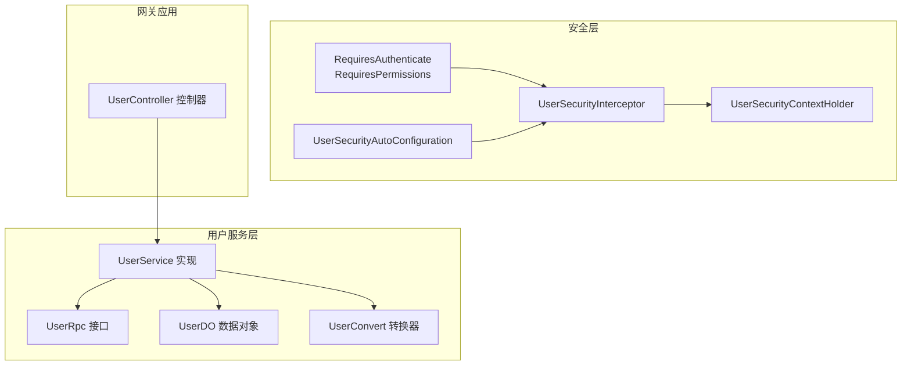
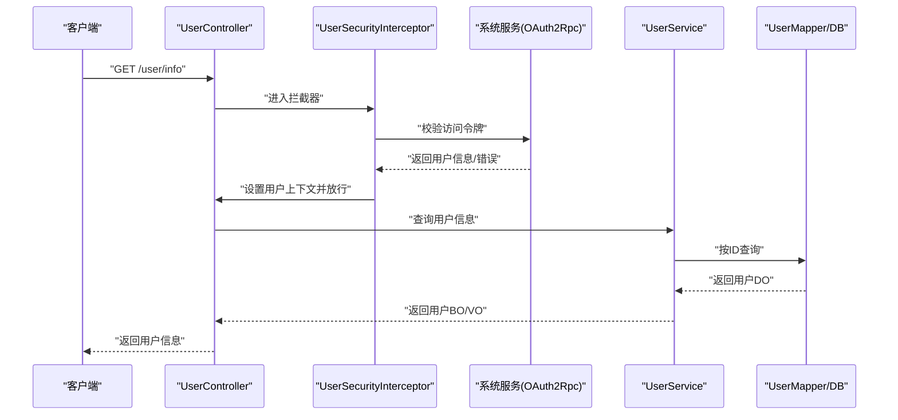
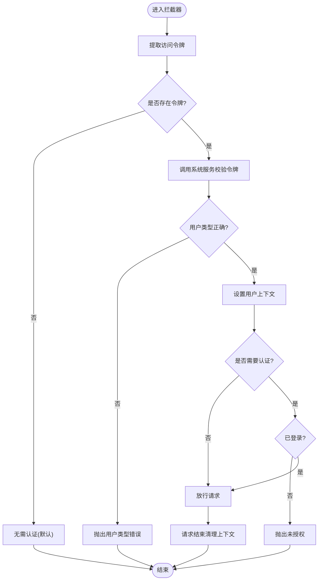
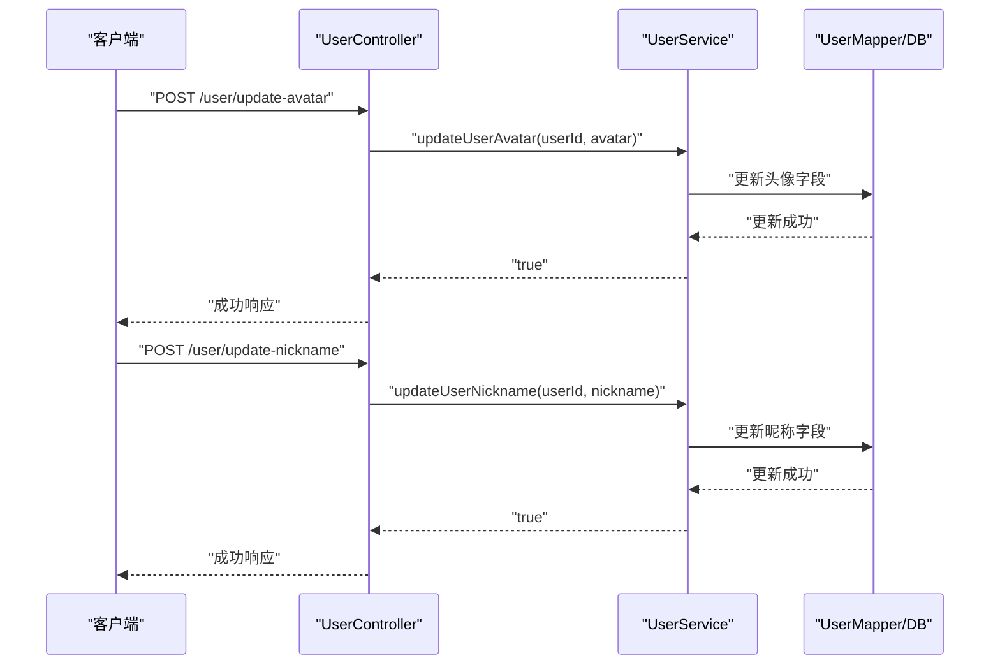
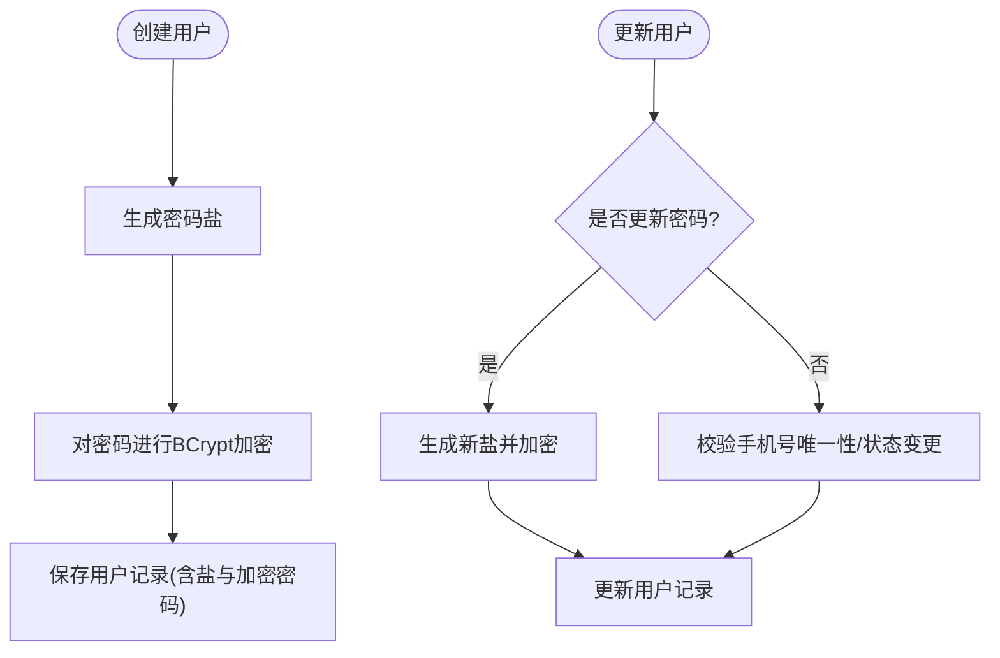
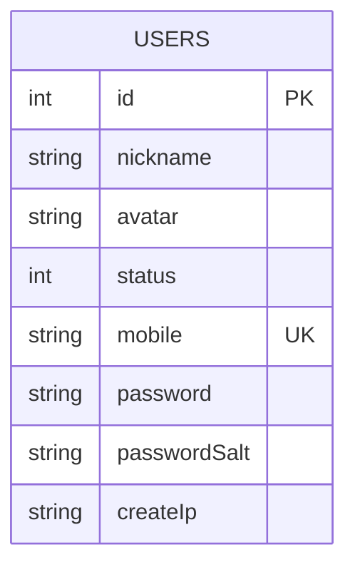
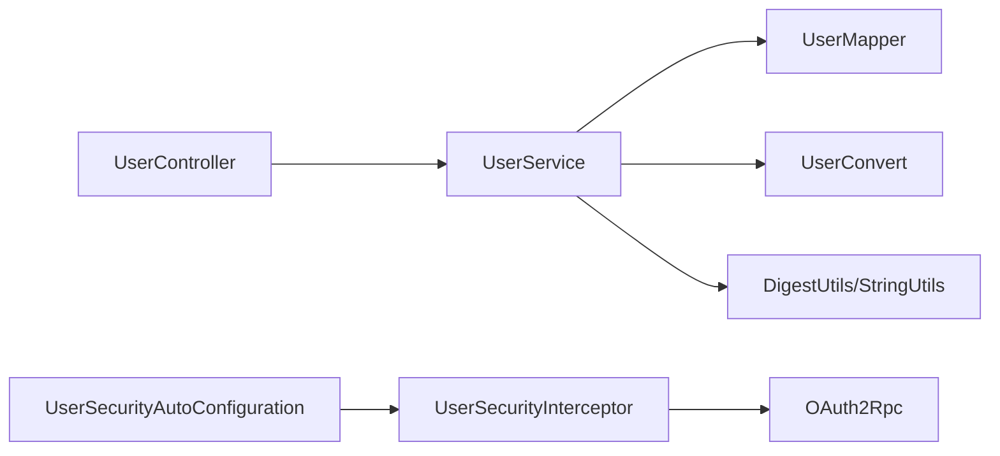

# 用户中心功能

<cite>
**本文引用的文件**
- [RequiresAuthenticate.java](file://common/mall-security-annotations/src/main/java/cn/iocoder/security/annotations/RequiresAuthenticate.java)
- [RequiresPermissions.java](file://common/mall-security-annotations/src/main/java/cn/iocoder/security/annotations/RequiresPermissions.java)
- [UserSecurityAutoConfiguration.java](file://common/mall-spring-boot-starter-security-user/src/main/java/cn/iocoder/mall/security/user/config/UserSecurityAutoConfiguration.java)
- [UserSecurityProperties.java](file://common/mall-spring-boot-starter-security-user/src/main/java/cn/iocoder/mall/security/user/config/UserSecurityProperties.java)
- [UserSecurityContextHolder.java](file://common/mall-spring-boot-starter-security-user/src/main/java/cn/iocoder/mall/security/user/core/context/UserSecurityContextHolder.java)
- [UserSecurityInterceptor.java](file://common/mall-spring-boot-starter-security-user/src/main/java/cn/iocoder/mall/security/user/core/interceptor/UserSecurityInterceptor.java)
- [UserRpc.java](file://user-service-project/user-service-api/src/main/java/cn/iocoder/mall/userservice/rpc/user/UserRpc.java)
- [UserCreateReqDTO.java](file://user-service-project/user-service-api/src/main/java/cn/iocoder/mall/userservice/rpc/user/dto/UserCreateReqDTO.java)
- [UserController.java](file://shop-web-app/src/main/java/cn/iocoder/mall/shopweb/controller/user/UserController.java)
- [UserService.java](file://user-service-project/user-service-app/src/main/java/cn/iocoder/mall/userservice/service/user/UserService.java)
- [UserDO.java](file://user-service-project/user-service-app/src/main/java/cn/iocoder/mall/userservice/dal/mysql/dataobject/user/UserDO.java)
- [UserConvert.java](file://user-service-project/user-service-app/src/main/java/cn/iocoder/mall/userservice/convert/user/UserConvert.java)
</cite>

## 目录
1. [简介](#简介)
2. [项目结构](#项目结构)
3. [核心组件](#核心组件)
4. [架构总览](#架构总览)
5. [详细组件分析](#详细组件分析)
6. [依赖分析](#依赖分析)
7. [性能考虑](#性能考虑)
8. [故障排查指南](#故障排查指南)
9. [结论](#结论)
10. [附录](#附录)

## 简介
本文件面向H5商城“用户中心”功能，系统性阐述用户登录注册、个人信息管理、账户安全设置、消息通知等能力的实现方式与最佳实践。重点覆盖：
- 用户认证机制与会话上下文管理
- 密码加密策略与安全存储
- 权限控制与接口保护
- 用户数据模型与API接口设计
- 安全防护与隐私保护策略
- 用户体验优化建议

## 项目结构
用户中心相关代码分布在以下模块：
- 安全注解与拦截器：提供统一的用户认证与权限注解、拦截器与上下文管理
- 用户服务：负责用户数据的持久化、密码加密与业务逻辑
- 网关应用：对外暴露用户中心API，调用用户服务并返回结果

图表来源
- [UserSecurityAutoConfiguration.java:1-48](file://common/mall-spring-boot-starter-security-user/src/main/java/cn/iocoder/mall/security/user/config/UserSecurityAutoConfiguration.java#L1-L48)
- [UserSecurityInterceptor.java:1-78](file://common/mall-spring-boot-starter-security-user/src/main/java/cn/iocoder/mall/security/user/core/interceptor/UserSecurityInterceptor.java#L1-L78)
- [UserSecurityContextHolder.java:1-36](file://common/mall-spring-boot-starter-security-user/src/main/java/cn/iocoder/mall/security/user/core/context/UserSecurityContextHolder.java#L1-L36)
- [UserRpc.java:1-55](file://user-service-project/user-service-api/src/main/java/cn/iocoder/mall/userservice/rpc/user/UserRpc.java#L1-L55)
- [UserService.java:1-118](file://user-service-project/user-service-app/src/main/java/cn/iocoder/mall/userservice/service/user/UserService.java#L1-L118)
- [UserDO.java:1-58](file://user-service-project/user-service-app/src/main/java/cn/iocoder/mall/userservice/dal/mysql/dataobject/user/UserDO.java#L1-L58)
- [UserConvert.java:1-50](file://user-service-project/user-service-app/src/main/java/cn/iocoder/mall/userservice/convert/user/UserConvert.java#L1-L50)
- [UserController.java:1-51](file://shop-web-app/src/main/java/cn/iocoder/mall/shopweb/controller/user/UserController.java#L1-L51)

章节来源
- [UserSecurityAutoConfiguration.java:1-48](file://common/mall-spring-boot-starter-security-user/src/main/java/cn/iocoder/mall/security/user/config/UserSecurityAutoConfiguration.java#L1-L48)
- [UserSecurityInterceptor.java:1-78](file://common/mall-spring-boot-starter-security-user/src/main/java/cn/iocoder/mall/security/user/core/interceptor/UserSecurityInterceptor.java#L1-L78)
- [UserRpc.java:1-55](file://user-service-project/user-service-api/src/main/java/cn/iocoder/mall/userservice/rpc/user/UserRpc.java#L1-L55)
- [UserService.java:1-118](file://user-service-project/user-service-app/src/main/java/cn/iocoder/mall/userservice/service/user/UserService.java#L1-L118)
- [UserDO.java:1-58](file://user-service-project/user-service-app/src/main/java/cn/iocoder/mall/userservice/dal/mysql/dataobject/user/UserDO.java#L1-L58)
- [UserConvert.java:1-50](file://user-service-project/user-service-app/src/main/java/cn/iocoder/mall/userservice/convert/user/UserConvert.java#L1-L50)
- [UserController.java:1-51](file://shop-web-app/src/main/java/cn/iocoder/mall/shopweb/controller/user/UserController.java#L1-L51)

## 核心组件
- 安全注解
  - 认证注解：用于标记接口需登录后访问
  - 权限注解：用于标记接口需具备特定权限标识
- 安全拦截器
  - 从请求头解析访问令牌，调用系统服务校验令牌有效性与用户类型，注入用户上下文
  - 对标注认证或权限注解的方法进行强制校验
- 用户控制器
  - 提供用户信息查询、头像与昵称更新等接口，并通过注解声明认证要求
- 用户服务
  - 负责用户数据读写、密码加密与唯一性校验
  - 提供创建用户、更新用户、分页查询等能力
- 数据模型与转换
  - 用户DO承载字段与索引；转换器负责DTO/BO/DO之间的映射

章节来源
- [RequiresAuthenticate.java:1-19](file://common/mall-security-annotations/src/main/java/cn/iocoder/security/annotations/RequiresAuthenticate.java#L1-L19)
- [RequiresPermissions.java:1-25](file://common/mall-security-annotations/src/main/java/cn/iocoder/security/annotations/RequiresPermissions.java#L1-L25)
- [UserSecurityInterceptor.java:1-78](file://common/mall-spring-boot-starter-security-user/src/main/java/cn/iocoder/mall/security/user/core/interceptor/UserSecurityInterceptor.java#L1-L78)
- [UserController.java:1-51](file://shop-web-app/src/main/java/cn/iocoder/mall/shopweb/controller/user/UserController.java#L1-L51)
- [UserService.java:1-118](file://user-service-project/user-service-app/src/main/java/cn/iocoder/mall/userservice/service/user/UserService.java#L1-L118)
- [UserDO.java:1-58](file://user-service-project/user-service-app/src/main/java/cn/iocoder/mall/userservice/dal/mysql/dataobject/user/UserDO.java#L1-L58)
- [UserConvert.java:1-50](file://user-service-project/user-service-app/src/main/java/cn/iocoder/mall/userservice/convert/user/UserConvert.java#L1-L50)

## 架构总览
用户中心采用“网关控制器 -> 用户服务 -> 数据库”的分层架构，配合全局安全拦截器在进入业务前完成认证与权限校验。

图表来源
- [UserSecurityInterceptor.java:29-58](file://common/mall-spring-boot-starter-security-user/src/main/java/cn/iocoder/mall/security/user/core/interceptor/UserSecurityInterceptor.java#L29-L58)
- [UserController.java:27-30](file://shop-web-app/src/main/java/cn/iocoder/mall/shopweb/controller/user/UserController.java#L27-L30)
- [UserService.java:29-32](file://user-service-project/user-service-app/src/main/java/cn/iocoder/mall/userservice/service/user/UserService.java#L29-L32)

## 详细组件分析

### 安全拦截器与认证流程
- 请求进入拦截器后，从请求头提取访问令牌
- 调用系统服务校验令牌有效性，并限定用户类型为普通用户
- 将用户ID与类型写入请求上下文与安全上下文，便于后续业务使用
- 对标注认证或权限注解的方法进行强制校验，未满足条件抛出未授权异常
- 请求完成后清理安全上下文，避免线程复用导致的数据残留

图表来源
- [UserSecurityInterceptor.java:29-75](file://common/mall-spring-boot-starter-security-user/src/main/java/cn/iocoder/mall/security/user/core/interceptor/UserSecurityInterceptor.java#L29-L75)

章节来源
- [UserSecurityInterceptor.java:1-78](file://common/mall-spring-boot-starter-security-user/src/main/java/cn/iocoder/mall/security/user/core/interceptor/UserSecurityInterceptor.java#L1-L78)
- [UserSecurityAutoConfiguration.java:37-45](file://common/mall-spring-boot-starter-security-user/src/main/java/cn/iocoder/mall/security/user/config/UserSecurityAutoConfiguration.java#L37-L45)
- [UserSecurityContextHolder.java:8-35](file://common/mall-spring-boot-starter-security-user/src/main/java/cn/iocoder/mall/security/user/core/context/UserSecurityContextHolder.java#L8-L35)

### 用户控制器与接口
- 用户信息查询：需登录，返回用户基本信息
- 更新头像：需登录，接收头像URL并调用服务更新
- 更新昵称：需登录，接收昵称并调用服务更新

图表来源
- [UserController.java:32-48](file://shop-web-app/src/main/java/cn/iocoder/mall/shopweb/controller/user/UserController.java#L32-L48)
- [UserService.java:66-92](file://user-service-project/user-service-app/src/main/java/cn/iocoder/mall/userservice/service/user/UserService.java#L66-L92)

章节来源
- [UserController.java:1-51](file://shop-web-app/src/main/java/cn/iocoder/mall/shopweb/controller/user/UserController.java#L1-L51)

### 用户服务与密码加密
- 创建用户：生成随机盐，对密码进行BCrypt加密后保存
- 更新用户：若更新密码则重新生成盐并加密；校验手机号唯一性与状态变更合法性
- 查询用户：按ID或手机号查询；支持分页查询

图表来源
- [UserService.java:50-64](file://user-service-project/user-service-app/src/main/java/cn/iocoder/mall/userservice/service/user/UserService.java#L50-L64)
- [UserService.java:84-92](file://user-service-project/user-service-app/src/main/java/cn/iocoder/mall/userservice/service/user/UserService.java#L84-L92)

章节来源
- [UserService.java:1-118](file://user-service-project/user-service-app/src/main/java/cn/iocoder/mall/userservice/service/user/UserService.java#L1-L118)
- [UserCreateReqDTO.java:1-36](file://user-service-project/user-service-api/src/main/java/cn/iocoder/mall/userservice/rpc/user/dto/UserCreateReqDTO.java#L1-L36)
- [UserDO.java:1-58](file://user-service-project/user-service-app/src/main/java/cn/iocoder/mall/userservice/dal/mysql/dataobject/user/UserDO.java#L1-L58)
- [UserConvert.java:20-49](file://user-service-project/user-service-app/src/main/java/cn/iocoder/mall/userservice/convert/user/UserConvert.java#L20-L49)

### 数据模型与API定义
- 用户数据对象包含：主键、昵称、头像、状态、手机号、加密密码、密码盐、注册IP等字段
- 用户创建请求DTO包含手机号、可选密码、IP等字段
- 用户RPC接口提供查询、创建、更新、分页等能力

图表来源
- [UserDO.java:15-57](file://user-service-project/user-service-app/src/main/java/cn/iocoder/mall/userservice/dal/mysql/dataobject/user/UserDO.java#L15-L57)

章节来源
- [UserRpc.java:12-54](file://user-service-project/user-service-api/src/main/java/cn/iocoder/mall/userservice/rpc/user/UserRpc.java#L12-L54)
- [UserCreateReqDTO.java:13-35](file://user-service-project/user-service-api/src/main/java/cn/iocoder/mall/userservice/rpc/user/dto/UserCreateReqDTO.java#L13-L35)
- [UserDO.java:19-55](file://user-service-project/user-service-app/src/main/java/cn/iocoder/mall/userservice/dal/mysql/dataobject/user/UserDO.java#L19-L55)

## 依赖分析
- 控制器依赖用户管理器（调用业务服务）
- 用户服务依赖Mapper与转换器，同时依赖通用工具类进行密码加密与校验
- 安全拦截器依赖系统服务的OAuth2能力进行令牌校验
- 安全自动配置注册拦截器并排除无需认证的路径

图表来源
- [UserController.java:21-22](file://shop-web-app/src/main/java/cn/iocoder/mall/shopweb/controller/user/UserController.java#L21-L22)
- [UserService.java:26-27](file://user-service-project/user-service-app/src/main/java/cn/iocoder/mall/userservice/service/user/UserService.java#L26-L27)
- [UserConvert.java:20-23](file://user-service-project/user-service-app/src/main/java/cn/iocoder/mall/userservice/convert/user/UserConvert.java#L20-L23)
- [UserSecurityInterceptor.java:26-27](file://common/mall-spring-boot-starter-security-user/src/main/java/cn/iocoder/mall/security/user/core/interceptor/UserSecurityInterceptor.java#L26-L27)
- [UserSecurityAutoConfiguration.java:32-35](file://common/mall-spring-boot-starter-security-user/src/main/java/cn/iocoder/mall/security/user/config/UserSecurityAutoConfiguration.java#L32-L35)

章节来源
- [UserSecurityAutoConfiguration.java:1-48](file://common/mall-spring-boot-starter-security-user/src/main/java/cn/iocoder/mall/security/user/config/UserSecurityAutoConfiguration.java#L1-L48)
- [UserSecurityInterceptor.java:1-78](file://common/mall-spring-boot-starter-security-user/src/main/java/cn/iocoder/mall/security/user/core/interceptor/UserSecurityInterceptor.java#L1-L78)
- [UserController.java:1-51](file://shop-web-app/src/main/java/cn/iocoder/mall/shopweb/controller/user/UserController.java#L1-L51)
- [UserService.java:1-118](file://user-service-project/user-service-app/src/main/java/cn/iocoder/mall/userservice/service/user/UserService.java#L1-L118)
- [UserConvert.java:1-50](file://user-service-project/user-service-app/src/main/java/cn/iocoder/mall/userservice/convert/user/UserConvert.java#L1-L50)

## 性能考虑
- 令牌校验与用户类型校验仅在拦截器阶段执行一次，避免重复校验
- 用户信息查询走主键或手机号索引，确保查询效率
- 密码加密采用BCrypt，成本较高但安全性高，建议在批量导入或初始化场景谨慎使用
- 建议对频繁更新的字段（如头像、昵称）增加缓存策略，降低数据库压力

## 故障排查指南
- 未登录访问受保护接口
  - 现象：返回未授权错误
  - 排查：确认请求头携带访问令牌；检查令牌是否有效；确认接口是否标注认证注解
- 用户类型不匹配
  - 现象：抛出用户类型错误
  - 排查：确认令牌签发给普通用户；检查系统侧用户类型配置
- 手机号冲突或状态异常
  - 现象：更新失败并提示手机号已存在或状态相同
  - 排查：确认手机号唯一性约束；检查状态变更是否合理
- 密码更新失败
  - 现象：更新密码时报错
  - 排查：确认传入密码非空且符合长度要求；检查盐生成与加密流程

章节来源
- [UserSecurityInterceptor.java:60-69](file://common/mall-spring-boot-starter-security-user/src/main/java/cn/iocoder/mall/security/user/core/interceptor/UserSecurityInterceptor.java#L60-L69)
- [UserService.java:72-82](file://user-service-project/user-service-app/src/main/java/cn/iocoder/mall/userservice/service/user/UserService.java#L72-L82)

## 结论
用户中心通过统一的安全拦截器与认证注解，实现了对用户接口的集中保护；结合BCrypt密码加密与唯一性校验，保障了账户安全与数据一致性。控制器层以最小职责暴露必要接口，服务层专注业务与数据处理，整体架构清晰、扩展性强。

## 附录

### API接口清单（用户中心）
- 获取用户信息
  - 方法：GET
  - 路径：/user/info
  - 认证：是
  - 返回：用户信息对象
- 更新头像
  - 方法：POST
  - 路径：/user/update-avatar
  - 参数：avatar（头像URL）
  - 认证：是
  - 返回：布尔值
- 更新昵称
  - 方法：POST
  - 路径：/user/update-nickname
  - 参数：nickname（昵称）
  - 认证：是
  - 返回：布尔值

章节来源
- [UserController.java:24-48](file://shop-web-app/src/main/java/cn/iocoder/mall/shopweb/controller/user/UserController.java#L24-L48)