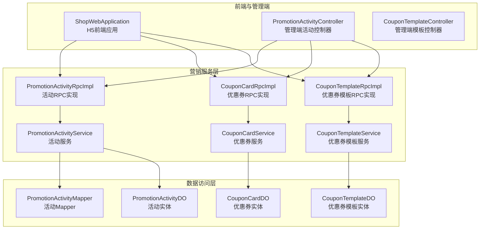
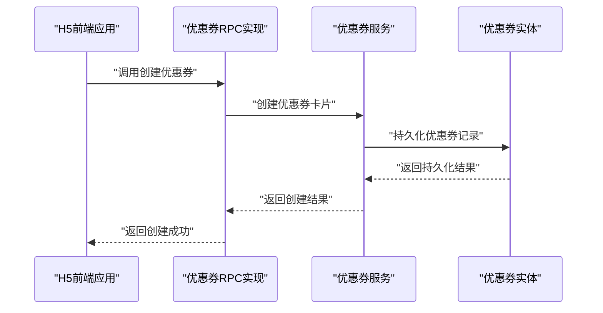
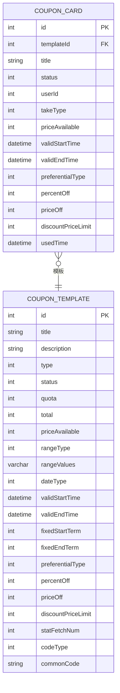
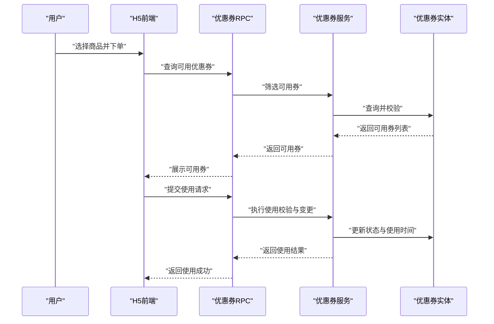
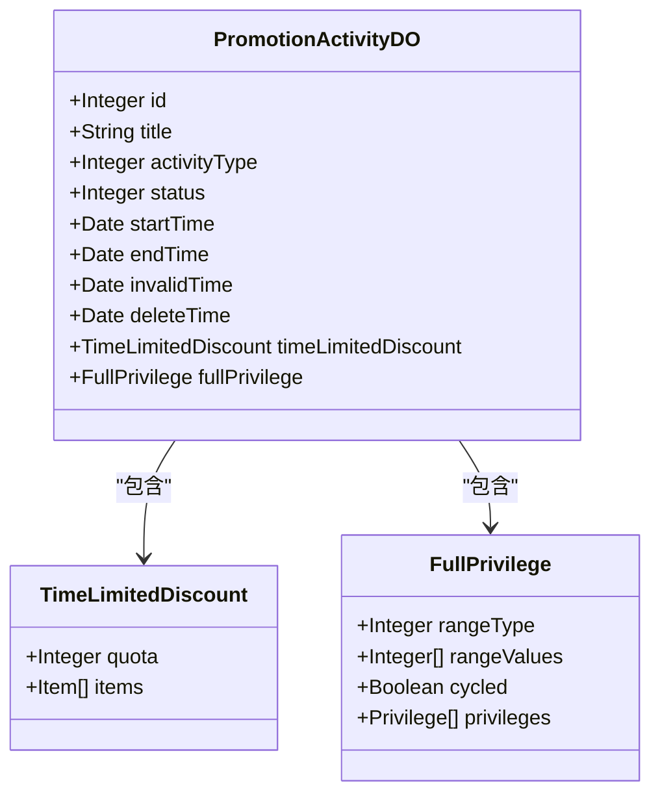
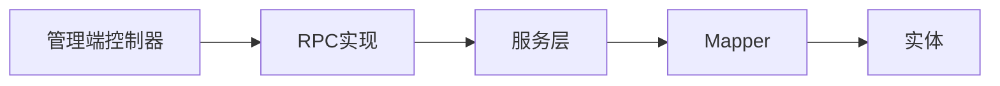

# 营销功能

<cite>
**本文引用的文件**
- [PromotionErrorCodeConstants.java](file://promotion-service-project/promotion-service-api/src/main/java/cn/ioocoder/mall/promotion/api/enums/PromotionErrorCodeConstants.java)
- [CouponCardRpc.java](file://promotion-service-project/promotion-service-api/src/main/java/cn/ioocoder/mall/promotion/api/rpc/coupon/CouponCardRpc.java)
- [CouponTemplateRpc.java](file://promotion-service-project/promotion-service-api/src/main/java/cn/ioocoder/mall/promotion/api/rpc/coupon/CouponTemplateRpc.java)
- [PromotionActivityRpc.java](file://promotion-service-project/promotion-service-api/src/main/java/cn/ioocoder/mall/promotion/api/rpc/activity/PromotionActivityRpc.java)
- [CouponCardDO.java](file://promotion-service-project/promotion-service-app/src/main/java/cn/ioocoder/mall/promotionservice/dal/mysql/dataobject/coupon/CouponCardDO.java)
- [CouponTemplateDO.java](file://promotion-service-project/promotion-service-app/src/main/java/cn/ioocoder/mall/promotionservice/dal/mysql/dataobject/coupon/CouponTemplateDO.java)
- [PromotionActivityDO.java](file://promotion-service-project/promotion-service-app/src/main/java/cn/ioocoder/mall/promotionservice/dal/mysql/dataobject/activity/PromotionActivityDO.java)
- [CouponCardStatusEnum.java](file://promotion-service-project/promotion-service-api/src/main/java/cn/ioocoder/mall/promotion/api/enums/coupon/card/CouponCardStatusEnum.java)
- [CouponTemplateStatusEnum.java](file://promotion-service-project/promotion-service-api/src/main/java/cn/ioocoder/mall/promotion/api/enums/coupon/template/CouponTemplateStatusEnum.java)
- [PromotionActivityStatusEnum.java](file://promotion-service-project/promotion-service-api/src/main/java/cn/ioocoder/mall/promotion/api/enums/activity/PromotionActivityStatusEnum.java)
- [PromotionActivityTypeEnum.java](file://promotion-service-project/promotion-service-api/src/main/java/cn/ioocoder/mall/promotion/api/enums/activity/PromotionActivityTypeEnum.java)
- [CouponCardCreateReqDTO.java](file://promotion-service-project/promotion-service-api/src/main/java/cn/ioocoder/mall/promotion/api/rpc/coupon/dto/card/CouponCardCreateReqDTO.java)
- [CouponCardUseReqDTO.java](file://promotion-service-project/promotion-service-api/src/main/java/cn/ioocoder/mall/promotion/api/rpc/coupon/dto/card/CouponCardUseReqDTO.java)
- [CouponCardCancelUseReqDTO.java](file://promotion-service-project/promotion-service-api/src/main/java/cn/ioocoder/mall/promotion/api/rpc/coupon/dto/card/CouponCardCancelUseReqDTO.java)
- [CouponCardPageReqDTO.java](file://promotion-service-project/promotion-service-api/src/main/java/cn/ioocoder/mall/promotion/api/rpc/coupon/dto/card/CouponCardPageReqDTO.java)
- [CouponCardAvailableListReqDTO.java](file://promotion-service-project/promotion-service-api/src/main/java/cn/ioocoder/mall/promotion/api/rpc/coupon/dto/card/CouponCardAvailableListReqDTO.java)
- [CouponCardAvailableRespDTO.java](file://promotion-service-project/promotion-service-api/src/main/java/cn/ioocoder/mall/promotion/api/rpc/coupon/dto/card/CouponCardAvailableRespDTO.java)
- [CouponCardRespDTO.java](file://promotion-service-project/promotion-service-api/src/main/java/cn/ioocoder/mall/promotion/api/rpc/coupon/dto/card/CouponCardRespDTO.java)
- [CouponCardTemplateCreateReqDTO.java](file://promotion-service-project/promotion-service-api/src/main/java/cn/ioocoder/mall/promotion/api/rpc/coupon/dto/template/CouponCardTemplateCreateReqDTO.java)
- [CouponCardTemplateUpdateReqDTO.java](file://promotion-service-project/promotion-service-api/src/main/java/cn/ioocoder/mall/promotion/api/rpc/coupon/dto/template/CouponCardTemplateUpdateReqDTO.java)
- [CouponCardTemplateUpdateStatusReqDTO.java](file://promotion-service-project/promotion-service-api/src/main/java/cn/ioocoder/mall/promotion/api/rpc/coupon/dto/template/CouponCardTemplateUpdateStatusReqDTO.java)
- [PromotionActivityPageReqDTO.java](file://promotion-service-project/promotion-service-api/src/main/java/cn/ioocoder/mall/promotion/api/rpc/activity/dto/PromotionActivityPageReqDTO.java)
- [PromotionActivityListReqDTO.java](file://promotion-service-project/promotion-service-api/src/main/java/cn/ioocoder/mall/promotion/api/rpc/activity/dto/PromotionActivityListReqDTO.java)
- [PromotionActivityRespDTO.java](file://promotion-service-project/promotion-service-api/src/main/java/cn/ioocoder/mall/promotion/api/rpc/activity/dto/PromotionActivityRespDTO.java)
- [PromotionActivityMapper.java](file://promotion-service-project/promotion-service-app/src/main/java/cn/ioocoder/mall/promotionservice/dal/mysql/mapper/activity/PromotionActivityMapper.java)
- [PromotionActivityManager.java](file://promotion-service-project/promotion-service-app/src/main/java/cn/ioocoder/mall/promotionservice/manager/activity/PromotionActivityManager.java)
- [PromotionActivityService.java](file://promotion-service-project/promotion-service-app/src/main/java/cn/ioocoder/mall/promotionservice/service/activity/PromotionActivityService.java)
- [PromotionActivityRpcImpl.java](file://promotion-service-project/promotion-service-app/src/main/java/cn/ioocoder/mall/promotionservice/rpc/activity/PromotionActivityRpcImpl.java)
- [CouponTemplateManager.java](file://promotion-service-project/promotion-service-app/src/main/java/cn/ioocoder/mall/promotionservice/manager/coupon/CouponTemplateManager.java)
- [CouponCardManager.java](file://promotion-service-project/promotion-service-app/src/main/java/cn/ioocoder/mall/promotionservice/manager/coupon/CouponCardManager.java)
- [CouponCardService.java](file://promotion-service-project/promotion-service-app/src/main/java/cn/ioocoder/mall/promotionservice/service/coupon/CouponCardService.java)
- [CouponTemplateService.java](file://promotion-service-project/promotion-service-app/src/main/java/cn/ioocoder/mall/promotionservice/service/coupon/CouponTemplateService.java)
- [CouponCardRpcImpl.java](file://promotion-service-project/promotion-service-app/src/main/java/cn/ioocoder/mall/promotionservice/rpc/coupon/CouponCardRpcImpl.java)
- [CouponTemplateRpcImpl.java](file://promotion-service-project/promotion-service-app/src/main/java/cn/ioocoder/mall/promotionservice/rpc/coupon/CouponTemplateRpcImpl.java)
- [ShopWebApplication.java](file://shop-web-app/src/main/java/cn/ioocoder/mall/shopweb/ShopWebApplication.java)
- [PromotionActivityController.java](file://management-web-app/src/main/java/cn/ioocoder/mall/managementweb/controller/promotion/activity/PromotionActivityController.java)
- [CouponTemplateController.java](file://management-web-app/src/main/java/cn/ioocoder/mall/managementweb/controller/promotion/coupon/CouponTemplateController.java)
- [PromotionActivityConvert.java](file://promotion-service-project/promotion-service-app/src/main/java/cn/ioocoder/mall/promotionservice/convert/activity/PromotionActivityConvert.java)
- [CouponTemplateConvert.java](file://promotion-service-project/promotion-service-app/src/main/java/cn/ioocoder/mall/promotionservice/convert/coupon/CouponTemplateConvert.java)
</cite>

## 目录
1. [简介](#简介)
2. [项目结构](#项目结构)
3. [核心组件](#核心组件)
4. [架构总览](#架构总览)
5. [详细组件分析](#详细组件分析)
6. [依赖分析](#依赖分析)
7. [性能考虑](#性能考虑)
8. [故障排查指南](#故障排查指南)
9. [结论](#结论)
10. [附录](#附录)

## 简介
本文件面向H5商城营销功能，系统性梳理优惠券与营销活动两大能力域：优惠券发放、使用、查询与风控；营销活动的参与、配置与效果统计。文档覆盖数据模型设计、规则配置、使用条件判断、活动效果统计、API调用示例、状态管理、流程控制与风控机制，并给出性能优化、并发处理策略与营销效果分析方法。

## 项目结构
营销功能主要由“promotion-service-project”提供服务端能力，对外通过RPC接口暴露，供“shop-web-app”前端应用与“management-web-app”后台管理应用调用。管理端控制器负责业务编排与参数校验，服务层负责核心业务逻辑，DAO层负责持久化访问。

图表来源
- [PromotionActivityRpcImpl.java](file://promotion-service-project/promotion-service-app/src/main/java/cn/ioocoder/mall/promotionservice/rpc/activity/PromotionActivityRpcImpl.java)
- [CouponCardRpcImpl.java](file://promotion-service-project/promotion-service-app/src/main/java/cn/ioocoder/mall/promotionservice/rpc/coupon/CouponCardRpcImpl.java)
- [CouponTemplateRpcImpl.java](file://promotion-service-project/promotion-service-app/src/main/java/cn/ioocoder/mall/promotionservice/rpc/coupon/CouponTemplateRpcImpl.java)
- [PromotionActivityService.java](file://promotion-service-project/promotion-service-app/src/main/java/cn/ioocoder/mall/promotionservice/service/activity/PromotionActivityService.java)
- [CouponCardService.java](file://promotion-service-project/promotion-service-app/src/main/java/cn/ioocoder/mall/promotionservice/service/coupon/CouponCardService.java)
- [CouponTemplateService.java](file://promotion-service-project/promotion-service-app/src/main/java/cn/ioocoder/mall/promotionservice/service/coupon/CouponTemplateService.java)
- [PromotionActivityMapper.java](file://promotion-service-project/promotion-service-app/src/main/java/cn/ioocoder/mall/promotionservice/dal/mysql/mapper/activity/PromotionActivityMapper.java)
- [CouponCardDO.java](file://promotion-service-project/promotion-service-app/src/main/java/cn/ioocoder/mall/promotionservice/dal/mysql/dataobject/coupon/CouponCardDO.java)
- [CouponTemplateDO.java](file://promotion-service-project/promotion-service-app/src/main/java/cn/ioocoder/mall/promotionservice/dal/mysql/dataobject/coupon/CouponTemplateDO.java)
- [PromotionActivityDO.java](file://promotion-service-project/promotion-service-app/src/main/java/cn/ioocoder/mall/promotionservice/dal/mysql/dataobject/activity/PromotionActivityDO.java)
- [ShopWebApplication.java](file://shop-web-app/src/main/java/cn/ioocoder/mall/shopweb/ShopWebApplication.java)
- [PromotionActivityController.java](file://management-web-app/src/main/java/cn/ioocoder/mall/managementweb/controller/promotion/activity/PromotionActivityController.java)
- [CouponTemplateController.java](file://management-web-app/src/main/java/cn/ioocoder/mall/managementweb/controller/promotion/coupon/CouponTemplateController.java)

章节来源
- [PromotionActivityRpcImpl.java](file://promotion-service-project/promotion-service-app/src/main/java/cn/ioocoder/mall/promotionservice/rpc/activity/PromotionActivityRpcImpl.java)
- [CouponCardRpcImpl.java](file://promotion-service-project/promotion-service-app/src/main/java/cn/ioocoder/mall/promotionservice/rpc/coupon/CouponCardRpcImpl.java)
- [CouponTemplateRpcImpl.java](file://promotion-service-project/promotion-service-app/src/main/java/cn/ioocoder/mall/promotionservice/rpc/coupon/CouponTemplateRpcImpl.java)
- [PromotionActivityService.java](file://promotion-service-project/promotion-service-app/src/main/java/cn/ioocoder/mall/promotionservice/service/activity/PromotionActivityService.java)
- [CouponCardService.java](file://promotion-service-project/promotion-service-app/src/main/java/cn/ioocoder/mall/promotionservice/service/coupon/CouponCardService.java)
- [CouponTemplateService.java](file://promotion-service-project/promotion-service-app/src/main/java/cn/ioocoder/mall/promotionservice/service/coupon/CouponTemplateService.java)
- [PromotionActivityMapper.java](file://promotion-service-project/promotion-service-app/src/main/java/cn/ioocoder/mall/promotionservice/dal/mysql/mapper/activity/PromotionActivityMapper.java)
- [CouponCardDO.java](file://promotion-service-project/promotion-service-app/src/main/java/cn/ioocoder/mall/promotionservice/dal/mysql/dataobject/coupon/CouponCardDO.java)
- [CouponTemplateDO.java](file://promotion-service-project/promotion-service-app/src/main/java/cn/ioocoder/mall/promotionservice/dal/mysql/dataobject/coupon/CouponTemplateDO.java)
- [PromotionActivityDO.java](file://promotion-service-project/promotion-service-app/src/main/java/cn/ioocoder/mall/promotionservice/dal/mysql/dataobject/activity/PromotionActivityDO.java)
- [ShopWebApplication.java](file://shop-web-app/src/main/java/cn/ioocoder/mall/shopweb/ShopWebApplication.java)
- [PromotionActivityController.java](file://management-web-app/src/main/java/cn/ioocoder/mall/managementweb/controller/promotion/activity/PromotionActivityController.java)
- [CouponTemplateController.java](file://management-web-app/src/main/java/cn/ioocoder/mall/managementweb/controller/promotion/coupon/CouponTemplateController.java)

## 核心组件
- 优惠券RPC接口族
  - 优惠券卡片RPC：提供分页、创建、使用、取消使用、查询可用券等能力
  - 优惠券模板RPC：提供模板查询、分页、启停、创建、更新等能力
- 营销活动RPC接口族
  - 活动分页与列表查询
- 数据模型
  - 优惠券模板与优惠券卡片实体，包含使用规则、使用效果、统计字段
  - 营销活动实体，包含活动基础信息、满减送与限时折扣配置
- 枚举与错误码
  - 优惠券状态、模板状态、活动状态与类型
  - 营销系统统一错误码常量

章节来源
- [CouponCardRpc.java](file://promotion-service-project/promotion-service-api/src/main/java/cn/ioocoder/mall/promotion/api/rpc/coupon/CouponCardRpc.java)
- [CouponTemplateRpc.java](file://promotion-service-project/promotion-service-api/src/main/java/cn/ioocoder/mall/promotion/api/rpc/coupon/CouponTemplateRpc.java)
- [PromotionActivityRpc.java](file://promotion-service-project/promotion-service-api/src/main/java/cn/ioocoder/mall/promotion/api/rpc/activity/PromotionActivityRpc.java)
- [CouponCardDO.java](file://promotion-service-project/promotion-service-app/src/main/java/cn/ioocoder/mall/promotionservice/dal/mysql/dataobject/coupon/CouponCardDO.java)
- [CouponTemplateDO.java](file://promotion-service-project/promotion-service-app/src/main/java/cn/ioocoder/mall/promotionservice/dal/mysql/dataobject/coupon/CouponTemplateDO.java)
- [PromotionActivityDO.java](file://promotion-service-project/promotion-service-app/src/main/java/cn/ioocoder/mall/promotionservice/dal/mysql/dataobject/activity/PromotionActivityDO.java)
- [CouponCardStatusEnum.java](file://promotion-service-project/promotion-service-api/src/main/java/cn/ioocoder/mall/promotion/api/enums/coupon/card/CouponCardStatusEnum.java)
- [CouponTemplateStatusEnum.java](file://promotion-service-project/promotion-service-api/src/main/java/cn/ioocoder/mall/promotion/api/enums/coupon/template/CouponTemplateStatusEnum.java)
- [PromotionActivityStatusEnum.java](file://promotion-service-project/promotion-service-api/src/main/java/cn/ioocoder/mall/promotion/api/enums/activity/PromotionActivityStatusEnum.java)
- [PromotionActivityTypeEnum.java](file://promotion-service-project/promotion-service-api/src/main/java/cn/ioocoder/mall/promotion/api/enums/activity/PromotionActivityTypeEnum.java)
- [PromotionErrorCodeConstants.java](file://promotion-service-project/promotion-service-api/src/main/java/cn/ioocoder/mall/promotion/api/enums/PromotionErrorCodeConstants.java)

## 架构总览
营销系统采用“接口层-RPC实现-服务层-数据访问层”的分层架构。接口层定义RPC契约，RPC实现负责参数校验与调用服务层，服务层封装业务规则与事务，DAO层负责数据库交互。管理端控制器与H5前端应用通过RPC调用完成营销能力的编排与使用。

图表来源
- [CouponCardRpcImpl.java](file://promotion-service-project/promotion-service-app/src/main/java/cn/ioocoder/mall/promotionservice/rpc/coupon/CouponCardRpcImpl.java)
- [CouponCardService.java](file://promotion-service-project/promotion-service-app/src/main/java/cn/ioocoder/mall/promotionservice/service/coupon/CouponCardService.java)
- [CouponCardDO.java](file://promotion-service-project/promotion-service-app/src/main/java/cn/ioocoder/mall/promotionservice/dal/mysql/dataobject/coupon/CouponCardDO.java)

## 详细组件分析

### 优惠券数据模型设计
- 优惠券模板（CouponTemplateDO）
  - 基本信息：标题、描述、类型、状态
  - 领取规则：每人限领、发行总量
  - 使用规则：满额可用、可用范围、生效日期类型与区间
  - 使用效果：优惠类型（代金/折扣）、折扣百分比、优惠金额、折扣上限
  - 统计信息：领取次数
  - 优惠码特有：码类型与通用码
- 优惠券卡片（CouponCardDO）
  - 基本信息：模板关联、名称、状态
  - 领取情况：用户、领取类型
  - 使用规则：满额可用、生效起止时间
  - 使用效果：优惠类型、折扣、优惠金额、折扣上限
  - 使用情况：使用时间

图表来源
- [CouponTemplateDO.java](file://promotion-service-project/promotion-service-app/src/main/java/cn/ioocoder/mall/promotionservice/dal/mysql/dataobject/coupon/CouponTemplateDO.java)
- [CouponCardDO.java](file://promotion-service-project/promotion-service-app/src/main/java/cn/ioocoder/mall/promotionservice/dal/mysql/dataobject/coupon/CouponCardDO.java)

章节来源
- [CouponTemplateDO.java](file://promotion-service-project/promotion-service-app/src/main/java/cn/ioocoder/mall/promotionservice/dal/mysql/dataobject/coupon/CouponTemplateDO.java)
- [CouponCardDO.java](file://promotion-service-project/promotion-service-app/src/main/java/cn/ioocoder/mall/promotionservice/dal/mysql/dataobject/coupon/CouponCardDO.java)

### 优惠券发放与使用流程
- 发放流程
  - 管理端创建优惠券模板，设置领取规则与使用效果
  - 用户通过H5前端或管理端触发领取，系统生成优惠券卡片并落库
- 使用流程
  - 用户下单时查询可用优惠券，系统按满额、生效期、可用范围、状态进行过滤
  - 用户选择使用优惠券，系统执行使用校验与状态变更
  - 订单完成后若发生取消，系统支持取消使用并回滚状态

图表来源
- [CouponCardRpc.java](file://promotion-service-project/promotion-service-api/src/main/java/cn/ioocoder/mall/promotion/api/rpc/coupon/CouponCardRpc.java)
- [CouponCardRpcImpl.java](file://promotion-service-project/promotion-service-app/src/main/java/cn/ioocoder/mall/promotionservice/rpc/coupon/CouponCardRpcImpl.java)
- [CouponCardService.java](file://promotion-service-project/promotion-service-app/src/main/java/cn/ioocoder/mall/promotionservice/service/coupon/CouponCardService.java)
- [CouponCardDO.java](file://promotion-service-project/promotion-service-app/src/main/java/cn/ioocoder/mall/promotionservice/dal/mysql/dataobject/coupon/CouponCardDO.java)

章节来源
- [CouponCardRpc.java](file://promotion-service-project/promotion-service-api/src/main/java/cn/ioocoder/mall/promotion/api/rpc/coupon/CouponCardRpc.java)
- [CouponCardRpcImpl.java](file://promotion-service-project/promotion-service-app/src/main/java/cn/ioocoder/mall/promotionservice/rpc/coupon/CouponCardRpcImpl.java)
- [CouponCardService.java](file://promotion-service-project/promotion-service-app/src/main/java/cn/ioocoder/mall/promotionservice/service/coupon/CouponCardService.java)
- [CouponCardDO.java](file://promotion-service-project/promotion-service-app/src/main/java/cn/ioocoder/mall/promotionservice/dal/mysql/dataobject/coupon/CouponCardDO.java)

### 营销活动参与与效果统计
- 活动类型与状态
  - 类型：如限时折扣、满减送等
  - 状态：启用/禁用
- 活动配置
  - 限时折扣：针对特定SPU设置折扣与每人配额
  - 满减送：设置满足条件与优惠策略，支持循环与可用范围
- 效果统计
  - 活动维度统计与优惠券模板维度统计，便于评估ROI与转化率

图表来源
- [PromotionActivityDO.java](file://promotion-service-project/promotion-service-app/src/main/java/cn/ioocoder/mall/promotionservice/dal/mysql/dataobject/activity/PromotionActivityDO.java)

章节来源
- [PromotionActivityDO.java](file://promotion-service-project/promotion-service-app/src/main/java/cn/ioocoder/mall/promotionservice/dal/mysql/dataobject/activity/PromotionActivityDO.java)
- [PromotionActivityTypeEnum.java](file://promotion-service-project/promotion-service-api/src/main/java/cn/ioocoder/mall/promotion/api/enums/activity/PromotionActivityTypeEnum.java)
- [PromotionActivityStatusEnum.java](file://promotion-service-project/promotion-service-api/src/main/java/cn/ioocoder/mall/promotion/api/enums/activity/PromotionActivityStatusEnum.java)

### API接口与调用示例
- 优惠券卡片RPC
  - 分页查询：pageCouponCard
  - 创建卡片：createCouponCard
  - 使用卡片：useCouponCard
  - 取消使用：cancelUseCouponCard
  - 可用券列表：listAvailableCouponCards
- 优惠券模板RPC
  - 获取模板：getCouponTemplate
  - 模板分页：pageCouponTemplate
  - 更新状态：updateCouponTemplateStatus
  - 创建模板：createCouponCardTemplate
  - 更新模板：updateCouponCardTemplate
- 营销活动RPC
  - 活动分页：pagePromotionActivity
  - 活动列表：listPromotionActivities

章节来源
- [CouponCardRpc.java](file://promotion-service-project/promotion-service-api/src/main/java/cn/ioocoder/mall/promotion/api/rpc/coupon/CouponCardRpc.java)
- [CouponTemplateRpc.java](file://promotion-service-project/promotion-service-api/src/main/java/cn/ioocoder/mall/promotion/api/rpc/coupon/CouponTemplateRpc.java)
- [PromotionActivityRpc.java](file://promotion-service-project/promotion-service-api/src/main/java/cn/ioocoder/mall/promotion/api/rpc/activity/PromotionActivityRpc.java)

### 优惠券状态管理与风控
- 状态枚举
  - 优惠券卡片：未使用、已使用、已过期
  - 优惠券模板：生效中、已失效
- 风控要点
  - 领取配额校验：防止超领
  - 发放总量控制：防止超发
  - 使用条件校验：满额、生效期、可用范围、状态
  - 并发安全：使用与取消使用需原子性与幂等

章节来源
- [CouponCardStatusEnum.java](file://promotion-service-project/promotion-service-api/src/main/java/cn/ioocoder/mall/promotion/api/enums/coupon/card/CouponCardStatusEnum.java)
- [CouponTemplateStatusEnum.java](file://promotion-service-project/promotion-service-api/src/main/java/cn/ioocoder/mall/promotion/api/enums/coupon/template/CouponTemplateStatusEnum.java)
- [PromotionErrorCodeConstants.java](file://promotion-service-project/promotion-service-api/src/main/java/cn/ioocoder/mall/promotion/api/enums/PromotionErrorCodeConstants.java)

### 使用流程控制与并发策略
- 流程控制
  - 可用券筛选：基于用户、商品、时间、范围、状态
  - 使用校验：确保券未使用且在有效期内
  - 取消使用：支持订单取消后的状态回滚
- 并发策略
  - 使用与取消使用采用分布式锁或数据库乐观锁
  - 批量操作使用队列异步处理，降低瞬时压力
  - 缓存热点数据（如模板与可用券列表），结合缓存失效策略

章节来源
- [CouponCardRpc.java](file://promotion-service-project/promotion-service-api/src/main/java/cn/ioocoder/mall/promotion/api/rpc/coupon/CouponCardRpc.java)
- [CouponCardService.java](file://promotion-service-project/promotion-service-app/src/main/java/cn/ioocoder/mall/promotionservice/service/coupon/CouponCardService.java)

### 营销效果分析方法
- 指标体系
  - 优惠券：领取率、使用率、核销率、客单价提升、GMV增量
  - 活动：曝光量、点击率、转化率、客单价、复购率
- 统计口径
  - 活动维度与券模板维度分别统计，区分不同活动与渠道效果
  - 支持按时间窗口对比与归因分析

章节来源
- [PromotionActivityDO.java](file://promotion-service-project/promotion-service-app/src/main/java/cn/ioocoder/mall/promotionservice/dal/mysql/dataobject/activity/PromotionActivityDO.java)
- [CouponTemplateDO.java](file://promotion-service-project/promotion-service-app/src/main/java/cn/ioocoder/mall/promotionservice/dal/mysql/dataobject/coupon/CouponTemplateDO.java)

## 依赖分析
- 组件耦合
  - RPC接口与实现解耦，服务层聚合业务逻辑，DAO层专注数据访问
  - 控制器仅负责参数编排与异常转换，职责清晰
- 外部依赖
  - MyBatis-Plus用于ORM映射
  - Redis用于缓存热点数据
  - RocketMQ用于异步任务与削峰

图表来源
- [PromotionActivityController.java](file://management-web-app/src/main/java/cn/ioocoder/mall/managementweb/controller/promotion/activity/PromotionActivityController.java)
- [PromotionActivityRpcImpl.java](file://promotion-service-project/promotion-service-app/src/main/java/cn/ioocoder/mall/promotionservice/rpc/activity/PromotionActivityRpcImpl.java)
- [PromotionActivityService.java](file://promotion-service-project/promotion-service-app/src/main/java/cn/ioocoder/mall/promotionservice/service/activity/PromotionActivityService.java)
- [PromotionActivityMapper.java](file://promotion-service-project/promotion-service-app/src/main/java/cn/ioocoder/mall/promotionservice/dal/mysql/mapper/activity/PromotionActivityMapper.java)
- [PromotionActivityDO.java](file://promotion-service-project/promotion-service-app/src/main/java/cn/ioocoder/mall/promotionservice/dal/mysql/dataobject/activity/PromotionActivityDO.java)

章节来源
- [PromotionActivityController.java](file://management-web-app/src/main/java/cn/ioocoder/mall/managementweb/controller/promotion/activity/PromotionActivityController.java)
- [PromotionActivityRpcImpl.java](file://promotion-service-project/promotion-service-app/src/main/java/cn/ioocoder/mall/promotionservice/rpc/activity/PromotionActivityRpcImpl.java)
- [PromotionActivityService.java](file://promotion-service-project/promotion-service-app/src/main/java/cn/ioocoder/mall/promotionservice/service/activity/PromotionActivityService.java)
- [PromotionActivityMapper.java](file://promotion-service-project/promotion-service-app/src/main/java/cn/ioocoder/mall/promotionservice/dal/mysql/mapper/activity/PromotionActivityMapper.java)
- [PromotionActivityDO.java](file://promotion-service-project/promotion-service-app/src/main/java/cn/ioocoder/mall/promotionservice/dal/mysql/dataobject/activity/PromotionActivityDO.java)

## 性能考虑
- 缓存策略
  - 模板与券详情缓存，结合LRU与TTL
  - 可用券列表按用户+订单场景缓存，避免重复计算
- 异步化
  - 使用与取消使用异步写入，减少主流程阻塞
  - 统计任务异步化，定时任务批量计算
- 分页与索引
  - 对常用查询字段建立复合索引，优化分页与过滤
  - 控制单页大小，避免大偏移量导致的慢查询
- 并发控制
  - 使用Redis分布式锁或数据库乐观锁保证并发安全
  - 限流与熔断保护下游依赖

## 故障排查指南
- 常见错误码
  - 优惠券模板不存在、不是优惠券模板、不是优惠码模板、未开启、发放量不足、领取到达上限
  - 优惠券不存在、不属于当前用户、不匹配、不处于待使用/已使用状态
- 定位思路
  - 根据错误码快速定位问题类型（模板配置、用户权限、券状态、并发冲突）
  - 查看服务日志与链路追踪，确认RPC调用耗时与失败点
  - 核对数据库状态与缓存一致性，必要时重算缓存

章节来源
- [PromotionErrorCodeConstants.java](file://promotion-service-project/promotion-service-api/src/main/java/cn/ioocoder/mall/promotion/api/enums/PromotionErrorCodeConstants.java)

## 结论
营销系统围绕“优惠券”与“营销活动”两条主线构建，通过清晰的RPC接口、完善的实体模型与严格的风控策略，支撑H5端的优惠券发放与使用以及管理端的活动配置与效果统计。建议在高并发场景下强化缓存与异步化策略，并持续完善指标体系与归因分析，以驱动营销效果的持续增长。

## 附录
- 关键DTO与枚举
  - 优惠券卡片：创建、使用、取消使用、分页、可用列表、响应
  - 优惠券模板：创建、更新、状态更新、分页、响应
  - 活动：分页、列表、响应
- 转换层
  - 活动与模板的DTO/DO转换，便于接口与持久层解耦

章节来源
- [CouponCardCreateReqDTO.java](file://promotion-service-project/promotion-service-api/src/main/java/cn/ioocoder/mall/promotion/api/rpc/coupon/dto/card/CouponCardCreateReqDTO.java)
- [CouponCardUseReqDTO.java](file://promotion-service-project/promotion-service-api/src/main/java/cn/ioocoder/mall/promotion/api/rpc/coupon/dto/card/CouponCardUseReqDTO.java)
- [CouponCardCancelUseReqDTO.java](file://promotion-service-project/promotion-service-api/src/main/java/cn/ioocoder/mall/promotion/api/rpc/coupon/dto/card/CouponCardCancelUseReqDTO.java)
- [CouponCardPageReqDTO.java](file://promotion-service-project/promotion-service-api/src/main/java/cn/ioocoder/mall/promotion/api/rpc/coupon/dto/card/CouponCardPageReqDTO.java)
- [CouponCardAvailableListReqDTO.java](file://promotion-service-project/promotion-service-api/src/main/java/cn/ioocoder/mall/promotion/api/rpc/coupon/dto/card/CouponCardAvailableListReqDTO.java)
- [CouponCardAvailableRespDTO.java](file://promotion-service-project/promotion-service-api/src/main/java/cn/ioocoder/mall/promotion/api/rpc/coupon/dto/card/CouponCardAvailableRespDTO.java)
- [CouponCardRespDTO.java](file://promotion-service-project/promotion-service-api/src/main/java/cn/ioocoder/mall/promotion/api/rpc/coupon/dto/card/CouponCardRespDTO.java)
- [CouponCardTemplateCreateReqDTO.java](file://promotion-service-project/promotion-service-api/src/main/java/cn/ioocoder/mall/promotion/api/rpc/coupon/dto/template/CouponCardTemplateCreateReqDTO.java)
- [CouponCardTemplateUpdateReqDTO.java](file://promotion-service-project/promotion-service-api/src/main/java/cn/ioocoder/mall/promotion/api/rpc/coupon/dto/template/CouponCardTemplateUpdateReqDTO.java)
- [CouponCardTemplateUpdateStatusReqDTO.java](file://promotion-service-project/promotion-service-api/src/main/java/cn/ioocoder/mall/promotion/api/rpc/coupon/dto/template/CouponCardTemplateUpdateStatusReqDTO.java)
- [PromotionActivityPageReqDTO.java](file://promotion-service-project/promotion-service-api/src/main/java/cn/ioocoder/mall/promotion/api/rpc/activity/dto/PromotionActivityPageReqDTO.java)
- [PromotionActivityListReqDTO.java](file://promotion-service-project/promotion-service-api/src/main/java/cn/ioocoder/mall/promotion/api/rpc/activity/dto/PromotionActivityListReqDTO.java)
- [PromotionActivityRespDTO.java](file://promotion-service-project/promotion-service-api/src/main/java/cn/ioocoder/mall/promotion/api/rpc/activity/dto/PromotionActivityRespDTO.java)
- [PromotionActivityConvert.java](file://promotion-service-project/promotion-service-app/src/main/java/cn/ioocoder/mall/promotionservice/convert/activity/PromotionActivityConvert.java)
- [CouponTemplateConvert.java](file://promotion-service-project/promotion-service-app/src/main/java/cn/ioocoder/mall/promotionservice/convert/coupon/CouponTemplateConvert.java)