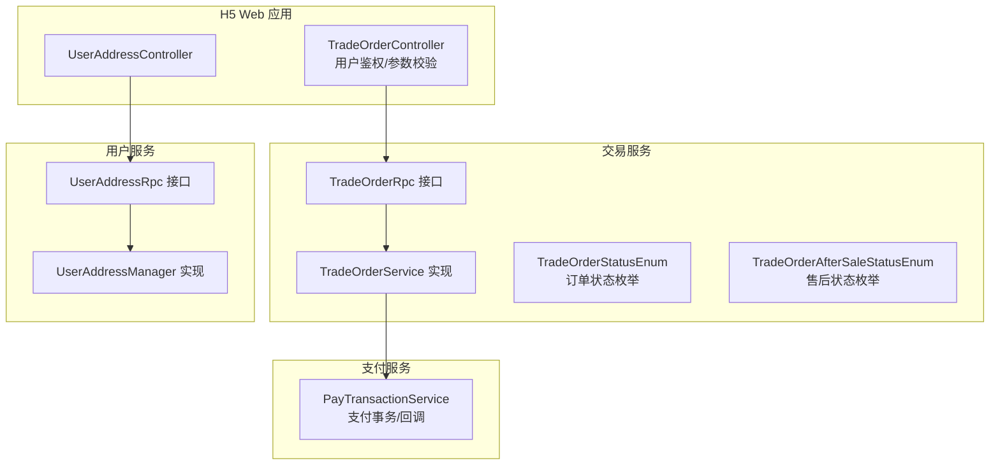
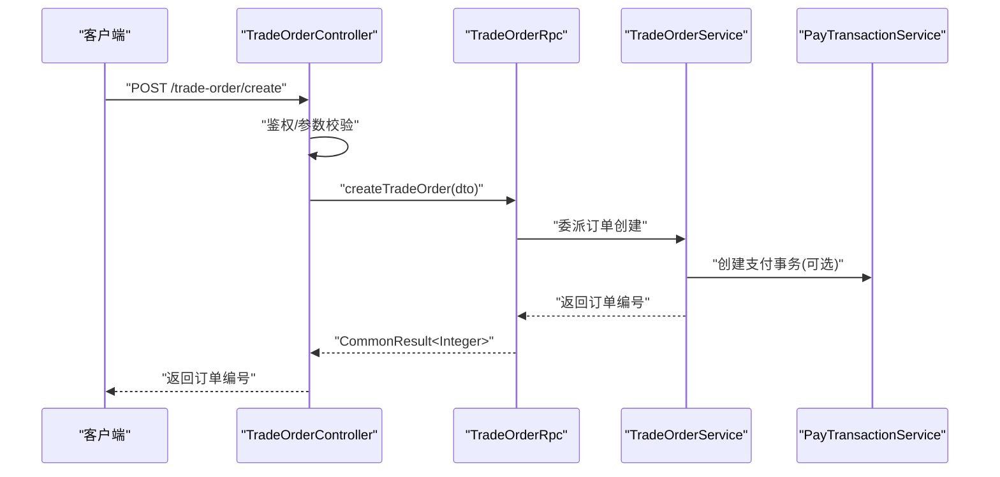
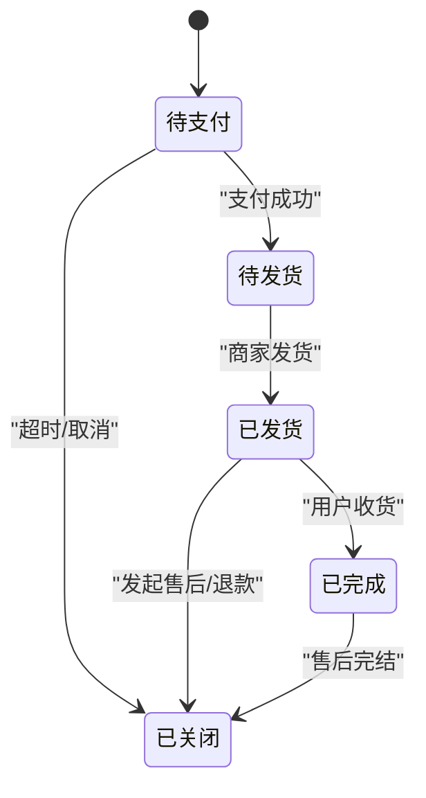
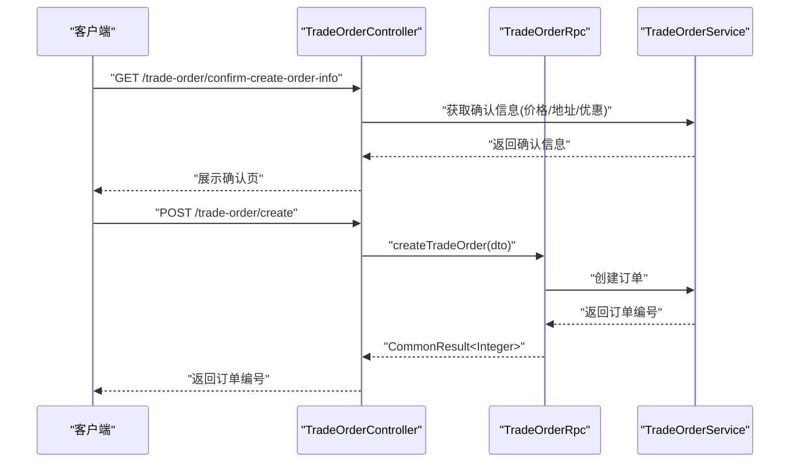
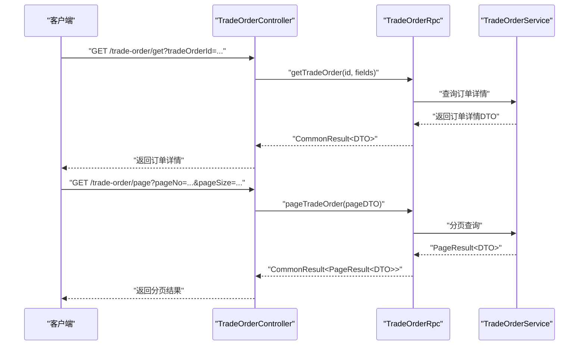
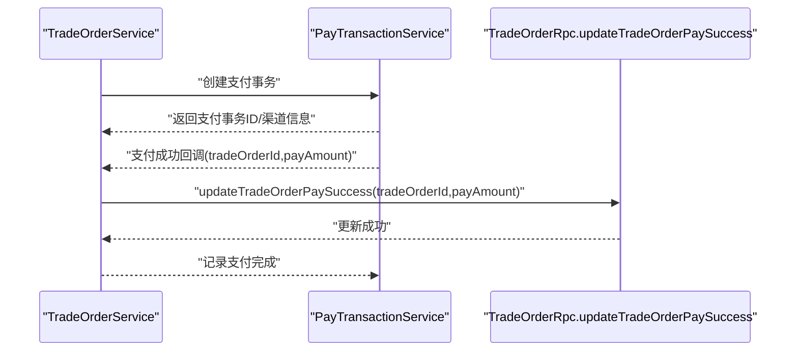
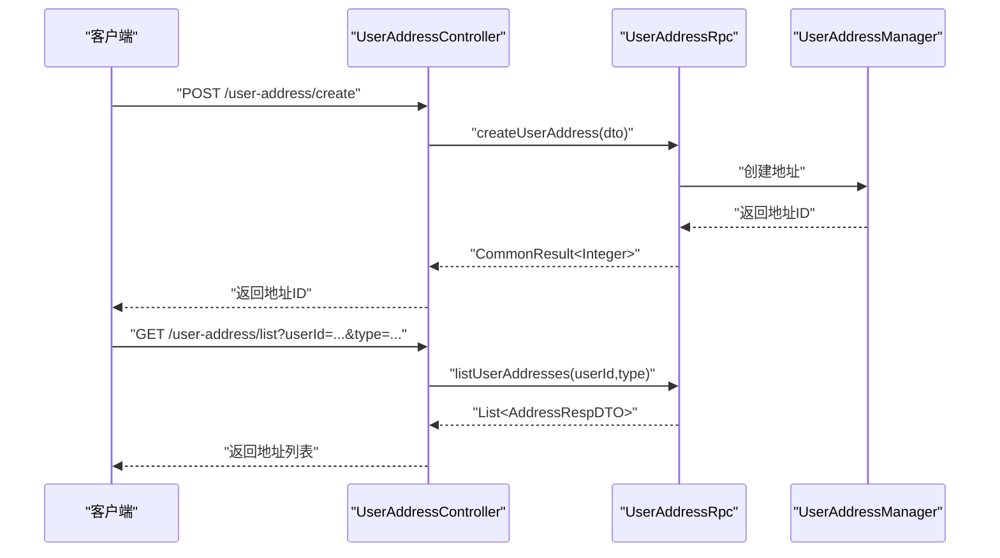
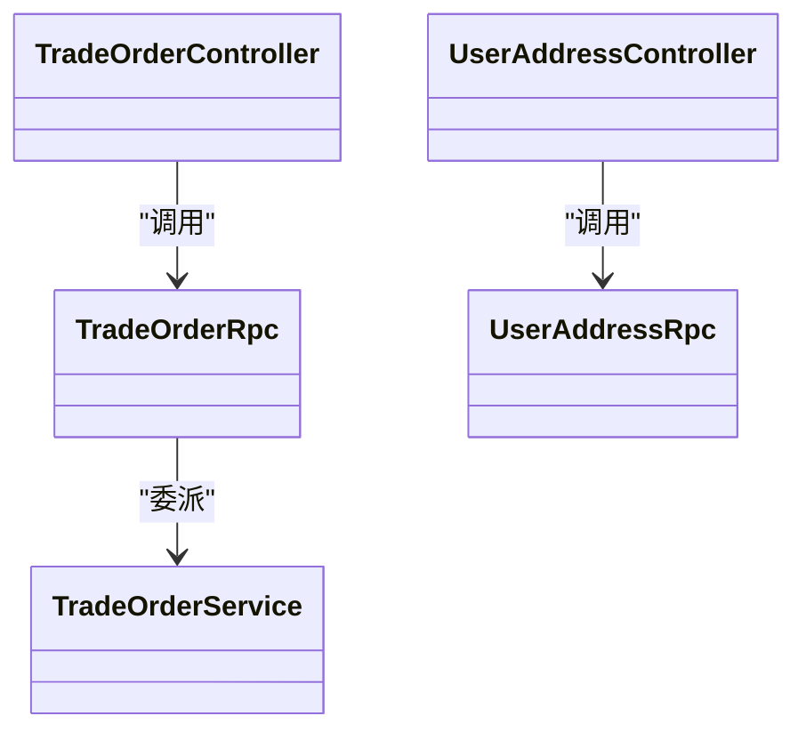

# 订单管理功能

<cite>
**本文引用的文件**
- [TradeOrderStatusEnum.java](file://trade-service-project/trade-service-api/src/main/java/cn/iocoder/mall/tradeservice/enums/order/TradeOrderStatusEnum.java)
- [TradeOrderRpc.java](file://trade-service-project/trade-service-api/src/main/java/cn/iocoder/mall/tradeservice/rpc/order/TradeOrderRpc.java)
- [TradeOrderCreateReqDTO.java](file://trade-service-project/trade-service-api/src/main/java/cn/iocoder/mall/tradeservice/rpc/order/dto/TradeOrderCreateReqDTO.java)
- [TradeOrderRespDTO.java](file://trade-service-project/trade-service-api/src/main/java/cn/iocoder/mall/tradeservice/rpc/order/dto/TradeOrderRespDTO.java)
- [TradeOrderController.java](file://shop-web-app/src/main/java/cn/iocoder/mall/shopweb/controller/trade/TradeOrderController.java)
- [TradeOrderConfirmCreateInfoRespVO.java](file://shop-web-app/src/main/java/cn/iocoder/mall/shopweb/controller/trade/vo/order/TradeOrderConfirmCreateInfoRespVO.java)
- [TradeOrderCreateReqVO.java](file://shop-web-app/src/main/java/cn/iocoder/mall/shopweb/controller/trade/vo/order/TradeOrderCreateReqVO.java)
- [TradeOrderCreateFromCartReqVO.java](file://shop-web-app/src/main/java/cn/iocoder/mall/shopweb/controller/trade/vo/order/TradeOrderCreateFromCartReqVO.java)
- [TradeOrderItemRespVO.java](file://shop-web-app/src/main/java/cn/iocoder/mall/shopweb/controller/trade/vo/order/TradeOrderItemRespVO.java)
- [TradeOrderPageReqVO.java](file://shop-web-app/src/main/java/cn/iocoder/mall/shopweb/controller/trade/vo/order/TradeOrderPageReqVO.java)
- [TradeOrderRespVO.java](file://shop-web-app/src/main/java/cn/iocoder/mall/shopweb/controller/trade/vo/order/TradeOrderRespVO.java)
- [TradeOrderService.java](file://shop-web-app/src/main/java/cn/iocoder/mall/shopweb/service/trade/TradeOrderService.java)
- [TradeOrderClient.java](file://shop-web-app/src/main/java/cn/iocoder/mall/shopweb/client/trade/TradeOrderClient.java)
- [UserAddressRpc.java](file://user-service-project/user-service-api/src/main/java/cn/iocoder/mall/userservice/rpc/address/UserAddressRpc.java)
- [UserAddressCreateReqDTO.java](file://user-service-project/user-service-api/src/main/java/cn/iocoder/mall/userservice/rpc/address/dto/UserAddressCreateReqDTO.java)
- [UserAddressRespDTO.java](file://user-service-project/user-service-api/src/main/java/cn/iocoder/mall/userservice/rpc/address/dto/UserAddressRespDTO.java)
- [UserAddressController.java](file://shop-web-app/src/main/java/cn/iocoder/mall/shopweb/controller/user/UserAddressController.java)
- [UserAddressCreateReqVO.java](file://shop-web-app/src/main/java/cn/iocoder/mall/shopweb/controller/user/vo/address/UserAddressCreateReqVO.java)
- [UserAddressUpdateReqVO.java](file://shop-web-app/src/main/java/cn/iocoder/mall/shopweb/controller/user/vo/address/UserAddressUpdateReqVO.java)
- [UserAddressManager.java](file://shop-web-app/src/main/java/cn/iocoder/mall/shopweb/service/user/UserAddressManager.java)
- [UserAddressClient.java](file://shop-web-app/src/main/java/cn/iocoder/mall/shopweb/client/user/UserAddressClient.java)
- [TradeOrderAfterSaleStatusEnum.java](file://trade-service-project/trade-service-api/src/main/java/cn/iocoder/mall/tradeservice/enums/order/TradeOrderAfterSaleStatusEnum.java)
- [TradeBizProperties.java](file://trade-service-project/trade-service-app/src/main/java/cn/iocoder/mall/tradeservice/config/TradeBizProperties.java)
</cite>

## 目录
1. [简介](#简介)
2. [项目结构](#项目结构)
3. [核心组件](#核心组件)
4. [架构总览](#架构总览)
5. [详细组件分析](#详细组件分析)
6. [依赖关系分析](#依赖关系分析)
7. [性能考量](#性能考量)
8. [故障排查指南](#故障排查指南)
9. [结论](#结论)
10. [附录](#附录)

## 简介
本文件面向H5商城的“订单管理”功能，系统性梳理从下单到支付、查询、详情查看以及收货地址管理的完整流程。重点覆盖：
- 订单状态流转机制与状态枚举
- 订单创建与支付对接（含回调）
- 收货地址管理能力
- 数据模型与接口定义
- 并发安全与性能优化建议
- 异常处理与常见问题排查

## 项目结构
围绕订单管理的关键模块分布如下：
- H5 Web层（Shop Web App）：提供前端交互接口、封装调用RPC服务、负责会话与鉴权
- 交易服务（Trade Service）：订单领域核心，包含订单状态、价格计算、支付回调等业务逻辑
- 用户服务（User Service）：地址管理、用户信息等
- 支付服务（Pay Service）：支付通道、退款、回调等（与交易服务通过RPC对接）

图表来源
- [TradeOrderController.java:1-85](file://shop-web-app/src/main/java/cn/iocoder/mall/shopweb/controller/trade/TradeOrderController.java#L1-L85)
- [TradeOrderRpc.java:1-55](file://trade-service-project/trade-service-api/src/main/java/cn/iocoder/mall/tradeservice/rpc/order/TradeOrderRpc.java#L1-L55)
- [TradeOrderStatusEnum.java:1-36](file://trade-service-project/trade-service-api/src/main/java/cn/iocoder/mall/tradeservice/enums/order/TradeOrderStatusEnum.java#L1-L36)
- [TradeOrderAfterSaleStatusEnum.java:1-200](file://trade-service-project/trade-service-api/src/main/java/cn/iocoder/mall/tradeservice/enums/order/TradeOrderAfterSaleStatusEnum.java#L1-L200)
- [UserAddressController.java](file://shop-web-app/src/main/java/cn/iocoder/mall/shopweb/controller/user/UserAddressController.java)
- [UserAddressRpc.java:1-63](file://user-service-project/user-service-api/src/main/java/cn/iocoder/mall/userservice/rpc/address/UserAddressRpc.java#L1-L63)

章节来源
- [TradeOrderController.java:1-85](file://shop-web-app/src/main/java/cn/iocoder/mall/shopweb/controller/trade/TradeOrderController.java#L1-L85)
- [UserAddressController.java](file://shop-web-app/src/main/java/cn/iocoder/mall/shopweb/controller/user/UserAddressController.java)

## 核心组件
- 订单状态枚举：定义订单生命周期关键状态，驱动状态机流转
- 订单RPC接口：提供创建、查询、分页、支付回调更新等能力
- 订单数据模型：包含基础信息、价格与支付、收货与物流、营销与售后等字段
- 地址RPC接口：提供地址的增删改查与批量查询
- 控制器与服务：H5侧暴露REST接口并调用RPC，完成业务编排

章节来源
- [TradeOrderStatusEnum.java:1-36](file://trade-service-project/trade-service-api/src/main/java/cn/iocoder/mall/tradeservice/enums/order/TradeOrderStatusEnum.java#L1-L36)
- [TradeOrderRpc.java:1-55](file://trade-service-project/trade-service-api/src/main/java/cn/iocoder/mall/tradeservice/rpc/order/TradeOrderRpc.java#L1-L55)
- [TradeOrderRespDTO.java:1-140](file://trade-service-project/trade-service-api/src/main/java/cn/iocoder/mall/tradeservice/rpc/order/dto/TradeOrderRespDTO.java#L1-L140)
- [UserAddressRpc.java:1-63](file://user-service-project/user-service-api/src/main/java/cn/iocoder/mall/userservice/rpc/address/UserAddressRpc.java#L1-L63)

## 架构总览
订单管理采用“Web层控制器 + RPC服务”的分层架构。H5侧通过控制器接收请求，进行鉴权与参数校验，随后调用交易/用户RPC服务执行业务操作；交易服务内部协调价格计算、库存锁定、支付回调等。

图表来源
- [TradeOrderController.java:55-62](file://shop-web-app/src/main/java/cn/iocoder/mall/shopweb/controller/trade/TradeOrderController.java#L55-L62)
- [TradeOrderRpc.java:22-22](file://trade-service-project/trade-service-api/src/main/java/cn/iocoder/mall/tradeservice/rpc/order/TradeOrderRpc.java#L22-L22)
- [TradeOrderCreateReqDTO.java:1-70](file://trade-service-project/trade-service-api/src/main/java/cn/iocoder/mall/tradeservice/rpc/order/dto/TradeOrderCreateReqDTO.java#L1-L70)

## 详细组件分析

### 订单状态与状态机
- 状态枚举：包含“待支付、待发货、已发货、已完成、已关闭”
- 状态流转：由业务规则控制，如支付成功触发“待发货”，发货后“已发货”，收货后“已完成”，超时或用户取消触发“已关闭”
- 售后状态：独立枚举，用于描述退换货/售后进度

图表来源
- [TradeOrderStatusEnum.java:14-18](file://trade-service-project/trade-service-api/src/main/java/cn/iocoder/mall/tradeservice/enums/order/TradeOrderStatusEnum.java#L14-L18)
- [TradeOrderAfterSaleStatusEnum.java:1-200](file://trade-service-project/trade-service-api/src/main/java/cn/iocoder/mall/tradeservice/enums/order/TradeOrderAfterSaleStatusEnum.java#L1-L200)

章节来源
- [TradeOrderStatusEnum.java:1-36](file://trade-service-project/trade-service-api/src/main/java/cn/iocoder/mall/tradeservice/enums/order/TradeOrderStatusEnum.java#L1-L36)

### 订单创建流程
- 入口：H5控制器提供“基于商品/购物车”的确认与创建接口
- 参数：用户ID、IP、收货地址ID、优惠券ID、备注、订单明细（SKU+数量）
- 流程：参数校验 → 调用RPC创建订单 → 返回订单编号

图表来源
- [TradeOrderController.java:31-62](file://shop-web-app/src/main/java/cn/iocoder/mall/shopweb/controller/trade/TradeOrderController.java#L31-L62)
- [TradeOrderRpc.java:22-22](file://trade-service-project/trade-service-api/src/main/java/cn/iocoder/mall/tradeservice/rpc/order/TradeOrderRpc.java#L22-L22)
- [TradeOrderCreateReqDTO.java:24-49](file://trade-service-project/trade-service-api/src/main/java/cn/iocoder/mall/tradeservice/rpc/order/dto/TradeOrderCreateReqDTO.java#L24-L49)

章节来源
- [TradeOrderController.java:31-62](file://shop-web-app/src/main/java/cn/iocoder/mall/shopweb/controller/trade/TradeOrderController.java#L31-L62)
- [TradeOrderCreateReqDTO.java:1-70](file://trade-service-project/trade-service-api/src/main/java/cn/iocoder/mall/tradeservice/rpc/order/dto/TradeOrderCreateReqDTO.java#L1-L70)

### 订单查询与详情查看
- 单个订单查询：按订单编号查询，支持额外字段返回
- 分页查询：按用户维度分页返回订单列表
- 详情字段：可通过枚举控制是否返回订单明细等

图表来源
- [TradeOrderController.java:71-82](file://shop-web-app/src/main/java/cn/iocoder/mall/shopweb/controller/trade/TradeOrderController.java#L71-L82)
- [TradeOrderRpc.java:31-39](file://trade-service-project/trade-service-api/src/main/java/cn/iocoder/mall/tradeservice/rpc/order/TradeOrderRpc.java#L31-L39)
- [TradeOrderRespDTO.java:18-137](file://trade-service-project/trade-service-api/src/main/java/cn/iocoder/mall/tradeservice/rpc/order/dto/TradeOrderRespDTO.java#L18-L137)

章节来源
- [TradeOrderController.java:71-82](file://shop-web-app/src/main/java/cn/iocoder/mall/shopweb/controller/trade/TradeOrderController.java#L71-L82)
- [TradeOrderRespDTO.java:1-140](file://trade-service-project/trade-service-api/src/main/java/cn/iocoder/mall/tradeservice/rpc/order/dto/TradeOrderRespDTO.java#L1-L140)

### 支付流程与回调
- 创建订单后，交易服务可联动支付服务创建支付事务
- 支付完成后，支付服务回调交易服务的“支付成功更新”接口，更新订单状态与支付信息
- 回调参数包含订单编号、支付金额等

图表来源
- [TradeOrderRpc.java:44-52](file://trade-service-project/trade-service-api/src/main/java/cn/iocoder/mall/tradeservice/rpc/order/TradeOrderRpc.java#L44-L52)

章节来源
- [TradeOrderRpc.java:44-52](file://trade-service-project/trade-service-api/src/main/java/cn/iocoder/mall/tradeservice/rpc/order/TradeOrderRpc.java#L44-L52)

### 收货地址管理
- 地址创建：校验用户ID、姓名、手机、地区编码、详细地址、地址类型
- 地址更新/删除/查询：提供单条与批量查询
- H5侧提供地址控制器与VO/DTO映射

图表来源
- [UserAddressController.java](file://shop-web-app/src/main/java/cn/iocoder/mall/shopweb/controller/user/UserAddressController.java)
- [UserAddressRpc.java:21-60](file://user-service-project/user-service-api/src/main/java/cn/iocoder/mall/userservice/rpc/address/UserAddressRpc.java#L21-L60)
- [UserAddressCreateReqDTO.java:17-46](file://user-service-project/user-service-api/src/main/java/cn/iocoder/mall/userservice/rpc/address/dto/UserAddressCreateReqDTO.java#L17-L46)

章节来源
- [UserAddressRpc.java:1-63](file://user-service-project/user-service-api/src/main/java/cn/iocoder/mall/userservice/rpc/address/UserAddressRpc.java#L1-L63)
- [UserAddressCreateReqDTO.java:1-49](file://user-service-project/user-service-api/src/main/java/cn/iocoder/mall/userservice/rpc/address/dto/UserAddressCreateReqDTO.java#L1-L49)
- [UserAddressRespDTO.java:1-50](file://user-service-project/user-service-api/src/main/java/cn/iocoder/mall/userservice/rpc/address/dto/UserAddressRespDTO.java#L1-L50)

### 数据模型与字段说明
- 订单基础信息：id、orderNo、orderStatus、remark、createTime
- 价格与支付：buyPrice、discountPrice、logisticsPrice、presentPrice、payPrice、refundPrice、payTime、payTransactionId、payChannel
- 收货与物流：receiverName、receiverMobile、receiverAreaCode、receiverDetailAddress、deliveryType、deliveryTime、receiveTime
- 售后状态：afterSaleStatus
- 商品明细：orderItems（需开启对应字段）

章节来源
- [TradeOrderRespDTO.java:18-137](file://trade-service-project/trade-service-api/src/main/java/cn/iocoder/mall/tradeservice/rpc/order/dto/TradeOrderRespDTO.java#L18-L137)

## 依赖关系分析
- 控制器依赖服务接口，服务实现依赖RPC接口
- 订单RPC接口与支付服务存在回调耦合
- 地址RPC接口与用户服务实现解耦

图表来源
- [TradeOrderController.java:28-29](file://shop-web-app/src/main/java/cn/iocoder/mall/shopweb/controller/trade/TradeOrderController.java#L28-L29)
- [TradeOrderRpc.java:14-14](file://trade-service-project/trade-service-api/src/main/java/cn/iocoder/mall/tradeservice/rpc/order/TradeOrderRpc.java#L14-L14)
- [UserAddressController.java](file://shop-web-app/src/main/java/cn/iocoder/mall/shopweb/controller/user/UserAddressController.java)

章节来源
- [TradeOrderController.java:1-85](file://shop-web-app/src/main/java/cn/iocoder/mall/shopweb/controller/trade/TradeOrderController.java#L1-L85)
- [UserAddressController.java](file://shop-web-app/src/main/java/cn/iocoder/mall/shopweb/controller/user/UserAddressController.java)

## 性能考量
- 分页查询：使用分页DTO限制每页大小，避免一次性加载过多订单
- 字段按需返回：通过字段枚举仅返回必要字段，减少序列化开销
- 缓存策略：对地址列表、商品信息等热点数据进行缓存
- 并发控制：订单创建与支付回调应使用幂等设计，避免重复处理
- 异步处理：支付回调与物流通知可采用消息队列异步化，降低主流程阻塞

## 故障排查指南
- 订单创建失败
  - 检查必填字段：用户ID、用户IP、收货地址ID、订单明细
  - 校验优惠券有效性与适用范围
- 支付回调未生效
  - 确认回调参数中的订单编号与金额正确
  - 检查交易服务中回调接口是否被正确调用
- 地址管理异常
  - 校验手机号、地区编码、详细地址格式
  - 确认用户ID与地址归属一致
- 状态不一致
  - 核对状态机规则与业务分支
  - 检查是否存在并发更新导致的状态回滚

章节来源
- [TradeOrderCreateReqDTO.java:24-67](file://trade-service-project/trade-service-api/src/main/java/cn/iocoder/mall/tradeservice/rpc/order/dto/TradeOrderCreateReqDTO.java#L24-L67)
- [UserAddressCreateReqDTO.java:20-46](file://user-service-project/user-service-api/src/main/java/cn/iocoder/mall/userservice/rpc/address/dto/UserAddressCreateReqDTO.java#L20-L46)
- [TradeOrderRpc.java:44-52](file://trade-service-project/trade-service-api/src/main/java/cn/iocoder/mall/tradeservice/rpc/order/TradeOrderRpc.java#L44-L52)

## 结论
本方案以清晰的分层与RPC接口实现了H5商城的订单管理闭环：从前端确认、订单创建、支付回调到订单查询与地址管理均有明确的职责划分与扩展点。通过状态枚举与字段控制，既满足业务灵活性，也便于性能优化与并发安全加固。

## 附录

### API 接口清单（H5侧）
- 订单确认信息（商品/购物车）
  - GET /trade-order/confirm-create-order-info
  - GET /trade-order/confirm-create-order-info-from-cart
- 订单创建
  - POST /trade-order/create
- 订单查询
  - GET /trade-order/get?tradeOrderId=...
  - GET /trade-order/page?pageNo=&pageSize=&...

章节来源
- [TradeOrderController.java:31-82](file://shop-web-app/src/main/java/cn/iocoder/mall/shopweb/controller/trade/TradeOrderController.java#L31-L82)

### 订单状态枚举（节选）
- 待支付：10
- 待发货：20
- 已发货：30
- 已完成：40
- 已关闭：50

章节来源
- [TradeOrderStatusEnum.java:14-18](file://trade-service-project/trade-service-api/src/main/java/cn/iocoder/mall/tradeservice/enums/order/TradeOrderStatusEnum.java#L14-L18)

### 地址管理接口（H5侧）
- 创建地址
  - POST /user-address/create
- 查询地址列表
  - GET /user-address/list?userId=&type=

章节来源
- [UserAddressController.java](file://shop-web-app/src/main/java/cn/iocoder/mall/shopweb/controller/user/UserAddressController.java)
- [UserAddressRpc.java:54-60](file://user-service-project/user-service-api/src/main/java/cn/iocoder/mall/userservice/rpc/address/UserAddressRpc.java#L54-L60)