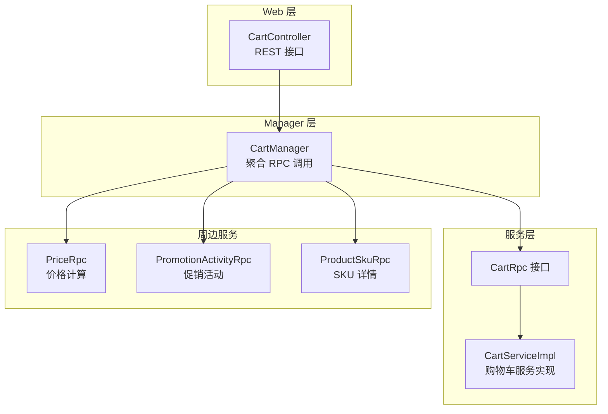
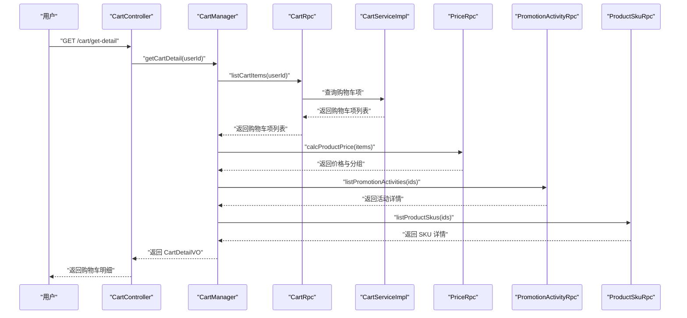
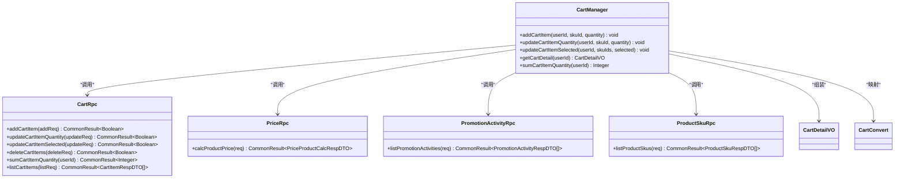
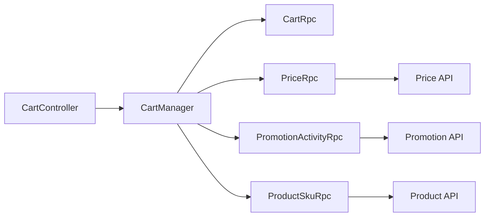

# 购物车功能

<cite>
**本文引用的文件**
- [CartController.java](file://shop-web-app/src/main/java/cn/iocoder/mall/shopweb/controller/trade/CartController.java)
- [CartManager.java](file://shop-web-app/src/main/java/cn/iocoder/mall/shopweb/service/trade/CartManager.java)
- [CartRpc.java](file://trade-service-project/trade-service-api/src/main/java/cn/iocoder/mall/tradeservice/rpc/cart/CartRpc.java)
- [CartItemAddReqDTO.java](file://trade-service-project/trade-service-api/src/main/java/cn/iocoder/mall/tradeservice/rpc/cart/dto/CartItemAddReqDTO.java)
- [CartItemUpdateQuantityReqDTO.java](file://trade-service-project/trade-service-api/src/main/java/cn/iocoder/mall/tradeservice/rpc/cart/dto/CartItemUpdateQuantityReqDTO.java)
- [CartItemUpdateSelectedReqDTO.java](file://trade-service-project/trade-service-api/src/main/java/cn/iocoder/mall/tradeservice/rpc/cart/dto/CartItemUpdateSelectedReqDTO.java)
- [CartItemDeleteListReqDTO.java](file://trade-service-project/trade-service-api/src/main/java/cn/iocoder/mall/tradeservice/rpc/cart/dto/CartItemDeleteListReqDTO.java)
- [CartItemListReqDTO.java](file://trade-service-project/trade-service-api/src/main/java/cn/iocoder/mall/tradeservice/rpc/cart/dto/CartItemListReqDTO.java)
- [CartDetailVO.java](file://shop-web-app/src/main/java/cn/iocoder/mall/shopweb/controller/trade/vo/cart/CartDetailVO.java)
- [CartConvert.java](file://shop-web-app/src/main/java/cn/iocoder/mall/shopweb/convert/trade/CartConvert.java)
- [CartServiceImpl.java](file://trade-service-project/trade-service-app/src/main/java/cn/iocoder/mall/tradeservice/application/service/cart/CartServiceImpl.java)
- [TradeOrderController.java](file://shop-web-app/src/main/java/cn/iocoder/mall/shopweb/controller/trade/TradeOrderController.java)
- [ServiceErrorCodeRange.java](file://common/common-framework/src/main/java/cn/iocoder/common/framework/exception/enums/ServiceErrorCodeRange.java)
</cite>

## 目录
1. [简介](#简介)
2. [项目结构](#项目结构)
3. [核心组件](#核心组件)
4. [架构总览](#架构总览)
5. [详细组件分析](#详细组件分析)
6. [依赖分析](#依赖分析)
7. [性能考虑](#性能考虑)
8. [故障排查指南](#故障排查指南)
9. [结论](#结论)
10. [附录](#附录)

## 简介
本文件系统性梳理 H5 商城的购物车功能，覆盖从 Web 层到服务层的完整链路，包括购物车商品添加、数量修改、商品删除、批量操作、购物车明细查询与费用计算、促销活动整合、以及与下单流程的协同。文档同时给出数据模型设计、前端 VO 结构、RPC 接口定义、错误码区间、以及性能优化与并发处理建议，帮助开发者快速理解并扩展购物车能力。

## 项目结构
购物车功能主要由三层构成：
- Web 层：对外暴露 REST 接口，负责鉴权与参数透传
- Manager 层：聚合 RPC 调用，组装购物车明细与费用
- 服务层：基于 Dubbo 的 CartRpc 实现，负责业务逻辑与持久化

图表来源
- [CartController.java:20-84](file://shop-web-app/src/main/java/cn/iocoder/mall/shopweb/controller/trade/CartController.java#L20-L84)
- [CartManager.java:28-169](file://shop-web-app/src/main/java/cn/iocoder/mall/shopweb/service/trade/CartManager.java#L28-L169)
- [CartRpc.java:11-62](file://trade-service-project/trade-service-api/src/main/java/cn/iocoder/mall/tradeservice/rpc/cart/CartRpc.java#L11-L62)
- [CartServiceImpl.java](file://trade-service-project/trade-service-app/src/main/java/cn/iocoder/mall/tradeservice/application/service/cart/CartServiceImpl.java)

章节来源
- [CartController.java:20-84](file://shop-web-app/src/main/java/cn/iocoder/mall/shopweb/controller/trade/CartController.java#L20-L84)
- [CartManager.java:28-169](file://shop-web-app/src/main/java/cn/iocoder/mall/shopweb/service/trade/CartManager.java#L28-L169)

## 核心组件
- Web 控制器：提供添加、查询数量、获取明细、更新数量、更新选中状态等接口
- Manager：封装 RPC 调用，统一组装购物车明细与费用信息
- RPC 接口：定义购物车增删改查、统计、批量操作等契约
- 数据传输对象：请求 DTO 与响应 DTO 明确字段约束
- 前端 VO：购物车明细视图对象，包含分组、SKU、SPU、费用等
- 转换器：将价格计算结果映射为前端 VO

章节来源
- [CartController.java:20-84](file://shop-web-app/src/main/java/cn/iocoder/mall/shopweb/controller/trade/CartController.java#L20-L84)
- [CartManager.java:28-169](file://shop-web-app/src/main/java/cn/iocoder/mall/shopweb/service/trade/CartManager.java#L28-L169)
- [CartRpc.java:11-62](file://trade-service-project/trade-service-api/src/main/java/cn/iocoder/mall/tradeservice/rpc/cart/CartRpc.java#L11-L62)
- [CartDetailVO.java:14-214](file://shop-web-app/src/main/java/cn/iocoder/mall/shopweb/controller/trade/vo/cart/CartDetailVO.java#L14-L214)
- [CartConvert.java:11-22](file://shop-web-app/src/main/java/cn/iocoder/mall/shopweb/convert/trade/CartConvert.java#L11-L22)

## 架构总览
购物车功能采用“Web → Manager → RPC → Service”的分层架构，Manager 聚合价格计算、促销活动与 SKU 详情，最终输出前端友好的购物车明细 VO。

图表来源
- [CartController.java:49-54](file://shop-web-app/src/main/java/cn/iocoder/mall/shopweb/controller/trade/CartController.java#L49-L54)
- [CartManager.java:96-135](file://shop-web-app/src/main/java/cn/iocoder/mall/shopweb/service/trade/CartManager.java#L96-L135)
- [CartRpc.java:53-59](file://trade-service-project/trade-service-api/src/main/java/cn/iocoder/mall/tradeservice/rpc/cart/CartRpc.java#L53-L59)

## 详细组件分析

### Web 层：CartController
- 提供以下接口：
  - 添加商品到购物车：POST /cart/add
  - 查询购物车商品数量：GET /cart/sum-quantity
  - 获取购物车明细：GET /cart/get-detail
  - 更新购物车商品数量：POST /cart/update-quantity
  - 更新购物车商品选中状态：POST /cart/update-selected
- 统一鉴权注解，使用用户上下文获取 userId

章节来源
- [CartController.java:29-81](file://shop-web-app/src/main/java/cn/iocoder/mall/shopweb/controller/trade/CartController.java#L29-L81)

### Manager 层：CartManager
- 职责：
  - 调用 CartRpc 完成购物车增删改查与统计
  - 调用 PriceRpc 进行价格与分组计算
  - 调用 PromotionActivityRpc 获取促销活动信息
  - 调用 ProductSkuRpc 获取 SKU 详情
  - 将多源数据组装为 CartDetailVO
- 关键方法：
  - addCartItem(userId, skuId, quantity)
  - updateCartItemQuantity(userId, skuId, quantity)
  - updateCartItemSelected(userId, skuIds, selected)
  - getCartDetail(userId)
  - sumCartItemQuantity(userId)

图表来源
- [CartManager.java:28-169](file://shop-web-app/src/main/java/cn/iocoder/mall/shopweb/service/trade/CartManager.java#L28-L169)
- [CartRpc.java:11-62](file://trade-service-project/trade-service-api/src/main/java/cn/iocoder/mall/tradeservice/rpc/cart/CartRpc.java#L11-L62)
- [CartDetailVO.java:14-214](file://shop-web-app/src/main/java/cn/iocoder/mall/shopweb/controller/trade/vo/cart/CartDetailVO.java#L14-L214)
- [CartConvert.java:11-22](file://shop-web-app/src/main/java/cn/iocoder/mall/shopweb/convert/trade/CartConvert.java#L11-L22)

章节来源
- [CartManager.java:47-135](file://shop-web-app/src/main/java/cn/iocoder/mall/shopweb/service/trade/CartManager.java#L47-L135)

### RPC 接口与数据模型
- CartRpc：定义购物车增删改查、统计、批量查询等接口
- 请求 DTO：
  - CartItemAddReqDTO：用户编号、SKU 编号、数量（校验）
  - CartItemUpdateQuantityReqDTO：用户编号、SKU 编号、数量（校验）
  - CartItemUpdateSelectedReqDTO：用户编号、SKU 列表、是否选中
  - CartItemDeleteListReqDTO：用户编号、SKU 列表
  - CartItemListReqDTO：用户编号、可选筛选字段
- 响应 DTO：CartItemRespDTO（由服务端返回）

章节来源
- [CartRpc.java:11-62](file://trade-service-project/trade-service-api/src/main/java/cn/iocoder/mall/tradeservice/rpc/cart/CartRpc.java#L11-L62)
- [CartItemAddReqDTO.java:13-35](file://trade-service-project/trade-service-api/src/main/java/cn/iocoder/mall/tradeservice/rpc/cart/dto/CartItemAddReqDTO.java#L13-L35)
- [CartItemUpdateQuantityReqDTO.java:13-35](file://trade-service-project/trade-service-api/src/main/java/cn/iocoder/mall/tradeservice/rpc/cart/dto/CartItemUpdateQuantityReqDTO.java#L13-L35)
- [CartItemUpdateSelectedReqDTO.java:13-34](file://trade-service-project/trade-service-api/src/main/java/cn/iocoder/mall/tradeservice/rpc/cart/dto/CartItemUpdateSelectedReqDTO.java#L13-L34)
- [CartItemDeleteListReqDTO.java:13-29](file://trade-service-project/trade-service-api/src/main/java/cn/iocoder/mall/tradeservice/rpc/cart/dto/CartItemDeleteListReqDTO.java#L13-L29)
- [CartItemListReqDTO.java:12-27](file://trade-service-project/trade-service-api/src/main/java/cn/iocoder/mall/tradeservice/rpc/cart/dto/CartItemListReqDTO.java#L12-L27)

### 前端 VO：CartDetailVO
- 结构要点：
  - itemGroups：按活动分组的商品集合
  - fee：购买总价、优惠总价、邮费、最终价格
  - ItemGroup：包含活动信息与子项列表
  - Sku：SKU 基础信息、SPU 信息、购买数量、是否选中、原单价、购买单价、最终单价、购买小计、优惠小计、最终小计
  - Spu：SPU 基本信息与主图
  - Postage：邮费阈值等（预留）

章节来源
- [CartDetailVO.java:14-214](file://shop-web-app/src/main/java/cn/iocoder/mall/shopweb/controller/trade/vo/cart/CartDetailVO.java#L14-L214)

### 转换器：CartConvert
- 将价格计算响应映射为前端 VO 字段，保证数据一致性

章节来源
- [CartConvert.java:11-22](file://shop-web-app/src/main/java/cn/iocoder/mall/shopweb/convert/trade/CartConvert.java#L11-L22)

### 服务实现：CartServiceImpl
- 负责购物车业务逻辑与持久化，提供 CartRpc 的具体实现
- 支持添加、更新数量、更新选中、删除、统计、查询等

章节来源
- [CartServiceImpl.java](file://trade-service-project/trade-service-app/src/main/java/cn/iocoder/mall/tradeservice/application/service/cart/CartServiceImpl.java)

### 与下单流程的集成
- 订单确认页与下单接口会从购物车加载结算信息，确保用户在下单前能预览最终价格与活动优惠

章节来源
- [TradeOrderController.java:45-66](file://shop-web-app/src/main/java/cn/iocoder/mall/shopweb/controller/trade/TradeOrderController.java#L45-L66)

## 依赖分析
- Web 层仅依赖 Manager；Manager 通过 Dubbo 调用多个 RPC 接口
- 价格计算、促销活动、SKU 详情均作为外部依赖，Manager 负责编排与聚合
- 错误码区间对购物车模块有明确范围划分，便于定位问题

图表来源
- [CartManager.java:28-39](file://shop-web-app/src/main/java/cn/iocoder/mall/shopweb/service/trade/CartManager.java#L28-L39)
- [CartRpc.java:11-62](file://trade-service-project/trade-service-api/src/main/java/cn/iocoder/mall/tradeservice/rpc/cart/CartRpc.java#L11-L62)

章节来源
- [ServiceErrorCodeRange.java:42-42](file://common/common-framework/src/main/java/cn/iocoder/common/framework/exception/enums/ServiceErrorCodeRange.java#L42-L42)

## 性能考虑
- 批量查询与去重
  - 在聚合促销活动与 SKU 详情时，先收集去重 ID，再一次性批量查询，避免多次往返
- 价格计算与分组
  - 通过一次价格计算接口返回分组与费用，减少后续二次计算
- 前端渲染优化
  - 使用分组结构，前端可按组渲染，降低 DOM 重组成本
- 并发与一致性
  - 数量更新与选中状态更新建议使用幂等接口，结合后端唯一索引与事务保障一致性
- 缓存策略（建议）
  - 对 SKU 详情与促销活动进行短期缓存，降低 RPC 压力
- 网络抖动与超时
  - 为各 RPC 调用设置合理超时与重试策略，避免阻塞主线程

## 故障排查指南
- 常见错误定位
  - 购物车 RPC 调用失败：检查 CartRpc 实现与服务注册中心状态
  - 价格计算异常：核对 PriceRpc 输入参数与活动 ID 是否匹配
  - 促销活动缺失：确认 PromotionActivityRpc 返回的活动 ID 是否在数据库中存在
  - SKU 详情为空：确认 ProductSkuRpc 查询条件与字段列表
- 错误码区间
  - 购物车相关错误码区间位于公共框架定义范围内，便于统一拦截与提示

章节来源
- [ServiceErrorCodeRange.java:42-42](file://common/common-framework/src/main/java/cn/iocoder/common/framework/exception/enums/ServiceErrorCodeRange.java#L42-L42)

## 结论
购物车功能通过清晰的分层与 RPC 聚合，实现了从添加、修改、删除到明细展示与费用计算的完整闭环。前端 VO 设计直观，便于渲染与交互；服务层通过 CartServiceImpl 提供稳定可靠的业务实现。建议在生产环境中进一步完善缓存、并发控制与监控告警，持续提升用户体验与系统稳定性。

## 附录

### API 接口一览
- 添加商品到购物车
  - 方法：POST
  - 路径：/cart/add
  - 参数：skuId, quantity
- 查询购物车商品数量
  - 方法：GET
  - 路径：/cart/sum-quantity
- 获取购物车明细
  - 方法：GET
  - 路径：/cart/get-detail
- 更新购物车商品数量
  - 方法：POST
  - 路径：/cart/update-quantity
  - 参数：skuId, quantity
- 更新购物车商品选中状态
  - 方法：POST
  - 路径：/cart/update-selected
  - 参数：skuIds（数组）, selected

章节来源
- [CartController.java:29-81](file://shop-web-app/src/main/java/cn/iocoder/mall/shopweb/controller/trade/CartController.java#L29-L81)

### 数据模型与字段说明
- 请求 DTO
  - CartItemAddReqDTO：用户编号、SKU 编号、数量（>0）
  - CartItemUpdateQuantityReqDTO：用户编号、SKU 编号、数量（>0）
  - CartItemUpdateSelectedReqDTO：用户编号、SKU 列表、是否选中
  - CartItemDeleteListReqDTO：用户编号、SKU 列表
  - CartItemListReqDTO：用户编号、可选筛选字段
- 响应 DTO
  - CartItemRespDTO：由服务端返回，包含购物车项基础信息
- 前端 VO
  - CartDetailVO：包含分组、SKU、SPU、费用等字段

章节来源
- [CartItemAddReqDTO.java:13-35](file://trade-service-project/trade-service-api/src/main/java/cn/iocoder/mall/tradeservice/rpc/cart/dto/CartItemAddReqDTO.java#L13-L35)
- [CartItemUpdateQuantityReqDTO.java:13-35](file://trade-service-project/trade-service-api/src/main/java/cn/iocoder/mall/tradeservice/rpc/cart/dto/CartItemUpdateQuantityReqDTO.java#L13-L35)
- [CartItemUpdateSelectedReqDTO.java:13-34](file://trade-service-project/trade-service-api/src/main/java/cn/iocoder/mall/tradeservice/rpc/cart/dto/CartItemUpdateSelectedReqDTO.java#L13-L34)
- [CartItemDeleteListReqDTO.java:13-29](file://trade-service-project/trade-service-api/src/main/java/cn/iocoder/mall/tradeservice/rpc/cart/dto/CartItemDeleteListReqDTO.java#L13-L29)
- [CartItemListReqDTO.java:12-27](file://trade-service-project/trade-service-api/src/main/java/cn/iocoder/mall/tradeservice/rpc/cart/dto/CartItemListReqDTO.java#L12-L27)
- [CartDetailVO.java:14-214](file://shop-web-app/src/main/java/cn/iocoder/mall/shopweb/controller/trade/vo/cart/CartDetailVO.java#L14-L214)