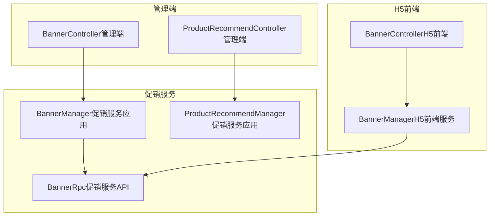
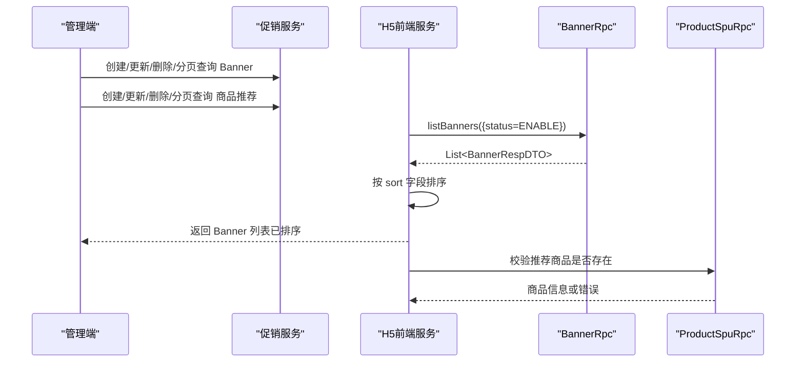
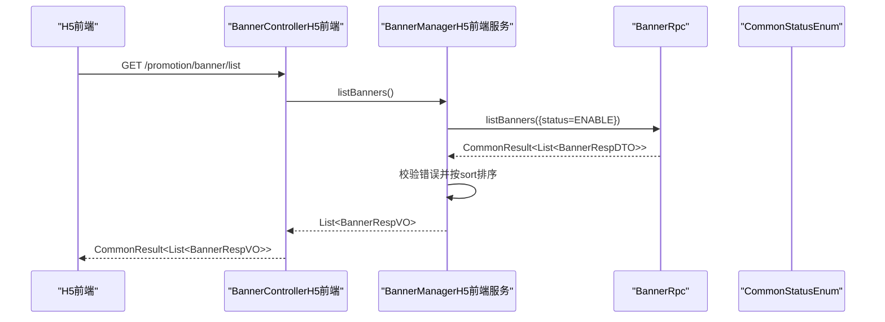
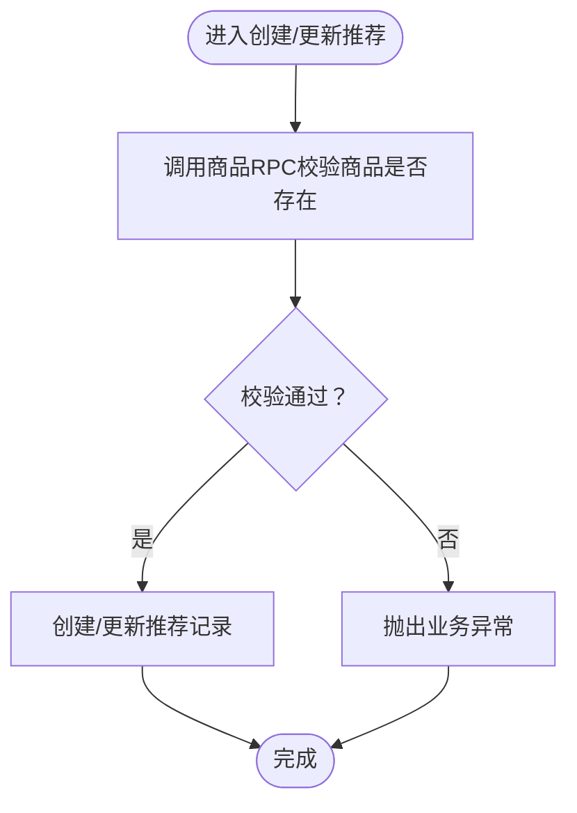
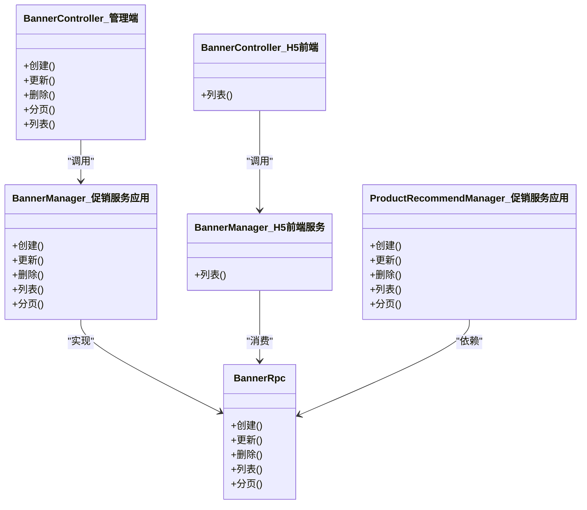

# 首页功能

<cite>
**本文引用的文件**
- [BannerRpc.java](file://promotion-service-project/promotion-service-api/src/main/java/cn/iocoder/mall/promotion/api/rpc/banner/BannerRpc.java)
- [BannerManager.java（促销服务应用）](file://promotion-service-project/promotion-service-app/src/main/java/cn/iocoder/mall/promotionservice/manager/banner/BannerManager.java)
- [BannerController.java（管理端）](file://management-web-app/src/main/java/cn/ihocoder/mall/managementweb/controller/promotion/brand/BannerController.java)
- [BannerController.java（H5前端）](file://shop-web-app/src/main/java/cn/iocoder/mall/shopweb/controller/promotion/BannerController.java)
- [BannerManager.java（H5前端服务）](file://shop-web-app/src/main/java/cn/iocoder/mall/shopweb/service/promotion/BannerManager.java)
- [ProductRecommendManager.java（促销服务应用）](file://promotion-service-project/promotion-service-app/src/main/java/cn/iocoder/mall/promotionservice/manager/recommend/ProductRecommendManager.java)
- [ProductRecommendController.java（管理端）](file://management-web-app/src/main/java/cn/iocoder/mall/managementweb/controller/promotion/recommend/ProductRecommendController.java)
- [CommonResult.java](file://common/common-framework/src/main/java/cn/iocoder/common/framework/vo/CommonResult.java)
- [CommonStatusEnum.java](file://common/common-framework/src/main/java/cn/iocoder/common/framework/enums/CommonStatusEnum.java)
</cite>

## 目录
1. [简介](#简介)
2. [项目结构](#项目结构)
3. [核心组件](#核心组件)
4. [架构总览](#架构总览)
5. [详细组件分析](#详细组件分析)
6. [依赖关系分析](#依赖关系分析)
7. [性能考量](#性能考量)
8. [故障排查指南](#故障排查指南)
9. [结论](#结论)
10. [附录](#附录)

## 简介
本文件面向H5商城首页功能，围绕首页广告位管理、商品推荐系统（手动推荐）、轮播图展示、快捷入口导航等核心模块，系统性阐述数据获取流程、配置管理、推荐算法实现原理、页面渲染机制，并给出API调用示例、数据结构说明、前端展示效果建议以及性能优化策略与用户体验设计要点。

## 项目结构
首页功能涉及三层：管理端（管理后台对广告位与推荐进行配置）、促销服务（提供广告位与推荐的后端能力）、H5前端（消费促销服务，渲染首页内容）。

图表来源
- [BannerController.java（管理端）:25-61](file://management-web-app/src/main/java/cn/iocoder/mall/managementweb/controller/promotion/brand/BannerController.java#L25-L61)
- [ProductRecommendController.java（管理端）:24-52](file://management-web-app/src/main/java/cn/iocoder/mall/managementweb/controller/promotion/recommend/ProductRecommendController.java#L24-L52)
- [BannerRpc.java:12-52](file://promotion-service-project/promotion-service-api/src/main/java/cn/iocoder/mall/promotion/api/rpc/banner/BannerRpc.java#L12-L52)
- [BannerManager.java（促销服务应用）:15-42](file://promotion-service-project/promotion-service-app/src/main/java/cn/iocoder/mall/promotionservice/manager/banner/BannerManager.java#L15-L42)
- [ProductRecommendManager.java（促销服务应用）:22-66](file://promotion-service-project/promotion-service-app/src/main/java/cn/iocoder/mall/promotionservice/manager/recommend/ProductRecommendManager.java#L22-L66)
- [BannerController.java（H5前端）:18-33](file://shop-web-app/src/main/java/cn/iocoder/mall/shopweb/controller/promotion/BannerController.java#L18-L33)
- [BannerManager.java（H5前端服务）:20-37](file://shop-web-app/src/main/java/cn/iocoder/mall/shopweb/service/promotion/BannerManager.java#L20-L37)

章节来源
- [BannerController.java（管理端）:25-61](file://management-web-app/src/main/java/cn/iocoder/mall/managementweb/controller/promotion/brand/BannerController.java#L25-L61)
- [BannerController.java（H5前端）:18-33](file://shop-web-app/src/main/java/cn/iocoder/mall/shopweb/controller/promotion/BannerController.java#L18-L33)
- [BannerManager.java（H5前端服务）:20-37](file://shop-web-app/src/main/java/cn/iocoder/mall/shopweb/service/promotion/BannerManager.java#L20-L37)
- [BannerRpc.java:12-52](file://promotion-service-project/promotion-service-api/src/main/java/cn/iocoder/mall/promotion/api/rpc/banner/BannerRpc.java#L12-L52)
- [BannerManager.java（促销服务应用）:15-42](file://promotion-service-project/promotion-service-app/src/main/java/cn/iocoder/mall/promotionservice/manager/banner/BannerManager.java#L15-L42)
- [ProductRecommendManager.java（促销服务应用）:22-66](file://promotion-service-project/promotion-service-app/src/main/java/cn/iocoder/mall/promotionservice/manager/recommend/ProductRecommendManager.java#L22-L66)

## 核心组件
- 广告位管理（Banner）
  - 管理端提供创建、更新、删除、分页查询、列表查询等能力。
  - H5前端通过RPC调用获取启用状态的广告位并按排序字段排序后返回给前端展示。
- 商品推荐系统（手动推荐）
  - 管理端提供推荐商品的增删改查与分页。
  - H5前端通过RPC获取推荐列表用于首页“为你推荐”等区域。
- 页面渲染与排序
  - H5前端在获取到数据后，按sort字段进行稳定排序，保证展示顺序可控。
- 统一返回体
  - 所有接口统一使用通用返回体封装错误码与数据。

章节来源
- [BannerController.java（管理端）:25-61](file://management-web-app/src/main/java/cn/iocoder/mall/managementweb/controller/promotion/brand/BannerController.java#L25-L61)
- [BannerController.java（H5前端）:18-33](file://shop-web-app/src/main/java/cn/iocoder/mall/shopweb/controller/promotion/BannerController.java#L18-L33)
- [BannerManager.java（H5前端服务）:27-35](file://shop-web-app/src/main/java/cn/iocoder/mall/shopweb/service/promotion/BannerManager.java#L27-L35)
- [BannerRpc.java:12-52](file://promotion-service-project/promotion-service-api/src/main/java/cn/iocoder/mall/promotion/api/rpc/banner/BannerRpc.java#L12-L52)
- [ProductRecommendManager.java（促销服务应用）:32-52](file://promotion-service-project/promotion-service-app/src/main/java/cn/iocoder/mall/promotionservice/manager/recommend/ProductRecommendManager.java#L32-L52)
- [CommonResult.java](file://common/common-framework/src/main/java/cn/iocoder/common/framework/vo/CommonResult.java)

## 架构总览
H5首页的数据流从管理端配置开始，促销服务提供RPC能力，H5前端通过Dubbo消费RPC并进行本地排序与转换，最终渲染到页面。

图表来源
- [BannerController.java（管理端）:25-61](file://management-web-app/src/main/java/cn/iocoder/mall/managementweb/controller/promotion/brand/BannerController.java#L25-L61)
- [ProductRecommendController.java（管理端）:24-52](file://management-web-app/src/main/java/cn/iocoder/mall/managementweb/controller/promotion/recommend/ProductRecommendController.java#L24-L52)
- [BannerRpc.java:12-52](file://promotion-service-project/promotion-service-api/src/main/java/cn/iocoder/mall/promotion/api/rpc/banner/BannerRpc.java#L12-L52)
- [BannerManager.java（促销服务应用）:15-42](file://promotion-service-project/promotion-service-app/src/main/java/cn/iocoder/mall/promotionservice/manager/banner/BannerManager.java#L15-L42)
- [ProductRecommendManager.java（促销服务应用）:22-66](file://promotion-service-project/promotion-service-app/src/main/java/cn/iocoder/mall/promotionservice/manager/recommend/ProductRecommendManager.java#L22-L66)
- [BannerController.java（H5前端）:18-33](file://shop-web-app/src/main/java/cn/iocoder/mall/shopweb/controller/promotion/BannerController.java#L18-L33)
- [BannerManager.java（H5前端服务）:20-37](file://shop-web-app/src/main/java/cn/iocoder/mall/shopweb/service/promotion/BannerManager.java#L20-L37)

## 详细组件分析

### 广告位管理（Banner）
- 管理端接口
  - 提供创建、更新、删除、分页查询、列表查询等能力，权限控制基于注解。
- H5前端接口
  - 提供获取所有启用状态的Banner列表接口，内部通过RPC调用促销服务，过滤状态并按sort排序后返回。
- 数据结构
  - BannerRpc定义了创建、更新、删除、列表、分页等方法；H5前端通过BannerRespDTO接收数据并转换为BannerRespVO返回给前端。
- 错误处理
  - 统一使用CommonResult封装，调用方需检查checkError后再读取data。

图表来源
- [BannerController.java（H5前端）:27-31](file://shop-web-app/src/main/java/cn/iocoder/mall/shopweb/controller/promotion/BannerController.java#L27-L31)
- [BannerManager.java（H5前端服务）:27-35](file://shop-web-app/src/main/java/cn/iocoder/mall/shopweb/service/promotion/BannerManager.java#L27-L35)
- [BannerRpc.java:36-42](file://promotion-service-project/promotion-service-api/src/main/java/cn/iocoder/mall/promotion/api/rpc/banner/BannerRpc.java#L36-L42)
- [CommonStatusEnum.java](file://common/common-framework/src/main/java/cn/iocoder/common/framework/enums/CommonStatusEnum.java)

章节来源
- [BannerController.java（管理端）:25-61](file://management-web-app/src/main/java/cn/iocoder/mall/managementweb/controller/promotion/brand/BannerController.java#L25-L61)
- [BannerController.java（H5前端）:18-33](file://shop-web-app/src/main/java/cn/iocoder/mall/shopweb/controller/promotion/BannerController.java#L18-L33)
- [BannerManager.java（H5前端服务）:20-37](file://shop-web-app/src/main/java/cn/iocoder/mall/shopweb/service/promotion/BannerManager.java#L20-L37)
- [BannerRpc.java:12-52](file://promotion-service-project/promotion-service-api/src/main/java/cn/iocoder/mall/promotion/api/rpc/banner/BannerRpc.java#L12-L52)
- [CommonResult.java](file://common/common-framework/src/main/java/cn/iocoder/common/framework/vo/CommonResult.java)

### 商品推荐系统（手动推荐）
- 管理端接口
  - 提供推荐商品的创建、更新、删除、分页查询、列表查询。
- 推荐校验
  - 在创建/更新推荐前，调用商品RPC校验商品是否存在，若不存在则抛出业务异常。
- H5前端使用
  - H5前端通过RPC获取推荐列表，用于首页“为你推荐”等区域。

图表来源
- [ProductRecommendManager.java（促销服务应用）:40-64](file://promotion-service-project/promotion-service-app/src/main/java/cn/iocoder/mall/promotionservice/manager/recommend/ProductRecommendManager.java#L40-L64)
- [ProductRecommendController.java（管理端）:24-52](file://management-web-app/src/main/java/cn/iocoder/mall/managementweb/controller/promotion/recommend/ProductRecommendController.java#L24-L52)

章节来源
- [ProductRecommendManager.java（促销服务应用）:22-66](file://promotion-service-project/promotion-service-app/src/main/java/cn/iocoder/mall/promotionservice/manager/recommend/ProductRecommendManager.java#L22-L66)
- [ProductRecommendController.java（管理端）:24-52](file://management-web-app/src/main/java/cn/iocoder/mall/managementweb/controller/promotion/recommend/ProductRecommendController.java#L24-L52)

### 页面渲染机制与排序
- H5前端在获取到Banner列表后，按sort字段进行稳定排序，确保展示顺序可控。
- 推荐列表同样遵循管理端配置的顺序，前端无需额外处理。

章节来源
- [BannerManager.java（H5前端服务）:27-35](file://shop-web-app/src/main/java/cn/iocoder/mall/shopweb/service/promotion/BannerManager.java#L27-L35)

## 依赖关系分析
- 管理端依赖促销服务提供的BannerRpc与推荐RPC接口，完成配置与维护。
- H5前端通过BannerManager消费BannerRpc，获取启用状态的Banner并排序后返回。
- 商品推荐在创建/更新时依赖商品RPC进行存在性校验，确保推荐的商品有效。

图表来源
- [BannerController.java（管理端）:25-61](file://management-web-app/src/main/java/cn/iocoder/mall/managementweb/controller/promotion/brand/BannerController.java#L25-L61)
- [BannerRpc.java:12-52](file://promotion-service-project/promotion-service-api/src/main/java/cn/iocoder/mall/promotion/api/rpc/banner/BannerRpc.java#L12-L52)
- [BannerManager.java（促销服务应用）:15-42](file://promotion-service-project/promotion-service-app/src/main/java/cn/iocoder/mall/promotionservice/manager/banner/BannerManager.java#L15-L42)
- [BannerController.java（H5前端）:18-33](file://shop-web-app/src/main/java/cn/iocoder/mall/shopweb/controller/promotion/BannerController.java#L18-L33)
- [BannerManager.java（H5前端服务）:20-37](file://shop-web-app/src/main/java/cn/iocoder/mall/shopweb/service/promotion/BannerManager.java#L20-L37)
- [ProductRecommendManager.java（促销服务应用）:22-66](file://promotion-service-project/promotion-service-app/src/main/java/cn/iocoder/mall/promotionservice/manager/recommend/ProductRecommendManager.java#L22-L66)

## 性能考量
- RPC调用链路
  - 建议在H5前端侧对Banner列表进行短期内存缓存（如LRU），减少重复RPC调用。
- 排序与转换
  - 排序在前端执行，复杂度O(n log n)，建议在数据量较大时考虑后端排序并透传排序字段。
- 统一返回体
  - 使用CommonResult统一错误处理，避免重复判错逻辑，提升稳定性。
- 并发与降级
  - 对Banner与推荐RPC增加超时与重试策略，必要时引入熔断与降级，保障首页加载可用性。

## 故障排查指南
- 常见问题
  - Banner列表为空：确认管理端是否已创建并启用，H5前端请求参数中status=ENABLE是否正确传递。
  - 推荐商品无效：检查商品RPC返回，确认商品是否存在；若不存在，需先创建商品再添加推荐。
  - 排序异常：确认后端返回的sort字段是否正确，前端是否按sort排序。
- 定位步骤
  - 查看BannerRpc的列表与分页接口返回值，确认CommonResult的错误码与data。
  - 检查BannerManager（H5前端服务）的listBanners方法是否正确设置status并排序。
  - 检查ProductRecommendManager在创建/更新时对商品RPC的调用是否成功。

章节来源
- [BannerManager.java（H5前端服务）:27-35](file://shop-web-app/src/main/java/cn/iocoder/mall/shopweb/service/promotion/BannerManager.java#L27-L35)
- [ProductRecommendManager.java（促销服务应用）:40-64](file://promotion-service-project/promotion-service-app/src/main/java/cn/iocoder/mall/promotionservice/manager/recommend/ProductRecommendManager.java#L40-L64)
- [CommonResult.java](file://common/common-framework/src/main/java/cn/iocoder/common/framework/vo/CommonResult.java)

## 结论
首页功能以“配置—服务—前端消费”的方式组织，管理端负责广告位与推荐配置，促销服务提供稳定的RPC能力，H5前端负责数据获取、排序与渲染。通过统一返回体与清晰的职责划分，系统具备良好的可维护性与扩展性。建议在生产环境中结合缓存、限流与降级策略，进一步提升首页性能与稳定性。

## 附录

### API接口定义（示例）
- 获取Banner列表（H5前端）
  - 方法：GET
  - 路径：/promotion/banner/list
  - 请求参数：无
  - 返回：CommonResult<List<BannerRespVO>>
- 创建Banner（管理端）
  - 方法：POST
  - 路径：/promotion/banner/create
  - 权限：promotion:banner:create
  - 返回：CommonResult<Integer>
- 更新Banner（管理端）
  - 方法：POST
  - 路径：/promotion/banner/update
  - 权限：promotion:banner:update
  - 返回：CommonResult<Boolean>
- 删除Banner（管理端）
  - 方法：POST
  - 路径：/promotion/banner/delete
  - 权限：promotion:banner:delete
  - 返回：CommonResult<Boolean>
- 分页查询Banner（管理端）
  - 方法：POST
  - 路径：/promotion/banner/page
  - 权限：promotion:banner:page
  - 返回：CommonResult<PageResult<BannerRespDTO>>

章节来源
- [BannerController.java（H5前端）:27-31](file://shop-web-app/src/main/java/cn/iocoder/mall/shopweb/controller/promotion/BannerController.java#L27-L31)
- [BannerController.java（管理端）:35-61](file://management-web-app/src/main/java/cn/iocoder/mall/managementweb/controller/promotion/brand/BannerController.java#L35-L61)
- [BannerRpc.java:12-52](file://promotion-service-project/promotion-service-api/src/main/java/cn/iocoder/mall/promotion/api/rpc/banner/BannerRpc.java#L12-L52)