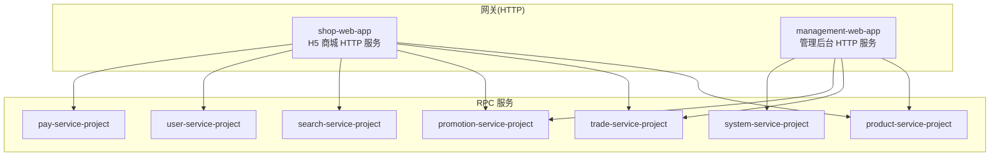
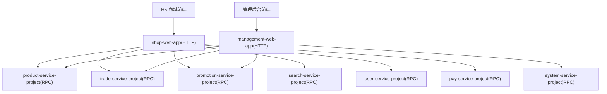
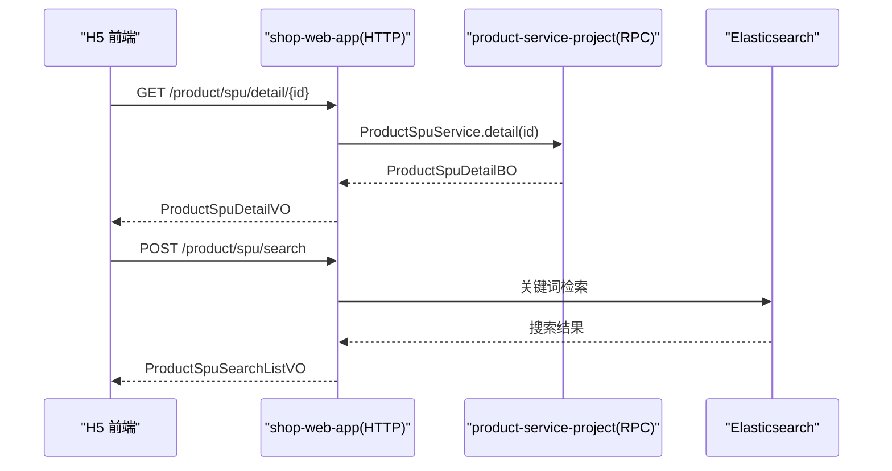
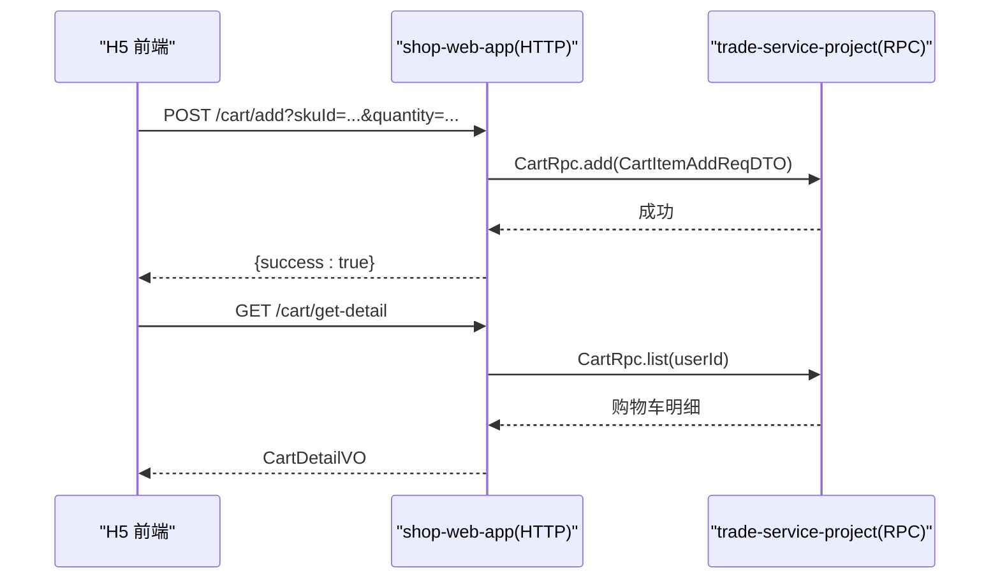
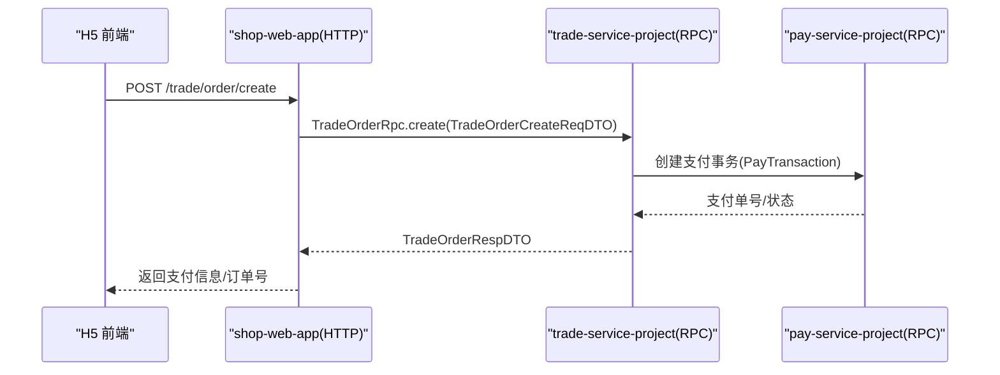
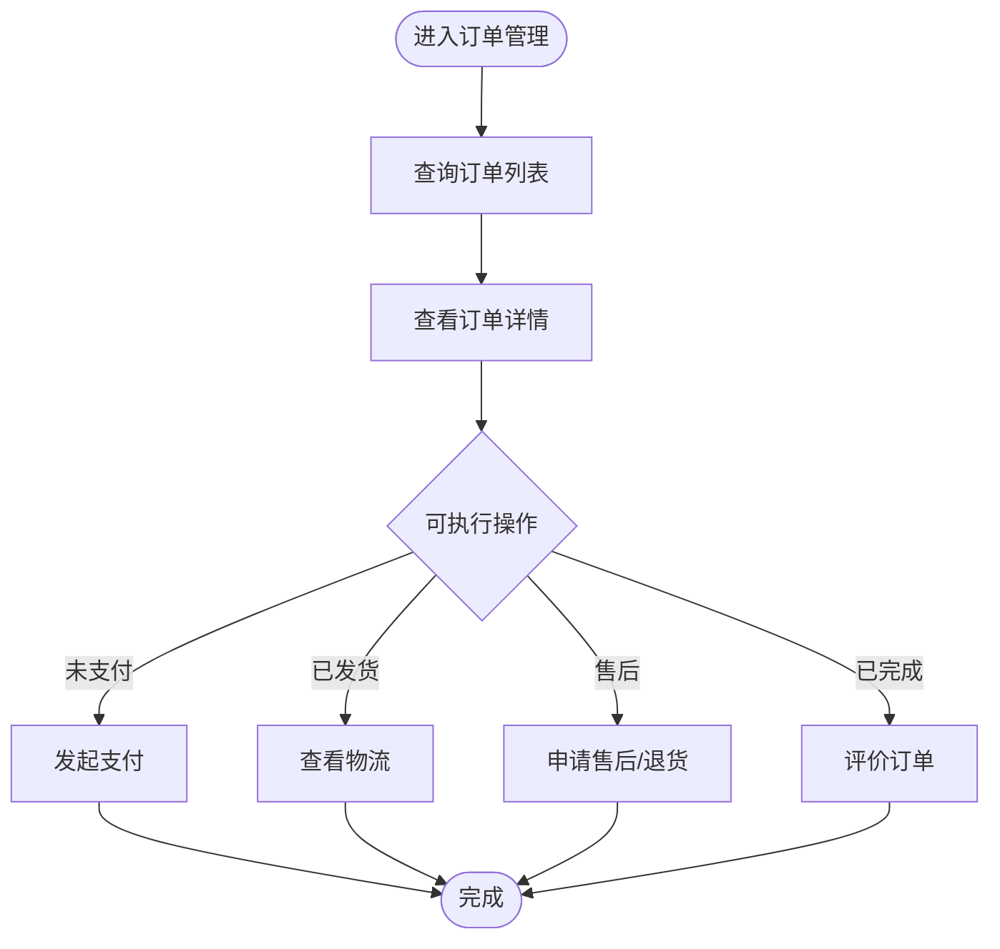
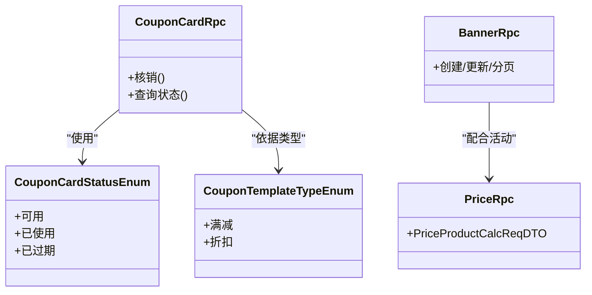
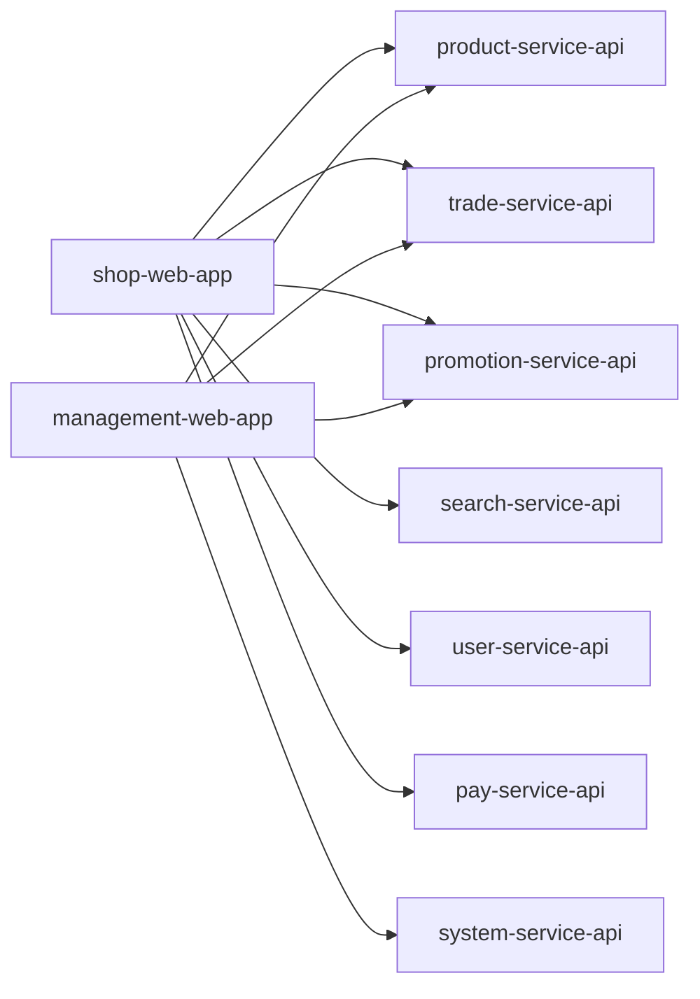

# 核心特性

<cite>
**本文引用的文件**
- [README.md](file://README.md)
- [功能列表-H5 商城.md](file://docs/guides/功能列表/功能列表-H5 商城.md)
- [功能列表-管理后台.md](file://docs/guides/功能列表/功能列表-管理后台.md)
- [quick-start.md](file://docs/setup/quick-start.md)
- [ShopWebApplication.java](file://shop-web-app/src/main/java/cn/iocoder/mall/shopweb/ShopWebApplication.java)
- [ManagementWebApplication.java](file://management-web-app/src/main/java/cn/iocoder/mall/managementweb/ManagementWebApplication.java)
- [CartController.java](file://shop-web-app/src/main/java/cn/iocoder/mall/shopweb/controller/trade/CartController.java)
- [TradeOrderRpc.java](file://trade-service-project/trade-service-api/src/main/java/cn/iocoder/mall/tradeservice/rpc/order/TradeOrderRpc.java)
- [TradeOrderCreateReqDTO.java](file://trade-service-project/trade-service-api/src/main/java/cn/iocoder/mall/tradeservice/rpc/order/dto/TradeOrderCreateReqDTO.java)
- [TradeOrderRespDTO.java](file://trade-service-project/trade-service-api/src/main/java/cn/iocoder/mall/tradeservice/rpc/order/dto/TradeOrderRespDTO.java)
- [CartRpc.java](file://trade-service-project/trade-service-api/src/main/java/cn/iocoder/mall/tradeservice/rpc/cart/CartRpc.java)
- [CartItemAddReqDTO.java](file://trade-service-project/trade-service-api/src/main/java/cn/iocoder/mall/tradeservice/rpc/cart/dto/CartItemAddReqDTO.java)
- [CouponCardRpc.java](file://promotion-service-project/promotion-service-api/src/main/java/cn/iocoder/mall/promotion/api/rpc/coupon/CouponCardRpc.java)
- [CouponCardStatusEnum.java](file://promotion-service-project/promotion-service-api/src/main/java/cn/iocoder/mall/promotion/api/enums/coupon/card/CouponCardStatusEnum.java)
- [CouponTemplateTypeEnum.java](file://promotion-service-project/promotion-service-api/src/main/java/cn/iocoder/mall/promotion/api/enums/coupon/template/CouponTemplateTypeEnum.java)
- [BannerRpc.java](file://promotion-service-project/promotion-service-api/src/main/java/cn/iocoder/mall/promotion/api/rpc/banner/BannerRpc.java)
- [PriceRpc.java](file://promotion-service-project/promotion-service-api/src/main/java/cn/iocoder/mall/promotion/api/rpc/price/PriceRpc.java)
- [PriceProductCalcReqDTO.java](file://promotion-service-project/promotion-service-api/src/main/java/cn/iocoder/mall/promotion/api/rpc/price/dto/PriceProductCalcReqDTO.java)
- [ProductSpuController.java](file://shop-web-app/src/main/java/cn/iocoder/mall/shopweb/controller/product/ProductSpuController.java)
- [ProductSkuController.java](file://shop-web-app/src/main/java/cn/iocoder/mall/shopweb/controller/product/ProductSkuController.java)
- [ProductSpuSearchListDTO.java](file://product-service-project/product-service-api/src/main/java/cn/iocoder/mall/productservice/api/dto/ProductSpuSearchListDTO.java)
- [PayTransactionServiceImpl.java](file://pay-service-project/pay-service-app/src/main/java/cn/iocoder/mall/payservice/biz/service/PayTransactionServiceImpl.java)
- [PayRefundServiceImpl.java](file://pay-service-project/pay-service-app/src/main/java/cn/iocoder/mall/payservice/biz/service/PayRefundServiceImpl.java)
- [PayTransactionClient.java](file://trade-service-project/trade-service-app/src/main/java/cn/iocoder/mall/tradeservice/client/pay/PayTransactionClient.java)
- [ProductSpuService.java](file://product-service-project/product-service-api/src/main/java/cn/iocoder/mall/productservice/api/rpc/spu/ProductSpuService.java)
- [ProductSpuDetailBO.java](file://product-service-project/product-service-api/src/main/java/cn/iocoder/mall/productservice/api/bo/ProductSpuDetailBO.java)
- [ProductSpuDetailVO.java](file://shop-web-app/src/main/java/cn/iocoder/mall/shopweb/vo/product/ProductSpuDetailVO.java)
- [ProductSpuPageVO.java](file://shop-web-app/src/main/java/cn/iocoder/mall/shopweb/vo/product/ProductSpuPageVO.java)
- [ProductSpuListDTO.java](file://product-service-project/product-service-api/src/main/java/cn/iocoder/mall/productservice/api/dto/ProductSpuListDTO.java)
- [ProductSpuListBO.java](file://product-service-project/product-service-api/src/main/java/cn/iocoder/mall/productservice/api/bo/ProductSpuListBO.java)
- [ProductSpuListVO.java](file://shop-web-app/src/main/java/cn/iocoder/mall/shopweb/vo/product/ProductSpuListVO.java)
- [ProductSpuSearchListDTO.java](file://product-service-project/product-service-api/src/main/java/cn/iocoder/mall/productservice/api/dto/ProductSpuSearchListDTO.java)
- [ProductSpuSearchListBO.java](file://product-service-project/product-service-api/src/main/java/cn/iocoder/mall/productservice/api/bo/ProductSpuSearchListBO.java)
- [ProductSpuSearchListVO.java](file://shop-web-app/src/main/java/cn/iocoder/mall/shopweb/vo/product/ProductSpuSearchListVO.java)
- [ProductSpuCategoryListDTO.java](file://product-service-project/product-service-api/src/main/java/cn/iocoder/mall/productservice/api/dto/ProductSpuCategoryListDTO.java)
- [ProductSpuCategoryListBO.java](file://product-service-project/product-service-api/src/main/java/cn/iocoder/mall/productservice/api/bo/ProductSpuCategoryListBO.java)
- [ProductSpuCategoryListVO.java](file://shop-web-app/src/main/java/cn/iocoder/mall/shopweb/vo/product/ProductSpuCategoryListVO.java)
- [ProductSpuDetailVO.java](file://shop-web-app/src/main/java/cn/iocoder/mall/shopweb/vo/product/ProductSpuDetailVO.java)
- [ProductSpuDetailBO.java](file://product-service-project/product-service-api/src/main/java/cn/iocoder/mall/productservice/api/bo/ProductSpuDetailBO.java)
- [ProductSpuDetailVO_convert](file://shop-web-app/src/main/java/cn/iocoder/mall/shopweb/convert/product/ProductSpuConvert.java)
- [ProductSpuDetailBO_convert](file://product-service-project/product-service-api/src/main/java/cn/iocoder/mall/productservice/api/convert/ProductSpuConvert.java)
- [ProductSpuDetailBO_convert](file://product-service-project/product-service-app/src/main/java/cn/iocoder/mall/productservice/app/convert/ProductSpuConvert.java)
- [ProductSpuDetailBO_convert](file://product-service-project/product-service-app/src/main/java/cn/iocoder/mall/productservice/app/convert/ProductSpuConvert.java)
- [ProductSpuDetailBO_convert](file://product-service-project/product-service-app/src/main/java/cn/iocoder/mall/productservice/app/convert/ProductSpuConvert.java)
- [ProductSpuDetailBO_convert](file://product-service-project/product-service-app/src/main/java/cn/iocoder/mall/productservice/app/convert/ProductSpuConvert.java)
- [ProductSpuDetailBO_convert](file://product-service-project/product-service-app/src/main/java/cn/iocoder/mall/productservice/app/convert/ProductSpuConvert.java)
- [ProductSpuDetailBO_convert](file://product-service-project/product-service-app/src/main/java/cn/iocoder/mall/productservice/app/convert/ProductSpuConvert.java)
- [ProductSpuDetailBO_convert](file://product-service-project/product-service-app/src/main/java/cn/iocoder/mall/productservice/app/convert/ProductSpuConvert.java)
- [ProductSpuDetailBO_convert](file://product-service-project/product-service-app/src/main/java/cn/iocoder/mall/productservice/app/convert/ProductSpuConvert.java)
- [ProductSpuDetailBO_convert](file://product-service-project/product-service-app/src/main/java/cn/iocoder/mall/productservice/app/convert/ProductSpuConvert.java)
- [ProductSpuDetailBO_convert](file://product-service-project/product-service-app/src/main/java/cn/iocoder/mall/productservice/app/convert/ProductSpuConvert.java)
- [ProductSpuDetailBO_convert](file://product-service-project/product-service-app/src/main/java/cn/iocoder/mall/productservice/app/convert/ProductSpuConvert.java)
- [ProductSpuDetailBO_convert](file://product-service-project/product-service-app/src/main/java/cn/iocoder/mall/productservice/app/convert/ProductSpuConvert.java)
- [ProductSpuDetailBO_convert](file://product-service-project/product-service-app/src/main/java/cn/iocoder/mall/productservice/app/convert/ProductSpuConvert.java)
- [ProductSpuDetailBO_convert](file://product-service-project/product-service-app/src/main/java/cn/iocoder/mall/productservice/app/convert/ProductSpuConvert.java)
- [ProductSpuDetailBO_convert](file://product-service-project/product-service-app/src/main/java/cn/iocoder......mall/productservice/app/convert/ProductSpuConvert.java)
</cite>

## 目录
1. [简介](#简介)
2. [项目结构](#项目结构)
3. [核心组件](#核心组件)
4. [架构总览](#架构总览)
5. [详细组件分析](#详细组件分析)
6. [依赖分析](#依赖分析)
7. [性能考量](#性能考量)
8. [故障排查指南](#故障排查指南)
9. [结论](#结论)
10. [附录](#附录)

## 简介
Onemall 是一个面向 B2C 电商场景的微服务实战项目，提供 H5 商城与管理后台两大核心平台。H5 商城覆盖商品浏览、购物车、下单支付、订单管理、用户中心等电商主链路；管理后台支持商品管理、订单处理、用户管理、营销活动、数据统计等运营能力。项目采用多模块分层架构，结合 Dubbo RPC、RocketMQ 消息、Elasticsearch 搜索、SkyWalking 监控等中间件，形成高可用、可扩展的电商基础设施。

## 项目结构
- 前后端分离：前端由独立仓库维护，后端按“网关 HTTP + RPC 服务”分层组织。
- 后端模块划分：
  - 网关层：shop-web-app（H5 商城 HTTP 服务）、management-web-app（管理后台 HTTP 服务）
  - RPC 服务层：system-service-project（系统）、user-service-project（用户）、promotion-service-project（营销）、pay-service-project（支付）、trade-service-project（交易）、product-service-project（商品）、search-service-project（搜索）

图表来源
- [ShopWebApplication.java:1-14](file://shop-web-app/src/main/java/cn/iocoder/mall/shopweb/ShopWebApplication.java#L1-L14)
- [ManagementWebApplication.java:1-14](file://management-web-app/src/main/java/cn/iocoder/mall/managementweb/ManagementWebApplication.java#L1-L14)

章节来源
- [README.md:107-139](file://README.md#L107-L139)
- [quick-start.md:150-167](file://docs/setup/quick-start.md#L150-L167)

## 核心组件
- H5 商城 HTTP 服务：提供商品、购物车、订单、营销、用户等前端所需接口。
- 管理后台 HTTP 服务：提供管理侧商品、订单、用户、营销、系统等后台接口。
- RPC 服务层：按领域拆分，职责清晰，便于扩展与治理。
- 关键枚举与 DTO：统一定义营销活动状态、优惠券类型与状态、价格计算请求等，保证跨模块契约稳定。

章节来源
- [功能列表-H5 商城.md:1-35](file://docs/guides/功能列表/功能列表-H5 商城.md#L1-L35)
- [功能列表-管理后台.md:1-61](file://docs/guides/功能列表/功能列表-管理后台.md#L1-L61)

## 架构总览
H5 商城与管理后台通过各自 HTTP 网关对接 RPC 服务，形成“前端 -> 网关 -> RPC 服务”的调用链。商品、订单、营销、支付等核心域分别由独立服务承载，通过 Dubbo RPC 交互，配合 RocketMQ 实现异步解耦与削峰填谷。

图表来源
- [README.md:109-126](file://README.md#L109-L126)
- [quick-start.md:150-167](file://docs/setup/quick-start.md#L150-L167)

## 详细组件分析

### 商品浏览与搜索
- 商品详情：H5 提供商品 SPU 详情展示，包含 SKU 规格、库存、价格等信息，支持收藏、分享等能力。
- 商品列表：支持分类筛选、品牌筛选、价格区间、排序等维度。
- 搜索功能：基于 Elasticsearch 实现全文检索，支持关键词匹配、分词、高亮与结果聚合。

图表来源
- [ProductSpuController.java](file://shop-web-app/src/main/java/cn/iocoder/mall/shopweb/controller/product/ProductSpuController.java)
- [ProductSpuService.java](file://product-service-project/product-service-api/src/main/java/cn/iocoder/mall/productservice/api/rpc/spu/ProductSpuService.java)
- [ProductSpuSearchListDTO.java](file://product-service-project/product-service-api/src/main/java/cn/iocoder/mall/productservice/api/dto/ProductSpuSearchListDTO.java)

章节来源
- [功能列表-H5 商城.md:9-15](file://docs/guides/功能列表/功能列表-H5 商城.md#L9-L15)
- [ProductSpuDetailBO.java](file://product-service-project/product-service-api/src/main/java/cn/iocoder/mall/productservice/api/bo/ProductSpuDetailBO.java)
- [ProductSpuDetailVO.java](file://shop-web-app/src/main/java/cn/iocoder/mall/shopweb/vo/product/ProductSpuDetailVO.java)

### 购物车
- 接口能力：添加商品、查询购物车明细、更新数量、勾选/取消勾选。
- 安全约束：所有购物车接口均需登录态校验。
- 数据模型：以用户维度存储购物车项，SKU 为唯一标识，支持批量选择与合计数量统计。

图表来源
- [CartController.java:29-54](file://shop-web-app/src/main/java/cn/iocoder/mall/shopweb/controller/trade/CartController.java#L29-L54)
- [CartRpc.java](file://trade-service-project/trade-service-api/src/main/java/cn/iocoder/mall/tradeservice/rpc/cart/CartRpc.java)
- [CartItemAddReqDTO.java](file://trade-service-project/trade-service-api/src/main/java/cn/iocoder/mall/tradeservice/rpc/cart/dto/CartItemAddReqDTO.java)

章节来源
- [功能列表-H5 商城.md:24-25](file://docs/guides/功能列表/功能列表-H5 商城.md#L24-L25)

### 下单与支付
- 下单流程：从前端提交订单创建请求，经交易服务聚合商品、地址、优惠、价格计算，生成订单并返回支付信息。
- 支付集成：交易服务调用支付服务完成支付事务，支持回调通知与退款流程。

图表来源
- [TradeOrderRpc.java](file://trade-service-project/trade-service-api/src/main/java/cn/iocoder/mall/tradeservice/rpc/order/TradeOrderRpc.java)
- [TradeOrderCreateReqDTO.java](file://trade-service-project/trade-service-api/src/main/java/cn/iocoder/mall/tradeservice/rpc/order/dto/TradeOrderCreateReqDTO.java)
- [TradeOrderRespDTO.java](file://trade-service-project/trade-service-api/src/main/java/cn/iocoder/mall/tradeservice/rpc/order/dto/TradeOrderRespDTO.java)
- [PayTransactionClient.java](file://trade-service-project/trade-service-app/src/main/java/cn/iocoder/mall/tradeservice/client/pay/PayTransactionClient.java)
- [PayTransactionServiceImpl.java](file://pay-service-project/pay-service-app/src/main/java/cn/iocoder/mall/payservice/biz/service/PayTransactionServiceImpl.java)

章节来源
- [功能列表-H5 商城.md:16-23](file://docs/guides/功能列表/功能列表-H5 商城.md#L16-L23)

### 订单管理
- 订单列表与详情：支持分页查询、状态筛选、物流信息查看。
- 售后与退换：提供售后申请、状态跟踪与处理流程。
- 价格计算：通过价格计算 RPC 对订单商品进行满减、优惠券、会员折扣等计算。

图表来源
- [TradeOrderRpc.java](file://trade-service-project/trade-service-api/src/main/java/cn/iocoder/mall/tradeservice/rpc/order/TradeOrderRpc.java)
- [PriceRpc.java](file://promotion-service-project/promotion-service-api/src/main/java/cn/iocoder/mall/promotion/api/rpc/price/PriceRpc.java)
- [PriceProductCalcReqDTO.java](file://promotion-service-project/promotion-service-api/src/main/java/cn/iocoder/mall/promotion/api/rpc/price/dto/PriceProductCalcReqDTO.java)

章节来源
- [功能列表-H5 商城.md:16-23](file://docs/guides/功能列表/功能列表-H5 商城.md#L16-L23)

### 营销活动与优惠券
- 优惠券：支持模板创建、发放、核销与状态管理；支持满减、折扣等券类型。
- 轮播图与推荐：首页广告位与商品推荐位管理。
- 价格计算：统一的价格计算服务，承接下单时的优惠叠加逻辑。

图表来源
- [CouponCardRpc.java](file://promotion-service-project/promotion-service-api/src/main/java/cn/iocoder/mall/promotion/api/rpc/coupon/CouponCardRpc.java)
- [CouponCardStatusEnum.java](file://promotion-service-project/promotion-service-api/src/main/java/cn/iocoder/mall/promotion/api/enums/coupon/card/CouponCardStatusEnum.java)
- [CouponTemplateTypeEnum.java](file://promotion-service-project/promotion-service-api/src/main/java/cn/iocoder/mall/promotion/api/enums/coupon/template/CouponTemplateTypeEnum.java)
- [BannerRpc.java](file://promotion-service-project/promotion-service-api/src/main/java/cn/iocoder/mall/promotion/api/rpc/banner/BannerRpc.java)
- [PriceRpc.java](file://promotion-service-project/promotion-service-api/src/main/java/cn/iocoder/mall/promotion/api/rpc/price/PriceRpc.java)

章节来源
- [功能列表-H5 商城.md:26-28](file://docs/guides/功能列表/功能列表-H5 商城.md#L26-L28)
- [功能列表-管理后台.md:34-44](file://docs/guides/功能列表/功能列表-管理后台.md#L34-L44)

### 用户中心
- 登录与注册：基于用户服务的认证与授权能力。
- 收货地址：地址管理、默认地址设置。
- 个人信息：头像、昵称、绑定手机等资料维护。

章节来源
- [功能列表-H5 商城.md:29-35](file://docs/guides/功能列表/功能列表-H5 商城.md#L29-L35)

### 管理后台功能
- 商品管理：发布商品、上下架、规格管理、类目与品牌管理。
- 订单管理：销售单与售后单处理、评价管理。
- 用户管理：会员资料、等级、积分、标签等。
- 营销管理：首页广告、商品推荐、优惠券、满减送、拼团等。
- 系统管理：员工、角色、权限、部门、数据字典、短信管理等。

章节来源
- [功能列表-管理后台.md:17-61](file://docs/guides/功能列表/功能列表-管理后台.md#L17-L61)

## 依赖分析
- 控制器到服务：H5 与管理后台的控制器通过 RPC 客户端调用对应服务，避免直接依赖具体实现。
- 服务间耦合：交易服务依赖支付、商品、用户、营销等服务，采用异步消息与幂等设计降低耦合。
- 枚举与 DTO：营销、订单、商品等领域的枚举与 DTO 在 API 层集中定义，确保跨模块一致性。

图表来源
- [README.md:109-126](file://README.md#L109-L126)

章节来源
- [README.md:109-126](file://README.md#L109-L126)

## 性能考量
- 搜索性能：基于 Elasticsearch 的全文检索，结合分词与索引策略，满足高并发查询。
- 价格计算：集中式价格计算服务，避免重复计算，提升下单链路吞吐。
- 缓存与异步：购物车、商品详情等热点数据可引入缓存；订单、退款等长耗时流程采用消息异步化。
- 监控与可观测：SkyWalking 分布式追踪、Prometheus/Grafana 指标面板、日志采集，支撑问题定位与容量规划。

## 故障排查指南
- 启动顺序：系统服务、用户服务、商品服务、支付服务、营销服务、订单服务、搜索服务。
- 数据准备：首次启动无数据，需通过管理后台或接口补齐基础数据（类目、品牌、商品、优惠券模板等）。
- 支付联调：支付服务涉及第三方通道，需按文档配置回调与对账流程。
- 日志与告警：结合 SkyWalking 跟踪链路，Grafana 查看指标，快速定位异常。

章节来源
- [quick-start.md:150-187](file://docs/setup/quick-start.md#L150-L187)

## 结论
Onemall 以微服务架构为基础，围绕 H5 商城与管理后台两大前台，构建了从商品、营销、交易到支付、搜索、系统的完整电商能力矩阵。通过清晰的服务边界、统一的 RPC 约定与完善的监控体系，既能满足业务快速迭代，也为后续扩展与优化打下坚实基础。

## 附录
- 快速开始：按文档指引安装 MySQL、Zookeeper、RocketMQ、Elasticsearch，配置各服务 application.yaml，按顺序启动后端服务与前端工程。
- 演示地址：管理后台与 H5 商城在线演示入口见 README。

章节来源
- [quick-start.md:1-191](file://docs/setup/quick-start.md#L1-L191)
- [README.md:34-96](file://README.md#L34-L96)