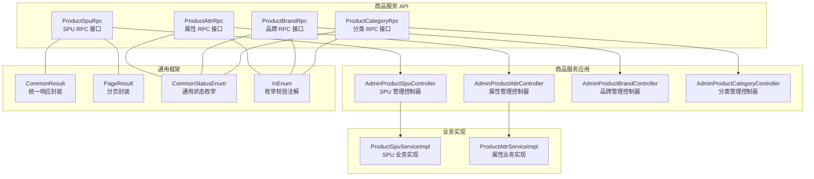
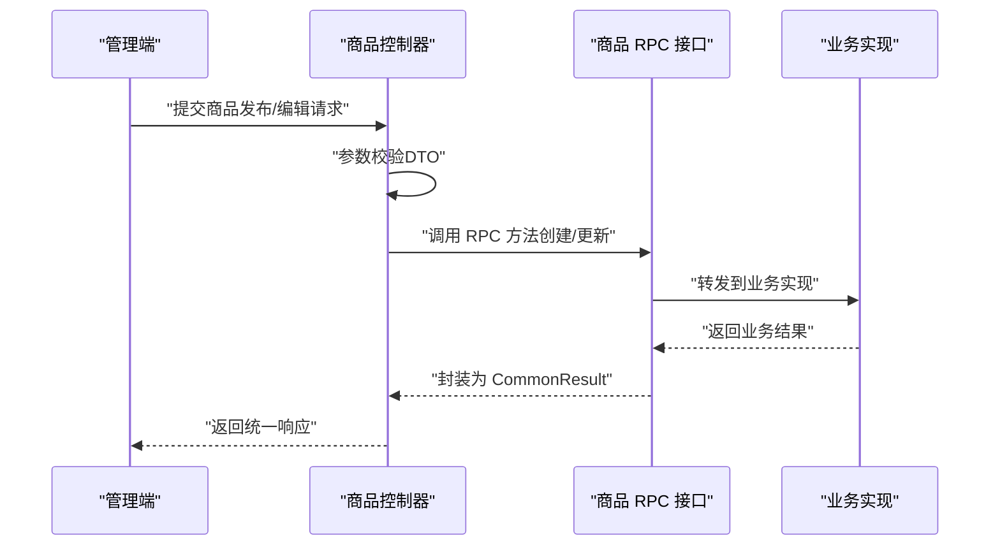
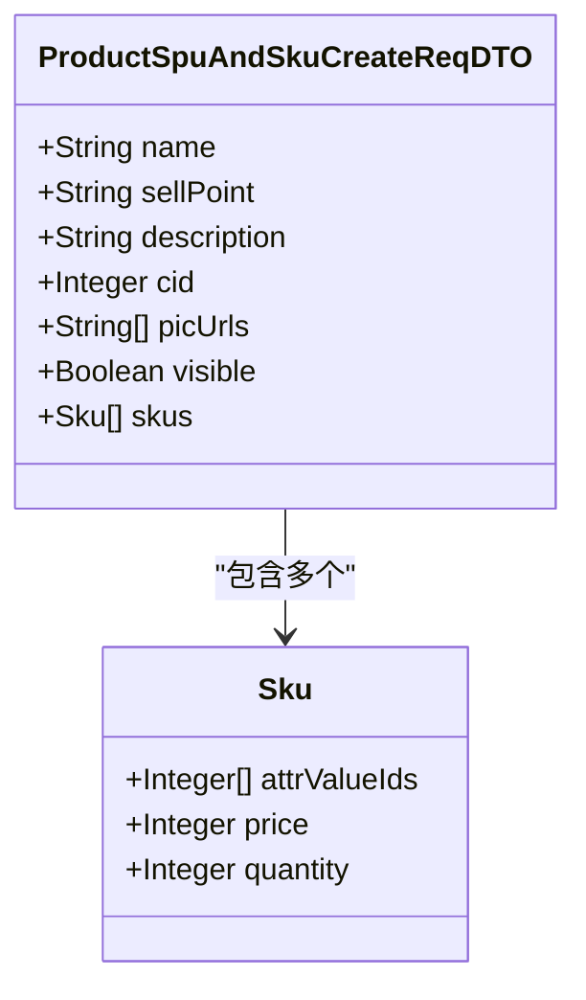
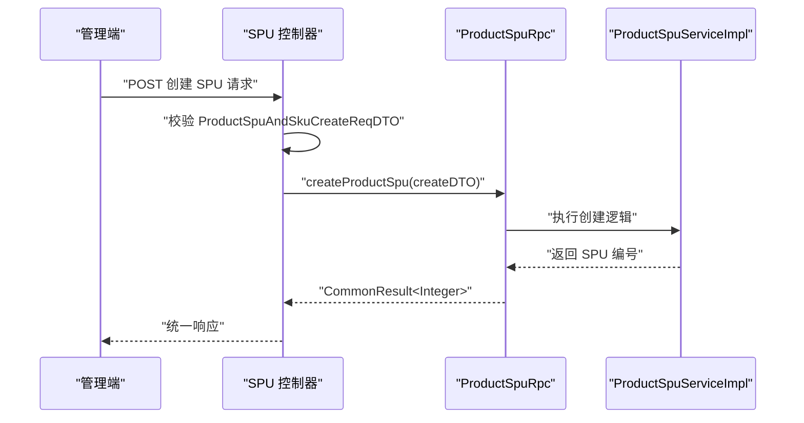
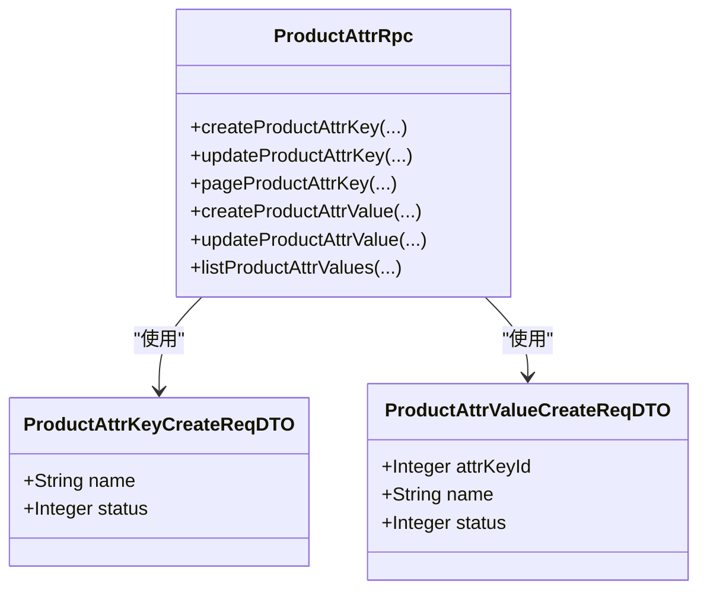
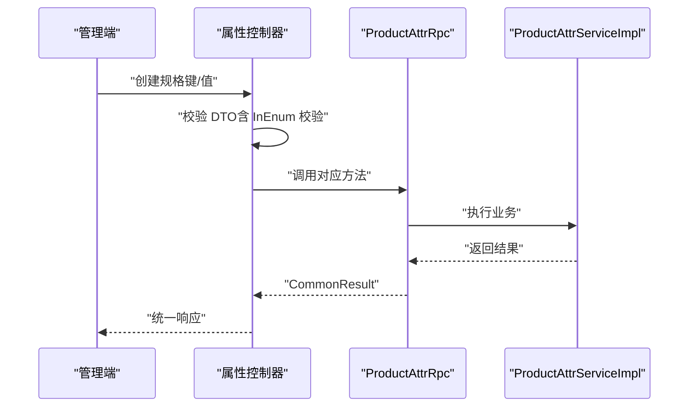
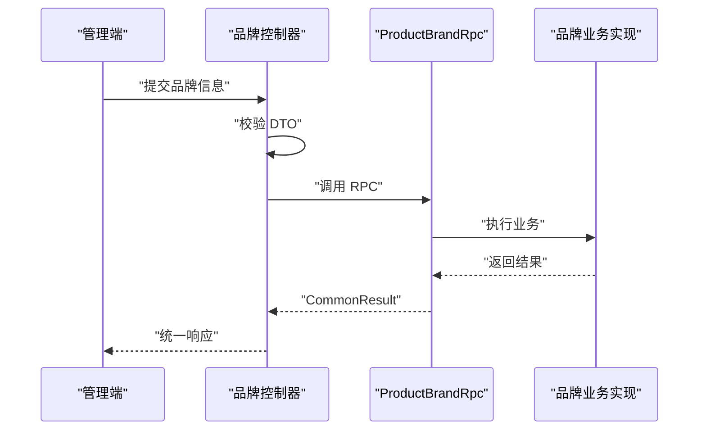
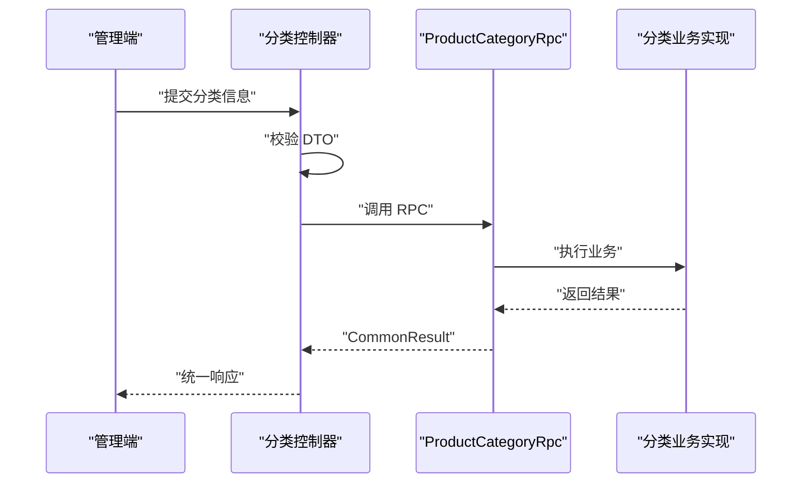
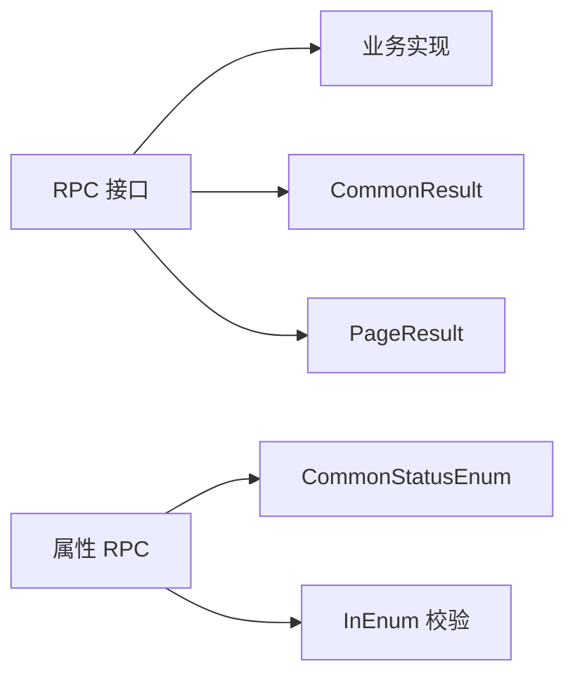

# 商品管理

<cite>
**本文引用的文件**
- [ProductSpuRpc.java](file://product-service-project/product-service-api/src/main/java/cn/iocoder/mall/productservice/rpc/spu/ProductSpuRpc.java)
- [ProductSpuAndSkuCreateReqDTO.java](file://product-service-project/product-service-api/src/main/java/cn/iocoder/mall/productservice/rpc/spu/dto/ProductSpuAndSkuCreateReqDTO.java)
- [ProductSpuAndSkuUpdateReqDTO.java](file://product-service-project/product-service-api/src/main/java/cn/iocoder/mall/productservice/rpc/spu/dto/ProductSpuAndSkuUpdateReqDTO.java)
- [ProductAttrRpc.java](file://product-service-project/product-service-api/src/main/java/cn/iocoder/mall/productservice/rpc/attr/ProductAttrRpc.java)
- [ProductAttrKeyCreateReqDTO.java](file://product-service-project/product-service-api/src/main/java/cn/iocoder/mall/productservice/rpc/attr/dto/ProductAttrKeyCreateReqDTO.java)
- [ProductAttrValueCreateReqDTO.java](file://product-service-project/product-service-api/src/main/java/cn/iocoder/mall/productservice/rpc/attr/dto/ProductAttrValueCreateReqDTO.java)
- [ProductBrandRpc.java](file://product-service-project/product-service-api/src/main/java/cn/iocoder/mall/productservice/rpc/brand/ProductBrandRpc.java)
- [ProductBrandCreateReqDTO.java](file://product-service-project/product-service-api/src/main/java/cn/iocoder/mall/productservice/rpc/brand/dto/ProductBrandCreateReqDTO.java)
- [ProductCategoryRpc.java](file://product-service-project/product-service-api/src/main/java/cn/iocoder/mall/productservice/rpc/category/ProductCategoryRpc.java)
- [ProductCategoryCreateReqDTO.java](file://product-service-project/product-service-api/src/main/java/cn/iocoder/mall/productservice/rpc/category/dto/ProductCategoryCreateReqDTO.java)
- [CommonResult.java](file://common/common-framework/src/main/java/cn/iocoder/common/framework/vo/CommonResult.java)
- [PageResult.java](file://common/common-framework/src/main/java/cn/iocoder/common/framework/vo/PageResult.java)
- [CommonStatusEnum.java](file://common/common-framework/src/main/java/cn/iocoder/common/framework/enums/CommonStatusEnum.java)
- [InEnum.java](file://common/common-framework/src/main/java/cn/iocoder/common/framework/validator/InEnum.java)
- [ProductSpuServiceImpl.java](file://moved/product/product-service-impl/src/main/java/cn/iocoder/mall/product/service/ProductSpuServiceImpl.java)
- [ProductAttrServiceImpl.java](file://moved/product/product-service-impl/src/main/java/cn/iocoder/mall/product/service/ProductAttrServiceImpl.java)
</cite>

## 目录
1. [简介](#简介)
2. [项目结构](#项目结构)
3. [核心组件](#核心组件)
4. [架构总览](#架构总览)
5. [详细组件分析](#详细组件分析)
6. [依赖分析](#依赖分析)
7. [性能考虑](#性能考虑)
8. [故障排查指南](#故障排查指南)
9. [结论](#结论)
10. [附录](#附录)

## 简介
本文件面向商品管理系统的业务与技术读者，系统性梳理商品管理的完整能力边界与实现要点，覆盖以下主题：
- 商品 SPU/SKU 管理：发布、编辑、上下架、库存与价格管理
- 商品属性管理：规格键与规格值的增删改查、状态控制
- 品牌管理：品牌信息维护与状态管理
- 分类管理：多级分类的层级结构与排序
- 审核与批量操作：基于 RPC 的接口能力与调用方职责
- 数据模型与 API 规范：字段定义、校验规则与返回结构
- 操作流程图与最佳实践：从录入到上架、从属性维护到分类配置的全流程建议

## 项目结构
本仓库采用多模块分层设计，商品管理相关能力主要分布在如下模块：
- product-service-api：商品领域 RPC 接口与 DTO 定义（SPU、属性、品牌、分类）
- product-service-app：商品服务应用（含控制器、业务实现等）
- moved/product：历史迁移模块，包含部分业务实现类（如 SPUs、属性）
- common/common-framework：通用 VO、枚举与校验注解

图表来源
- [ProductSpuRpc.java:1-66](file://product-service-project/product-service-api/src/main/java/cn/iocoder/mall/productservice/rpc/spu/ProductSpuRpc.java#L1-L66)
- [ProductAttrRpc.java:1-85](file://product-service-project/product-service-api/src/main/java/cn/iocoder/mall/productservice/rpc/attr/ProductAttrRpc.java#L1-L85)
- [ProductBrandRpc.java:1-64](file://product-service-project/product-service-api/src/main/java/cn/iocoder/mall/productservice/rpc/brand/ProductBrandRpc.java#L1-L64)
- [ProductCategoryRpc.java:1-63](file://product-service-project/product-service-api/src/main/java/cn/iocoder/mall/productservice/rpc/category/ProductCategoryRpc.java#L1-L63)
- [CommonResult.java](file://common/common-framework/src/main/java/cn/iocoder/common/framework/vo/CommonResult.java)
- [PageResult.java](file://common/common-framework/src/main/java/cn/iocoder/common/framework/vo/PageResult.java)
- [CommonStatusEnum.java](file://common/common-framework/src/main/java/cn/iocoder/common/framework/enums/CommonStatusEnum.java)
- [InEnum.java](file://common/common-framework/src/main/java/cn/iocoder/common/framework/validator/InEnum.java)

章节来源
- [ProductSpuRpc.java:1-66](file://product-service-project/product-service-api/src/main/java/cn/iocoder/mall/productservice/rpc/spu/ProductSpuRpc.java#L1-L66)
- [ProductAttrRpc.java:1-85](file://product-service-project/product-service-api/src/main/java/cn/iocoder/mall/productservice/rpc/attr/ProductAttrRpc.java#L1-L85)
- [ProductBrandRpc.java:1-64](file://product-service-project/product-service-api/src/main/java/cn/iocoder/mall/productservice/rpc/brand/ProductBrandRpc.java#L1-L64)
- [ProductCategoryRpc.java:1-63](file://product-service-project/product-service-api/src/main/java/cn/iocoder/mall/productservice/rpc/category/ProductCategoryRpc.java#L1-L63)

## 核心组件
本节聚焦商品管理的关键能力与数据模型，包括 SPU/SKU、属性、品牌、分类四大模块。

- SPU 管理
  - 能力：创建、更新、按 ID/集合/分页查询、顺序拉取 SPU 编号、详情字段选择查询
  - 关键 DTO：创建与更新请求 DTO 包含基本信息（名称、卖点、描述、分类、主图）、可见性、SKU 列表
  - 返回结构：统一使用 CommonResult 封装，分页使用 PageResult
- 属性管理
  - 能力：规格键与规格值的创建、更新、查询、分页（键）；键下规格值列表查询
  - 关键 DTO：键创建包含名称与状态；值创建包含键编号、名称与状态
  - 校验：状态使用 InEnum 校验，确保在 CommonStatusEnum 范围内
- 品牌管理
  - 能力：创建、更新、删除、按 ID/集合/分页查询
  - 关键 DTO：包含品牌名称、描述、LOGO 图片、状态
- 分类管理
  - 能力：创建、更新、删除、按 ID/集合/条件查询
  - 关键 DTO：包含父编号、名称、描述、图片、排序、状态

章节来源
- [ProductSpuRpc.java:1-66](file://product-service-project/product-service-api/src/main/java/cn/iocoder/mall/productservice/rpc/spu/ProductSpuRpc.java#L1-L66)
- [ProductSpuAndSkuCreateReqDTO.java:1-91](file://product-service-project/product-service-api/src/main/java/cn/iocoder/mall/productservice/rpc/spu/dto/ProductSpuAndSkuCreateReqDTO.java#L1-L91)
- [ProductSpuAndSkuUpdateReqDTO.java:1-97](file://product-service-project/product-service-api/src/main/java/cn/iocoder/mall/productservice/rpc/spu/dto/ProductSpuAndSkuUpdateReqDTO.java#L1-L97)
- [ProductAttrRpc.java:1-85](file://product-service-project/product-service-api/src/main/java/cn/iocoder/mall/productservice/rpc/attr/ProductAttrRpc.java#L1-L85)
- [ProductAttrKeyCreateReqDTO.java:1-32](file://product-service-project/product-service-api/src/main/java/cn/iocoder/mall/productservice/rpc/attr/dto/ProductAttrKeyCreateReqDTO.java#L1-L32)
- [ProductAttrValueCreateReqDTO.java:1-37](file://product-service-project/product-service-api/src/main/java/cn/iocoder/mall/productservice/rpc/attr/dto/ProductAttrValueCreateReqDTO.java#L1-L37)
- [ProductBrandRpc.java:1-64](file://product-service-project/product-service-api/src/main/java/cn/iocoder/mall/productservice/rpc/brand/ProductBrandRpc.java#L1-L64)
- [ProductBrandCreateReqDTO.java:1-37](file://product-service-project/product-service-api/src/main/java/cn/iocoder/mall/productservice/rpc/brand/dto/ProductBrandCreateReqDTO.java#L1-L37)
- [ProductCategoryRpc.java:1-63](file://product-service-project/product-service-api/src/main/java/cn/iocoder/mall/productservice/rpc/category/ProductCategoryRpc.java#L1-L63)
- [ProductCategoryCreateReqDTO.java:1-50](file://product-service-project/product-service-api/src/main/java/cn/iocoder/mall/productservice/rpc/category/dto/ProductCategoryCreateReqDTO.java#L1-L50)
- [CommonResult.java](file://common/common-framework/src/main/java/cn/iocoder/common/framework/vo/CommonResult.java)
- [PageResult.java](file://common/common-framework/src/main/java/cn/iocoder/common/framework/vo/PageResult.java)
- [CommonStatusEnum.java](file://common/common-framework/src/main/java/cn/iocoder/common/framework/enums/CommonStatusEnum.java)
- [InEnum.java](file://common/common-framework/src/main/java/cn/iocoder/common/framework/validator/InEnum.java)

## 架构总览
商品管理采用“RPC 接口 + DTO + 业务实现”的分层架构：
- 控制器层负责接收请求、参数校验与调用 RPC
- RPC 接口定义领域能力边界
- DTO 承载请求与响应的数据契约
- 业务实现层处理具体逻辑（如 SPUs、属性）

图表来源
- [ProductSpuRpc.java:1-66](file://product-service-project/product-service-api/src/main/java/cn/iocoder/mall/productservice/rpc/spu/ProductSpuRpc.java#L1-L66)
- [ProductAttrRpc.java:1-85](file://product-service-project/product-service-api/src/main/java/cn/iocoder/mall/productservice/rpc/attr/ProductAttrRpc.java#L1-L85)
- [ProductBrandRpc.java:1-64](file://product-service-project/product-service-api/src/main/java/cn/iocoder/mall/productservice/rpc/brand/ProductBrandRpc.java#L1-L64)
- [ProductCategoryRpc.java:1-63](file://product-service-project/product-service-api/src/main/java/cn/iocoder/mall/productservice/rpc/category/ProductCategoryRpc.java#L1-L63)
- [CommonResult.java](file://common/common-framework/src/main/java/cn/iocoder/common/framework/vo/CommonResult.java)

## 详细组件分析

### SPU/SKU 组件分析
- 数据模型
  - SPU：名称、卖点、描述、分类编号、主图列表、可见性
  - SKU：规格值 ID 数组、价格（分）、库存数量
- 关键流程
  - 发布流程：校验 SPU 基本信息与 SKU 列表，创建 SPU 并生成 SKU
  - 上下架：通过更新 SPU 可见性字段控制
  - 库存与价格：通过 SKU 列表中的单价与库存进行管理
- API 规范
  - 创建：ProductSpuRpc.createProductSpu
  - 更新：ProductSpuRpc.updateProductSpu
  - 查询：按 ID、集合、分页、顺序编号列表、详情字段选择
- 复杂度与优化
  - 创建/更新复杂度与 SKU 数量线性相关
  - 建议批量导入 SKU、分页查询与缓存热点 SPU

图表来源
- [ProductSpuAndSkuCreateReqDTO.java:1-91](file://product-service-project/product-service-api/src/main/java/cn/iocoder/mall/productservice/rpc/spu/dto/ProductSpuAndSkuCreateReqDTO.java#L1-L91)

图表来源
- [ProductSpuRpc.java:1-66](file://product-service-project/product-service-api/src/main/java/cn/iocoder/mall/productservice/rpc/spu/ProductSpuRpc.java#L1-L66)
- [ProductSpuAndSkuCreateReqDTO.java:1-91](file://product-service-project/product-service-api/src/main/java/cn/iocoder/mall/productservice/rpc/spu/dto/ProductSpuAndSkuCreateReqDTO.java#L1-L91)
- [ProductSpuServiceImpl.java](file://moved/product/product-service-impl/src/main/java/cn/iocoder/mall/product/service/ProductSpuServiceImpl.java)

章节来源
- [ProductSpuRpc.java:1-66](file://product-service-project/product-service-api/src/main/java/cn/iocoder/mall/productservice/rpc/spu/ProductSpuRpc.java#L1-L66)
- [ProductSpuAndSkuCreateReqDTO.java:1-91](file://product-service-project/product-service-api/src/main/java/cn/iocoder/mall/productservice/rpc/spu/dto/ProductSpuAndSkuCreateReqDTO.java#L1-L91)
- [ProductSpuAndSkuUpdateReqDTO.java:1-97](file://product-service-project/product-service-api/src/main/java/cn/iocoder/mall/productservice/rpc/spu/dto/ProductSpuAndSkuUpdateReqDTO.java#L1-L97)
- [ProductSpuServiceImpl.java](file://moved/product/product-service-impl/src/main/java/cn/iocoder/mall/product/service/ProductSpuServiceImpl.java)

### 属性组件分析
- 数据模型
  - 规格键：名称、状态
  - 规格值：所属键编号、名称、状态
- 关键流程
  - 键管理：创建/更新键，支持分页查询
  - 值管理：按键维度创建/更新值，支持列表查询
  - 状态控制：统一使用 CommonStatusEnum，通过 InEnum 注解校验
- API 规范
  - 键：createProductAttrKey、updateProductAttrKey、pageProductAttrKey
  - 值：createProductAttrValue、updateProductAttrValue、listProductAttrValues

图表来源
- [ProductAttrRpc.java:1-85](file://product-service-project/product-service-api/src/main/java/cn/iocoder/mall/productservice/rpc/attr/ProductAttrRpc.java#L1-L85)
- [ProductAttrKeyCreateReqDTO.java:1-32](file://product-service-project/product-service-api/src/main/java/cn/iocoder/mall/productservice/rpc/attr/dto/ProductAttrKeyCreateReqDTO.java#L1-L32)
- [ProductAttrValueCreateReqDTO.java:1-37](file://product-service-project/product-service-api/src/main/java/cn/iocoder/mall/productservice/rpc/attr/dto/ProductAttrValueCreateReqDTO.java#L1-L37)

图表来源
- [ProductAttrRpc.java:1-85](file://product-service-project/product-service-api/src/main/java/cn/iocoder/mall/productservice/rpc/attr/ProductAttrRpc.java#L1-L85)
- [ProductAttrServiceImpl.java](file://moved/product/product-service-impl/src/main/java/cn/iocoder/mall/product/service/ProductAttrServiceImpl.java)

章节来源
- [ProductAttrRpc.java:1-85](file://product-service-project/product-service-api/src/main/java/cn/iocoder/mall/productservice/rpc/attr/ProductAttrRpc.java#L1-L85)
- [ProductAttrKeyCreateReqDTO.java:1-32](file://product-service-project/product-service-api/src/main/java/cn/iocoder/mall/productservice/rpc/attr/dto/ProductAttrKeyCreateReqDTO.java#L1-L32)
- [ProductAttrValueCreateReqDTO.java:1-37](file://product-service-project/product-service-api/src/main/java/cn/iocoder/mall/productservice/rpc/attr/dto/ProductAttrValueCreateReqDTO.java#L1-L37)
- [ProductAttrServiceImpl.java](file://moved/product/product-service-impl/src/main/java/cn/iocoder/mall/product/service/ProductAttrServiceImpl.java)

### 品牌组件分析
- 数据模型：品牌名称、描述、LOGO、状态
- 关键流程：创建/更新/删除品牌；按 ID/集合/分页查询
- API 规范：createProductBrand、updateProductBrand、deleteProductBrand、pageProductBrand

图表来源
- [ProductBrandRpc.java:1-64](file://product-service-project/product-service-api/src/main/java/cn/iocoder/mall/productservice/rpc/brand/ProductBrandRpc.java#L1-L64)
- [ProductBrandCreateReqDTO.java:1-37](file://product-service-project/product-service-api/src/main/java/cn/iocoder/mall/productservice/rpc/brand/dto/ProductBrandCreateReqDTO.java#L1-L37)

章节来源
- [ProductBrandRpc.java:1-64](file://product-service-project/product-service-api/src/main/java/cn/iocoder/mall/productservice/rpc/brand/ProductBrandRpc.java#L1-L64)
- [ProductBrandCreateReqDTO.java:1-37](file://product-service-project/product-service-api/src/main/java/cn/iocoder/mall/productservice/rpc/brand/dto/ProductBrandCreateReqDTO.java#L1-L37)

### 分类组件分析
- 数据模型：父编号、名称、描述、图片、排序、状态
- 关键流程：创建/更新/删除；按 ID/集合/条件查询
- API 规范：createProductCategory、updateProductCategory、deleteProductCategory、listProductCategories

图表来源
- [ProductCategoryRpc.java:1-63](file://product-service-project/product-service-api/src/main/java/cn/iocoder/mall/productservice/rpc/category/ProductCategoryRpc.java#L1-L63)
- [ProductCategoryCreateReqDTO.java:1-50](file://product-service-project/product-service-api/src/main/java/cn/iocoder/mall/productservice/rpc/category/dto/ProductCategoryCreateReqDTO.java#L1-L50)

章节来源
- [ProductCategoryRpc.java:1-63](file://product-service-project/product-service-api/src/main/java/cn/iocoder/mall/productservice/rpc/category/ProductCategoryRpc.java#L1-L63)
- [ProductCategoryCreateReqDTO.java:1-50](file://product-service-project/product-service-api/src/main/java/cn/iocoder/mall/productservice/rpc/category/dto/ProductCategoryCreateReqDTO.java#L1-L50)

## 依赖分析
- 统一响应与分页
  - 所有 RPC 返回均使用 CommonResult 封装，分页使用 PageResult
- 状态与校验
  - 属性模块广泛使用 InEnum 校验状态字段，确保值域一致
  - 通用状态枚举来源于 CommonStatusEnum
- 控制器到实现
  - 控制器通过 RPC 接口调用业务实现，实现松耦合

图表来源
- [ProductSpuRpc.java:1-66](file://product-service-project/product-service-api/src/main/java/cn/iocoder/mall/productservice/rpc/spu/ProductSpuRpc.java#L1-L66)
- [ProductAttrRpc.java:1-85](file://product-service-project/product-service-api/src/main/java/cn/iocoder/mall/productservice/rpc/attr/ProductAttrRpc.java#L1-L85)
- [CommonResult.java](file://common/common-framework/src/main/java/cn/iocoder/common/framework/vo/CommonResult.java)
- [PageResult.java](file://common/common-framework/src/main/java/cn/iocoder/common/framework/vo/PageResult.java)
- [CommonStatusEnum.java](file://common/common-framework/src/main/java/cn/iocoder/common/framework/enums/CommonStatusEnum.java)
- [InEnum.java](file://common/common-framework/src/main/java/cn/iocoder/common/framework/validator/InEnum.java)

章节来源
- [CommonResult.java](file://common/common-framework/src/main/java/cn/iocoder/common/framework/vo/CommonResult.java)
- [PageResult.java](file://common/common-framework/src/main/java/cn/iocoder/common/framework/vo/PageResult.java)
- [CommonStatusEnum.java](file://common/common-framework/src/main/java/cn/iocoder/common/framework/enums/CommonStatusEnum.java)
- [InEnum.java](file://common/common-framework/src/main/java/cn/iocoder/common/framework/validator/InEnum.java)

## 性能考虑
- 批量操作
  - SPU/SKU：建议批量创建/更新，减少网络往返与事务开销
  - 属性：批量导入规格值时注意去重与索引优化
- 分页与缓存
  - 使用分页查询避免一次性加载过多数据
  - 对高频访问的 SPU/分类/品牌进行缓存
- 数据一致性
  - SKU 价格与库存变更需幂等处理，避免并发写入导致的不一致
- 接口调用
  - 控制器层尽量做轻量校验，将复杂校验下沉至 RPC 实现

## 故障排查指南
- 常见错误类型
  - 参数校验失败：检查 DTO 字段是否为空或越界（如价格/库存最小值、状态枚举范围）
  - RPC 调用异常：确认 RPC 接口签名与实现一致，检查服务注册与发现
  - 状态不合法：属性状态必须在 CommonStatusEnum 范围内
- 排查步骤
  - 核对请求 DTO 字段与校验注解
  - 查看 RPC 返回的统一错误码与消息
  - 检查业务实现日志与事务回滚点
- 建议
  - 在控制器层打印关键入参与返回值，便于定位问题
  - 对批量导入场景增加预检与断点续传

章节来源
- [ProductSpuAndSkuCreateReqDTO.java:1-91](file://product-service-project/product-service-api/src/main/java/cn/iocoder/mall/productservice/rpc/spu/dto/ProductSpuAndSkuCreateReqDTO.java#L1-L91)
- [ProductAttrKeyCreateReqDTO.java:1-32](file://product-service-project/product-service-api/src/main/java/cn/iocoder/mall/productservice/rpc/attr/dto/ProductAttrKeyCreateReqDTO.java#L1-L32)
- [ProductAttrValueCreateReqDTO.java:1-37](file://product-service-project/product-service-api/src/main/java/cn/iocoder/mall/productservice/rpc/attr/dto/ProductAttrValueCreateReqDTO.java#L1-L37)
- [CommonStatusEnum.java](file://common/common-framework/src/main/java/cn/iocoder/common/framework/enums/CommonStatusEnum.java)
- [InEnum.java](file://common/common-framework/src/main/java/cn/iocoder/common/framework/validator/InEnum.java)

## 结论
本文件基于现有 RPC 接口与 DTO 定义，构建了商品管理的完整能力视图，明确了 SPU/SKU、属性、品牌、分类的业务边界与交互方式。结合统一响应与状态校验机制，可支撑管理后台高效完成商品全生命周期管理。后续可在业务实现层补充更丰富的校验与审计能力，并完善批量导入与导出的工具链。

## 附录
- API 接口清单（RPC）
  - SPU：创建、更新、按 ID/集合/分页/顺序编号列表/详情字段选择查询
  - 属性：键创建/更新/分页；值创建/更新/列表查询
  - 品牌：创建/更新/删除/按 ID/集合/分页查询
  - 分类：创建/更新/删除/按 ID/集合/条件查询
- 数据模型要点
  - SPU：名称、卖点、描述、分类、主图、可见性、SKU 列表
  - 属性：键名称+状态；值名称+状态+所属键
  - 品牌：名称、描述、LOGO、状态
  - 分类：父编号、名称、描述、图片、排序、状态
- 最佳实践
  - 以 DTO 为中心的契约驱动开发
  - 使用 InEnum 保证状态一致性
  - 对高频查询加缓存，对大体量操作做分页与批处理
  - 在控制器层做好参数校验与日志记录