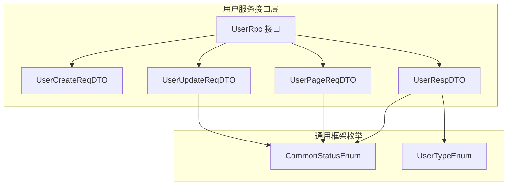
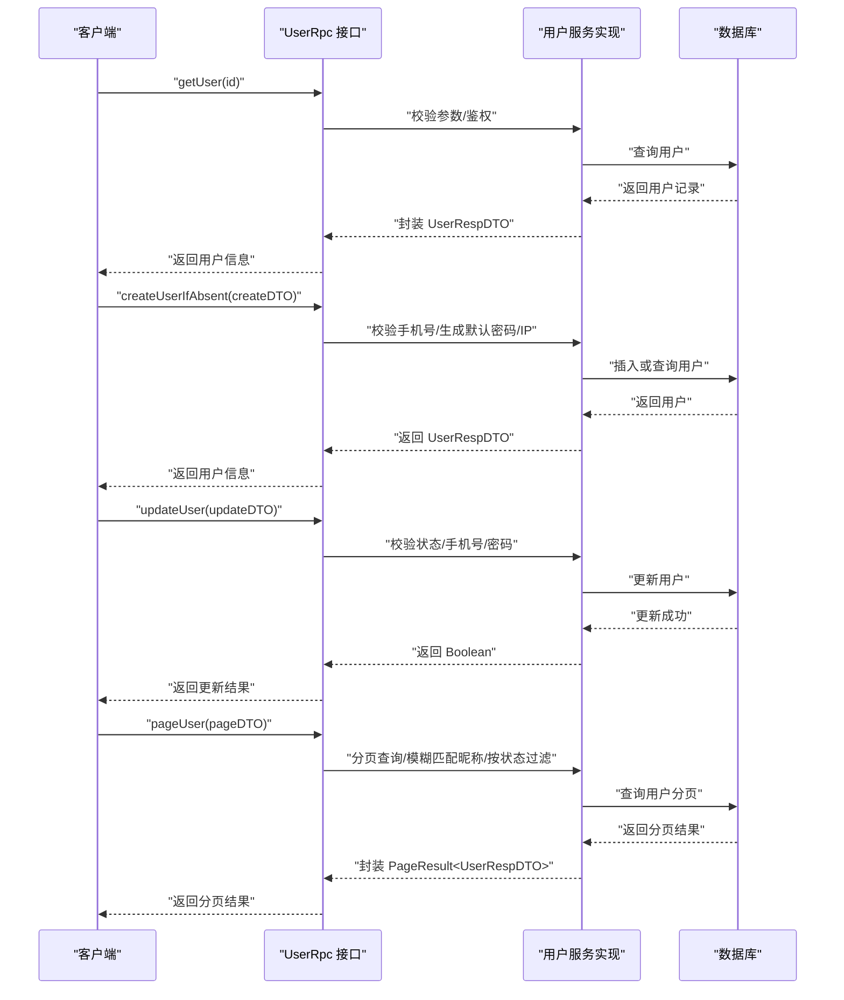
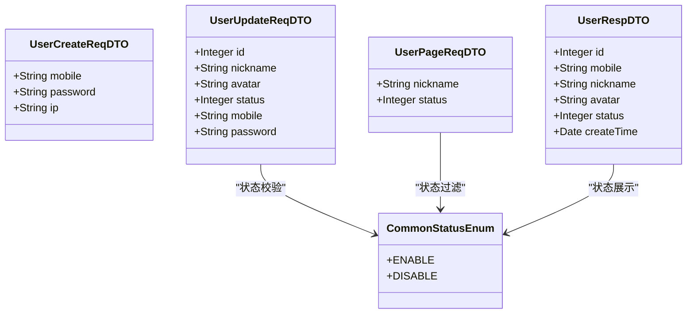
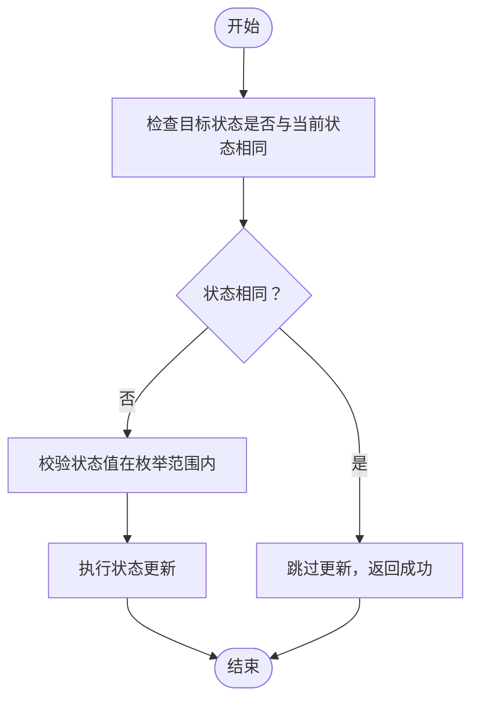
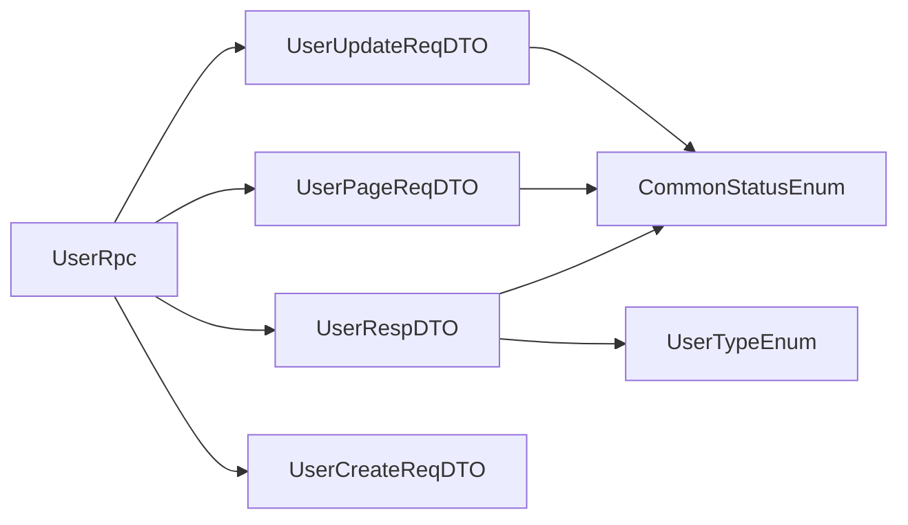

# 用户管理

<cite>
**本文引用的文件**
- [UserErrorCodeConstants.java](file://user-service-project/user-service-api/src/main/java/cn/iocoder/mall/userservice/enums/UserErrorCodeConstants.java)
- [UserRpc.java](file://user-service-project/user-service-api/src/main/java/cn/iocoder/mall/userservice/rpc/user/UserRpc.java)
- [UserCreateReqDTO.java](file://user-service-project/user-service-api/src/main/java/cn/iocoder/mall/userservice/rpc/user/dto/UserCreateReqDTO.java)
- [UserUpdateReqDTO.java](file://user-service-project/user-service-api/src/main/java/cn/iocoder/mall/userservice/rpc/user/dto/UserUpdateReqDTO.java)
- [UserPageReqDTO.java](file://user-service-project/user-service-api/src/main/java/cn/iocoder/mall/userservice/rpc/user/dto/UserPageReqDTO.java)
- [UserRespDTO.java](file://user-service-project/user-service-api/src/main/java/cn/iocoder/mall/userservice/rpc/user/dto/UserRespDTO.java)
- [CommonStatusEnum.java](file://common/common-framework/src/main/java/cn/iocoder/common/framework/enums/CommonStatusEnum.java)
- [UserTypeEnum.java](file://common/common-framework/src/main/java/cn/iocoder/common/framework/enums/UserTypeEnum.java)
</cite>

## 目录
1. [简介](#简介)
2. [项目结构](#项目结构)
3. [核心组件](#核心组件)
4. [架构总览](#架构总览)
5. [详细组件分析](#详细组件分析)
6. [依赖分析](#依赖分析)
7. [性能考虑](#性能考虑)
8. [故障排查指南](#故障排查指南)
9. [结论](#结论)
10. [附录](#附录)

## 简介
本文件面向“用户管理”功能，系统化梳理用户信息管理、用户状态控制、用户地址管理、用户行为监控与风险控制等业务流程。基于仓库中的用户服务接口与通用框架枚举，明确数据模型、权限控制机制、API 接口规范与隐私保护要点，并给出最佳实践与安全建议，帮助开发者与产品人员高效落地用户管理能力。

## 项目结构
用户管理相关能力主要由以下两部分构成：
- 用户服务接口层：定义用户增删改查、分页、状态变更等 RPC 接口与请求/响应 DTO。
- 通用框架枚举：提供通用状态枚举与全局用户类型枚举，用于统一状态与角色语义。

图表来源
- [UserRpc.java:12-54](file://user-service-project/user-service-api/src/main/java/cn/iocoder/mall/userservice/rpc/user/UserRpc.java#L12-L54)
- [UserCreateReqDTO.java:15-35](file://user-service-project/user-service-api/src/main/java/cn/iocoder/mall/userservice/rpc/user/dto/UserCreateReqDTO.java#L15-L35)
- [UserUpdateReqDTO.java:17-47](file://user-service-project/user-service-api/src/main/java/cn/iocoder/mall/userservice/rpc/user/dto/UserUpdateReqDTO.java#L17-L47)
- [UserPageReqDTO.java:16-28](file://user-service-project/user-service-api/src/main/java/cn/iocoder/mall/userservice/rpc/user/dto/UserPageReqDTO.java#L16-L28)
- [UserRespDTO.java:15-44](file://user-service-project/user-service-api/src/main/java/cn/iocoder/mall/userservice/rpc/user/dto/UserRespDTO.java#L15-L44)
- [CommonStatusEnum.java:10-44](file://common/common-framework/src/main/java/cn/iocoder/common/framework/enums/CommonStatusEnum.java#L10-L44)
- [UserTypeEnum.java:10-44](file://common/common-framework/src/main/java/cn/iocoder/common/framework/enums/UserTypeEnum.java#L10-L44)

章节来源
- [UserRpc.java:12-54](file://user-service-project/user-service-api/src/main/java/cn/iocoder/mall/userservice/rpc/user/UserRpc.java#L12-L54)
- [CommonStatusEnum.java:10-44](file://common/common-framework/src/main/java/cn/iocoder/common/framework/enums/CommonStatusEnum.java#L10-L44)
- [UserTypeEnum.java:10-44](file://common/common-framework/src/main/java/cn/iocoder/common/framework/enums/UserTypeEnum.java#L10-L44)

## 核心组件
- 用户 RPC 接口：提供获取单个用户、按手机号创建用户（幂等）、批量更新用户、批量查询用户、分页查询用户等能力。
- 用户 DTO：包括创建、更新、分页查询与响应 DTO，覆盖手机号、昵称、头像、状态、密码、注册时间等字段。
- 通用状态枚举：统一“启用/禁用”状态，供用户状态与其它资源状态使用。
- 全局用户类型枚举：统一“用户/管理员”类型，便于权限与角色判定。

章节来源
- [UserRpc.java:12-54](file://user-service-project/user-service-api/src/main/java/cn/iocoder/mall/userservice/rpc/user/UserRpc.java#L12-L54)
- [UserCreateReqDTO.java:15-35](file://user-service-project/user-service-api/src/main/java/cn/iocoder/mall/userservice/rpc/user/dto/UserCreateReqDTO.java#L15-L35)
- [UserUpdateReqDTO.java:17-47](file://user-service-project/user-service-api/src/main/java/cn/iocoder/mall/userservice/rpc/user/dto/UserUpdateReqDTO.java#L17-L47)
- [UserPageReqDTO.java:16-28](file://user-service-project/user-service-api/src/main/java/cn/iocoder/mall/userservice/rpc/user/dto/UserPageReqDTO.java#L16-L28)
- [UserRespDTO.java:15-44](file://user-service-project/user-service-api/src/main/java/cn/iocoder/mall/userservice/rpc/user/dto/UserRespDTO.java#L15-L44)
- [CommonStatusEnum.java:10-44](file://common/common-framework/src/main/java/cn/iocoder/common/framework/enums/CommonStatusEnum.java#L10-L44)
- [UserTypeEnum.java:10-44](file://common/common-framework/src/main/java/cn/iocoder/common/framework/enums/UserTypeEnum.java#L10-L44)

## 架构总览
用户管理采用“接口层 + DTO + 枚举”的清晰分层设计，RPC 接口对外暴露能力，DTO 规范输入输出，枚举统一状态与类型语义。下图展示调用链路与数据流：

图表来源
- [UserRpc.java:12-54](file://user-service-project/user-service-api/src/main/java/cn/iocoder/mall/userservice/rpc/user/UserRpc.java#L12-L54)
- [UserCreateReqDTO.java:15-35](file://user-service-project/user-service-api/src/main/java/cn/iocoder/mall/userservice/rpc/user/dto/UserCreateReqDTO.java#L15-L35)
- [UserUpdateReqDTO.java:17-47](file://user-service-project/user-service-api/src/main/java/cn/iocoder/mall/userservice/rpc/user/dto/UserUpdateReqDTO.java#L17-L47)
- [UserPageReqDTO.java:16-28](file://user-service-project/user-service-api/src/main/java/cn/iocoder/mall/userservice/rpc/user/dto/UserPageReqDTO.java#L16-L28)
- [UserRespDTO.java:15-44](file://user-service-project/user-service-api/src/main/java/cn/iocoder/mall/userservice/rpc/user/dto/UserRespDTO.java#L15-L44)

## 详细组件分析

### 用户 RPC 接口与职责
- 获取用户：根据用户编号返回用户详情。
- 幂等创建用户：基于手机号创建用户，若已存在则返回现有用户。
- 更新用户：支持昵称、头像、状态、手机号、加密后密码等字段更新。
- 批量查询：根据用户编号列表返回用户集合。
- 分页查询：支持按昵称模糊匹配与状态过滤的分页查询。

章节来源
- [UserRpc.java:12-54](file://user-service-project/user-service-api/src/main/java/cn/iocoder/mall/userservice/rpc/user/UserRpc.java#L12-L54)

### 用户 DTO 设计
- 创建请求 DTO：手机号、可空密码（自动生成）、IP。
- 更新请求 DTO：用户编号、昵称、头像、状态（需在通用状态枚举范围内）、手机号、加密后密码。
- 分页请求 DTO：继承分页参数，支持昵称模糊匹配与状态过滤。
- 响应 DTO：用户编号、手机号、昵称、头像、状态、注册时间。

图表来源
- [UserCreateReqDTO.java:15-35](file://user-service-project/user-service-api/src/main/java/cn/iocoder/mall/userservice/rpc/user/dto/UserCreateReqDTO.java#L15-L35)
- [UserUpdateReqDTO.java:17-47](file://user-service-project/user-service-api/src/main/java/cn/iocoder/mall/userservice/rpc/user/dto/UserUpdateReqDTO.java#L17-L47)
- [UserPageReqDTO.java:16-28](file://user-service-project/user-service-api/src/main/java/cn/iocoder/mall/userservice/rpc/user/dto/UserPageReqDTO.java#L16-L28)
- [UserRespDTO.java:15-44](file://user-service-project/user-service-api/src/main/java/cn/iocoder/mall/userservice/rpc/user/dto/UserRespDTO.java#L15-L44)
- [CommonStatusEnum.java:10-44](file://common/common-framework/src/main/java/cn/iocoder/common/framework/enums/CommonStatusEnum.java#L10-L44)

章节来源
- [UserCreateReqDTO.java:15-35](file://user-service-project/user-service-api/src/main/java/cn/iocoder/mall/userservice/rpc/user/dto/UserCreateReqDTO.java#L15-L35)
- [UserUpdateReqDTO.java:17-47](file://user-service-project/user-service-api/src/main/java/cn/iocoder/mall/userservice/rpc/user/dto/UserUpdateReqDTO.java#L17-L47)
- [UserPageReqDTO.java:16-28](file://user-service-project/user-service-api/src/main/java/cn/iocoder/mall/userservice/rpc/user/dto/UserPageReqDTO.java#L16-L28)
- [UserRespDTO.java:15-44](file://user-service-project/user-service-api/src/main/java/cn/iocoder/mall/userservice/rpc/user/dto/UserRespDTO.java#L15-L44)

### 用户状态管理流程
- 状态枚举：启用/禁用。
- 更新策略：通过更新请求 DTO 的状态字段进行切换，服务端校验状态值是否在枚举范围内。
- 状态一致性：响应 DTO 展示当前状态，便于前端与运营侧统一认知。

图表来源
- [UserUpdateReqDTO.java:35-36](file://user-service-project/user-service-api/src/main/java/cn/iocoder/mall/userservice/rpc/user/dto/UserUpdateReqDTO.java#L35-L36)
- [CommonStatusEnum.java:10-44](file://common/common-framework/src/main/java/cn/iocoder/common/framework/enums/CommonStatusEnum.java#L10-L44)

章节来源
- [UserUpdateReqDTO.java:35-36](file://user-service-project/user-service-api/src/main/java/cn/iocoder/mall/userservice/rpc/user/dto/UserUpdateReqDTO.java#L35-L36)
- [CommonStatusEnum.java:10-44](file://common/common-framework/src/main/java/cn/iocoder/common/framework/enums/CommonStatusEnum.java#L10-L44)

### 用户地址管理现状与建议
- 当前仓库中用户服务接口未发现地址管理相关 RPC 接口与 DTO。
- 建议新增地址 RPC 接口与 DTO，遵循与用户 RPC 同样的分层设计，确保地址 CRUD、默认地址设置、批量查询等功能清晰可维护。

章节来源
- [UserRpc.java:12-54](file://user-service-project/user-service-api/src/main/java/cn/iocoder/mall/userservice/rpc/user/UserRpc.java#L12-L54)

### 用户行为监控与风险控制
- 风控维度建议：
  - 登录与注册风控：IP 限制、设备指纹、短信验证码风控（发送频率、失败次数）。
  - 行为审计：登录日志、敏感操作记录、异常状态变更。
  - 异常检测：频繁状态变更、异常手机号注册、异常地区登录。
- 与现有错误码结合：
  - 验证码相关错误码可用于短信风控告警与限流触发。
  - 用户状态重复更新错误码可用于异常状态变更监控。

章节来源
- [UserErrorCodeConstants.java:10-29](file://user-service-project/user-service-api/src/main/java/cn/iocoder/mall/userservice/enums/UserErrorCodeConstants.java#L10-L29)

## 依赖分析
- UserUpdateReqDTO 与 UserPageReqDTO 依赖通用状态枚举，保证状态值合法性与一致性。
- UserRespDTO 依赖通用状态枚举与全局用户类型枚举，用于状态展示与角色区分。
- UserRpc 作为对外接口，向上承接业务层调用，向下对接实现层与数据存储。

图表来源
- [UserUpdateReqDTO.java:35-36](file://user-service-project/user-service-api/src/main/java/cn/iocoder/mall/userservice/rpc/user/dto/UserUpdateReqDTO.java#L35-L36)
- [UserPageReqDTO.java:25-26](file://user-service-project/user-service-api/src/main/java/cn/iocoder/mall/userservice/rpc/user/dto/UserPageReqDTO.java#L25-L26)
- [UserRespDTO.java:36-38](file://user-service-project/user-service-api/src/main/java/cn/iocoder/mall/userservice/rpc/user/dto/UserRespDTO.java#L36-L38)
- [CommonStatusEnum.java:10-44](file://common/common-framework/src/main/java/cn/iocoder/common/framework/enums/CommonStatusEnum.java#L10-L44)
- [UserTypeEnum.java:10-44](file://common/common-framework/src/main/java/cn/iocoder/common/framework/enums/UserTypeEnum.java#L10-L44)
- [UserRpc.java:12-54](file://user-service-project/user-service-api/src/main/java/cn/iocoder/mall/userservice/rpc/user/UserRpc.java#L12-L54)

章节来源
- [UserUpdateReqDTO.java:35-36](file://user-service-project/user-service-api/src/main/java/cn/iocoder/mall/userservice/rpc/user/dto/UserUpdateReqDTO.java#L35-L36)
- [UserPageReqDTO.java:25-26](file://user-service-project/user-service-api/src/main/java/cn/iocoder/mall/userservice/rpc/user/dto/UserPageReqDTO.java#L25-L26)
- [UserRespDTO.java:36-38](file://user-service-project/user-service-api/src/main/java/cn/iocoder/mall/userservice/rpc/user/dto/UserRespDTO.java#L36-L38)
- [CommonStatusEnum.java:10-44](file://common/common-framework/src/main/java/cn/iocoder/common/framework/enums/CommonStatusEnum.java#L10-L44)
- [UserTypeEnum.java:10-44](file://common/common-framework/src/main/java/cn/iocoder/common/framework/enums/UserTypeEnum.java#L10-L44)
- [UserRpc.java:12-54](file://user-service-project/user-service-api/src/main/java/cn/iocoder/mall/userservice/rpc/user/UserRpc.java#L12-L54)

## 性能考虑
- 分页查询：合理设置分页大小与索引，避免全表扫描；对昵称模糊匹配与状态过滤建立复合索引。
- 幂等创建：基于手机号建立唯一索引，减少重复创建带来的写放大。
- 状态更新：批量更新时尽量合并事务，降低锁竞争。
- 缓存策略：对热点用户信息进行缓存，结合失效策略与一致性保障。

## 故障排查指南
- 常见错误码定位：
  - 用户不存在：用于用户查询与更新前置校验。
  - 用户状态相同：避免重复状态更新导致的无效操作。
  - 手机号已存在：用于创建与更新手机号冲突场景。
  - 验证码相关错误码：用于短信风控与异常告警。
- 排查步骤建议：
  - 核对入参：手机号格式、状态值范围、必填字段。
  - 校验业务前置条件：用户是否存在、验证码有效性。
  - 关注日志：接口耗时、异常堆栈、风控事件。

章节来源
- [UserErrorCodeConstants.java:10-29](file://user-service-project/user-service-api/src/main/java/cn/iocoder/mall/userservice/enums/UserErrorCodeConstants.java#L10-L29)

## 结论
用户管理以清晰的 RPC 接口与 DTO 设计为核心，配合通用状态与类型枚举，实现了用户信息管理与状态控制的基础能力。建议后续补充地址管理能力，并完善行为监控与风险控制体系，持续提升系统的安全性与可运维性。

## 附录

### API 接口规范（概要）
- 获取用户
  - 方法：GET/POST
  - 路径：/user/get
  - 请求参数：userId（整数）
  - 返回：用户信息对象
- 幂等创建用户
  - 方法：POST
  - 路径：/user/create-if-absent
  - 请求体：手机号、可空密码、IP
  - 返回：用户信息对象
- 更新用户
  - 方法：POST
  - 路径：/user/update
  - 请求体：用户编号、昵称、头像、状态、手机号、加密后密码
  - 返回：布尔值（是否成功）
- 批量查询用户
  - 方法：POST
  - 路径：/user/list
  - 请求体：用户编号数组
  - 返回：用户信息数组
- 分页查询用户
  - 方法：POST
  - 路径：/user/page
  - 请求体：分页参数、昵称（模糊）、状态
  - 返回：分页结果（用户信息列表）

章节来源
- [UserRpc.java:12-54](file://user-service-project/user-service-api/src/main/java/cn/iocoder/mall/userservice/rpc/user/UserRpc.java#L12-L54)
- [UserCreateReqDTO.java:15-35](file://user-service-project/user-service-api/src/main/java/cn/iocoder/mall/userservice/rpc/user/dto/UserCreateReqDTO.java#L15-L35)
- [UserUpdateReqDTO.java:17-47](file://user-service-project/user-service-api/src/main/java/cn/iocoder/mall/userservice/rpc/user/dto/UserUpdateReqDTO.java#L17-L47)
- [UserPageReqDTO.java:16-28](file://user-service-project/user-service-api/src/main/java/cn/iocoder/mall/userservice/rpc/user/dto/UserPageReqDTO.java#L16-L28)
- [UserRespDTO.java:15-44](file://user-service-project/user-service-api/src/main/java/cn/iocoder/mall/userservice/rpc/user/dto/UserRespDTO.java#L15-L44)

### 权限控制机制
- 角色类型：用户/管理员，用于区分操作权限。
- 状态枚举：统一“启用/禁用”，避免状态歧义。
- 建议：在网关或拦截器层引入基于角色与资源的操作权限校验，结合 RBAC 或 ABAC 实现细粒度授权。

章节来源
- [UserTypeEnum.java:10-44](file://common/common-framework/src/main/java/cn/iocoder/common/framework/enums/UserTypeEnum.java#L10-L44)
- [CommonStatusEnum.java:10-44](file://common/common-framework/src/main/java/cn/iocoder/common/framework/enums/CommonStatusEnum.java#L10-L44)

### 数据模型与隐私保护
- 数据模型：用户主键、手机号、昵称、头像、状态、注册时间。
- 隐私保护：脱敏显示（如手机号中间位隐藏）、最小化采集（仅保留必要字段）、传输加密、存储加密、访问审计。
- 合规建议：遵循个人信息保护法，提供用户查阅、更正、删除权入口。

章节来源
- [UserRespDTO.java:15-44](file://user-service-project/user-service-api/src/main/java/cn/iocoder/mall/userservice/rpc/user/dto/UserRespDTO.java#L15-L44)

### 最佳实践与用户体验优化
- 用户体验：
  - 默认头像与昵称占位，引导完善资料。
  - 状态变更提示与撤销机制。
  - 分页加载与搜索联想，提升查询效率。
- 运维与安全：
  - 接口限流与熔断，防止恶意刷单。
  - 异常与风控事件报警联动。
  - 定期清理无效数据与僵尸账号。