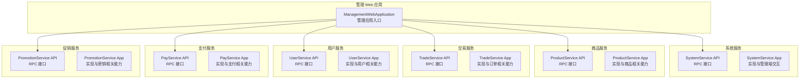
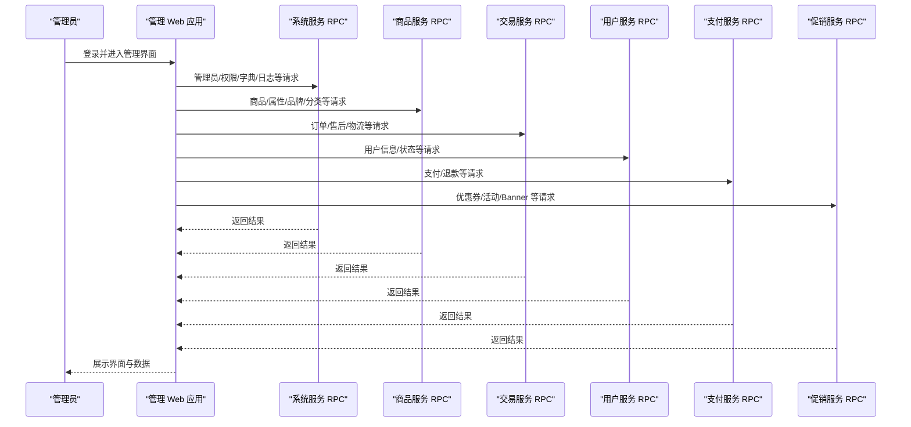
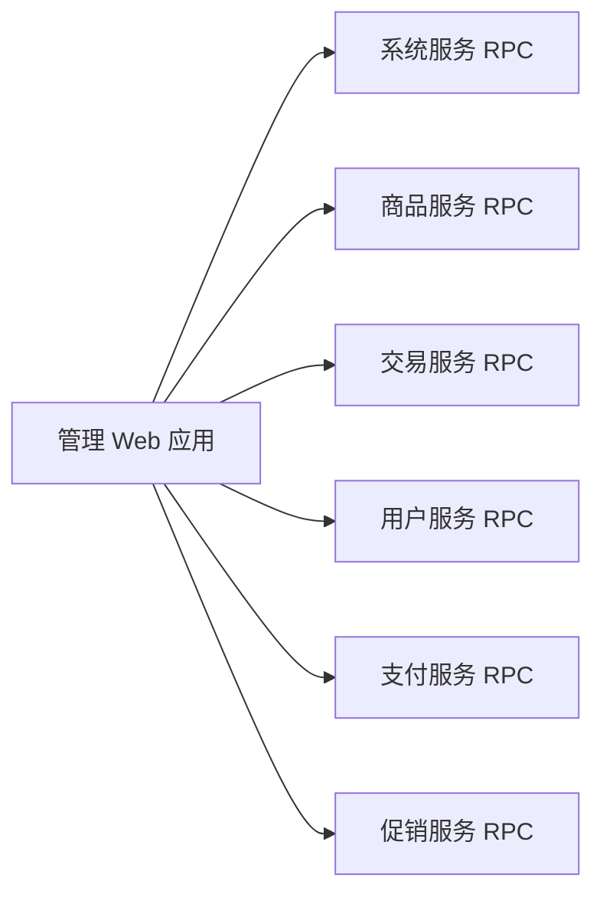

# 管理后台功能

<cite>
**本文引用的文件**
- [ManagementWebApplication.java](file://management-web-app/src/main/java/cn/iocoder/mall/managementweb/ManagementWebApplication.java)
- [功能列表-管理后台.md](file://docs/guides/功能列表/功能列表-管理后台.md)
- [AdminRpc.java](file://system-service-project/system-service-api/src/main/java/cn/iocoder/mall/systemservice/rpc/admin/AdminRpc.java)
- [UserRpc.java](file://user-service-project/user-service-api/src/main/java/cn/iocoder/mall/userservice/rpc/user/UserRpc.java)
</cite>

## 目录
1. [简介](#简介)
2. [项目结构](#项目结构)
3. [核心组件](#核心组件)
4. [架构总览](#架构总览)
5. [详细组件分析](#详细组件分析)
6. [依赖分析](#依赖分析)
7. [性能考虑](#性能考虑)
8. [故障排查指南](#故障排查指南)
9. [结论](#结论)
10. [附录](#附录)

## 简介
本文件面向管理后台平台，系统性梳理并说明各功能模块的管理流程、操作界面、数据展示与业务逻辑，覆盖管理员管理、商品管理（SPU/SKU、属性、品牌、分类）、订单管理（查询、处理、退款）、用户管理（信息查看、状态管理）、营销管理（优惠券、活动、Banner）、数据统计（销售、用户、商品）、系统管理（数据字典、操作日志、权限控制）等。同时提供操作指南与最佳实践建议，帮助非技术读者也能理解后台运作方式。

## 项目结构
管理后台采用多模块微服务架构，管理 Web 应用作为入口，通过 RPC 接口调用各领域服务（系统、商品、交易、用户、支付、促销等），实现前后端分离与职责清晰的分层设计。

图表来源
- [ManagementWebApplication.java:1-14](file://management-web-app/src/main/java/cn/iocoder/mall/managementweb/ManagementWebApplication.java#L1-L14)
- [AdminRpc.java:1-27](file://system-service-project/system-service-api/src/main/java/cn/iocoder/mall/systemservice/rpc/admin/AdminRpc.java#L1-L27)
- [UserRpc.java:1-55](file://user-service-project/user-service-api/src/main/java/cn/iocoder/mall/userservice/rpc/user/UserRpc.java#L1-L55)

章节来源
- [ManagementWebApplication.java:1-14](file://management-web-app/src/main/java/cn/iocoder/mall/managementweb/ManagementWebApplication.java#L1-L14)
- [功能列表-管理后台.md:1-61](file://docs/guides/功能列表/功能列表-管理后台.md#L1-L61)

## 核心组件
- 管理应用入口：管理 Web 应用启动类，负责加载 Spring Boot 容器与自动配置。
- 系统服务 RPC：提供管理员、角色、权限、部门、数据字典、短信、操作日志等系统级能力的接口。
- 商品服务 RPC：提供 SPU/SKU、属性、品牌、分类等商品维度的能力接口。
- 交易服务 RPC：提供订单、售后、物流、支付状态等交易维度的能力接口。
- 用户服务 RPC：提供用户信息、分页查询、状态管理等用户维度的能力接口。
- 支付服务 RPC：提供支付交易、退款等支付维度的能力接口。
- 促销服务 RPC：提供优惠券、活动、Banner 等营销维度的能力接口。

章节来源
- [ManagementWebApplication.java:1-14](file://management-web-app/src/main/java/cn/iocoder/mall/managementweb/ManagementWebApplication.java#L1-L14)
- [AdminRpc.java:1-27](file://system-service-project/system-service-api/src/main/java/cn/iocoder/mall/systemservice/rpc/admin/AdminRpc.java#L1-L27)
- [UserRpc.java:1-55](file://user-service-project/user-service-api/src/main/java/cn/iocoder/mall/userservice/rpc/user/UserRpc.java#L1-L55)

## 架构总览
管理后台以“管理 Web 应用”为中心，通过 RPC 接口聚合各领域服务，形成统一的管理界面与数据流。管理员在后台执行操作后，由 RPC 调用对应服务的实现模块，完成数据持久化与业务处理。

图表来源
- [ManagementWebApplication.java:1-14](file://management-web-app/src/main/java/cn/iocoder/mall/managementweb/ManagementWebApplication.java#L1-L14)
- [AdminRpc.java:1-27](file://system-service-project/system-service-api/src/main/java/cn/iocoder/mall/systemservice/rpc/admin/AdminRpc.java#L1-L27)
- [UserRpc.java:1-55](file://user-service-project/user-service-api/src/main/java/cn/iocoder/mall/userservice/rpc/user/UserRpc.java#L1-L55)

## 详细组件分析

### 管理员管理
- 管理流程
  - 新增管理员：填写基本信息与绑定角色/部门，校验唯一性后创建。
  - 查询与分页：支持按条件筛选、排序与分页展示。
  - 修改管理员：更新基本信息、角色与部门，必要时重置密码。
  - 查看详情：展示管理员基础信息、所属角色与部门、状态等。
  - 密码验证：登录态下进行密码验证，保障敏感操作安全。
- 操作界面
  - 列表页：支持搜索、批量操作、分页导航。
  - 表单页：字段校验、状态切换、角色/部门选择。
  - 详情页：只读信息展示与关联权限列表。
- 数据展示
  - 列表：管理员编号、姓名、手机号、所属部门、角色、状态、创建时间。
  - 表单：必填项校验、唯一性检查、可选角色/部门联动。
- 业务逻辑
  - 权限控制：仅具备相应权限的管理员可执行新增/修改/删除。
  - 状态管理：启用/停用管理员账户，影响登录与操作权限。
  - 密码安全：修改密码需二次验证；默认密码策略与重置机制。
- 最佳实践
  - 严格最小权限原则，避免超级管理员滥用。
  - 定期审计管理员操作日志，追踪变更轨迹。
  - 对高危操作（删除、停用）增加二次确认与审批流程。

章节来源
- [功能列表-管理后台.md:49-58](file://docs/guides/功能列表/功能列表-管理后台.md#L49-L58)
- [AdminRpc.java:1-27](file://system-service-project/system-service-api/src/main/java/cn/iocoder/mall/systemservice/rpc/admin/AdminRpc.java#L1-L27)

### 商品管理（SPU/SKU、属性、品牌、分类）
- 管理流程
  - SPU 维护：创建/编辑商品主信息（标题、卖点、描述、分类、品牌、属性集）。
  - SKU 维护：基于 SPU 的属性组合生成 SKU，设置价格、库存、编码等。
  - 属性管理：维护属性与属性值，支持分组与排序。
  - 品牌管理：维护品牌信息，支持启用/禁用与搜索。
  - 分类管理：维护类目树结构，支持层级展示与排序。
- 操作界面
  - SPU 列表：按名称/分类/状态筛选，批量上下架。
  - SPU 编辑：富文本描述、图片上传、属性选择、SKU 生成器。
  - SKU 列表：按属性组合筛选，批量修改价格/库存。
  - 属性/品牌/分类：树形结构展示，支持拖拽排序与批量导入。
- 数据展示
  - SPU：主图、标题、分类、品牌、状态、销量、上架时间。
  - SKU：属性组合、价格、库存、销售量、状态。
  - 属性/品牌/分类：名称、排序、状态、父节点关系。
- 业务逻辑
  - SKU 与属性组合强关联，属性值变更需同步更新 SKU。
  - 上架/下架影响前端展示与购买资格。
  - 库存扣减与销售统计需与交易服务协同。
- 最佳实践
  - 先完善属性与品牌，再创建 SPU，确保一致性。
  - SKU 价格与库存应定期核对，避免超卖风险。
  - 分类与品牌启用前需审核，防止错放导致搜索混乱。

章节来源
- [功能列表-管理后台.md:17-27](file://docs/guides/功能列表/功能列表-管理后台.md#L17-L27)
- [功能列表-管理后台.md:21-23](file://docs/guides/功能列表/功能列表-管理后台.md#L21-L23)

### 订单管理（查询、处理、退款）
- 管理流程
  - 订单查询：按订单号、用户、时间、状态等条件筛选。
  - 订单处理：确认收货、发货、取消、备注等操作。
  - 售后处理：审核退换货申请、生成退货地址、处理退款。
  - 退款管理：发起退款、记录退款流水、对账与异常处理。
- 操作界面
  - 订单列表：状态筛选、导出、批量处理。
  - 订单详情：订单信息、商品明细、物流信息、售后记录。
  - 退款详情：退款原因、金额、状态、银行流水号。
- 数据展示
  - 订单：订单号、下单用户、商品信息、应付金额、实付金额、状态、下单时间。
  - 物流：快递公司、运单号、发货时间、签收时间。
  - 售后：售后类型、原因、状态、处理意见。
- 业务逻辑
  - 订单状态机：待付款、已付款、待发货、已发货、已完成、已取消、售后中。
  - 退款规则：支持部分/全部退款，退款原路退回或银行转账。
  - 风控与对账：异常订单需人工复核，退款需与支付服务对账。
- 最佳实践
  - 及时发货与更新物流，提升用户体验。
  - 售后处理需留痕，便于审计与纠纷处理。
  - 定期对账，确保资金流与订单状态一致。

章节来源
- [功能列表-管理后台.md:24-27](file://docs/guides/功能列表/功能列表-管理后台.md#L24-L27)

### 用户管理（信息查看、状态管理）
- 管理流程
  - 用户查询：按手机号/昵称/注册时间等条件分页查询。
  - 用户详情：查看基础信息、收货地址、订单与评价历史。
  - 状态管理：启用/停用账户，限制登录与下单能力。
  - 批量操作：批量拉黑、导出用户数据。
- 操作界面
  - 用户列表：搜索、筛选、导出、批量操作。
  - 用户详情：基本信息、地址簿、订单与评价汇总。
- 数据展示
  - 用户：用户编号、昵称、手机号、性别、注册时间、状态、最后登录时间。
  - 地址：默认地址、收件人、电话、完整地址。
- 业务逻辑
  - 用户状态直接影响登录与下单权限。
  - 删除用户需谨慎，建议软删除并保留历史数据。
- 最佳实践
  - 定期清理长期不活跃用户，降低存储成本。
  - 对疑似风险用户及时封禁并上报风控。

章节来源
- [功能列表-管理后台.md:28-33](file://docs/guides/功能列表/功能列表-管理后台.md#L28-L33)
- [UserRpc.java:1-55](file://user-service-project/user-service-api/src/main/java/cn/iocoder/mall/userservice/rpc/user/UserRpc.java#L1-L55)

### 营销管理（优惠券、活动、Banner）
- 管理流程
  - 优惠券：创建/编辑面额、门槛、有效期、适用范围与发放策略。
  - 活动：创建活动类型、规则、商品集合与生效时间。
  - Banner：上传图片、设置跳转链接、排序与投放位置。
- 操作界面
  - 优惠券列表：状态管理、导出、复制规则。
  - 活动列表：活动类型筛选、生效时间预览。
  - Banner 列表：图片预览、链接校验、定时上/下架。
- 数据展示
  - 优惠券：名称、面额、门槛、总量/剩余、状态、生效时间。
  - 活动：活动名、类型、适用商品、开始/结束时间、状态。
  - Banner：标题、图片、链接、位置、排序、状态。
- 业务逻辑
  - 优惠券与活动需与商品服务、交易服务协同生效。
  - Banner 投放需考虑渠道与设备兼容性。
- 最佳实践
  - 优惠券与活动需提前测试，避免规则冲突。
  - Banner 图片尺寸与格式需标准化，保证加载速度。

章节来源
- [功能列表-管理后台.md:34-44](file://docs/guides/功能列表/功能列表-管理后台.md#L34-L44)

### 数据统计（销售统计、用户统计、商品统计）
- 管理流程
  - 销售统计：按日/周/月统计GMV、订单量、客单价、退款率等。
  - 用户统计：新增用户、活跃用户、留存率、付费转化等。
  - 商品统计：热销榜、库存预警、滞销分析、品类占比等。
- 操作界面
  - 统计看板：时间维度切换、图表联动、导出报表。
  - 细分报表：按商品、渠道、地区等维度钻取。
- 数据展示
  - 销售：GMV、订单数、退款金额、退款笔数、支付成功率。
  - 用户：注册数、活跃数、付费用户数、复购率。
  - 商品：销量、销售额、库存周转、缺货率。
- 业务逻辑
  - 统计口径需统一，避免重复计算与口径漂移。
  - 实时与离线统计结合，兼顾时效性与准确性。
- 最佳实践
  - 固定统计周期与口径，定期复盘并优化指标体系。
  - 结合业务目标设定阈值告警，及时发现异常波动。

章节来源
- [功能列表-管理后台.md:7-8](file://docs/guides/功能列表/功能列表-管理后台.md#L7-L8)

### 系统管理（数据字典、操作日志、权限控制）
- 管理流程
  - 数据字典：维护枚举值与描述，支持分类与启用/禁用。
  - 操作日志：记录管理员关键操作，支持检索与导出。
  - 权限控制：基于角色分配菜单与按钮权限，实现细粒度访问控制。
  - 部门管理：维护组织架构，支持树形展示与人员归属。
  - 短信管理：模板维护、发送记录与状态跟踪。
- 操作界面
  - 字典管理：分类筛选、批量启停、搜索。
  - 日志查询：操作人、时间、模块、结果筛选。
  - 权限配置：菜单树勾选、角色授权、权限继承。
  - 部门管理：树形结构、拖拽排序、人员分配。
- 数据展示
  - 字典：键值、名称、分类、状态、排序。
  - 日志：操作人、模块、IP、时间、结果、耗时。
  - 权限：菜单名称、按钮权限、角色映射。
- 业务逻辑
  - 权限与菜单需保持一致，避免越权访问。
  - 日志需保留足够信息用于审计与问题定位。
- 最佳实践
  - 定期清理无效字典项，保持数据整洁。
  - 权限最小化，遵循“按需授权”原则。
  - 日志归档与保留策略明确，满足合规要求。

章节来源
- [功能列表-管理后台.md:49-61](file://docs/guides/功能列表/功能列表-管理后台.md#L49-L61)
- [AdminRpc.java:1-27](file://system-service-project/system-service-api/src/main/java/cn/iocoder/mall/systemservice/rpc/admin/AdminRpc.java#L1-L27)

## 依赖分析
管理后台通过 RPC 接口解耦各服务模块，形成清晰的依赖关系。管理 Web 应用依赖系统、商品、交易、用户、支付、促销服务的 API 接口，实现统一的管理入口与数据聚合。

图表来源
- [ManagementWebApplication.java:1-14](file://management-web-app/src/main/java/cn/iocoder/mall/managementweb/ManagementWebApplication.java#L1-L14)
- [AdminRpc.java:1-27](file://system-service-project/system-service-api/src/main/java/cn/iocoder/mall/systemservice/rpc/admin/AdminRpc.java#L1-L27)
- [UserRpc.java:1-55](file://user-service-project/user-service-api/src/main/java/cn/iocoder/mall/userservice/rpc/user/UserRpc.java#L1-L55)

## 性能考虑
- 接口幂等与限流：对高频接口（如分页查询、批量操作）实施限流与去重，避免抖动。
- 缓存策略：热点数据（字典、品牌、分类）使用缓存，降低数据库压力。
- 分页与索引：列表查询必须带索引与合理分页大小，避免全表扫描。
- 异步任务：退款、报表生成等耗时操作异步化，提升响应速度。
- 监控与告警：埋点关键链路耗时与错误率，建立告警机制。

## 故障排查指南
- 登录失败
  - 检查管理员状态是否启用，确认密码验证接口可用。
  - 核对权限配置，确保角色具备登录权限。
- 商品无法上架
  - 检查 SKU 是否齐全且库存大于零，属性组合是否正确。
  - 确认分类与品牌启用状态正常。
- 订单退款异常
  - 核对支付流水与退款状态，检查支付服务回调是否成功。
  - 如出现重复退款，需人工干预并记录原因。
- 用户状态异常
  - 使用用户 RPC 接口查询用户详情，确认状态与历史操作。
  - 对疑似风险用户立即封禁并上报风控。
- 统计数据不一致
  - 对比不同维度的数据来源，检查统计口径与时间窗口。
  - 核对对账流水，定位差异环节。

章节来源
- [功能列表-管理后台.md:49-61](file://docs/guides/功能列表/功能列表-管理后台.md#L49-L61)
- [AdminRpc.java:1-27](file://system-service-project/system-service-api/src/main/java/cn/iocoder/mall/systemservice/rpc/admin/AdminRpc.java#L1-L27)
- [UserRpc.java:1-55](file://user-service-project/user-service-api/src/main/java/cn/iocoder/mall/userservice/rpc/user/UserRpc.java#L1-L55)

## 结论
管理后台通过清晰的模块划分与 RPC 接口，实现了管理员管理、商品管理、订单管理、用户管理、营销管理、数据统计与系统管理的统一治理。建议在后续迭代中持续完善前端页面细节、增强自动化与可视化能力，并加强安全与合规建设，以支撑业务稳定增长。

## 附录
- 快速开始与环境准备：参考项目根目录下的快速启动文档与 SQL 初始化脚本。
- 常用术语
  - SPU：标准商品单元，SKU：库存量单位。
  - GMV：成交总额，UV：独立访客，转化率：下单用户/访客。
  - 对账：支付流水与订单状态的核对过程。