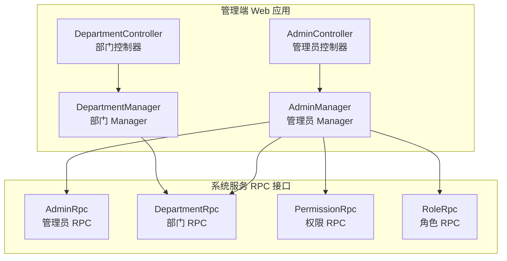
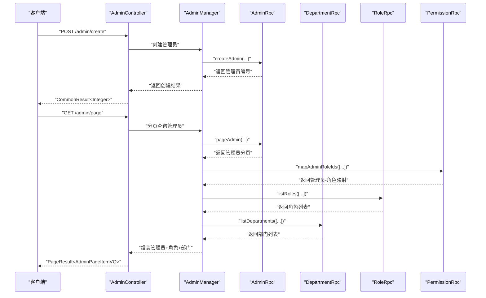
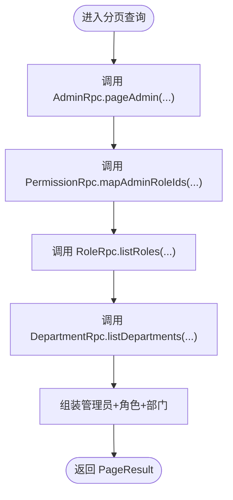
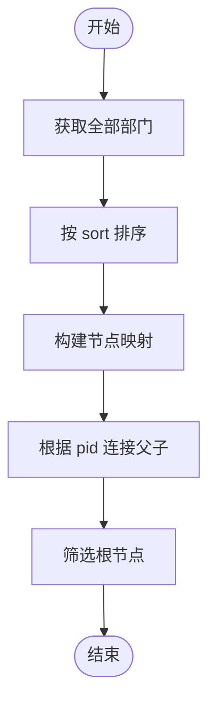
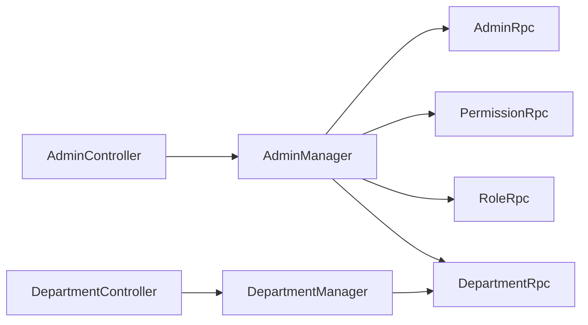

# 管理员管理

<cite>
**本文引用的文件**
- [AdminController.java](file://management-web-app/src/main/java/cn/iocoder/mall/managementweb/controller/admin/AdminController.java)
- [DepartmentController.java](file://management-web-app/src/main/java/cn/iocoder/mall/managementweb/controller/admin/DepartmentController.java)
- [AdminManager.java](file://management-web-app/src/main/java/cn/iocoder/mall/managementweb/manager/admin/AdminManager.java)
- [DepartmentManager.java](file://management-web-app/src/main/java/cn/iocoder/mall/managementweb/manager/admin/DepartmentManager.java)
- [AdminRpc.java](file://system-service-project/system-service-api/src/main/java/cn/iocoder/mall/systemservice/rpc/admin/AdminRpc.java)
- [DepartmentRpc.java](file://system-service-project/system-service-api/src/main/java/cn/iocoder/mall/systemservice/rpc/admin/DepartmentRpc.java)
- [PermissionRpc.java](file://system-service-project/system-service-api/src/main/java/cn/iocoder/mall/systemservice/rpc/permission/PermissionRpc.java)
- [RoleRpc.java](file://system-service-project/system-service-api/src/main/java/cn/iocoder/mall/systemservice/rpc/permission/RoleRpc.java)
</cite>

## 目录
1. [简介](#简介)
2. [项目结构](#项目结构)
3. [核心组件](#核心组件)
4. [架构总览](#架构总览)
5. [详细组件分析](#详细组件分析)
6. [依赖分析](#依赖分析)
7. [性能考虑](#性能考虑)
8. [故障排查指南](#故障排查指南)
9. [结论](#结论)
10. [附录](#附录)

## 简介
本文件面向管理员管理系统，系统性梳理“管理员账号管理、角色权限管理、部门组织管理”的完整流程与实现要点。内容覆盖：
- 管理员：增删改查、状态变更、密码校验（通过权限校验接口间接支持）
- 角色：创建、更新、删除、分页、查询、管理员角色分配
- 部门：层级树构建、人员归属、树形展示
- 权限：资源授权、角色授权、权限校验
- API：接口定义、参数说明、返回值格式、权限注解
- 安全与最佳实践：权限验证机制、错误处理策略、安全建议

## 项目结构
管理端 Web 应用通过控制器暴露 REST API，调用系统服务侧的 RPC 接口完成业务逻辑。权限与角色由系统服务侧统一管理，前端通过权限注解进行访问控制。

图表来源
- [AdminController.java:32-67](file://management-web-app/src/main/java/cn/iocoder/mall/managementweb/controller/admin/AdminController.java#L32-L67)
- [DepartmentController.java:29-81](file://management-web-app/src/main/java/cn/iocoder/mall/managementweb/controller/admin/DepartmentController.java#L29-L81)
- [AdminManager.java:28-121](file://management-web-app/src/main/java/cn/iocoder/mall/managementweb/manager/admin/AdminManager.java#L28-L121)
- [DepartmentManager.java:23-128](file://management-web-app/src/main/java/cn/iocoder/mall/managementweb/manager/admin/DepartmentManager.java#L23-L128)
- [AdminRpc.java:14-26](file://system-service-project/system-service-api/src/main/java/cn/iocoder/mall/systemservice/rpc/admin/AdminRpc.java#L14-L26)
- [DepartmentRpc.java:14-61](file://system-service-project/system-service-api/src/main/java/cn/iocoder/mall/systemservice/rpc/admin/DepartmentRpc.java#L14-L61)
- [PermissionRpc.java:15-68](file://system-service-project/system-service-api/src/main/java/cn/iocoder/mall/systemservice/rpc/permission/PermissionRpc.java#L15-L68)
- [RoleRpc.java:17-80](file://system-service-project/system-service-api/src/main/java/cn/iocoder/mall/systemservice/rpc/permission/RoleRpc.java#L17-L80)

章节来源
- [AdminController.java:32-67](file://management-web-app/src/main/java/cn/iocoder/mall/managementweb/controller/admin/AdminController.java#L32-L67)
- [DepartmentController.java:29-81](file://management-web-app/src/main/java/cn/iocoder/mall/managementweb/controller/admin/DepartmentController.java#L29-L81)
- [AdminManager.java:28-121](file://management-web-app/src/main/java/cn/iocoder/mall/managementweb/manager/admin/AdminManager.java#L28-L121)
- [DepartmentManager.java:23-128](file://management-web-app/src/main/java/cn/iocoder/mall/managementweb/manager/admin/DepartmentManager.java#L23-L128)

## 核心组件
- 控制器层：对外暴露 REST API，标注权限注解，负责请求参数接收与响应封装。
- 管理器层：编排 RPC 调用，聚合多模块数据（管理员、角色、部门），并进行结果转换。
- RPC 层：系统服务侧定义的领域接口，包括管理员、部门、角色、权限等能力。

关键职责与交互
- 管理员控制器：分页查询、创建、更新、状态更新。
- 部门控制器：创建、更新、删除、单个/批量查询、树形查询。
- 管理器：在管理员分页时，额外拉取角色与部门信息，并拼装返回。
- 权限与角色：通过 PermissionRpc 与 RoleRpc 提供角色授权、权限校验等能力。

章节来源
- [AdminController.java:37-65](file://management-web-app/src/main/java/cn/iocoder/mall/managementweb/controller/admin/AdminController.java#L37-L65)
- [DepartmentController.java:34-79](file://management-web-app/src/main/java/cn/iocoder/mall/managementweb/controller/admin/DepartmentController.java#L34-L79)
- [AdminManager.java:39-113](file://management-web-app/src/main/java/cn/iocoder/mall/managementweb/manager/admin/AdminManager.java#L39-L113)
- [PermissionRpc.java:15-68](file://system-service-project/system-service-api/src/main/java/cn/iocoder/mall/systemservice/rpc/permission/PermissionRpc.java#L15-L68)
- [RoleRpc.java:17-80](file://system-service-project/system-service-api/src/main/java/cn/iocoder/mall/systemservice/rpc/permission/RoleRpc.java#L17-L80)

## 架构总览
下图展示从管理端控制器到系统服务 RPC 的调用链路，以及权限与角色在其中的作用。

图表来源
- [AdminController.java:44-49](file://management-web-app/src/main/java/cn/iocoder/mall/managementweb/controller/admin/AdminController.java#L44-L49)
- [AdminManager.java:39-71](file://management-web-app/src/main/java/cn/iocoder/mall/managementweb/manager/admin/AdminManager.java#L39-L71)
- [AdminRpc.java:18-22](file://system-service-project/system-service-api/src/main/java/cn/iocoder/mall/systemservice/rpc/admin/AdminRpc.java#L18-L22)
- [PermissionRpc.java:48-48](file://system-service-project/system-service-api/src/main/java/cn/iocoder/mall/systemservice/rpc/permission/PermissionRpc.java#L48-L48)
- [RoleRpc.java:62-62](file://system-service-project/system-service-api/src/main/java/cn/iocoder/mall/systemservice/rpc/permission/RoleRpc.java#L62-L62)
- [DepartmentRpc.java:52-52](file://system-service-project/system-service-api/src/main/java/cn/iocoder/mall/systemservice/rpc/admin/DepartmentRpc.java#L52-L52)

## 详细组件分析

### 管理员管理

#### API 列表
- 分页查询管理员
  - 方法：GET
  - 路径：/admin/page
  - 权限：system:admin:page
  - 请求参数：见分页 DTO（由管理器转换后传入 RPC）
  - 响应：分页结果，包含管理员、角色、部门信息
- 创建管理员
  - 方法：POST
  - 路径：/admin/create
  - 权限：system:admin:create
  - 请求体：管理员创建 DTO（含创建人与 IP）
  - 响应：管理员编号
- 更新管理员信息
  - 方法：POST
  - 路径：/admin/update
  - 权限：system:admin:update
  - 请求体：管理员信息更新 DTO
  - 响应：布尔成功
- 更新管理员状态
  - 方法：POST
  - 路径：/admin/update-status
  - 权限：system:admin:update-status
  - 请求体：管理员状态更新 DTO
  - 响应：布尔成功

章节来源
- [AdminController.java:37-65](file://management-web-app/src/main/java/cn/iocoder/mall/managementweb/controller/admin/AdminController.java#L37-L65)
- [AdminManager.java:39-113](file://management-web-app/src/main/java/cn/iocoder/mall/managementweb/manager/admin/AdminManager.java#L39-L113)
- [AdminRpc.java:18-22](file://system-service-project/system-service-api/src/main/java/cn/iocoder/mall/systemservice/rpc/admin/AdminRpc.java#L18-L22)

#### 数据流与处理逻辑
- 分页查询时，管理器会：
  - 调用管理员 RPC 获取分页数据
  - 通过权限 RPC 获取管理员-角色映射
  - 通过角色 RPC 获取角色详情
  - 通过部门 RPC 获取部门详情
  - 组装返回对象（管理员 + 角色 + 部门）

图表来源
- [AdminManager.java:39-71](file://management-web-app/src/main/java/cn/iocoder/mall/managementweb/manager/admin/AdminManager.java#L39-L71)
- [PermissionRpc.java:48-48](file://system-service-project/system-service-api/src/main/java/cn/iocoder/mall/systemservice/rpc/permission/PermissionRpc.java#L48-L48)
- [RoleRpc.java:62-62](file://system-service-project/system-service-api/src/main/java/cn/iocoder/mall/systemservice/rpc/permission/RoleRpc.java#L62-L62)
- [DepartmentRpc.java:52-52](file://system-service-project/system-service-api/src/main/java/cn/iocoder/mall/systemservice/rpc/admin/DepartmentRpc.java#L52-L52)

#### 密码重置与状态管理
- 密码重置：当前控制器未直接暴露“重置密码”接口。可通过权限 RPC 的“校验权限”能力进行二次校验或结合业务流程实现。
- 状态管理：提供“更新管理员状态”的接口，用于启用/禁用管理员账户。

章节来源
- [PermissionRpc.java:58-66](file://system-service-project/system-service-api/src/main/java/cn/iocoder/mall/systemservice/rpc/permission/PermissionRpc.java#L58-L66)
- [AdminController.java:59-65](file://management-web-app/src/main/java/cn/iocoder/mall/managementweb/controller/admin/AdminController.java#L59-L65)

### 部门管理

#### API 列表
- 创建部门
  - 方法：POST
  - 路径：/department/create
  - 权限：system:department:create
  - 请求体：部门创建 DTO
  - 响应：部门编号
- 更新部门
  - 方法：POST
  - 路径：/department/update
  - 权限：system:department:update
  - 请求体：部门更新 DTO
  - 响应：布尔成功
- 删除部门
  - 方法：POST
  - 路径：/department/delete
  - 权限：system:department:delete
  - 参数：departmentId
  - 响应：布尔成功
- 获取部门
  - 方法：GET
  - 路径：/department/get
  - 权限：system:department:tree
  - 参数：departmentId
  - 响应：部门详情
- 批量获取部门
  - 方法：GET
  - 路径：/department/list
  - 权限：system:department:tree
  - 参数：departmentIds（列表）
  - 响应：部门详情列表
- 获取部门树
  - 方法：GET
  - 路径：/department/tree
  - 权限：system:department:tree
  - 响应：部门树节点列表

章节来源
- [DepartmentController.java:34-79](file://management-web-app/src/main/java/cn/iocoder/mall/managementweb/controller/admin/DepartmentController.java#L34-L79)
- [DepartmentManager.java:28-95](file://management-web-app/src/main/java/cn/iocoder/mall/managementweb/manager/admin/DepartmentManager.java#L28-L95)
- [DepartmentRpc.java:22-61](file://system-service-project/system-service-api/src/main/java/cn/iocoder/mall/systemservice/rpc/admin/DepartmentRpc.java#L22-L61)

#### 树形结构构建
- 先获取全部部门，按 sort 排序
- 构建父子关系：以 pid=根节点标识的节点作为根
- 返回根节点集合

图表来源
- [DepartmentManager.java:89-126](file://management-web-app/src/main/java/cn/iocoder/mall/managementweb/manager/admin/DepartmentManager.java#L89-L126)

### 角色权限管理

#### 角色管理
- 创建角色：返回角色编号
- 更新角色：布尔成功
- 删除角色：布尔成功
- 获取角色：返回角色详情
- 获取所有角色：返回角色列表
- 获取角色分页：返回分页结果
- 获取管理员拥有的角色编号：返回集合

章节来源
- [RoleRpc.java:25-80](file://system-service-project/system-service-api/src/main/java/cn/iocoder/mall/systemservice/rpc/permission/RoleRpc.java#L25-L80)

#### 权限管理
- 资源授权：赋予角色资源（返回布尔成功）
- 权限校验：校验管理员是否拥有指定权限（无权限抛出异常）
- 管理员角色分配：赋予管理员角色（返回布尔成功）

章节来源
- [PermissionRpc.java:23-66](file://system-service-project/system-service-api/src/main/java/cn/iocoder/mall/systemservice/rpc/permission/PermissionRpc.java#L23-L66)

#### 角色与资源的菜单配置、按钮权限控制
- 菜单配置：通过“资源授权”接口将资源编号授予角色，从而实现菜单可见性与可访问性
- 按钮权限控制：通过“权限校验”接口对具体操作进行细粒度控制

章节来源
- [PermissionRpc.java:17-66](file://system-service-project/system-service-api/src/main/java/cn/iocoder/mall/systemservice/rpc/permission/PermissionRpc.java#L17-L66)

## 依赖分析
- 控制器依赖管理器；管理器通过 Dubbo 引用系统服务 RPC 接口
- 管理员分页查询依赖：管理员 RPC、权限 RPC、角色 RPC、部门 RPC
- 部门树构建依赖：部门 RPC 的全量列表

图表来源
- [AdminController.java:34-35](file://management-web-app/src/main/java/cn/iocoder/mall/managementweb/controller/admin/AdminController.java#L34-L35)
- [DepartmentController.java:32-32](file://management-web-app/src/main/java/cn/iocoder/mall/managementweb/controller/admin/DepartmentController.java#L32-L32)
- [AdminManager.java:30-37](file://management-web-app/src/main/java/cn/iocoder/mall/managementweb/manager/admin/AdminManager.java#L30-L37)
- [DepartmentManager.java:25-26](file://management-web-app/src/main/java/cn/iocoder/mall/managementweb/manager/admin/DepartmentManager.java#L25-L26)

章节来源
- [AdminManager.java:28-121](file://management-web-app/src/main/java/cn/iocoder/mall/managementweb/manager/admin/AdminManager.java#L28-L121)
- [DepartmentManager.java:23-128](file://management-web-app/src/main/java/cn/iocoder/mall/managementweb/manager/admin/DepartmentManager.java#L23-L128)

## 性能考虑
- 分页查询时，管理员分页会触发多次 RPC 调用（管理员、角色、部门），建议：
  - 合理设置分页大小，避免一次性拉取过多数据
  - 对角色与部门 ID 去重后再批量查询，减少重复 RPC
  - 在权限 RPC 的“管理员-角色映射”接口上，尽量使用批量查询以降低网络往返
- 部门树构建为 O(n) 遍历与一次排序，复杂度可控；注意避免重复构建，可在缓存层复用结果

## 故障排查指南
- 常见错误类型
  - 参数校验失败：检查 DTO 字段与必填项
  - 权限不足：确认已授予对应权限（如 system:admin:*、system:department:*）
  - RPC 调用失败：检查系统服务是否启动、网络连通性、版本号配置
- 排查步骤
  - 确认控制器权限注解与前端路由一致
  - 查看管理器对 RPC 结果的 checkError() 是否抛错
  - 关注日志输出，定位具体失败环节（角色/部门/权限 RPC）

章节来源
- [AdminManager.java:42-42](file://management-web-app/src/main/java/cn/iocoder/mall/managementweb/manager/admin/AdminManager.java#L42-L42)
- [DepartmentManager.java:36-36](file://management-web-app/src/main/java/cn/iocoder/mall/managementweb/manager/admin/DepartmentManager.java#L36-L36)

## 结论
本系统通过清晰的控制器-管理器-RPC 分层，实现了管理员、角色、部门与权限的完整闭环。管理员分页查询在返回管理员基本信息的同时，聚合角色与部门信息，满足管理后台的展示需求；部门树构建支持层级化组织管理；权限 RPC 提供资源授权与权限校验能力，支撑菜单与按钮级细粒度控制。建议在生产环境中配合缓存与限流策略，确保高并发下的稳定性与安全性。

## 附录

### API 接口汇总（管理员）
- GET /admin/page
  - 权限：system:admin:page
  - 返回：分页结果（管理员 + 角色 + 部门）
- POST /admin/create
  - 权限：system:admin:create
  - 返回：管理员编号
- POST /admin/update
  - 权限：system:admin:update
  - 返回：布尔成功
- POST /admin/update-status
  - 权限：system:admin:update-status
  - 返回：布尔成功

章节来源
- [AdminController.java:37-65](file://management-web-app/src/main/java/cn/iocoder/mall/managementweb/controller/admin/AdminController.java#L37-L65)

### API 接口汇总（部门）
- POST /department/create
  - 权限：system:department:create
  - 返回：部门编号
- POST /department/update
  - 权限：system:department:update
  - 返回：布尔成功
- POST /department/delete
  - 权限：system:department:delete
  - 参数：departmentId
  - 返回：布尔成功
- GET /department/get
  - 权限：system:department:tree
  - 参数：departmentId
  - 返回：部门详情
- GET /department/list
  - 权限：system:department:tree
  - 参数：departmentIds（列表）
  - 返回：部门详情列表
- GET /department/tree
  - 权限：system:department:tree
  - 返回：部门树节点列表

章节来源
- [DepartmentController.java:34-79](file://management-web-app/src/main/java/cn/iocoder/mall/managementweb/controller/admin/DepartmentController.java#L34-L79)

### 权限与角色 RPC 接口要点
- 角色
  - 创建/更新/删除/获取/分页/列出所有
  - 获取管理员拥有的角色编号
- 权限
  - 角色资源授权
  - 管理员角色分配
  - 权限校验（无权限抛异常）

章节来源
- [RoleRpc.java:17-80](file://system-service-project/system-service-api/src/main/java/cn/iocoder/mall/systemservice/rpc/permission/RoleRpc.java#L17-L80)
- [PermissionRpc.java:15-68](file://system-service-project/system-service-api/src/main/java/cn/iocoder/mall/systemservice/rpc/permission/PermissionRpc.java#L15-L68)