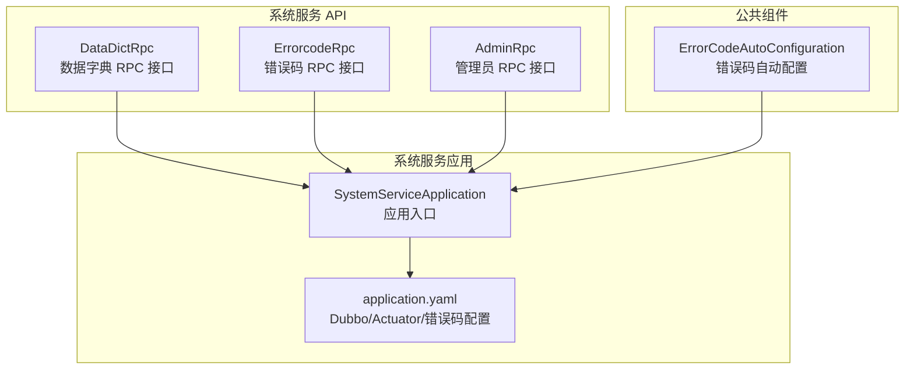
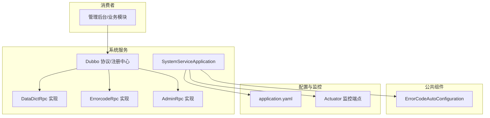
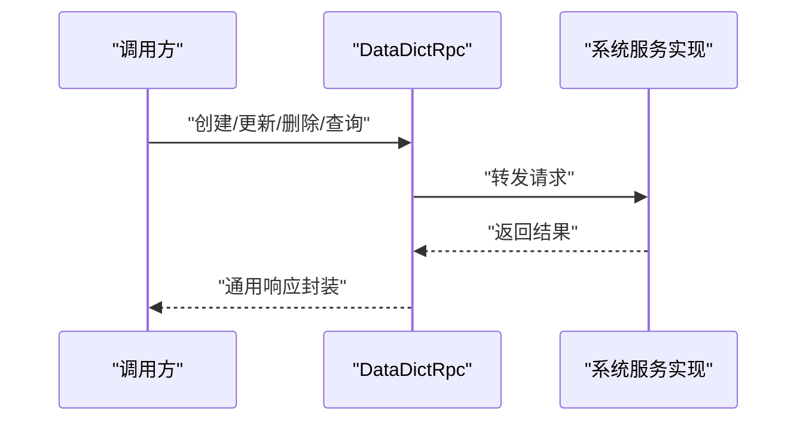
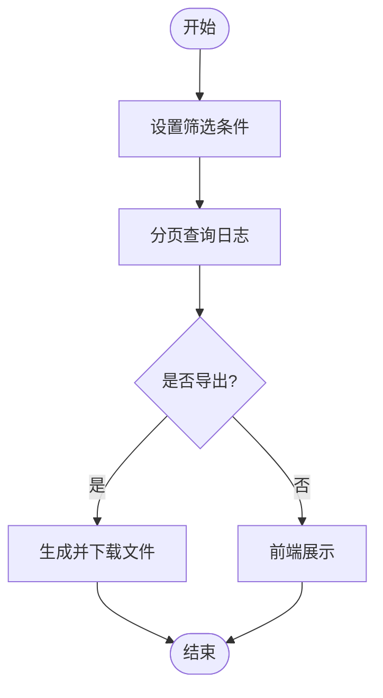
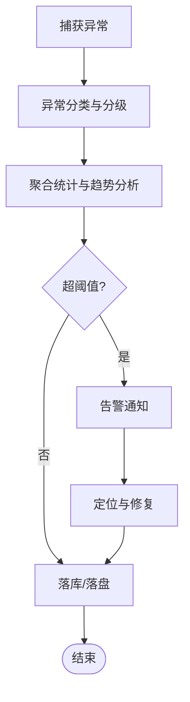
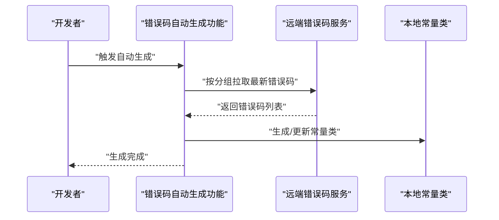
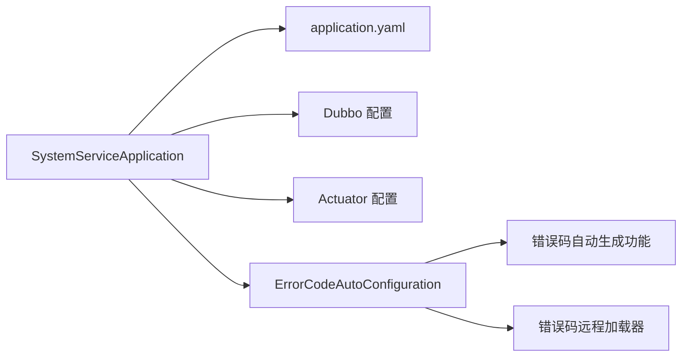

# 系统管理

<cite>
**本文引用的文件**
- [system-service-api/src/main/java/cn/iocoder/mall/systemservice/rpc/errorcode/ErrorcodeRpc.java](file://system-service-project/system-service-api/src/main/java/cn/iocoder/mall/systemservice/rpc/errorcode/ErrorcodeRpc.java)
- [system-service-api/src/main/java/cn/iocoder/mall/systemservice/rpc/datadict/DataDictRpc.java](file://system-service-project/system-service-api/src/main/java/cn/iocoder/mall/systemservice/rpc/datadict/DataDictRpc.java)
- [system-service-api/src/main/java/cn/iocoder/mall/systemservice/rpc/admin/AdminRpc.java](file://system-service-project/system-service-api/src/main/java/cn/iocoder/mall/systemservice/rpc/admin/AdminRpc.java)
- [system-service-app/src/main/resources/application.yaml](file://system-service-project/system-service-app/src/main/resources/application.yaml)
- [common/mall-spring-boot-starter-system-error-code/src/main/java/cn/iocoder/mall/system/errorcode/config/ErrorCodeAutoConfiguration.java](file://common/mall-spring-boot-starter-system-error-code/src/main/java/cn/iocoder/mall/system/errorcode/config/ErrorCodeAutoConfiguration.java)
- [system-service-app/src/main/java/cn/iocoder/mall/systemservice/SystemServiceApplication.java](file://system-service-project/system-service-app/src/main/java/cn/iocoder/mall/systemservice/SystemServiceApplication.java)
</cite>

## 目录
1. [简介](#简介)
2. [项目结构](#项目结构)
3. [核心组件](#核心组件)
4. [架构总览](#架构总览)
5. [详细组件分析](#详细组件分析)
6. [依赖分析](#依赖分析)
7. [性能考虑](#性能考虑)
8. [故障排查指南](#故障排查指南)
9. [结论](#结论)
10. [附录](#附录)

## 简介
本文件面向系统管理与运维场景，围绕系统配置与运维管理能力，系统性梳理数据字典管理、操作日志管理、异常日志管理、错误码管理的完整运维流程。内容涵盖：
- 数据字典：增删改查、分类管理
- 操作日志：查询、筛选、导出
- 异常日志：监控、分析、处理
- 错误码：自动生成、版本管理、远程加载与本地常量同步
并配套系统配置项、日志数据模型、监控指标、API 接口规范、最佳实践、故障排查与性能优化建议。

## 项目结构
系统服务采用多模块分层设计，系统管理相关能力主要由 system-service-api 定义 RPC 接口，system-service-app 提供服务实现与配置，公共组件 common 中的 mall-spring-boot-starter-system-error-code 提供错误码自动生成功能与远程加载机制。

**图表来源**
- [system-service-api/src/main/java/cn/iocoder/mall/systemservice/rpc/datadict/DataDictRpc.java:1-61](file://system-service-project/system-service-api/src/main/java/cn/iocoder/mall/systemservice/rpc/datadict/DataDictRpc.java#L1-L61)
- [system-service-api/src/main/java/cn/iocoder/mall/systemservice/rpc/errorcode/ErrorcodeRpc.java:1-81](file://system-service-project/system-service-api/src/main/java/cn/iocoder/mall/systemservice/rpc/errorcode/ErrorcodeRpc.java#L1-L81)
- [system-service-api/src/main/java/cn/iocoder/mall/systemservice/rpc/admin/AdminRpc.java:1-27](file://system-service-project/system-service-api/src/main/java/cn/iocoder/mall/systemservice/rpc/admin/AdminRpc.java#L1-L27)
- [system-service-app/src/main/resources/application.yaml:1-79](file://system-service-project/system-service-app/src/main/resources/application.yaml#L1-L79)
- [common/mall-spring-boot-starter-system-error-code/src/main/java/cn/iocoder/mall/system/errorcode/config/ErrorCodeAutoConfiguration.java:1-27](file://common/mall-spring-boot-starter-system-error-code/src/main/java/cn/iocoder/mall/system/errorcode/config/ErrorCodeAutoConfiguration.java#L1-L27)
- [system-service-app/src/main/java/cn/iocoder/mall/systemservice/SystemServiceApplication.java:1-14](file://system-service-project/system-service-app/src/main/java/cn/iocoder/mall/systemservice/SystemServiceApplication.java#L1-L14)

**章节来源**
- [system-service-app/src/main/resources/application.yaml:1-79](file://system-service-project/system-service-app/src/main/resources/application.yaml#L1-L79)
- [system-service-app/src/main/java/cn/iocoder/mall/systemservice/SystemServiceApplication.java:1-14](file://system-service-project/system-service-app/src/main/java/cn/iocoder/mall/systemservice/SystemServiceApplication.java#L1-L14)

## 核心组件
- 数据字典 RPC 接口：提供创建、更新、删除、查询单个/批量/全量等能力，支撑业务字典的集中化管理与分发。
- 错误码 RPC 接口：提供按分组增量拉取、自动生成、创建、更新、删除、分页查询等能力，支持错误码版本化与远程加载。
- 管理员 RPC 接口：提供管理员认证、创建、更新、分页查询、详情查询等能力，支撑后台用户体系。
- 错误码自动配置：在公共组件中启用定时任务，负责错误码自动生成器与远程加载器的装配，确保错误码常量与远端一致。

**章节来源**
- [system-service-api/src/main/java/cn/iocoder/mall/systemservice/rpc/datadict/DataDictRpc.java:1-61](file://system-service-project/system-service-api/src/main/java/cn/iocoder/mall/systemservice/rpc/datadict/DataDictRpc.java#L1-L61)
- [system-service-api/src/main/java/cn/iocoder/mall/systemservice/rpc/errorcode/ErrorcodeRpc.java:1-81](file://system-service-project/system-service-api/src/main/java/cn/iocoder/mall/systemservice/rpc/errorcode/ErrorcodeRpc.java#L1-L81)
- [system-service-api/src/main/java/cn/iocoder/mall/systemservice/rpc/admin/AdminRpc.java:1-27](file://system-service-project/system-service-api/src/main/java/cn/iocoder/mall/systemservice/rpc/admin/AdminRpc.java#L1-L27)
- [common/mall-spring-boot-starter-system-error-code/src/main/java/cn/iocoder/mall/system/errorcode/config/ErrorCodeAutoConfiguration.java:1-27](file://common/mall-spring-boot-starter-system-error-code/src/main/java/cn/iocoder/mall/system/errorcode/config/ErrorCodeAutoConfiguration.java#L1-L27)

## 架构总览
系统服务通过 Dubbo 暴露 RPC 接口，消费者（如管理后台）调用 DataDictRpc、ErrorcodeRpc、AdminRpc 等接口完成系统管理与运维操作。Actuator 暴露监控端点用于健康检查与运行指标采集。错误码模块通过自动配置装配自动生成功能与远程加载器，结合 application.yaml 中的错误码配置，实现错误码的版本化与一致性。

**图表来源**
- [system-service-app/src/main/resources/application.yaml:22-66](file://system-service-project/system-service-app/src/main/resources/application.yaml#L22-L66)
- [system-service-app/src/main/java/cn/iocoder/mall/systemservice/SystemServiceApplication.java:1-14](file://system-service-project/system-service-app/src/main/java/cn/iocoder/mall/systemservice/SystemServiceApplication.java#L1-L14)
- [common/mall-spring-boot-starter-system-error-code/src/main/java/cn/iocoder/mall/system/errorcode/config/ErrorCodeAutoConfiguration.java:10-26](file://common/mall-spring-boot-starter-system-error-code/src/main/java/cn/iocoder/mall/system/errorcode/config/ErrorCodeAutoConfiguration.java#L10-L26)

## 详细组件分析

### 数据字典管理
- 功能范围
  - 增删改查：创建、更新、删除、查询单个、批量、全量
  - 分类管理：通过分组维度组织字典项，便于业务域隔离与检索
- 典型流程
  - 新增/修改：提交 DataDictCreateDTO/DataDictUpdateDTO，经服务端校验后持久化
  - 查询：支持按 ID、ID 列表、全量查询，满足不同场景
  - 删除：软删除或硬删除策略需在服务端定义（接口层面支持）
- 运维要点
  - 字典项变更需灰度发布，避免影响线上业务
  - 建议对字典项增加版本字段，支持回滚与审计
  - 导出：可基于分页查询接口进行全量导出

**图表来源**
- [system-service-api/src/main/java/cn/iocoder/mall/systemservice/rpc/datadict/DataDictRpc.java:13-60](file://system-service-project/system-service-api/src/main/java/cn/iocoder/mall/systemservice/rpc/datadict/DataDictRpc.java#L13-L60)

**章节来源**
- [system-service-api/src/main/java/cn/iocoder/mall/systemservice/rpc/datadict/DataDictRpc.java:1-61](file://system-service-project/system-service-api/src/main/java/cn/iocoder/mall/systemservice/rpc/datadict/DataDictRpc.java#L1-L61)

### 操作日志管理
- 功能范围
  - 查询与筛选：按时间、用户、操作类型、资源等条件筛选
  - 导出：支持 CSV/Excel 导出，便于离线分析与审计
- 运维要点
  - 日志保留周期与归档策略
  - 敏感字段脱敏与最小化采集
  - 性能：分页查询、索引优化、异步写入

[本图为概念流程图，不直接映射具体源码文件]

### 异常日志管理
- 功能范围
  - 监控：异常捕获、聚合统计、阈值告警
  - 分析：按异常类型、时间趋势、服务端点分析
  - 处理：定位根因、修复与回滚、沉淀处理方案
- 运维要点
  - 结合 Sentry 或自研链路追踪，统一异常上报
  - 异常分级与优先级划分
  - 与错误码联动，将异常映射到标准错误码

[本图为概念流程图，不直接映射具体源码文件]

### 错误码管理
- 功能范围
  - 自动化：根据规则自动生成错误码常量
  - 版本化：通过分组与版本控制，支持增量拉取与一致性校验
  - 远程加载：从远端服务拉取最新错误码，保持本地常量与远端一致
- 关键接口
  - 按分组增量拉取：支持 minUpdateTime 参数
  - 批量自动生成：接收 DTO 列表，生成常量代码
  - 增删改查与分页：标准 CRUD 与分页查询
- 运维要点
  - 错误码命名规范与分组策略
  - 版本升级时的兼容性与迁移
  - 与业务模块的契约约定与测试

**图表来源**
- [system-service-api/src/main/java/cn/iocoder/mall/systemservice/rpc/errorcode/ErrorcodeRpc.java:15-80](file://system-service-project/system-service-api/src/main/java/cn/iocoder/mall/systemservice/rpc/errorcode/ErrorcodeRpc.java#L15-L80)
- [common/mall-spring-boot-starter-system-error-code/src/main/java/cn/iocoder/mall/system/errorcode/config/ErrorCodeAutoConfiguration.java:10-26](file://common/mall-spring-boot-starter-system-error-code/src/main/java/cn/iocoder/mall/system/errorcode/config/ErrorCodeAutoConfiguration.java#L10-L26)

**章节来源**
- [system-service-api/src/main/java/cn/iocoder/mall/systemservice/rpc/errorcode/ErrorcodeRpc.java:1-81](file://system-service-project/system-service-api/src/main/java/cn/iocoder/mall/systemservice/rpc/errorcode/ErrorcodeRpc.java#L1-L81)
- [common/mall-spring-boot-starter-system-error-code/src/main/java/cn/iocoder/mall/system/errorcode/config/ErrorCodeAutoConfiguration.java:1-27](file://common/mall-spring-boot-starter-system-error-code/src/main/java/cn/iocoder/mall/system/errorcode/config/ErrorCodeAutoConfiguration.java#L1-L27)

## 依赖分析
- 组件耦合
  - 系统服务应用通过 Dubbo 暴露多个 RPC 接口，消费者按需调用
  - 错误码自动配置与系统服务应用强关联，保证错误码常量与远端一致
- 外部依赖
  - Dubbo：服务治理与远程调用
  - Actuator：监控与健康检查
  - MyBatis Plus：数据访问层配置

**图表来源**
- [system-service-app/src/main/resources/application.yaml:22-66](file://system-service-project/system-service-app/src/main/resources/application.yaml#L22-L66)
- [common/mall-spring-boot-starter-system-error-code/src/main/java/cn/iocoder/mall/system/errorcode/config/ErrorCodeAutoConfiguration.java:10-26](file://common/mall-spring-boot-starter-system-error-code/src/main/java/cn/iocoder/mall/system/errorcode/config/ErrorCodeAutoConfiguration.java#L10-L26)

**章节来源**
- [system-service-app/src/main/resources/application.yaml:1-79](file://system-service-project/system-service-app/src/main/resources/application.yaml#L1-L79)

## 性能考虑
- 数据字典
  - 缓存热点字典项，减少数据库压力
  - 分组与标签化，提升查询效率
- 操作日志
  - 写入异步化与批量提交
  - 索引优化与分区策略
- 异常日志
  - 采样与限流，避免雪崩
  - 结构化日志，便于检索与分析
- 错误码
  - 增量拉取与本地缓存，降低远端压力
  - 自动化生成与版本化，减少人工维护成本

[本节为通用性能建议，不直接分析具体文件]

## 故障排查指南
- RPC 调用失败
  - 检查 Dubbo 服务版本与消费者配置是否匹配
  - 查看 Actuator 健康检查与端点状态
- 错误码不一致
  - 核对 application.yaml 中的错误码分组与常量类配置
  - 触发错误码自动生成功能，重新生成本地常量
- 日志缺失或异常
  - 检查日志级别与输出路径
  - 核对异常捕获与上报链路

**章节来源**
- [system-service-app/src/main/resources/application.yaml:22-66](file://system-service-project/system-service-app/src/main/resources/application.yaml#L22-L66)
- [common/mall-spring-boot-starter-system-error-code/src/main/java/cn/iocoder/mall/system/errorcode/config/ErrorCodeAutoConfiguration.java:10-26](file://common/mall-spring-boot-starter-system-error-code/src/main/java/cn/iocoder/mall/system/errorcode/config/ErrorCodeAutoConfiguration.java#L10-L26)

## 结论
系统管理模块以 RPC 接口为核心，结合错误码自动化与远程加载机制，形成完整的系统配置与运维能力闭环。通过标准化的数据字典、完善的日志体系与版本化的错误码管理，能够有效支撑业务的稳定运行与快速迭代。

[本节为总结性内容，不直接分析具体文件]

## 附录

### API 接口规范（示例）
- 数据字典
  - 创建：POST /datadict/create
  - 更新：PUT /datadict/update
  - 删除：DELETE /datadict/{id}
  - 查询：GET /datadict/{id}
  - 列表：GET /datadict/list
  - 批量：GET /datadict/list/batch
- 错误码
  - 按分组增量拉取：GET /errorcode/list?group=xxx&minUpdateTime=...
  - 自动生成：POST /errorcode/auto-generate
  - 创建：POST /errorcode/create
  - 更新：PUT /errorcode/update
  - 删除：DELETE /errorcode/{id}
  - 查询：GET /errorcode/{id}
  - 列表：GET /errorcode/list
  - 分页：GET /errorcode/page
- 管理员
  - 登录校验：POST /admin/verify-password
  - 创建：POST /admin/create
  - 更新：PUT /admin/update
  - 分页：GET /admin/page
  - 查询：GET /admin/{id}

[本节为概念性接口规范，不直接映射具体源码文件]

### 监控指标
- Dubbo 调用量、成功率、延迟、异常数
- Actuator 指标：heap、gc、thread、http、jvm
- 错误码生成耗时与成功率
- 日志写入延迟与丢弃率

[本节为通用监控建议，不直接分析具体文件]

### 最佳实践
- 数据字典
  - 严格命名规范与分组策略
  - 变更走评审与灰度
- 日志
  - 结构化与脱敏
  - 分级存储与归档
- 错误码
  - 版本化与契约管理
  - 自动化生成与一致性校验

[本节为通用最佳实践，不直接分析具体文件]