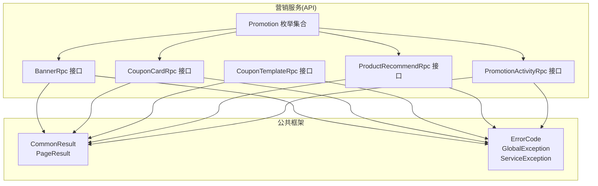
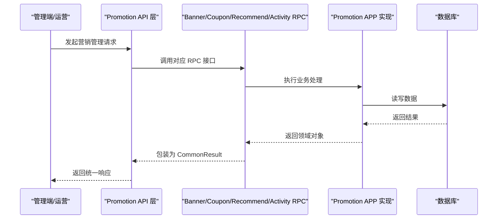
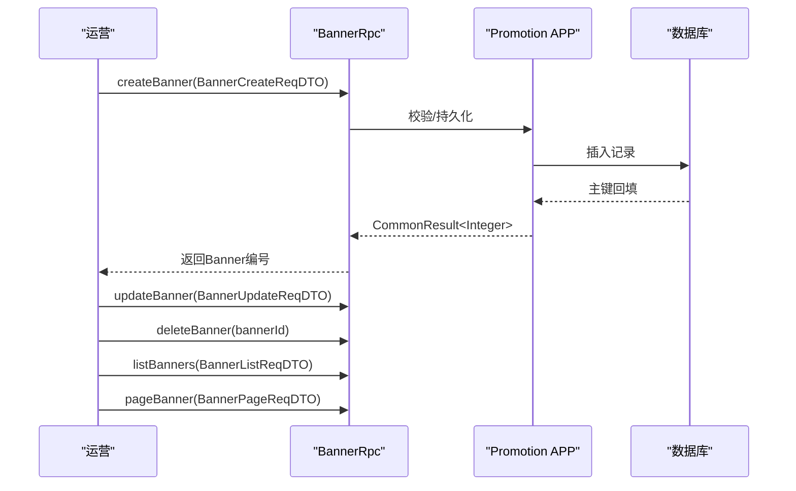
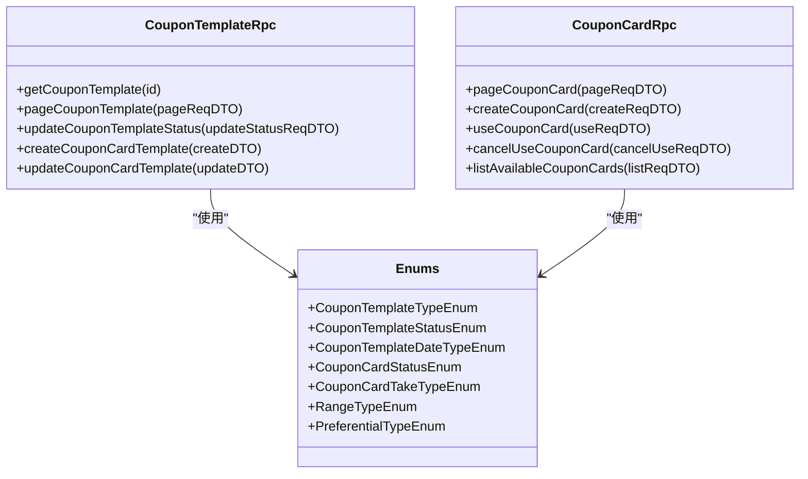
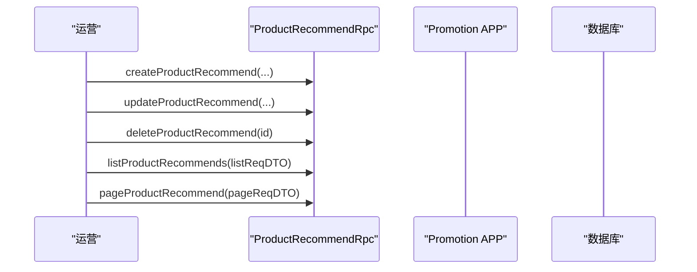
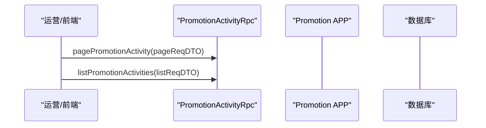
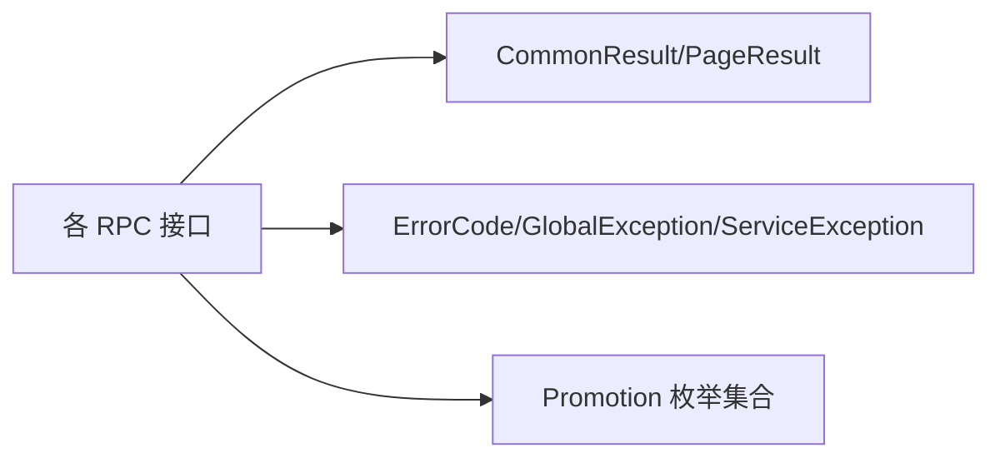

# 营销管理

<cite>
**本文引用的文件**
- [BannerRpc.java](file://promotion-service-project/promotion-service-api/src/main/java/cn/iocoder/mall/promotion/api/rpc/banner/BannerRpc.java)
- [CouponCardRpc.java](file://promotion-service-project/promotion-service-api/src/main/java/cn/iocoder/mall/promotion/api/rpc/coupon/CouponCardRpc.java)
- [CouponTemplateRpc.java](file://promotion-service-project/promotion-service-api/src/main/java/cn/iocoder/mall/promotion/api/rpc/coupon/CouponTemplateRpc.java)
- [ProductRecommendRpc.java](file://promotion-service-project/promotion-service-api/src/main/java/cn/iocoder/mall/promotion/api/rpc/recommend/ProductRecommendRpc.java)
- [PromotionActivityRpc.java](file://promotion-service-project/promotion-service-api/src/main/java/cn/iocoder/mall/promotion/api/rpc/activity/PromotionActivityRpc.java)
- [PromotionActivityStatusEnum.java](file://promotion-service-project/promotion-service-api/src/main/java/cn/iocoder/mall/promotion/api/enums/activity/PromotionActivityStatusEnum.java)
- [PromotionActivityTypeEnum.java](file://promotion-service-project/promotion-service-api/src/main/java/cn/iocoder/mall/promotion/api/enums/activity/PromotionActivityTypeEnum.java)
- [CouponCardStatusEnum.java](file://promotion-service-project/promotion-service-api/src/main/java/cn/iocoder/mall/promotion/api/enums/coupon/card/CouponCardStatusEnum.java)
- [CouponCardTakeTypeEnum.java](file://promotion-service-project/promotion-service-api/src/main/java/cn/iocoder/mall/promotion/api/enums/coupon/card/CouponCardTakeTypeEnum.java)
- [CouponTemplateDateTypeEnum.java](file://promotion-service-project/promotion-service-api/src/main/java/cn/iocoder/mall/promotion/api/enums/coupon/template/CouponTemplateDateTypeEnum.java)
- [CouponTemplateStatusEnum.java](file://promotion-service-project/promotion-service-api/src/main/java/cn/iocoder/mall/promotion/api/enums/coupon/template/CouponTemplateStatusEnum.java)
- [CouponTemplateTypeEnum.java](file://promotion-service-project/promotion-service-api/src/main/java/cn/iocoder/mall/promotion/api/enums/coupon/template/CouponTemplateTypeEnum.java)
- [ProductRecommendTypeEnum.java](file://promotion-service-project/promotion-service-api/src/main/java/cn/iocoder/mall/promotion/api/enums/recommend/ProductRecommendTypeEnum.java)
- [MeetTypeEnum.java](file://promotion-service-project/promotion-service-api/src/main/java/cn/iocoder/mall/promotion/api/enums/MeetTypeEnum.java)
- [PreferentialTypeEnum.java](file://promotion-service-project/promotion-service-api/src/main/java/cn/iocoder/mall/promotion/api/enums/PreferentialTypeEnum.java)
- [RangeTypeEnum.java](file://promotion-service-project/promotion-service-api/src/main/java/cn/iocoder/mall/promotion/api/enums/RangeTypeEnum.java)
- [PromotionErrorCodeConstants.java](file://promotion-service-project/promotion-service-api/src/main/java/cn/iocoder/mall/promotion/api/enums/PromotionErrorCodeConstants.java)
- [CommonResult.java](file://common/common-framework/src/main/java/cn/iocoder/common/framework/vo/CommonResult.java)
- [PageResult.java](file://common/common-framework/src/main/java/cn/iocoder/common/framework/vo/PageResult.java)
- [ErrorCode.java](file://common/common-framework/src/main/java/cn/iocoder/common/framework/exception/ErrorCode.java)
- [GlobalException.java](file://common/common-framework/src/main/java/cn/iocoder/common/framework/exception/GlobalException.java)
- [ServiceException.java](file://common/common-framework/src/main/java/cn/iocoder/common/framework/exception/ServiceException.java)
</cite>

## 目录
1. [简介](#简介)
2. [项目结构](#项目结构)
3. [核心组件](#核心组件)
4. [架构总览](#架构总览)
5. [详细组件分析](#详细组件分析)
6. [依赖分析](#依赖分析)
7. [性能考虑](#性能考虑)
8. [故障排查指南](#故障排查指南)
9. [结论](#结论)
10. [附录](#附录)

## 简介
本文件面向营销管理系统，围绕“首页Banner管理、优惠券管理、商品推荐、促销活动”四大核心能力，系统化梳理其数据模型、规则枚举、RPC接口规范与典型业务流程，并提供可操作的策划、评估与优化建议。文档以promotion-service-project中的API层为依据，结合公共异常与返回体规范，帮助产品、研发与运营人员协同推进营销活动的全生命周期管理。

## 项目结构
营销能力位于promotion-service-project模块中，采用API/APP分层：API层定义RPC接口与枚举常量，APP层实现业务逻辑与数据库交互。公共框架提供统一返回体与异常体系，确保跨模块调用的一致性与可观测性。

图表来源
- [BannerRpc.java:1-53](file://promotion-service-project/promotion-service-api/src/main/java/cn/iocoder/mall/promotion/api/rpc/banner/BannerRpc.java#L1-L53)
- [CouponCardRpc.java:1-55](file://promotion-service-project/promotion-service-api/src/main/java/cn/iocoder/mall/promotion/api/rpc/coupon/CouponCardRpc.java#L1-L55)
- [CouponTemplateRpc.java:1-58](file://promotion-service-project/promotion-service-api/src/main/java/cn/iocoder/mall/promotion/api/rpc/coupon/CouponTemplateRpc.java#L1-L58)
- [ProductRecommendRpc.java:1-53](file://promotion-service-project/promotion-service-api/src/main/java/cn/iocoder/mall/promotion/api/rpc/recommend/ProductRecommendRpc.java#L1-L53)
- [PromotionActivityRpc.java:1-21](file://promotion-service-project/promotion-service-api/src/main/java/cn/iocoder/mall/promotion/api/rpc/activity/PromotionActivityRpc.java#L1-L21)
- [CommonResult.java](file://common/common-framework/src/main/java/cn/iocoder/common/framework/vo/CommonResult.java)
- [PageResult.java](file://common/common-framework/src/main/java/cn/iocoder/common/framework/vo/PageResult.java)
- [ErrorCode.java](file://common/common-framework/src/main/java/cn/iocoder/common/framework/exception/ErrorCode.java)
- [GlobalException.java](file://common/common-framework/src/main/java/cn/iocoder/common/framework/exception/GlobalException.java)
- [ServiceException.java](file://common/common-framework/src/main/java/cn/iocoder/common/framework/exception/ServiceException.java)

章节来源
- [BannerRpc.java:1-53](file://promotion-service-project/promotion-service-api/src/main/java/cn/iocoder/mall/promotion/api/rpc/banner/BannerRpc.java#L1-L53)
- [CouponCardRpc.java:1-55](file://promotion-service-project/promotion-service-api/src/main/java/cn/iocoder/mall/promotion/api/rpc/coupon/CouponCardRpc.java#L1-L55)
- [CouponTemplateRpc.java:1-58](file://promotion-service-project/promotion-service-api/src/main/java/cn/iocoder/mall/promotion/api/rpc/coupon/CouponTemplateRpc.java#L1-L58)
- [ProductRecommendRpc.java:1-53](file://promotion-service-project/promotion-service-api/src/main/java/cn/iocoder/mall/promotion/api/rpc/recommend/ProductRecommendRpc.java#L1-L53)
- [PromotionActivityRpc.java:1-21](file://promotion-service-project/promotion-service-api/src/main/java/cn/iocoder/mall/promotion/api/rpc/activity/PromotionActivityRpc.java#L1-L21)

## 核心组件
- 首页Banner管理：提供创建、更新、删除、列表与分页查询能力，支持按条件筛选与排序。
- 优惠券管理：包含优惠券模板与优惠券卡两大子域，覆盖模板创建/状态变更、卡券发放/使用/取消使用、可用券查询等。
- 商品推荐：提供推荐位的创建、更新、删除、列表与分页查询，支持不同推荐类型配置。
- 促销活动：提供活动分页与列表查询，支撑活动维度的数据看板与运营策略。

章节来源
- [BannerRpc.java:12-52](file://promotion-service-project/promotion-service-api/src/main/java/cn/iocoder/mall/promotion/api/rpc/banner/BannerRpc.java#L12-L52)
- [CouponCardRpc.java:12-54](file://promotion-service-project/promotion-service-api/src/main/java/cn/iocoder/mall/promotion/api/rpc/coupon/CouponCardRpc.java#L12-L54)
- [CouponTemplateRpc.java:10-57](file://promotion-service-project/promotion-service-api/src/main/java/cn/iocoder/mall/promotion/api/rpc/coupon/CouponTemplateRpc.java#L10-L57)
- [ProductRecommendRpc.java:12-52](file://promotion-service-project/promotion-service-api/src/main/java/cn/iocoder/mall/promotion/api/rpc/recommend/ProductRecommendRpc.java#L12-L52)
- [PromotionActivityRpc.java:14-20](file://promotion-service-project/promotion-service-api/src/main/java/cn/iocoder/mall/promotion/api/rpc/activity/PromotionActivityRpc.java#L14-L20)

## 架构总览
营销服务通过RPC接口向业务侧暴露能力，统一返回体与异常体系贯穿始终，便于前端与管理端快速集成与排障。

图表来源
- [BannerRpc.java:12-52](file://promotion-service-project/promotion-service-api/src/main/java/cn/iocoder/mall/promotion/api/rpc/banner/BannerRpc.java#L12-L52)
- [CouponCardRpc.java:12-54](file://promotion-service-project/promotion-service-api/src/main/java/cn/iocoder/mall/promotion/api/rpc/coupon/CouponCardRpc.java#L12-L54)
- [CouponTemplateRpc.java:10-57](file://promotion-service-project/promotion-service-api/src/main/java/cn/iocoder/mall/promotion/api/rpc/coupon/CouponTemplateRpc.java#L10-L57)
- [ProductRecommendRpc.java:12-52](file://promotion-service-project/promotion-service-api/src/main/java/cn/iocoder/mall/promotion/api/rpc/recommend/ProductRecommendRpc.java#L12-L52)
- [PromotionActivityRpc.java:14-20](file://promotion-service-project/promotion-service-api/src/main/java/cn/iocoder/mall/promotion/api/rpc/activity/PromotionActivityRpc.java#L14-L20)
- [CommonResult.java](file://common/common-framework/src/main/java/cn/iocoder/common/framework/vo/CommonResult.java)

## 详细组件分析

### 首页Banner管理
- 能力清单
  - 创建：提交Banner基础信息，返回Banner编号
  - 更新：按ID更新Banner信息
  - 删除：按ID删除Banner
  - 列表：按条件查询Banner列表
  - 分页：按分页参数查询Banner分页结果
- 关键字段与约束
  - 基础属性：标题、图片URL、跳转链接、排序值、状态等
  - 排序：数值越小优先级越高（或相反，具体以实现为准）
  - 状态：启用/停用等
- 典型流程
  - 新建：填写信息 → 上传图片 → 提交创建 → 审核/立即生效 → 上线展示
  - 调整：修改排序/上下线 → 观察曝光与点击变化
  - 下线：删除或停用 → 清理缓存/埋点

图表来源
- [BannerRpc.java:12-52](file://promotion-service-project/promotion-service-api/src/main/java/cn/iocoder/mall/promotion/api/rpc/banner/BannerRpc.java#L12-L52)

章节来源
- [BannerRpc.java:12-52](file://promotion-service-project/promotion-service-api/src/main/java/cn/iocoder/mall/promotion/api/rpc/banner/BannerRpc.java#L12-L52)

### 优惠券管理
- 模板域
  - 获取模板详情与分页
  - 更新模板状态（如启用/停用）
  - 创建/更新优惠券模板
- 卡券域
  - 分页查询卡券
  - 给用户发放卡券
  - 用户使用/取消使用卡券
  - 查询用户可用卡券列表
- 关键枚举与规则
  - 优惠券类型：满减/折扣/免邮等（由偏好类型枚举定义）
  - 使用范围：商品/品类/全场等（由范围类型枚举定义）
  - 有效期：固定日期/领取后N天有效（由日期类型枚举定义）
  - 领取方式：免费领取/定向发放/任务解锁等（由领取类型枚举定义）
  - 状态：未使用/已使用/已过期/已作废等（由卡券状态枚举定义）

图表来源
- [CouponTemplateRpc.java:10-57](file://promotion-service-project/promotion-service-api/src/main/java/cn/iocoder/mall/promotion/api/rpc/coupon/CouponTemplateRpc.java#L10-L57)
- [CouponCardRpc.java:12-54](file://promotion-service-project/promotion-service-api/src/main/java/cn/iocoder/mall/promotion/api/rpc/coupon/CouponCardRpc.java#L12-L54)
- [CouponTemplateTypeEnum.java](file://promotion-service-project/promotion-service-api/src/main/java/cn/iocoder/mall/promotion/api/enums/coupon/template/CouponTemplateTypeEnum.java)
- [CouponTemplateStatusEnum.java](file://promotion-service-project/promotion-service-api/src/main/java/cn/iocoder/mall/promotion/api/enums/coupon/template/CouponTemplateStatusEnum.java)
- [CouponTemplateDateTypeEnum.java](file://promotion-service-project/promotion-service-api/src/main/java/cn/iocoder/mall/promotion/api/enums/coupon/template/CouponTemplateDateTypeEnum.java)
- [CouponCardStatusEnum.java](file://promotion-service-project/promotion-service-api/src/main/java/cn/iocoder/mall/promotion/api/enums/coupon/card/CouponCardStatusEnum.java)
- [CouponCardTakeTypeEnum.java](file://promotion-service-project/promotion-service-api/src/main/java/cn/iocoder/mall/promotion/api/enums/coupon/card/CouponCardTakeTypeEnum.java)
- [RangeTypeEnum.java](file://promotion-service-project/promotion-service-api/src/main/java/cn/iocoder/mall/promotion/api/enums/RangeTypeEnum.java)
- [PreferentialTypeEnum.java](file://promotion-service-project/promotion-service-api/src/main/java/cn/iocoder/mall/promotion/api/enums/PreferentialTypeEnum.java)

章节来源
- [CouponTemplateRpc.java:10-57](file://promotion-service-project/promotion-service-api/src/main/java/cn/iocoder/mall/promotion/api/rpc/coupon/CouponTemplateRpc.java#L10-L57)
- [CouponCardRpc.java:12-54](file://promotion-service-project/promotion-service-api/src/main/java/cn/iocoder/mall/promotion/api/rpc/coupon/CouponCardRpc.java#L12-L54)
- [CouponTemplateTypeEnum.java](file://promotion-service-project/promotion-service-api/src/main/java/cn/iocoder/mall/promotion/api/enums/coupon/template/CouponTemplateTypeEnum.java)
- [CouponTemplateStatusEnum.java](file://promotion-service-project/promotion-service-api/src/main/java/cn/iocoder/mall/promotion/api/enums/coupon/template/CouponTemplateStatusEnum.java)
- [CouponTemplateDateTypeEnum.java](file://promotion-service-project/promotion-service-api/src/main/java/cn/iocoder/mall/promotion/api/enums/coupon/template/CouponTemplateDateTypeEnum.java)
- [CouponCardStatusEnum.java](file://promotion-service-project/promotion-service-api/src/main/java/cn/iocoder/mall/promotion/api/enums/coupon/card/CouponCardStatusEnum.java)
- [CouponCardTakeTypeEnum.java](file://promotion-service-project/promotion-service-api/src/main/java/cn/iocoder/mall/promotion/api/enums/coupon/card/CouponCardTakeTypeEnum.java)
- [RangeTypeEnum.java](file://promotion-service-project/promotion-service-api/src/main/java/cn/iocoder/mall/promotion/api/enums/RangeTypeEnum.java)
- [PreferentialTypeEnum.java](file://promotion-service-project/promotion-service-api/src/main/java/cn/iocoder/mall/promotion/api/enums/PreferentialTypeEnum.java)

### 商品推荐
- 能力清单
  - 创建/更新/删除推荐位
  - 列表与分页查询
- 推荐类型
  - 热销榜、新品首发、猜你喜欢等（由推荐类型枚举定义）
- 配置要点
  - 推荐位名称与描述
  - 展示数量与排序
  - 生效/失效时间
  - 关联商品集合（可由上层服务维护）

图表来源
- [ProductRecommendRpc.java:12-52](file://promotion-service-project/promotion-service-api/src/main/java/cn/iocoder/mall/promotion/api/rpc/recommend/ProductRecommendRpc.java#L12-L52)
- [ProductRecommendTypeEnum.java](file://promotion-service-project/promotion-service-api/src/main/java/cn/iocoder/mall/promotion/api/enums/recommend/ProductRecommendTypeEnum.java)

章节来源
- [ProductRecommendRpc.java:12-52](file://promotion-service-project/promotion-service-api/src/main/java/cn/iocoder/mall/promotion/api/rpc/recommend/ProductRecommendRpc.java#L12-L52)
- [ProductRecommendTypeEnum.java](file://promotion-service-project/promotion-service-api/src/main/java/cn/iocoder/mall/promotion/api/enums/recommend/ProductRecommendTypeEnum.java)

### 促销活动
- 能力清单
  - 分页查询活动
  - 列表查询活动
- 关键枚举
  - 活动类型：满减、第二件半价、限时秒杀等（由活动类型枚举定义）
  - 活动状态：未开始/进行中/已结束/已暂停等（由活动状态枚举定义）

图表来源
- [PromotionActivityRpc.java:14-20](file://promotion-service-project/promotion-service-api/src/main/java/cn/iocoder/mall/promotion/api/rpc/activity/PromotionActivityRpc.java#L14-L20)
- [PromotionActivityTypeEnum.java](file://promotion-service-project/promotion-service-api/src/main/java/cn/iocoder/mall/promotion/api/enums/activity/PromotionActivityTypeEnum.java)
- [PromotionActivityStatusEnum.java](file://promotion-service-project/promotion-service-api/src/main/java/cn/iocoder/mall/promotion/api/enums/activity/PromotionActivityStatusEnum.java)

章节来源
- [PromotionActivityRpc.java:14-20](file://promotion-service-project/promotion-service-api/src/main/java/cn/iocoder/mall/promotion/api/rpc/activity/PromotionActivityRpc.java#L14-L20)
- [PromotionActivityTypeEnum.java](file://promotion-service-project/promotion-service-api/src/main/java/cn/iocoder/mall/promotion/api/enums/activity/PromotionActivityTypeEnum.java)
- [PromotionActivityStatusEnum.java](file://promotion-service-project/promotion-service-api/src/main/java/cn/iocoder/mall/promotion/api/enums/activity/PromotionActivityStatusEnum.java)

## 依赖分析
- 统一返回与异常
  - 所有RPC接口返回值均封装在统一的返回体中，便于前端解析与错误处理
  - 异常体系提供全局异常与业务异常，便于定位问题与分级处理
- 枚举驱动规则
  - 活动类型、优惠类型、范围类型、状态枚举等构成规则引擎的基础数据字典
- 耦合与内聚
  - API层仅定义契约，实现层负责复杂规则与数据处理，保持高内聚低耦合

图表来源
- [CommonResult.java](file://common/common-framework/src/main/java/cn/iocoder/common/framework/vo/CommonResult.java)
- [PageResult.java](file://common/common-framework/src/main/java/cn/iocoder/common/framework/vo/PageResult.java)
- [ErrorCode.java](file://common/common-framework/src/main/java/cn/iocoder/common/framework/exception/ErrorCode.java)
- [GlobalException.java](file://common/common-framework/src/main/java/cn/iocoder/common/framework/exception/GlobalException.java)
- [ServiceException.java](file://common/common-framework/src/main/java/cn/iocoder/common/framework/exception/ServiceException.java)

章节来源
- [CommonResult.java](file://common/common-framework/src/main/java/cn/iocoder/common/framework/vo/CommonResult.java)
- [PageResult.java](file://common/common-framework/src/main/java/cn/iocoder/common/framework/vo/PageResult.java)
- [ErrorCode.java](file://common/common-framework/src/main/java/cn/iocoder/common/framework/exception/ErrorCode.java)
- [GlobalException.java](file://common/common-framework/src/main/java/cn/iocoder/common/framework/exception/GlobalException.java)
- [ServiceException.java](file://common/common-framework/src/main/java/cn/iocoder/common/framework/exception/ServiceException.java)

## 性能考虑
- 分页查询
  - Banner、优惠券、商品推荐、活动均提供分页接口，建议默认分页大小适中，避免一次性拉取过多数据
- 排序与索引
  - Banner排序字段应建立索引，保证查询效率
- 缓存策略
  - 对热点Banner与活动配置可引入缓存，降低数据库压力
- 并发控制
  - 优惠券发放与使用需做好幂等与并发控制，避免超发或重复使用
- 监控与告警
  - 对RPC调用耗时、失败率与异常类型建立监控，及时发现性能瓶颈

## 故障排查指南
- 常见错误码
  - 营销模块错误码集中定义，便于快速定位业务异常
- 统一异常处理
  - 全局异常与业务异常分离，便于区分系统级错误与业务规则错误
- 排查步骤
  - 确认请求参数是否符合接口要求
  - 查看返回体中的错误码与提示
  - 结合日志与监控定位慢查询或异常调用

章节来源
- [PromotionErrorCodeConstants.java](file://promotion-service-project/promotion-service-api/src/main/java/cn/iocoder/mall/promotion/api/enums/PromotionErrorCodeConstants.java)
- [ErrorCode.java](file://common/common-framework/src/main/java/cn/iocoder/common/framework/exception/ErrorCode.java)
- [GlobalException.java](file://common/common-framework/src/main/java/cn/iocoder/common/framework/exception/GlobalException.java)
- [ServiceException.java](file://common/common-framework/src/main/java/cn/iocoder/common/framework/exception/ServiceException.java)

## 结论
本文件基于promotion-service-project的API层，系统化梳理了营销管理的核心能力与接口规范，并结合统一返回体与异常体系给出实践建议。建议在实际落地中，围绕“规则清晰、数据可观测、流程可追溯”的原则，持续完善活动策划、效果评估与优化闭环。

## 附录
- 数据模型与规则要点
  - 活动：类型、状态、生效时间、参与条件
  - 优惠券：模板类型、使用门槛、优惠方式、有效期、领取方式、状态
  - 推荐：推荐类型、展示位置、排序、生效时间
  - Banner：图片、链接、排序、状态
- API接口规范
  - 统一返回体：成功/失败、错误码、消息、数据
  - 分页参数：页码、每页大小、排序字段
  - 条件过滤：状态、时间区间、关键字等
- 运营建议
  - 活动策划：明确目标人群、预算与KPI，预设A/B测试方案
  - 效果评估：曝光、点击、转化、GMV、复购等指标追踪
  - 优化策略：基于数据反馈调整活动时间、门槛与资源位