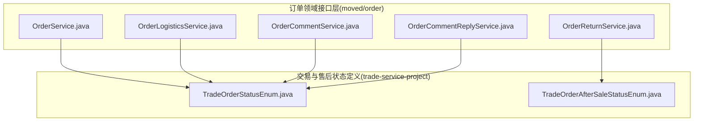
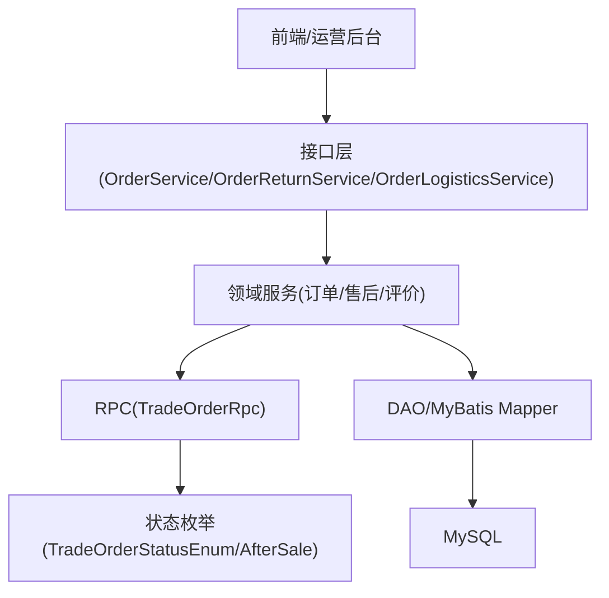
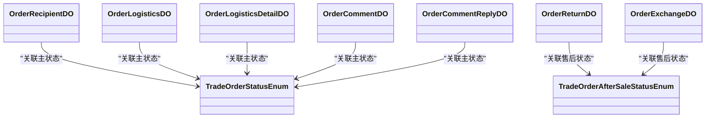
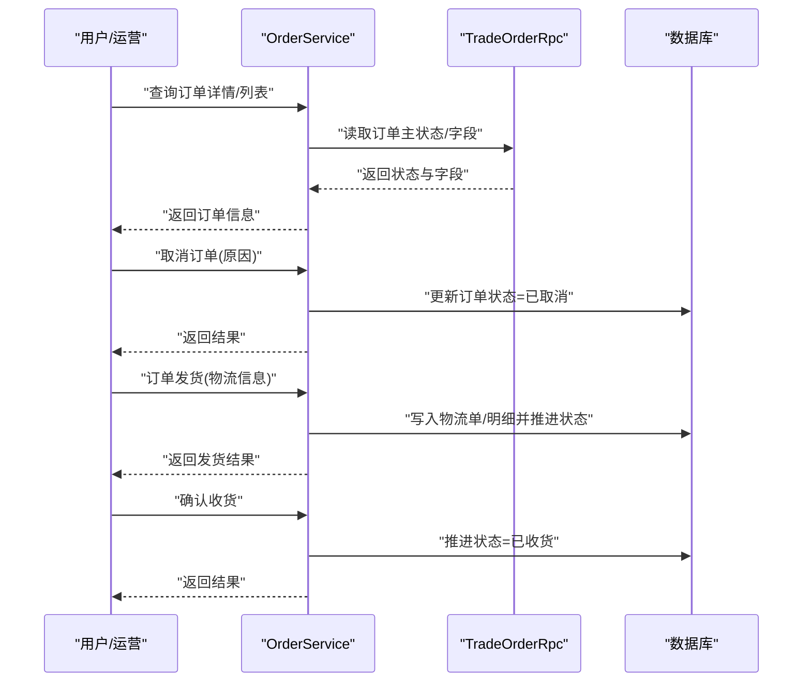
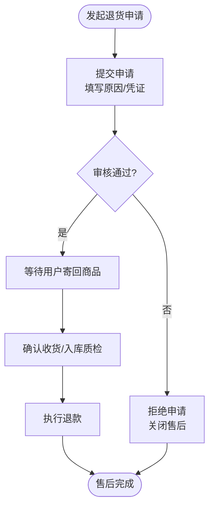
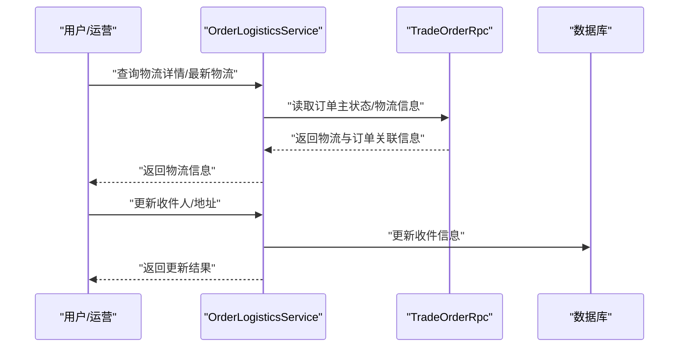
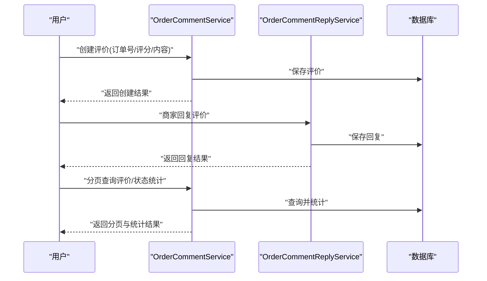
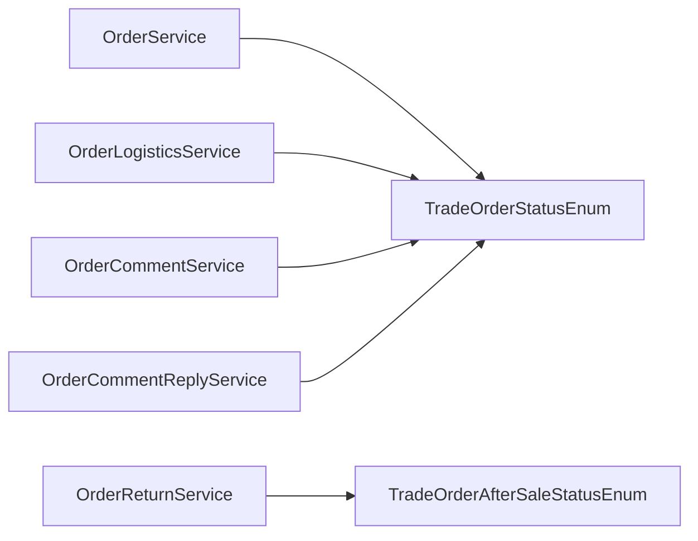

# 订单管理

<cite>
**本文引用的文件**
- [OrderService.java](file://moved\order\order-service-api02\src\main\java\cn\iocoder\mall\order\api\OrderService.java)
- [OrderReturnService.java](file://moved\order\order-service-api02\src\main\java\cn\iocoder\mall\order\api\OrderReturnService.java)
- [TradeOrderStatusEnum.java](file://trade-service-project\trade-service-api\src\main\java\cn\iocoder\mall\tradeservice\enums\order\TradeOrderStatusEnum.java)
- [TradeOrderAfterSaleStatusEnum.java](file://trade-service-project\trade-service-api\src\main\java\cn\iocoder\mall\tradeservice\enums\order\TradeOrderAfterSaleStatusEnum.java)
- [OrderCancelReasonsEnum.java](file://moved\order\order-biz-api\src\main\java\cn\iocoder\mall\order\biz\enums\OrderCancelReasonsEnum.java)
- [OrderReturnReasonEnum.java](file://moved\order\order-biz-api\src\main\java\cn\iocoder\mall\order\biz\enums\OrderReturnReasonEnum.java)
- [OrderExchangeReasonEnum.java](file://moved\order\order-biz-api\src\main\java\cn\iocoder\mall\order\biz\enums\OrderExchangeReasonEnum.java)
- [OrderReturnServiceTypeEnum.java](file://moved\order\order-biz-api\src\main\java\cn\iocoder\mall\order\biz\enums\OrderReturnServiceTypeEnum.java)
- [OrderLogisticsService.java](file://moved\order\order-service-api02\src\main\java\cn\iocoder\mall\order\api\OrderLogisticsService.java)
- [OrderCommentService.java](file://moved\order\order-service-api02\src\main\java\cn\iocoder\mall\order\api\OrderCommentService.java)
- [OrderCommentReplyService.java](file://moved\order\order-service-api02\src\main\java\cn\iocoder\mall\order\api\OrderCommentReplyService.java)
- [OrderLogisticsBO.java](file://moved\order\order-service-api02\src\main\java\cn\iocoder\mall\order\api\bo\OrderLogisticsBO.java)
- [OrderReturnInfoBO.java](file://moved\order\order-service-api02\src\main\java\cn\iocoder\mall\order\api\bo\OrderReturnInfoBO.java)
- [OrderReturnListBO.java](file://moved\order\order-service-api02\src\main\java\cn\iocoder\mall\order\api\bo\OrderReturnListBO.java)
- [OrderCommentBO.java](file://moved\order\order-service-api02\src\main\java\cn\iocoder\mall\order\api\bo\OrderCommentBO.java)
- [OrderCommentCreateBO.java](file://moved\order\order-service-api02\src\main\java\cn\iocoder\mall\order\api\bo\OrderCommentCreateBO.java)
- [OrderCommentPageBO.java](file://moved\order\order-service-api02\src\main\java\cn\iocoder\mall\order\api\bo\OrderCommentPageBO.java)
- [OrderCommentReplyCreateBO.java](file://moved\order\order-service-api02\src\main\java\cn\iocoder\mall\order\api\bo\OrderCommentReplyCreateBO.java)
- [OrderCommentReplyPageBO.java](file://moved\order\order-service-api02\src\main\java\cn\iocoder\mall\order\api\bo\OrderCommentReplyPageBO.java)
- [OrderCommentStateInfoPageBO.java](file://moved\order\order-service-api02\src\main\java\cn\iocoder\mall\order\api\bo\OrderCommentStateInfoPageBO.java)
- [OrderCommentTimeOutBO.java](file://moved\order\order-service-api02\src\main\java\cn\iocoder\mall\order\api\bo\OrderCommentTimeOutBO.java)
- [OrderLogisticsInfoBO.java](file://moved\order\order-service-api02\src\main\java\cn\iocoder\mall\order\api\bo\OrderLogisticsInfoBO.java)
- [OrderLogisticsInfoWithOrderBO.java](file://moved\order\order-service-api02\src\main\java\cn\iocoder\mall\order\api\bo\OrderLogisticsInfoWithOrderBO.java)
- [OrderLastLogisticsInfoBO.java](file://moved\order\order-service-api02\src\main\java\cn\iocoder\mall\order\api\bo\OrderLastLogisticsInfoBO.java)
- [OrderDeliveryDTO.java](file://moved\order\order-service-api02\src\main\java\cn\iocoder\mall\order\api\dto\OrderDeliveryDTO.java)
- [OrderItemUpdateDTO.java](file://moved\order\order-service-api02\src\main\java\cn\iocoder\mall\order\api\dto\OrderItemUpdateDTO.java)
- [OrderItemDeletedDTO.java](file://moved\order\order-service-api02\src\main\java\cn\iocoder\mall\order\api\dto\OrderItemDeletedDTO.java)
- [OrderLogisticsUpdateDTO.java](file://moved\order\order-service-api02\src\main\java\cn\iocoder\mall\order\api\dto\OrderLogisticsUpdateDTO.java)
- [OrderReturnApplyDTO.java](file://moved\order\order-service-api02\src\main\java\cn\iocoder\mall\order\api\dto\OrderReturnApplyDTO.java)
- [OrderReturnQueryDTO.java](file://moved\order\order-service-api02\src\main\java\cn\iocoder\mall\order\api\dto\OrderReturnQueryDTO.java)
- [OrderUserPageDTO.java](file://moved\order\order-service-api02\src\main\java\cn\iocoder\mall\order\api\dto\OrderUserPageDTO.java)
- [OrderQueryDTO.java](file://moved\order\order-service-api02\src\main\java\cn\iocoder\mall\order\api\dto\OrderQueryDTO.java)
- [OrderCommentCreateDTO.java](file://moved\order\order-service-api02\src\main\java\cn\iocoder\mall\order\api\dto\OrderCommentCreateDTO.java)
- [OrderCommentPageDTO.java](file://moved\order\order-service-api02\src\main\java\cn\iocoder\mall\order\api\dto\OrderCommentPageDTO.java)
- [OrderCommentReplyCreateDTO.java](file://moved\order\order-service-api02\src\main\java\cn\iocoder\mall\order\api\dto\OrderCommentReplyCreateDTO.java)
- [OrderCommentReplyPageDTO.java](file://moved\order\order-service-api02\src\main\java\cn\iocoder\mall\order\api\dto\OrderCommentReplyPageDTO.java)
- [OrderCommentStateInfoPageDTO.java](file://moved\order\order-service-api02\src\main\java\cn\iocoder\mall\order\api\dto\OrderCommentStateInfoPageDTO.java)
- [OrderCommentTimeOutPageDTO.java](file://moved\order\order-service-api02\src\main\java\cn\iocoder\mall\order\api\dto\OrderCommentTimeOutPageDTO.java)
- [TradeOrderRpc.java](file://trade-service-project\trade-service-api\src\main\java\cn\iocoder\mall\tradeservice\rpc\TradeOrderRpc.java)
- [TradeOrderCreateReqDTO.java](file://trade-service-project\trade-service-api\src\main\java\cn\iocoder\mall\tradeservice\rpc\TradeOrderCreateReqDTO.java)
- [TradeOrderPageReqDTO.java](file://trade-service-project\trade-service-api\src\main\java\cn\iocoder\mall\tradeservice\rpc\TradeOrderPageReqDTO.java)
- [TradeOrderRespDTO.java](file://trade-service-project\trade-service-api\src\main\java\cn\iocoder\mall\tradeservice\rpc\TradeOrderRespDTO.java)
- [TradeOrderItemRespDTO.java](file://trade-service-project\trade-service-api\src\main\java\cn\iocoder\mall\tradeservice\rpc\TradeOrderItemRespDTO.java)
- [TradeOrderConvert.java](file://trade-service-project\trade-service-app\src\main\java\cn\iocoder\mall\tradeservice\convert\order\TradeOrderConvert.java)
- [TradeOrderRpcImpl.java](file://trade-service-project\trade-service-app\src\main\java\cn\iocoder\mall\tradeservice\rpc\order\TradeOrderRpcImpl.java)
- [TradeOrderService.java](file://trade-service-project\trade-service-app\src\main\java\cn\iocoder\mall\tradeservice\service\order\TradeOrderService.java)
- [TradeOrderServiceImpl.java](file://trade-service-project\trade-service-app\src\main\java\cn\iocoder\mall\tradeservice\service\order\impl\TradeOrderServiceImpl.java)
- [AfterSaleOrderDO.java](file://trade-service-project\trade-service-app\src\main\java\cn\iocoder\mall\tradeservice\dal\mysql\dataobject\aftersale\AfterSaleOrderDO.java)
- [OrderRecipientDO.java](file://trade-service-project\trade-service-app\src\main\java\cn\iocoder\mall\tradeservice\dal\mysql\dataobject\order\OrderRecipientDO.java)
- [OrderLogisticsDO.java](file://trade-service-project\trade-service-app\src\main\java\cn\iocoder\mall\tradeservice\dal\mysql\dataobject\order\OrderLogisticsDO.java)
- [OrderLogisticsDetailDO.java](file://trade-service-project\trade-service-app\src\main\java\cn\iocoder\mall\tradeservice\dal\mysql\dataobject\order\OrderLogisticsDetailDO.java)
- [OrderReturnDO.java](file://moved\order\order-biz\src\main\java\cn\iocoder\mall\order\biz\dataobject\OrderReturnDO.java)
- [OrderExchangeDO.java](file://moved\order\order-biz\src\main\java\cn\iocoder\mall\order\biz\dataobject\OrderExchangeDO.java)
- [OrderCommentDO.java](file://moved\order\order-biz\src\main\java\cn\iocoder\mall\order\biz\dataobject\comment\OrderCommentDO.java)
- [OrderCommentReplyDO.java](file://moved\order\order-biz\src\main\java\cn\iocoder\mall\order\biz\dataobject\OrderCommentReplyDO.java)
- [OrderRecipientMapper.java](file://moved\order\order-biz\src\main\java\cn\iocoder\mall\order\biz\dao\order\OrderRecipientMapper.java)
- [OrderLogisticsMapper.java](file://moved\order\order-biz\src\main\java\cn\iocoder\mall\order\biz\dao\order\OrderLogisticsMapper.java)
- [OrderLogisticsDetailMapper.java](file://moved\order\order-biz\src\main\java\cn\iocoder\mall\order\biz\dao\order\OrderLogisticsDetailMapper.java)
- [OrderReturnMapper.java](file://moved\order\order-biz\src\main\java\cn\iocoder\mall\order\biz\dao\order\OrderReturnMapper.java)
- [OrderExchangeMapper.java](file://moved\order\order-biz\src\main\java\cn\iocoder\mall\order\biz\dao\order\OrderExchangeMapper.java)
- [OrderCommentMapper.java](file://moved\order\order-biz\src\main\java\cn\iocoder\mall\order\biz\dao\comment\OrderCommentMapper.java)
- [OrderCommentReplayMapper.java](file://moved\order\order-biz\src\main\java\cn\iocoder\mall\order\biz\dao\comment\OrderCommentReplayMapper.java)
- [OrderCommentConvert.java](file://moved\order\order-biz\src\main\java\cn\iocoder\mall\order\biz\convert\comment\OrderCommentConvert.java)
- [OrderLogisticsConvert.java](file://moved\order\order-biz\src\main\java\cn\iocoder\mall\order\biz\convert\OrderLogisticsConvert.java)
- [OrderLogisticsDetailConvert.java](file://moved\order\order-biz\src\main\java\cn\iocoder\mall\order\biz\convert\OrderLogisticsDetailConvert.java)
- [OrderRecipientConvert.java](file://moved\order\order-biz\src\main\java\cn\iocoder\mall\order\biz\convert\OrderRecipientConvert.java)
- [OrderReturnConvert.java](file://moved\order\order-biz\src\main\java\cn\iocoder\mall\order\biz\convert\OrderReturnConvert.java)
- [OrderCommentReplyConvert.java](file://moved\order\order-biz\src\main\java\cn\iocoder\mall\order\biz\convert\OrderCommentReplyConvert.java)
- [OrderLogisticsService.java](file://moved\order\order-service-api02\src\main\java\cn\iocoder\mall\order\api\OrderLogisticsService.java)
- [OrderCommentService.java](file://moved\order\order-service-api02\src\main\java\cn\iocoder\mall\order\api\OrderCommentService.java)
- [OrderCommentReplyService.java](file://moved\order\order-service-api02\src\main\java\cn\iocoder\mall\order\api\OrderCommentReplyService.java)
- [OrderReturnService.java](file://moved\order\order-service-api02\src\main\java\cn\iocoder\mall\order\api\OrderReturnService.java)
- [OrderService.java](file://moved\order\order-service-api02\src\main\java\cn\iocoder\mall\order\api\OrderService.java)
</cite>

## 目录
1. [简介](#简介)
2. [项目结构](#项目结构)
3. [核心组件](#核心组件)
4. [架构总览](#架构总览)
5. [详细组件分析](#详细组件分析)
6. [依赖分析](#依赖分析)
7. [性能考虑](#性能考虑)
8. [故障排查指南](#故障排查指南)
9. [结论](#结论)
10. [附录](#附录)

## 简介
本文件面向订单管理系统，系统性梳理订单查询、订单处理（取消、发货、收货）、退款与售后（退货/换货）、物流跟踪、评价管理等完整业务流程。文档基于仓库中的服务接口、枚举、数据对象与转换器进行抽象与总结，提供状态机设计、API 规范、权限控制建议、最佳实践与性能优化建议，帮助开发者与产品人员快速理解与落地。

## 项目结构
订单相关能力主要分布在两个模块：
- 订单领域服务接口与业务对象：位于 moved/order/order-service-api02
- 订单交易与售后状态定义：位于 trade-service-project/trade-service-api

图表来源
- [OrderService.java:1-131](file://moved\order\order-service-api02\src\main\java\cn\iocoder\mall\order\api\OrderService.java#L1-L131)
- [OrderReturnService.java:1-86](file://moved\order\order-service-api02\src\main\java\cn\iocoder\mall\order\api\OrderReturnService.java#L1-L86)
- [TradeOrderStatusEnum.java](file://trade-service-project\trade-service-api\src\main\java\cn\iocoder\mall\tradeservice\enums\order\TradeOrderStatusEnum.java)
- [TradeOrderAfterSaleStatusEnum.java](file://trade-service-project\trade-service-api\src\main\java\cn\iocoder\mall\tradeservice\enums\order\TradeOrderAfterSaleStatusEnum.java)

章节来源
- [OrderService.java:1-131](file://moved\order\order-service-api02\src\main\java\cn\iocoder\mall\order\api\OrderService.java#L1-L131)
- [OrderReturnService.java:1-86](file://moved\order\order-service-api02\src\main\java\cn\iocoder\mall\order\api\OrderReturnService.java#L1-L86)
- [TradeOrderStatusEnum.java](file://trade-service-project\trade-service-api\src\main\java\cn\iocoder\mall\tradeservice\enums\order\TradeOrderStatusEnum.java)
- [TradeOrderAfterSaleStatusEnum.java](file://trade-service-project\trade-service-api\src\main\java\cn\iocoder\mall\tradeservice\enums\order\TradeOrderAfterSaleStatusEnum.java)

## 核心组件
- 订单服务接口：提供订单详情、更新、取消、发货、备注、删除、支付完成标记、确认收货、物流信息更新、监听 MQ 状态变更等能力。
- 退货/退款服务接口：提供退货申请、退款成功标记、申请信息查询、退货列表、同意/拒绝、确认收货、退款执行等能力。
- 物流服务接口：提供物流信息查询与关联订单的能力。
- 评价服务接口：提供评价与回复的创建、分页、状态统计、超时统计等能力。
- 交易状态枚举：定义订单主状态与售后状态，用于统一状态流转与校验。

章节来源
- [OrderService.java:1-131](file://moved\order\order-service-api02\src\main\java\cn\iocoder\mall\order\api\OrderService.java#L1-L131)
- [OrderReturnService.java:1-86](file://moved\order\order-service-api02\src\main\java\cn\iocoder\mall\order\api\OrderReturnService.java#L1-L86)
- [OrderLogisticsService.java](file://moved\order\order-service-api02\src\main\java\cn\iocoder\mall\order\api\OrderLogisticsService.java)
- [OrderCommentService.java](file://moved\order\order-service-api02\src\main\java\cn\iocoder\mall\order\api\OrderCommentService.java)
- [OrderCommentReplyService.java](file://moved\order\order-service-api02\src\main\java\cn\iocoder\mall\order\api\OrderCommentReplyService.java)
- [TradeOrderStatusEnum.java](file://trade-service-project\trade-service-api\src\main\java\cn\iocoder\mall\tradeservice\enums\order\TradeOrderStatusEnum.java)
- [TradeOrderAfterSaleStatusEnum.java](file://trade-service-project\trade-service-api\src\main\java\cn\iocoder\mall\tradeservice\enums\order\TradeOrderAfterSaleStatusEnum.java)

## 架构总览
订单管理采用“接口层 + 领域服务 + RPC/DAO”的分层架构：
- 接口层：对外暴露订单、退货、物流、评价等服务接口。
- 领域服务：封装订单状态机、业务规则与事务边界。
- RPC 层：与交易服务交互，读取订单主状态与售后状态。
- DAO 层：持久化订单、物流、售后、评价等数据对象。

图表来源
- [OrderService.java:1-131](file://moved\order\order-service-api02\src\main\java\cn\iocoder\mall\order\api\OrderService.java#L1-L131)
- [OrderReturnService.java:1-86](file://moved\order\order-service-api02\src\main\java\cn\iocoder\mall\order\api\OrderReturnService.java#L1-L86)
- [TradeOrderRpc.java](file://trade-service-project\trade-service-api\src\main\java\cn\iocoder\mall\tradeservice\rpc\TradeOrderRpc.java)
- [TradeOrderStatusEnum.java](file://trade-service-project\trade-service-api\src\main\java\cn\iocoder\mall\tradeservice\enums\order\TradeOrderStatusEnum.java)
- [TradeOrderAfterSaleStatusEnum.java](file://trade-service-project\trade-service-api\src\main\java\cn\iocoder\mall\tradeservice\enums\order\TradeOrderAfterSaleStatusEnum.java)

## 详细组件分析

### 订单状态机与数据模型
- 主状态：由交易服务定义的订单主状态枚举，覆盖下单、已支付、待发货、已发货、已收货、已取消、已完成等阶段。
- 售后状态：由交易服务定义的售后状态枚举，覆盖售前、售中、售后不同阶段的状态集合。
- 关键数据对象：
  - 订单收件人：记录收货人、电话、地址等信息。
  - 物流单与物流明细：记录快递公司、运单号、轨迹节点等。
  - 售后/退货单：记录退货/换货申请、原因、状态、处理结果等。
  - 评价与回复：记录评价内容、评分、状态、商家回复等。

图表来源
- [TradeOrderStatusEnum.java](file://trade-service-project\trade-service-api\src\main\java\cn\iocoder\mall\tradeservice\enums\order\TradeOrderStatusEnum.java)
- [TradeOrderAfterSaleStatusEnum.java](file://trade-service-project\trade-service-api\src\main\java\cn\iocoder\mall\tradeservice\enums\order\TradeOrderAfterSaleStatusEnum.java)
- [OrderRecipientDO.java](file://trade-service-project\trade-service-app\src\main\java\cn\iocoder\mall\tradeservice\dal\mysql\dataobject\order\OrderRecipientDO.java)
- [OrderLogisticsDO.java](file://trade-service-project\trade-service-app\src\main\java\cn\iocoder\mall\tradeservice\dal\mysql\dataobject\order\OrderLogisticsDO.java)
- [OrderLogisticsDetailDO.java](file://trade-service-project\trade-service-app\src\main\java\cn\iocoder\mall\tradeservice\dal\mysql\dataobject\order\OrderLogisticsDetailDO.java)
- [OrderReturnDO.java](file://moved\order\order-biz\src\main\java\cn\iocoder\mall\order\biz\dataobject\OrderReturnDO.java)
- [OrderExchangeDO.java](file://moved\order\order-biz\src\main\java\cn\iocoder\mall\order\biz\dataobject\OrderExchangeDO.java)
- [OrderCommentDO.java](file://moved\order\order-biz\src\main\java\cn\iocoder\mall\order\biz\dataobject\comment\OrderCommentDO.java)
- [OrderCommentReplyDO.java](file://moved\order\order-biz\src\main\java\cn\iocoder\mall\order\biz\dataobject\OrderCommentReplyDO.java)

章节来源
- [TradeOrderStatusEnum.java](file://trade-service-project\trade-service-api\src\main\java\cn\iocoder\mall\tradeservice\enums\order\TradeOrderStatusEnum.java)
- [TradeOrderAfterSaleStatusEnum.java](file://trade-service-project\trade-service-api\src\main\java\cn\iocoder\mall\tradeservice\enums\order\TradeOrderAfterSaleStatusEnum.java)
- [OrderRecipientDO.java](file://trade-service-project\trade-service-app\src\main\java\cn\iocoder\mall\tradeservice\dal\mysql\dataobject\order\OrderRecipientDO.java)
- [OrderLogisticsDO.java](file://trade-service-project\trade-service-app\src\main\java\cn\iocoder\mall\tradeservice\dal\mysql\dataobject\order\OrderLogisticsDO.java)
- [OrderLogisticsDetailDO.java](file://trade-service-project\trade-service-app\src\main\java\cn\iocoder\mall\tradeservice\dal\mysql\dataobject\order\OrderLogisticsDetailDO.java)
- [OrderReturnDO.java](file://moved\order\order-biz\src\main\java\cn\iocoder\mall\order\biz\dataobject\OrderReturnDO.java)
- [OrderExchangeDO.java](file://moved\order\order-biz\src\main\java\cn\iocoder\mall\order\biz\dataobject\OrderExchangeDO.java)
- [OrderCommentDO.java](file://moved\order\order-biz\src\main\java\cn\iocoder\mall\order\biz\dataobject\comment\OrderCommentDO.java)
- [OrderCommentReplyDO.java](file://moved\order\order-biz\src\main\java\cn\iocoder\mall\order\biz\dataobject\OrderCommentReplyDO.java)

### 订单查询与处理流程
- 查询：支持按用户、订单号、分页条件查询订单详情与列表。
- 更新：支持订单项数量/价格调整、备注更新、删除订单项、删除订单（逻辑删除）。
- 取消：支持取消订单并记录取消原因。
- 发货：支持订单发货，写入物流信息并推进主状态。
- 确认收货：支持用户确认收货，触发售后期结束与自动好评等后续流程。
- 支付完成：支持外部回调或对账后标记支付成功。

图表来源
- [OrderService.java:1-131](file://moved\order\order-service-api02\src\main\java\cn\iocoder\mall\order\api\OrderService.java#L1-L131)
- [TradeOrderRpc.java](file://trade-service-project\trade-service-api\src\main\java\cn\iocoder\mall\tradeservice\rpc\TradeOrderRpc.java)
- [TradeOrderStatusEnum.java](file://trade-service-project\trade-service-api\src\main\java\cn\iocoder\mall\tradeservice\enums\order\TradeOrderStatusEnum.java)

章节来源
- [OrderService.java:1-131](file://moved\order\order-service-api02\src\main\java\cn\iocoder\mall\order\api\OrderService.java#L1-L131)
- [OrderDeliveryDTO.java](file://moved\order\order-service-api02\src\main\java\cn\iocoder\mall\order\api\dto\OrderDeliveryDTO.java)
- [OrderItemUpdateDTO.java](file://moved\order\order-service-api02\src\main\java\cn\iocoder\mall\order\api\dto\OrderItemUpdateDTO.java)
- [OrderItemDeletedDTO.java](file://moved\order\order-service-api02\src\main\java\cn\iocoder\mall\order\api\dto\OrderItemDeletedDTO.java)
- [OrderLogisticsUpdateDTO.java](file://moved\order\order-service-api02\src\main\java\cn\iocoder\mall\order\api\dto\OrderLogisticsUpdateDTO.java)
- [OrderQueryDTO.java](file://moved\order\order-service-api02\src\main\java\cn\iocoder\mall\order\api\dto\OrderQueryDTO.java)
- [OrderUserPageDTO.java](file://moved\order\order-service-api02\src\main\java\cn\iocoder\mall\order\api\dto\OrderUserPageDTO.java)

### 退款管理与售后处理
- 退货申请：支持用户提交退货申请，填写退货原因、上传凭证等。
- 审核与处理：支持同意/拒绝退货申请，确认收货后执行退款。
- 退款成功标记：支持外部回调或对账后标记退款成功。
- 售后状态：根据申请、审核、收货、退款等环节推进售后状态。

图表来源
- [OrderReturnService.java:1-86](file://moved\order\order-service-api02\src\main\java\cn\iocoder\mall\order\api\OrderReturnService.java#L1-L86)
- [OrderReturnApplyDTO.java](file://moved\order\order-service-api02\src\main\java\cn\iocoder\mall\order\api\dto\OrderReturnApplyDTO.java)
- [OrderReturnQueryDTO.java](file://moved\order\order-service-api02\src\main\java\cn\iocoder\mall\order\api\dto\OrderReturnQueryDTO.java)
- [OrderReturnInfoBO.java](file://moved\order\order-service-api02\src\main\java\cn\iocoder\mall\order\api\bo\OrderReturnInfoBO.java)
- [OrderReturnListBO.java](file://moved\order\order-service-api02\src\main\java\cn\iocoder\mall\order\api\bo\OrderReturnListBO.java)
- [TradeOrderAfterSaleStatusEnum.java](file://trade-service-project\trade-service-api\src\main\java\cn\iocoder\mall\tradeservice\enums\order\TradeOrderAfterSaleStatusEnum.java)

章节来源
- [OrderReturnService.java:1-86](file://moved\order\order-service-api02\src\main\java\cn\iocoder\mall\order\api\OrderReturnService.java#L1-L86)
- [OrderReturnApplyDTO.java](file://moved\order\order-service-api02\src\main\java\cn\iocoder\mall\order\api\dto\OrderReturnApplyDTO.java)
- [OrderReturnQueryDTO.java](file://moved\order\order-service-api02\src\main\java\cn\iocoder\mall\order\api\dto\OrderReturnQueryDTO.java)
- [OrderReturnInfoBO.java](file://moved\order\order-service-api02\src\main\java\cn\iocoder\mall\order\api\bo\OrderReturnInfoBO.java)
- [OrderReturnListBO.java](file://moved\order\order-service-api02\src\main\java\cn\iocoder\mall\order\api\bo\OrderReturnListBO.java)
- [OrderReturnReasonEnum.java](file://moved\order\order-biz-api\src\main\java\cn\iocoder\mall\order\biz\enums\OrderReturnReasonEnum.java)
- [OrderExchangeReasonEnum.java](file://moved\order\order-biz-api\src\main\java\cn\iocoder\mall\order\biz\enums\OrderExchangeReasonEnum.java)
- [OrderReturnServiceTypeEnum.java](file://moved\order\order-biz-api\src\main\java\cn\iocoder\mall\order\biz\enums\OrderReturnServiceTypeEnum.java)

### 物流跟踪与收件信息
- 物流信息：支持查询物流详情、最新物流信息、与订单关联的物流信息。
- 收件信息：支持更新收货人、电话、地址等信息，确保发货准确性。
- 物流明细：记录快递轨迹节点，便于前端展示与用户追踪。

图表来源
- [OrderLogisticsService.java](file://moved\order\order-service-api02\src\main\java\cn\iocoder\mall\order\api\OrderLogisticsService.java)
- [OrderLogisticsBO.java](file://moved\order\order-service-api02\src\main\java\cn\iocoder\mall\order\api\bo\OrderLogisticsBO.java)
- [OrderLogisticsInfoBO.java](file://moved\order\order-service-api02\src\main\java\cn\iocoder\mall\order\api\bo\OrderLogisticsInfoBO.java)
- [OrderLogisticsInfoWithOrderBO.java](file://moved\order\order-service-api02\src\main\java\cn\iocoder\mall\order\api\bo\OrderLogisticsInfoWithOrderBO.java)
- [OrderLastLogisticsInfoBO.java](file://moved\order\order-service-api02\src\main\java\cn\iocoder\mall\order\api\bo\OrderLastLogisticsInfoBO.java)
- [OrderLogisticsUpdateDTO.java](file://moved\order\order-service-api02\src\main\java\cn\iocoder\mall\order\api\dto\OrderLogisticsUpdateDTO.java)

章节来源
- [OrderLogisticsService.java](file://moved\order\order-service-api02\src\main\java\cn\iocoder\mall\order\api\OrderLogisticsService.java)
- [OrderLogisticsBO.java](file://moved\order\order-service-api02\src\main\java\cn\iocoder\mall\order\api\bo\OrderLogisticsBO.java)
- [OrderLogisticsInfoBO.java](file://moved\order\order-service-api02\src\main\java\cn\iocoder\mall\order\api\bo\OrderLogisticsInfoBO.java)
- [OrderLogisticsInfoWithOrderBO.java](file://moved\order\order-service-api02\src\main\java\cn\iocoder\mall\order\api\bo\OrderLogisticsInfoWithOrderBO.java)
- [OrderLastLogisticsInfoBO.java](file://moved\order\order-service-api02\src\main\java\cn\iocoder\mall\order\api\bo\OrderLastLogisticsInfoBO.java)
- [OrderLogisticsUpdateDTO.java](file://moved\order\order-service-api02\src\main\java\cn\iocoder\mall\order\api\dto\OrderLogisticsUpdateDTO.java)

### 评价管理
- 评价创建：支持用户在订单完成后提交评价，包含评分、文字、图片等。
- 回复管理：支持商家对评价进行回复。
- 分页与统计：支持按状态分页查询、状态统计、超时统计等。

图表来源
- [OrderCommentService.java](file://moved\order\order-service-api02\src\main\java\cn\iocoder\mall\order\api\OrderCommentService.java)
- [OrderCommentReplyService.java](file://moved\order\order-service-api02\src\main\java\cn\iocoder\mall\order\api\OrderCommentReplyService.java)
- [OrderCommentCreateDTO.java](file://moved\order\order-service-api02\src\main\java\cn\iocoder\mall\order\api\dto\OrderCommentCreateDTO.java)
- [OrderCommentPageDTO.java](file://moved\order\order-service-api02\src\main\java\cn\iocoder\mall\order\api\dto\OrderCommentPageDTO.java)
- [OrderCommentReplyCreateDTO.java](file://moved\order\order-service-api02\src\main\java\cn\iocoder\mall\order\api\dto\OrderCommentReplyCreateDTO.java)
- [OrderCommentReplyPageDTO.java](file://moved\order\order-service-api02\src\main\java\cn\iocoder\mall\order\api\dto\OrderCommentReplyPageDTO.java)
- [OrderCommentStateInfoPageDTO.java](file://moved\order\order-service-api02\src\main\java\cn\iocoder\mall\order\api\dto\OrderCommentStateInfoPageDTO.java)
- [OrderCommentTimeOutPageDTO.java](file://moved\order\order-service-api02\src\main\java\cn\iocoder\mall\order\api\dto\OrderCommentTimeOutPageDTO.java)
- [OrderCommentBO.java](file://moved\order\order-service-api02\src\main\java\cn\iocoder\mall\order\api\bo\OrderCommentBO.java)
- [OrderCommentCreateBO.java](file://moved\order\order-service-api02\src\main\java\cn\iocoder\mall\order\api\bo\OrderCommentCreateBO.java)
- [OrderCommentPageBO.java](file://moved\order\order-service-api02\src\main\java\cn\iocoder\mall\order\api\bo\OrderCommentPageBO.java)
- [OrderCommentReplyCreateBO.java](file://moved\order\order-service-api02\src\main\java\cn\iocoder\mall\order\api\bo\OrderCommentReplyCreateBO.java)
- [OrderCommentReplyPageBO.java](file://moved\order\order-service-api02\src\main\java\cn\iocoder\mall\order\api\bo\OrderCommentReplyPageBO.java)
- [OrderCommentStateInfoPageBO.java](file://moved\order\order-service-api02\src\main\java\cn\iocoder\mall\order\api\bo\OrderCommentStateInfoPageBO.java)
- [OrderCommentTimeOutBO.java](file://moved\order\order-service-api02\src\main\java\cn\iocoder\mall\order\api\bo\OrderCommentTimeOutBO.java)

章节来源
- [OrderCommentService.java](file://moved\order\order-service-api02\src\main\java\cn\iocoder\mall\order\api\OrderCommentService.java)
- [OrderCommentReplyService.java](file://moved\order\order-service-api02\src\main\java\cn\iocoder\mall\order\api\OrderCommentReplyService.java)
- [OrderCommentCreateDTO.java](file://moved\order\order-service-api02\src\main\java\cn\iocoder\mall\order\api\dto\OrderCommentCreateDTO.java)
- [OrderCommentPageDTO.java](file://moved\order\order-service-api02\src\main\java\cn\iocoder\mall\order\api\dto\OrderCommentPageDTO.java)
- [OrderCommentReplyCreateDTO.java](file://moved\order\order-service-api02\src\main\java\cn\iocoder\mall\order\api\dto\OrderCommentReplyCreateDTO.java)
- [OrderCommentReplyPageDTO.java](file://moved\order\order-service-api02\src\main\java\cn\iocoder\mall\order\api\dto\OrderCommentReplyPageDTO.java)
- [OrderCommentStateInfoPageDTO.java](file://moved\order\order-service-api02\src\main\java\cn\iocoder\mall\order\api\dto\OrderCommentStateInfoPageDTO.java)
- [OrderCommentTimeOutPageDTO.java](file://moved\order\order-service-api02\src\main\java\cn\iocoder\mall\order\api\dto\OrderCommentTimeOutPageDTO.java)
- [OrderCommentBO.java](file://moved\order\order-service-api02\src\main\java\cn\iocoder\mall\order\api\bo\OrderCommentBO.java)
- [OrderCommentCreateBO.java](file://moved\order\order-service-api02\src\main\java\cn\iocoder\mall\order\api\bo\OrderCommentCreateBO.java)
- [OrderCommentPageBO.java](file://moved\order\order-service-api02\src\main\java\cn\iocoder\mall\order\api\bo\OrderCommentPageBO.java)
- [OrderCommentReplyCreateBO.java](file://moved\order\order-service-api02\src\main\java\cn\iocoder\mall\order\api\bo\OrderCommentReplyCreateBO.java)
- [OrderCommentReplyPageBO.java](file://moved\order\order-service-api02\src\main\java\cn\iocoder\mall\order\api\bo\OrderCommentReplyPageBO.java)
- [OrderCommentStateInfoPageBO.java](file://moved\order\order-service-api02\src\main\java\cn\iocoder\mall\order\api\bo\OrderCommentStateInfoPageBO.java)
- [OrderCommentTimeOutBO.java](file://moved\order\order-service-api02\src\main\java\cn\iocoder\mall\order\api\bo\OrderCommentTimeOutBO.java)

### API 接口规范（示例）
以下为关键接口的请求/响应与职责概览（以 DTO/BO 为准）：

- 订单查询与处理
  - info(userId, orderId) -> 返回订单详情 BO
  - updateOrderItem(...) -> 更新订单项
  - updateOrderItemPayAmount(orderId, orderItemId, payAmount) -> 更新应付金额
  - cancelOrder(orderId, reasons, otherReasons) -> 取消订单
  - orderDelivery(OrderDeliveryDTO) -> 发货
  - updateOrderRemake(orderId, remake) -> 更新备注
  - deleteOrderItem(...) -> 删除订单项
  - deleteOrder(id) -> 删除订单（逻辑删除）
  - confirmReceiving(userId, orderId) -> 用户确认收货
  - updateLogistics(OrderLogisticsUpdateDTO) -> 更新收件信息
  - updatePaySuccess(orderId, payAmount) -> 支付完成标记
  - listenerConfirmGoods()/listenerExchangeGoods() -> MQ 监听状态变更

- 退货/退款
  - orderReturnApply(OrderReturnApplyDTO) -> 退货申请
  - updateRefundSuccess(orderId, refundPrice) -> 退款成功标记
  - orderApplyInfo(orderId) -> 申请信息
  - orderReturnList(OrderReturnQueryDTO) -> 退货列表
  - orderReturnAgree(id) -> 同意退货
  - orderReturnRefuse(id) -> 拒绝退货
  - confirmReceipt(id) -> 确认收货
  - refund(id, ip) -> 执行退款

- 物流
  - 查询物流详情/最新物流信息（对应 BO）

- 评价
  - 创建评价、分页查询、回复、状态统计、超时统计（对应 DTO/BO）

章节来源
- [OrderService.java:1-131](file://moved\order\order-service-api02\src\main\java\cn\iocoder\mall\order\api\OrderService.java#L1-L131)
- [OrderReturnService.java:1-86](file://moved\order\order-service-api02\src\main\java\cn\iocoder\mall\order\api\OrderReturnService.java#L1-L86)
- [OrderLogisticsService.java](file://moved\order\order-service-api02\src\main\java\cn\iocoder\mall\order\api\OrderLogisticsService.java)
- [OrderCommentService.java](file://moved\order\order-service-api02\src\main\java\cn\iocoder\mall\order\api\OrderCommentService.java)
- [OrderCommentReplyService.java](file://moved\order\order-service-api02\src\main\java\cn\iocoder\mall\order\api\OrderCommentReplyService.java)

## 依赖分析
- 订单服务依赖交易服务的状态枚举，保证主状态一致性。
- 退货/售后服务依赖售后状态枚举，保证售后流程状态一致。
- 物流与评价服务依赖订单主状态，避免跨状态非法操作。
- DAO 层通过 Mapper 与 DO 对象映射，实现数据持久化。

图表来源
- [OrderService.java:1-131](file://moved\order\order-service-api02\src\main\java\cn\iocoder\mall\order\api\OrderService.java#L1-L131)
- [OrderReturnService.java:1-86](file://moved\order\order-service-api02\src\main\java\cn\iocoder\mall\order\api\OrderReturnService.java#L1-L86)
- [OrderLogisticsService.java](file://moved\order\order-service-api02\src\main\java\cn\iocoder\mall\order\api\OrderLogisticsService.java)
- [OrderCommentService.java](file://moved\order\order-service-api02\src\main\java\cn\iocoder\mall\order\api\OrderCommentService.java)
- [OrderCommentReplyService.java](file://moved\order\order-service-api02\src\main\java\cn\iocoder\mall\order\api\OrderCommentReplyService.java)
- [TradeOrderStatusEnum.java](file://trade-service-project\trade-service-api\src\main\java\cn\iocoder\mall\tradeservice\enums\order\TradeOrderStatusEnum.java)
- [TradeOrderAfterSaleStatusEnum.java](file://trade-service-project\trade-service-api\src\main\java\cn\iocoder\mall\tradeservice\enums\order\TradeOrderAfterSaleStatusEnum.java)

章节来源
- [OrderService.java:1-131](file://moved\order\order-service-api02\src\main\java\cn\iocoder\mall\order\api\OrderService.java#L1-L131)
- [OrderReturnService.java:1-86](file://moved\order\order-service-api02\src\main\java\cn\iocoder\mall\order\api\OrderReturnService.java#L1-L86)
- [OrderLogisticsService.java](file://moved\order\order-service-api02\src\main\java\cn\iocoder\mall\order\api\OrderLogisticsService.java)
- [OrderCommentService.java](file://moved\order\order-service-api02\src\main\java\cn\iocoder\mall\order\api\OrderCommentService.java)
- [OrderCommentReplyService.java](file://moved\order\order-service-api02\src\main\java\cn\iocoder\mall\order\api\OrderCommentReplyService.java)
- [TradeOrderStatusEnum.java](file://trade-service-project\trade-service-api\src\main\java\cn\iocoder\mall\tradeservice\enums\order\TradeOrderStatusEnum.java)
- [TradeOrderAfterSaleStatusEnum.java](file://trade-service-project\trade-service-api\src\main\java\cn\iocoder\mall\tradeservice\enums\order\TradeOrderAfterSaleStatusEnum.java)

## 性能考虑
- 状态查询与缓存：对常用状态（如订单主状态、售后状态）可引入缓存，减少重复查询。
- 分页与排序：列表查询应使用分页参数与稳定排序字段，避免全量扫描。
- 批量操作：批量更新订单项、物流信息时，尽量合并为批处理，降低数据库往返。
- 异步处理：发货、退款、评价等耗时操作可通过消息队列异步化，提升接口响应。
- 数据库索引：为订单号、用户 ID、状态、时间等高频查询字段建立合适索引。
- 读写分离：高并发场景下，将查询与写入分离至不同实例，提升吞吐。

## 故障排查指南
- 订单状态异常：检查主状态与售后状态是否匹配，确认状态机推进是否符合业务规则。
- 退货流程卡顿：核对退货申请、审核、收货、退款各环节状态是否正确推进。
- 物流信息缺失：确认物流单与明细是否正确写入，查询接口是否正确关联订单。
- 评价异常：检查评价与回复的创建权限、分页参数与状态统计逻辑。
- 权限控制：确保接口调用方具备相应权限，防止越权操作。

## 结论
本文件从状态机、数据模型、接口规范、权限控制、最佳实践与性能优化六个维度，系统化梳理了订单管理的核心能力。建议在实际落地时，严格遵循状态机与权限控制，结合缓存与异步化策略，持续优化查询与写入性能，并完善监控与告警机制，保障订单系统的稳定性与可扩展性。

## 附录
- 术语
  - 主状态：订单主流程状态（如下单、已支付、待发货、已发货、已收货、已取消、已完成）。
  - 售后状态：售后流程状态（售前、售中、售后不同阶段）。
  - 退货/换货：用户发起的售后类型，对应不同的处理流程与状态推进。
- 参考文件
  - [TradeOrderStatusEnum.java](file://trade-service-project\trade-service-api\src\main\java\cn\iocoder\mall\tradeservice\enums\order\TradeOrderStatusEnum.java)
  - [TradeOrderAfterSaleStatusEnum.java](file://trade-service-project\trade-service-api\src\main\java\cn\iocoder\mall\tradeservice\enums\order\TradeOrderAfterSaleStatusEnum.java)
  - [OrderCancelReasonsEnum.java](file://moved\order\order-biz-api\src\main\java\cn\iocoder\mall\order\biz\enums\OrderCancelReasonsEnum.java)
  - [OrderReturnReasonEnum.java](file://moved\order\order-biz-api\src\main\java\cn\iocoder\mall\order\biz\enums\OrderReturnReasonEnum.java)
  - [OrderExchangeReasonEnum.java](file://moved\order\order-biz-api\src\main\java\cn\iocoder\mall\order\biz\enums\OrderExchangeReasonEnum.java)
  - [OrderReturnServiceTypeEnum.java](file://moved\order\order-biz-api\src\main\java\cn\iocoder\mall\order\biz\enums\OrderReturnServiceTypeEnum.java)