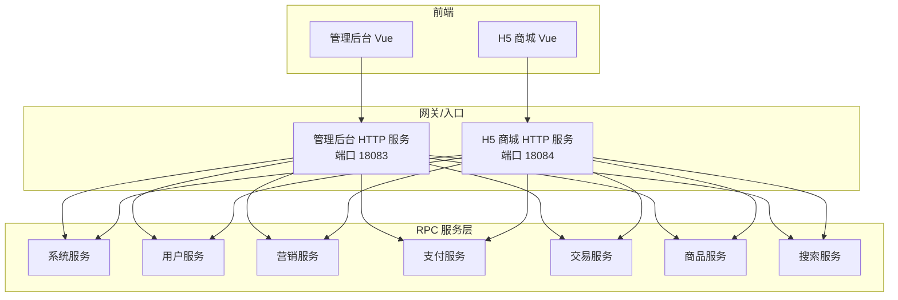
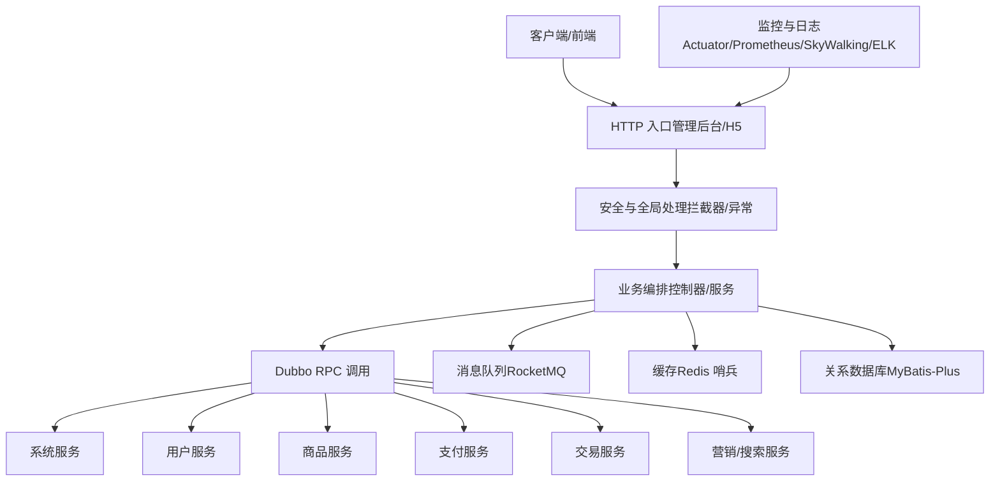
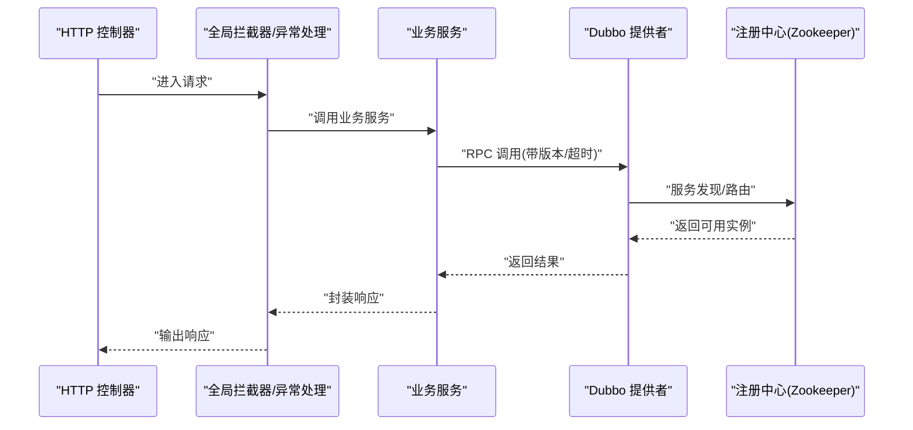
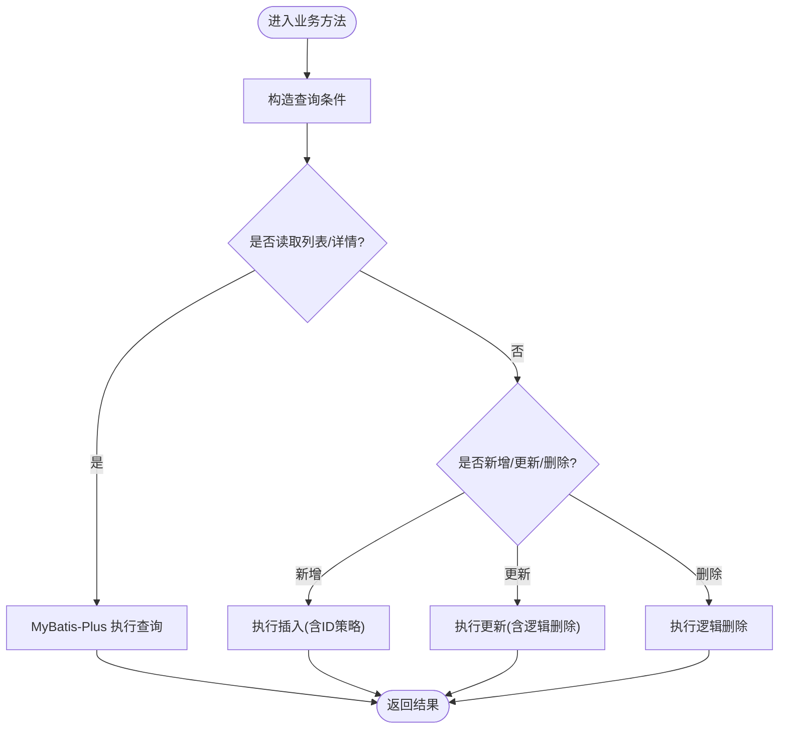
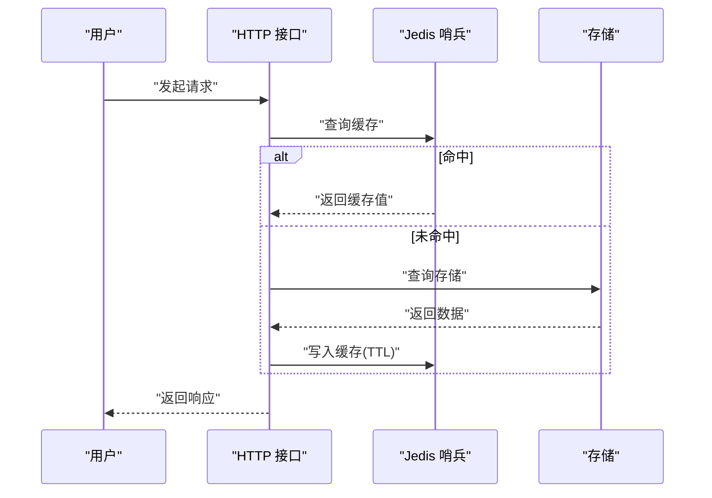
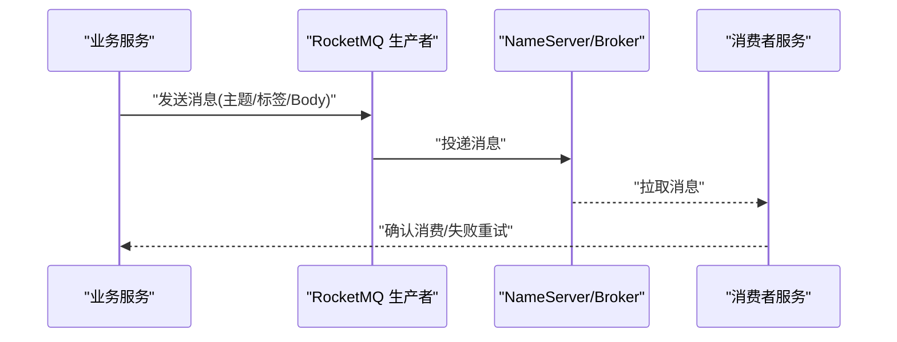
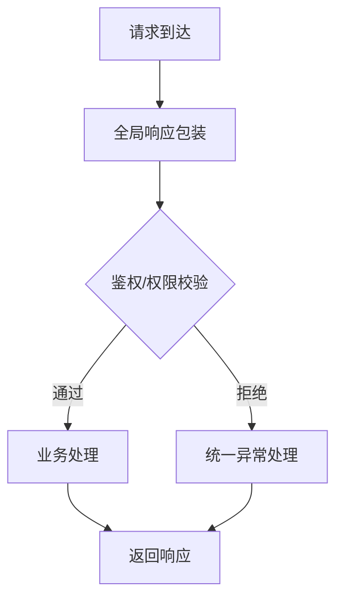
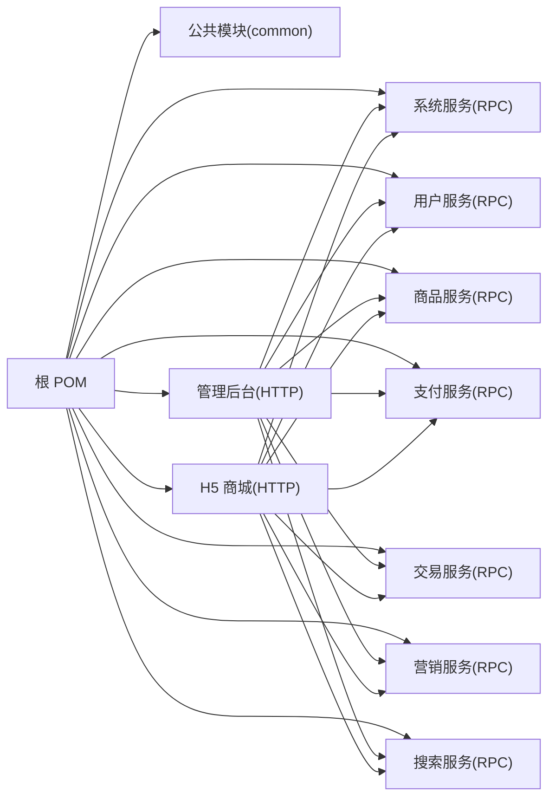

# 系统能力特性

<cite>
**本文引用的文件**
- [README.md](file://README.md)
- [pom.xml](file://pom.xml)
- [application.yml（管理后台）](file://management-web-app/src/main/resources/application.yml)
- [application.yml（H5 商城）](file://shop-web-app/src/main/resources/application.yml)
- [application.yaml（支付服务）](file://pay-service-project/pay-service-app/src/main/resources/application.yaml)
- [application.yaml（商品服务）](file://product-service-project/product-service-app/src/main/resources/application.yaml)
- [application.yaml（系统服务）](file://system-service-project/system-service-app/src/main/resources/application.yaml)
- [DubboEnvironmentPostProcessor.java](file://common/mall-spring-boot-starter-dubbo/src/main/java/cn/iocoder/mall/dubbo/config/DubboEnvironmentPostProcessor.java)
- [CommonWebAutoConfiguration.java](file://common/mall-spring-boot-starter-web/src/main/java/cn/iocoder/mall/web/config/CommonWebAutoConfiguration.java)
- [MybatisPlusAutoConfiguration.java](file://common/mall-spring-boot-starter-mybatis/src/main/java/cn/iocoder/mall/mybatis/config/MybatisPlusAutoConfiguration.java)
- [JedisClient.java](file://common/mall-spring-boot-starter-cache/src/main/java/cn/iocoder/mall/cache/config/JedisClient.java)
- [mall-spring-boot-starter-rocketmq/pom.xml](file://common/mall-spring-boot-starter-rocketmq/pom.xml)
</cite>

## 目录
1. [引言](#引言)
2. [项目结构](#项目结构)
3. [核心组件](#核心组件)
4. [架构总览](#架构总览)
5. [详细组件分析](#详细组件分析)
6. [依赖分析](#依赖分析)
7. [性能考虑](#性能考虑)
8. [故障排查指南](#故障排查指南)
9. [结论](#结论)
10. [附录](#附录)

## 引言
本文件面向开发者与运维工程师，系统化梳理 Onemall 系统的能力特性与实现要点，覆盖微服务架构、分布式事务、高并发、弹性伸缩、安全防护、监控告警、日志分析、性能优化、可扩展性与容错、数据一致性、缓存与消息队列等主题。文档同时给出架构视图、流程图与时序图，帮助读者快速理解并高效使用系统。

## 项目结构
Onemall 采用多模块聚合工程组织，后端以“xxx-web-app”对外提供 HTTP API，“xxx-service-project”内部以 Dubbo RPC 提供服务，配合 MyBatis-Plus、RocketMQ、Actuator 等基础设施，形成前后端分离、服务自治、可观测的微服务体系。

图表来源
- [README.md: 109-126:109-126](file://README.md#L109-L126)
- [application.yml（管理后台）: 1-83:1-83](file://management-web-app/src/main/resources/application.yml#L1-L83)
- [application.yml（H5 商城）: 1-76:1-76](file://shop-web-app/src/main/resources/application.yml#L1-L76)

章节来源
- [pom.xml: 16-28:16-28](file://pom.xml#L16-L28)
- [README.md: 129-139:129-139](file://README.md#L129-L139)

## 核心组件
- 微服务运行时与注册发现：基于 Spring Cloud Alibaba Dubbo，通过 Zookeeper 作为注册中心，结合路由标签与订阅配置实现服务治理。
- RPC 通信：Dubbo 提供高性能、易用的 RPC 能力，消费者侧统一声明版本与超时策略，提供者侧启用参数校验与异常过滤。
- 数据访问：MyBatis-Plus 自动配置注入自定义 SQL 注入器，统一 ID 策略与逻辑删除策略，提升开发效率与一致性。
- 缓存：Jedis 客户端封装了哨兵连接池，提供键值读写与过期控制，支撑热点数据与会话缓存。
- 消息队列：RocketMQ Starter 提供生产者/消费者接入能力，结合 NameServer 进行异步解耦与削峰填谷。
- 监控与可观测：Actuator 暴露指标端点，结合 Prometheus/Grafana/SkyWalking/ELK 形成完整的观测闭环。
- 安全与权限：基于注解的安全拦截器与全局异常处理，统一响应格式与错误码管理。
- 配置与部署：各服务独立 Actuator 端口，便于容器化与弹性伸缩；前端分别部署于不同端口，便于网关与负载均衡。

章节来源
- [application.yml（管理后台）: 19-71:19-71](file://management-web-app/src/main/resources/application.yml#L19-L71)
- [application.yml（H5 商城）: 19-64:19-64](file://shop-web-app/src/main/resources/application.yml#L19-L64)
- [application.yaml（支付服务）: 21-47:21-47](file://pay-service-project/pay-service-app/src/main/resources/application.yaml#L21-L47)
- [application.yaml（商品服务）: 21-44:21-44](file://product-service-project/product-service-app/src/main/resources/application.yaml#L21-L44)
- [application.yaml（系统服务）: 22-61:22-61](file://system-service-project/system-service-app/src/main/resources/application.yaml#L22-L61)
- [CommonWebAutoConfiguration.java: 30-97:30-97](file://common/mall-spring-boot-starter-web/src/main/java/cn/iocoder/mall/web/config/CommonWebAutoConfiguration.java#L30-L97)
- [MybatisPlusAutoConfiguration.java: 12-24:12-24](file://common/mall-spring-boot-starter-mybatis/src/main/java/cn/iocoder/mall/mybatis/config/MybatisPlusAutoConfiguration.java#L12-L24)
- [JedisClient.java: 14-80:14-80](file://common/mall-spring-boot-starter-cache/src/main/java/cn/iocoder/mall/cache/config/JedisClient.java#L14-L80)
- [mall-spring-boot-starter-rocketmq/pom.xml: 14-20:14-20](file://common/mall-spring-boot-starter-rocketmq/pom.xml#L14-L20)

## 架构总览
系统采用“HTTP 入口 + Dubbo RPC + 多服务自治”的分层架构。HTTP 层负责请求编排与安全拦截，RPC 层负责领域能力复用，存储与中间件承担持久化与异步解耦职责。

图表来源
- [application.yml（管理后台）: 19-71:19-71](file://management-web-app/src/main/resources/application.yml#L19-L71)
- [application.yml（H5 商城）: 19-64:19-64](file://shop-web-app/src/main/resources/application.yml#L19-L64)
- [application.yaml（系统服务）: 22-61:22-61](file://system-service-project/system-service-app/src/main/resources/application.yaml#L22-L61)
- [application.yaml（商品服务）: 21-44:21-44](file://product-service-project/product-service-app/src/main/resources/application.yaml#L21-L44)
- [application.yaml（支付服务）: 21-47:21-47](file://pay-service-project/pay-service-app/src/main/resources/application.yaml#L21-L47)
- [CommonWebAutoConfiguration.java: 30-97:30-97](file://common/mall-spring-boot-starter-web/src/main/java/cn/iocoder/mall/web/config/CommonWebAutoConfiguration.java#L30-L97)
- [JedisClient.java: 14-80:14-80](file://common/mall-spring-boot-starter-cache/src/main/java/cn/iocoder/mall/cache/config/JedisClient.java#L14-L80)
- [mall-spring-boot-starter-rocketmq/pom.xml: 14-20:14-20](file://common/mall-spring-boot-starter-rocketmq/pom.xml#L14-L20)

## 详细组件分析

### 微服务与服务治理
- Dubbo 环境后置处理器：自动注入 DUBBO_TAG，用于本地开发环境下的服务路由标签，便于灰度与隔离。
- 消费者配置：统一超时、参数校验、按需订阅目标服务，减少不必要的网络开销。
- 提供者配置：启用参数校验与异常过滤，扫描基础包导出 RPC 接口，版本号统一管理。

图表来源
- [DubboEnvironmentPostProcessor.java: 34-45:34-45](file://common/mall-spring-boot-starter-dubbo/src/main/java/cn/iocoder/mall/dubbo/config/DubboEnvironmentPostProcessor.java#L34-L45)
- [application.yml（管理后台）: 20-71:20-71](file://management-web-app/src/main/resources/application.yml#L20-L71)
- [application.yml（H5 商城）: 19-64:19-64](file://shop-web-app/src/main/resources/application.yml#L19-L64)

章节来源
- [DubboEnvironmentPostProcessor.java: 21-67:21-67](file://common/mall-spring-boot-starter-dubbo/src/main/java/cn/iocoder/mall/dubbo/config/DubboEnvironmentPostProcessor.java#L21-L67)
- [application.yml（管理后台）: 19-71:19-71](file://management-web-app/src/main/resources/application.yml#L19-L71)
- [application.yml（H5 商城）: 19-64:19-64](file://shop-web-app/src/main/resources/application.yml#L19-L64)

### 数据访问与一致性
- MyBatis-Plus 自动装配：注入自定义 SQL 注入器，统一 ID 策略与逻辑删除值，提升 CRUD 一致性与可维护性。
- 逻辑删除：全局配置逻辑删除字段，避免误删造成的数据丢失风险。
- Mapper 映射：集中式 XML 与类型别名包配置，保证映射清晰与性能稳定。

图表来源
- [MybatisPlusAutoConfiguration.java: 12-24:12-24](file://common/mall-spring-boot-starter-mybatis/src/main/java/cn/iocoder/mall/mybatis/config/MybatisPlusAutoConfiguration.java#L12-L24)
- [application.yaml（系统服务）: 10-21:10-21](file://system-service-project/system-service-app/src/main/resources/application.yaml#L10-L21)
- [application.yaml（商品服务）: 9-20:9-20](file://product-service-project/product-service-app/src/main/resources/application.yaml#L9-L20)
- [application.yaml（支付服务）: 9-20:9-20](file://pay-service-project/pay-service-app/src/main/resources/application.yaml#L9-L20)

章节来源
- [MybatisPlusAutoConfiguration.java: 12-24:12-24](file://common/mall-spring-boot-starter-mybatis/src/main/java/cn/iocoder/mall/mybatis/config/MybatisPlusAutoConfiguration.java#L12-L24)
- [application.yaml（系统服务）: 9-21:9-21](file://system-service-project/system-service-app/src/main/resources/application.yaml#L9-L21)
- [application.yaml（商品服务）: 9-20:9-20](file://product-service-project/product-service-app/src/main/resources/application.yaml#L9-L20)
- [application.yaml（支付服务）: 9-20:9-20](file://pay-service-project/pay-service-app/src/main/resources/application.yaml#L9-L20)

### 缓存与会话
- Jedis 哨兵封装：提供 get/set/del 与 TTL 控制，异常兜底与连接归还，满足高并发下的缓存读写。
- 使用建议：热点数据、登录态、验证码等场景使用缓存；注意过期策略与键空间设计，避免内存膨胀。

图表来源
- [JedisClient.java: 19-77:19-77](file://common/mall-spring-boot-starter-cache/src/main/java/cn/iocoder/mall/cache/config/JedisClient.java#L19-L77)

章节来源
- [JedisClient.java: 14-80:14-80](file://common/mall-spring-boot-starter-cache/src/main/java/cn/iocoder/mall/cache/config/JedisClient.java#L14-L80)

### 消息队列与异步解耦
- RocketMQ 生产者：按服务名动态生成生产者组，降低跨服务耦合。
- 使用建议：订单状态变更、库存扣减、通知发送等耗时或最终一致场景使用 MQ，确保主流程快速返回。

图表来源
- [application.yaml（支付服务）: 47-52:47-52](file://pay-service-project/pay-service-app/src/main/resources/application.yaml#L47-L52)
- [application.yaml（商品服务）: 43-47:43-47](file://product-service-project/product-service-app/src/main/resources/application.yaml#L43-L47)
- [mall-spring-boot-starter-rocketmq/pom.xml: 14-20:14-20](file://common/mall-spring-boot-starter-rocketmq/pom.xml#L14-L20)

章节来源
- [application.yaml（支付服务）: 47-52:47-52](file://pay-service-project/pay-service-app/src/main/resources/application.yaml#L47-L52)
- [application.yaml（商品服务）: 43-47:43-47](file://product-service-project/product-service-app/src/main/resources/application.yaml#L43-L47)
- [mall-spring-boot-starter-rocketmq/pom.xml: 14-20:14-20](file://common/mall-spring-boot-starter-rocketmq/pom.xml#L14-L20)

### 安全与全局处理
- 全局响应包装与异常处理：统一输出格式，结合错误码常量与远程加载，便于前端与运营侧定位问题。
- CORS 过滤器：开放跨域，便于前端联调与部署。
- 访问日志拦截器：可选接入系统侧日志 RPC，记录访问轨迹。

图表来源
- [CommonWebAutoConfiguration.java: 36-97:36-97](file://common/mall-spring-boot-starter-web/src/main/java/cn/iocoder/mall/web/config/CommonWebAutoConfiguration.java#L36-L97)

章节来源
- [CommonWebAutoConfiguration.java: 28-97:28-97](file://common/mall-spring-boot-starter-web/src/main/java/cn/iocoder/mall/web/config/CommonWebAutoConfiguration.java#L28-L97)

### 监控与可观测性
- Actuator 独立端口：各服务独立暴露监控端点，避免与业务端口冲突。
- 监控体系：结合 Prometheus/Grafana/SkyWalking/ELK，形成指标、链路追踪与日志分析的完整闭环。

章节来源
- [application.yml（管理后台）: 79-83:79-83](file://management-web-app/src/main/resources/application.yml#L79-L83)
- [application.yml（H5 商城）: 72-76:72-76](file://shop-web-app/src/main/resources/application.yml#L72-L76)
- [application.yaml（系统服务）: 62-66:62-66](file://system-service-project/system-service-app/src/main/resources/application.yaml#L62-L66)
- [application.yaml（商品服务）: 49-53:49-53](file://product-service-project/product-service-app/src/main/resources/application.yaml#L49-L53)
- [application.yaml（支付服务）: 53-57:53-57](file://pay-service-project/pay-service-app/src/main/resources/application.yaml#L53-L57)
- [README.md: 185-206:185-206](file://README.md#L185-L206)

## 依赖分析
- 模块聚合：根 POM 聚合 common 与各服务模块，统一构建与插件配置。
- 服务间依赖：HTTP 层通过 Dubbo 消费 RPC，RPC 层内部通过接口契约解耦。
- 外部依赖：MySQL、Redis、RocketMQ、Zookeeper、Prometheus、Grafana、SkyWalking、ELK 等。

图表来源
- [pom.xml: 16-28:16-28](file://pom.xml#L16-L28)
- [README.md: 109-126:109-126](file://README.md#L109-L126)

章节来源
- [pom.xml: 16-28:16-28](file://pom.xml#L16-L28)
- [README.md: 109-126:109-126](file://README.md#L109-L126)

## 性能考虑
- 高并发与限流：结合 Sentinel（未来规划）与网关限流，控制突发流量。
- 缓存策略：热点数据与会话使用 Redis 哨兵，设置合理 TTL 与键空间命名规范。
- 异步化：耗时操作通过 RocketMQ 异步处理，缩短主流程响应时间。
- 数据库优化：MyBatis-Plus 统一逻辑删除与 ID 策略，避免重复扫描与误删。
- 观测性：Actuator 指标 + Prometheus + Grafana + SkyWalking，持续监控 CPU、内存、QPS、P99 延迟等关键指标。

## 故障排查指南
- 请求无响应或超时
  - 检查 Dubbo 消费者超时与提供者健康状态。
  - 查看 Actuator 端点与日志，定位慢调用与异常堆栈。
- 缓存异常
  - 校验哨兵连接池配置与键空间命名，确认 TTL 设置。
- MQ 消费堆积
  - 检查消费者并发与重试策略，评估 Topic/Tag 设计与分区数量。
- 数据不一致
  - 核对逻辑删除字段与幂等设计，必要时引入分布式事务中间件（Seata）。

章节来源
- [application.yml（管理后台）: 25-28:25-28](file://management-web-app/src/main/resources/application.yml#L25-L28)
- [application.yml（H5 商城）: 25-28:25-28](file://shop-web-app/src/main/resources/application.yml#L25-L28)
- [application.yaml（系统服务）: 34-37:34-37](file://system-service-project/system-service-app/src/main/resources/application.yaml#L34-L37)
- [application.yaml（商品服务）: 33-37:33-37](file://product-service-project/product-service-app/src/main/resources/application.yaml#L33-L37)
- [application.yaml（支付服务）: 33-37:33-37](file://pay-service-project/pay-service-app/src/main/resources/application.yaml#L33-L37)
- [JedisClient.java: 19-77:19-77](file://common/mall-spring-boot-starter-cache/src/main/java/cn/iocoder/mall/cache/config/JedisClient.java#L19-L77)

## 结论
Onemall 在微服务架构、RPC 治理、数据访问、缓存与消息队列方面具备清晰的设计与实现；通过 Actuator 与监控体系形成可观测闭环。建议在生产环境中逐步引入 Sentinel、配置中心与容器化部署，进一步强化弹性伸缩与安全防护能力。

## 附录
- 端口与模块映射
  - 管理后台 HTTP：18083
  - H5 商城 HTTP：18084
  - 各服务 Actuator 独立端口：如 38080、38082、38089 等
- 中间件与平台
  - SkyWalking UI、Grafana、Dubbo Admin、RocketMQ Console、XXL-Job Console、Sentinel Console

章节来源
- [README.md: 109-126:109-126](file://README.md#L109-L126)
- [README.md: 60-96:60-96](file://README.md#L60-L96)