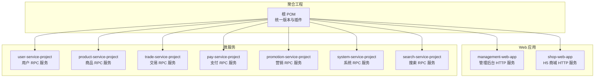
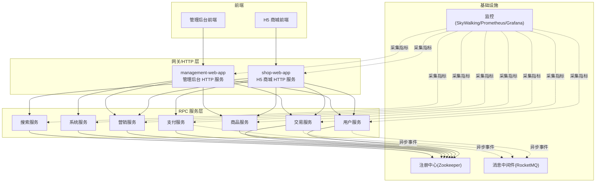
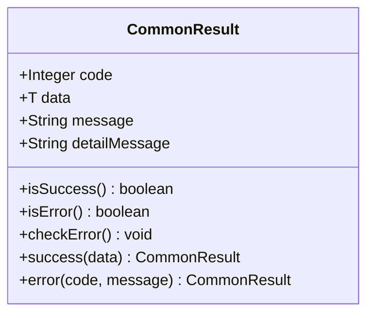
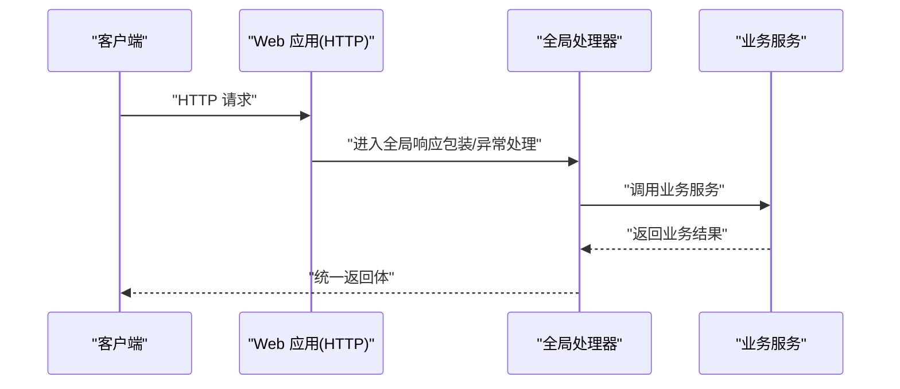
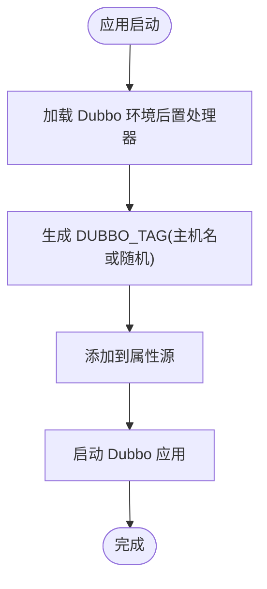
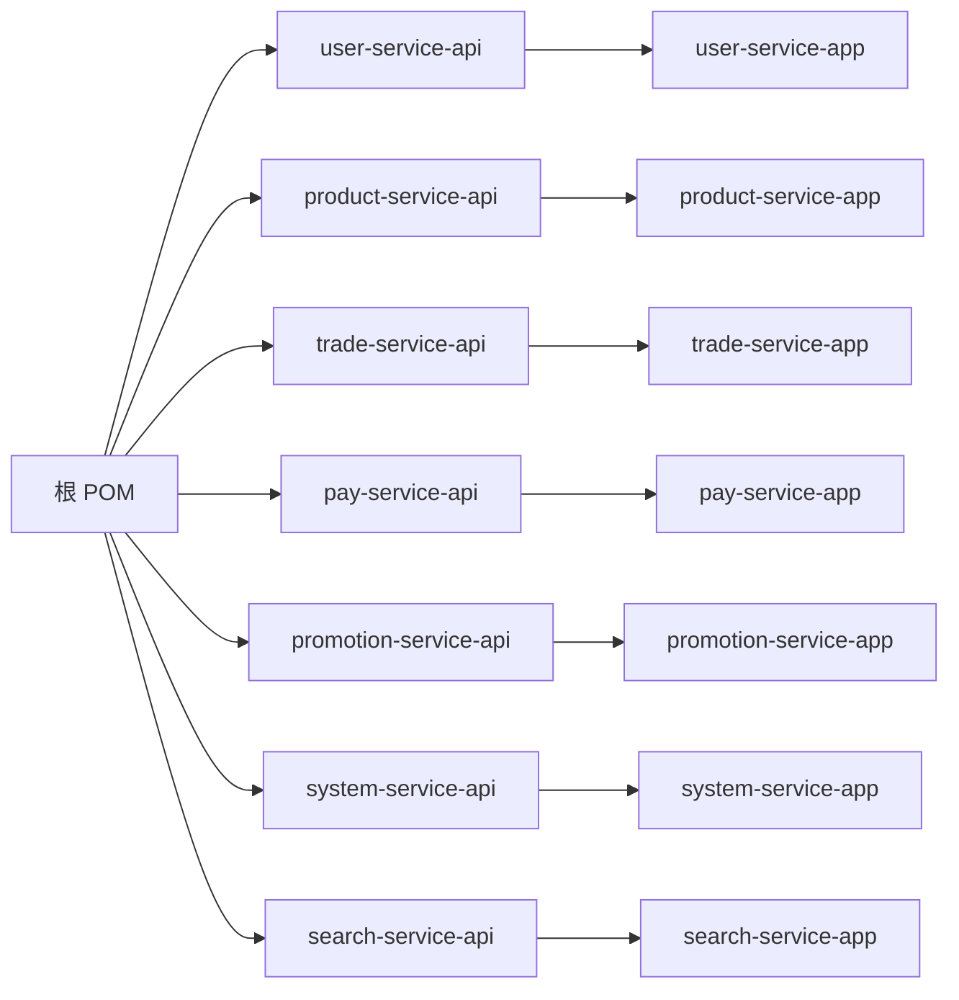

# 项目介绍

<cite>
**本文引用的文件**
- [README.md](file://README.md)
- [docs/README.md](file://docs/README.md)
- [docs/guides/功能列表/功能列表-H5 商城.md](file://docs/guides/功能列表/功能列表-H5 商城.md)
- [docs/guides/功能列表/功能列表-管理后台.md](file://docs/guides/功能列表/功能列表-管理后台.md)
- [docs/setup/quick-start.md](file://docs/setup/quick-start.md)
- [pom.xml](file://pom.xml)
- [common/common-framework/src/main/java/cn/iocoder/common/framework/vo/CommonResult.java](file://common/common-framework/src/main/java/cn/iocoder/common/framework/vo/CommonResult.java)
- [common/mall-spring-boot-starter-web/src/main/java/cn/iocoder/mall/web/config/CommonWebAutoConfiguration.java](file://common/mall-spring-boot-starter-web/src/main/java/cn/iocoder/mall/web/config/CommonWebAutoConfiguration.java)
- [common/mall-spring-boot-starter-dubbo/src/main/java/cn/iocoder/mall/dubbo/config/DubboEnvironmentPostProcessor.java](file://common/mall-spring-boot-starter-dubbo/src/main/java/cn/iocoder/mall/dubbo/config/DubboEnvironmentPostProcessor.java)
- [user-service-project/user-service-app/src/main/java/cn/iocoder/mall/userservice/UserServiceApplication.java](file://user-service-project/user-service-app/src/main/java/cn/iocoder/mall/userservice/UserServiceApplication.java)
- [product-service-project/product-service-app/src/main/java/cn/iocoder/mall/productservice/ProductServiceApplication.java](file://product-service-project/product-service-app/src/main/java/cn/iocoder/mall/productservice/ProductServiceApplication.java)
- [system-service-project/system-service-app/src/main/java/cn/iocoder/mall/systemservice/SystemServiceApplication.java](file://system-service-project/system-service-app/src/main/java/cn/iocoder/mall/systemservice/SystemServiceApplication.java)
- [shop-web-app/src/main/java/cn/iocoder/mall/shopweb/ShopWebApplication.java](file://shop-web-app/src/main/java/cn/iocoder/mall/shopweb/ShopWebApplication.java)
- [management-web-app/src/main/java/cn/iocoder/mall/managementweb/ManagementWebApplication.java](file://management-web-app/src/main/java/cn/iocoder/mall/managementweb/ManagementWebApplication.java)
- [user-service-project/user-service-api/src/main/java/cn/iocoder/mall/userservice/enums/UserErrorCodeConstants.java](file://user-service-project/user-service-api/src/main/java/cn/iocoder/mall/userservice/enums/UserErrorCodeConstants.java)
- [product-service-project/product-service-api/src/main/java/cn/iocoder/mall/productservice/enums/ProductErrorCodeConstants.java](file://product-service-project/product-service-api/src/main/java/cn/iocoder/mall/productservice/enums/ProductErrorCodeConstants.java)
</cite>

## 目录
1. [引言](#引言)
2. [项目结构](#项目结构)
3. [核心组件](#核心组件)
4. [架构总览](#架构总览)
5. [详细组件分析](#详细组件分析)
6. [依赖分析](#依赖分析)
7. [性能考量](#性能考量)
8. [故障排查指南](#故障排查指南)
9. [结论](#结论)
10. [附录](#附录)

## 引言
Onemall 是一个基于微服务思想构建的 B2C 电商实战项目，强调“以实战驱动学习”。项目通过真实业务场景，帮助开发者掌握微服务架构设计、服务拆分、RPC 通信、消息队列、分布式事务、监控与运维等关键技术点。项目提供 H5 商城前端与管理后台前端，以及围绕用户、商品、交易、支付、营销、系统、搜索等领域的多个后端微服务，形成完整的电商闭环。

- 项目定位：B2C 电商微服务实战项目，适合初学者与进阶开发者逐步深入理解微服务架构与工程化实践。
- 业务价值：通过真实电商场景（商品、订单、支付、营销、用户管理、搜索等），提供可运行、可扩展、可演进的工程样板。
- 开源理念：持续迭代、开放协作、社区共建，鼓励贡献者参与功能开发与文档完善。

章节来源
- [README.md:13-31](file://README.md#L13-L31)
- [README.md:32-53](file://README.md#L32-L53)

## 项目结构
项目采用多模块聚合工程组织，根 POM 定义了统一的版本与插件配置，各模块按“web 应用 + 服务实现”的分层组织：

- web 应用模块：对外提供 HTTP API，如管理后台 web 与 H5 商城 web。
- 服务模块：按领域拆分为用户、商品、交易、支付、营销、系统、搜索等微服务，每个服务包含 API 接口与 App 实现两层。
- 公共模块：封装通用框架、自动装配、异常与返回体、Dubbo 配置、Web 统一处理等基础设施。

图表来源
- [pom.xml:16-28](file://pom.xml#L16-L28)
- [README.md:129-139](file://README.md#L129-L139)

章节来源
- [pom.xml:16-28](file://pom.xml#L16-L28)
- [README.md:129-139](file://README.md#L129-L139)

## 核心组件
- 统一返回体与异常体系：通过通用返回体封装统一响应格式，结合错误码与异常体系，确保前后端交互的一致性与可诊断性。
- Web 统一处理：全局响应包装、异常处理、跨域过滤、消息转换器等，降低各服务重复配置成本。
- Dubbo 环境适配：自动注入路由标签等环境变量，提升本地开发与多实例部署的灵活性。
- 服务启动入口：每个服务模块均提供独立的 Spring Boot 启动类，便于本地调试与容器化部署。

章节来源
- [common/common-framework/src/main/java/cn/iocoder/common/framework/vo/CommonResult.java:17-155](file://common/common-framework/src/main/java/cn/iocoder/common/framework/vo/CommonResult.java#L17-L155)
- [common/mall-spring-boot-starter-web/src/main/java/cn/iocoder/mall/web/config/CommonWebAutoConfiguration.java:30-97](file://common/mall-spring-boot-starter-web/src/main/java/cn/iocoder/mall/web/config/CommonWebAutoConfiguration.java#L30-L97)
- [common/mall-spring-boot-starter-dubbo/src/main/java/cn/iocoder/mall/dubbo/config/DubboEnvironmentPostProcessor.java:21-67](file://common/mall-spring-boot-starter-dubbo/src/main/java/cn/iocoder/mall/dubbo/config/DubboEnvironmentPostProcessor.java#L21-L67)
- [user-service-project/user-service-app/src/main/java/cn/iocoder/mall/userservice/UserServiceApplication.java:6-13](file://user-service-project/user-service-app/src/main/java/cn/iocoder/mall/userservice/UserServiceApplication.java#L6-L13)
- [product-service-project/product-service-app/src/main/java/cn/iocoder/mall/productservice/ProductServiceApplication.java:6-13](file://product-service-project/product-service-app/src/main/java/cn/iocoder/mall/productservice/ProductServiceApplication.java#L6-L13)
- [system-service-project/system-service-app/src/main/java/cn/iocoder/mall/systemservice/SystemServiceApplication.java:6-13](file://system-service-project/system-service-app/src/main/java/cn/iocoder/mall/systemservice/SystemServiceApplication.java#L6-L13)
- [shop-web-app/src/main/java/cn/iocoder/mall/shopweb/ShopWebApplication.java:6-13](file://shop-web-app/src/main/java/cn/iocoder/mall/shopweb/ShopWebApplication.java#L6-L13)
- [management-web-app/src/main/java/cn/iocoder/mall/managementweb/ManagementWebApplication.java:6-13](file://management-web-app/src/main/java/cn/iocoder/mall/managementweb/ManagementWebApplication.java#L6-L13)

## 架构总览
系统采用“双端 + 多微服务”的架构：H5 商城前端与管理后台前端分别对接各自的 Web 应用；Web 应用通过 RPC 调用各微服务，微服务之间通过注册中心与消息中间件协同工作；系统还配套监控与运维平台，支撑可观测性与稳定性。

图表来源
- [README.md:107-126](file://README.md#L107-L126)
- [README.md:141-206](file://README.md#L141-L206)

章节来源
- [README.md:107-126](file://README.md#L107-L126)
- [README.md:141-206](file://README.md#L141-L206)

## 详细组件分析

### H5 商城前端与管理后台
- H5 商城：提供首页、商品搜索与列表、商品详情、下单、购物车、收货地址、支付、订单管理、用户登录注册等核心功能。
- 管理后台：提供商品管理、订单管理、营销管理、会员管理、系统管理等后台运营能力。

章节来源
- [docs/guides/功能列表/功能列表-H5 商城.md:6-35](file://docs/guides/功能列表/功能列表-H5 商城.md#L6-L35)
- [docs/guides/功能列表/功能列表-管理后台.md:17-61](file://docs/guides/功能列表/功能列表-管理后台.md#L17-L61)
- [README.md:46-53](file://README.md#L46-L53)

### 微服务模块与职责
- 用户服务：负责用户信息、地址、手机验证码等用户域能力，提供统一错误码段与 RPC 接口。
- 商品服务：负责商品分类、SPU/SKU、品牌、属性等商品域能力，提供统一错误码段与 RPC 接口。
- 交易服务：负责订单、售后、物流等交易域能力。
- 支付服务：负责支付、退款等支付域能力。
- 营销服务：负责活动、优惠券、推荐等营销域能力。
- 系统服务：负责员工、角色、权限、数据字典、短信等系统域能力。
- 搜索服务：负责商品搜索、索引维护等搜索域能力。

章节来源
- [user-service-project/user-service-api/src/main/java/cn/iocoder/mall/userservice/enums/UserErrorCodeConstants.java:10-29](file://user-service-project/user-service-api/src/main/java/cn/iocoder/mall/userservice/enums/UserErrorCodeConstants.java#L10-L29)
- [product-service-project/product-service-api/src/main/java/cn/iocoder/mall/productservice/enums/ProductErrorCodeConstants.java:10-37](file://product-service-project/product-service-api/src/main/java/cn/iocoder/mall/productservice/enums/ProductErrorCodeConstants.java#L10-L37)
- [README.md:119-125](file://README.md#L119-L125)

### Web 应用与服务启动
- Web 应用：分别提供 H5 商城与管理后台的 HTTP API，承担请求接入、参数校验、统一返回与异常处理。
- 服务启动：每个微服务与 Web 应用均提供独立的 Spring Boot 启动类，便于本地调试与容器化部署。

章节来源
- [shop-web-app/src/main/java/cn/iocoder/mall/shopweb/ShopWebApplication.java:6-13](file://shop-web-app/src/main/java/cn/iocoder/mall/shopweb/ShopWebApplication.java#L6-L13)
- [management-web-app/src/main/java/cn/iocoder/mall/managementweb/ManagementWebApplication.java:6-13](file://management-web-app/src/main/java/cn/iocoder/mall/managementweb/ManagementWebApplication.java#L6-L13)
- [user-service-project/user-service-app/src/main/java/cn/iocoder/mall/userservice/UserServiceApplication.java:6-13](file://user-service-project/user-service-app/src/main/java/cn/iocoder/mall/userservice/UserServiceApplication.java#L6-L13)
- [product-service-project/product-service-app/src/main/java/cn/iocoder/mall/productservice/ProductServiceApplication.java:6-13](file://product-service-project/product-service-app/src/main/java/cn/iocoder/mall/productservice/ProductServiceApplication.java#L6-L13)
- [system-service-project/system-service-app/src/main/java/cn/iocoder/mall/systemservice/SystemServiceApplication.java:6-13](file://system-service-project/system-service-app/src/main/java/cn/iocoder/mall/systemservice/SystemServiceApplication.java#L6-L13)

### 统一返回体与异常体系
- 统一返回体：封装 code、data、message、detailMessage 字段，提供 success/error/checkError 等便捷方法，保证前后端交互一致性。
- 异常体系：与错误码配合，区分全局异常与业务异常，便于统一处理与前端展示。

图表来源
- [common/common-framework/src/main/java/cn/iocoder/common/framework/vo/CommonResult.java:17-155](file://common/common-framework/src/main/java/cn/iocoder/common/framework/vo/CommonResult.java#L17-L155)

章节来源
- [common/common-framework/src/main/java/cn/iocoder/common/framework/vo/CommonResult.java:17-155](file://common/common-framework/src/main/java/cn/iocoder/common/framework/vo/CommonResult.java#L17-L155)

### Web 统一处理与拦截器
- 全局响应包装与异常处理：统一输出格式，屏蔽底层异常细节。
- 访问日志拦截器：可选启用，记录访问日志并上报系统服务。
- 跨域过滤器：统一处理跨域请求。
- JSON 转换器：使用 Fastjson，提升兼容性与性能。

图表来源
- [common/mall-spring-boot-starter-web/src/main/java/cn/iocoder/mall/web/config/CommonWebAutoConfiguration.java:36-94](file://common/mall-spring-boot-starter-web/src/main/java/cn/iocoder/mall/web/config/CommonWebAutoConfiguration.java#L36-L94)

章节来源
- [common/mall-spring-boot-starter-web/src/main/java/cn/iocoder/mall/web/config/CommonWebAutoConfiguration.java:30-97](file://common/mall-spring-boot-starter-web/src/main/java/cn/iocoder/mall/web/config/CommonWebAutoConfiguration.java#L30-L97)

### Dubbo 环境适配
- 环境变量注入：自动生成 Dubbo 路由标签，便于本地开发与多实例部署。
- 配置优先级：通过环境后置处理器将配置注入到属性源，确保启动时生效。

图表来源
- [common/mall-spring-boot-starter-dubbo/src/main/java/cn/iocoder/mall/dubbo/config/DubboEnvironmentPostProcessor.java:34-64](file://common/mall-spring-boot-starter-dubbo/src/main/java/cn/iocoder/mall/dubbo/config/DubboEnvironmentPostProcessor.java#L34-L64)

章节来源
- [common/mall-spring-boot-starter-dubbo/src/main/java/cn/iocoder/mall/dubbo/config/DubboEnvironmentPostProcessor.java:21-67](file://common/mall-spring-boot-starter-dubbo/src/main/java/cn/iocoder/mall/dubbo/config/DubboEnvironmentPostProcessor.java#L21-L67)

## 依赖分析
- 模块依赖：根 POM 聚合所有子模块，统一管理版本与插件；各服务模块遵循“API + APP”分层，避免循环依赖。
- 外部依赖：注册中心（Zookeeper）、消息中间件（RocketMQ）、监控（SkyWalking/Prometheus/Grafana）、搜索引擎（Elasticsearch）等基础设施贯穿系统。
- 启动顺序：系统服务、用户服务、商品服务、支付服务、营销服务、交易服务、搜索服务，确保依赖服务可用后再启动。

图表来源
- [pom.xml:16-28](file://pom.xml#L16-L28)

章节来源
- [pom.xml:16-28](file://pom.xml#L16-L28)
- [docs/setup/quick-start.md:156-167](file://docs/setup/quick-start.md#L156-L167)

## 性能考量
- 服务拆分粒度：围绕高内聚低耦合原则划分服务，减少跨服务调用开销。
- 缓存与搜索：Redis 与 Elasticsearch 在后续版本中引入，用于热点数据缓存与全文检索加速。
- 消息解耦：通过 RocketMQ 异步处理订单、支付等耗时流程，提升吞吐与可用性。
- 监控与告警：SkyWalking、Prometheus/Grafana 提供链路追踪与指标可视化，辅助性能优化与问题定位。

章节来源
- [README.md:163-167](file://README.md#L163-L167)
- [README.md:185-199](file://README.md#L185-L199)

## 故障排查指南
- 启动失败：检查各服务的注册中心、消息中间件、数据库等外部依赖是否正常；确认启动顺序与端口占用。
- RPC 调用异常：核对服务名称、版本与路由标签；确认注册中心可见性与网络连通性。
- 统一异常处理：利用统一返回体与异常体系，快速定位错误码与错误信息；必要时查看详细错误信息字段。
- 日志与监控：通过 SkyWalking 查看链路调用情况，通过 Grafana 查看指标趋势，定位性能瓶颈与异常峰值。

章节来源
- [docs/setup/quick-start.md:150-167](file://docs/setup/quick-start.md#L150-L167)
- [common/common-framework/src/main/java/cn/iocoder/common/framework/vo/CommonResult.java:127-152](file://common/common-framework/src/main/java/cn/iocoder/common/framework/vo/CommonResult.java#L127-L152)

## 结论
Onemall 以实战为导向，围绕 B2C 电商场景构建了完整的微服务体系，涵盖前端、HTTP 层、RPC 服务层与基础设施。通过统一返回体、Web 统一处理、Dubbo 环境适配与完善的错误码体系，项目在工程化与可维护性方面提供了良好示范。建议初学者从 H5 商城与管理后台入手，逐步理解各微服务职责与交互关系，并结合监控与运维平台提升系统可观测性与稳定性。

## 附录
- 快速开始：参考搭建调试环境指南，完成数据库、注册中心、消息中间件与搜索引擎的安装与配置，按顺序启动各服务与前端项目。
- 功能清单：参考 H5 商城与管理后台的功能列表，明确当前完成与待认领任务，按需参与开发。

章节来源
- [docs/README.md:2-12](file://docs/README.md#L2-L12)
- [docs/setup/quick-start.md:1-191](file://docs/setup/quick-start.md#L1-L191)
- [docs/guides/功能列表/功能列表-H5 商城.md:1-35](file://docs/guides/功能列表/功能列表-H5 商城.md#L1-L35)
- [docs/guides/功能列表/功能列表-管理后台.md:1-61](file://docs/guides/功能列表/功能列表-管理后台.md#L1-L61)