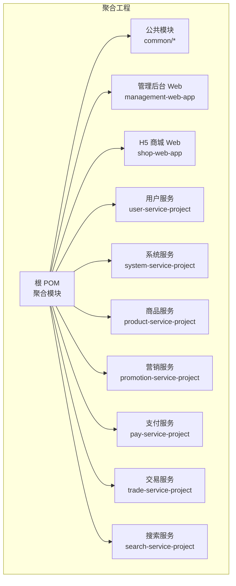
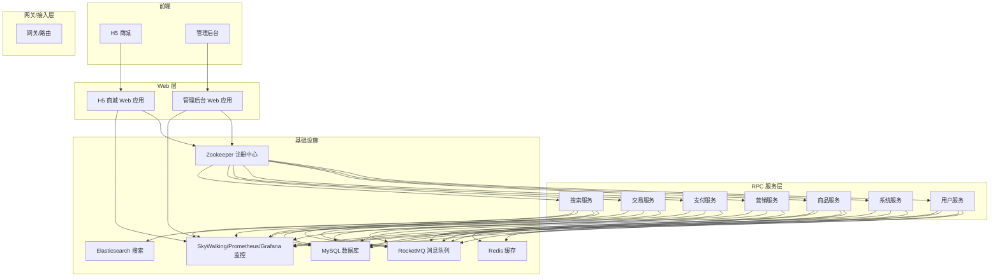
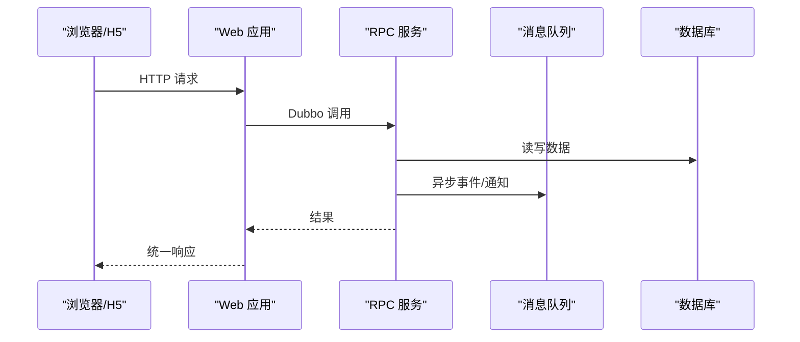
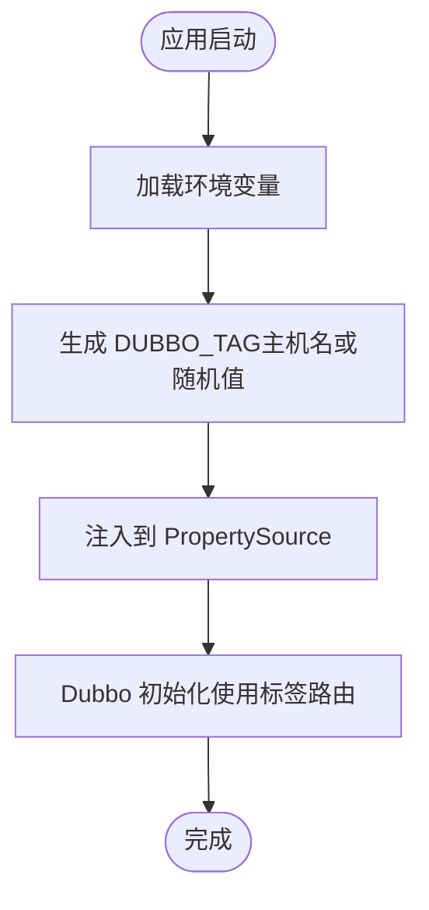
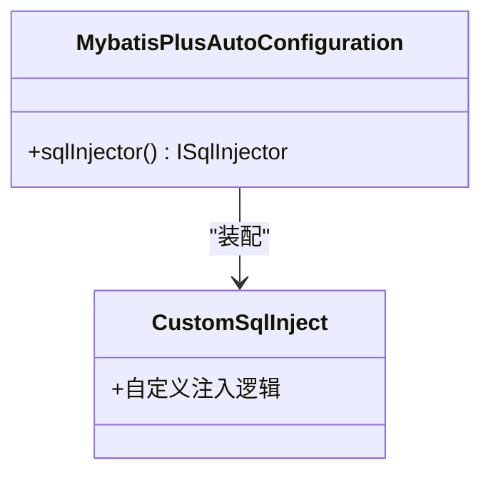
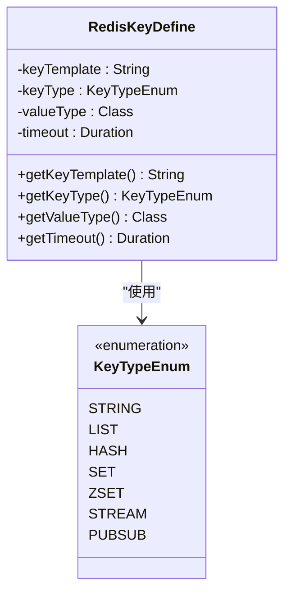
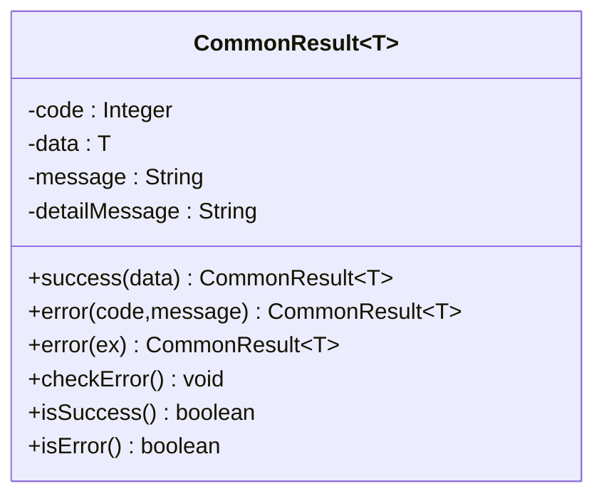
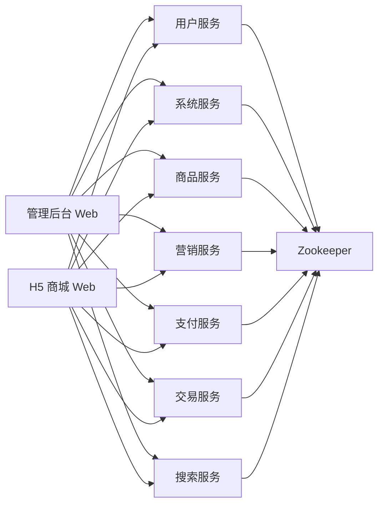

# 项目概述

<cite>
**本文引用的文件**
- [README.md](file://README.md)
- [pom.xml](file://pom.xml)
- [docs/README.md](file://docs/README.md)
- [docs/guides/功能列表/功能列表-H5 商城.md](file://docs/guides/功能列表/功能列表-H5 商城.md)
- [docs/guides/功能列表/功能列表-管理后台.md](file://docs/guides/功能列表/功能列表-管理后台.md)
- [docs/setup/quick-start.md](file://docs/setup/quick-start.md)
- [common/common-framework/src/main/java/cn/iocoder/common/framework/vo/CommonResult.java](file://common/common-framework/src/main/java/cn/iocoder/common/framework/vo/CommonResult.java)
- [common/mall-spring-boot-starter-dubbo/src/main/java/cn/iocoder/mall/dubbo/config/DubboEnvironmentPostProcessor.java](file://common/mall-spring-boot-starter-dubbo/src/main/java/cn/iocoder/mall/dubbo/config/DubboEnvironmentPostProcessor.java)
- [common/mall-spring-boot-starter-mybatis/src/main/java/cn/iocoder/mall/mybatis/config/MybatisPlusAutoConfiguration.java](file://common/mall-spring-boot-starter-mybatis/src/main/java/cn/iocoder/mall/mybatis/config/MybatisPlusAutoConfiguration.java)
- [common/mall-spring-boot-starter-redis/src/main/java/cn/iocoder/mall/redis/core/RedisKeyDefine.java](file://common/mall-spring-boot-starter-redis/src/main/java/cn/iocoder/mall/redis/core/RedisKeyDefine.java)
- [user-service-project/user-service-api/src/main/java/cn/iocoder/mall/userservice/enums/UserErrorCodeConstants.java](file://user-service-project/user-service-api/src/main/java/cn/iocoder/mall/userservice/enums/UserErrorCodeConstants.java)
- [user-service-project/user-service-app/src/main/java/cn/iocoder/mall/userservice/UserServiceApplication.java](file://user-service-project/user-service-app/src/main/java/cn/iocoder/mall/userservice/UserServiceApplication.java)
- [system-service-project/system-service-app/src/main/java/cn/iocoder/mall/systemservice/SystemServiceApplication.java](file://system-service-project/system-service-app/src/main/java/cn/iocoder/mall/systemservice/SystemServiceApplication.java)
- [shop-web-app/src/main/java/cn/iocoder/mall/shopweb/ShopWebApplication.java](file://shop-web-app/src/main/java/cn/iocoder/mall/shopweb/ShopWebApplication.java)
- [management-web-app/src/main/java/cn/iocoder/mall/managementweb/ManagementWebApplication.java](file://management-web-app/src/main/java/cn/iocoder/mall/managementweb/ManagementWebApplication.java)
</cite>

## 目录
1. [引言](#引言)
2. [项目结构](#项目结构)
3. [核心组件](#核心组件)
4. [架构总览](#架构总览)
5. [详细组件分析](#详细组件分析)
6. [依赖分析](#依赖分析)
7. [性能考量](#性能考量)
8. [故障排查指南](#故障排查指南)
9. [结论](#结论)
10. [附录](#附录)

## 引言
本项目是一个面向 B2C 电商场景的微服务实战项目，围绕“Spring Cloud Alibaba”技术栈构建，目标是通过真实业务驱动，帮助开发者系统掌握微服务架构设计与落地实践。项目提供 H5 商城前端与管理后台前端两大入口，后端以多租户式微服务模块划分，覆盖用户、商品、营销、支付、交易、搜索、系统等核心域，形成完整的电商闭环。

项目强调“边学边做”，配套安装调试指南、演示地址与中间件控制台，便于快速搭建开发与演示环境；同时持续迭代，逐步引入配置中心、网关、Sentinel 等治理能力，支撑高并发与高可用。

章节来源
- [README.md:11-31](file://README.md#L11-L31)
- [README.md:107-126](file://README.md#L107-L126)

## 项目结构
项目采用多模块聚合工程组织，根 POM 聚合了公共模块与各微服务模块。整体分为三层：
- Web 层：对外 HTTP API 提供者，如管理后台与 H5 商城。
- 服务层：RPC 服务实现，按领域拆分，如用户、商品、营销、支付、交易、搜索、系统等。
- 公共层：通用框架、自动装配 Starter、安全注解、错误码体系等。

图表来源
- [pom.xml:16-28](file://pom.xml#L16-L28)

章节来源
- [pom.xml:16-28](file://pom.xml#L16-L28)
- [docs/README.md:2-12](file://docs/README.md#L2-L12)

## 核心组件
- 统一返回体与异常体系：提供统一的响应封装与异常转换，确保前后端交互一致、错误语义明确。
- Dubbo 自动装配与路由标签：通过环境后置处理器自动生成路由标签，提升本地开发与灰度路由的灵活性。
- MyBatis-Plus 自动装配：提供自定义 SQL 注入器，增强通用 CRUD 与批量操作能力。
- Redis Key 定义：抽象 Redis Key 模板、类型与过期策略，规范缓存命名与生命周期管理。
- 领域错误码常量：为各服务定义独立段位的错误码，避免冲突并提升可观测性与可维护性。

章节来源
- [common/common-framework/src/main/java/cn/iocoder/common/framework/vo/CommonResult.java:127-152](file://common/common-framework/src/main/java/cn/iocoder/common/framework/vo/CommonResult.java#L127-L152)
- [common/mall-spring-boot-starter-dubbo/src/main/java/cn/iocoder/mall/dubbo/config/DubboEnvironmentPostProcessor.java:16-45](file://common/mall-spring-boot-starter-dubbo/src/main/java/cn/iocoder/mall/dubbo/config/DubboEnvironmentPostProcessor.java#L16-L45)
- [common/mall-spring-boot-starter-mybatis/src/main/java/cn/iocoder/mall/mybatis/config/MybatisPlusAutoConfiguration.java:14-23](file://common/mall-spring-boot-starter-mybatis/src/main/java/cn/iocoder/mall/mybatis/config/MybatisPlusAutoConfiguration.java#L14-L23)
- [common/mall-spring-boot-starter-redis/src/main/java/cn/iocoder/mall/redis/core/RedisKeyDefine.java:8-71](file://common/mall-spring-boot-starter-redis/src/main/java/cn/iocoder/mall/redis/core/RedisKeyDefine.java#L8-L71)
- [user-service-project/user-service-api/src/main/java/cn/iocoder/mall/userservice/enums/UserErrorCodeConstants.java:10-29](file://user-service-project/user-service-api/src/main/java/cn/iocoder/mall/userservice/enums/UserErrorCodeConstants.java#L10-L29)

## 架构总览
系统采用“Web + RPC 服务”的分层架构，Web 层负责对外 HTTP 接口，服务层通过 Dubbo 提供 RPC 能力，消息队列 RocketMQ 承载异步解耦与削峰填谷，Zookeeper 作为注册中心，结合监控体系（SkyWalking、Prometheus/Grafana）实现全链路观测。

图表来源
- [README.md:141-167](file://README.md#L141-L167)
- [docs/setup/quick-start.md:50-92](file://docs/setup/quick-start.md#L50-L92)

## 详细组件分析

### Web 应用与启动类
- 管理后台 Web 应用与 H5 商城 Web 应用分别提供对外 HTTP API，承载用户与管理员的交互入口。
- 各 Web 应用通过 Spring Boot 启动类暴露服务，配合自动装配 Starter 实现统一配置与拦截。

图表来源
- [shop-web-app/src/main/java/cn/iocoder/mall/shopweb/ShopWebApplication.java:6-13](file://shop-web-app/src/main/java/cn/iocoder/mall/shopweb/ShopWebApplication.java#L6-L13)
- [management-web-app/src/main/java/cn/iocoder/mall/managementweb/ManagementWebApplication.java:6-13](file://management-web-app/src/main/java/cn/iocoder/mall/managementweb/ManagementWebApplication.java#L6-L13)

章节来源
- [shop-web-app/src/main/java/cn/iocoder/mall/shopweb/ShopWebApplication.java:6-13](file://shop-web-app/src/main/java/cn/iocoder/mall/shopweb/ShopWebApplication.java#L6-L13)
- [management-web-app/src/main/java/cn/iocoder/mall/managementweb/ManagementWebApplication.java:6-13](file://management-web-app/src/main/java/cn/iocoder/mall/managementweb/ManagementWebApplication.java#L6-L13)

### Dubbo 配置与路由标签
- 通过环境后置处理器在启动时生成 DUBBO_TAG，用于本地开发环境下的服务路由与灰度分流，避免硬编码配置带来的维护成本。

图表来源
- [common/mall-spring-boot-starter-dubbo/src/main/java/cn/iocoder/mall/dubbo/config/DubboEnvironmentPostProcessor.java:34-45](file://common/mall-spring-boot-starter-dubbo/src/main/java/cn/iocoder/mall/dubbo/config/DubboEnvironmentPostProcessor.java#L34-L45)

章节来源
- [common/mall-spring-boot-starter-dubbo/src/main/java/cn/iocoder/mall/dubbo/config/DubboEnvironmentPostProcessor.java:16-66](file://common/mall-spring-boot-starter-dubbo/src/main/java/cn/iocoder/mall/dubbo/config/DubboEnvironmentPostProcessor.java#L16-L66)

### MyBatis-Plus 自动装配
- 自定义 SQL 注入器 Bean 在缺少时自动装配，统一扩展通用 SQL 能力，降低重复代码与维护成本。

图表来源
- [common/mall-spring-boot-starter-mybatis/src/main/java/cn/iocoder/mall/mybatis/config/MybatisPlusAutoConfiguration.java:12-23](file://common/mall-spring-boot-starter-mybatis/src/main/java/cn/iocoder/mall/mybatis/config/MybatisPlusAutoConfiguration.java#L12-L23)

章节来源
- [common/mall-spring-boot-starter-mybatis/src/main/java/cn/iocoder/mall/mybatis/config/MybatisPlusAutoConfiguration.java:12-23](file://common/mall-spring-boot-starter-mybatis/src/main/java/cn/iocoder/mall/mybatis/config/MybatisPlusAutoConfiguration.java#L12-L23)

### Redis Key 定义
- 通过 Key 模板、类型枚举与过期时间，统一缓存命名规范，支持多种数据结构，便于横向扩展与治理。

图表来源
- [common/mall-spring-boot-starter-redis/src/main/java/cn/iocoder/mall/redis/core/RedisKeyDefine.java:8-71](file://common/mall-spring-boot-starter-redis/src/main/java/cn/iocoder/mall/redis/core/RedisKeyDefine.java#L8-L71)

章节来源
- [common/mall-spring-boot-starter-redis/src/main/java/cn/iocoder/mall/redis/core/RedisKeyDefine.java:8-71](file://common/mall-spring-boot-starter-redis/src/main/java/cn/iocoder/mall/redis/core/RedisKeyDefine.java#L8-L71)

### 统一返回体与异常体系
- 统一返回体封装 code、message、detailMessage 与 data，提供 success/error/checkError 等便捷方法，保证前后端契约一致。
- 异常体系支持全局异常与业务异常的自动转换，便于上层处理与日志追踪。

图表来源
- [common/common-framework/src/main/java/cn/iocoder/common/framework/vo/CommonResult.java:17-155](file://common/common-framework/src/main/java/cn/iocoder/common/framework/vo/CommonResult.java#L17-L155)

章节来源
- [common/common-framework/src/main/java/cn/iocoder/common/framework/vo/CommonResult.java:17-155](file://common/common-framework/src/main/java/cn/iocoder/common/framework/vo/CommonResult.java#L17-L155)

### 领域错误码常量（示例：用户服务）
- 为用户服务定义独立段位的错误码，涵盖短信验证码、地址、用户信息等模块，避免跨服务冲突并提升可观测性。

章节来源
- [user-service-project/user-service-api/src/main/java/cn/iocoder/mall/userservice/enums/UserErrorCodeConstants.java:10-29](file://user-service-project/user-service-api/src/main/java/cn/iocoder/mall/userservice/enums/UserErrorCodeConstants.java#L10-L29)

### 启动顺序与环境准备
- 后端启动顺序建议：System → User → Product → Pay → Promotion → Trade → Search，便于依赖与外部对接（如支付网关）。
- 开发环境需准备 MySQL、Zookeeper、RocketMQ、Elasticsearch 等中间件，并按 quick-start 指南完成配置。

章节来源
- [docs/setup/quick-start.md:150-167](file://docs/setup/quick-start.md#L150-L167)
- [docs/setup/quick-start.md:25-92](file://docs/setup/quick-start.md#L25-L92)

## 依赖分析
- 模块间依赖：Web 应用依赖各 RPC 服务；RPC 服务之间通过 Dubbo 调用与 RocketMQ 解耦；共同依赖 Zookeeper 注册中心与数据库。
- 外部依赖：Spring Boot、MySQL、MyBatis-Plus、Zookeeper、RocketMQ、Elasticsearch、SkyWalking、Prometheus/Grafana 等。

图表来源
- [README.md:109-126](file://README.md#L109-L126)

章节来源
- [README.md:109-126](file://README.md#L109-L126)

## 性能考量
- 异步解耦：通过 RocketMQ 承载下单、发货、退款等耗时流程，降低同步调用延迟，提升吞吐。
- 缓存策略：Redis 作为热点数据缓存，结合 Key 定义规范，控制过期与命中率，缓解数据库压力。
- 数据库优化：MyBatis-Plus 提供高效 CRUD 与批量操作，结合分页与索引设计，减少慢查询。
- 监控观测：SkyWalking 全链路追踪、Prometheus 指标采集、Grafana 可视化，辅助容量规划与性能瓶颈定位。

章节来源
- [README.md:185-199](file://README.md#L185-L199)
- [common/mall-spring-boot-starter-redis/src/main/java/cn/iocoder/mall/redis/core/RedisKeyDefine.java:48-69](file://common/mall-spring-boot-starter-redis/src/main/java/cn/iocoder/mall/redis/core/RedisKeyDefine.java#L48-L69)
- [common/mall-spring-boot-starter-mybatis/src/main/java/cn/iocoder/mall/mybatis/config/MybatisPlusAutoConfiguration.java:18-22](file://common/mall-spring-boot-starter-mybatis/src/main/java/cn/iocoder/mall/mybatis/config/MybatisPlusAutoConfiguration.java#L18-L22)

## 故障排查指南
- 启动失败排查：检查 Zookeeper 注册中心连通性、RocketMQ NameServer 地址、数据库连接参数与初始化 SQL。
- RPC 调用异常：确认服务版本、路由标签（DUBBO_TAG）、接口签名与参数一致性。
- 缓存问题：核对 Redis Key 模板、过期时间与数据类型，避免误用导致的脏读或雪崩。
- 日志与监控：结合 SkyWalking 跟踪链路、Prometheus 指标与 Grafana 仪表盘定位异常节点与峰值时段。

章节来源
- [docs/setup/quick-start.md:25-92](file://docs/setup/quick-start.md#L25-L92)
- [common/mall-spring-boot-starter-dubbo/src/main/java/cn/iocoder/mall/dubbo/config/DubboEnvironmentPostProcessor.java:34-45](file://common/mall-spring-boot-starter-dubbo/src/main/java/cn/iocoder/mall/dubbo/config/DubboEnvironmentPostProcessor.java#L34-L45)

## 结论
本项目以电商真实业务为载体，采用 Spring Cloud Alibaba 生态，构建了清晰的微服务分层与模块化架构。通过统一返回体、自动装配 Starter、错误码体系与监控治理，既降低了学习门槛，也为高并发场景提供了可扩展的工程化基础。建议在开发过程中遵循模块边界与接口契约，逐步引入配置中心、网关与流量治理能力，持续完善测试与发布流程。

## 附录
- 功能概览（H5 商城与管理后台）：详见功能列表文档，覆盖首页、商品、订单、营销、用户等核心功能点。
- 快速开始：包含 MySQL、Zookeeper、RocketMQ、Elasticsearch 等中间件安装与配置指引，以及后端与前端启动顺序。

章节来源
- [docs/guides/功能列表/功能列表-H5 商城.md:1-35](file://docs/guides/功能列表/功能列表-H5 商城.md#L1-L35)
- [docs/guides/功能列表/功能列表-管理后台.md:1-61](file://docs/guides/功能列表/功能列表-管理后台.md#L1-L61)
- [docs/setup/quick-start.md:1-191](file://docs/setup/quick-start.md#L1-L191)