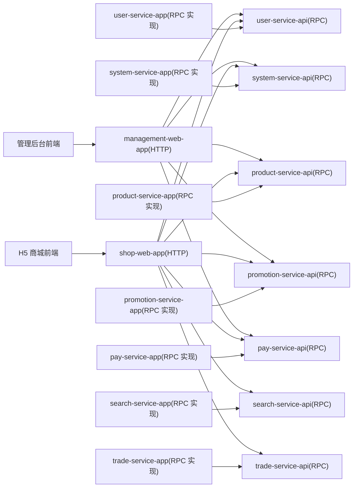
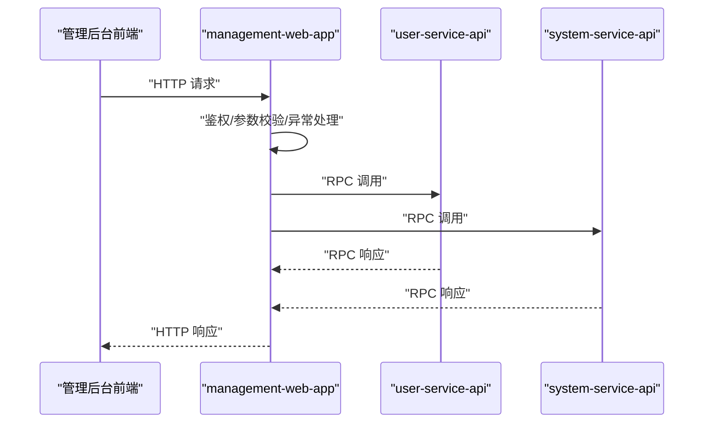
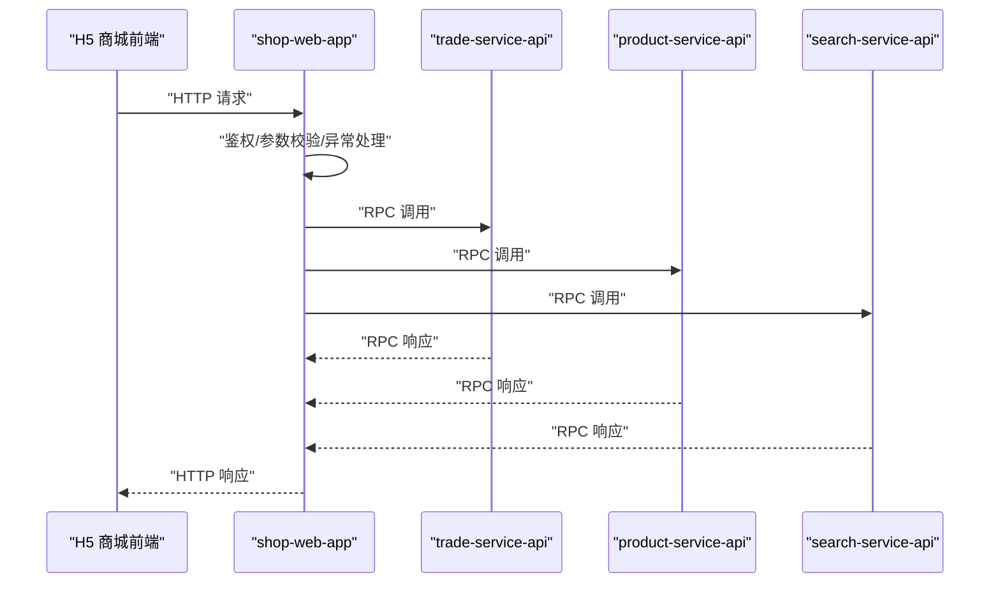
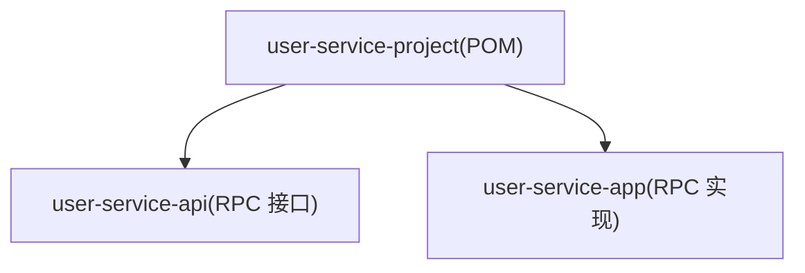
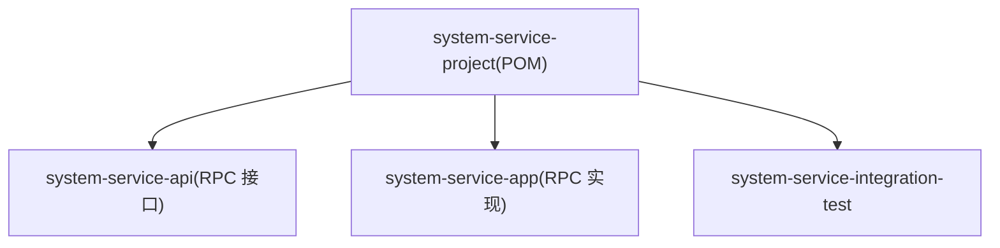
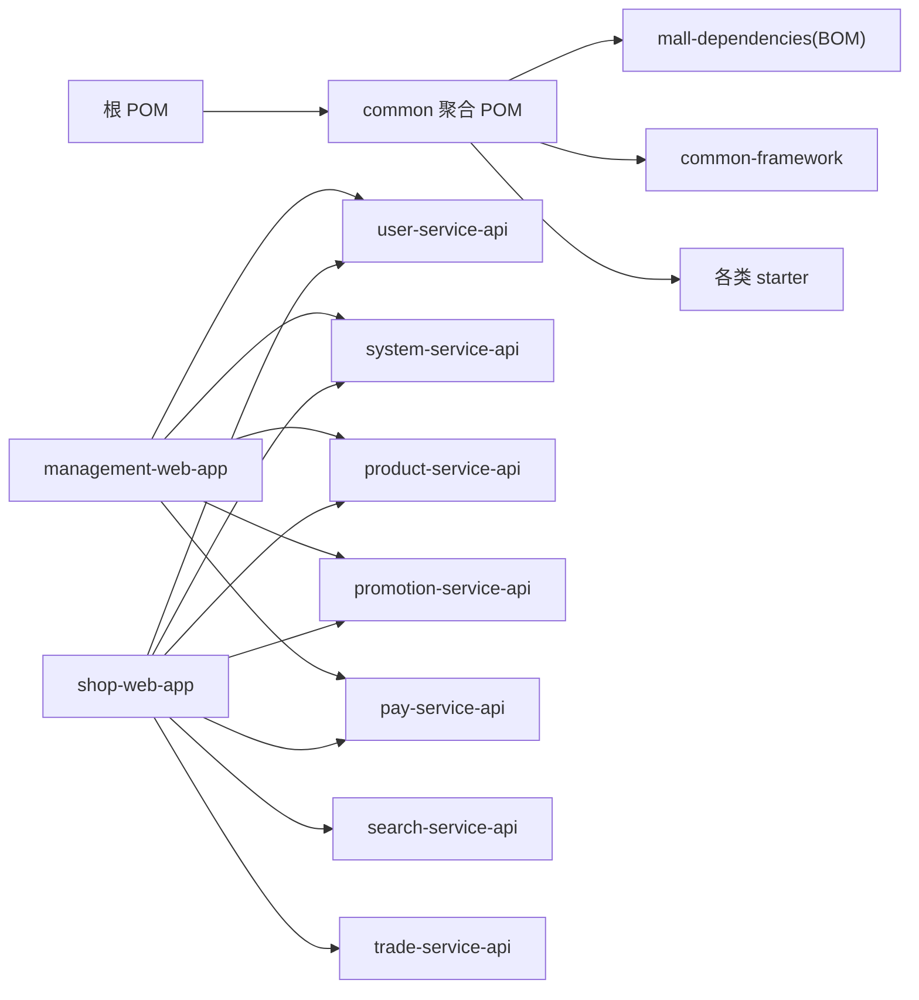

# 项目结构

<cite>
**本文引用的文件**
- [根 POM](file://pom.xml)
- [公共模块聚合 POM](file://common/pom.xml)
- [公共框架模块 POM](file://common/common-framework/pom.xml)
- [管理后台 Web 应用 POM](file://management-web-app/pom.xml)
- [商城 Web 应用 POM](file://shop-web-app/pom.xml)
- [用户服务项目 POM](file://user-service-project/pom.xml)
- [系统服务项目 POM](file://system-service-project/pom.xml)
- [支付服务项目 POM](file://pay-service-project/pom.xml)
- [商品服务项目 POM](file://product-service-project/pom.xml)
- [营销服务项目 POM](file://promotion-service-project/pom.xml)
- [交易服务项目 POM](file://trade-service-project/pom.xml)
- [管理后台应用入口](file://management-web-app/src/main/java/cn/iocoder/mall/managementweb/ManagementWebApplication.java)
- [商城应用入口](file://shop-web-app/src/main/java/cn/iocoder/mall/shopweb/ShopWebApplication.java)
- [用户服务应用入口](file://user-service-project/user-service-app/src/main/java/cn/iocoder/mall/userservice/UserServiceApplication.java)
- [系统服务应用入口](file://system-service-project/system-service-app/src/main/java/cn/iocoder/mall/systemservice/SystemServiceApplication.java)
- [README](file://README.md)
</cite>

## 目录
1. [引言](#引言)
2. [项目结构概览](#项目结构概览)
3. [核心模块与职责](#核心模块与职责)
4. [架构总览](#架构总览)
5. [详细组件分析](#详细组件分析)
6. [依赖关系分析](#依赖关系分析)
7. [性能与扩展性考量](#性能与扩展性考量)
8. [故障排查指南](#故障排查指南)
9. [结论](#结论)
10. [附录：学习路径与导航](#附录学习路径与导航)

## 引言
本文件面向 Onemall 项目的开发者与维护者，系统化阐述项目的模块化组织方式与分层架构。项目采用“后端三层 + 前端双端”的标准工程化布局：web-app 对外提供 HTTP 接口，service-api 对内提供 RPC 接口，service-app 提供业务实现；前端分别对接管理后台与 H5 商城。本文将从模块划分、职责边界、依赖关系、交互流程、性能与可运维性等方面进行深入解析，并给出学习路径与导航建议。

## 项目结构概览
- 根 POM 作为多模块聚合根，统一版本与插件配置，声明所有子模块。
- common 聚合公共能力（框架、starter、安全、MyBatis、Dubbo、RocketMQ 等），被各业务模块复用。
- web-app（管理后台与商城）：对外 HTTP 接口层，负责鉴权、参数校验、异常处理、调用 RPC 服务并返回结果。
- service-project（用户、系统、商品、营销、搜索、交易、支付）：按领域拆分的微服务，每项包含 service-api（RPC 接口）与 service-app（实现）。
- 前端项目（独立仓库）：管理后台与 H5 商城，分别通过 HTTP 与后端交互。

```mermaid
graph TB
subgraph "根工程"
ROOT["根 POM<br/>聚合所有模块"]
end
subgraph "公共能力(common)"
COMMON["common 聚合 POM"]
FW["common-framework"]
SWAGGER["starter-swagger"]
WEB["starter-web"]
SECURITY_ADMIN["starter-security-admin"]
SECURITY_USER["starter-security-user"]
DUBBO["starter-dubbo"]
MYBATIS["starter-mybatis"]
ROCKETMQ["starter-rocketmq"]
REDIS["starter-redis"]
end
subgraph "Web 应用"
MGMT["management-web-app"]
SHOP["shop-web-app"]
end
subgraph "服务项目"
USER["user-service-project"]
SYS["system-service-project"]
PRODUCT["product-service-project"]
PROMO["promotion-service-project"]
SEARCH["search-service-project"]
TRADE["trade-service-project"]
PAY["pay-service-project"]
end
ROOT --> COMMON
ROOT --> MGMT
ROOT --> SHOP
ROOT --> USER
ROOT --> SYS
ROOT --> PRODUCT
ROOT --> PROMO
ROOT --> SEARCH
ROOT --> TRADE
ROOT --> PAY
COMMON --> FW
COMMON --> SWAGGER
COMMON --> WEB
COMMON --> SECURITY_ADMIN
COMMON --> SECURITY_USER
COMMON --> DUBBO
COMMON --> MYBATIS
COMMON --> ROCKETMQ
COMMON --> REDIS
MGMT --> USER
MGMT --> SYS
MGMT --> PRODUCT
MGMT --> PROMO
MGMT --> PAY
SHOP --> USER
SHOP --> PRODUCT
SHOP --> SEARCH
SHOP --> TRADE
SHOP --> PROMO
SHOP --> SYS
SHOP --> PAY
```

图表来源
- [根 POM:16-28](file://pom.xml#L16-L28)
- [公共模块聚合 POM:14-29](file://common/pom.xml#L14-L29)
- [管理后台 Web 应用 POM:28-109](file://management-web-app/pom.xml#L28-L109)
- [商城 Web 应用 POM:28-121](file://shop-web-app/pom.xml#L28-L121)

章节来源
- [根 POM:16-28](file://pom.xml#L16-L28)
- [README:107-139](file://README.md#L107-L139)

## 核心模块与职责
- common 聚合与公共框架
  - common-framework：提供通用枚举、异常体系、工具类、VO 分页模型、参数校验注解等基础能力。
  - 各 starter：封装 Web、Swagger、安全（管理员/用户）、MyBatis、Dubbo、RocketMQ、Redis、系统错误码、XXL-Job、Sentry 等自动装配与配置。
- web-app（对外接口层）
  - management-web-app：管理后台 HTTP 服务，聚合用户、系统、商品、营销、支付等 RPC 接口，提供管理员侧 API。
  - shop-web-app：H5 商城 HTTP 服务，聚合用户、商品、搜索、订单、营销、系统、支付等 RPC 接口，提供用户侧 API。
- service-project（对内 RPC 层）
  - user-service-project：用户域 RPC 服务（用户、地址、短信）。
  - system-service-project：系统域 RPC 服务（字典、日志、权限、OAuth 等）。
  - product-service-project：商品域 RPC 服务（SPU/SKU、属性、品牌、分类）。
  - promotion-service-project：营销域 RPC 服务（活动、优惠券、推荐）。
  - search-service-project：搜索域 RPC 服务（商品搜索）。
  - trade-service-project：交易域 RPC 服务（购物车、订单）。
  - pay-service-project：支付域 RPC 服务（交易、退款）。

章节来源
- [公共模块聚合 POM:14-29](file://common/pom.xml#L14-L29)
- [公共框架模块 POM:14-83](file://common/common-framework/pom.xml#L14-L83)
- [管理后台 Web 应用 POM:28-109](file://management-web-app/pom.xml#L28-L109)
- [商城 Web 应用 POM:28-121](file://shop-web-app/pom.xml#L28-L121)
- [用户服务项目 POM:15-18](file://user-service-project/pom.xml#L15-L18)
- [系统服务项目 POM:14-18](file://system-service-project/pom.xml#L14-L18)
- [商品服务项目 POM:14-17](file://product-service-project/pom.xml#L14-L17)
- [营销服务项目 POM:14-17](file://promotion-service-project/pom.xml#L14-L17)
- [搜索服务项目 POM:14-17](file://search-service-project/pom.xml#L14-L17)
- [交易服务项目 POM:14-18](file://trade-service-project/pom.xml#L14-L18)
- [支付服务项目 POM:14-18](file://pay-service-project/pom.xml#L14-L18)

## 架构总览
后端采用“web-app + service-api + service-app”的三层架构：
- web-app：对外 HTTP 接口，负责鉴权、参数校验、异常处理、调用 service-api 并返回结果。
- service-api：定义领域 RPC 接口与 DTO/BO/枚举等契约。
- service-app：实现 service-api，包含业务逻辑、DAO、MQ、定时任务、RPC 导出等。

图表来源
- [管理后台 Web 应用 POM:52-80](file://management-web-app/pom.xml#L52-L80)
- [商城 Web 应用 POM:51-92](file://shop-web-app/pom.xml#L51-L92)
- [用户服务项目 POM:15-18](file://user-service-project/pom.xml#L15-L18)
- [系统服务项目 POM:14-18](file://system-service-project/pom.xml#L14-L18)
- [商品服务项目 POM:14-17](file://product-service-project/pom.xml#L14-L17)
- [营销服务项目 POM:14-17](file://promotion-service-project/pom.xml#L14-L17)
- [搜索服务项目 POM:14-17](file://search-service-project/pom.xml#L14-L17)
- [交易服务项目 POM:14-18](file://trade-service-project/pom.xml#L14-L18)
- [支付服务项目 POM:14-18](file://pay-service-project/pom.xml#L14-L18)

## 详细组件分析

### 管理后台 Web 应用（management-web-app）
- 角色定位：管理后台 HTTP 服务，聚合多领域 RPC 接口，提供管理员侧 API。
- 关键依赖：Web、Swagger、管理员安全、Dubbo、用户/系统/商品/营销/支付 service-api。
- 启动入口：ManagementWebApplication。

图表来源
- [管理后台 Web 应用 POM:28-109](file://management-web-app/pom.xml#L28-L109)
- [管理后台应用入口:1-14](file://management-web-app/src/main/java/cn/iocoder/mall/managementweb/ManagementWebApplication.java#L1-L14)

章节来源
- [管理后台 Web 应用 POM:28-109](file://management-web-app/pom.xml#L28-L109)
- [管理后台应用入口:1-14](file://management-web-app/src/main/java/cn/iocoder/mall/managementweb/ManagementWebApplication.java#L1-L14)

### 商城 Web 应用（shop-web-app）
- 角色定位：H5 商城 HTTP 服务，聚合用户、商品、搜索、订单、营销、系统、支付等 RPC 接口，提供用户侧 API。
- 关键依赖：Web、Swagger、用户安全、Dubbo、各领域 service-api。
- 启动入口：ShopWebApplication。

图表来源
- [商城 Web 应用 POM:28-121](file://shop-web-app/pom.xml#L28-L121)
- [商城应用入口:1-14](file://shop-web-app/src/main/java/cn/iocoder/mall/shopweb/ShopWebApplication.java#L1-L14)

章节来源
- [商城 Web 应用 POM:28-121](file://shop-web-app/pom.xml#L28-L121)
- [商城应用入口:1-14](file://shop-web-app/src/main/java/cn/iocoder/mall/shopweb/ShopWebApplication.java#L1-L14)

### 用户服务项目（user-service-project）
- 结构：user-service-api（RPC 接口）、user-service-app（RPC 实现）。
- 聚合 POM 管理依赖与版本，app 中包含配置、DAO、服务、RPC 导出等。

图表来源
- [用户服务项目 POM:15-18](file://user-service-project/pom.xml#L15-L18)
- [用户服务应用入口:1-14](file://user-service-project/user-service-app/src/main/java/cn/iocoder/mall/userservice/UserServiceApplication.java#L1-L14)

章节来源
- [用户服务项目 POM:15-18](file://user-service-project/pom.xml#L15-L18)
- [用户服务应用入口:1-14](file://user-service-project/user-service-app/src/main/java/cn/iocoder/mall/userservice/UserServiceApplication.java#L1-L14)

### 系统服务项目（system-service-project）
- 结构：system-service-api、system-service-app、system-service-integration-test。
- 聚合 POM 管理依赖与版本，app 中包含配置、DAO、管理器、RPC 导出等。

图表来源
- [系统服务项目 POM:14-18](file://system-service-project/pom.xml#L14-L18)
- [系统服务应用入口:1-14](file://system-service-project/system-service-app/src/main/java/cn/iocoder/mall/systemservice/SystemServiceApplication.java#L1-L14)

章节来源
- [系统服务项目 POM:14-18](file://system-service-project/pom.xml#L14-L18)
- [系统服务应用入口:1-14](file://system-service-project/system-service-app/src/main/java/cn/iocoder/mall/systemservice/SystemServiceApplication.java#L1-L14)

### 其他服务项目（product/promotion/search/trade/pay）
- 结构一致：service-api + service-app（部分含 integration-test）。
- 依赖关系：web-app 通过 Dubbo 调用各 service-api，service-app 内部实现业务逻辑与数据访问。

章节来源
- [商品服务项目 POM:14-17](file://product-service-project/pom.xml#L14-L17)
- [营销服务项目 POM:14-17](file://promotion-service-project/pom.xml#L14-L17)
- [搜索服务项目 POM:14-17](file://search-service-project/pom.xml#L14-L17)
- [交易服务项目 POM:14-18](file://trade-service-project/pom.xml#L14-L18)
- [支付服务项目 POM:14-18](file://pay-service-project/pom.xml#L14-L18)

## 依赖关系分析
- 聚合与继承
  - 根 POM 声明 modules，统一插件与属性。
  - common 聚合 POM 引入 mall-dependencies，集中管理版本。
  - 各 service-project 通过 dependencyManagement 引入 mall-dependencies 与 common-framework，确保版本一致。
- web-app 对 service-api 的依赖
  - management-web-app 与 shop-web-app 显式依赖多个 service-api，形成“网关层”对“RPC 层”的调用。
- 启动与运行
  - 各模块通过 Spring Boot 应用入口启动，web-app 作为 HTTP 入口，service-app 作为 RPC 服务暴露者。

图表来源
- [根 POM:16-28](file://pom.xml#L16-L28)
- [公共模块聚合 POM:31-41](file://common/pom.xml#L31-L41)
- [管理后台 Web 应用 POM:52-80](file://management-web-app/pom.xml#L52-L80)
- [商城 Web 应用 POM:51-92](file://shop-web-app/pom.xml#L51-L92)

章节来源
- [根 POM:16-28](file://pom.xml#L16-L28)
- [公共模块聚合 POM:31-41](file://common/pom.xml#L31-L41)
- [管理后台 Web 应用 POM:52-80](file://management-web-app/pom.xml#L52-L80)
- [商城 Web 应用 POM:51-92](file://shop-web-app/pom.xml#L51-L92)

## 性能与扩展性考量
- 服务拆分粒度：按领域拆分，降低耦合，便于独立演进与扩容。
- RPC 与 HTTP：web-app 仅承担编排职责，业务集中在 service-app，有利于资源隔离与限流治理。
- 中间件：Dubbo、RocketMQ、Elasticsearch、XXL-Job 等已在 README 中列出，建议结合监控（SkyWalking、Prometheus/Grafana）进行性能观测与告警。
- 缓存与数据库：Redis/Redisson 与 MyBatis-Plus 在 common starter 中提供，建议在 service-app 层合理使用缓存与分页查询。

[本节为通用指导，不直接分析具体文件]

## 故障排查指南
- HTTP 层问题
  - 鉴权失败：检查 web-app 的安全 starter 配置与请求头。
  - 参数校验失败：关注 common-framework 的校验注解与异常处理。
- RPC 层问题
  - 服务不可达：确认 Dubbo 注册中心与服务暴露端口。
  - 接口契约不匹配：核对 service-api 的 DTO/BO/枚举是否一致。
- 数据层问题
  - SQL 异常：检查 service-app 的 Mapper/XML 与 MyBatis-Plus 配置。
- 监控与日志
  - 使用 Actuator、Swagger、Sentry 等能力辅助定位问题。

章节来源
- [公共框架模块 POM:14-83](file://common/common-framework/pom.xml#L14-L83)
- [管理后台 Web 应用 POM:28-109](file://management-web-app/pom.xml#L28-L109)
- [商城 Web 应用 POM:28-121](file://shop-web-app/pom.xml#L28-L121)

## 结论
Onemall 采用清晰的模块化与分层架构：web-app 作为 HTTP 网关，service-api 作为 RPC 契约，service-app 作为业务实现。common 提供统一的基础设施与自动装配，极大提升了复用性与一致性。前后端分离、中间件完备、监控可观测，为后续扩展与演进打下坚实基础。

[本节为总结性内容，不直接分析具体文件]

## 附录：学习路径与导航
- 入门路径
  - 先读根 POM 与 README，了解模块清单与技术栈。
  - 从 common 聚合与 common-framework 开始，理解公共能力与工具类。
  - 选择一个 web-app（管理后台或商城）入手，查看其依赖与控制器。
  - 选择一个 service-project（如 user 或 system）查看 API 与实现。
- 快速上手
  - 启动顺序：先启动 service-app，再启动 web-app，最后启动前端。
  - 接口文档：参考 README 中的接口文档链接。
- 学习导航
  - common：starter 与框架能力
  - web-app：控制器、DTO、异常处理、RPC 调用
  - service-api：接口契约、DTO/BO/枚举
  - service-app：业务实现、DAO、RPC 导出、定时任务

章节来源
- [根 POM:16-28](file://pom.xml#L16-L28)
- [README:107-139](file://README.md#L107-L139)
- [公共模块聚合 POM:14-29](file://common/pom.xml#L14-L29)
- [公共框架模块 POM:14-83](file://common/common-framework/pom.xml#L14-L83)
- [管理后台 Web 应用 POM:28-109](file://management-web-app/pom.xml#L28-L109)
- [商城 Web 应用 POM:28-121](file://shop-web-app/pom.xml#L28-L121)
- [用户服务项目 POM:15-18](file://user-service-project/pom.xml#L15-L18)
- [系统服务项目 POM:14-18](file://system-service-project/pom.xml#L14-L18)